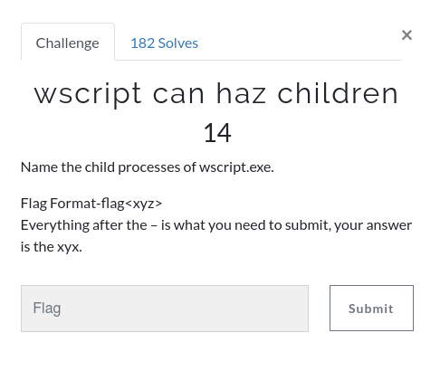
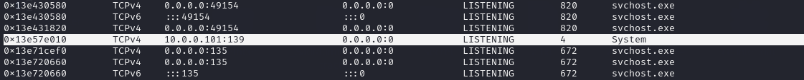
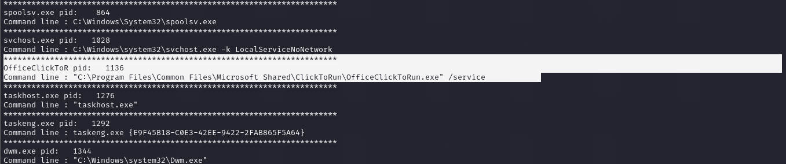
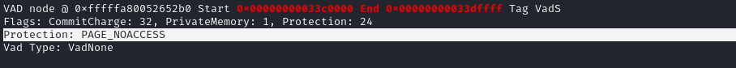
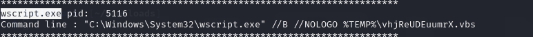
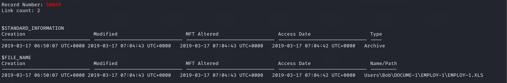

## Link challenge 
> https://www.dropbox.com/sh/4qfk1miauqbvqst/AAAVCI1G8Sc8xMoqK_TtmSbia?dl=0
## Memory forensics 
### get your volatility on 
> Q : “What is the SHA1 hash of triage.mem?”
- A : I used sha1sum <filename>
```
┌──(kali㉿kali)-[~/Downloads]
└─$ sha1sum Adam\ Ferrante\ -\ Triage-Memory.mem 
c95e8cc8c946f95a109ea8e47a6800de10a27abd  Adam Ferrante - Triage-Memory.mem

```
> c95e8cc8c946f95a109ea8e47a6800de10a27abd
### pr0file 
> Q : “What profile is the most appropriate for this machine? (ex: Win10x86_14393)”

> A : I used imageinfo of volatility 
```
┌──(kali㉿kali)-[~/volatility]
└─$ python2 vol.py -f /home/kali/Downloads/Adam\ Ferrante\ -\ Triage-Memory.mem imageinfo
Volatility Foundation Volatility Framework 2.6.1
INFO    : volatility.debug    : Determining profile based on KDBG search...
          Suggested Profile(s) : Win7SP1x64, Win7SP0x64, Win2008R2SP0x64, Win2008R2SP1x64_24000, Win2008R2SP1x64_23418, Win2008R2SP1x64, Win7SP1x64_24000, Win7SP1x64_23418
                     AS Layer1 : WindowsAMD64PagedMemory (Kernel AS)
                     AS Layer2 : FileAddressSpace (/home/kali/Downloads/Adam Ferrante - Triage-Memory.mem)
                      PAE type : No PAE
                           DTB : 0x187000L
                          KDBG : 0xf800029f80a0L
          Number of Processors : 2
     Image Type (Service Pack) : 1
                KPCR for CPU 0 : 0xfffff800029f9d00L
                KPCR for CPU 1 : 0xfffff880009ee000L
             KUSER_SHARED_DATA : 0xfffff78000000000L
           Image date and time : 2019-03-22 05:46:00 UTC+0000
     Image local date and time : 2019-03-22 01:46:00 -0400                                                                                    
```
> Win7SP1x64
### hey, write this down
> Q : “What was the process ID of notepad.exe?”
- A : To see process of notepad I use pslist and `grep -i note`
```
┌──(kali㉿kali)-[~/volatility]
└─$ python2 vol.py -f /home/kali/Downloads/Adam\ Ferrante\ -\ Triage-Memory.mem --profile=Win7SP1x64 pslist | grep -i note
Volatility Foundation Volatility Framework 2.6.1
0xfffffa80054f9060 notepad.exe            3032   1432      1       60      1      0 2019-03-22 05:32:22 UTC+0000               
```
> 3032
### wscript can haz children
> Q : 
- A : To find name child process, I continue to use psslist and grep `parent process` of wscipt.exe
```
┌──(kali㉿kali)-[~/volatility]
└─$ python2 vol.py -f /home/kali/Downloads/Adam\ Ferrante\ -\ Triage-Memory.mem --profile=Win7SP1x64 pslist | grep -i wscript.exe
Volatility Foundation Volatility Framework 2.6.1
0xfffffa8005a80060 wscript.exe            5116   3952      8      312      1      1 2019-03-22 05:35:32 UTC+0000        
```
- I have the pid of `wscript.exe` as 5116, so the child process of `wscript.exe` will have ppid as 5116
```
┌──(kali㉿kali)-[~/volatility]
└─$ python2 vol.py -f /home/kali/Downloads/Adam\ Ferrante\ -\ Triage-Memory.mem --profile=Win7SP1x64 pslist | grep 5116          
Volatility Foundation Volatility Framework 2.6.1
0xfffffa8005a80060 wscript.exe            5116   3952      8      312      1      1 2019-03-22 05:35:32 UTC+0000                                 
0xfffffa8005a1d9e0 UWkpjFjDzM.exe         3496   5116      5      109      1      1 2019-03-22 05:35:33 UTC+0000            
```
> UWkpjFjDzM.exe
### tcpip settings
> Q : “What was the IP address of the machine at the time the RAM dump was created?”
- I used plugin netscan and find `SYSTEM`
- 
> 10.0.0.101
### intel
> Q : “Based on the answer regarding to the infected PID, can you determine what the IP of the attacker was?”
- Based on the answer of  `wscript can haz children`, I have determined process of attacker 
- I used plugin netscan | grep UWkpjFjDzM
```
┌──(kali㉿kali)-[~/volatility]
└─$ python2 vol.py -f /home/kali/Downloads/Adam\ Ferrante\ -\ Triage-Memory.mem --profile=Win7SP1x64 netscan | grep UWkpjFjDzM
Volatility Foundation Volatility Framework 2.6.1
0x13e397190        TCPv4    10.0.0.101:49217               10.0.0.106:4444      ESTABLISHED      3496     UWkpjFjDzM.exe 
```
> 10.0.0.106
### i <3 windows dependencies 
> Q : “What process name is VCRUNTIME140.dll associated with?”
```
┌──(kali㉿kali)-[~/volatility]
└─$ python2 vol.py -f /home/kali/Downloads/Adam\ Ferrante\ -\ Triage-Memory.mem --profile=Win7SP1x64 filescan | grep -i VCRUNTIME140.dll
Volatility Foundation Volatility Framework 2.6.1
0x000000013e231a30      6      0 R--r-d \Device\HarddiskVolume2\Program Files (x86)\Microsoft Office\root\Office16\vcruntime140.dll
0x000000013e4ed250      7      0 R--r-d \Device\HarddiskVolume2\Program Files\Common Files\Microsoft Shared\ClickToRun\vcruntime140.dll
```
- Review the directory path using command line
- 
> OfficeClickToR
### mal-ware-are-you
> Q : “What is the md5 hash value the potential malware on the system?”
- We have a useful plugin for process rendering : `procdump`
```
┌──(kali㉿kali)-[~/volatility]
└─$ python2 vol.py -f /home/kali/Downloads/Adam\ Ferrante\ -\ Triage-Memory.mem --profile=Win7SP1x64 procdump --pid 3496 -D ~/Downloads
Volatility Foundation Volatility Framework 2.6.1
*** Failed to import volatility.plugins.mimikatz (AttributeError: 'module' object has no attribute 'Int32ul')
Process(V)         ImageBase          Name                 Result
------------------ ------------------ -------------------- ------
0xfffffa8005a1d9e0 0x0000000000400000 UWkpjFjDzM.exe       OK: executable.3496.exe
```
- Continue, use md5sum : `690ea20bc3bdfb328e23005d9a80c290  executable.3496.exe`
> 690ea20bc3bdfb328e23005d9a80c290
### lm-get bobs hash 
> Q : “What is the LM hash of bobs account?”
- I used volatility dump hash of account with plugin hashdump `hashdump        Dumps passwords hashes (LM/NTLM) from memory`
```
Administrator:500:aad3b435b51404eeaad3b435b51404ee:31d6cfe0d16ae931b73c59d7e0c089c0:::
Guest:501:aad3b435b51404eeaad3b435b51404ee:31d6cfe0d16ae931b73c59d7e0c089c0:::
Bob:1000:aad3b435b51404eeaad3b435b51404ee:31d6cfe0d16ae931b73c59d7e0c089c0:::
```
> aad3b435b51404eeaad3b435b51404ee
### vad the impaler 
> Q : What protections does the VAD node at 0xfffffa800577ba10 have?
- Use plugin valinfo
```
┌──(kali㉿kali)-[~/volatility]
└─$ python2 vol.py -f /home/kali/Downloads/Adam\ Ferrante\ -\ Triage-Memory.mem --profile=Win7SP1x64 vadinfo | grep -i 0xfffffa800577ba10 -B 5 -A 5 
Volatility Foundation Volatility Framework 2.6.1
NumberOfMappedViews:                2 NumberOfUserReferences:          3
Control Flags: Commit: 1
First prototype PTE: fffff8a001021f78 Last contiguous PTE: fffff8a001021ff0
Flags2: 

VAD node @ 0xfffffa800577ba10 Start 0x0000000000030000 End 0x0000000000033fff Tag Vad 
Flags: NoChange: 1, Protection: 1
Protection: PAGE_READONLY
Vad Type: VadNone
```
> PAGE_READONLY
### more vads?! 
> Q : “What protections did the VAD starting at 0x00000000033c0000 and ending at 0x00000000033dffff have?”
- `python2 vol.py -f /home/kali/Downloads/Adam\ Ferrante\ -\ Triage-Memory.mem --profile=Win7SP1x64 vadinfo | grep "0x00000000033c0000 End 0x00000000033dffff" -B 5 -A 5`
- 
> PAGE_NOACCESS
### vacation bible school
> Q : There was a VBS script run on the machine. What is the name of the script? (submit without file extension)
- When i used cmdline i see file vbs at `wscript.exe`
- 
> vhjReUDEuumrX.vbs
### thx microsoft
> Q : An application was run at 2019-03-07 23:06:58 UTC, what is the name of the program? (Include extension)
- I used plugin `timeliner` 
```
┌──(kali㉿kali)-[~/volatility]
└─$ python2 vol.py -f /home/kali/Downloads/Adam\ Ferrante\ -\ Triage-Memory.mem --profile=Win7SP1x64 timeliner | grep "2019-03-07"
Volatility Foundation Volatility Framework 2.6.1
2019-03-07 23:06:58 UTC+0000|[SHIMCACHE]| \??\C:\Program Files (x86)\Microsoft\Skype for Desktop\Skype.exe| 

```
- Additionally, we can also use shimcache
```
┌──(kali㉿kali)-[~/volatility]
└─$ python2 vol.py -f /home/kali/Downloads/Adam\ Ferrante\ -\ Triage-Memory.mem --profile=Win7SP1x64 shimcache | grep "2019-03-07"          
Volatility Foundation Volatility Framework 2.6.1
2019-03-07 23:06:58 UTC+0000   \??\C:\Program Files (x86)\Microsoft\Skype for Desktop\Skype.exe
```
> Skype.exe
### lightbulb moment
> Q : What was written in notepad.exe in the time of the memory dump?
- I dump notepad.exe to Downloas. After, I used strings | grep  to search
```
┌──(kali㉿kali)-[~/volatility]
└─$ python2 vol.py -f /home/kali/Downloads/Adam\ Ferrante\ -\ Triage-Memory.mem --profile=Win7SP1x64 memdump --pid 3032 -D ~/Downloads 
Volatility Foundation Volatility Framework 2.6.1
*** Failed to import volatility.plugins.mimikatz (AttributeError: 'module' object has no attribute 'Int32ul')
************************************************************************
Writing notepad.exe [  3032] to 3032.dmp
```
- and 
```
┌──(kali㉿kali)-[~/Downloads]
└─$ strings -e l 3032.dmp| grep -i "flag<"
flag<REDBULL_IS_LIFE>
flag<Th>
flag<Th>
flag<TheK>
flag<TheK>
```
> flag<REDBULL_IS_LIFE>
### 8675309
> Q : What is the shortname of the file at file record 59045?
```
Managed file transfer (MFT) is a technology platform that uses administrative controls, support for security protocols (like HTTPS, SFTP, FTPS), and automation capabilities to help companies securely share various types of data, including sensitive or compliance-protected data as well as high-volume data.
```
- We have plugin useful is `mftparser`
- 
> EMPLOY~1.XLS