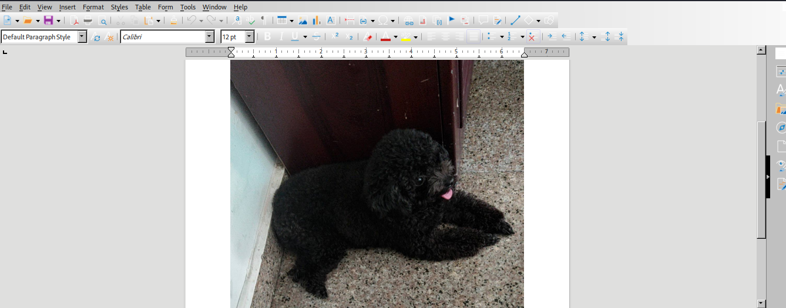
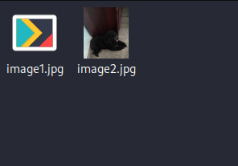

## Đề 
- Có thể tải file đề [ở đây](File_challenge/Lost.docx)
## Giải 
- Sau khi tải file .docx về máy em bắt đầu mở lên và thấy 1 hình ảnh
- 
- Ý tưởng của em là tìm thông tin từ bức ảnh này 

- Để tìm được em trích xuất file ảnh ra bằng công cụ `binwalk` hoặc có thể đổi đuôi file thành đuôi nén rồi extract ra 
- Sau khi thành công em thu được 1 vài file như sau 
```text
.
./_rels
./_rels/.rels
./word
./word/theme
./word/theme/theme1.xml
./word/document.xml
./word/_rels
./word/_rels/document.xml.rels
./word/webSettings.xml
./word/fontTable.xml
./word/settings.xml
./word/media
./word/media/image1.jpg
./word/media/image2.jpg
./word/styles.xml
./docProps
./docProps/app.xml
./docProps/core.xml
./[Content_Types].xml

```
- Ở đây có 1 vài file ảnh 
```text
./word/media/image1.jpg
./word/media/image2.jpg
```
- Mở xem trực tiếp xem có gì không 

- Ta sẽ lần lượt tìm 1 vài thông tin của từng ảnh 
```text
┌──(trongtam㉿kali)-[~/Downloads/Lost/word/media]
└─$ exiftool *        
======== image1.jpg
ExifTool Version Number         : 12.65
File Name                       : image1.jpg
Directory                       : .
File Size                       : 188 kB
File Modification Date/Time     : 1980:01:01 00:00:00+07:00
File Access Date/Time           : 2024:01:07 23:38:07+07:00
File Inode Change Date/Time     : 2024:01:07 23:35:48+07:00
File Permissions                : -rw-r--r--
File Type                       : ZIP
File Type Extension             : zip
MIME Type                       : application/zip
Zip Required Version            : 20
Zip Bit Flag                    : 0x0009
Zip Compression                 : Deflated
Zip Modify Date                 : 2022:08:09 04:22:50
Zip CRC                         : 0x4f89c44a
Zip Compressed Size             : 188047
Zip Uncompressed Size           : 188761
Zip File Name                   : test.jpg
======== image2.jpg
ExifTool Version Number         : 12.65
File Name                       : image2.jpg
Directory                       : .
File Size                       : 177 kB
File Modification Date/Time     : 1980:01:01 00:00:00+07:00
File Access Date/Time           : 2024:01:07 23:38:07+07:00
File Inode Change Date/Time     : 2024:01:07 23:35:48+07:00
File Permissions                : -rw-r--r--
File Type                       : JPEG
File Type Extension             : jpg
MIME Type                       : image/jpeg
JFIF Version                    : 1.01
Resolution Unit                 : None
X Resolution                    : 1
Y Resolution                    : 1
Image Width                     : 1128
Image Height                    : 1280
Encoding Process                : Progressive DCT, Huffman coding
Bits Per Sample                 : 8
Color Components                : 3
Y Cb Cr Sub Sampling            : YCbCr4:2:0 (2 2)
Image Size                      : 1128x1280
Megapixels                      : 1.4
    2 image files read
```
- Có thể thấy rằng file 1 là file zip chứ không phải file ảnh 
- Em sẽ tiến hành đổi đuôi file sau đó giải nén 
> mv image1.jpg image1.zip 
- Giải nén không thành công vì file cần mật khẩu
- Em sẽ sử dụng đến john để crack mật khẩu 
> zip2john image1.zip > hash
> john --wordlist=/usr/share/wordlistsrockyou.txt hash 
- Mật khẩu nén là : `loveyou`
- Sau khi giải nén chúng ta tiếp tục thu được 1 file ảnh 
- Nhưng file ảnh sau khi trích xuất giống hệt file gốc 
- Kiểm tra lại 1 chút thi thấy file ảnh gốc `177 kB` còn file sau khi trích xuất có kích thước `189 kB` có nghĩa là còn gì đó giấu bên trong 
- Ban đầu em nghĩ là stego, mà muốn dùng stego phải qua mật khẩu 
- Ta sẽ sử dụng công cụ crack mật khẩu stego
> stegcracker test.jpg
- Sau khi chạy 1 hồi ta xuất ra file test.jpg.out
- Đọc file này ta thu được flag 
> hackathon{bbc649da49b02570835df50fd173bff7d4933f07}


