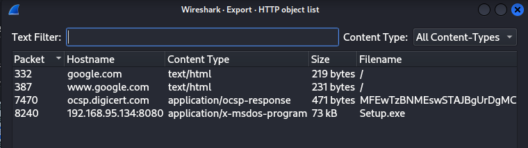
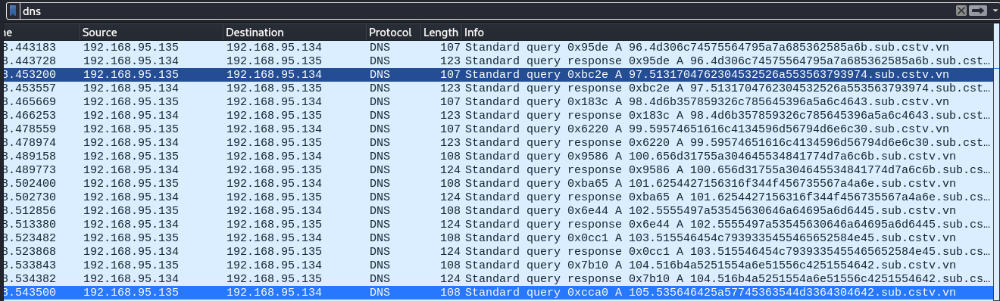
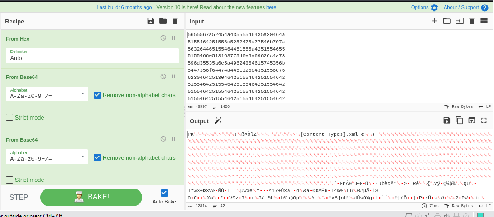

## Đề
> Đề có thể được lấy [tại đây](File_challenge/capture.pcap)  
## Giải 
- Sau khi tải file .pcap xuống em lần lượt phân tích thông qua công cụ wireshark và tshark
- Trong phần export object http ta sẽ thấy được 1 file `Setup.exe ` chứa virus 
- 
- Đây không phải là phần chúng ta cần giải
- Lướt qua các giao thức truyền tin như dns, tcp, http thì tại filter dns ta thấy được 1 số thứ như sau 
- 
- Rõ ràng đây chính là `dns exfiltration` 
- Em sẽ dùng 1 vài filter để lọc các đoạn strings này ra 
> tshark -r capture.pcap -Y "dns && ip.dst == 192.168.95.134" -T fields -e dns.qry.name > data.txt
- Em sẽ đưa nó vào 1 file data.txt để xử lý bằng python
- Các chuỗi trong file sẽ có dạng như sau 
```text
688.546e64694c326c695232777253475531.sub.cstv.vn
689.62556c735630564c52476f3163305235.sub.cstv.vn
690.57565a445a47525a6246527663554e77.sub.cstv.vn
691.546b52455648524b515538724f453570.sub.cstv.vn
692.57567035563239795a7a464e656d4a31.sub.cstv.vn
693.4e557051566b7473616b347263484e61.sub.cstv.vn
694.536d355a5632463064444d30546e6b76.sub.cstv.vn
695.4e48567653307457656a4a745245354f.sub.cstv.vn
696.5433524f4c334d775656645956564a4b.sub.cstv.vn
697.54556c6856334e43616b68706547686c.sub.cstv.vn
```
- Để lấy được ta cần xoá số thứ tự và đoạn `.sub.cstv.vn` trong mỗi dòng 
```text
with open('data.txt') as file:
        for line in file:
                list = line.split('.')
                print(list[1])

```
- Sau khi chạy ta sẽ được 
```text
txt
5655567a52454a43555546435a30464a
5155464251556c5252475a77546b707a
563264465155464451555a4251554655
5155466e51316377546e5a69626c4a73
596d35535a6c5a49624864615745356b
5447356f64474a4451326c4351556c76
62304642513046425155464251554642
...
51554642515546425155464251554642
51556b3063304642516d74694d6b3552
5932303564324e354f57686a53454631
5a5563786331564663305a435a304642
51554642544546426330463355556c42
5155526a646b46425155464251543039
0d0a
txt
```
- Xoá các kí tự txt ở đầu và cuối sau đó đưa lên CyberChef để decode
- 
- Lưu file về ta được flag 
> Flag : CSTV_2023_{ba69f4c8c869295a9a8024b32a177bc63a942ffd}
