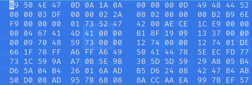

## Đề 
> Đề có thể được lấy tại file backup [ở đây](File_challenge/)
## Giải 
- Sau khi tải 2 file xuống, em thu được 1 file ảnh bị hỏng và 1 file âm thanh có đuôi .wav
### Quá trình xử lý file .wav
- Em tiến hành mở file .wav trước thì em thấy có mã morse 
- Tiếp theo em upload file âm thanh lên [trang morsecode.world](https://morsecode.world/international/decoder/audio-decoder-adaptive.html) để tiến hành lấy đoạn text được ẩn bên trong 
> text : W H 4 T Y 0 U H 3 4 R 1 S N 0 T W H 4 T Y (WH4TY0UH34R1SN0TWH4TY0US33KF0R)
### Quá trình xử lý file ảnh 
- Đầu tiên em dùng công cụ hexeditor để xem magic byte của nó 
- 
- Và đây là phần ascii 
- 
- Có thể dễ dàng nhìn thấy phần magic byte đã đúng, nhưng file bị sai 1 số phần nhất định khiến cho file png bị hỏng
- Em sẽ kiểm tra nó bằng công cụ `pngcheck` 
```text
┌──(trongtam㉿kali)-[~/Downloads]
└─$ pngcheck -v 3y3L4g.png
File: 3y3L4g.png (882164 bytes)
  chunk IHDR at offset 0x0000c, length 13
    991 x 554 image, 24-bit RGB, non-interlaced
  chunk sRGB at offset 0x00025, length 1
    rendering intent = perceptual
  chunk gAMA at offset 0x00032, length 4: 0.45455
  CRC error in chunk gAMA (computed 0bfc6105, expected 19091337)
ERRORS DETECTED in 3y3L4g.png
```
- Có thể thấy file bị lỗi phần CRC, và đồng thời phần IDAT
- [image](image/3.PNG)
- Để fix phần IDAT ta chỉ cần đổi mã hex tương đương 
- [image](image/4.PNG)
- Còn về phần CRC đầu tiên theo pngcheck thì em chỉnh tại nơi có hex `19091337` sang `0bfc6105`
- Sau đó em check lại thêm 1 lần nữa 
```text
┌──(trongtam㉿kali)-[~/Downloads]
└─$ pngcheck -v 3y3L4g3.png 
File: 3y3L4g3.png (882164 bytes)
  chunk IHDR at offset 0x0000c, length 13
    991 x 554 image, 24-bit RGB, non-interlaced
  chunk sRGB at offset 0x00025, length 1
    rendering intent = perceptual
  chunk gAMA at offset 0x00032, length 4: 0.45455
  chunk pHYs at offset 0x00042, length 9: 4724x4724 pixels/meter (120 dpi)
:  invalid chunk length (too large)
ERRORS DETECTED in 3y3L4g3.png
```
- Bây giờ pngcheck báo length quá dài 
- Sau khi kiểm tra em có công thức tính IDAT như sau (điểm bắt đầu tiếp theo của IDAT) - (điểm bắt đầu của IDAT) - (8 bytes để đủ độ dài)
- Thay vào 0x10004 - 0x57 - 0x8 == 0xffa5, Để tính được đoạn này thì em dùng [máy tính hexa](https://miniwebtool.com/vi/hex-calculator/)
- Đây là kết quả sau khi sửa
- [image](image/5.png)
- Mở ảnh ra thì em được 1 ảnh như sau 
- [image](image/6.png)
- Chúng ta lại có thêm 1 dữ kiện nữa từ ảnh `123321232123`
- Tiếp theo em sẽ stego 
- Bởi vì stego không áp dụng cho file .png nên em sẽ dùng cho file .wav
- Em sẽ thử cả 2 mật khẩu đề cho `WH4TY0UH34R1SN0TWH4TY0US33KF0R` và `123321232123` thì mật khẩu `123321232123` chính xác
- Sau khi extract xong em được 1 file `Br41nL4g.txt` mở file ra thì có đoạn chuỗi kí tự 
```
+++>-<+-.-+.+-+
++++--+---+<.-+
+>++--+--.+.--+
+++.--+--<+>--+
++++--+---+-.-.
++++--..-.+--.<
++<+--<.->+--<.
++<+.--+-++--..
++<++--+.++.->.
++<++--.-+++-+.
[>-.+--+-+++-+.
>+]-+--+-+++-+.
++>-+--+-+++-+.
>+>-+..+-+++-+.
++>-.>>+-+++-+. 
```
- 1 hồi tìm hiểu thì em xác định đây chính là 1 loại ngôn ngữ lập trình cổ 
- Để complie em sử dụng [complie online](https://www.tutorialspoint.com/execute_brainfk_online.php) để chạy nó nhưng không thành công
- Em có tìm hiểu chatgpt và thu được 1 kết quả như sau 
- [image](image/7.PNG)
- Có thể thấy đối với chương trình ta extract được là khá ngắn, nhưng nếu đọc thẳng đứng thì nó sẽ hợp lý hơn
- Để làm được điều này em sẽ viết 1 script ngắn 
```
string1 = '+++>-<+-.-+.+-+'
string2 = '++++--+---+<.-+'
string3 = '+>++--+--.+.--+'
string4 = '+++.--+--<+>--+'
string5 = '++++--+---+-.-.'
string6 = '++++--..-.+--.<'
string7 = '++<+--<.->+--<.'
string8 = '++<+.--+-++--..'
string9 = '++<++--+.++.->.'
string10 = '++<++--.-+++-+.'
string11 = '[>-.+--+-+++-+.'
string12 = '>+]-+--+-+++-+.'
string13 = '++>-+--+-+++-+.'
string14 = '>+>-+..+-+++-+.'
string15 = '++>-.>>+-+++-+.'

result = ""
for i in range(0, 15):
    for k in range(1, 16):
        result += globals()[f'string{k}'][i]

print(result)
```
- Đây là kết quả 
```
++++++++++[>+>+++>+++++++>++++++++++<<<<-]>>>>++.++++++.-----------.++++++.<------------.>+++++.<------.>-----..++.+++++.-------.--------.<-.>+++++++++++++++++++++++.<.>----.+++++++.--.---------------.<.>++++++++++.<.........
```
- Sau khi compile em được flag : `flag:l4gging_3v3rywh3r333333333`
> FLag : CSTV_2023_{l4gging_3v3rywh3r333333333}


