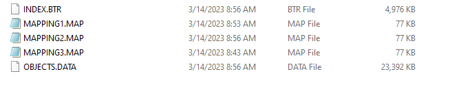
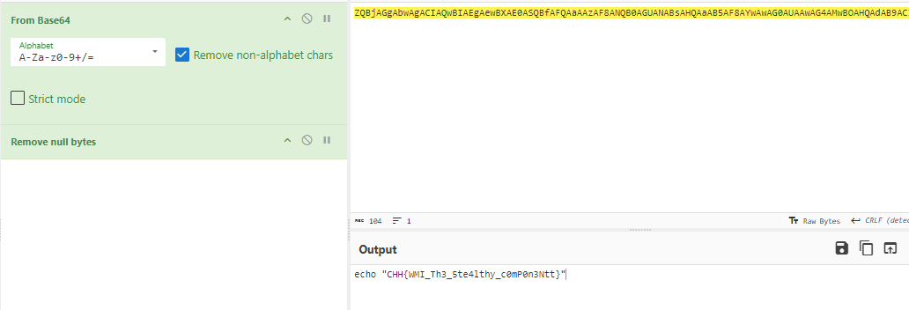

## Description
>  Đội CSIRT của chúng tôi được yêu cầu xử lý sự cố trên một máy chủ mà chúng tôi đã xử lý xong cách đây vài ngày. Vì vậy chúng tôi tin rằng vẫn còn một cơ chế persistence nào đó của kẻ tấn công mà chúng tôi đã bỏ sót
## Link challenge
> https://battle.cookiearena.org/challenges/digital-forensics/event-subscription
## Solution 
- Sau khi tải xuống ta thu được các file như sau  
- 
- Dựa vào 2 file *.btr và objects.data ta có thể xác định được đây là các file của WMI

<details>
<summary>
Lý thuyết WMI
</summary>

- WMI là Công cụ quản lý Windows. Đó là một bộ công cụ cho phép quản trị viên quản lý và giám sát hệ thống Windows. Nó có thể được cài đặt theo mặc định trong mọi phiên bản Windows hiện đại.
- Đây cũng là một lựa chọn ưa thích của mã độc để có thể đạt được persistence trên hệ thống của nạn nhân. Một vài lý do để giải thích cho điều này: 
1. WMI là một tính năng mặc định của Windows: có nghĩa là nó sử dụng các tệp nhị phân có chữ ký, đáng tin cậy. Điều này giúp mã độc tránh bị whitelist và tránh bị phát hiện bởi các tool host-based.OBN 
2. WMI cung cấp khả năng thu thập và thay đổi thông tin cấu hình hệ thống. 
3. WMI cho phép tương tác remote. 
- Bên cạnh những lý do liệt kê ở trên, ta sẽ đề cập đến tính năng WMI event subscription, đây là tính năng được sử dụng rất nhiều bởi mã độc để có thể đạt được persistence.
- Khi tạo một WMI event subscription thì sẽ tạo ra một object được lưu trong WMI repository. 
WMI repository là một cơ sở dữ liệu chứa thông tin về các class của WMI, được lưu tại %windir%System32\Wbem\Repository.  Nó gồm các file sau: 
1. OBJECTS.DATA: Những object mà WMI quản lý 
2. INDEX.BTR: Mục lục các file được import và objects.data 
3. MAPPING[1-3].MAP: Thông tin chỉ mục cho phép WMI nhanh chóng định vị dữ liệu trong OBJECTS. DATA

</details>

- Bắt tay vào giải quyết vấn đề đầu tiên ta sử dụng công cụ có tên [WMI_Forensics](https://github.com/davidpany/WMI_Forensics) để truy xuất dữ liệu trong tệp objects 
```
┌──(kali㉿kali)-[~/Downloads/WMI_Forensics]
└─$ python2 PyWMIPersistenceFinder.py /home/kali/Downloads/OBJECTS.DATA

    Enumerating FilterToConsumerBindings...
    2 FilterToConsumerBinding(s) Found. Enumerating Filters and Consumers...

    Bindings:

        WMI-WMI
            Consumer: 
                Consumer Type: CommandLineEventConsumer
                Arguments:     powershell -e ZQBjAGgAbwAgACIAQwBIAEgAewBXAE0ASQBfAFQAaAAzAF8ANQB0AGUANABsAHQAaAB5AF8AYwAwAG0AUAAwAG4AMwBOAHQAdAB9ACIA
                Consumer Name: WMI
            Consumer: 
                Consumer Type: CommandLineEventConsumer
                Arguments:     \\.\root\subscription:__Win32Provider.Name="CommandLineEventConsumer"
                Consumer Name: WMI
                Other:         Event

            Filter: 
                Filter name:  WMI
                Filter Query: WmiProv


            Filter: 
                Filter name:  WMI
                Filter Query: SELECT * FROM __InstanceModificationEvent WITHIN 60 WHERE TargetInstance ISA 'Win32_PerfFormattedData_PerfOS_System' AND TargetInstance.SystemUpTime >= 240 AND TargetInstance.SystemUpTime < 325


```
- Thấy rằng tại Arguments ta sẽ có 1 lệnh thực thi powershell có option là -e 
```
cho phép bạn chạy một lệnh đã được mã hóa dưới dạng chuỗi base64.
```
- Decode base64 ta được đoạn mã thực thi 
- 
> Flag là : CHH{WMI_Th3_5te4lthy_c0mP0n3Ntt}

## Tài liệu nghiên cứu 
- https://sec.vnpt.vn/2023/08/windows-forensic-part-2-malware-persistence/
- https://www.hackthebox.com/blog/perseverance-biz-ctf-2022-forensics-writeup


