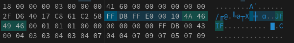
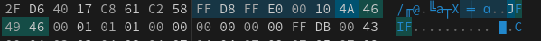
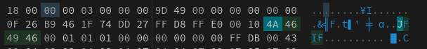
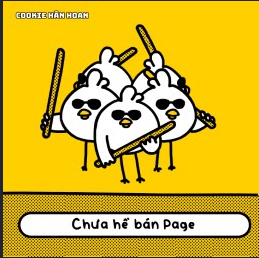
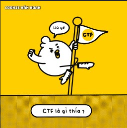
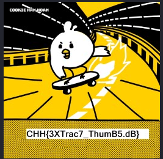

## Đề 
> In Windows, thumbs.db files are database files containing the small images displayed when you view a folder in Thumbnail view (as opposed to Tile, Icon, List, or Detail view). These files are automatically generated by Windows, and there is no harm in deleting them or excluding them from system backups.
## Lab
> https://battle.cookiearena.org/challenges/digital-forensics/thumbnail
## Giải
- Sau khi tải về và mở file lên, đầu tiên em kiểm tra bằng lệnh file để check xem lại file trước 
```
┌──(trongtam㉿kali)-[~/Downloads]
└─$ file Thumbs.db 
Thumbs.db: Composite Document File V2 Document, Cannot read section info
```
- Em tiếp tục với công cụ hexed.it để xem header của nó. Sau 1 vài tìm kiếm thì em phát hiện 1 vài điều khá thú vị
- 
- 
- 
- Có rất nhiều file ảnh JFIF ở trong đoạn mã của file. Em sẽ viết 1 scipt nhỏ để xem thử các ảnh này có gì 
```
with open("Thumbs.db", "rb") as file_r:
    strings = file_r.read()

    # Find the first occurrence
    batdau = strings.find(b'\xFF\xD8\xFF\xE0\x00\x10\x4A\x46\x49\x46\x00\x01', 0)
    print(batdau)
    # Check if the first occurrence is found
    if batdau != -1:
        # Find the second occurrence starting from the next position
        ketthuc = strings.find(b'\xFF\xD8\xFF\xE0\x00\x10\x4A\x46\x49\x46\x00\x01', batdau + 1) - 1
        print(ketthuc)
        # Check if the second occurrence is found
        if ketthuc != -2:
            # Write the identified bytes to the "image.jfif" file
            with open("image.jfif", "wb") as file_w:
                file_w.write(strings[batdau:ketthuc + 1])
```
- Sau khi chạy em được ảnh đầu tiên và các chỉ số bắt đầu và kết thúc như sau `2584 27671`

- 
- Tiếp tục với ảnh thứ 2. Chỉ cần sửa chỉ số trong lệnh find để tìm kiếm 
> batdau = strings.find(b'\xFF\xD8\xFF\xE0\x00\x10\x4A\x46\x49\x46\x00\x01', 2584 + 1)
- 
- Chỉ số đầu và cuối tiếp theo : 27672 47127. Tiếp tục tìm 
> batdau = strings.find(b'\xFF\xD8\xFF\xE0\x00\x10\x4A\x46\x49\x46\x00\x01', 27672 + 1)
- 
- Chỉ số :  47128 68119. Tiếp tục tìm
> batdau = strings.find(b'\xFF\xD8\xFF\xE0\x00\x10\x4A\x46\x49\x46\x00\x01', 47128 + 1)
- 
> Flag : CHH{3XTrac7_ThumB5.dB}

