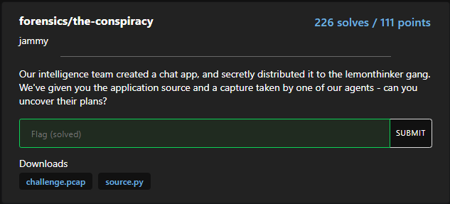
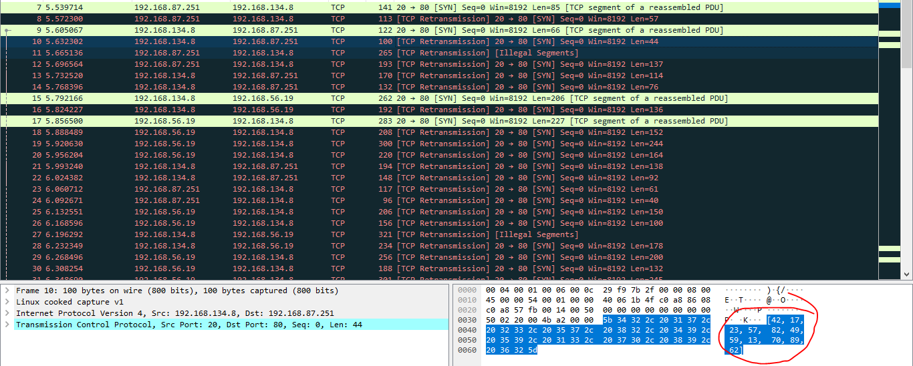
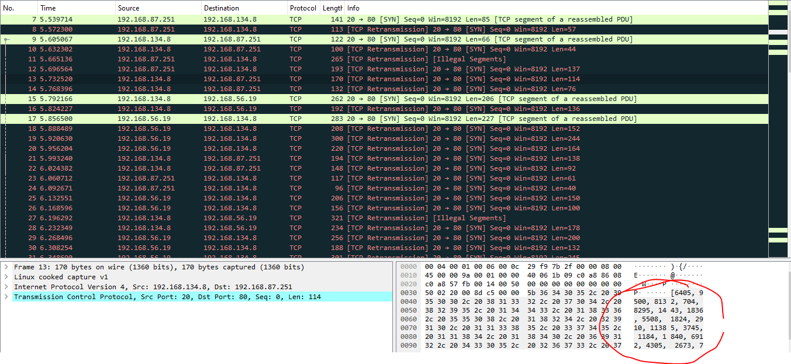
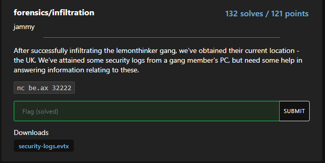
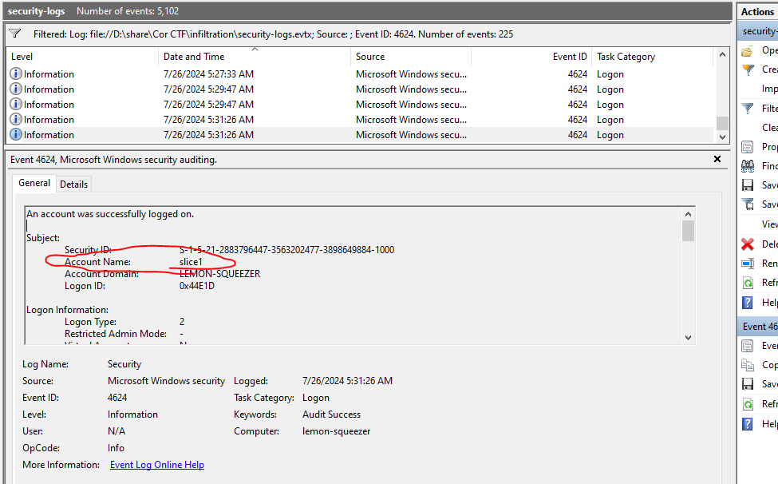
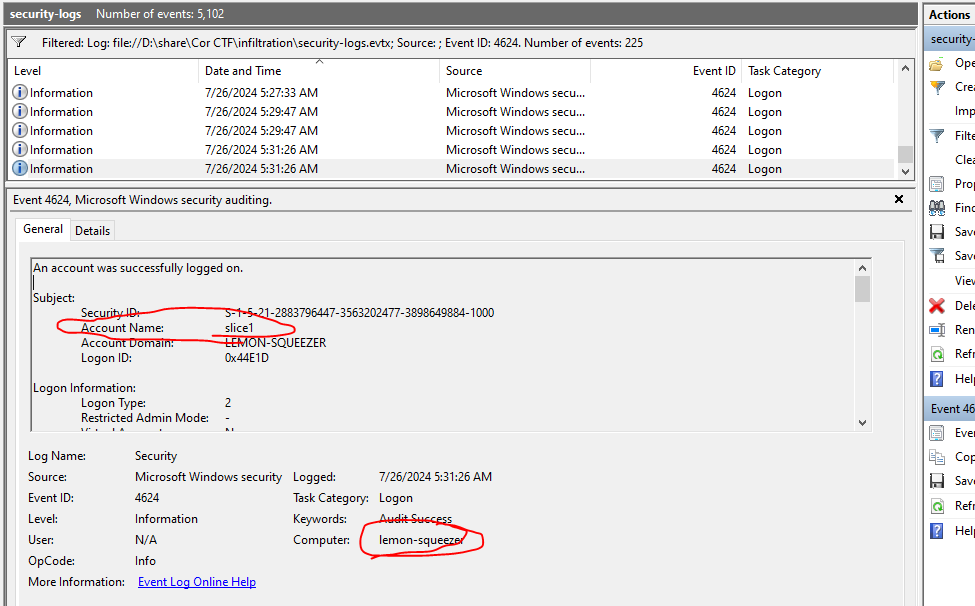
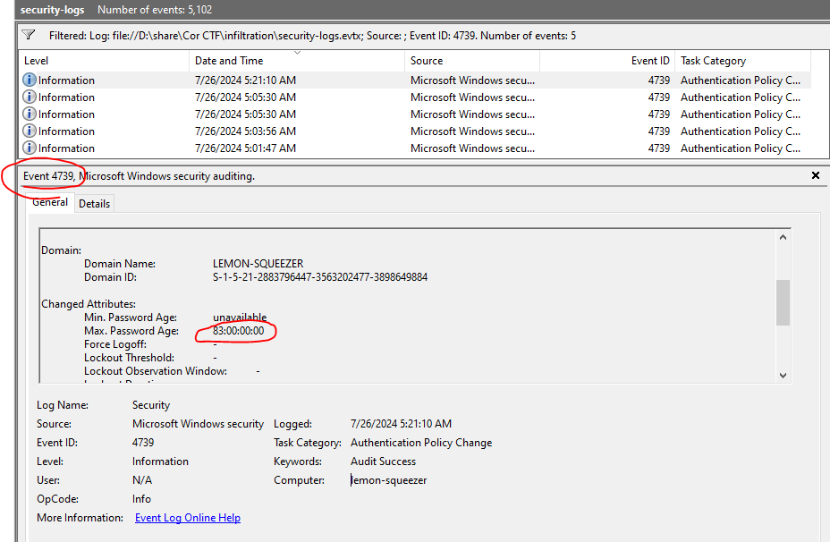
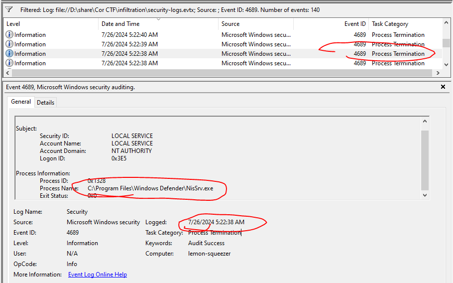
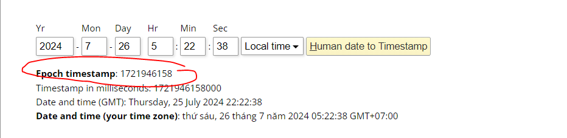

## the-conspiracy


### Solution 
- Challenge give me 2 file : 1 file pcap, and 1 file src python
- Open file source.py 
```
import random
from scapy.all import *
import csv

sources, destinations, messages = [], [], []

with open('chatlogs.csv', mode='r') as file:
    csv_reader = csv.reader(file)
    for row in csv_reader:
        sources.append(row[0]) 
        destinations.append(row[1])
        messages.append(row[2])

def encrypt(message):
    messagenums = []
    for character in message:
        messagenums.append(ord(character))
    keys = []
    for i in range(len(messagenums)):
        keys.append(random.randint(10, 100))

    finalmessage = []
    for i in range(len(messagenums)):
        finalmessage.append(messagenums[i] * keys[i])

    return keys, finalmessage


for i in range(len(messages)):
    finalmessage, keys = encrypt(messages[i]) 
    print(finalmessage, keys)
    packet1 = IP(src=sources[i], dst=destinations[i])/TCP(dport=80)/Raw(load=str(finalmessage))

    send(packet1)
    packet2 = IP(src=sources[i], dst=destinations[i])/TCP(dport=80)/Raw(load=str(keys))
    send(packet2)
```
- File python open 1 file `chatlogs.csv` with mode is "r", after saved row 1 in list source, row 2 in list destinations and row 3 in list messages
- The function encrypt performs the task of encrypting messages using a list of keys. Afterwards, it returns `finalMessage`, which is the result of `key * messageNums`.
```
def encrypt(message):
    messagenums = []
    for character in message:
        messagenums.append(ord(character))
    keys = []
    for i in range(len(messagenums)):
        keys.append(random.randint(10, 100))

    finalmessage = []
    for i in range(len(messagenums)):
        finalmessage.append(messagenums[i] * keys[i])

    return keys, finalmessage
```
- Finally, it sends finalmessage and key to port is 80 and TCP protocol
- I opened Wireshark and loaded the file challenge.pcap. I applied a TCP filter and observed the traffic.
- 
- 
- I identified the key and finalMessage. I used TShark to extract the data and saved in `data.txt`
> .\tshark.exe -r challenge.pcap -T fields -e tcp.segment_data > data.txt
- I will decode from hex to `ascii`. However, there are commas in some places. I will replace it, decode and decrypt
- It is my script 

```
import ast
def hex_to_ascii(hex_string):
    hex_string = hex_string.strip()
    byte_array = bytes.fromhex(hex_string)
    ascii_string = byte_array.decode('ascii')
    return ascii_string
def decrypt(finalmessage, key):
    for i in range(0, len(key)):
        character = (chr(int(finalmessage[i]/key[i])))
        print(character, end='')
with open("data.txt", "r") as file:
    lines = file.readlines()
#loại bỏ dấu , và khoảng trắng phía sau 
cleaned_lines = []
for line in lines:
    cleaned_lines.append(line.strip().replace(',', ''))
for i in range(0, len(cleaned_lines) - 1, 2):
    finalmessage = hex_to_ascii(cleaned_lines[i].strip())
    # chuyển qua list
    finalmessage = ast.literal_eval(finalmessage)
    key = hex_to_ascii(cleaned_lines[i + 1].strip())
    # chuyển qua list
    key = ast.literal_eval(key)
    #print(type(key))
    decrypt(finalmessage, key)
```
- This is result :
```
PS D:\share\Cor CTF\the-conspiracy> & C:/Users/ADMIN/AppData/Local/Programs/Python/Python38/python.exe "d:/share/Cor CTF/the-conspiracy/run.py"
hello blinkoidhello nighthow do we eliminate the msfroggersidk i'll ask slice1how do we eliminate the msfroggerswe can send them to the skibidi toiletor we can deprive them of their fanum taxslice1 is being uselesswhat's newblinkoid? message back :(oh errr... this sounds great! any more ideaswe could co-conspire with the afsand 
get them to infiltrate the msfroggersthat way team lemonthink reins supremeyour a genius!alright nighti have my own idealet's hear itso yk about the afsif we send our secret code over to themthey can use it to infiltrate the afswhat's our code again?i think it's corctf{b@53d_af_f0r_th3_w1n}hey night did you hear my ideayou had an idea? blinkoid just told me you were being uselesswhat the sigma
```
> Flag : corctf{b@53d_af_f0r_th3_w1n}

## infiltration
- 
### Solution
- Challenge give me 1 file logs and 1 connect netcat to answer question
-  I began connect netcat to `be.ax` in port `32222` 
- A notification pop up
> Hello agent. Thanks for your hard work in the field researching. We'll now ask you 6 questions on the information you've gathered.
I'd like to take this opportunity to remind you that our targets are located in the United Kingdom, so their timezone is BST (UTC +1).
#### Question 1 : We'd like to confirm what the username of the main user on the target's computer is. Can you provide this information?
- I filter with Event ID 4624 (Event ID 4624: An account was successfully logged on.)
- At the time near most, user slice1 login 
- 
- Check ID 4720 (Logs an event when a new user account is created.), user slice1 create 1 new user is `notabackdoor`
```
A user account was created.

Subject:
	Security ID:		S-1-5-21-2883796447-3563202477-3898649884-1000
	Account Name:		slice1
	Account Domain:		LEMON-SQUEEZER
	Logon ID:		0x44E1D

New Account:
	Security ID:		S-1-5-21-2883796447-3563202477-3898649884-1001
	Account Name:		notabackdoor
	Account Domain:		LEMON-SQUEEZER

Attributes:
	SAM Account Name:	notabackdoor
	Display Name:		<value not set>
	User Principal Name:	-
	Home Directory:		<value not set>
	Home Drive:		<value not set>
	Script Path:		<value not set>
	Profile Path:		<value not set>
	User Workstations:	<value not set>
	Password Last Set:	<never>
	Account Expires:		<never>
	Primary Group ID:	513
	Allowed To Delegate To:	-
	Old UAC Value:		0x0
	New UAC Value:		0x15
	User Account Control:	
		Account Disabled
		'Password Not Required' - Enabled
		'Normal Account' - Enabled
	User Parameters:	<value not set>
	SID History:		-
	Logon Hours:		All

Additional Information:
	Privileges		-
```
- High possibility user slice1 is target
> Answer : slice1

#### Quesion 2 : Now, we'd like the name of the computer, after it was renamed. Ensure that it is entered in exactly how it is in the logs.
- 
> Answer : lemon-squeezer

#### Question 3 : In order to prevent their lemons from moulding, the lemonthinkers changed the maximum password age. What is this value? Please enter it as an integer number in days.
- I searched on Google and found this link:  : https://www.ultimatewindowssecurity.com/securitylog/encyclopedia/event.aspx?eventid=4739, By filtering with event ID 4739, I easily obtained `the maximum password age`.
- 

> Answer : 83

#### Question 4 : It seems that our targets are incredibly smart, and turned off the antivirus. At what time did this happen? Give your answer as a UNIX timestamp.
- Using ChatGPT I found event ID 4689 (Records when a process ends. May be related to security software closing.)
-  I discovered the path `C:\Program Files\Windows Defender\NisSrv.exe` at `7/26/2024 5:22:38 AM`
- 
- I used https://www.epochconverter.com/ to convert  the timestamp
- 

> Answer : 1721946158

#### Question 5 : The main lemonthinker, slice1, hasn't learnt from the-conspiracy and has (again) downloaded some malware on the system. What is the name of the user created by this malware?
- I answered in question number 1
> Answer : notabackdoor

#### Question 6 : Finally, we'd like to know the name of the group that the user created by the malware is part of, which has the greatest security risk. What is this? 
- I used Event ID 4732, and see user slice1 in group `Administrators`
> Answer: Administrators

> Flag : corctf{alw4y5_l3m0n_7h1nk_b3f0r3_y0u_c0mm1t_cr1m3}


