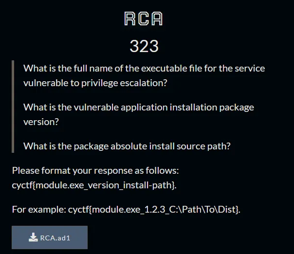
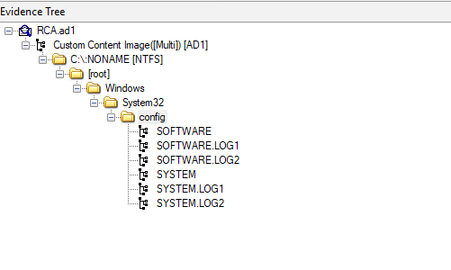
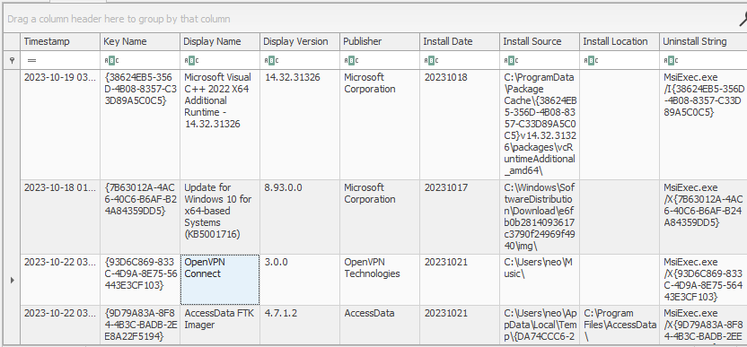
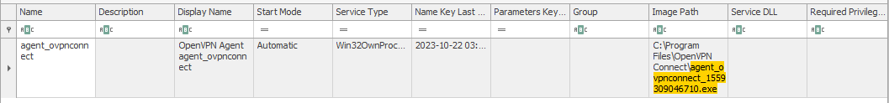

## Desciption 
- 
## Challenge 
> https://drive.google.com/file/d/1rJZy-c6KmiIWpV6GPRqL5s8N5WNZ2cRb/view?usp=sharing
## Solution
- Fistly, I openned file RCA.ad1 and I got files registry 
- 
- I will analyze with Registry Explorer tool
- Based on description, I find application in machine in `D:\share\SOFTWARE: Microsoft\Windows\CurrentVersion\Uninstall`
- I see a few applications : WinRAR 6.24 (64-bit), OpenVPN Connect, FTK image. Maybe the vulnerable app is openvpn.
- 
- I find in google along with version.
- See [here](https://www.exploit-db.com/exploits/47575)
- Ctrl + F : agent_ovpnconnect_1559309046710.exe
- 
> Flag : cyctf{agent_ovpnconnect_1559309046710.exe_3.0.0_C:\Program Files\OpenVPN Connect\agent_ovpnconnect_1559309046710.exe}