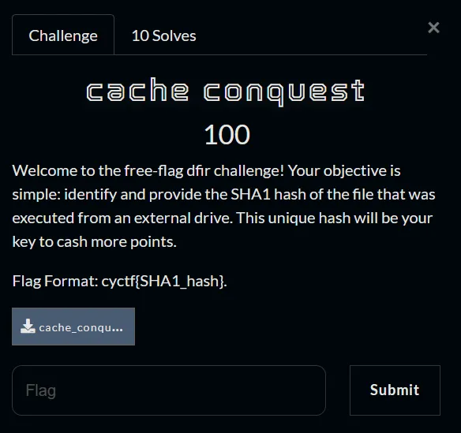
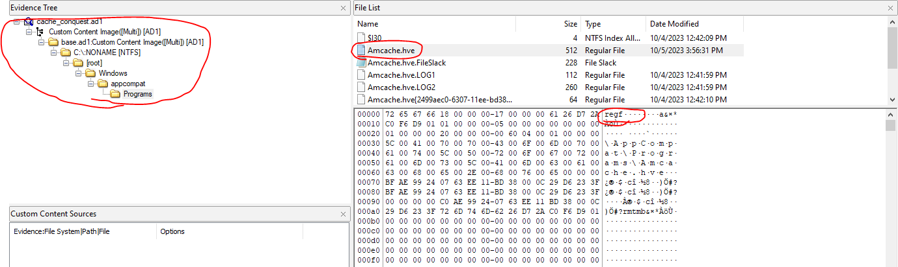
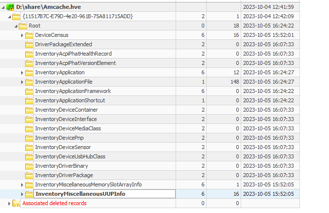
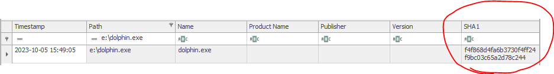

## Description
- 
## Link challenge 
> https://drive.google.com/file/d/1WtwppfPCvg19wUOwk_pDX-c2ACpH64jC/view?usp=sharing
## Solution 
- After download, I got file .ad1
- I will analyze by `FTK Image`
- After looking through all the directory paths, I saw a registry file, I took it down and analyzed it using the Registry Explorer tool
- 
- 
- In `D:\share\Amcache.hve: Root\InventoryApplicationFile`, I searched for the path containing the external drive
- 
> Flag : cyctf{f4f868d4fa6b3730f4ff24f9bc03c65a2d78c244}
