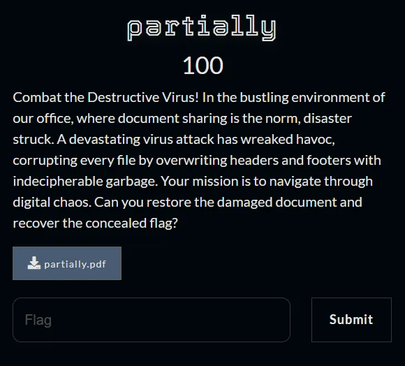
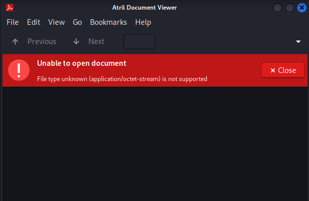

## Description
- 
## Link challenge 
> https://drive.google.com/file/d/1Ji0oXaw5EWZ7UGjAHMg4g5kG6Zg0YEJh/view?usp=sharing
## Solution
- After download, I got file *.pdf. But when I opened it it was broken
- 
- I checked with file command, so display data
```
┌──(kali㉿kali)-[~/Downloads]
└─$ file partially.pdf 
partially.pdf: data
```
- Continue, I checked with hexeditor but no result
- I checked with binwalk and found many image files
```
┌──(kali㉿kali)-[~/Downloads]
└─$ binwalk partially.pdf 

DECIMAL       HEXADECIMAL     DESCRIPTION
--------------------------------------------------------------------------------
574           0x23E           Zlib compressed data, default compression
857           0x359           JPEG image data, JFIF standard 1.01
46698         0xB66A          Zlib compressed data, default compression
46974         0xB77E          JPEG image data, JFIF standard 1.01
112105        0x1B5E9         Zlib compressed data, default compression
112386        0x1B702         JPEG image data, JFIF standard 1.01
112416        0x1B720         TIFF image data, big-endian, offset of first image directory: 8
175933        0x2AF3D         Zlib compressed data, default compression
176247        0x2B077         JPEG image data, JFIF standard 1.01
239667        0x3A833         JPEG image data, JFIF standard 1.01
302888        0x49F28         Zlib compressed data, default compression
303210        0x4A06A         JPEG image data, JFIF standard 1.01
303240        0x4A088         TIFF image data, big-endian, offset of first image directory: 8
323045        0x4EDE5         JPEG image data, JFIF standard 1.01
323075        0x4EE03         TIFF image data, big-endian, offset of first image directory: 8
415016        0x65528         Zlib compressed data, default compression
415299        0x65643         JPEG image data, JFIF standard 1.01
472120        0x73438         Zlib compressed data, default compression
472948        0x73774         JPEG image data, JFIF standard 1.01
519631        0x7EDCF         Zlib compressed data, default compression
520229        0x7F025         Zlib compressed data, default compression
542898        0x848B2         Zlib compressed data, default compression
```
- Check each file and receive a flag
- 

                          