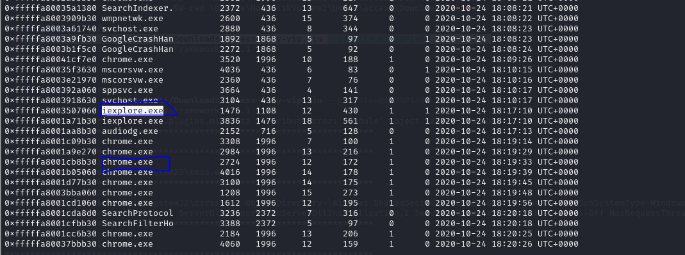
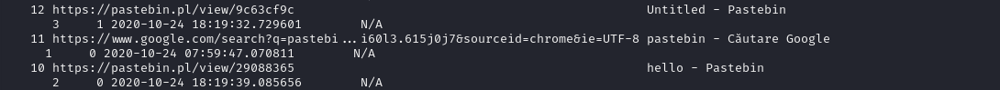

## Description
> “ We have a malicious employee who attempts to make other people join a secret club. The main message is “ come join us, we have a lot of money” . All we know is that he managed to look to something over the internet “
## Link challenge 
> https://app.cyber-edu.co/challenges/f232c950-12b4-11eb-bf77-ed4a11422a38?tenant=cyberedu
## Solution
- Trước tiên em xác định hướng giải quyết thông qua dòng description `All we know is that he managed to look to something over the internet`
- Em bắt đầu với việc lục lịch sử duyệt web trước 
- Để xem được em sử dụng pslist để xem có các process trình duyệt nào được mở 
- 
- Ở đây em thấy có 2 trình duyệt web là `Chrome` và `Internet Explorer`, em sử dụng 2 plugin là `chromehistory` và `iehistory`
```
┌──(kali㉿kali)-[~/volatility]
└─$ python2 vol.py -f /home/kali/Downloads/access-only-vip.bin --profile=Win7SP1x64 -h | grep history
Volatility Foundation Volatility Framework 2.6.1
                chromehistory   Scans for and parses potential Chrome url history
                cmdscan         Extract command history by scanning for _COMMAND_HISTORY
                consoles        Extract command history by scanning for _CONSOLE_INFORMATION
                firefoxhistory  Scans for and parses potential Firefox url history (places.sqlite moz_places table)
                iehistory       Reconstruct Internet Explorer cache / history
```
- **Với chrome history**
>  python2 vol.py -f /home/kali/Downloads/access-only-vip.bin --profile=Win7SP1x64 chromehistory 
- Em  thấy rằng có 1 vài cái link Pastebin ở đây
- 
- Mở lên thì thấy có 1 đường dẫn chứa password của cái gì đó 
```
poiuytrewq is the password needed for the secret code
```
- **Với iehistory**
- Khi sử dụng plugin em thấy tại đường dẫn `access@file:///C:/Users/access/Downloads/` có 1 file `flag.rar.rar`. Đây chắc hẳn là file cần password phía trên
- Em sử dụng filescan để tìm và dump file ra 
> python2 vol.py -f /home/kali/Downloads/access-only-vip.bin --profile=Win7SP1x64 filescan | grep -i flag
```
┌──(kali㉿kali)-[~/volatility]
└─$ python2 vol.py -f /home/kali/Downloads/access-only-vip.bin --profile=Win7SP1x64 filescan | grep -i flag
Volatility Foundation Volatility Framework 2.6.1
0x000000007de31070     16      0 R--r-- \Device\HarddiskVolume2\Users\access\Downloads\flag.ra
0x000000007e26ff20     16      0 -W-rwd \Device\HarddiskVolume2\Users\access\Desktop\flag.ra
0x000000007ee72200     16      0 RW---- \Device\HarddiskVolume2\Users\access\Desktop\flag.ra
0x000000007ee724a0     16      0 RW-rwd \Device\HarddiskVolume2\Users\access\Downloads\flag.ra
```

```
└─$ python2 vol.py -f /home/kali/Downloads/access-only-vip.bin --profile=Win7SP1x64 dumpfiles -Q 0x000000007de31070 --dump-dir ~/Downloads

```
- Sau khi dump thành công đổi đuôi và mở bằng mật khẩu ta được flag
> B8FA9EFBC8C8F043AFCA1B60F8F4C5245C54B5FF5BFB0603A71071F66C1EF295
> Format : ctf{B8FA9EFBC8C8F043AFCA1B60F8F4C5245C54B5FF5BFB0603A71071F66C1EF295}