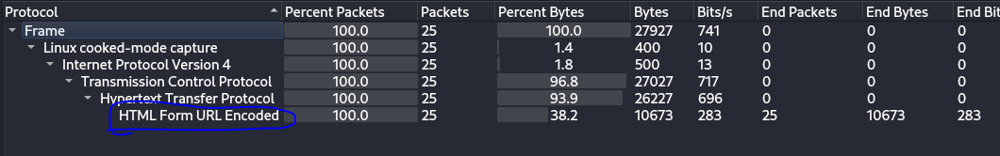
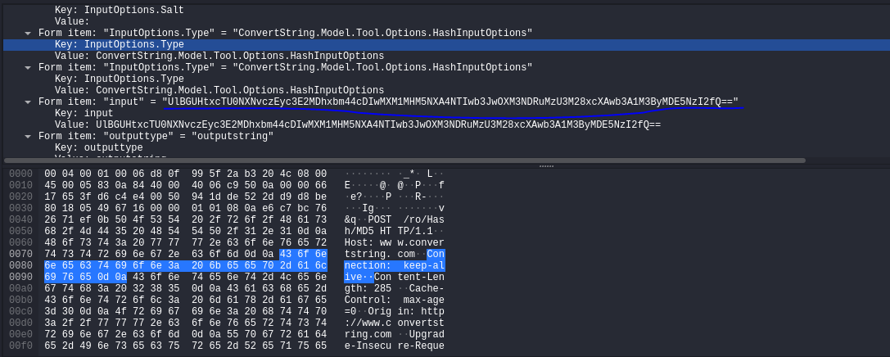
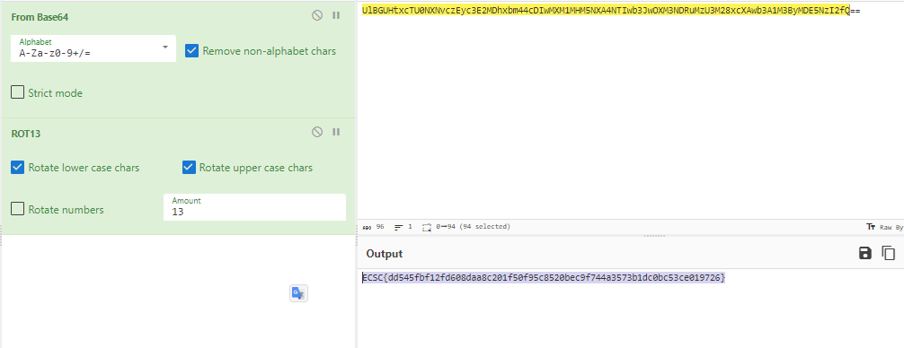

## Description 
> This is why you should not trust online encryption for your most awesome secrets.
## Link challenge 
> https://app.cyber-edu.co/challenges/55c7c4e0-7f21-11ea-9429-9367630f4e1e?tenant=cyberedu
## Solution 
- Em lọc qua các luồng tcp nhưng không có  kết quả
- Tiếp theo em kiểm tra các protocol có mặt trong tệp pcap 
- 
- Có 1 `HTML Form URL Encoded ` bên dưới, thêm nữa tiêu đề là encryption nên em filter chỗ này ra để xem 
- Tại form input có 1 chuỗi base64 
- 
- Dùng cynerchef để decode ra thì em được 1 chuỗi kí tự 
> RPFP{qq545sos12sq608qnn8p201s50s95p8520orp9s744n3573o1qp0op53pr019726}
- Nếu tinh ý ta có thể thấy RPFP{ nó giống với ECSC{ có thể nó bị mã hoá rot 
- Sửa thành rot13 ta thu được flag 
- 
> ECSC{dd545fbf12fd608daa8c201f50f95c8520bec9f744a3573b1dc0bc53ce019726} 