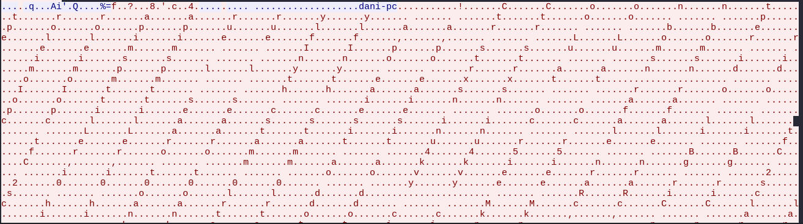
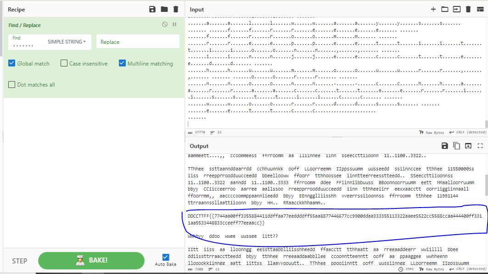

## Desciption
> I was helping my grandfather clean his PC and I lost the flag in the process.
## Link challenge 
> https://app.cyber-edu.co/challenges/24de0e00-355b-11eb-ac70-bbefff011eae?tenant=cyberedu
## Solution
- Đầu tiên em đặc biệt chú ý đến đề bài `team viewer`, sau khi tra google thì em xác định đây là `phần mềm dùng để điều khiển từ xa từ máy tính này sang máy tính khác, chia sẻ màn hình, chơi game trực tuyến, hội thảo trên web và truyền tập tin giữa các máy tính.`
- Vì số lượng packet quá lớn : 205969 gói tin, nên bắt buộc phải sử dụng bộ lọc
- Vì nó có liên quan đến điều khiển máy tính từ xa nên em filter theo vnc (Virtual Network Computing) trước và kiểm tra luồng dữ liệu của nó 
```
VNC stands for Virtual Network Computing. It is a graphical desktop-sharing system that allows remote control of another computer. The VNC protocol is a remote desktop sharing protocol that enables users to control a computer desktop remotely. The protocol works by transmitting keyboard and mouse events from the local machine to the remote machine and transmitting the graphical screen updates back to the local machine. This allows a user to remotely access and control another computer, as if they were sitting in front of it. The VNC protocol is commonly used in IT support and remote working scenarios.
```
- Tại luồng số 413 có 1 vài chữ được phân tách bởi các kí tự "." 
- 
- Sử dụng cyberchef để xử lý 
- 
- Code script để xử lý flag 
```
string = "DDCCTTFF{{7744aa00ff3355884411ddffaa77eeddddff55aa8877446677cc9900ddaa333355113322aaee5522cc5588ccaa444400ff3311aa5533448833cceeff77eeaacc}}"
for i in range(0, len(string)):
	if i%2==0:
		print(string[i], end='')
```
> Flag : DCTF{74a0f35841dfa7eddf5a87467c90da335132ae52c58ca440f31a53483cef7eac}                                                                                                                                                           
                                                                                                                                                                 
