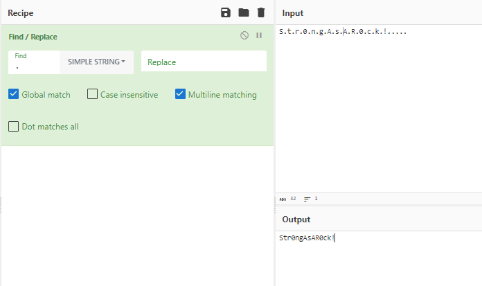

## Description 
> There is an emergency regarding this file. We need to extract the password ASAP. It's a crash dump, but our tools are not working. Please help us, time is not on our side.

> PS: Flag format is not standard.
## Link challenge 
> https://app.cyber-edu.co/challenges/bf7cde20-89b7-11ec-b6ba-fdc8d6daa06e?tenant=cyberedu
## Solution 
- Đầu tiên, em tải và giải nén thu được 1 file elf đây là định dạng file memdump của VBox 
- Nguồn : Đọc [ở đây](https://diverto.github.io/2019/11/05/Extracting-Passwords-from-hiberfil-and-memdumps)
- Em sử dụng volatility để phân tích 
- Theo đề ta cần phải trích xuất password ra, ở đây em sử dụng plugin lsadump để extract pasword bên trong registry SAM
```
                lsadump         Dump (decrypted) LSA secrets from the registry
                Extract SAM hashes, domain cached credentials and lsa secrets.
```

```
┌──(kali㉿kali)-[~/volatility]
└─$ python2 vol.py -f /home/kali/Downloads/crashdump.elf --profile=Win7SP1x64 lsadump
Volatility Foundation Volatility Framework 2.6.1
*** Failed to import volatility.plugins.mimikatz (AttributeError: 'module' object has no attribute 'Int32ul')
DefaultPassword
0x00000000  1c 00 00 00 00 00 00 00 00 00 00 00 00 00 00 00   ................
0x00000010  53 00 74 00 72 00 30 00 6e 00 67 00 41 00 73 00   S.t.r.0.n.g.A.s.
0x00000020  41 00 52 00 30 00 63 00 6b 00 21 00 00 00 00 00   A.R.0.c.k.!.....

DPAPI_SYSTEM
0x00000000  2c 00 00 00 00 00 00 00 00 00 00 00 00 00 00 00   ,...............
0x00000010  01 00 00 00 26 db 41 81 81 b7 74 99 0d b8 a0 2a   ....&.A...t....*
0x00000020  0d 0f 0e d0 92 6b 77 1d 64 73 ab 60 47 1e 07 07   .....kw.ds.`G...
0x00000030  ab a8 fa dd 57 f3 6b 51 2e 0a 4f 79 00 00 00 00   ....W.kQ..Oy....
```
- Em dùng CyberChef để format lại mật khẩu 
- 
> Str0ngAsAR0ck!