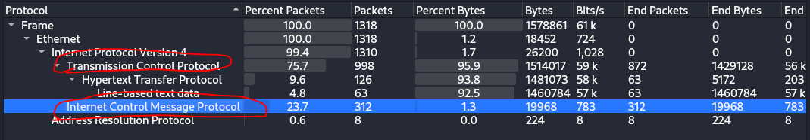
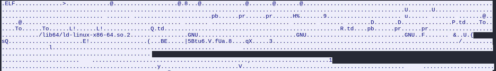
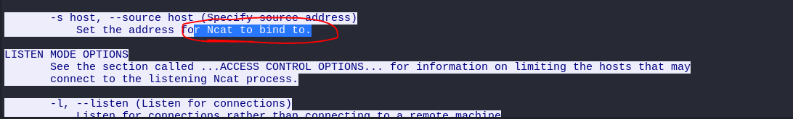
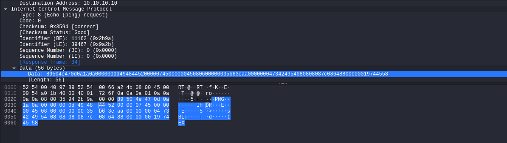
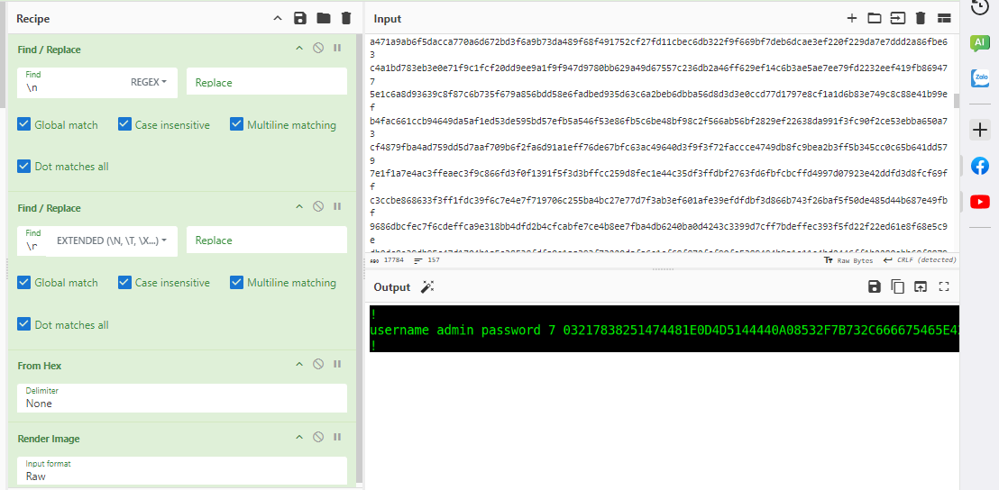

## Description 
> A network administrator made a screenshot of the password from a CISCO router from a client. He must send this screenshot to a colleague who is in a remote location. Unfortunately, the network to which it is connected does not allow it to send emails. Eventually he managed to find a way. Can you find the password from the captured traffic?
## Link challenge 
> https://app.cyber-edu.co/challenges/55ef0910-7f21-11ea-b1bf-ed1feede8572?tenant=cyberedu
## Solution
- Trước tiên em mở tệp bằng wireshark, xem thử chúng có các giao thức nào 
- 
- Em theo dõi luồng tcp thì thấy 1 file .ELF 
- 
- Em sử dụng cybercheff để tải về file rồi dùng ida64 để phân tích nhưng khôg có gì
- Theo dõi tiếp em thấy lệnh help của netcat 
- 
- Nên em chuyển qua tìm kiếm tại giao thức icmp thì thấy header của file .png
- Em dùng lệnh `tshark -r captura.pcapng -Y "(icmp) && ip.dst == 10.10.10.1" -T fields -e "data.data"` để xuất data ra dạng hex
- 
- Em sử dụng cybercheff để xuất file ra 
- 
- Em thu được 1 đoạn password nhưng có lẻ nó bị mã hoá gì đó. Ban đầu em nghĩ là xor với số 7 nhưng không phải. 
```

username admin password 7 03217838251474481E0D4D5144440A08532F7B732C666675465E425B0052080B040058051D44000000525302520F0C57550E53021702500C0A050A254A1650405542135B0D5037
!
```
- Tìm kiếm 1 lúc thì em biết đây là mã hoá `Cisco Type 7`
- Em sử dụng [công cụ online](https://www.ifm.net.nz/cookbooks/passwordcracker.html) để giải mã thì thu được flag
> Flag : ECSC{5d0d4436ad7e07d5375948ad13746fe2987aa7fd7126dfdd47acedf89905a0a4}
