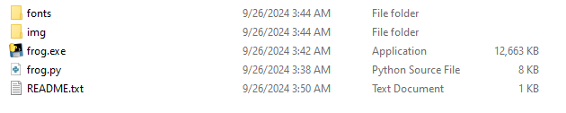
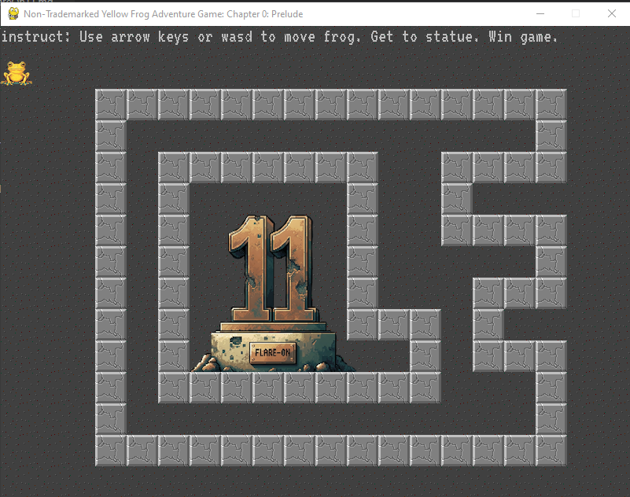
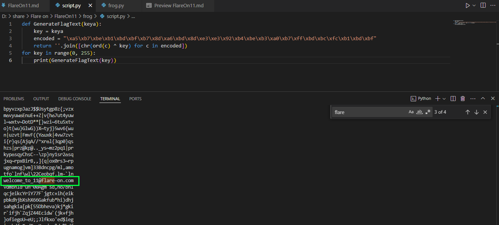

## Frog
### Description 
> Welcome to Flare-On 11! Download this 7zip package, unzip it with the password 'flare', and read the README.txt file for launching instructions. It is written in PyGame so it may be runnable under many architectures, but also includes a pyinstaller created EXE file for easy execution on Windows.

> Your mission is get the frog to the "11" statue, and the game will display the flag. Enter the flag on this page to advance to the next stage. All flags in this event are formatted as email addresses ending with the @flare-on.com domain.

### Solution
- Bài này cho ta 1 file exe là trò chơi mê cung 
- 
- 
- Có nghĩa là chúng ta cần vào được bên trong flag sẽ xuất hiện 
- Mở src ra xem, ta thấy có 1 hàm tạo flag ở đây
```
def GenerateFlagText(x, y):
    key = x + y*20
    encoded = "\xa5\xb7\xbe\xb1\xbd\xbf\xb7\x8d\xa6\xbd\x8d\xe3\xe3\x92\xb4\xbe\xb3\xa0\xb7\xff\xbd\xbc\xfc\xb1\xbd\xbf"
    return ''.join([chr(ord(c) ^ key) for c in encoded])
```
- Hàm này lấy đầu vào là 2 giá trị x, y để tạo ra key. Ta sẽ sử dụng kĩ thuật bruteforce để tìm ra key đúng
- 
> Flag : welcome_to_11@flare-on.com
