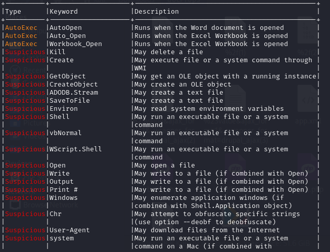
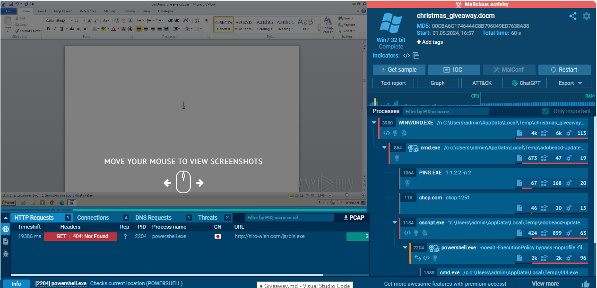
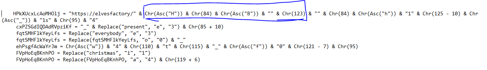

## Description 
> Santa's SOC team is working overtime during December due to Christmas phishing campaigns. A new team of malicious actors is targeting mainly those affected by the holiday spirit. Could you analyse the document and find the command & control server?
## Link challenge
> https://github.com/HHousen/HTB-CyberSanta-2021/blob/master/Forensics/Giveaway/forensics_giveaway.zip
- Sau khi tải file về em thu được 1 file macro. Sử dụng tool olevba để xem src macro của nó.
- 
- Lúc đầu em có upload lên app.any.run nhưng không có quá nhiều kết quả
- 
- Đọc thử src thì thấy 1 đoạn như thế này 
- 
- Dịch bằng tay thì thấy 4 kí tự đầu là `HTB{` => đây là định dạng của flag
- Em viết 1 script in flag ra
```
HPkXUcxLcAoMHOlj = "https://elvesfactory/" + chr(ord("H")) + chr(84) + chr(ord("B")) + "" + chr(123) + "" + chr(84) + chr(ord("h")) + "1" + chr(125 - 10) + chr(ord("_")) + "1s" + chr(95) + "4"
cxPZSGdIQDAdRVpziKf = "_" + "present".replace("e", "3") + chr(85 + 10)
fqtSMHFlkYeyLfs = "everybody".replace("e", "3")
fqtSMHFlkYeyLfs = fqtSMHFlkYeyLfs.replace("o", "0") + "_"
ehPsgfAcWaYrJm = chr(ord("w")) + "4" + chr(110) + "t" + chr(115) + "_" + chr(ord("f")) + "0" + chr(121 - 7) + chr(95)
FVpHoEqBKnhPO = "christmas".replace("i", "1")
FVpHoEqBKnhPO = FVpHoEqBKnhPO.replace("a", "4") + chr(119 + 6)

print(HPkXUcxLcAoMHOlj + cxPZSGdIQDAdRVpziKf + fqtSMHFlkYeyLfs + ehPsgfAcWaYrJm + FVpHoEqBKnhPO)

```

```   
┌──(kali㉿kali)-[~/Downloads]
└─$ python run.py
https://elvesfactory/HTB{Th1s_1s_4_pr3s3nt_3v3ryb0dy_w4nts_f0r_chr1stm4s}

```
