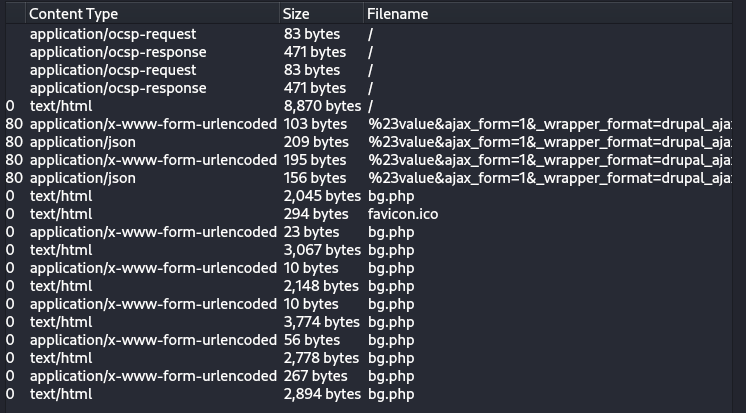
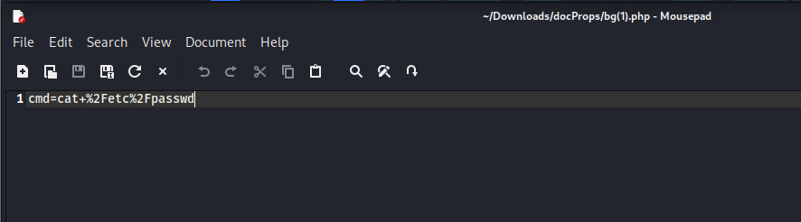
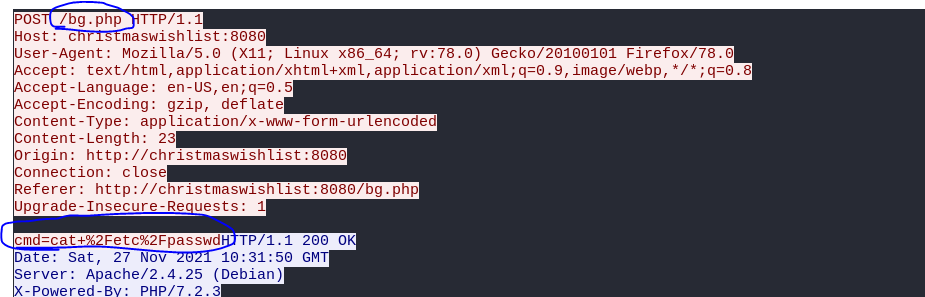
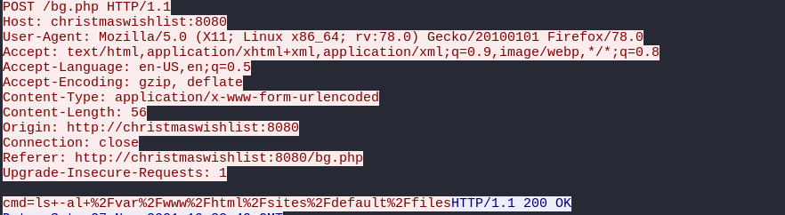

## Description
> This is the most wonderful time of the year, but not for Santa's incident response team. Since Santa went digital, everyone can write a letter to him using his brand new website. Apparently an APT group hacked their way in to Santa's server and destroyed his present list. Could you investigate what happened?
## Link challenge 
> https://github.com/HHousen/HTB-CyberSanta-2021/blob/master/Forensics/baby%20APT/forensics_baby_apt.zip
## Solution 
- Đầu tiên em mở file lên bằng wireshark, em tìm kiếm có file nào được lưu không. 
- 
- Save tất cả về, em kiểm tra các file php thì thấy được 1 vài điều khá thú vị 
- 
- Đây là 1 câu truy vấn 
- Để biết xem chuyện gì xảy ra em theo dõi luồng tcp
- - 
- 1 lệnh post, sau đó là 1 câu truy vấn 
- 
- Đây đích thị là tấn công theo phương thức upload file 
- Tại luồng tcp số 30 em tìm thấy flag được mã hoá `cmd=rm++%2Fvar%2Fwww%2Fhtml%2Fsites%2Fdefault%2Ffiles%2F.ht.sqlite+%26%26+echo+SFRCezBrX24wd18zdjNyeTBuM19oNHNfdDBfZHIwcF8wZmZfdGgzaXJfbDN0dDNyc180dF90aDNfcDBzdF8wZmYxYzNfNGc0MW59+%3E+%2Fdev%2Fnull+2%3E%261+%26%26+ls+-al++%2Fvar%2Fwww%2Fhtml%2Fsites%2Fdefault%2Ffiles`
> URL DECODE : cmd=rm  /var/www/html/sites/default/files/.ht.sqlite && echo SFRCezBrX24wd18zdjNyeTBuM19oNHNfdDBfZHIwcF8wZmZfdGgzaXJfbDN0dDNyc180dF90aDNfcDBzdF8wZmYxYzNfNGc0MW59 > /dev/null 2>&1 && ls -al  /var/www/html/sites/default/files

> BASE64 DECODE : HTB{0k_n0w_3v3ry0n3_h4s_t0_dr0p_0ff_th3ir_l3tt3rs_4t_th3_p0st_0ff1c3_4g41n}