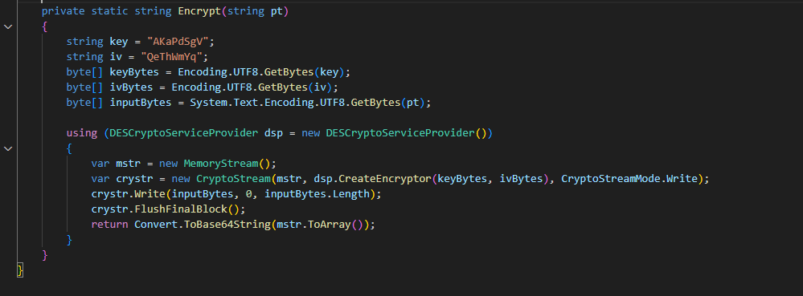
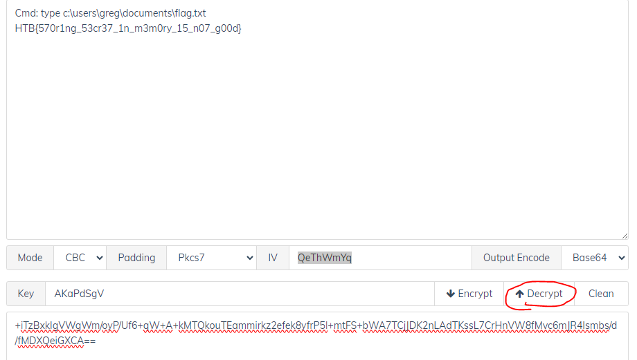

## Description 
> Our cybercrime unit has been investigating a well-known APT group for several months. The group has been responsible for several high-profile attacks on corporate organizations. However, what is interesting about that case, is that they have developed a custom command & control server of their own. Fortunately, our unit was able to raid the home of the leader of the APT group and take a memory capture of his computer while it was still powered on. Analyze the capture to try to find the source code of the server.
## Link challenge 
> https://app.hackthebox.com/challenges/TrueSecrets
## Solution
- Sau khi tải file ta thu được 1 file memdump, phân tích bằng vol2
- Trước tiên ta dùng pslist và cmdline để xem sơ qua các process 
- Thấy tại pid 2176 có 1 file zip
```
7zFM.exe pid:   2176
Command line : "C:\Program Files\7-Zip\7zFM.exe" "C:\Users\IEUser\Documents\backup_development.zip"
```
- Dump nó ra bằng lệnh `python2 vol.py -f /home/kali/Downloads/TrueSecrets.raw --profile=Win7SP0x86 filescan | grep backup_development.zip`
để tìm offset và `python2 vol.py -f /home/kali/Downloads/TrueSecrets.raw --profile=Win7SP0x86 dumpfiles -o 0x000000000bbf6158 -D /home/kali/Downloads` để dump ra. 
-  Giải nén ta được 1 file `development.tc` bị khoá bởi mật khẩu, sử dụng plugin `truecryptpassphrase` để lấy mật khẩu 
```
└─$ python2 vol.py -f /home/kali/Downloads/TrueSecrets.raw --profile=Win7SP0x86 truecryptpassphrase
Volatility Foundation Volatility Framework 2.6.1
Found at 0x89ebf064 length 28: X2Hk2XbEJqWYsh8VdbSYg6WpG9g7
```
- Mở file ra ta thu được 4 file
- 
- Xem code thì xác định được có 1 file code và 3 file là kết quả của nó 
- 
- Thấy rằng nó mã hoá file bằng DES encrypt với key là AKaPdSgV và IV là QeThWmYq, mình sử dụng công cụ online để decrypt nó 
> https://devtoolcafe.com/tools/des
- Thử từng phần của các file ta sẽ thu được flag 
- 
> HTB{570r1ng_53cr37_1n_m3m0ry_15_n07_g00d}