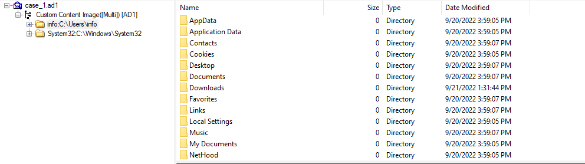

## Giới thiệu 
> You got Mail là một challenge có độ khó Medium, nằm trong mảng Forensics (điều tra số), mô phỏng lại một Incident (sự cố) khi công ty X phát hiện ra máy tính của một nhân viên trong công ty bị dính mã độc. Team IR (Incident Response) đã ngay lập tức thu thập chứng cứ trên máy tính này. Nhiệm vụ của chúng ta là phải tìm hiểu xem mã độc thâm nhập vào bằng cách nào (với tiêu đề như trên thì chắc là qua email rồi) và chuyện gì đã xảy ra. Let’s go~
## Đề bài 
> Bạn có thể tải backup đề bài về tại đây: https://mega.nz/file/D08wnIDa#aZzUc9FNJJLSF1xWjd8B2YD_HCpVnStbemXfkEeQjBY (1.3Gb)
## Giải
- Sau khi tải ta thu được 1 file có tên `case_1.ad1`
- Kiểm tra xem đó là loại file gì bằng command `file`
```text
┌──(trongtam㉿kali)-[~/Downloads]
└─$ file case_1.ad1                                              
case_1.ad1: data
```
- Không thu được kết quả gì, tôi tiếp tục với hex để kiểm tra header của file 
> hexeditor case_1.ad1 | head
- Ta thu được header có strings như sau `ADSEGMENTEDFILE`
- Tìm kiếm trên google cả 2 (strings trong hexeditor và đuôi .ad1) ta có thể tìm được thông tin [tại đây](https://fileinfobase.com/vi/extension/ad1)
- Theo thông tin ta tìm được thì đây là 1 file từ công cụ phân tích pháp y FTK image 
- Tôi sẽ mở file trên công cụ này 
