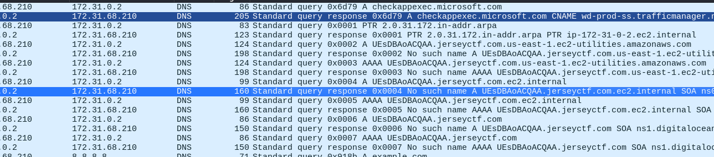

## Đề 
> An attacker has accessed the corporate network and is exfiltrating the flag!
## Solution 
- Trước tiên check 1 lượt các method em thấy có 1 vài đường link jerseyctf như sau 
- 
- Có vẻ như nó là cuộc tấn công exiftration
- Em sử dụng tshark để xuất dữ liệu của các đường dẫn 
>  tshark -r secret-tunnels.pcapng -Y "dns" | grep -Eo "A (.*?)\.jerseyctf.com" | uniq
- Sau đó em sửa lại bằng cách đưa lên cybercheff
- Em thu được 1 file zip chứa flag.txt
- Mở ra nhưng nó bị nén bằng pass, em sử dụng john để bẻ khoá (Mật khẩu là njit1220)
> Flag : jctf{dn57unn3l1n6}
