## Level 1
> My sister's computer crashed. We were very fortunate to recover this memory dump. Your job is get all her important files from the system. From what we remember, we suddenly saw a black window pop up with some thing being executed. When the crash happened, she was trying to draw something. Thats all we remember from the time of crash.
> Note: This challenge is composed of 3 flags.
- Như thường lệ em sử dụng imageinfo để xác định được profile 
```
┌──(kali㉿kali)-[~/volatility]
└─$ python2 vol.py -f /home/kali/Downloads/MemoryDump_Lab1.raw imageinfo
INFO    : volatility.debug    : Determining profile based on KDBG search...
          Suggested Profile(s) : Win7SP1x64, Win7SP0x64, Win2008R2SP0x64, Win2008R2SP1x64_24000, Win2008R2SP1x64_23418, Win2008R2SP1x64, Win7SP1x64_24000, Win7SP1x64_23418
                     AS Layer1 : WindowsAMD64PagedMemory (Kernel AS)
                     AS Layer2 : FileAddressSpace (/home/kali/Downloads/MemoryDump_Lab1.raw)
                      PAE type : No PAE
                           DTB : 0x187000L
                          KDBG : 0xf800028100a0L
          Number of Processors : 1
     Image Type (Service Pack) : 1
                KPCR for CPU 0 : 0xfffff80002811d00L
             KUSER_SHARED_DATA : 0xfffff78000000000L
           Image date and time : 2019-12-11 14:38:00 UTC+0000
     Image local date and time : 2019-12-11 20:08:00 +0530
```
- Tiếp tục sử dụng 1 vài lệnh như pslist và consoles để xem 1 vài thông tin cơ bản 
- Sau khi sử dụng consoles em thu được 1 đoạn base64 đáng ngờ
- 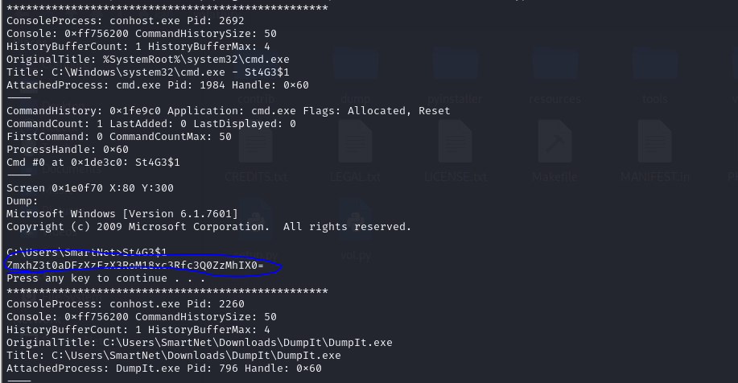
- Decode ta được flag 1
> flag{th1s_1s_th3_1st_st4g3!!} 
- Đối với plugin cmdline em nhận thấy winrar.exe đang chạy 1 tệp có tên important.rar
```
WinRAR.exe pid:   1512
Command line : "C:\Program Files\WinRAR\WinRAR.exe" "C:\Users\Alissa Simpson\Documents\Important.rar"
```
- Em sẽ lấy file Important.rar xem thử có gì bên trong không 
```
┌──(kali㉿kali)-[~/volatility]
└─$ python2 vol.py -f /home/kali/Downloads/MemoryDump_Lab1.raw --profile=Win7SP1x64 filescan | grep Important.rar
Volatility Foundation Volatility Framework 2.6.1
0x000000003fa3ebc0      1      0 R--r-- \Device\HarddiskVolume2\Users\Alissa Simpson\Documents\Important.rar
0x000000003fac3bc0      1      0 R--r-- \Device\HarddiskVolume2\Users\Alissa Simpson\Documents\Important.rar
0x000000003fb48bc0      1      0 R--r-- \Device\HarddiskVolume2\Users\Alissa Simpson\Documents\Important.rar
                                                                                                            
```
>  python2 vol.py -f /home/kali/Downloads/MemoryDump_Lab1.raw --profile=Win7SP1x64 dumpfiles -Q 0x000000003fa3ebc0 --dump-dir /home/kali/Downloads/dump/
- Sau khi dump được em bắt đầu giải nén file nhưng nó bị nén bởi mật khẩu, nhưng thay vào đó em được gợi ý để tìm ra nó 
```
┌──(kali㉿kali)-[~/Downloads/dump]
└─$ unrar x important.rar                             

UNRAR 7.00 beta 2 freeware      Copyright (c) 1993-2023 Alexander Roshal

Password is NTLM hash(in uppercase) of Alissa's account passwd.


Extracting from important.rar

Enter password (will not be echoed) for flag3.png: 

```
- Vì hashdump của vol2 em có vấn đề nên em sử dụng vol3
```
└─$ python3 vol.py -f /home/kali/Downloads/MemoryDump_Lab1.raw windows.hashdump.Hashdump
Volatility 3 Framework 2.5.2
Progress:  100.00               PDB scanning finished                        
User    rid     lmhash  nthash

Administrator   500     aad3b435b51404eeaad3b435b51404ee        31d6cfe0d16ae931b73c59d7e0c089c0
Guest   501     aad3b435b51404eeaad3b435b51404ee        31d6cfe0d16ae931b73c59d7e0c089c0
SmartNet        1001    aad3b435b51404eeaad3b435b51404ee        4943abb39473a6f32c11301f4987e7e0
HomeGroupUser$  1002    aad3b435b51404eeaad3b435b51404ee        f0fc3d257814e08fea06e63c5762ebd5
Alissa Simpson  1003    aad3b435b51404eeaad3b435b51404ee        f4ff64c8baac57d22f22edc681055ba6

```
- Ta sẽ dùng john để bẻ khoá mật khẩu của user Alissa Simpson
- 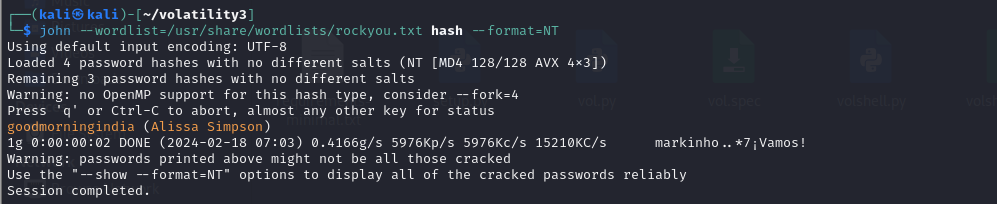
- In hoa mật khẩu và giải nén ta thu được flag2 (GOODMORNINGINDIA)
> flag{w3ll_3rd_stage_was_easy}
- Bởi vì đề bài đề cập đến việc đang vẽ thì máy bị tắt, nên em sẽ kiểm tra luôn process `mspaint.exe`
┌──(kali㉿kali)-[~/volatility]
└─$ python2 vol.py -f /home/kali/Downloads/MemoryDump_Lab1.raw --profile=Win7SP1x64 memdump --pid 2424 --dump-dir /home/kali/Downloads/dump/
- 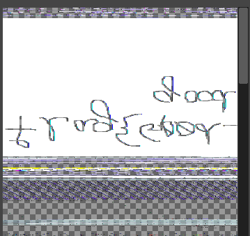
- Có vẻ là chữ nhưng nó bị ngược, sau khi lật lại ta thu được flag3
> flag{G00d_BoY_good_girL}


## Level 2
> One of the clients of our company, lost the access to his system due to an unknown error. He is supposedly a very popular "environmental" activist. As a part of the investigation, he told us that his go to applications are browsers, his password managers etc. We hope that you can dig into this memory dump and find his important stuff and give it back to us.

> Note: This challenge is composed of 3 flags.
- Vì ngay tại đề bài có đề cập đến trình quản lý mật khẩu, thêm việc có 1 process KeePass.exe và notepad.exe
- 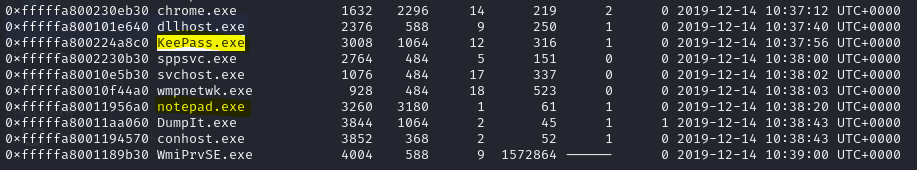
- Em sử dụng đến plugin filescan để tìm các tệp tin có liên quan
```
┌──(kali㉿kali)-[~/volatility]
└─$ python2 vol.py -f /home/kali/Downloads/MemoryDump_Lab2.raw --profile=Win7SP1x64 filescan | grep -i pass
Volatility Foundation Volatility Framework 2.6.1
0x000000003e868370     16      0 R--r-d \Device\HarddiskVolume2\Program Files (x86)\KeePass Password Safe 2\KeePass.exe.config
0x000000003e873070      8      0 R--r-d \Device\HarddiskVolume2\Program Files (x86)\KeePass Password Safe 2\KeePass.exe
0x000000003e8be8e0     16      0 R--r-- \Device\HarddiskVolume2\Users\Alissa Simpson\AppData\Roaming\KeePass\KeePass.config.xml
0x000000003e8c8070     16      0 R--r-- \Device\HarddiskVolume2\Users\SmartNet\AppData\Roaming\KeePass\KeePass.config.xml
0x000000003e8ef2d0     13      0 R--r-d \Device\HarddiskVolume2\Program Files (x86)\KeePass Password Safe 2\KeePass.exe
0x000000003e8f0360      4      0 R--r-d \Device\HarddiskVolume2\Program Files (x86)\KeePass Password Safe 2\KeePass.XmlSerializers.dll
0x000000003e925dd0     13      0 R--r-d \Device\HarddiskVolume2\Windows\assembly\NativeImages_v2.0.50727_64\KeePass\13eb7470080a156633ecf1bc9f991204\KeePass.ni.exe
0x000000003eaf7880     15      1 R--r-d \Device\HarddiskVolume2\Program Files (x86)\KeePass Password Safe 2\KeePass.XmlSerializers.dll
0x000000003eedbea0      1      1 -W-rw- \Device\HarddiskVolume2\Windows\debug\PASSWD.LOG
0x000000003fb0abc0     10      0 R--r-d \Device\HarddiskVolume2\Program Files (x86)\KeePass Password Safe 2\KeePassLibC64.dll
0x000000003fb465d0     15      0 R--r-d \Device\HarddiskVolume2\Users\SmartNet\Downloads\KeePass-2.43-Setup.exe
0x000000003fb6d530      1      0 R--rwd \Device\HarddiskVolume2\ProgramData\Microsoft\Windows\Start Menu\Programs\KeePass 2.lnk
0x000000003fce1c70      1      0 R--r-d \Device\HarddiskVolume2\Users\Alissa Simpson\Pictures\Password.png
0x000000003fd62f20      2      0 R--r-- \Device\HarddiskVolume2\Program Files (x86)\KeePass Password Safe 2\KeePass.config.xml
0x000000003fecf820     15      0 R--r-d \Device\HarddiskVolume2\Program Files (x86)\KeePass Password Safe 2\unins000.exe
```
- Tại đây có 1 file png `\Device\HarddiskVolume2\Users\Alissa Simpson\Pictures\Password.png`, em sẽ xuất nó ra 
> python2 vol.py -f /home/kali/Downloads/MemoryDump_Lab2.raw --profile=Win7SP1x64 dumpfiles -Q 0x000000003fce1c70 --dump-dir /home/kali/Downloads/dump 
- 
- Tuy không thu được flag nhưng em thu được 1 mật khẩu 
- 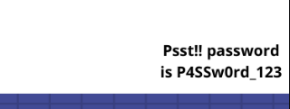
- Tiếp tục tìm kiếm em lại thấy 1 file .kdbx là định dạng của file KeePass
```
┌──(kali㉿kali)-[~/volatility]
└─$ python2 vol.py -f /home/kali/Downloads/MemoryDump_Lab2.raw --profile=Win7SP1x64 filescan | grep -i kdbx                                             
Volatility Foundation Volatility Framework 2.6.1
0x000000003fb112a0     16      0 R--r-- \Device\HarddiskVolume2\Users\SmartNet\Secrets\Hidden.kdbx
                                                                                                                                                                      
┌──(kali㉿kali)-[~/volatility]
└─$ python2 vol.py -f /home/kali/Downloads/MemoryDump_Lab2.raw --profile=Win7SP1x64 dumpfiles -Q 0x000000003fb112a0 --dump-dir /home/kali/Downloads/dump

```
- Sau khi mở bằng app em thu được flag tại thùng rác 
- 
> flag{w0w_th1s_1s_Th3_SeC0nD_ST4g3_!!}
- Ngoài `KeePass.exe` thì ta còn 1 process `chrome.exe`, em sẽ dùng filescan để tìm được file history browser của chrome
- 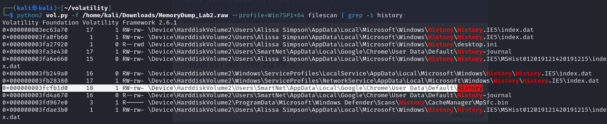
- Sau khi dumpfiles ra và đọc dữ liệu bằng web https://sqliteviewer.app
- Sau khi xem lịch sử browser thì em thấy 1 đường dẫn mega đưa đến 1 file nén important 
- 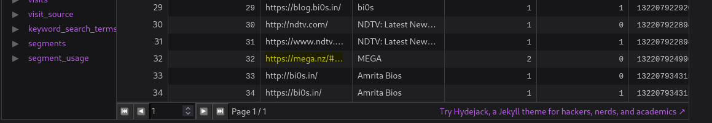
- 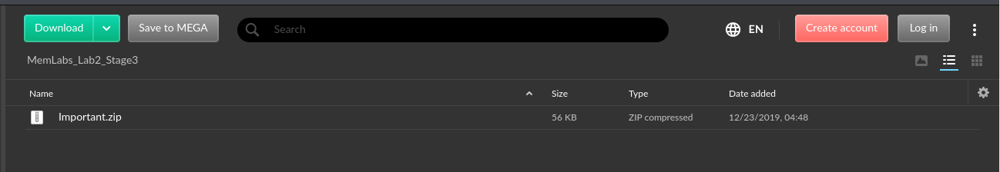
- 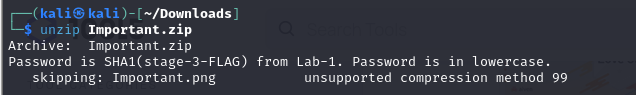
- Sau khi giải nén em thu được flag
> flag{oK_So_Now_St4g3_3_is_DoNE!!}
- Vì tiêu đề có đề cập đến nhà hoạt động môi trường, rất có thể đây là gợi ý cho flag tiếp theo (biến môi trường)
- 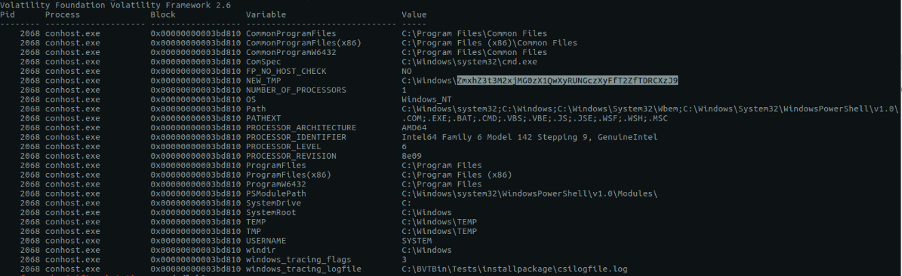
- Em thấy được 1 đoạn mã base64 
- Decode ra được flag tiếp theo 
```
┌──(kali㉿kali)-[~/volatility]
└─$ echo "ZmxhZ3t3M2xjMG0zX1QwXyRUNGczXyFfT2ZfTDRCXzJ9" | base64 -d
flag{w3lc0m3_T0_$T4g3_!_Of_L4B_2}       
```


## Level 3
```
A malicious script encrypted a very secret piece of information I had on my system. Can you recover the information for me please?

Note-1: This challenge is composed of only 1 flag. The flag split into 2 parts.

Note-2: You'll need the first half of the flag to get the second.

You will need this additional tool to solve the challenge,
```       
- Như thường lệ em sử dụng pslist để liệt kê các process đang chạy 
- 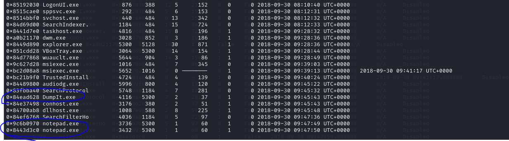 
- Ở đây em thấy 2 process notepad đang chạy và 1 dumpit, em tiếp tục chạy thêm 1 plugin cmdline thì thấy notepad đang chạy 2 file 
```
notepad.exe pid:   3736
Command line : "C:\Windows\system32\NOTEPAD.EXE" C:\Users\hello\Desktop\evilscript.py
************************************************************************
notepad.exe pid:   3432
Command line : "C:\Windows\system32\NOTEPAD.EXE" C:\Users\hello\Desktop\vip.txt
```
- Sau khi dump 2 file em thu được 1 vài thông tin như sau 
**Đối với file vip.txt**
```
am1gd2V4M20wXGs3b2U=
```
**Đối với file evilscript.py.py**
```
import sys
import string

def xor(s):

        a = ''.join(chr(ord(i)^3) for i in s)
        return a


def encoder(x):

        return x.encode("base64")


if __name__ == "__main__":

        f = open("C:\\Users\\hello\\Desktop\\vip.txt", "w")

        arr = sys.argv[1]

        arr = encoder(xor(arr))

        f.write(arr)

        f.close()

```
- Dựa vào thông tin trên em sẽ decode ngược lại bằng cybercheff
- 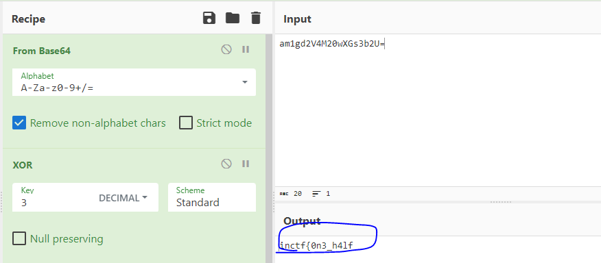
- Ta được phần đầu của flag 
> inctf{0n3_h4lf
- Bởi vì phần gợi ý có sử dụng steghide, nên em tìm xem có file ảnh có thể tạo steghide không 
```
┌──(kali㉿kali)-[~/volatility]
└─$ python2 vol.py -f /home/kali/Downloads/MemoryDump_Lab3.raw --profile=Win7SP1x86_23418 filescan | grep jpeg    
Volatility Foundation Volatility Framework 2.6.1
0x0000000004f34148      2      0 RW---- \Device\HarddiskVolume2\Users\hello\Desktop\suspision1.jpeg
                                                                                                                                                                      
┌──(kali㉿kali)-[~/volatility]
└─$ python2 vol.py -f /home/kali/Downloads/MemoryDump_Lab3.raw --profile=Win7SP1x86_23418 dumpfiles -Q 0x0000000004f34148 --dump-dir /home/kali/Downloads/dump/

```
- Tiếp theo em sử dụng stegcracker để bẻ khoá mật khẩu nhưng không thành công, sau 1 hồi lần mò thì mật khẩu chính là phần đầu của flag 
- 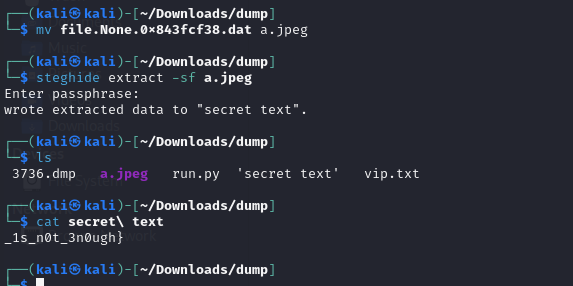
- Ta được phần thứ 2 của flag 
> _1s_n0t_3n0ugh}
> Flag : inctf{0n3_h4lf_1s_n0t_3n0ugh}


## Level 4
```
My system was recently compromised. The Hacker stole a lot of information but he also deleted a very important file of mine. I have no idea on how to recover it. The only evidence we have, at this point of time is this memory dump. Please help me.

Note: This challenge is composed of only 1 flag.

The flag format for this lab is: inctf{s0me_l33t_Str1ng}
```
- Vì đề bài đề cập đến tập tin rất quan trọng nên em dựa vào plugin filescan để tìm file có tên important,secret hay đại loại như thế 
```
┌──(kali㉿kali)-[~/volatility]
└─$ python2 vol.py -f /home/kali/Downloads/MemoryDump_Lab4.raw --profile=Win7SP1x64 filescan | grep -i important
Volatility Foundation Volatility Framework 2.6.1
0x000000003f939720      2      0 RW-rw- \Device\HarddiskVolume2\Users\SlimShady\AppData\Roaming\Microsoft\Windows\Recent\Important.lnk
0x000000003fc398d0     16      0 R--rw- \Device\HarddiskVolume2\Users\SlimShady\Desktop\Important.txt

```
- Em tìm thấy 1 tệp tin important.txt
- Dumpfiles ra để đọc dữ liệu bên trong nhưng không có đầu ra 
>  python2 vol.py -f /home/kali/Downloads/MemoryDump_Lab4.raw --profile=Win7SP1x64 dumpfiles -Q 0x000000003fc398d0 --dump-dir /home/kali/Downloads/dump/
- Em tìm các plugin xem có cái nào hỗ trợ được không thì em tìm thấy 1 plugin tên  mftparser
> python2 vol.py -f /home/kali/Downloads/MemoryDump_Lab4.raw --profile=Win7SP1x86_23418 mftparser | grep -i important.txt -B 20 -A 20
- Và em tìm được flag tại đây 
```
$DATA
0000000000: 69 0d 0a 0d 0a 0d 0a 6e 0d 0a 0d 0a 0d 0a 63 74   i......n......ct
0000000010: 0d 0a 0d 0a 0d 0a 0d 0a 66 7b 31 0d 0a 0d 0a 0d   ........f{1.....
0000000020: 0a 5f 69 73 0d 0a 0d 0a 0d 0a 5f 6e 30 74 0d 0a   ._is......_n0t..
0000000030: 0d 0a 0d 0a 0d 0a 5f 45 51 75 34 6c 0d 0a 0d 0a   ......_EQu4l....
0000000040: 0d 0a 0d 0a 5f 37 6f 5f 32 5f 62 55 74 0d 0a 0d   ...._7o_2_bUt...
0000000050: 0a 0d 0a 0d 0a 0d 0a 0d 0a 0d 0a 5f 74 68 31 73   ..........._th1s
0000000060: 5f 64 30 73 33 6e 74 0d 0a 0d 0a 0d 0a 0d 0a 5f   _d0s3nt........_
0000000070: 6d 34 6b 65 0d 0a 0d 0a 0d 0a 5f 73 33 6e 0d 0a   m4ke......_s3n..
0000000080: 0d 0a 0d 0a 0d 0a 73 33 7d 0d 0a 0d 0a 47 6f 6f   ......s3}....Goo
0000000090: 64 20 77 6f 72 6b 20 3a 50                        d.work.:P
```
- 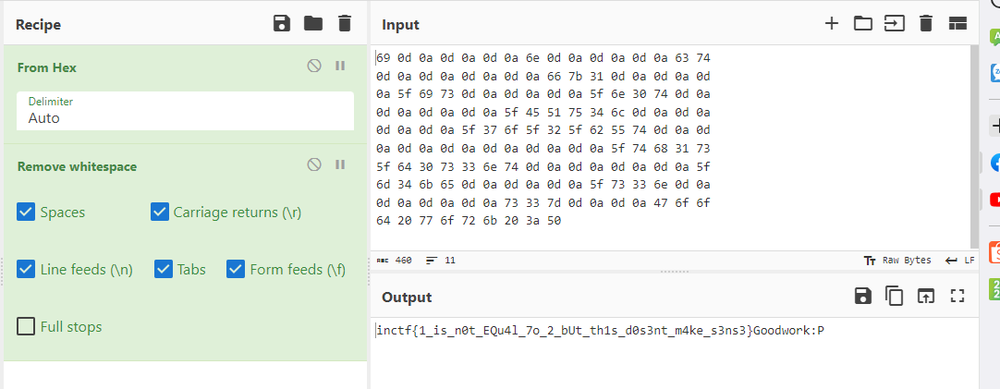
> Flag : inctf{1_is_n0t_EQu4l_7o_2_bUt_th1s_d0s3nt_m4ke_s3ns3}


## Level 5
```
We received this memory dump from our client recently. Someone accessed his system when he was not there and he found some rather strange files being accessed. Find those files and they might be useful. I quote his exact statement,

The names were not readable. They were composed of alphabets and numbers but I wasn't able to make out what exactly it was.

Also, he noticed his most loved application that he always used crashed every time he ran it. Was it a virus?

Note-1: This challenge is composed of 3 flags. If you think 2nd flag is the end, it isn't!! :P

Note-2: There was a small mistake when making this challenge. If you find any string which has the string "L4B_3_D0n3!!" in it, please change it to "L4B_5_D0n3!!" and then proceed.

Note-3: You'll get the stage 2 flag only when you have the stage 1 flag.

Challenge file: MemLabs_Lab5
```
- Khi sử dụng plugin pslist em quan sát thấy 1 process WinRAR.exe đang chạy 1 file SW1wb3J0YW50.rar
- 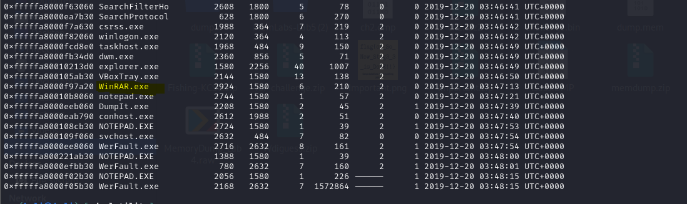
- 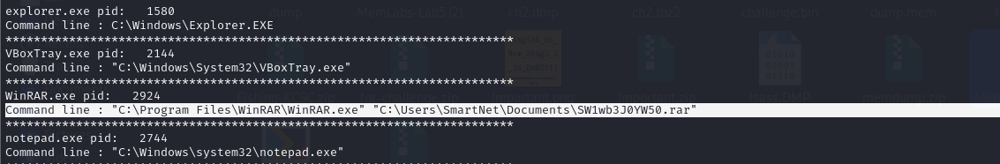
- Em sẽ trích xuất file rar theo phương pháp đã làm ở các lab trên 
```
┌──(kali㉿kali)-[~/volatility]
└─$ python2 vol.py -f /home/kali/Downloads/MemoryDump_Lab5.raw --profile=Win7SP1x64 filescan | grep SW1wb3J0YW50.rar

Volatility Foundation Volatility Framework 2.6.1
0x000000003eed56f0      1      0 R--r-- \Device\HarddiskVolume2\Users\SmartNet\Documents\SW1wb3J0YW50.rar
                                                                                                                                                                      
┌──(kali㉿kali)-[~/volatility]
└─$ python2 vol.py -f /home/kali/Downloads/MemoryDump_Lab5.raw --profile=Win7SP1x64 dumpfiles -Q 0x000000003eed56f0 --dump-dir /home/kali/Downloads/dump/
DataSectionObject 0x3eed56f0   None   \Device\HarddiskVolume2\Users\SmartNet\Documents\SW1wb3J0YW50.rar

```
- Sau khi đổi tên và giải nén nó ra nhưng nó bị dính mật khẩu
- 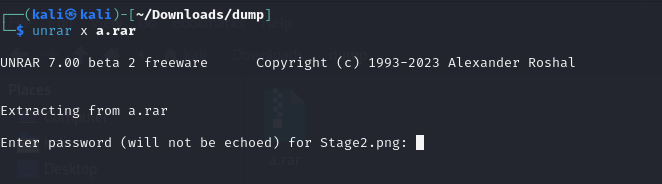
- Sau khi giải nén file này sẽ được 1 tệp tên Stage2.png nên rất có thể password nằm ở Stage1.*
- Có 1 vài điều thú vị là plugin screenshot cho ta 1 vài hình ảnh hữu ích
- 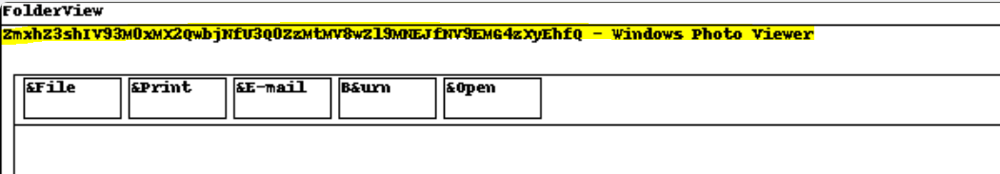
- Sau khi decode em được flag 1
```
┌──(kali㉿kali)-[~/volatility]
└─$ echo "ZmxhZ3shIV93M0xMX2QwbjNfU3Q0ZzMtMV8wZl9MNEJfM19EMG4zXyEhfQ" | base64 -d               
flag{!!_w3LL_d0n3_St4g3-1_0f_L4B_5_D0n3_!!}base64: invalid input
```
- Dùng flag 1 để extract file rar em được flag 2
- 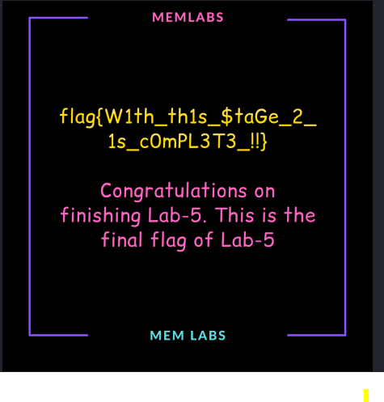
> flag{W1th_th1s_$taGe_2_1s_c0mPL3T3_!!}


## Level 6
```
We received this memory dump from the Intelligence Bureau Department. They say this evidence might hold some secrets of the underworld gangster David Benjamin. This memory dump was taken from one of his workers whom the FBI busted earlier this week. Your job is to go through the memory dump and see if you can figure something out. FBI also says that David communicated with his workers via the internet so that might be a good place to start.

Note: This challenge is composed of 1 flag split into 2 parts.

The flag format for this lab is: inctf{s0me_l33t_Str1ng}
```
- Trước tiên, dựa trên kiến thức dư lại ở lab trước em trích xuất các screenshot bằng plugin screenshot thì được 1 vài ảnh chứa dữ liệu sau : Mega Drive Key - davidbenjamin939@gmail.com - Gmail - Mozilla Firefox
- Vì đề chỉ rõ David liên lạc qua inernet nên em tìm trong history browser
- 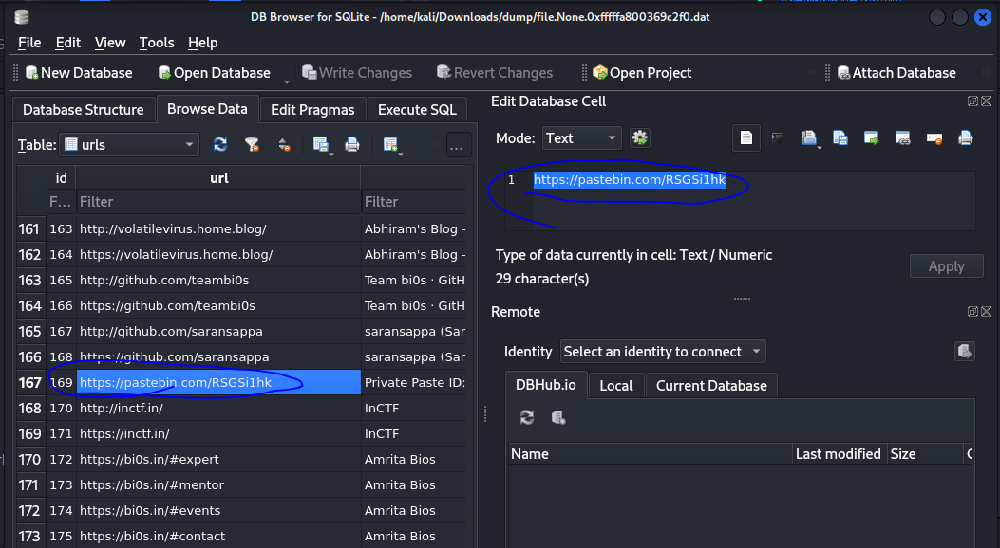
- Tại đây em tìm được 1 liên kết khả nghi 
> https://pastebin.com/RSGSi1hk
- Sau khi truy cập link em tìm thấy 1 link gg docs, truy cập sâu vào em đến được 1 liên kết mega
- 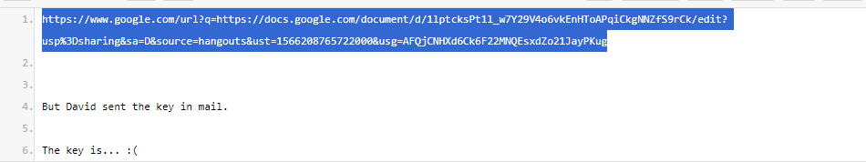
- 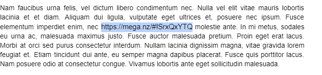
- 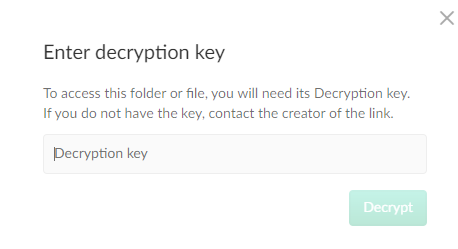
> strings /home/kali/Downloads/MemoryDump_Lab6.raw | grep -i key | grep -i mega
- 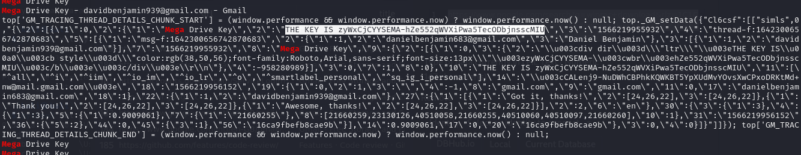
> Key là : zyWxCjCYYSEMA-hZe552qWVXiPwa5TecODbjnsscMIU
- Sau khi mở khoá em thu được 1 file png bị hỏng 
- 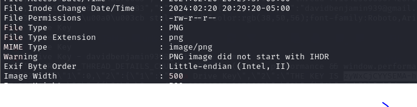
- Em sẽ dùng hexed.it để fix
- 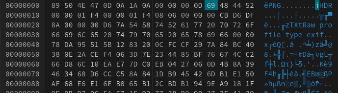
- Sửa hex 69 thành 49 ta được phần đầu của flag
- 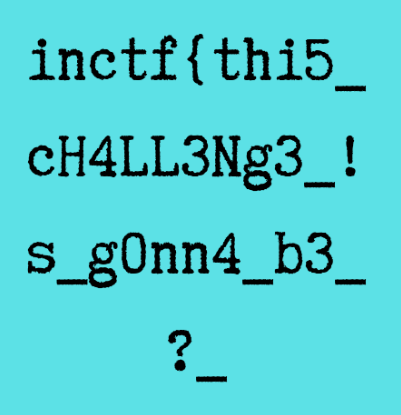
> inctf{thi5_cH4LL3Ng3_!s_g0nn4_b3_?_
- Tiếp theo em kiểm tra các process của file dump thì thấy có 1 process winrar.exe chạy file flag.rar, em sẽ dump file này ra 
```
************************************************************************
WinRAR.exe pid:   3716
Command line : "C:\Program Files\WinRAR\WinRAR.exe" "C:\Users\Jaffa\Desktop\pr0t3ct3d\flag.rar"
************************************************************************
DumpIt.exe pid:   4084
Command line : "C:\Users\Jaffa\Desktop\DumpIt.exe" 
************************************************************************
┌──(kali㉿kali)-[~/volatility]
└─$ python2 vol.py -f /home/kali/Downloads/MemoryDump_Lab6.raw --profile=Win7SP1x64 filescan | grep flag.rar
Volatility Foundation Volatility Framework 2.6.1
0x000000005fcfc4b0     16      0 R--rwd \Device\HarddiskVolume2\Users\Jaffa\Desktop\pr0t3ct3d\flag.rar
                                                                                                                                                                      
┌──(kali㉿kali)-[~/volatility]
└─$ python2 vol.py -f /home/kali/Downloads/MemoryDump_Lab6.raw --profile=Win7SP1x64 dumpfiles -Q 0x000000005fcfc4b0 --dump-dir /home/kali/Downloads/dump 

```
- Giải nén không thành công vì file có mật khẩu, em tìm mật khẩu bằng lệnh quen thuộc strings-grep
```
┌──(kali㉿kali)-[~/volatility]
└─$ strings /home/kali/Downloads/MemoryDump_Lab6.raw | grep -i "RAR password"
RAR password=easypeasyvirus
RAR password=easypeasyvirus
RAR password=easypeasyvirus
RAR password=easypeasyvirus
RAR password=easypeasyvirus
RAR password=easypeasyvirus
RAR password=easRCRD(
RAR password=easypeasyvirus
RAR password=easypeasyvirus
RAR password=easypeasyvirus
RAR password=easypeasyvirus
RAR password=easypeasyvirus
RAR password=easypeasyvirus
RAR password=easypeasyvirus
RAR password=easypeasyvirus
```
- Giải nén ta được flag 2
- 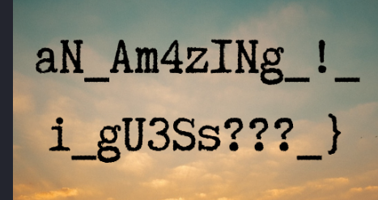
> aN_Am4zINg_!_i_gU3Ss???}
> Flag : inctf{thi5_cH4LL3Ng3_!s_g0nn4_b3_?_aN_Am4zINg_!_i_gU3Ss???}


