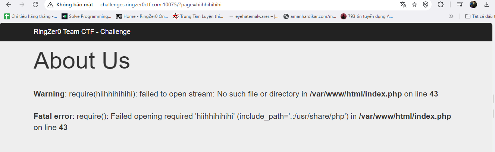
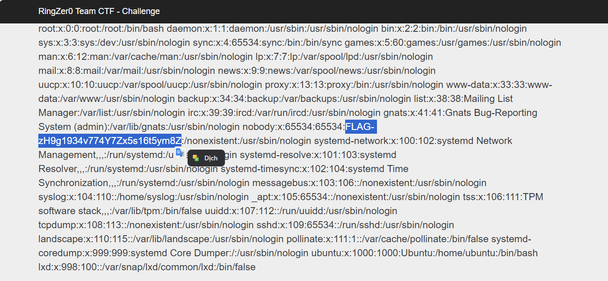

### Description 
> No description 
### Link challenge 
> https://ringzer0ctf.com/challenges/75
### Solution
- Truy cập vào trang web có đường dẫn `http://challenges.ringzer0ctf.com:10075/?page=lorem.php`, đập vào mắt ta là 1 file lorem.php sau `?page=`. Thay đổi 1 tí 
- 
- Có thể thấy khi thay đổi đến file `hiihhihihihi` thì hiện lỗi file không nằm trong hệ thống. Nếu bây giờ ta trỏ chính xác, Rất có khả năng ta sẽ đọc được các tệp tin liên quan
- Sau khi tra google, đây có thể là lỗ hổng LFI 
```
Kẻ tấn công có thể sử dụng Bao gồm tệp cục bộ (LFI) để lừa ứng dụng web hiển thị hoặc chạy tệp trên máy chủ web. Một cuộc tấn công LFI có thể dẫn đến tiết lộ thông tin, thực thi mã từ xa hoặc thậm chí là Cross-site Scripting (XSS) . Thông thường, LFI xảy ra khi một ứng dụng sử dụng đường dẫn đến tệp làm đầu vào. Nếu ứng dụng coi đầu vào này là đáng tin cậy thì một tệp cục bộ có thể được sử dụng trong câu lệnh include.
```
- Để đọc được mật khẩu ta cần đọc tệp `/etc/passwd`
- http://challenges.ringzer0ctf.com:10075/?page=/etc/passwd
- 
> FLAG-zH9g1934v774Y7Zx5s16t5ym8Z


- [Tài liệu tham khảo 1](https://www.acunetix.com/blog/articles/local-file-inclusion-lfi/)
- [Tài liệu tham khảo 2](https://medium.com/@errorfiathck/what-is-lfi-local-file-inclusion-vulnerability-c9372e25e389)