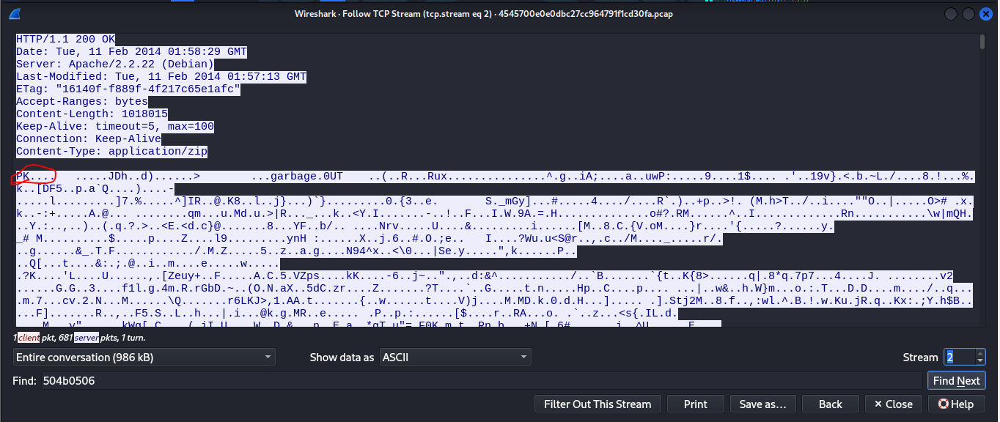
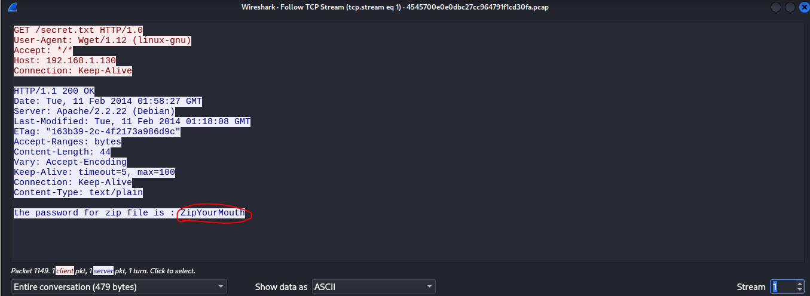
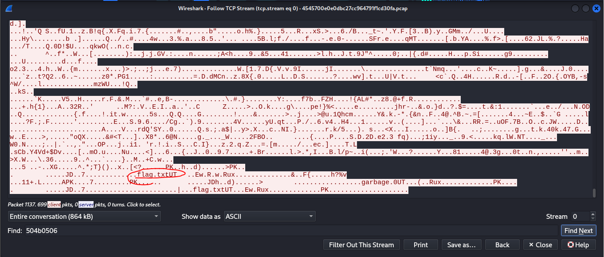
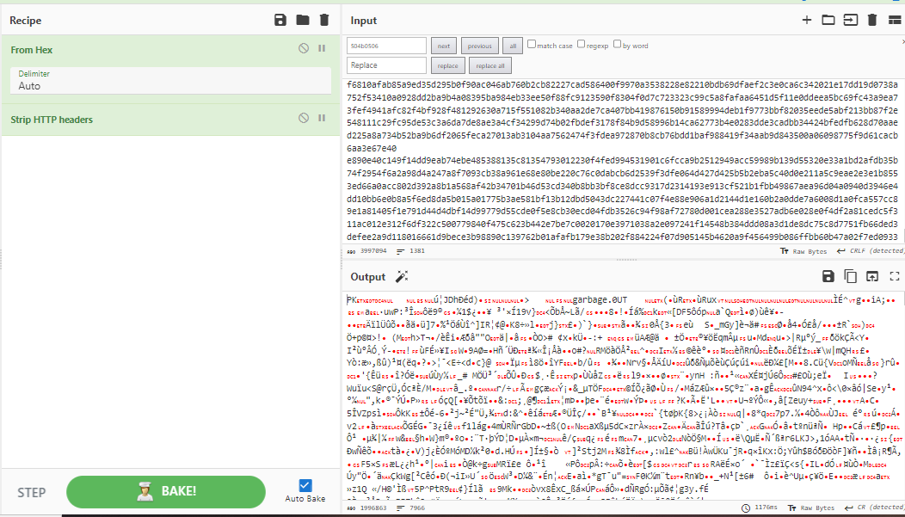

## Link challenge 
> https://ringzer0ctf.com/challenges/35
## Solution 
- I check TCP stream and I seen hex 504b0506 => It is file PKzip
- 
- And password file zip 
- 
- And missing part of the file have file flag.txt
- 
- I check time of each stream, I see stream 3 comes before stream 1
- I used CyberChef to recover file zip 
- 
- Open file with password, I got flag 
> Flag : Flag-qscet5234diQ
