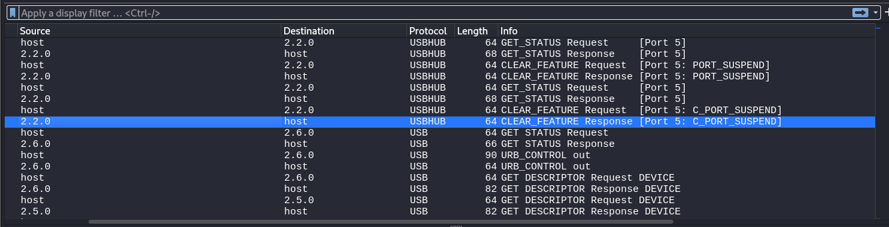

## Link challenge 
> https://ringzer0ctf.com/challenges/12
## Solution 
- Fistly, I open file with wireshark. I seen so many protocol usb and usb hub
- 
- And in info = urb_interrub in have `Leftover Capture Data`, I will get data input from the user through the tool UsbKeyboardDataHacker in github
```
┌──(kali㉿kali)-[~/UsbKeyboardDataHacker]
└─$ python UsbKeyboardDataHacker.py ~/Downloads/4c27525e7a3d2e45495c6284386b4d5c.cap
[-] Unknow Key : 40
[-] Unknow Key : 40
[-] Unknow Key : 40
[+] Found : <DEL><DEL><DEL>www.google.ca<SPACE><RET>litlle<SPACE><DEL><DEL><DEL>ca<DEL><DEL><DEL><DEL><DEL><DEL>litle<SPACE>cat<SPACE>iin<SPACE>thee<SPACE>world<RET>gmail/<DEL>.coom<RET>challengegmaail.coom<RET>Flag-11234ETEH<RET>hhi<SPACE>mom,<RET>i<SPACE>lovvee<SPACE>yoou<SPACE><DEL>.<RET>bbyee<SPACE><RET>

```
- `<RET>` is return (enter)
> Flag : Flag-1234ETEH