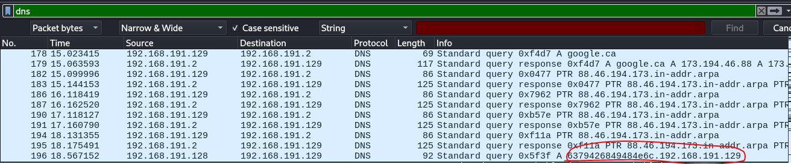
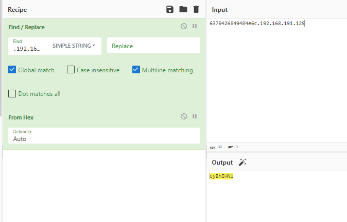
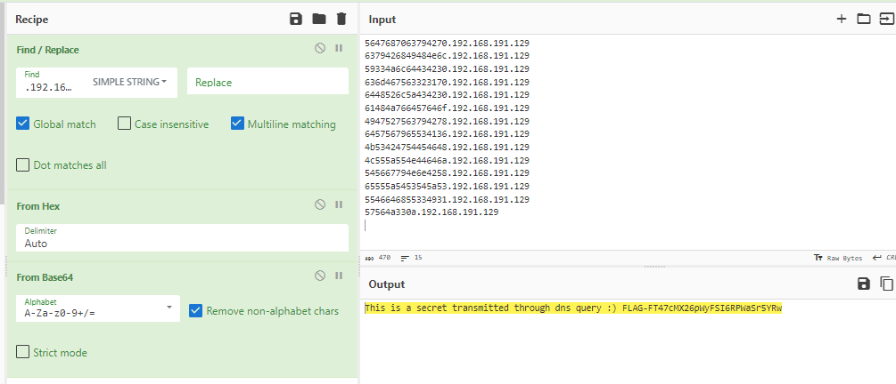

## Link challenge 
> https://ringzer0ctf.com/challenges/112
## Solution 
- After download, I check TCP stream, but no result.
- Check in turn through TCP and DNS, then I see link in dns have chunk redundant
-  
- I tried decoding with cyberchef, it seems to be part of the flag
- 
- I dump data with tshark 
> tshark -r 6338c3e33776b9844814d2daadf208bc.pcap -Y "dns && ip.src==192.168.191.128  && ip.dst==192.168.191.129 && not icmp" -T fields -e dns.qry.name | uniq 
- I used uniq to remove duplicates
- 
> Flag : FLAG-FT47cMX26pWyFSI6RPWaSr5YRw