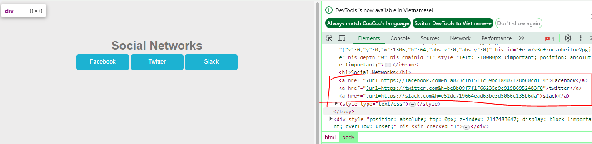
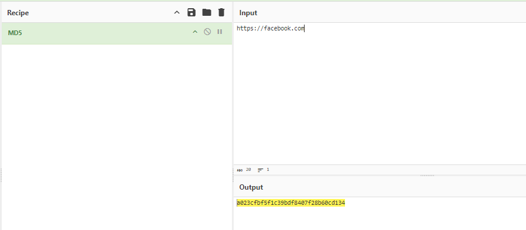

## Description 
> Find a way to make a redirection to a domain other than those showed on the web page.
## Link challenge 
> https://www.root-me.org/en/Challenges/Web-Server/HTTP-Open-redirect
## Solution 
- Khi mở trang lên, hiển thị cho ta 3 box để nhấn vào. Khi nhấn vào nó sẽ dẫn đến 1 url khác.
- 
- Xem cấu trúc của nó `?url=https://facebook.com&h=a023cfbf5f1c39bdf8407f28b60cd134`. query gọi đến sau ?url=<> là 1 đường dẫn http chuyển hướng đến, sau nữa có vẻ là hash của đường link. Kiểm tra qua cyberchef thì biết nó là md5
- 

- Bây giờ em sẽ chyển hướng đến `abc.xyz` với hash là `4726c00dbd4f44349000bce609426eb0` thì đường dẫn sẽ là `http://challenge01.root-me.org/web-serveur/ch52/?url=abc.xyz&h=4726c00dbd4f44349000bce609426eb0`
> flag là : e6f8a530811d5a479812d7b82fc1a5c5