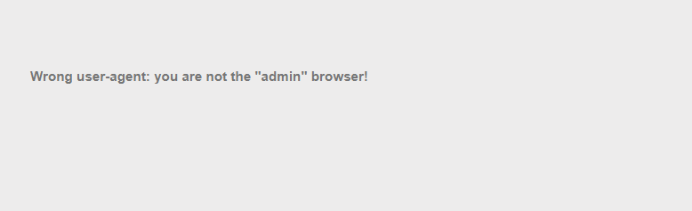
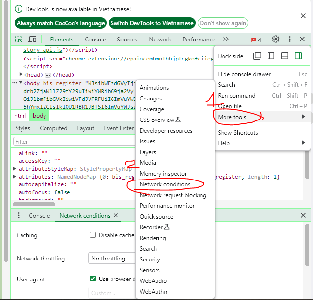
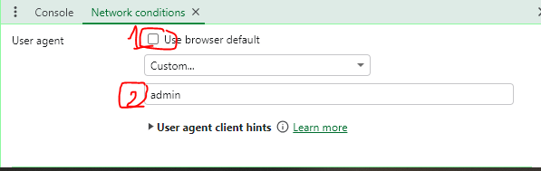
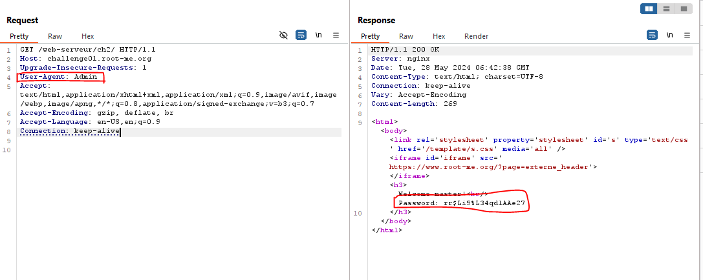

## Description
> Admin is really dumb...
## Link challenge 
> https://www.root-me.org/en/Challenges/Web-Server/HTTP-User-agent
## Solution 
- Khi mở trang lên mình thu được 1 thông báo rằng "bạn không phải admin"
- 
- Ở đây mình sẽ thay đổi user-agent thành admin để có quyền truy cập 
### Cách thứ 1 
- Bấm F12 và chọn lần lượt 
- 
- Sau đó tắt user-agent mặc định và chọn admin
- 
- Reload lại trang web, mật khẩu là :  rr$Li9%L34qd1AAe27
### Cách thứ 2 : Dùng burp suite
- 