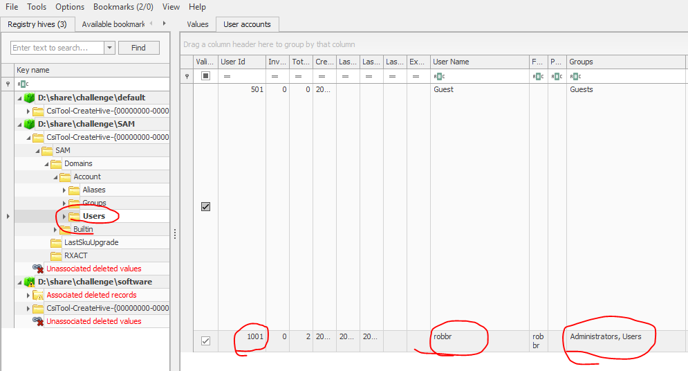
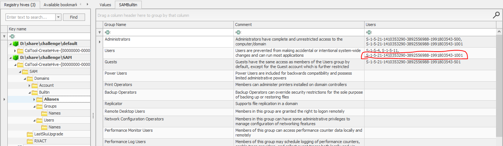

## DESCRIPTION
> A robber has broken through the Windows into the municipal bank! The civilians of the city have called upon you to identify and capture the villain.

Use your heroic forensics superpowers to find the SID of the user robbr using the Windows registry files provided!
## SOLUSION
- Baseed on description, my idea is find `user id` in hives. After check with `SID`.
```
A Security Identifier (định danh) (SID) is a unique (duy nhất) identifier that is assigned (giao) to each user, group, or computer account in a Windows operating system. It identifies and distinguishes (phân biệt) accounts within a network and helps control access to resources (tài nguyên), such as files, folders, and network resources.

Every SID consists of a series of numbers separated by dashes (dấu gạch ngang) (e.g., S-1-5-21-3977554412-3456789012-1234567890). The components (các thành phần) of a SID represent (đại diện) different pieces of information:

- The ‘S’ at the beginning is a constant indicating that it is a SID.
- The subsequent number (often 1) represents the revision level of the SID structure.
- The next set of numbers identifies the authority that issued the SID. Windows Security Authority (WSA) is typically used and is represented by 5.
- The remaining numbers uniquely identify a user or group within that authority.
```
- We wil find `user id` in `SAM\Account\Users`
- 
- We can see user robbr have` user ID` is 1001
- Continue, I check in SAM\Builtin\Aliases so see SID corresponding (tương ứng).
- 
> Flag : jctf{S-1-5-21-1410353290-3892556988-1991803543-1001}
