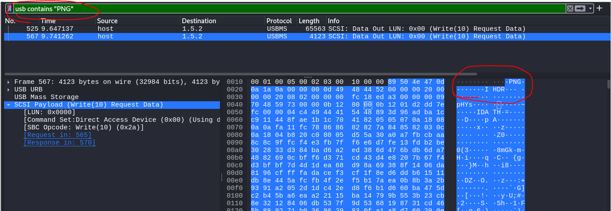
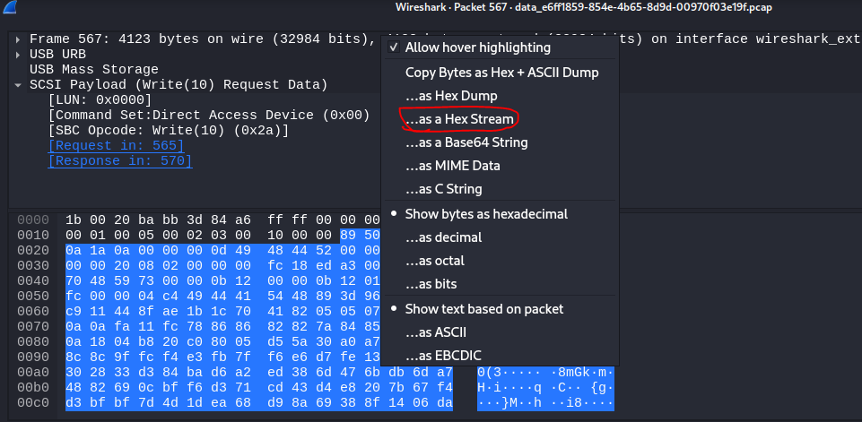
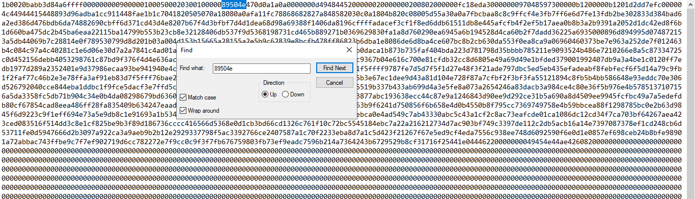
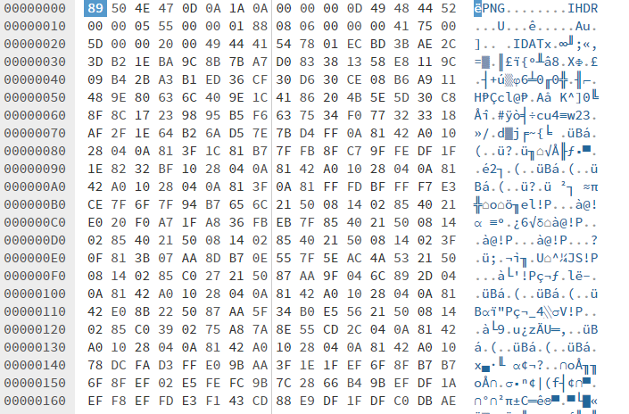

## DESCRIPTION
> It seems that there is a USB attached to the PC. But what does this all mean — what is the big picture? Search through the files in the USB to find out!
## Solusion
- Fistly, I open file and started analyzing. Based on descripttion, I find all that is relevant (liên quan) to the picture.
- On packet number 525 and 567 i find a PNG (format of file image PNG)
- 
- I show packet new windows, after extract hex data of file png.
- 
- But I only get data from 89 50 4e ...
- 

- Continue, I up to hexed.it and get file png
- 
- I have flag 
> jctf{CorrectUSB14}
- 
- Note : There are 2 photos and 1 unrelated ( không liên quan ) photo